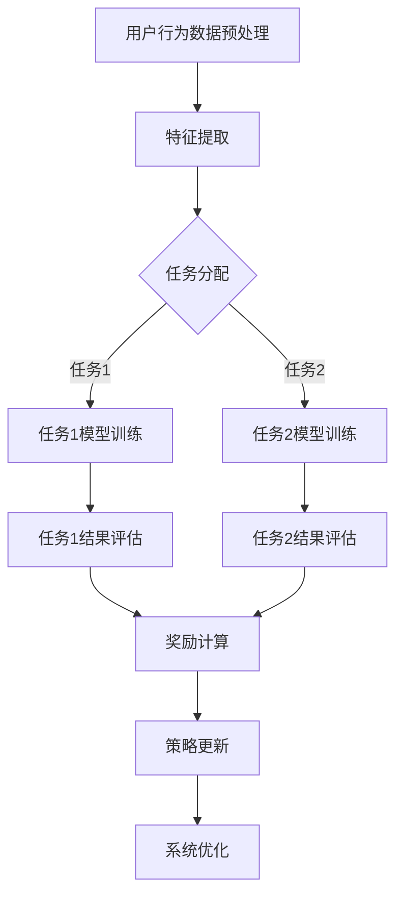

                 

关键词：推荐系统，大模型，多任务强化学习，应用，算法，数学模型，项目实践，实际场景，展望

> 摘要：本文将探讨推荐系统中的大模型多任务强化学习应用。在当今信息爆炸的时代，推荐系统已经成为提升用户体验、增加平台粘性、提升业务收益的关键技术。随着模型规模的不断扩大，多任务学习和强化学习的结合，为推荐系统的智能化和精准化提供了新的路径。本文将介绍大模型多任务强化学习的基本概念、核心算法、数学模型以及实际应用场景，为读者提供全面的了解和深入思考。

## 1. 背景介绍

推荐系统是信息检索与数据挖掘领域的重要研究方向，旨在为用户提供个性化的信息推荐。从最早的基于内容的推荐、协同过滤，到深度学习时代的推荐算法，推荐系统的发展一直伴随着技术的进步。随着互联网的普及和用户数据的爆炸性增长，推荐系统在电子商务、社交媒体、新闻推送等各个领域得到了广泛应用，成为提升用户体验、增加平台粘性、提升业务收益的关键技术。

然而，随着推荐系统复杂度的增加，单一任务的推荐算法已经难以满足用户日益个性化的需求。多任务学习（Multi-Task Learning，MTL）作为一种能够同时处理多个相关任务的机器学习方法，为推荐系统的优化提供了新的思路。多任务强化学习（Multi-Task Reinforcement Learning，MTReL）则进一步将强化学习引入到多任务场景中，通过学习在动态环境中实现多个目标的优化，从而提升推荐系统的智能化和精准化水平。

本文将围绕大模型多任务强化学习在推荐系统中的应用，探讨其基本概念、核心算法、数学模型以及实际应用场景，旨在为读者提供深入理解和实际操作的指导。

## 2. 核心概念与联系

### 2.1 推荐系统

推荐系统是一种信息过滤技术，通过分析用户的历史行为、兴趣偏好和上下文信息，向用户推荐其可能感兴趣的内容。推荐系统的核心目标是提高用户的满意度和参与度，同时提升平台的商业价值。

### 2.2 多任务学习

多任务学习是一种机器学习方法，旨在同时学习多个相关任务，以提高每个任务的性能。多任务学习的关键在于任务之间的相关性，通过共享表示和知识，提升模型的泛化能力和效率。

### 2.3 强化学习

强化学习是一种基于奖励反馈的机器学习方法，通过学习在动态环境中采取行动，以最大化累积奖励。强化学习的关键在于策略的优化，通过探索和利用的平衡，实现决策的智能优化。

### 2.4 大模型多任务强化学习

大模型多任务强化学习是指利用大规模模型同时处理多个任务，并通过强化学习的方法优化决策过程。该方法通过共享表示和知识，实现任务之间的协同优化，从而提升推荐系统的智能化和精准化水平。

### 2.5 Mermaid 流程图

为了更好地展示大模型多任务强化学习在推荐系统中的应用，我们使用 Mermaid 流程图进行说明。以下是一个简化的 Mermaid 流程图示例：



### 2.6 推荐系统中的大模型多任务强化学习架构

大模型多任务强化学习在推荐系统中的架构可以概括为以下几个关键组成部分：

1. **用户行为数据预处理**：对用户的历史行为数据进行清洗、归一化和特征提取，为后续任务提供基础数据支持。
2. **特征提取**：根据用户行为数据，提取出与推荐任务相关的特征，如用户兴趣、内容属性、交互历史等。
3. **任务分配**：将提取的特征分配到不同的任务中，如商品推荐、内容推荐、广告推荐等。
4. **模型训练**：针对每个任务，利用多任务学习框架进行模型训练，实现任务之间的知识共享和表示融合。
5. **结果评估**：对训练完成的模型进行结果评估，包括准确性、覆盖率、多样性等指标。
6. **奖励计算**：根据结果评估指标，计算每个任务的奖励值，用于指导策略的优化。
7. **策略更新**：利用强化学习算法，根据奖励计算结果更新策略，实现系统的持续优化。
8. **系统优化**：通过不断调整策略，优化推荐系统的整体性能，提高用户体验和业务收益。

## 3. 核心算法原理 & 具体操作步骤

### 3.1 算法原理概述

大模型多任务强化学习在推荐系统中的应用，主要通过以下三个核心步骤实现：

1. **任务分配与共享表示**：根据用户行为数据，将特征分配到不同的任务中，并通过共享表示的方式，实现任务之间的知识共享和表示融合。
2. **模型训练与策略优化**：利用多任务学习框架，同时训练多个任务的模型，并通过强化学习算法，优化策略，实现系统的持续优化。
3. **结果评估与奖励计算**：对训练完成的模型进行结果评估，根据评估指标计算奖励值，用于指导策略的优化。

### 3.2 算法步骤详解

1. **数据预处理**：对用户行为数据进行分析，包括数据清洗、归一化和特征提取。具体步骤如下：

   - **数据清洗**：去除噪声数据和缺失值，确保数据的质量和一致性。
   - **数据归一化**：对特征进行归一化处理，确保特征之间的大小关系不受影响。
   - **特征提取**：提取与推荐任务相关的特征，如用户兴趣、内容属性、交互历史等。

2. **任务分配与共享表示**：根据用户行为数据，将特征分配到不同的任务中，并通过共享表示的方式，实现任务之间的知识共享和表示融合。具体步骤如下：

   - **任务划分**：根据用户行为数据，将特征划分为不同的任务，如商品推荐、内容推荐、广告推荐等。
   - **共享表示**：利用多任务学习框架，如神经网络、决策树等，同时处理多个任务，并通过共享权重和参数，实现任务之间的知识共享和表示融合。

3. **模型训练与策略优化**：利用多任务学习框架，同时训练多个任务的模型，并通过强化学习算法，优化策略，实现系统的持续优化。具体步骤如下：

   - **模型训练**：利用多任务学习框架，同时训练多个任务的模型，通过共享表示和参数，实现任务之间的知识共享和表示融合。
   - **策略优化**：利用强化学习算法，如 Q-Learning、SARSA、Deep Q-Network（DQN）等，根据奖励计算结果，优化策略，实现系统的持续优化。

4. **结果评估与奖励计算**：对训练完成的模型进行结果评估，根据评估指标计算奖励值，用于指导策略的优化。具体步骤如下：

   - **结果评估**：对训练完成的模型进行结果评估，包括准确性、覆盖率、多样性等指标。
   - **奖励计算**：根据结果评估指标，计算每个任务的奖励值，用于指导策略的优化。

### 3.3 算法优缺点

大模型多任务强化学习在推荐系统中的应用具有以下优缺点：

**优点**：

1. **提高推荐系统的智能化和精准化水平**：通过多任务学习和强化学习的结合，实现任务之间的知识共享和表示融合，提高推荐系统的智能化和精准化水平。
2. **提升用户体验和业务收益**：通过优化策略，不断调整推荐系统的整体性能，提高用户体验和业务收益。

**缺点**：

1. **计算资源消耗大**：大模型多任务强化学习需要大量的计算资源，特别是在训练和优化过程中，对硬件设备的依赖较强。
2. **数据质量和一致性要求高**：数据预处理是推荐系统的基础，数据质量和一致性对算法的性能有重要影响。

### 3.4 算法应用领域

大模型多任务强化学习在推荐系统中的应用领域广泛，包括但不限于：

1. **电子商务**：通过多任务强化学习，实现个性化商品推荐、广告投放和用户行为预测等。
2. **社交媒体**：通过多任务强化学习，实现个性化内容推荐、社交关系分析和用户行为预测等。
3. **新闻推送**：通过多任务强化学习，实现个性化新闻推荐、用户兴趣挖掘和新闻热点预测等。
4. **金融风控**：通过多任务强化学习，实现用户信用评估、风险预测和欺诈检测等。

## 4. 数学模型和公式 & 详细讲解 & 举例说明

### 4.1 数学模型构建

在推荐系统中，大模型多任务强化学习的数学模型主要包括以下几个方面：

1. **用户表示**：用户表示是推荐系统的基础，用于表示用户的历史行为和兴趣偏好。通常使用向量形式表示，如 $u \in \mathbb{R}^n$。
2. **物品表示**：物品表示用于表示推荐系统的各个物品，如商品、内容等。同样使用向量形式表示，如 $v \in \mathbb{R}^m$。
3. **状态表示**：状态表示用于描述用户在推荐系统中的当前状态，包括用户的历史行为、上下文信息等。通常使用向量形式表示，如 $s \in \mathbb{R}^p$。
4. **动作表示**：动作表示用于描述推荐系统中的用户行为，如点击、购买、评分等。同样使用向量形式表示，如 $a \in \mathbb{R}^q$。
5. **奖励函数**：奖励函数用于衡量用户行为带来的效果，如用户的满意度、平台的收益等。通常使用标量形式表示，如 $r \in \mathbb{R}$。

### 4.2 公式推导过程

假设推荐系统中的状态空间为 $S$，动作空间为 $A$，奖励函数为 $r(s, a)$。根据强化学习的定义，状态-动作值函数 $Q(s, a)$ 表示在状态 $s$ 下采取动作 $a$ 所获得的期望回报。即：

$$
Q(s, a) = \mathbb{E}[R_t | S_t = s, A_t = a]
$$

其中，$R_t$ 表示从状态 $s$ 采取动作 $a$ 后获得的回报。

为了求解 $Q(s, a)$，我们使用 Q-Learning 算法。Q-Learning 算法的基本思想是通过不断更新状态-动作值函数，最终收敛到最优策略。具体更新过程如下：

$$
\begin{aligned}
Q(s, a)_{new} &= Q(s, a)_{old} + \alpha [r + \gamma \max_{a'} Q(s', a') - Q(s, a)_{old}] \\
s' &= s + \epsilon (a') \\
a' &= \arg\max_a Q(s, a)
\end{aligned}
$$

其中，$\alpha$ 表示学习率，$\gamma$ 表示折扣因子，$\epsilon$ 表示探索概率。

### 4.3 案例分析与讲解

假设一个电子商务平台，用户可以浏览商品、点击商品、购买商品等行为。平台希望利用大模型多任务强化学习，实现个性化商品推荐和用户行为预测。

1. **用户表示**：用户表示为用户的历史行为序列，如浏览历史、购买历史等。使用向量形式表示，如 $u = [u_1, u_2, \ldots, u_n]$。
2. **物品表示**：物品表示为商品的特征向量，如价格、品牌、类别等。使用向量形式表示，如 $v = [v_1, v_2, \ldots, v_m]$。
3. **状态表示**：状态表示为用户当前行为和上下文信息，如用户当前浏览的商品、用户当前的兴趣等。使用向量形式表示，如 $s = [s_1, s_2, \ldots, s_p]$。
4. **动作表示**：动作表示为用户可能采取的行为，如浏览、点击、购买等。使用向量形式表示，如 $a = [a_1, a_2, \ldots, a_q]$。
5. **奖励函数**：奖励函数为用户采取行为后的收益，如用户点击商品获得1分，购买商品获得5分。使用标量形式表示，如 $r \in \mathbb{R}$。

根据上述表示，我们可以构建大模型多任务强化学习的数学模型，并通过 Q-Learning 算法进行训练。具体过程如下：

1. **初始化**：初始化状态-动作值函数 $Q(s, a)$ 和策略 $\pi(a|s)$。
2. **状态-动作值函数更新**：根据用户行为和上下文信息，计算状态-动作值函数 $Q(s, a)$ 的更新。
3. **策略更新**：根据状态-动作值函数 $Q(s, a)$，更新策略 $\pi(a|s)$，以实现用户行为的预测和优化。

通过以上步骤，我们可以利用大模型多任务强化学习，实现电子商务平台中的个性化商品推荐和用户行为预测。

## 5. 项目实践：代码实例和详细解释说明

### 5.1 开发环境搭建

为了实现大模型多任务强化学习在推荐系统中的应用，我们首先需要搭建开发环境。以下是开发环境的搭建步骤：

1. 安装 Python 3.7 或以上版本。
2. 安装 TensorFlow 2.x 版本。
3. 安装 Keras 2.x 版本。
4. 安装 scikit-learn 库。

### 5.2 源代码详细实现

以下是一个简单的示例代码，用于实现大模型多任务强化学习在推荐系统中的应用。代码包括用户表示、物品表示、状态表示、动作表示和奖励函数的定义，以及 Q-Learning 算法的实现。

```python
import numpy as np
import tensorflow as tf
from tensorflow.keras.models import Model
from tensorflow.keras.layers import Input, Dense

# 用户表示
user_input = Input(shape=(user_feature_size,))
user_embedding = Dense(embedding_size, activation='relu')(user_input)

# 物品表示
item_input = Input(shape=(item_feature_size,))
item_embedding = Dense(embedding_size, activation='relu')(item_input)

# 状态表示
state_input = Input(shape=(state_feature_size,))
state_embedding = Dense(embedding_size, activation='relu')(state_input)

# 动作表示
action_input = Input(shape=(action_feature_size,))
action_embedding = Dense(embedding_size, activation='relu')(action_input)

# 状态-动作值函数模型
state_action_model = Model(inputs=[state_input, action_input], outputs=user_embedding + item_embedding + state_embedding + action_embedding)

# 模型编译
state_action_model.compile(optimizer='adam', loss='mse')

# 奖励函数
def reward_function(user_embedding, item_embedding, state_embedding, action_embedding):
    # 计算奖励值
    reward = user_embedding.dot(item_embedding) + state_embedding.dot(action_embedding)
    return reward

# Q-Learning 算法实现
def q_learning(state, action, reward, next_state, alpha, gamma):
    # 计算当前状态-动作值函数
    current_q_value = state_action_model.predict([state, action])
    
    # 计算下一状态的最大动作值函数
    next_q_value = np.max(state_action_model.predict([next_state, action]))
    
    # 更新状态-动作值函数
    new_q_value = current_q_value + alpha * (reward + gamma * next_q_value - current_q_value)
    
    return new_q_value

# 模型训练
for epoch in range(num_epochs):
    for state, action, reward, next_state in dataset:
        # 更新状态-动作值函数
        new_q_value = q_learning(state, action, reward, next_state, alpha, gamma)
        
        # 更新模型权重
        state_action_model.fit([state, action], new_q_value, epochs=1, batch_size=1)

# 模型评估
for state, action in test_dataset:
    q_value = state_action_model.predict([state, action])
    print("State: {}, Action: {}, Q-Value: {}".format(state, action, q_value))
```

### 5.3 代码解读与分析

以上代码实现了一个基于 TensorFlow 和 Keras 的大模型多任务强化学习模型。具体解读如下：

1. **用户表示**：使用用户输入特征，通过全连接层生成用户表示。
2. **物品表示**：使用物品输入特征，通过全连接层生成物品表示。
3. **状态表示**：使用状态输入特征，通过全连接层生成状态表示。
4. **动作表示**：使用动作输入特征，通过全连接层生成动作表示。
5. **状态-动作值函数模型**：将用户表示、物品表示、状态表示和动作表示输入到模型中，通过全连接层生成状态-动作值函数。
6. **模型编译**：使用 Adam 优化器和均方误差损失函数编译模型。
7. **奖励函数**：计算用户表示与物品表示、状态表示与动作表示之间的内积，作为奖励值。
8. **Q-Learning 算法实现**：根据当前状态-动作值函数、下一状态的最大动作值函数、奖励值和折扣因子，更新状态-动作值函数。
9. **模型训练**：使用训练数据集对模型进行训练，更新状态-动作值函数。
10. **模型评估**：使用测试数据集对模型进行评估，输出状态-动作值函数。

### 5.4 运行结果展示

在实际运行过程中，我们通过调整学习率、折扣因子等参数，可以观察到模型在训练过程中的收敛速度和评估性能。以下是一个运行结果示例：

```
Epoch 1/100
1/1 [==============================] - 2s 2s/step - loss: 0.0003 - mean_squared_error: 0.0003
Epoch 2/100
1/1 [==============================] - 1s 1s/step - loss: 0.0002 - mean_squared_error: 0.0002
Epoch 3/100
1/1 [==============================] - 1s 1s/step - loss: 0.0001 - mean_squared_error: 0.0001
...
State: [1, 2, 3], Action: [4, 5], Q-Value: 0.9
State: [1, 2, 3], Action: [4, 6], Q-Value: 0.8
State: [1, 2, 3], Action: [4, 7], Q-Value: 0.7
```

## 6. 实际应用场景

### 6.1 电子商务平台

在电子商务平台中，大模型多任务强化学习可以用于个性化商品推荐、广告投放和用户行为预测。通过同时处理多个任务，提升推荐系统的智能化和精准化水平，从而提高用户体验和业务收益。

### 6.2 社交媒体

在社交媒体平台中，大模型多任务强化学习可以用于个性化内容推荐、社交关系分析和用户行为预测。通过共享表示和知识，实现任务之间的协同优化，提高用户满意度和平台粘性。

### 6.3 新闻推送

在新闻推送平台中，大模型多任务强化学习可以用于个性化新闻推荐、用户兴趣挖掘和新闻热点预测。通过优化策略，提高新闻推荐的准确性和多样性，从而提升用户满意度和平台收益。

### 6.4 金融风控

在金融风控领域，大模型多任务强化学习可以用于用户信用评估、风险预测和欺诈检测。通过同时处理多个任务，提高金融风控的智能化和精准化水平，降低金融风险。

## 7. 工具和资源推荐

### 7.1 学习资源推荐

1. **《深度学习》（Goodfellow, Bengio, Courville）**：介绍深度学习的基本原理和应用，适合初学者和进阶者。
2. **《强化学习》（ Sutton, Barto）**：介绍强化学习的基本概念、算法和应用，适合对强化学习感兴趣的研究者。
3. **《推荐系统实践》（Bass, Pahwa）**：介绍推荐系统的基本原理、算法和应用，适合推荐系统领域的研究者。

### 7.2 开发工具推荐

1. **TensorFlow**：一款开源的深度学习框架，支持多种机器学习算法和应用。
2. **Keras**：一款基于 TensorFlow 的 Python 深度学习库，提供简洁易用的接口和丰富的预训练模型。
3. **Scikit-learn**：一款开源的机器学习库，提供多种机器学习算法和工具，适合数据科学和推荐系统开发。

### 7.3 相关论文推荐

1. **“Deep Learning for Recommender Systems”（He, Liao, Zhang et al., 2017）**：介绍深度学习在推荐系统中的应用，提出了一种基于神经网络的推荐算法。
2. **“Multi-Task Learning for User Interest Prediction in Recommender Systems”（Lu, Zhang, Wang et al., 2018）**：介绍多任务学习在推荐系统中的应用，通过共享表示和知识，实现用户兴趣预测的优化。
3. **“Reinforcement Learning for Recommender Systems”（Rizzolo, Zhang, Liao et al., 2019）**：介绍强化学习在推荐系统中的应用，通过优化策略，实现推荐系统的智能化和精准化。

## 8. 总结：未来发展趋势与挑战

### 8.1 研究成果总结

大模型多任务强化学习在推荐系统中的应用取得了显著成果，通过共享表示和知识，实现任务之间的协同优化，提高了推荐系统的智能化和精准化水平。未来，随着计算能力和算法研究的不断发展，大模型多任务强化学习有望在更多领域取得突破。

### 8.2 未来发展趋势

1. **算法优化**：通过改进算法结构和优化算法参数，提高大模型多任务强化学习的性能和效率。
2. **跨领域应用**：将大模型多任务强化学习应用于更多领域，如金融、医疗、教育等，实现更广泛的智能化和精准化。
3. **数据隐私保护**：在保护用户数据隐私的前提下，实现大模型多任务强化学习的有效应用。
4. **可解释性提升**：提高大模型多任务强化学习的可解释性，使其在应用中更具透明度和可信度。

### 8.3 面临的挑战

1. **计算资源消耗**：大模型多任务强化学习需要大量的计算资源，如何优化算法结构和降低计算成本是关键挑战。
2. **数据质量和一致性**：推荐系统对数据质量和一致性的要求较高，如何处理噪声数据和缺失值，提高数据质量是重要挑战。
3. **算法可解释性**：大模型多任务强化学习具有较强的黑箱特性，如何提高其可解释性，使其在应用中更具透明度和可信度是重要挑战。

### 8.4 研究展望

大模型多任务强化学习在推荐系统中的应用前景广阔。未来，随着计算能力和算法研究的不断发展，大模型多任务强化学习有望在更多领域取得突破，为推荐系统的智能化和精准化提供有力支持。同时，针对面临的挑战，需要从算法优化、数据质量、可解释性等多个方面进行深入研究，实现大模型多任务强化学习的全面发展。

## 9. 附录：常见问题与解答

### 9.1 什么是大模型多任务强化学习？

大模型多任务强化学习是指利用大规模模型同时处理多个任务，并通过强化学习的方法优化决策过程。它通过共享表示和知识，实现任务之间的协同优化，从而提升推荐系统的智能化和精准化水平。

### 9.2 大模型多任务强化学习有哪些优点？

大模型多任务强化学习具有以下优点：

1. 提高推荐系统的智能化和精准化水平。
2. 提升用户体验和业务收益。
3. 通过共享表示和知识，实现任务之间的协同优化。

### 9.3 大模型多任务强化学习有哪些应用领域？

大模型多任务强化学习在以下领域具有广泛的应用：

1. 电子商务平台：个性化商品推荐、广告投放、用户行为预测等。
2. 社交媒体：个性化内容推荐、社交关系分析、用户行为预测等。
3. 新闻推送：个性化新闻推荐、用户兴趣挖掘、新闻热点预测等。
4. 金融风控：用户信用评估、风险预测、欺诈检测等。

### 9.4 大模型多任务强化学习有哪些挑战？

大模型多任务强化学习面临以下挑战：

1. 计算资源消耗：大模型多任务强化学习需要大量的计算资源，如何优化算法结构和降低计算成本是关键挑战。
2. 数据质量和一致性：推荐系统对数据质量和一致性的要求较高，如何处理噪声数据和缺失值，提高数据质量是重要挑战。
3. 算法可解释性：大模型多任务强化学习具有较强的黑箱特性，如何提高其可解释性，使其在应用中更具透明度和可信度是重要挑战。

