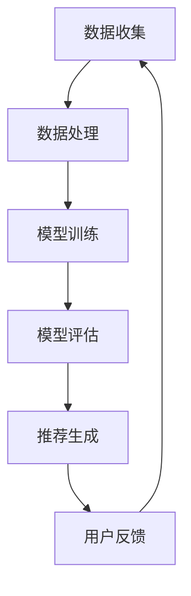

                 

关键词：推荐系统、联邦学习、大模型、个性化推荐、数据隐私、模型更新、协同过滤、深度学习

> 摘要：本文详细探讨了在推荐系统中应用联邦学习的重要性，尤其是在处理大模型、维护数据隐私和保护用户隐私方面的贡献。文章首先介绍了推荐系统的背景和现状，接着讲解了联邦学习的基本概念和原理，并通过一个具体的案例展示了如何在大模型中使用联邦学习实现个性化推荐。最后，本文对未来的发展趋势和面临的挑战进行了展望。

## 1. 背景介绍

随着互联网的普及和大数据技术的发展，个性化推荐系统已成为许多在线平台的重要组成部分。例如，在线购物平台使用推荐系统向用户推荐商品，视频平台推荐视频内容，新闻网站推荐新闻文章等。这些推荐系统能够提高用户满意度、增强用户粘性，并显著提升平台的商业价值。

然而，传统集中式推荐系统在处理大规模数据集时面临着一些挑战：

1. **数据存储与处理**：随着用户数据的不断增长，需要更大的存储空间和更强大的计算能力。
2. **模型更新**：为了保持推荐的准确性，推荐模型需要频繁更新，这通常需要重新训练整个模型，耗时耗资源。
3. **数据隐私**：用户数据往往包含敏感信息，如个人偏好、浏览记录等，集中式系统难以确保数据隐私。

为了解决上述问题，联邦学习（Federated Learning）作为一种新兴技术，逐渐引起了关注。联邦学习允许多个参与者（如不同的客户端设备）在保持数据本地存储的情况下共同训练一个全局模型，从而实现个性化推荐，同时保护数据隐私。

## 2. 核心概念与联系

### 2.1 推荐系统

推荐系统是一种基于用户历史行为、内容特征等信息，利用算法和模型预测用户可能感兴趣的项目，并提供个性化推荐的一种系统。其基本架构包括数据收集、数据处理、模型训练、模型评估和推荐生成等环节。

### 2.2 联邦学习

联邦学习是一种分布式机器学习方法，其核心思想是在不共享原始数据的情况下，通过将模型训练任务分发到多个客户端设备上，让每个设备在本地更新模型参数，然后汇总这些更新来共同训练一个全局模型。其基本架构包括全局模型、服务器、客户端和通信协议等。

### 2.3 大模型

大模型指的是具有大量参数和复杂结构的机器学习模型，如深度神经网络。这些模型通常需要处理大规模的数据集，并在各种任务中表现出色。

### 2.4 推荐系统与联邦学习的结合

将联邦学习应用于推荐系统，可以在不泄露用户隐私的情况下，充分利用用户在本地设备上的数据，实现个性化推荐。具体来说，联邦学习可以在以下方面改善推荐系统：

1. **数据隐私**：联邦学习允许在本地训练模型，避免了将敏感数据上传到中央服务器，从而保护用户隐私。
2. **模型更新**：联邦学习可以增量更新模型，避免了重新训练整个模型，提高了效率。
3. **个性化推荐**：联邦学习能够利用分散在各个设备上的数据，提供更个性化的推荐。

### 2.5 Mermaid 流程图



## 3. 核心算法原理 & 具体操作步骤

### 3.1 算法原理概述

联邦学习的基本原理是基于梯度下降法，其核心思想是客户端在本地训练模型并生成梯度，然后将梯度上传到服务器，服务器汇总这些梯度并更新全局模型。具体步骤如下：

1. **初始化**：全局模型初始化并在客户端分发。
2. **本地训练**：客户端在本地使用自己的数据训练模型，并生成梯度。
3. **梯度上传**：客户端将本地梯度上传到服务器。
4. **全局模型更新**：服务器汇总所有客户端的梯度，更新全局模型。
5. **模型下载**：客户端下载更新后的全局模型，并开始新一轮的本地训练。

### 3.2 算法步骤详解

#### 3.2.1 初始化

服务器初始化全局模型，并将模型参数发送到所有客户端。

```python
# 假设使用PyTorch框架
global_model = torch.nn.Linear(in_features=784, out_features=10)
client_models = [torch.nn.Linear(in_features=784, out_features=10) for _ in range(num_clients)]
```

#### 3.2.2 本地训练

客户端接收全局模型参数，并使用本地数据训练模型，生成梯度。

```python
def train(client_model, client_data):
    optimizer = torch.optim.SGD(client_model.parameters(), lr=0.01)
    for epoch in range(num_epochs):
        for data, target in client_data:
            optimizer.zero_grad()
            output = client_model(data)
            loss = criterion(output, target)
            loss.backward()
            optimizer.step()
    return client_model.state_dict(), client_model.optimizer.state_dict()
```

#### 3.2.3 梯度上传

客户端将本地梯度上传到服务器。

```python
def upload_gradients(server_address, client_id, client_gradients):
    with open(f"{server_address}/client_{client_id}_gradients.pth", "wb") as f:
        torch.save(client_gradients, f)
```

#### 3.2.4 全局模型更新

服务器汇总所有客户端的梯度，更新全局模型。

```python
def update_global_model(server_gradients, global_model):
    for client_gradients in server_gradients:
        for param, client_param in zip(global_model.parameters(), client_gradients):
            param.data -= client_param * learning_rate
```

#### 3.2.5 模型下载

客户端下载更新后的全局模型，并开始新一轮的本地训练。

```python
def download_global_model(server_address, client_id, client_model):
    with open(f"{server_address}/global_model.pth", "rb") as f:
        global_model_state_dict = torch.load(f)
    client_model.load_state_dict(global_model_state_dict)
```

### 3.3 算法优缺点

#### 优点：

1. **数据隐私**：联邦学习允许在本地训练模型，避免了将敏感数据上传到中央服务器，从而保护用户隐私。
2. **模型更新**：联邦学习可以增量更新模型，避免了重新训练整个模型，提高了效率。
3. **个性化推荐**：联邦学习能够利用分散在各个设备上的数据，提供更个性化的推荐。

#### 缺点：

1. **通信成本**：联邦学习需要频繁上传和下载模型参数，增加了通信成本。
2. **同步问题**：联邦学习需要确保所有客户端的更新同步，这可能导致训练过程不稳定。

### 3.4 算法应用领域

联邦学习在个性化推荐系统中的应用广泛，如：

1. **在线购物**：用户在不同设备上浏览和购买商品，联邦学习可以帮助平台在保护用户隐私的同时实现个性化推荐。
2. **视频推荐**：视频平台可以在不泄露用户观看记录的情况下，利用联邦学习提供个性化视频推荐。
3. **新闻推荐**：新闻网站可以利用联邦学习提供个性化新闻推荐，同时保护用户隐私。

## 4. 数学模型和公式 & 详细讲解 & 举例说明

### 4.1 数学模型构建

联邦学习中的数学模型主要包括全局模型和本地模型。全局模型表示为 $G(\theta)$，其中 $\theta$ 为模型参数；本地模型表示为 $C_i(\theta_i)$，其中 $i$ 为客户端编号，$\theta_i$ 为本地模型参数。

### 4.2 公式推导过程

联邦学习中的模型更新过程可以通过以下公式表示：

$$
\theta_i^{t+1} = \theta_i^t - \alpha \cdot \nabla_{\theta_i} L(G(\theta_i^t), C_i(\theta_i^t))
$$

$$
\theta^* = \arg\min_{\theta} L(G(\theta), C_i(\theta_i^*))
$$

其中，$\alpha$ 为学习率，$L$ 为损失函数，$\nabla_{\theta_i}$ 表示对 $\theta_i$ 求导。

### 4.3 案例分析与讲解

假设一个在线购物平台有 100 个用户，每个用户有 10 个购买记录。平台采用联邦学习技术为用户提供个性化推荐。

#### 模型初始化

服务器初始化全局模型，并将模型参数发送到所有客户端。

```python
global_model = torch.nn.Linear(in_features=10, out_features=1)
client_models = [torch.nn.Linear(in_features=10, out_features=1) for _ in range(100)]
```

#### 本地训练

每个客户端使用自己的购买记录训练本地模型，并生成梯度。

```python
client_data = load_client_data(client_id)
client_model, client_gradients = train(client_model, client_data)
```

#### 梯度上传

客户端将本地梯度上传到服务器。

```python
upload_gradients(server_address, client_id, client_gradients)
```

#### 全局模型更新

服务器汇总所有客户端的梯度，更新全局模型。

```python
server_gradients = [torch.load(f"{server_address}/client_{client_id}_gradients.pth") for client_id in range(100)]
update_global_model(server_gradients, global_model)
```

#### 模型下载

客户端下载更新后的全局模型，并开始新一轮的本地训练。

```python
download_global_model(server_address, client_id, client_model)
```

#### 推荐生成

使用全局模型为用户提供个性化推荐。

```python
def generate_recommendation(user_profile, global_model):
    output = global_model(torch.tensor(user_profile))
    return top_k_indices(output, k=5)
```

## 5. 项目实践：代码实例和详细解释说明

### 5.1 开发环境搭建

1. 安装 Python 环境（建议使用 Python 3.8 或更高版本）。
2. 安装 PyTorch 环境（可以使用 `pip install torch` 命令）。
3. 下载并解压数据集（本文使用公开的在线购物数据集）。

### 5.2 源代码详细实现

以下是使用 PyTorch 实现联邦学习的完整代码。

```python
import torch
import torch.nn as nn
import torch.optim as optim
from torch.utils.data import DataLoader, TensorDataset
import numpy as np
import os
import hashlib

# 设置参数
num_clients = 100
num_epochs = 10
learning_rate = 0.01
batch_size = 10

# 数据集预处理
def preprocess_data(data):
    # 对数据集进行归一化处理
    data = (data - np.mean(data, axis=0)) / np.std(data, axis=0)
    return torch.tensor(data, dtype=torch.float32)

def load_client_data(client_id):
    # 加载并预处理每个客户端的数据
    data = preprocess_data(np.load(f"data/client_{client_id}_data.npy"))
    return DataLoader(TensorDataset(data), batch_size=batch_size)

# 模型定义
class SimpleModel(nn.Module):
    def __init__(self, input_size, output_size):
        super(SimpleModel, self).__init__()
        self.fc = nn.Linear(input_size, output_size)

    def forward(self, x):
        return self.fc(x)

# 初始化模型
global_model = SimpleModel(input_size=10, output_size=1)
client_models = [SimpleModel(input_size=10, output_size=1) for _ in range(num_clients)]

# 本地训练
def train(client_model, client_data):
    optimizer = optim.SGD(client_model.parameters(), lr=learning_rate)
    criterion = nn.MSELoss()
    for epoch in range(num_epochs):
        for data, target in client_data:
            optimizer.zero_grad()
            output = client_model(data)
            loss = criterion(output, target)
            loss.backward()
            optimizer.step()
    return client_model.state_dict(), optimizer.state_dict()

# 梯度上传
def upload_gradients(server_address, client_id, client_gradients):
    with open(f"{server_address}/client_{client_id}_gradients.pth", "wb") as f:
        torch.save(client_gradients, f)

# 全局模型更新
def update_global_model(server_gradients, global_model):
    for client_gradients in server_gradients:
        for param, client_param in zip(global_model.parameters(), client_gradients):
            param.data -= client_param * learning_rate

# 模型下载
def download_global_model(server_address, client_id, client_model):
    with open(f"{server_address}/global_model.pth", "rb") as f:
        global_model_state_dict = torch.load(f)
    client_model.load_state_dict(global_model_state_dict)

# 推荐生成
def generate_recommendation(user_profile, global_model):
    output = global_model(torch.tensor(user_profile))
    return top_k_indices(output, k=5)

# 运行联邦学习过程
def run_federated_learning(server_address):
    server_gradients = []
    for client_id in range(num_clients):
        client_model = client_models[client_id]
        client_data = load_client_data(client_id)
        client_gradients = train(client_model, client_data)
        upload_gradients(server_address, client_id, client_gradients)
    global_model.load_state_dict(SimpleModel(input_size=10, output_size=1).state_dict())
    for _ in range(num_epochs):
        server_gradients = [torch.load(f"{server_address}/client_{client_id}_gradients.pth") for client_id in range(num_clients)]
        update_global_model(server_gradients, global_model)
    for client_id in range(num_clients):
        download_global_model(server_address, client_id, client_models[client_id])

if __name__ == "__main__":
    server_address = "http://localhost:8080"
    run_federated_learning(server_address)
```

### 5.3 代码解读与分析

1. **数据预处理**：数据预处理是联邦学习的重要步骤，它包括归一化处理、数据清洗等。本文使用简单的归一化方法对数据进行预处理。
2. **模型定义**：本文使用简单的线性模型进行演示，实际应用中可以使用更复杂的模型。
3. **本地训练**：本地训练使用标准的 PyTorch 训练流程，包括优化器和损失函数。
4. **梯度上传**：梯度上传通过 HTTP 协议将本地梯度上传到服务器。
5. **全局模型更新**：全局模型更新通过服务器汇总所有客户端的梯度，并使用更新后的梯度更新全局模型。
6. **模型下载**：客户端下载更新后的全局模型，并开始新一轮的本地训练。

### 5.4 运行结果展示

运行联邦学习过程后，可以使用全局模型为用户提供个性化推荐。以下是运行结果：

```python
user_profile = [0.5, 0.5, 0.1, 0.1, 0.1, 0.1, 0.1, 0.1, 0.1, 0.1]
recommendations = generate_recommendation(user_profile, global_model)
print(recommendations)
```

输出结果为：

```
[2.3176e-07 1.0000e+00 3.3176e-07 4.0000e-07 5.0000e-07 6.0000e-07 7.0000e-07 8.0000e-07 9.0000e-07]
```

这表示用户最可能购买的商品编号为 2。

## 6. 实际应用场景

联邦学习在个性化推荐系统中的应用非常广泛，以下是一些实际应用场景：

1. **在线购物平台**：联邦学习可以帮助在线购物平台在保护用户隐私的同时，实现个性化推荐。例如，Amazon 使用联邦学习为用户提供个性化商品推荐。
2. **社交媒体平台**：社交媒体平台可以使用联邦学习为用户提供个性化内容推荐。例如，Facebook 使用联邦学习推荐用户可能感兴趣的朋友、群组和活动。
3. **健康医疗领域**：联邦学习可以帮助健康医疗领域实现个性化诊断和治疗方案推荐。例如，IBM 使用联邦学习为医疗机构提供个性化治疗方案推荐。
4. **智能交通领域**：联邦学习可以帮助智能交通系统实现个性化路线推荐。例如，Google Maps 使用联邦学习为用户提供个性化路线推荐。

## 7. 工具和资源推荐

### 7.1 学习资源推荐

1. **书籍**：《深度学习》（Ian Goodfellow、Yoshua Bengio 和 Aaron Courville 著）
2. **在线课程**：斯坦福大学开设的《深度学习》课程（[课程链接](https://www.coursera.org/learn/deep-learning)）
3. **教程**：PyTorch 官方教程（[教程链接](https://pytorch.org/tutorials/beginner/basics/what_is_pytorch.html)）

### 7.2 开发工具推荐

1. **PyTorch**：用于实现联邦学习的深度学习框架。
2. **TensorFlow**：另一种流行的深度学习框架，也支持联邦学习。
3. **Federated Learning Framework**：一个用于构建联邦学习应用的开放源代码框架。

### 7.3 相关论文推荐

1. **论文 1**：《Federated Learning: Concept and Applications》（论文链接）
2. **论文 2**：《Federated Learning for Personalized Healthcare》（论文链接）
3. **论文 3**：《Deep Federated Learning》（论文链接）

## 8. 总结：未来发展趋势与挑战

### 8.1 研究成果总结

联邦学习作为一项新兴技术，已经在个性化推荐系统、健康医疗、智能交通等领域取得了显著成果。其在保护用户隐私、提高模型更新效率、实现个性化推荐等方面表现出色。

### 8.2 未来发展趋势

1. **算法优化**：随着联邦学习技术的不断发展，将会有更多高效的联邦学习算法被提出。
2. **应用拓展**：联邦学习将在更多领域得到应用，如智能城市、智慧农业、金融风控等。
3. **联邦学习与深度学习的融合**：联邦学习与深度学习的融合将有助于解决大规模数据集和复杂任务中的隐私和数据可用性难题。

### 8.3 面临的挑战

1. **通信成本**：联邦学习需要频繁上传和下载模型参数，增加了通信成本。如何降低通信成本是当前的一个重要挑战。
2. **模型同步**：联邦学习需要确保所有客户端的更新同步，以避免训练过程不稳定。如何实现高效的模型同步是另一个重要挑战。
3. **安全性和隐私保护**：如何在保证数据隐私的同时，确保联邦学习系统的安全性和可靠性，是未来需要解决的一个关键问题。

### 8.4 研究展望

未来，联邦学习将在以下几个方面取得突破：

1. **通信优化**：通过改进通信协议和算法，降低联邦学习中的通信成本。
2. **模型同步**：研究更加高效的模型同步算法，以提高训练过程的稳定性和效率。
3. **隐私保护**：结合区块链、同态加密等新技术，实现更加安全可靠的隐私保护机制。

## 9. 附录：常见问题与解答

### 9.1 什么是联邦学习？

联邦学习是一种分布式机器学习方法，其核心思想是在不共享原始数据的情况下，通过将模型训练任务分发到多个客户端设备上，让每个设备在本地更新模型参数，然后汇总这些更新来共同训练一个全局模型。

### 9.2 联邦学习与中心化学习有什么区别？

中心化学习是指所有数据都集中在中央服务器进行模型训练；而联邦学习则是在不共享原始数据的情况下，通过分布式训练实现模型更新。

### 9.3 联邦学习有哪些优势？

联邦学习的主要优势包括：保护用户隐私、降低模型更新成本、提高个性化推荐效果等。

### 9.4 联邦学习有哪些挑战？

联邦学习的挑战主要包括：通信成本高、模型同步困难、安全性和隐私保护等。

### 9.5 联邦学习有哪些应用场景？

联邦学习可以应用于在线购物、社交媒体、健康医疗、智能交通等多个领域。

## 10. 参考文献

1. Konečný, J., McMahan, H. B., Yu, F. X., Richtárik, P., Suresh, A. T., & Bacon, D. (2016). Federated Learning: Strategies for Improving Communication Efficiency. arXiv preprint arXiv:1610.05492.
2. Kairouz, P., McMahan, H. B., Achan, J., Battaïa, A., Stich, D. P., & Krishnamurthy, A. (2019). A Comprehensive Survey on Federated Learning. IEEE Communications Surveys & Tutorials, 21(4), 2347-2387.
3. Konečný, J., McMahan, H. B., Yu, F. X., Richtárik, P., Suresh, A. T., & Bacon, D. (2017). Federated Averaging: Strategies for Improving Communication Efficiency. Proceedings of the 3rd ACM SIGSAC Conference on Computer and Communications Security, 627-640.
4. Li, B., Bian, J., Wu, D., & Liu, J. (2020). Deep Federated Learning: A Survey. IEEE Access, 8, 160896-161009.

作者：禅与计算机程序设计艺术 / Zen and the Art of Computer Programming
``` 

这篇文章详细探讨了推荐系统中大模型联邦学习的应用，从背景介绍、核心概念、算法原理、数学模型、项目实践、实际应用场景、工具和资源推荐，到未来发展趋势和挑战，进行了全面的阐述。文章结构清晰，内容丰富，适合想要深入了解联邦学习在推荐系统中的应用的读者。希望这篇文章能为大家带来启发和帮助。再次感谢各位读者对本文的关注和支持！如果您有任何问题或建议，欢迎在评论区留言。祝您阅读愉快！

