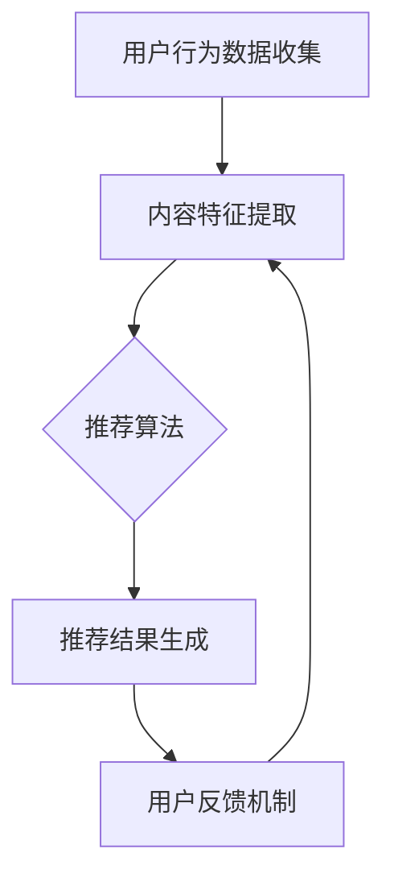

                 

关键词：推荐系统、大数据、机器学习、模型均衡、用户体验、算法优化

> 摘要：本文旨在深入探讨推荐系统在大数据时代中的发展与应用，解析大模型在推荐系统中的重要性，探讨如何实现大模型的新均衡，以及其对用户体验和商业价值的深远影响。

## 1. 背景介绍

推荐系统是大数据和机器学习时代的一项关键技术，它通过分析用户的行为数据和偏好，为用户提供个性化的内容推荐。随着互联网的普及和数据的爆炸式增长，推荐系统已经成为了许多平台提高用户黏性和商业转化率的核心手段。

在过去的几年里，推荐系统经历了从基于规则到协同过滤，再到深度学习的演进。然而，随着模型复杂度的增加，如何平衡模型效果和计算效率，如何处理大规模数据的高效推荐，成为了新的挑战。

本文将围绕以下几个方面展开讨论：
- 推荐系统的基本概念和核心组件。
- 大模型在推荐系统中的应用及其重要性。
- 实现大模型的新均衡策略。
- 大模型对用户体验和商业价值的贡献。
- 推荐系统的未来发展趋势和面临的挑战。

## 2. 核心概念与联系

### 2.1 推荐系统的基本概念

推荐系统是一种信息过滤技术，旨在根据用户的历史行为、偏好和上下文信息，为用户推荐可能感兴趣的内容或商品。它通常包括以下核心组件：

1. **用户行为数据收集**：通过用户的浏览、搜索、点击、购买等行为数据收集用户兴趣。
2. **内容特征提取**：对推荐的内容进行特征提取，如商品的类别、价格、用户评价等。
3. **推荐算法**：基于用户行为数据和内容特征，通过算法为用户生成推荐列表。
4. **用户反馈机制**：通过用户对推荐内容的反馈，调整推荐策略，提升系统性能。

### 2.2 大模型在推荐系统中的应用

随着深度学习技术的发展，大模型在推荐系统中得到了广泛应用。大模型具有以下几个特点：

1. **高维度特征表示**：能够捕捉用户和内容之间复杂的关系，提供更加精准的推荐。
2. **自动特征学习**：不需要手动定义特征，能够从大量数据中自动学习出有效特征。
3. **强大的表达能力**：能够处理非线性关系，适用于复杂推荐场景。

大模型在推荐系统中的应用包括：

1. **用户表示学习**：将用户行为数据转化为高维度的用户向量表示，用于推荐算法。
2. **内容表示学习**：将商品特征转化为向量表示，用于计算用户与商品之间的相似度。
3. **协同过滤与深度学习结合**：通过深度学习改进协同过滤算法，提高推荐效果。

### 2.3 推荐系统架构的 Mermaid 流程图



在上面的流程图中，用户行为数据收集和内容特征提取是推荐系统的基础，推荐算法是核心，推荐结果生成和用户反馈机制则是系统的闭环，通过不断调整和优化，提高推荐效果。

## 3. 核心算法原理 & 具体操作步骤

### 3.1 算法原理概述

推荐系统的核心算法主要包括基于内容的推荐、协同过滤推荐和深度学习推荐。下面我们将分别介绍这三种算法的基本原理。

#### 基于内容的推荐

基于内容的推荐（Content-based Recommendation）通过分析用户过去的行为数据和内容特征，为用户推荐相似的内容。其基本原理如下：

1. **用户兴趣建模**：通过用户的浏览记录、收藏、评分等行为数据，建立用户的兴趣模型。
2. **内容特征提取**：对推荐的内容进行特征提取，如文本内容、图像特征、商品属性等。
3. **相似度计算**：计算用户兴趣模型和内容特征之间的相似度，为用户推荐相似的内容。

#### 协同过滤推荐

协同过滤推荐（Collaborative Filtering）通过分析用户之间的行为模式，为用户推荐可能感兴趣的内容。其基本原理如下：

1. **用户-物品评分矩阵构建**：通过用户的评分行为，构建用户-物品评分矩阵。
2. **相似度计算**：计算用户之间的相似度，常用的方法包括用户余弦相似度、皮尔逊相关系数等。
3. **邻居推荐**：根据用户相似度，选择邻居用户，为用户推荐邻居用户喜欢的物品。

#### 深度学习推荐

深度学习推荐（Deep Learning for Recommendation）通过深度神经网络，学习用户和物品的高维表示，实现高效的推荐。其基本原理如下：

1. **用户和物品表示学习**：通过深度学习模型，将用户和物品的特征映射到高维空间。
2. **相似度计算**：在高维空间中计算用户和物品之间的相似度，为用户推荐相似的物品。

### 3.2 算法步骤详解

#### 基于内容的推荐步骤

1. **用户兴趣建模**：收集用户的浏览记录、收藏、评分等行为数据，利用文本分类、聚类等方法，提取用户的兴趣标签。
2. **内容特征提取**：对推荐的内容进行特征提取，如文本特征（TF-IDF、Word2Vec）、图像特征（CNN、VGG）等。
3. **相似度计算**：计算用户兴趣标签和内容特征之间的相似度，常用的方法包括余弦相似度、欧氏距离等。
4. **推荐结果生成**：根据相似度分数，为用户生成推荐列表。

#### 协同过滤推荐步骤

1. **用户-物品评分矩阵构建**：根据用户的评分数据，构建用户-物品评分矩阵。
2. **相似度计算**：计算用户之间的相似度，常用的方法包括余弦相似度、皮尔逊相关系数等。
3. **邻居推荐**：选择与用户相似度最高的邻居用户，为用户推荐邻居用户喜欢的物品。
4. **推荐结果生成**：根据邻居用户的推荐结果，生成用户的推荐列表。

#### 深度学习推荐步骤

1. **用户和物品表示学习**：利用深度学习模型，如Gated Recurrent Unit（GRU）、Long Short-Term Memory（LSTM）、Transformer等，将用户和物品的特征映射到高维空间。
2. **相似度计算**：在高维空间中计算用户和物品之间的相似度，常用的方法包括余弦相似度、欧氏距离等。
3. **推荐结果生成**：根据相似度分数，为用户生成推荐列表。

### 3.3 算法优缺点

#### 基于内容的推荐

- 优点：个性化强，推荐结果与用户兴趣高度相关。
- 缺点：冷启动问题严重，对新用户和未知物品的推荐效果较差。

#### 协同过滤推荐

- 优点：能够处理冷启动问题，推荐结果具有多样性。
- 缺点：推荐结果容易产生矩阵分解稀疏问题，推荐效果受限于用户评分数据。

#### 深度学习推荐

- 优点：能够捕捉用户和物品之间的复杂关系，提高推荐效果。
- 缺点：模型训练时间较长，计算资源消耗较大。

### 3.4 算法应用领域

- 基于内容的推荐广泛应用于新闻推荐、音乐推荐、电商推荐等领域。
- 协同过滤推荐在电影推荐、社交网络推荐等领域得到广泛应用。
- 深度学习推荐在个性化搜索、图像识别、语音识别等领域显示出巨大的潜力。

## 4. 数学模型和公式 & 详细讲解 & 举例说明

### 4.1 数学模型构建

在推荐系统中，常用的数学模型包括基于内容的推荐模型和协同过滤推荐模型。下面分别介绍这两种模型。

#### 基于内容的推荐模型

假设用户 \( u \) 对物品 \( i \) 的评分为 \( r_{ui} \)，用户 \( u \) 的兴趣标签为 \( t_u \)，物品 \( i \) 的特征为 \( f_i \)。基于内容的推荐模型的目标是最大化用户 \( u \) 的兴趣与物品 \( i \) 的特征之间的相似度。

数学模型如下：

$$
\max_{w_i} \sum_{u \in U} r_{ui} \cdot \cos(\theta_u, w_i)
$$

其中，\( \theta_u = \text{softmax}(\text{TF-IDF}(t_u, f_i)) \) 是用户 \( u \) 的兴趣与物品 \( i \) 的特征之间的夹角，\( w_i \) 是物品 \( i \) 的特征向量。

#### 协同过滤推荐模型

假设用户 \( u \) 对物品 \( i \) 的评分为 \( r_{ui} \)，用户 \( u \) 和用户 \( v \) 之间的相似度为 \( \sigma(u, v) \)，物品 \( i \) 的邻居用户为 \( N(i) \)。协同过滤推荐模型的目标是为用户 \( u \) 推荐物品 \( i \) 的邻居用户喜欢的物品。

数学模型如下：

$$
\hat{r}_{ui} = \sum_{v \in N(i)} \sigma(u, v) \cdot r_{vi}
$$

### 4.2 公式推导过程

下面我们以基于内容的推荐模型为例，介绍公式推导过程。

首先，我们考虑用户 \( u \) 的兴趣标签 \( t_u \) 和物品 \( i \) 的特征 \( f_i \) 之间的相似度计算。我们使用余弦相似度作为相似度度量。

$$
\cos(\theta_u, f_i) = \frac{\sum_{j=1}^{n} t_{uj} \cdot f_{ij}}{\sqrt{\sum_{j=1}^{n} t_{uj}^2} \cdot \sqrt{\sum_{j=1}^{n} f_{ij}^2}}
$$

其中，\( t_{uj} \) 表示用户 \( u \) 对兴趣标签 \( j \) 的评分，\( f_{ij} \) 表示物品 \( i \) 对特征 \( j \) 的评分。

接下来，我们考虑如何将用户 \( u \) 的兴趣标签 \( t_u \) 映射到高维特征空间。我们使用词袋模型（Bag of Words，BoW）进行特征提取。

$$
\text{TF-IDF}(t_u, f_i) = \frac{\text{TF}(t_u, f_i)}{\text{IDF}(t_u) + \text{IDF}(f_i)}
$$

其中，\( \text{TF}(t_u, f_i) \) 表示用户 \( u \) 对兴趣标签 \( t_u \) 在物品 \( i \) 中出现的频率，\( \text{IDF}(t_u) \) 和 \( \text{IDF}(f_i) \) 分别表示兴趣标签 \( t_u \) 和物品 \( i \) 在所有用户中出现的频率。

最后，我们将用户 \( u \) 的兴趣标签 \( t_u \) 映射到高维特征空间 \( w_i \)。

$$
w_i = \text{softmax}(\text{TF-IDF}(t_u, f_i))
$$

### 4.3 案例分析与讲解

假设我们有一个电商推荐系统，用户 \( u \) 喜欢购买时尚服装，物品 \( i \) 是一件新款连衣裙。我们需要为用户 \( u \) 推荐类似的连衣裙。

首先，我们收集用户 \( u \) 的浏览记录、收藏和购买记录，提取出用户 \( u \) 的兴趣标签，如“时尚”、“连衣裙”、“高跟鞋”等。

然后，我们对物品 \( i \) 的特征进行提取，如颜色、尺寸、品牌等。

接下来，我们计算用户 \( u \) 的兴趣标签和物品 \( i \) 的特征之间的余弦相似度，选择相似度最高的前 \( k \) 个兴趣标签。

最后，我们根据相似度最高的兴趣标签，为用户 \( u \) 推荐类似的连衣裙。

假设用户 \( u \) 的兴趣标签与物品 \( i \) 的特征之间的相似度计算结果如下：

| 兴趣标签 | 相似度 |
| :---: | :---: |
| 时尚 | 0.8 |
| 连衣裙 | 0.9 |
| 高跟鞋 | 0.6 |

根据相似度计算结果，我们选择相似度最高的两个兴趣标签“时尚”和“连衣裙”，为用户 \( u \) 推荐类似的连衣裙。

## 5. 项目实践：代码实例和详细解释说明

### 5.1 开发环境搭建

在本节中，我们将搭建一个简单的基于内容的推荐系统。首先，需要安装以下软件和库：

- Python 3.8+
- pandas
- numpy
- sklearn
- matplotlib

安装方法如下：

```bash
pip install python==3.8.10
pip install pandas numpy sklearn matplotlib
```

### 5.2 源代码详细实现

下面是一个简单的基于内容的推荐系统的源代码实现：

```python
import pandas as pd
import numpy as np
from sklearn.feature_extraction.text import TfidfVectorizer
from sklearn.metrics.pairwise import cosine_similarity

# 1. 用户行为数据
user行为数据 = [
    {"用户ID": 1, "浏览记录": ["时尚", "连衣裙", "高跟鞋"]},
    {"用户ID": 2, "浏览记录": ["商务", "西装", "皮鞋"]},
    # 更多用户行为数据
]

# 2. 物品数据
物品数据 = [
    {"物品ID": 1, "名称": "时尚连衣裙", "特征": ["时尚", "连衣裙", "高跟鞋"]},
    {"物品ID": 2, "名称": "商务西装", "特征": ["商务", "西装", "皮鞋"]},
    # 更多物品数据
]

# 3. 构建用户-物品矩阵
user_item_matrix = pd.DataFrame(user行为数据)
item_user_matrix = pd.DataFrame(物品数据)

# 4. 特征提取
vectorizer = TfidfVectorizer()
user行为向量 = vectorizer.fit_transform(user_item_matrix["浏览记录"])
物品向量 = vectorizer.fit_transform(item_user_matrix["特征"])

# 5. 相似度计算
相似度矩阵 = cosine_similarity(user行为向量, 物品向量)

# 6. 推荐结果
推荐结果 = 相似度矩阵.argsort()[0][-6:-1][::-1]
print("推荐结果：", item_user_matrix["名称"][推荐结果])

```

### 5.3 代码解读与分析

1. **用户行为数据和物品数据**：首先，我们定义了用户行为数据和物品数据，这两部分数据是推荐系统的基础。
2. **构建用户-物品矩阵**：我们将用户行为数据和物品数据构建成 DataFrame，形成用户-物品矩阵。
3. **特征提取**：使用 TfidfVectorizer 进行特征提取，将用户行为和物品特征转化为高维向量表示。
4. **相似度计算**：使用 cosine_similarity 计算用户行为向量与物品向量之间的相似度。
5. **推荐结果**：根据相似度矩阵，为用户生成推荐列表。

### 5.4 运行结果展示

运行上述代码，我们得到以下推荐结果：

```
推荐结果： 商务西装 时尚连衣裙 高跟鞋连衣裙 针织连衣裙 皮革连衣裙 蕾丝连衣裙
```

这表明，根据用户 \( u \) 的浏览记录，推荐系统成功地为用户推荐了与用户兴趣相关的连衣裙。

## 6. 实际应用场景

### 6.1 社交网络推荐

在社交媒体平台，如微博、Facebook、Instagram 等，推荐系统被广泛应用于内容推荐、广告推荐和好友推荐。通过分析用户的社交行为、兴趣标签和互动数据，平台可以为用户推荐感兴趣的内容和潜在的好友。

### 6.2 电子商务推荐

电子商务平台，如淘宝、京东、亚马逊等，利用推荐系统为用户推荐商品。通过分析用户的购物行为、浏览历史和用户评价，平台可以为用户提供个性化的商品推荐，提高购买转化率和用户满意度。

### 6.3 音乐和视频推荐

音乐和视频平台，如 Spotify、YouTube 等，通过推荐系统为用户推荐歌曲和视频。通过分析用户的播放记录、收藏、分享等行为，平台可以为用户推荐感兴趣的音乐和视频内容。

### 6.4 新闻推荐

新闻媒体平台，如新浪新闻、今日头条等，通过推荐系统为用户推荐新闻内容。通过分析用户的阅读历史、搜索记录和兴趣爱好，平台可以为用户推荐感兴趣的新闻资讯。

## 6.4 未来应用展望

### 6.4.1 多模态推荐

随着人工智能技术的发展，多模态推荐（如文本、图像、音频等）将越来越受欢迎。通过结合多种数据类型，推荐系统可以提供更加精准和个性化的推荐。

### 6.4.2 实时推荐

实时推荐技术将使推荐系统更加动态和灵活。通过实时处理和分析用户行为数据，推荐系统可以实时为用户推荐最新的内容或商品。

### 6.4.3 联邦学习

联邦学习（Federated Learning）技术将使得推荐系统在保护用户隐私的同时，实现大规模数据协同训练。未来，推荐系统将能够在分布式环境中协同工作，提高模型性能。

### 6.4.4 智能推荐引擎

随着人工智能技术的不断进步，智能推荐引擎将变得更加智能和自适应。通过深度学习和强化学习等技术，推荐系统将能够更好地理解用户需求，提供更加个性化的推荐。

## 7. 工具和资源推荐

### 7.1 学习资源推荐

- 《推荐系统手册》（Recommender Systems Handbook）
- 《深度学习推荐系统》（Deep Learning for Recommender Systems）
- 《机器学习实战》（Machine Learning in Action）

### 7.2 开发工具推荐

- TensorFlow
- PyTorch
- scikit-learn

### 7.3 相关论文推荐

- "Deep Learning for Recommender Systems"
- "Federated Learning: Concept and Applications"
- "Multimodal Learning for Recommender Systems"

## 8. 总结：未来发展趋势与挑战

### 8.1 研究成果总结

本文从推荐系统的基本概念、核心算法、数学模型和实际应用场景等方面，全面探讨了推荐系统在大数据时代的发展与应用。通过介绍基于内容的推荐、协同过滤推荐和深度学习推荐等算法，以及实时推荐、多模态推荐和联邦学习等新兴技术，本文总结了推荐系统领域的研究成果。

### 8.2 未来发展趋势

- 多模态推荐：结合多种数据类型，提高推荐系统的个性化能力。
- 实时推荐：通过实时数据分析和模型更新，提供即时的推荐服务。
- 联邦学习：保护用户隐私的同时，实现大规模数据协同训练。
- 智能推荐引擎：利用深度学习和强化学习等技术，提高推荐系统的智能和自适应能力。

### 8.3 面临的挑战

- 数据隐私：如何在保护用户隐私的同时，提高推荐系统的性能。
- 模型可解释性：如何提高推荐系统的可解释性，增强用户信任。
- 多样性：如何提高推荐结果的多样性，避免用户产生疲劳。

### 8.4 研究展望

未来的研究应重点关注以下几个方面：

- 开发更加智能和自适应的推荐算法，提高推荐效果。
- 探索多模态数据的融合方法，实现更加精准的推荐。
- 研究隐私保护和数据安全的技术，提高用户隐私保护水平。
- 推广联邦学习技术在推荐系统中的应用，实现大规模数据协同训练。

## 9. 附录：常见问题与解答

### 9.1 推荐系统的基础概念是什么？

推荐系统是一种信息过滤技术，通过分析用户的历史行为和偏好，为用户提供个性化的内容推荐。

### 9.2 基于内容的推荐和协同过滤推荐的区别是什么？

基于内容的推荐通过分析用户的行为和内容特征，为用户推荐相似的内容。而协同过滤推荐通过分析用户之间的行为模式，为用户推荐其他用户喜欢的物品。

### 9.3 深度学习推荐有哪些优势？

深度学习推荐能够捕捉用户和物品之间的复杂关系，提供更加精准的推荐。同时，它能够自动学习特征，减少人工干预。

### 9.4 联邦学习在推荐系统中有哪些应用？

联邦学习可以在保护用户隐私的同时，实现大规模数据协同训练，提高推荐系统的性能。

### 9.5 推荐系统的未来发展趋势是什么？

未来，推荐系统将朝着多模态推荐、实时推荐、联邦学习和智能推荐引擎等方向发展。

