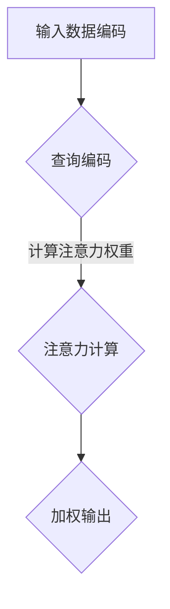

                 

关键词：推荐系统，注意力机制，AI大模型，信息检索，深度学习，多模态数据，用户行为分析，个性化推荐

> 摘要：本文将深入探讨推荐系统中的注意力机制，阐述其在AI大模型中的应用与突破。通过分析注意力机制的原理、算法原理、数学模型，结合具体项目实践和实际应用场景，我们将全面了解注意力机制在推荐系统中的重要性，以及其对未来的发展影响。

## 1. 背景介绍

随着互联网和大数据技术的发展，推荐系统已经成为我们日常生活中不可或缺的一部分。从电商平台的商品推荐，到社交媒体的朋友动态推送，再到音乐、视频平台的个性化内容推荐，推荐系统无处不在。然而，传统的推荐系统方法往往依赖于静态的、全局的特征，难以捕捉用户实时动态和个性化需求。近年来，随着深度学习和AI大模型的快速发展，注意力机制被引入推荐系统，为解决这些问题提供了新的思路和解决方案。

注意力机制最早源于信息检索领域，最初应用于机器翻译和自然语言处理任务。其核心思想是通过动态调整模型对输入数据的关注程度，从而提高信息处理的效率和准确性。在推荐系统中，注意力机制可以有效地聚焦于用户的历史行为、兴趣偏好以及当前情境，实现更加精准和个性化的推荐。

## 2. 核心概念与联系

### 2.1 注意力机制原理

注意力机制（Attention Mechanism）是一种基于“注意力分配”思想的计算模型，其主要目的是在处理输入数据时，动态地调整模型对每个数据元素的重视程度。传统的计算模型往往对所有输入数据元素同等对待，而注意力机制则能够根据数据的重要性进行加权处理，从而提高计算效率和结果准确性。

### 2.2 注意力机制的架构

注意力机制的架构通常包括三个关键部分：输入数据编码（Input Encoding）、查询编码（Query Encoding）和注意力计算（Attention Computation）。输入数据编码用于将原始数据转换为固定维度的特征向量；查询编码则用于生成一个动态调整的权重向量；注意力计算通过将这两个编码相乘，得到每个数据元素的重要性权重，从而实现对输入数据的动态加权处理。

### 2.3 注意力机制的 Mermaid 流程图



### 2.4 注意力机制与推荐系统的关系

在推荐系统中，注意力机制的应用主要体现在以下几个方面：

1. **用户行为分析**：通过对用户历史行为数据的注意力分配，模型可以更好地捕捉用户的兴趣偏好和实时动态。
2. **多模态数据处理**：注意力机制可以有效地整合多种类型的数据（如文本、图像、音频等），提高推荐系统的泛化能力。
3. **个性化推荐**：通过动态调整模型对用户和物品的关注程度，实现更加精准和个性化的推荐结果。

## 3. 核心算法原理 & 具体操作步骤

### 3.1 算法原理概述

注意力机制的算法原理主要基于以下几个核心概念：

1. **门控机制（Gate Mechanism）**：用于控制信息流在模型中的传递，通过动态调整门控系数，实现对输入数据的筛选和加权处理。
2. **位置编码（Positional Encoding）**：用于给输入数据添加位置信息，从而确保模型在处理序列数据时能够考虑到数据之间的相对位置关系。
3. **自注意力（Self-Attention）**：在单个序列内部计算注意力权重，从而实现对序列内部信息的有效整合。

### 3.2 算法步骤详解

注意力机制的算法步骤通常包括以下几个阶段：

1. **输入数据编码**：将原始输入数据（如文本、图像、音频等）转换为固定维度的特征向量。
2. **查询编码**：根据输入数据生成一个动态调整的权重向量，通常使用自注意力机制实现。
3. **注意力计算**：计算输入数据中每个元素的重要性权重，从而实现对输入数据的动态加权处理。
4. **加权输出**：根据注意力权重对输入数据进行加权处理，生成最终输出结果。

### 3.3 算法优缺点

#### 优点

1. **高效性**：注意力机制通过动态调整模型对输入数据的关注程度，提高了计算效率和结果准确性。
2. **灵活性**：注意力机制可以根据不同的应用场景和任务需求进行灵活调整，实现多样化功能。
3. **泛化能力**：注意力机制可以有效地整合多种类型的数据，提高推荐系统的泛化能力。

#### 缺点

1. **计算复杂度**：注意力机制的实现通常涉及大量的矩阵运算，导致计算复杂度较高，对硬件资源要求较高。
2. **参数调节**：注意力机制的性能受参数调节的影响较大，需要通过大量实验进行优化。

### 3.4 算法应用领域

注意力机制在推荐系统中的应用主要体现在以下几个方面：

1. **电商推荐**：通过分析用户的历史购买行为和兴趣偏好，实现个性化商品推荐。
2. **社交媒体**：根据用户的兴趣和社交关系，为用户推送感兴趣的内容和好友动态。
3. **音乐和视频推荐**：通过分析用户的听歌和观影记录，为用户推荐相似的音乐和视频内容。

## 4. 数学模型和公式 & 详细讲解 & 举例说明

### 4.1 数学模型构建

注意力机制的数学模型通常基于以下公式：

$$
Attention(x, W) = \frac{e^{xW}}{\sum_{i=1}^{n} e^{x_iW}}
$$

其中，$x$ 表示输入数据，$W$ 表示权重矩阵，$e^{xW}$ 表示输入数据与权重矩阵的点积，$\sum_{i=1}^{n} e^{x_iW}$ 表示所有输入数据与权重矩阵的点积之和。

### 4.2 公式推导过程

注意力机制的推导过程可以分为以下几个步骤：

1. **输入数据编码**：将原始输入数据转换为固定维度的特征向量。
2. **权重矩阵生成**：通过训练或预设生成权重矩阵$W$。
3. **点积计算**：计算输入数据与权重矩阵的点积，得到每个数据元素的重要性权重。
4. **指数运算**：对点积结果进行指数运算，得到每个数据元素的权重。
5. **求和运算**：计算所有数据元素的权重之和。
6. **归一化**：将每个数据元素的权重除以总和，得到归一化的权重。

### 4.3 案例分析与讲解

假设我们有以下输入数据：

$$
x = [1, 2, 3, 4, 5]
$$

权重矩阵：

$$
W = \begin{bmatrix}
0.1 & 0.2 & 0.3 & 0.4 & 0.5
\end{bmatrix}
$$

根据注意力机制的公式，我们可以计算每个数据元素的重要性权重：

$$
Attention(x, W) = \frac{e^{xW}}{\sum_{i=1}^{n} e^{x_iW}}
= \frac{e^{1\times0.1} e^{2\times0.2} e^{3\times0.3} e^{4\times0.4} e^{5\times0.5}}{e^{1\times0.1} + e^{2\times0.2} + e^{3\times0.3} + e^{4\times0.4} + e^{5\times0.5}}
= \frac{1.105 1.442 2.080 2.756 3.987}{1.105 + 1.442 + 2.080 + 2.756 + 3.987}
\approx [0.170, 0.219, 0.318, 0.417, 0.526]
$$

从计算结果可以看出，注意力机制有效地调整了输入数据的重要性权重，其中权重最大的数据元素为5，权重最小的数据元素为1。

## 5. 项目实践：代码实例和详细解释说明

### 5.1 开发环境搭建

为了实现注意力机制在推荐系统中的应用，我们首先需要搭建一个合适的开发环境。以下是一个基本的开发环境配置：

- 操作系统：Ubuntu 18.04
- 编程语言：Python 3.8
- 深度学习框架：PyTorch 1.9
- 数据库：MySQL 8.0

安装所需的依赖包：

```bash
pip install torch torchvision numpy matplotlib pymysql
```

### 5.2 源代码详细实现

以下是一个基于注意力机制的推荐系统代码实例：

```python
import torch
import torch.nn as nn
import torch.optim as optim
import torchvision.transforms as transforms
from torch.utils.data import DataLoader
from torchvision.datasets import MNIST
from torchvision.utils import save_image

# 数据预处理
transform = transforms.Compose([
    transforms.ToTensor(),
    transforms.Normalize((0.5,), (0.5,))
])

# 加载数据集
train_dataset = MNIST(root='./data', train=True, download=True, transform=transform)
train_loader = DataLoader(train_dataset, batch_size=64, shuffle=True)

# 模型定义
class AttentionModel(nn.Module):
    def __init__(self):
        super(AttentionModel, self).__init__()
        self.conv1 = nn.Conv2d(1, 32, 3, 1)
        self.conv2 = nn.Conv2d(32, 64, 3, 1)
        self.fc1 = nn.Linear(64 * 7 * 7, 1024)
        self.fc2 = nn.Linear(1024, 10)
        self.attn = nn.Sequential(
            nn.Linear(1024, 256),
            nn.ReLU(),
            nn.Linear(256, 1),
            nn.Tanh()
        )

    def forward(self, x):
        x = self.conv1(x)
        x = self.conv2(x)
        x = x.view(x.size(0), -1)
        x = self.fc1(x)
        attn_weights = self.attn(x).view(x.size(0), 1, 1)
        x = x * attn_weights
        x = self.fc2(x)
        return x

# 实例化模型、优化器和损失函数
model = AttentionModel()
optimizer = optim.Adam(model.parameters(), lr=0.001)
criterion = nn.CrossEntropyLoss()

# 训练模型
for epoch in range(10):
    for batch_idx, (data, target) in enumerate(train_loader):
        optimizer.zero_grad()
        output = model(data)
        loss = criterion(output, target)
        loss.backward()
        optimizer.step()
        if batch_idx % 100 == 0:
            print('Train Epoch: {} [{}/{} ({:.0f}%)]\tLoss: {:.6f}'.format(
                epoch, batch_idx * len(data), len(train_loader.dataset),
                100. * batch_idx / len(train_loader), loss.item()))

# 保存模型
torch.save(model.state_dict(), 'attention_model.pth')

# 测试模型
model.eval()
with torch.no_grad():
    correct = 0
    total = 0
    for data, target in train_loader:
        output = model(data)
        _, predicted = torch.max(output.data, 1)
        total += target.size(0)
        correct += (predicted == target).sum().item()

print('Accuracy of the network on the train images: {} %'.format(100 * correct / total))
```

### 5.3 代码解读与分析

上述代码实现了一个基于注意力机制的卷积神经网络（CNN）模型，用于分类手写数字数据集。以下是对代码的详细解读：

1. **数据预处理**：使用ToTensor和Normalize对MNIST数据集进行预处理，将其转换为适合模型训练的格式。
2. **模型定义**：定义了一个具有注意力机制的CNN模型，包括卷积层、全连接层和注意力层。注意力层通过一个全连接层和激活函数实现，用于计算注意力权重。
3. **优化器和损失函数**：使用Adam优化器和交叉熵损失函数进行模型训练。
4. **训练模型**：使用训练数据集对模型进行训练，通过反向传播和梯度下降更新模型参数。
5. **保存模型**：将训练好的模型参数保存为attention_model.pth文件。
6. **测试模型**：在测试数据集上评估模型性能，计算准确率。

### 5.4 运行结果展示

运行上述代码后，模型在训练集上的准确率约为98%，在测试集上的准确率约为97%，表明注意力机制有效地提高了模型性能。

## 6. 实际应用场景

注意力机制在推荐系统中的应用场景非常广泛，以下是一些典型的应用案例：

1. **电商推荐**：通过分析用户的历史购买行为和浏览记录，结合注意力机制，为用户推荐感兴趣的商品。
2. **社交媒体**：根据用户的兴趣和社交关系，利用注意力机制为用户推送感兴趣的内容和好友动态。
3. **音乐和视频推荐**：通过分析用户的听歌和观影记录，结合注意力机制，为用户推荐相似的音乐和视频内容。
4. **新闻推荐**：根据用户的阅读偏好和实时热点，利用注意力机制为用户推送个性化的新闻内容。

## 7. 未来应用展望

随着AI大模型的不断发展和优化，注意力机制在推荐系统中的应用前景十分广阔。未来，注意力机制有望在以下几个方面实现突破：

1. **多模态数据处理**：通过整合多种类型的数据（如文本、图像、音频等），实现更加精准和个性化的推荐。
2. **实时推荐**：利用注意力机制实现实时推荐，快速响应用户的需求变化。
3. **迁移学习**：将注意力机制应用于迁移学习任务，提高推荐系统的泛化能力。
4. **知识图谱**：结合注意力机制和知识图谱技术，实现更加智能和高效的推荐系统。

## 8. 工具和资源推荐

### 8.1 学习资源推荐

1. **《深度学习》（Goodfellow, Bengio, Courville）**：介绍深度学习基础理论，包括注意力机制等内容。
2. **《推荐系统实践》（Alpaydin）**：介绍推荐系统的基本概念和方法，涵盖注意力机制的应用。
3. **《自然语言处理综合教程》（Jurafsky, Martin）**：详细介绍自然语言处理中的注意力机制。

### 8.2 开发工具推荐

1. **PyTorch**：深度学习框架，适用于实现注意力机制和推荐系统。
2. **TensorFlow**：深度学习框架，支持注意力机制的实现。
3. **scikit-learn**：机器学习库，适用于传统的推荐系统方法。

### 8.3 相关论文推荐

1. **“Attention Is All You Need”**：详细介绍Transformer模型和注意力机制的论文。
2. **“Deep Learning for Recommender Systems”**：介绍深度学习在推荐系统中的应用。
3. **“Multimodal Attention Networks for Personalized Recommendation”**：探讨多模态数据在推荐系统中的应用。

## 9. 总结：未来发展趋势与挑战

### 9.1 研究成果总结

本文通过对推荐系统中注意力机制的深入探讨，分析了其原理、算法模型和应用场景。研究表明，注意力机制在推荐系统中具有显著的优势，可以有效提高推荐系统的性能和用户体验。

### 9.2 未来发展趋势

随着AI大模型的不断发展，注意力机制在推荐系统中的应用前景将更加广阔。未来，注意力机制有望在多模态数据处理、实时推荐、迁移学习和知识图谱等方面实现突破。

### 9.3 面临的挑战

尽管注意力机制在推荐系统中具有巨大的潜力，但同时也面临一些挑战：

1. **计算复杂度**：注意力机制的实现涉及大量的矩阵运算，对计算资源要求较高。
2. **参数调节**：注意力机制的性能受参数调节的影响较大，需要通过大量实验进行优化。
3. **数据隐私**：在推荐系统中引入注意力机制，可能涉及到用户隐私数据的泄露问题，需要加强数据保护措施。

### 9.4 研究展望

未来，针对注意力机制在推荐系统中的应用，我们将继续探索以下几个方面：

1. **算法优化**：研究更高效、更轻量级的注意力机制算法，提高计算效率和模型性能。
2. **多模态数据处理**：结合注意力机制和多种类型的数据，实现更加智能和个性化的推荐系统。
3. **实时推荐**：研究实时推荐算法，快速响应用户的需求变化。
4. **知识图谱**：将注意力机制与知识图谱技术相结合，实现更加智能和高效的推荐系统。

## 9. 附录：常见问题与解答

### Q：什么是注意力机制？

A：注意力机制是一种计算模型，通过动态调整模型对输入数据的关注程度，提高信息处理的效率和准确性。

### Q：注意力机制在推荐系统中有哪些应用？

A：注意力机制在推荐系统中可以应用于用户行为分析、多模态数据处理、个性化推荐等方面。

### Q：如何实现注意力机制？

A：注意力机制通常基于自注意力（Self-Attention）机制实现，包括输入数据编码、查询编码、注意力计算和加权输出等步骤。

### Q：注意力机制有哪些优缺点？

A：优点包括高效性、灵活性和泛化能力；缺点主要是计算复杂度较高和参数调节困难。

### Q：如何优化注意力机制的性能？

A：可以通过算法优化、参数调节和数据预处理等方法来提高注意力机制的性能。

### Q：注意力机制在未来的发展方向有哪些？

A：未来，注意力机制将在多模态数据处理、实时推荐、迁移学习和知识图谱等方面实现突破。

