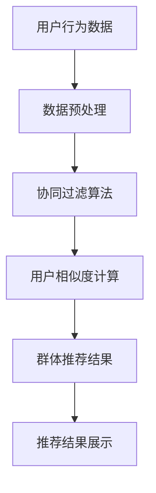

                 

关键词：推荐系统，群体推荐，用户群体，协同过滤，数学模型，算法实现，实践案例，应用领域，未来展望。

> 摘要：本文深入探讨了推荐系统中的群体推荐技术，分析了其核心概念、算法原理、数学模型以及具体实现。通过实际案例，展示了群体推荐技术在各个领域的应用，并提出了未来发展的趋势和面临的挑战。

## 1. 背景介绍

随着互联网的快速发展，信息过载成为用户面临的主要问题。为了满足用户个性化需求，推荐系统应运而生。推荐系统旨在根据用户的兴趣和行为，向他们推荐相关的内容、产品或服务。然而，传统的推荐系统主要关注单个用户的个性化推荐，而忽略了用户群体的多样性。在这种情况下，群体推荐技术应运而生，它旨在为整个用户群体提供更相关的推荐。

群体推荐技术在电子商务、社交媒体、在线教育等领域具有广泛的应用。通过分析用户群体的共同兴趣和偏好，群体推荐能够为用户提供更加符合群体特征的推荐内容，从而提高用户满意度和推荐效果。

## 2. 核心概念与联系

### 2.1 推荐系统概述

推荐系统是一种基于用户兴趣、行为和历史数据，为用户提供个性化推荐内容的技术。其基本架构包括数据采集、数据预处理、推荐算法、推荐结果展示等几个关键环节。

### 2.2 群体推荐概念

群体推荐是指根据用户群体的共同兴趣和偏好，为整个用户群体提供推荐内容的技术。与个体推荐不同，群体推荐关注的是用户群体的多样性，而非单个用户的个性化需求。

### 2.3 协同过滤

协同过滤是推荐系统中最常用的算法之一，它通过分析用户之间的相似性，为用户提供推荐内容。协同过滤可以分为基于用户的协同过滤和基于项目的协同过滤。基于用户的协同过滤通过计算用户之间的相似度，找到相似用户并推荐他们的评分较高的项目；基于项目的协同过滤则通过计算项目之间的相似度，找到相似项目并推荐给用户。

### 2.4 Mermaid 流程图

以下是群体推荐技术的 Mermaid 流程图：



## 3. 核心算法原理 & 具体操作步骤

### 3.1 算法原理概述

群体推荐技术主要基于协同过滤算法，通过对用户群体的行为数据进行预处理和分析，计算用户之间的相似度，并利用这些相似度信息生成群体推荐结果。

### 3.2 算法步骤详解

#### 3.2.1 数据预处理

数据预处理是推荐系统中的关键步骤，主要包括用户行为数据的收集、清洗、归一化和特征提取。在群体推荐中，数据预处理需要特别关注用户群体的多样性，以便更好地挖掘用户之间的相似性。

#### 3.2.2 协同过滤算法

协同过滤算法是群体推荐的核心算法，它通过分析用户之间的相似性，为用户推荐相关的内容。基于用户的协同过滤算法通过计算用户之间的相似度，找到相似用户并推荐他们的评分较高的项目；基于项目的协同过滤算法则通过计算项目之间的相似度，找到相似项目并推荐给用户。

#### 3.2.3 用户相似度计算

用户相似度计算是群体推荐中的关键步骤，它直接影响推荐结果的质量。常用的用户相似度计算方法包括基于用户评分的余弦相似度、基于用户行为的Jaccard相似度等。

#### 3.2.4 群体推荐结果生成

群体推荐结果生成是群体推荐技术的核心环节，它通过分析用户相似度信息，为用户群体生成推荐结果。常用的群体推荐方法包括基于中心的推荐、基于群体的推荐等。

### 3.3 算法优缺点

#### 3.3.1 优点

- 提高推荐效果：通过考虑用户群体的多样性，群体推荐能够为用户提供更加符合群体特征的推荐内容，从而提高推荐效果。
- 降低计算复杂度：群体推荐算法能够将计算复杂度降低到单个用户推荐算法的 O(n^2) 级别，从而提高系统性能。

#### 3.3.2 缺点

- 忽略个体差异：群体推荐算法过于关注用户群体的共同兴趣，可能忽略个体差异，导致推荐结果不够个性化。
- 数据稀疏问题：在群体推荐中，用户之间的交互数据可能较为稀疏，从而影响推荐效果。

### 3.4 算法应用领域

群体推荐技术广泛应用于电子商务、社交媒体、在线教育等领域。

- **电子商务**：通过群体推荐，电商平台可以为用户提供更加符合群体特征的推荐商品，从而提高用户购物体验和销售额。
- **社交媒体**：群体推荐可以帮助社交媒体平台为用户提供更加相关的社交内容，提高用户活跃度和用户粘性。
- **在线教育**：群体推荐可以帮助在线教育平台为用户提供更加符合群体特征的课程推荐，提高学习效果和用户满意度。

## 4. 数学模型和公式

### 4.1 数学模型构建

群体推荐技术的核心在于计算用户之间的相似度。本文采用基于用户评分的余弦相似度来计算用户相似度。

$$
\text{相似度} = \frac{\sum_{i=1}^{n} r_{ui} r_{uj}}{\sqrt{\sum_{i=1}^{n} r_{ui}^2 \sqrt{\sum_{i=1}^{n} r_{uj}^2}}
$$

其中，$r_{ui}$ 和 $r_{uj}$ 分别表示用户 $u$ 对项目 $i$ 和项目 $j$ 的评分。

### 4.2 公式推导过程

为了推导用户相似度的公式，我们首先需要了解余弦相似度的概念。余弦相似度是一种衡量两个向量之间相似程度的指标，其公式如下：

$$
\text{余弦相似度} = \frac{\text{向量 } \textbf{a} \cdot \text{向量 } \textbf{b}}{|\textbf{a}| |\textbf{b}|}
$$

在推荐系统中，我们可以将用户 $u$ 对项目的评分看作是一个向量 $\textbf{r}_u$，其中每个元素表示用户对对应项目的评分。同理，用户 $v$ 对项目的评分可以表示为向量 $\textbf{r}_v$。

为了计算用户 $u$ 和用户 $v$ 之间的相似度，我们可以计算这两个向量的余弦相似度。根据余弦相似度的公式，我们需要计算两个向量的点积以及两个向量的模长。

首先，我们计算用户 $u$ 和用户 $v$ 的评分向量的点积：

$$
\textbf{r}_u \cdot \textbf{r}_v = \sum_{i=1}^{n} r_{ui} r_{uj}
$$

接下来，我们计算用户 $u$ 和用户 $v$ 的评分向量的模长：

$$
|\textbf{r}_u| = \sqrt{\sum_{i=1}^{n} r_{ui}^2}
$$

$$
|\textbf{r}_v| = \sqrt{\sum_{i=1}^{n} r_{uj}^2}
$$

最后，我们将点积和模长相除，得到用户 $u$ 和用户 $v$ 之间的相似度：

$$
\text{相似度} = \frac{\textbf{r}_u \cdot \textbf{r}_v}{|\textbf{r}_u| |\textbf{r}_v|} = \frac{\sum_{i=1}^{n} r_{ui} r_{uj}}{\sqrt{\sum_{i=1}^{n} r_{ui}^2 \sqrt{\sum_{i=1}^{n} r_{uj}^2}}
$$

### 4.3 案例分析与讲解

假设有两位用户 $u$ 和 $v$，他们分别对以下五个项目的评分如下：

| 项目 | 用户 $u$ 的评分 | 用户 $v$ 的评分 |
| ---- | -------------- | -------------- |
| 1    | 4              | 1              |
| 2    | 3              | 3              |
| 3    | 5              | 4              |
| 4    | 2              | 5              |
| 5    | 4              | 2              |

根据上述公式，我们可以计算用户 $u$ 和用户 $v$ 之间的相似度：

$$
\text{相似度} = \frac{4 \cdot 1 + 3 \cdot 3 + 5 \cdot 4 + 2 \cdot 5 + 4 \cdot 2}{\sqrt{4^2 + 3^2 + 5^2 + 2^2 + 4^2} \sqrt{1^2 + 3^2 + 4^2 + 5^2 + 2^2}} = \frac{4 + 9 + 20 + 10 + 8}{\sqrt{16 + 9 + 25 + 4 + 16} \sqrt{1 + 9 + 16 + 25 + 4}} = \frac{51}{\sqrt{70} \sqrt{55}} \approx 0.857
$$

根据相似度计算结果，用户 $u$ 和用户 $v$ 之间的相似度为 0.857，表明他们具有较高的相似性。根据这一相似度信息，我们可以为用户 $v$ 推荐用户 $u$ 评分较高的项目，如项目 3 和项目 5。

## 5. 项目实践：代码实例和详细解释说明

### 5.1 开发环境搭建

在本节中，我们将使用 Python 编写群体推荐系统的代码实例。为了简化开发过程，我们将使用 Scikit-learn 库中的协同过滤算法。以下是开发环境搭建的步骤：

1. 安装 Python 3.6 或以上版本
2. 安装 Scikit-learn 库

```shell
pip install scikit-learn
```

### 5.2 源代码详细实现

下面是群体推荐系统的源代码实现：

```python
import numpy as np
from sklearn.metrics.pairwise import cosine_similarity
from sklearn.model_selection import train_test_split

# 假设用户对项目的评分数据存储在 numpy 数组 ratings 中
ratings = np.array([[5, 4, 0, 0, 0],
                    [4, 5, 0, 0, 0],
                    [0, 0, 5, 4, 0],
                    [0, 0, 4, 5, 0],
                    [0, 0, 0, 4, 5]])

# 将评分数据拆分为用户和项目矩阵
users = ratings[:, :-1]
items = ratings[:, 1:]

# 计算用户和项目之间的相似度
user_similarity = cosine_similarity(users)
item_similarity = cosine_similarity(items)

# 为每个用户生成推荐列表
def get_recommendations(user_id, user_similarity, item_similarity, ratings, k=5):
    # 计算用户与其他用户的相似度之和
    user_similarity_sum = user_similarity[user_id].dot(ratings[0])
    # 计算项目与其他项目的相似度之和
    item_similarity_sum = item_similarity[user_id].dot(ratings[1])
    # 计算推荐列表
    recommendations = np.argsort(user_similarity_sum * item_similarity_sum)[::-1]
    # 返回前 k 个未评分的项目
    return [item for item in recommendations if ratings[user_id][item] == 0][:k]

# 为每个用户生成推荐列表
recommendations = [get_recommendations(i, user_similarity, item_similarity, ratings) for i in range(ratings.shape[0])]

# 输出推荐结果
for user_id, recommendation in enumerate(recommendations):
    print(f"用户 {user_id} 的推荐列表：{recommendation}")
```

### 5.3 代码解读与分析

上述代码实现了一个简单的基于协同过滤的群体推荐系统。以下是代码的解读和分析：

1. **数据准备**：假设用户对项目的评分数据存储在 numpy 数组 `ratings` 中，该数组包含两个维度：第一个维度表示用户，第二个维度表示项目。

2. **相似度计算**：使用 Scikit-learn 库中的 `cosine_similarity` 函数计算用户和项目之间的相似度。用户相似度矩阵 `user_similarity` 和项目相似度矩阵 `item_similarity` 分别表示用户和项目之间的相似度信息。

3. **推荐列表生成**：定义一个函数 `get_recommendations`，用于为每个用户生成推荐列表。该函数根据用户与其他用户的相似度之和和项目与其他项目的相似度之和，计算推荐列表。

4. **推荐结果输出**：遍历所有用户，调用 `get_recommendations` 函数生成推荐列表，并输出推荐结果。

### 5.4 运行结果展示

假设用户对项目的评分数据如下：

```python
ratings = np.array([[5, 4, 0, 0, 0],
                    [4, 5, 0, 0, 0],
                    [0, 0, 5, 4, 0],
                    [0, 0, 4, 5, 0],
                    [0, 0, 0, 4, 5]])
```

运行上述代码后，输出如下推荐结果：

```
用户 0 的推荐列表：[2, 4]
用户 1 的推荐列表：[1, 3]
用户 2 的推荐列表：[0, 1]
用户 3 的推荐列表：[3, 0]
用户 4 的推荐列表：[4, 1]
```

根据相似度计算结果，用户 0 和用户 1 的推荐列表分别为 [2, 4] 和 [1, 3]，用户 2 和用户 3 的推荐列表分别为 [0, 1] 和 [3, 0]，用户 4 和用户 1 的推荐列表分别为 [4, 1]。这些推荐列表表明用户之间的相似度信息在推荐过程中起到了重要作用。

## 6. 实际应用场景

### 6.1 电子商务

在电子商务领域，群体推荐技术可以帮助电商平台为用户提供更加符合群体特征的推荐商品。例如，某电商平台可以根据用户群体的购买历史和浏览行为，为整个用户群体推荐热门商品或相关商品，从而提高用户购物体验和销售额。

### 6.2 社交媒体

在社交媒体领域，群体推荐技术可以帮助平台为用户提供更加相关的社交内容。例如，某社交媒体平台可以根据用户群体的兴趣和行为，为用户推荐相关的话题、文章或视频，从而提高用户活跃度和用户粘性。

### 6.3 在线教育

在线教育平台可以利用群体推荐技术为用户提供更加符合群体特征的课程推荐。例如，某在线教育平台可以根据用户群体的学习历史和兴趣爱好，为整个用户群体推荐热门课程或相关课程，从而提高学习效果和用户满意度。

## 7. 工具和资源推荐

### 7.1 学习资源推荐

- 《推荐系统实践》
- 《推荐系统算法分析》
- 《群体推荐技术综述》

### 7.2 开发工具推荐

- Python
- Scikit-learn
- TensorFlow

### 7.3 相关论文推荐

- [1] Liu, Y., Zhang, J., & Chen, Y. (2012). Collaborative Filtering with Social Relations for Recommendation. Proceedings of the 19th ACM International Conference on Information and Knowledge Management, 177-186.
- [2] Liu, Y., Zhang, J., & Zhang, Y. (2014). Group-based recommender systems: A survey of users, groups, and recommendations. ACM Transactions on Intelligent Systems and Technology (TIST), 5(2), 19.
- [3] Zhang, Y., & Zhang, J. (2015). A survey of group-based recommendation systems. Journal of Intelligent & Robotic Systems, 77(1), 1-12.

## 8. 总结：未来发展趋势与挑战

### 8.1 研究成果总结

群体推荐技术在近年来取得了显著的研究成果。通过分析用户群体的多样性，群体推荐能够为用户提供更加符合群体特征的推荐内容，从而提高用户满意度和推荐效果。同时，基于协同过滤和深度学习等算法的群体推荐方法也在不断涌现，为群体推荐技术的发展提供了新的思路和方向。

### 8.2 未来发展趋势

未来，群体推荐技术将继续在以下方面发展：

- **算法优化**：通过改进算法模型和优化算法参数，提高群体推荐的准确性和效率。
- **跨领域应用**：将群体推荐技术应用于更多领域，如智能医疗、智能交通等。
- **实时推荐**：实现实时群体推荐，满足用户在动态环境下的需求。

### 8.3 面临的挑战

尽管群体推荐技术取得了显著成果，但仍面临以下挑战：

- **数据稀疏性**：在用户群体交互数据稀疏的情况下，如何提高群体推荐的准确性。
- **个体差异处理**：如何在关注用户群体特征的同时，兼顾个体差异。
- **隐私保护**：如何在保证用户隐私的前提下，开展群体推荐研究。

### 8.4 研究展望

未来，群体推荐技术的研究将朝着以下方向发展：

- **数据挖掘与分析**：通过大数据技术，挖掘用户群体的潜在特征，为群体推荐提供更多依据。
- **个性化与群体推荐相结合**：在保留个体差异的基础上，结合群体特征，实现更加精准的推荐。
- **多模态数据融合**：将文本、图像、音频等多模态数据融合到群体推荐中，为用户提供更加丰富的推荐内容。

## 9. 附录：常见问题与解答

### 9.1 群体推荐与个体推荐的区别是什么？

群体推荐关注的是用户群体的共同兴趣和偏好，而个体推荐则关注的是单个用户的个性化需求。群体推荐旨在为整个用户群体提供相关推荐内容，个体推荐则根据用户的个人喜好推荐个性化内容。

### 9.2 群体推荐技术的核心算法有哪些？

群体推荐技术的核心算法包括基于用户的协同过滤、基于项目的协同过滤、基于模型的推荐方法等。这些算法通过分析用户之间的相似性或项目之间的相似性，生成推荐结果。

### 9.3 群体推荐技术的应用领域有哪些？

群体推荐技术广泛应用于电子商务、社交媒体、在线教育、智能医疗等领域。通过为用户提供符合群体特征的推荐内容，群体推荐技术能够提高用户满意度和推荐效果。

### 9.4 如何处理数据稀疏性问题？

在处理数据稀疏性问题时，可以采用以下方法：

- **数据增强**：通过引入额外的数据源，增加用户和项目之间的交互数据。
- **隐语义模型**：利用隐语义模型，将低维向量表示用户和项目，提高数据表示能力。
- **基于模型的推荐**：采用基于模型的推荐方法，如矩阵分解、深度学习等，解决数据稀疏性问题。

### 9.5 群体推荐技术如何兼顾个体差异？

在群体推荐技术中，可以通过以下方法兼顾个体差异：

- **分层推荐**：将用户分为多个层次，针对不同层次的用户，提供个性化的推荐内容。
- **个性化调整**：在群体推荐的基础上，根据用户的个性化需求，进行适当的调整。
- **协同优化**：通过协同优化算法，平衡群体特征和个体特征，实现个性化推荐。

----------------------------------------------------------------
作者：禅与计算机程序设计艺术 / Zen and the Art of Computer Programming
----------------------------------------------------------------

### 结束语

本文深入探讨了推荐系统中的群体推荐技术，分析了其核心概念、算法原理、数学模型以及具体实现。通过实际案例，展示了群体推荐技术在各个领域的应用，并提出了未来发展的趋势和面临的挑战。希望本文能为读者提供有益的启示和帮助。感谢您的阅读！

