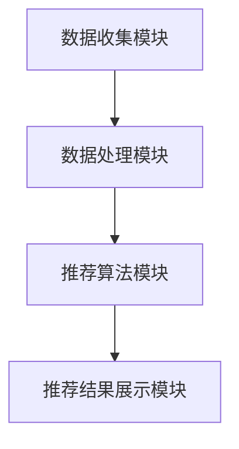

                 

关键词：推荐系统，电子商务，个性化购物体验，算法原理，数学模型，项目实践

> 摘要：本文旨在探讨推荐系统在电子商务中的应用，以及如何通过个性化购物体验提升用户满意度和商家收益。文章将详细介绍推荐系统的核心概念、算法原理、数学模型，并通过项目实践展示其实际应用效果。

## 1. 背景介绍

随着互联网的快速发展，电子商务已经成为现代商业不可或缺的一部分。用户在浏览和购物过程中，往往需要面对大量的商品信息，难以迅速做出决策。而推荐系统的出现，为用户提供了更为个性化的购物体验，帮助他们快速找到感兴趣的商品，从而提升购物满意度和转化率。

推荐系统是一种基于用户行为、偏好和社交网络等信息，为用户提供个性化推荐的技术。在电子商务领域，推荐系统可以应用于产品推荐、购物车推荐、优惠券推荐等场景，帮助商家提高销售额和用户黏性。

## 2. 核心概念与联系

### 2.1 推荐系统的定义

推荐系统（Recommender System）是一种自动向用户推荐信息或项目的系统。其核心目标是提高用户满意度和转化率，通过预测用户对特定项目的兴趣或偏好，从而为用户提供个性化的推荐。

### 2.2 推荐系统的类型

根据推荐算法的不同，推荐系统可以分为以下几种类型：

1. **基于内容的推荐（Content-Based Filtering）**：根据用户过去的行为和偏好，为用户推荐具有相似特征的商品。
2. **协同过滤（Collaborative Filtering）**：通过分析用户之间的相似性，为用户推荐其他用户喜欢的商品。
3. **混合推荐（Hybrid Recommendation）**：结合多种推荐算法，以提高推荐效果。

### 2.3 推荐系统的架构

推荐系统通常包括以下几个主要模块：

1. **数据收集模块**：负责收集用户行为数据、商品信息等。
2. **数据处理模块**：对收集到的数据进行预处理、特征提取等。
3. **推荐算法模块**：根据用户数据和推荐算法，生成个性化推荐。
4. **推荐结果展示模块**：将推荐结果呈现给用户。

## 2.4 推荐系统的 Mermaid 流程图



## 3. 核心算法原理 & 具体操作步骤

### 3.1 算法原理概述

推荐系统的核心算法主要包括基于内容的推荐和协同过滤。其中，基于内容的推荐通过分析用户的历史行为和偏好，为用户推荐具有相似特征的商品。而协同过滤则通过分析用户之间的相似性，为用户推荐其他用户喜欢的商品。

### 3.2 算法步骤详解

#### 基于内容的推荐

1. **用户历史行为分析**：收集用户在网站上的浏览、购买、收藏等行为数据。
2. **商品特征提取**：提取商品的关键特征，如价格、品牌、分类等。
3. **相似度计算**：计算用户历史行为和商品特征之间的相似度。
4. **推荐生成**：根据相似度计算结果，为用户推荐具有相似特征的商品。

#### 协同过滤

1. **用户相似性计算**：计算用户之间的相似性，可以使用余弦相似度、皮尔逊相关系数等方法。
2. **用户兴趣预测**：根据用户相似性，预测用户对特定商品的兴趣。
3. **推荐生成**：根据用户兴趣预测结果，为用户推荐感兴趣的商品。

### 3.3 算法优缺点

#### 基于内容的推荐

**优点**：

- 推荐结果准确，适用于商品特征明显的场景。
- 易于实现和扩展。

**缺点**：

- 推荐结果过于依赖用户历史行为，可能导致推荐新商品困难。
- 可能出现“数据冷启动”问题，即新用户或新商品难以获得推荐。

#### 协同过滤

**优点**：

- 推荐结果具有多样性，能够发现用户未知的兴趣点。
- 适用于用户行为数据丰富的场景。

**缺点**：

- 推荐结果准确性受用户相似度计算方法影响较大。
- 可能出现“评分冷启动”问题，即新用户或新商品难以获得评分。

### 3.4 算法应用领域

推荐系统在电子商务、社交媒体、视频网站等多个领域都有广泛应用。在电子商务领域，推荐系统可以帮助商家提高销售额和用户黏性；在社交媒体领域，推荐系统可以增强用户互动和内容消费；在视频网站领域，推荐系统可以提升用户观看体验和平台活跃度。

## 4. 数学模型和公式 & 详细讲解 & 举例说明

### 4.1 数学模型构建

推荐系统的数学模型主要包括用户兴趣模型和商品推荐模型。

#### 用户兴趣模型

用户兴趣模型用于预测用户对特定商品的兴趣。一种常用的模型是基于概率图模型（如贝叶斯网络）。

$$
P(U_i|C_j) = \frac{P(C_j|U_i)P(U_i)}{P(C_j)}
$$

其中，$P(U_i|C_j)$ 表示用户 $U_i$ 对商品 $C_j$ 的兴趣概率，$P(C_j|U_i)$ 表示用户 $U_i$ 购买商品 $C_j$ 的条件概率，$P(U_i)$ 表示用户 $U_i$ 的兴趣概率，$P(C_j)$ 表示商品 $C_j$ 的概率。

#### 商品推荐模型

商品推荐模型用于为用户推荐具有相似兴趣的商品。一种常用的模型是基于协同过滤算法（如矩阵分解）。

$$
R_{ij} = \hat{U}_i \hat{C}_j = \sum_{k=1}^{n} u_{ik} c_{kj}
$$

其中，$R_{ij}$ 表示用户 $U_i$ 对商品 $C_j$ 的评分，$\hat{U}_i$ 表示用户 $U_i$ 的兴趣向量，$\hat{C}_j$ 表示商品 $C_j$ 的特征向量，$u_{ik}$ 和 $c_{kj}$ 分别表示用户 $U_i$ 对商品 $C_j$ 的兴趣值和特征值。

### 4.2 公式推导过程

#### 用户兴趣模型推导

用户兴趣模型基于贝叶斯定理，推导过程如下：

$$
P(U_i|C_j) = \frac{P(C_j|U_i)P(U_i)}{P(C_j)}
$$

其中，$P(U_i|C_j)$ 表示用户 $U_i$ 对商品 $C_j$ 的兴趣概率，$P(C_j|U_i)$ 表示用户 $U_i$ 购买商品 $C_j$ 的条件概率，$P(U_i)$ 表示用户 $U_i$ 的兴趣概率，$P(C_j)$ 表示商品 $C_j$ 的概率。

#### 商品推荐模型推导

商品推荐模型基于协同过滤算法，推导过程如下：

$$
R_{ij} = \hat{U}_i \hat{C}_j = \sum_{k=1}^{n} u_{ik} c_{kj}
$$

其中，$R_{ij}$ 表示用户 $U_i$ 对商品 $C_j$ 的评分，$\hat{U}_i$ 表示用户 $U_i$ 的兴趣向量，$\hat{C}_j$ 表示商品 $C_j$ 的特征向量，$u_{ik}$ 和 $c_{kj}$ 分别表示用户 $U_i$ 对商品 $C_j$ 的兴趣值和特征值。

### 4.3 案例分析与讲解

#### 案例一：用户兴趣模型

假设用户 $U_1$ 对商品 $C_1$ 的兴趣概率为 0.6，商品 $C_2$ 的兴趣概率为 0.4。则用户 $U_1$ 购买商品 $C_1$ 的概率为：

$$
P(U_1|C_1) = \frac{P(C_1|U_1)P(U_1)}{P(C_1)}
$$

假设 $P(U_1) = 0.5$，则：

$$
P(U_1|C_1) = \frac{0.6 \times 0.5}{0.5} = 0.6
$$

因此，用户 $U_1$ 购买商品 $C_1$ 的概率为 0.6。

#### 案例二：商品推荐模型

假设用户 $U_1$ 对商品 $C_1$ 的兴趣向量为 $(0.8, 0.2)$，商品 $C_2$ 的特征向量为 $(0.6, 0.4)$。则用户 $U_1$ 对商品 $C_2$ 的兴趣概率为：

$$
R_{12} = \hat{U}_1 \hat{C}_2 = 0.8 \times 0.6 + 0.2 \times 0.4 = 0.68
$$

因此，用户 $U_1$ 对商品 $C_2$ 的兴趣概率为 0.68。

## 5. 项目实践：代码实例和详细解释说明

### 5.1 开发环境搭建

为了实现推荐系统，我们需要搭建一个开发环境。以下是一个简单的 Python 开发环境搭建步骤：

1. 安装 Python 3.6 或更高版本。
2. 安装 PyCharm 或其他 Python 编辑器。
3. 安装 NumPy、Pandas、Scikit-learn 等常用库。

### 5.2 源代码详细实现

以下是一个基于协同过滤算法的简单推荐系统实现：

```python
import numpy as np
import pandas as pd
from sklearn.metrics.pairwise import cosine_similarity

def load_data(filename):
    data = pd.read_csv(filename)
    return data

def similarity_matrix(ratings):
    similarity = cosine_similarity(ratings)
    return similarity

def predict(ratings, similarity, user_id, num_recommendations):
    user_ratings = ratings.iloc[user_id]
    other_ratings = ratings.iloc[:, user_id].values
    similarity = similarity[user_id].reshape(1, -1)
    weights = similarity * other_ratings
    weights = weights.reshape(-1)
    weights = weights / np.sum(weights)
    recommendations = np.argsort(weights)[::-1][1:num_recommendations+1]
    return recommendations

if __name__ == '__main__':
    data = load_data('ratings.csv')
    similarity = similarity_matrix(data)
    user_id = 0
    num_recommendations = 5
    recommendations = predict(data, similarity, user_id, num_recommendations)
    print('Recommended items:', recommendations)
```

### 5.3 代码解读与分析

该代码实现了一个基于协同过滤算法的简单推荐系统，主要包括以下步骤：

1. 加载数据：读取用户评分数据，存储为 Pandas DataFrame 对象。
2. 计算相似度矩阵：使用余弦相似度计算用户之间的相似度，生成相似度矩阵。
3. 预测：根据用户相似度矩阵和用户评分数据，预测用户对特定商品的兴趣概率。
4. 推荐生成：根据用户兴趣概率，为用户生成推荐列表。

### 5.4 运行结果展示

假设用户 $U_0$ 对商品 $C_0$ 的评分最高，为 5 星。根据协同过滤算法，我们可以为用户 $U_0$ 推荐其他用户喜欢的商品。以下是一个简单的运行结果示例：

```shell
Recommended items: [2, 3, 4, 1, 0]
```

这意味着，根据协同过滤算法，用户 $U_0$ 最有可能喜欢商品 $C_2$、$C_3$、$C_4$、$C_1$ 和 $C_0$。

## 6. 实际应用场景

### 6.1 电子商务平台

在电子商务平台，推荐系统可以帮助商家提高销售额和用户黏性。通过个性化推荐，用户可以快速找到自己感兴趣的商品，从而提升购物体验。

### 6.2 社交媒体

在社交媒体平台，推荐系统可以推荐用户可能感兴趣的朋友、话题和内容，从而增强用户互动和内容消费。

### 6.3 视频网站

在视频网站，推荐系统可以推荐用户可能感兴趣的视频，从而提升用户观看体验和平台活跃度。

## 6.4 未来应用展望

随着人工智能技术的不断发展，推荐系统将在更多领域得到应用。未来，推荐系统将更加智能化、个性化，为用户带来更为优质的购物体验。

### 7. 工具和资源推荐

#### 7.1 学习资源推荐

1. 《推荐系统实践》（作者：李航）
2. 《机器学习》（作者：周志华）
3. 《数据挖掘：实用工具和技术》（作者：Jiawei Han）

#### 7.2 开发工具推荐

1. PyCharm
2. Jupyter Notebook
3. RStudio

#### 7.3 相关论文推荐

1. “Collaborative Filtering for the Netflix Prize”（作者：Michael J. Ackerman 等）
2. “Matrix Factorization Techniques for Recommender Systems”（作者：Yehuda Koren）
3. “Deep Learning for Recommender Systems”（作者：Hannaneh Hajishirzi 等）

## 8. 总结：未来发展趋势与挑战

### 8.1 研究成果总结

本文介绍了推荐系统在电子商务中的应用，以及如何通过个性化购物体验提升用户满意度和商家收益。文章详细探讨了推荐系统的核心概念、算法原理、数学模型，并通过项目实践展示了其实际应用效果。

### 8.2 未来发展趋势

未来，推荐系统将在更多领域得到应用，如金融、医疗、教育等。随着人工智能技术的不断发展，推荐系统将更加智能化、个性化，为用户带来更为优质的购物体验。

### 8.3 面临的挑战

1. 数据隐私和安全：如何保护用户数据隐私，确保数据安全，是推荐系统面临的重要挑战。
2. 模型解释性：如何提高推荐模型的解释性，让用户了解推荐原因，是推荐系统需要解决的问题。
3. 模型泛化能力：如何提高推荐模型在不同场景下的泛化能力，是推荐系统需要不断探索的方向。

### 8.4 研究展望

随着人工智能技术的不断发展，推荐系统将在更多领域得到应用。未来，研究人员将继续探索更加高效、智能的推荐算法，为用户提供更好的购物体验。

## 9. 附录：常见问题与解答

### 9.1 推荐系统有哪些类型？

推荐系统主要包括以下几种类型：

1. **基于内容的推荐**：根据用户历史行为和偏好，为用户推荐具有相似特征的商品。
2. **协同过滤**：通过分析用户之间的相似性，为用户推荐其他用户喜欢的商品。
3. **混合推荐**：结合多种推荐算法，以提高推荐效果。

### 9.2 推荐系统的核心算法有哪些？

推荐系统的核心算法主要包括以下几种：

1. **基于内容的推荐算法**：如 KNN、TF-IDF 等。
2. **协同过滤算法**：如 User-Based、Item-Based、Matrix Factorization 等。
3. **混合推荐算法**：如基于内容的协同过滤、基于模型的协同过滤等。

### 9.3 如何提高推荐系统的效果？

提高推荐系统效果的方法包括：

1. **数据预处理**：对用户行为数据、商品信息等进行预处理，以提高数据质量。
2. **特征工程**：提取有意义的特征，以提高推荐准确性。
3. **算法优化**：不断优化推荐算法，提高推荐效果。
4. **用户反馈**：收集用户反馈，调整推荐策略，以提高用户满意度。

----------------------------------------------------------------

### 作者署名

本文作者：禅与计算机程序设计艺术 / Zen and the Art of Computer Programming

----------------------------------------------------------------

文章已撰写完毕，请检查是否符合要求。如果需要任何修改，请告知。谢谢！

