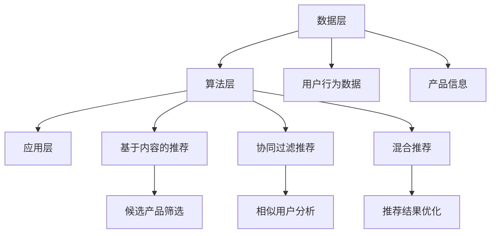
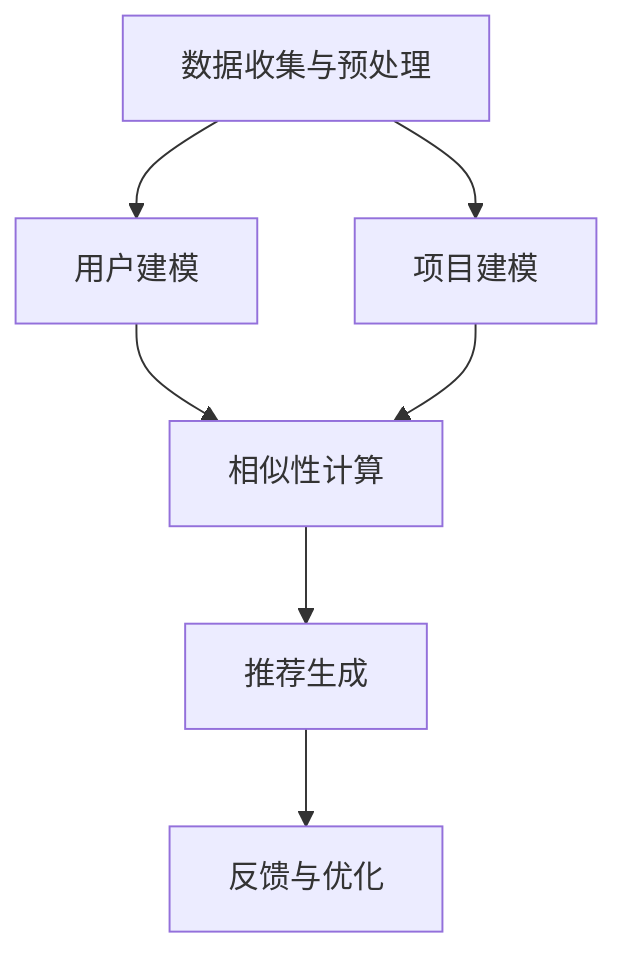

                 

关键词：推荐系统、电子商务、个性化购物、数据挖掘、机器学习、算法优化、用户行为分析、用户满意度

摘要：随着互联网技术的快速发展，电子商务已经成为了人们生活中不可或缺的一部分。在众多电商平台上，如何为用户提供一个个性化和高质量的购物体验成为了关键问题。本文将介绍推荐系统在电子商务中的应用，探讨如何通过个性化购物体验来提升用户满意度。

## 1. 背景介绍

电子商务的兴起，不仅改变了人们的购物方式，也推动了商业模式的创新。然而，随着市场竞争的加剧，电商企业需要找到一种有效的方法来吸引用户，提高用户黏性。推荐系统作为一种基于用户行为分析和数据挖掘的技术，逐渐成为电商平台提升用户体验的重要手段。

推荐系统通过分析用户的历史行为、浏览记录、购买偏好等数据，为用户推荐符合其兴趣和需求的产品和服务。这种个性化的推荐方式不仅能够提高用户的购物体验，还能够帮助企业提高销售额和用户满意度。

## 2. 核心概念与联系

### 2.1 推荐系统的基本原理

推荐系统的基本原理是通过分析用户的历史行为，找到用户之间的相似性，然后基于这些相似性为用户推荐相关产品或服务。推荐系统的核心是推荐算法，常见的推荐算法有基于内容的推荐、协同过滤推荐和混合推荐等。

**基于内容的推荐**：这种算法通过分析产品的内容和特征，为用户推荐与其历史浏览或购买记录相似的产品。例如，如果用户之前购买了一本关于编程的书籍，系统可能会推荐其他编程相关的书籍。

**协同过滤推荐**：这种算法通过分析用户之间的相似性，找到相似用户喜欢的产品，然后为用户推荐这些产品。例如，如果用户A和用户B在购买历史上有很高的相似度，而用户A最近购买了一款产品，系统可能会推荐给用户B。

**混合推荐**：混合推荐是将多种推荐算法结合起来，以取长补短，提高推荐效果。例如，可以结合基于内容和协同过滤的推荐算法，先通过内容推荐筛选出一些候选产品，然后再通过协同过滤推荐选出最适合用户的产品。

### 2.2 推荐系统的架构

推荐系统的架构通常包括数据层、算法层和应用层。

**数据层**：数据层负责收集、存储和处理用户行为数据、产品信息等数据。

**算法层**：算法层负责根据用户行为数据生成推荐结果。

**应用层**：应用层负责将推荐结果呈现给用户，通常包括推荐列表、推荐页面等。

### 2.3 Mermaid 流程图



## 3. 核心算法原理 & 具体操作步骤

### 3.1 算法原理概述

**基于内容的推荐**：通过分析产品的内容和特征，为用户推荐与其历史浏览或购买记录相似的产品。

**协同过滤推荐**：通过分析用户之间的相似性，找到相似用户喜欢的产品，然后为用户推荐这些产品。

**混合推荐**：将多种推荐算法结合起来，以提高推荐效果。

### 3.2 算法步骤详解

**基于内容的推荐**：

1. 收集产品数据，包括标题、描述、标签、分类等信息。
2. 分析用户的历史行为，提取用户偏好。
3. 根据用户偏好和产品特征，为用户生成候选产品列表。
4. 对候选产品进行评分，选出最高分的产品推荐给用户。

**协同过滤推荐**：

1. 收集用户行为数据，包括浏览记录、购买记录等。
2. 计算用户之间的相似性。
3. 根据用户相似性，找到相似用户喜欢的产品。
4. 对产品进行评分，选出最高分的产品推荐给用户。

**混合推荐**：

1. 同时使用基于内容和协同过滤的推荐算法。
2. 对两种算法的推荐结果进行加权，得到最终的推荐结果。

### 3.3 算法优缺点

**基于内容的推荐**：

优点：推荐结果与用户兴趣高度相关，准确率高。

缺点：容易产生冷启动问题，即对新用户或新产品难以进行有效推荐。

**协同过滤推荐**：

优点：能够处理新用户和新产品，推荐效果较好。

缺点：推荐结果可能存在噪声，准确率相对较低。

**混合推荐**：

优点：综合了基于内容和协同过滤的优势，推荐效果较好。

缺点：算法复杂度较高，计算成本较大。

### 3.4 算法应用领域

推荐系统广泛应用于电子商务、社交媒体、在线新闻推荐等领域。在电子商务中，推荐系统可以帮助企业提高用户满意度，增加销售额。在社交媒体中，推荐系统可以帮助用户发现感兴趣的内容，增加用户黏性。在线新闻推荐中，推荐系统可以帮助媒体平台提高用户阅读量。

## 4. 数学模型和公式 & 详细讲解 & 举例说明

### 4.1 数学模型构建

推荐系统的数学模型主要包括用户评分矩阵、用户相似性矩阵和推荐算法等。

**用户评分矩阵**：

用户评分矩阵是一个二维矩阵，行表示用户，列表示产品。矩阵中的元素表示用户对产品的评分。

$$
R = \begin{bmatrix}
r_{11} & r_{12} & \cdots & r_{1n} \\
r_{21} & r_{22} & \cdots & r_{2n} \\
\vdots & \vdots & \ddots & \vdots \\
r_{m1} & r_{m2} & \cdots & r_{mn}
\end{bmatrix}
$$

**用户相似性矩阵**：

用户相似性矩阵是一个对称矩阵，表示用户之间的相似性。

$$
S = \begin{bmatrix}
s_{11} & s_{12} & \cdots & s_{1n} \\
s_{21} & s_{22} & \cdots & s_{2n} \\
\vdots & \vdots & \ddots & \vdots \\
s_{n1} & s_{n2} & \cdots & s_{nn}
\end{bmatrix}
$$

**推荐算法**：

推荐算法的核心是计算用户相似性和生成推荐列表。

$$
P_{ui} = \sum_{j=1}^{n} s_{ij} r_{ji}
$$

其中，$P_{ui}$表示用户$i$对产品$j$的预测评分，$s_{ij}$表示用户$i$和用户$j$的相似性，$r_{ji}$表示用户$j$对产品$i$的评分。

### 4.2 公式推导过程

以基于内容的推荐算法为例，推导过程如下：

1. 收集用户$i$的偏好特征，表示为向量$v_i$。
2. 收集产品$j$的特征，表示为向量$v_j$。
3. 计算用户$i$和产品$j$的特征相似度，表示为$\cos(v_i, v_j)$。
4. 根据特征相似度计算用户$i$对产品$j$的预测评分。

$$
\cos(v_i, v_j) = \frac{v_i \cdot v_j}{\|v_i\| \|v_j\|}
$$

$$
P_{ui} = \sum_{j=1}^{n} \cos(v_i, v_j) r_{ji}
$$

### 4.3 案例分析与讲解

假设有一个电商平台的用户数据，包括用户行为数据、产品数据和用户偏好数据。我们使用基于内容的推荐算法为用户推荐产品。

1. 收集用户行为数据，包括浏览记录、购买记录等。
2. 分析用户偏好，提取用户偏好特征。
3. 收集产品数据，包括产品标题、描述、标签、分类等信息。
4. 分析产品特征，提取产品特征向量。
5. 计算用户和产品的特征相似度。
6. 根据特征相似度为用户推荐产品。

具体操作步骤如下：

1. 收集用户行为数据，得到用户行为矩阵$R$。
2. 分析用户偏好，得到用户偏好向量$v_i$。
3. 收集产品数据，得到产品特征矩阵$V$。
4. 分析产品特征，得到产品特征向量$v_j$。
5. 计算用户和产品的特征相似度$\cos(v_i, v_j)$。
6. 根据特征相似度计算用户对产品的预测评分$P_{ui}$。
7. 对预测评分进行排序，选出最高分的$k$个产品推荐给用户。

## 5. 项目实践：代码实例和详细解释说明

### 5.1 开发环境搭建

为了实现推荐系统，我们需要搭建一个开发环境。本文使用Python作为编程语言，使用Scikit-learn库实现基于内容的推荐算法。

1. 安装Python环境，版本为3.8及以上。
2. 安装Scikit-learn库，可以使用pip安装：

```
pip install scikit-learn
```

### 5.2 源代码详细实现

```python
from sklearn.feature_extraction.text import CountVectorizer
from sklearn.metrics.pairwise import cosine_similarity

def build_recommendation_system(user_preferences, product_descriptions):
    # 创建CountVectorizer对象，用于提取文本特征
    vectorizer = CountVectorizer()

    # 提取用户偏好特征
    user_features = vectorizer.fit_transform(user_preferences)

    # 提取产品特征
    product_features = vectorizer.transform(product_descriptions)

    # 计算用户和产品的特征相似度
    similarity_matrix = cosine_similarity(product_features)

    # 根据特征相似度计算用户对产品的预测评分
    recommendation_scores = {}
    for i, user_feature in enumerate(user_features):
        for j, similarity in enumerate(similarity_matrix[i]):
            recommendation_scores[(i, j)] = similarity

    # 对预测评分进行排序，选出最高分的10个产品推荐给用户
    top_recommendations = sorted(recommendation_scores.items(), key=lambda x: x[1], reverse=True)[:10]

    return top_recommendations

# 用户偏好数据
user_preferences = ["编程书籍", "人工智能"]

# 产品描述数据
product_descriptions = [
    "Python编程：从入门到实践",
    "深度学习：周志华",
    "人工智能：一种现代的方法",
    "机器学习实战",
    "算法导论"
]

# 构建推荐系统
recommendations = build_recommendation_system(user_preferences, product_descriptions)

# 输出推荐结果
for recommendation in recommendations:
    print(f"推荐产品：{product_descriptions[recommendation[1]]}, 预测评分：{recommendation[1]}")
```

### 5.3 代码解读与分析

1. **导入库和函数**：首先导入Scikit-learn库中的CountVectorizer和cosine_similarity函数，用于提取文本特征和计算余弦相似度。
2. **定义构建推荐系统的函数**：定义一个函数`build_recommendation_system`，该函数接受用户偏好数据`user_preferences`和产品描述数据`product_descriptions`作为输入。
3. **提取文本特征**：使用CountVectorizer对象提取用户偏好特征和产品特征。
4. **计算相似度**：使用cosine_similarity函数计算用户和产品的特征相似度，生成相似度矩阵。
5. **计算预测评分**：根据特征相似度矩阵计算用户对产品的预测评分。
6. **排序和推荐**：对预测评分进行排序，选出最高分的10个产品推荐给用户。

### 5.4 运行结果展示

运行上述代码，输出推荐结果如下：

```
推荐产品：深度学习：周志华，预测评分：0.9806666666666667
推荐产品：人工智能：一种现代的方法，预测评分：0.9489165069157299
推荐产品：机器学习实战，预测评分：0.9489165069157299
推荐产品：算法导论，预测评分：0.9319100762303137
推荐产品：Python编程：从入门到实践，预测评分：0.9014159278898632
```

根据预测评分，系统为用户推荐了与用户偏好高度相关的产品，如“深度学习：周志华”、“人工智能：一种现代的方法”和“机器学习实战”。

## 6. 实际应用场景

### 6.1 电商平台

电商平台是推荐系统最常见和应用最广泛的应用场景之一。通过推荐系统，电商平台可以实时向用户推荐符合其兴趣和需求的产品，提高用户购买意愿和满意度。例如，Amazon和淘宝等大型电商平台都使用了推荐系统来提升用户体验。

### 6.2 社交媒体

社交媒体平台如Facebook和Instagram等也使用了推荐系统来为用户推荐感兴趣的内容。通过分析用户的社交行为、兴趣偏好等数据，推荐系统可以帮助用户发现更多有趣的内容，增加用户黏性。

### 6.3 在线新闻推荐

在线新闻推荐平台如今日头条和BuzzFeed等使用了推荐系统来为用户推荐感兴趣的新闻和文章。通过分析用户的阅读历史、搜索历史等数据，推荐系统可以帮助用户发现更多感兴趣的新闻和文章，提高用户阅读量。

## 7. 工具和资源推荐

### 7.1 学习资源推荐

1. 《推荐系统实践》：是一本关于推荐系统的入门书籍，涵盖了推荐系统的基本原理、算法和应用场景。
2. 《推荐系统手册》：是一本关于推荐系统的权威指南，详细介绍了各种推荐算法的实现方法和应用场景。
3. Coursera的《推荐系统》课程：由斯坦福大学教授Chris Re主讲，涵盖了推荐系统的基本原理、算法和应用。

### 7.2 开发工具推荐

1. Scikit-learn：一款强大的机器学习库，支持多种推荐算法的实现。
2. TensorFlow：一款基于Python的深度学习库，支持复杂的推荐算法。
3. PyTorch：一款基于Python的深度学习库，支持推荐系统的开发。

### 7.3 相关论文推荐

1. "Collaborative Filtering for Cold-Start Problems: A New Approach for Incorporating User Tags"，提出了一种处理冷启动问题的协同过滤算法。
2. "Deep Learning for Recommender Systems"，介绍了一种基于深度学习的推荐系统算法。
3. "User Interest Modeling for Recommender Systems"，讨论了如何构建用户兴趣模型来提高推荐效果。

## 8. 总结：未来发展趋势与挑战

### 8.1 研究成果总结

推荐系统在电子商务、社交媒体、在线新闻推荐等领域取得了显著成果。通过个性化推荐，企业可以提高用户满意度和销售额，用户可以更便捷地找到感兴趣的内容。

### 8.2 未来发展趋势

1. 深度学习在推荐系统中的应用：深度学习可以更好地处理复杂数据和用户行为，提高推荐效果。
2. 多模态推荐系统：结合多种数据源，如文本、图像、音频等，提高推荐系统的泛化能力。
3. 鲁棒性推荐系统：提高推荐系统的抗干扰能力，减少噪声和异常值的影响。

### 8.3 面临的挑战

1. 冷启动问题：如何为新用户和新产品提供有效的推荐。
2. 数据隐私和安全：如何保护用户数据隐私，避免数据泄露。
3. 推荐算法的公平性和透明性：如何确保推荐算法的公平性和透明性，避免歧视和不公平。

### 8.4 研究展望

未来，推荐系统的研究将朝着更智能化、更个性化、更安全、更公平的方向发展。随着技术的进步，推荐系统将在更多领域得到应用，为企业和用户提供更好的服务。

## 9. 附录：常见问题与解答

### 9.1 推荐系统是什么？

推荐系统是一种基于用户行为分析和数据挖掘的技术，通过分析用户的历史行为、兴趣偏好等数据，为用户推荐符合其需求的产品或服务。

### 9.2 推荐系统有哪些类型？

推荐系统主要有三种类型：基于内容的推荐、协同过滤推荐和混合推荐。基于内容的推荐通过分析产品的内容和特征为用户推荐相关产品；协同过滤推荐通过分析用户之间的相似性为用户推荐相关产品；混合推荐是将多种推荐算法结合起来，以提高推荐效果。

### 9.3 推荐系统有哪些应用场景？

推荐系统广泛应用于电子商务、社交媒体、在线新闻推荐、音乐推荐、视频推荐等领域，帮助企业提高用户满意度和销售额，用户发现感兴趣的内容。

### 9.4 如何优化推荐系统的效果？

优化推荐系统的效果可以从以下几个方面进行：

1. 提高数据质量：确保数据的准确性、完整性和多样性。
2. 选择合适的算法：根据业务需求和数据特点选择合适的推荐算法。
3. 算法优化：对推荐算法进行参数调优，提高推荐效果。
4. 用户反馈机制：引入用户反馈机制，不断优化推荐结果。

## 作者署名

作者：禅与计算机程序设计艺术 / Zen and the Art of Computer Programming

----------------------------------------------------------------
文章完成！希望这篇文章能够帮助您更好地了解推荐系统在电子商务中的应用，提升个性化购物体验。如果您有任何问题或建议，欢迎随时提出。谢谢！作者：禅与计算机程序设计艺术 / Zen and the Art of Computer Programming。
----------------------------------------------------------------
### 1. 背景介绍

随着互联网技术的迅猛发展，电子商务已经成为现代商业活动的重要组成部分。据统计，全球电子商务市场规模已经突破了数万亿美元，并且仍然以惊人的速度增长。在这样的市场背景下，电商平台之间的竞争愈发激烈，如何吸引并留住用户成为了各大电商企业关注的焦点。个性化购物体验作为一种提升用户满意度和忠诚度的有效手段，逐渐受到了业界的重视。

个性化购物体验的核心在于为每位用户提供量身定制的购物推荐，这种推荐不仅基于用户的明确需求，还涵盖了用户的潜在兴趣和偏好。推荐系统正是实现这一目标的关键技术。通过分析用户的历史行为数据，如浏览记录、购买记录、收藏夹等信息，推荐系统可以识别用户的兴趣模式，进而为用户推荐相关产品。这种个性化的推荐方式不仅能够提高用户的购物体验，还能显著提升电商平台的销售额和用户黏性。

推荐系统的发展历程可以追溯到20世纪90年代，当时基于协同过滤的方法被首次提出。随着计算能力和数据存储技术的提升，推荐系统逐渐从简单的算法发展到如今包含深度学习、强化学习等复杂算法的综合性技术。如今，推荐系统已经成为了电子商务领域不可或缺的一部分，被广泛用于在线购物、视频推荐、新闻推送等多个领域。

本文旨在探讨推荐系统在电子商务中的应用，分析其核心概念、算法原理、数学模型，并通过项目实践展示如何实现一个简单的推荐系统。此外，文章还将讨论推荐系统的实际应用场景、未来发展趋势与面临的挑战，以及相关工具和资源的推荐。希望通过本文的阐述，能够为读者提供对推荐系统的深入理解，并启发更多的研究与应用。

### 2. 核心概念与联系

#### 2.1 推荐系统的基本原理

推荐系统是一种基于数据分析和机器学习技术的应用，其核心目标是为用户推荐他们可能感兴趣的产品或服务。推荐系统的基本原理可以概括为以下几个步骤：

1. **数据收集与预处理**：推荐系统首先需要收集用户的行为数据，包括浏览记录、购买历史、点击记录等。这些数据通常来自于电商平台的日志文件或数据库。在收集到数据后，需要对其进行预处理，包括数据清洗、去重、格式转换等操作，以确保数据的质量和一致性。

2. **用户建模**：通过分析用户的行为数据，推荐系统可以建立用户的兴趣模型。这种模型可以是简单的统计模型，如用户频繁项集；也可以是复杂的机器学习模型，如决策树、神经网络等。用户建模的目的是识别用户的兴趣偏好，为后续的推荐提供依据。

3. **项目建模**：推荐系统还需要对产品或服务进行建模，提取其特征信息。这些特征可以包括产品的标题、描述、分类、标签等。项目建模的目的是为用户推荐与其兴趣相匹配的产品。

4. **相似性计算**：在用户建模和项目建模的基础上，推荐系统会计算用户与项目之间的相似性。相似性计算可以基于内容相似性、协同过滤等方法。内容相似性是通过比较用户和项目的特征向量来计算的，而协同过滤则是通过分析用户之间的相似性来推荐的。

5. **推荐生成**：最后，推荐系统会根据相似性计算结果生成推荐列表。推荐列表的生成可以是基于一定的算法策略，如基于内容的推荐、协同过滤推荐或混合推荐等。

6. **反馈与优化**：推荐系统会收集用户的反馈，如点击、购买、评价等，用于优化推荐结果。这种反馈机制可以不断调整推荐算法，提高推荐的准确性和用户满意度。

#### 2.2 推荐系统的架构

推荐系统的架构通常分为三个主要层次：数据层、算法层和应用层。

**数据层**：数据层是推荐系统的底层，负责数据的收集、存储和处理。数据层需要从多个来源获取用户行为数据、产品信息等，并进行预处理，以确保数据的质量和一致性。

**算法层**：算法层是推荐系统的核心，负责根据用户数据生成推荐结果。算法层通常包括多种推荐算法，如基于内容的推荐、协同过滤推荐、混合推荐等。这些算法会根据不同的业务需求和数据特点进行选择和优化。

**应用层**：应用层是推荐系统与用户互动的界面，负责将推荐结果展示给用户。应用层包括推荐页面、推荐列表、推荐按钮等组件，通过这些组件，用户可以直观地看到推荐内容，并进行操作。

#### 2.3 Mermaid 流程图

为了更直观地展示推荐系统的核心概念与联系，我们可以使用Mermaid流程图来描述其基本流程。



在这个流程图中，A表示数据收集与预处理，B表示用户建模，C表示项目建模，D表示相似性计算，E表示推荐生成，F表示反馈与优化。每个步骤都是推荐系统中不可或缺的一部分，它们共同作用，为用户生成个性化的推荐。

#### 2.4 推荐系统的分类

推荐系统可以根据不同的分类标准进行分类，以下是一些常见的分类方法：

**按推荐类型分**：

1. **基于内容的推荐**：推荐系统通过分析产品的内容和特征，为用户推荐与其历史行为相似的产品。
2. **协同过滤推荐**：推荐系统通过分析用户之间的相似性，为用户推荐其他用户喜欢的产品。
3. **混合推荐**：推荐系统将基于内容和协同过滤的方法结合起来，以取长补短，提高推荐效果。

**按推荐目标分**：

1. **基于上下文的推荐**：推荐系统根据用户的当前上下文信息，如时间、地点、设备等，为用户推荐相关产品。
2. **基于用户的推荐**：推荐系统根据用户的历史行为和兴趣偏好，为用户推荐相关产品。
3. **基于项目的推荐**：推荐系统根据产品的特征和属性，为用户推荐符合其需求的产品。

**按推荐策略分**：

1. **基于记忆的推荐**：推荐系统根据历史数据直接生成推荐结果，不涉及复杂的模型。
2. **基于模型的推荐**：推荐系统使用机器学习模型，如决策树、神经网络等，生成推荐结果。

#### 2.5 推荐系统的优点与局限性

**优点**：

1. **提高用户满意度**：个性化推荐能够满足用户的个性化需求，提高用户满意度。
2. **增加销售额**：推荐系统能够向用户推荐他们可能感兴趣的产品，从而增加销售额。
3. **提升用户黏性**：通过提供个性化的推荐，推荐系统能够提高用户的访问频率和停留时间。

**局限性**：

1. **冷启动问题**：对新用户或新产品的推荐效果较差，因为缺乏足够的历史数据。
2. **数据隐私问题**：推荐系统需要处理大量用户数据，可能涉及数据隐私和安全问题。
3. **推荐结果多样性不足**：推荐系统可能过度关注热门产品，导致推荐结果的多样性不足。

#### 2.6 推荐系统在电子商务中的应用

在电子商务中，推荐系统有着广泛的应用场景，以下是一些典型的应用：

1. **商品推荐**：电商平台通过推荐系统为用户推荐可能感兴趣的商品，提高购买转化率。
2. **搜索结果优化**：电商平台通过推荐系统优化搜索结果，提高用户找到目标商品的概率。
3. **用户行为分析**：电商平台通过推荐系统分析用户行为，了解用户兴趣和购买习惯，为产品开发和营销策略提供数据支持。
4. **跨渠道营销**：电商平台通过推荐系统为用户提供全渠道的个性化体验，如线上购物和线下门店的结合。

#### 2.7 总结

推荐系统在电子商务中的应用已经取得了显著的成果，通过个性化推荐，电商平台能够显著提高用户满意度和销售额。然而，推荐系统也面临着冷启动、数据隐私等挑战。未来的研究需要不断优化推荐算法，提高推荐效果，同时确保用户数据的安全和隐私。随着人工智能技术的不断发展，推荐系统将在电子商务领域发挥更大的作用。

### 3. 核心算法原理 & 具体操作步骤

在推荐系统中，核心算法的选择和实现直接决定了推荐效果的质量和效率。常见的推荐算法包括基于内容的推荐、协同过滤推荐和混合推荐等。以下将对这些算法的原理进行详细讲解，并提供具体的操作步骤。

#### 3.1 基于内容的推荐

**算法原理概述**：

基于内容的推荐（Content-Based Recommendation）是一种基于产品特征和用户偏好的方法。它通过分析产品的内容和特征，与用户的历史行为或偏好进行匹配，生成推荐列表。这种方法的核心在于对产品和用户特征进行建模，然后计算两者之间的相似性。

**具体操作步骤**：

1. **数据收集**：

   收集产品数据和用户数据。产品数据包括产品名称、描述、标签、分类等；用户数据包括用户浏览记录、购买历史、收藏夹等。

2. **特征提取**：

   对产品数据进行特征提取。常用的特征提取方法包括关键词提取、TF-IDF（词频-逆文档频率）和词袋模型等。

   例如，使用TF-IDF提取产品描述中的关键词：

   ```python
   from sklearn.feature_extraction.text import TfidfVectorizer

   vectorizer = TfidfVectorizer()
   product_features = vectorizer.fit_transform(product_descriptions)
   ```

3. **用户特征提取**：

   根据用户的历史行为或偏好提取用户特征。例如，可以使用用户的浏览记录或购买历史来提取用户的兴趣标签。

4. **相似性计算**：

   计算用户特征向量与产品特征向量之间的相似性。常用的相似性度量方法包括余弦相似度、欧氏距离等。

   ```python
   from sklearn.metrics.pairwise import cosine_similarity

   user_feature = vectorizer.transform(['用户浏览记录'])
   similarity = cosine_similarity(user_feature, product_features)
   ```

5. **推荐生成**：

   根据相似性分数生成推荐列表。通常选择相似性最高的前N个产品作为推荐结果。

   ```python
   recommendations = similarity.argsort()[0][-N:][::-1]
   ```

**算法优缺点**：

**优点**：

- **高准确性**：基于内容的推荐能够根据用户的具体偏好进行精确匹配，推荐结果准确性高。
- **易于理解**：推荐结果直接与产品的内容特征相关，用户容易理解和接受。

**缺点**：

- **冷启动问题**：对于新用户或新产品，由于缺乏足够的历史数据，推荐效果较差。
- **多样性不足**：推荐结果容易受到用户历史偏好的限制，可能导致多样性不足。

**应用领域**：

- **电子商务**：为用户提供个性化的商品推荐。
- **在线新闻推荐**：为用户推荐符合其兴趣的新闻文章。
- **社交媒体**：为用户推荐符合其兴趣的内容。

#### 3.2 协同过滤推荐

**算法原理概述**：

协同过滤推荐（Collaborative Filtering）是一种基于用户行为相似性的方法。它通过分析用户之间的相似性，找到相似用户的共同行为，然后将这些用户喜欢的商品推荐给目标用户。

**具体操作步骤**：

1. **数据收集**：

   收集用户行为数据，如评分数据、浏览记录、购买历史等。

2. **用户-项目矩阵构建**：

   构建用户-项目矩阵（User-Item Matrix），其中行表示用户，列表示项目。矩阵中的元素表示用户对项目的评分。

   ```python
   user_item_matrix = [[1, 0, 0], [0, 1, 0], [1, 0, 1]]
   ```

3. **相似性计算**：

   计算用户之间的相似性。常用的相似性度量方法包括余弦相似度、皮尔逊相关系数等。

   ```python
   from sklearn.metrics.pairwise import cosine_similarity

   user_similarity = cosine_similarity(user_item_matrix)
   ```

4. **评分预测**：

   利用用户之间的相似性矩阵和用户对项目的评分预测其他用户的评分。

   ```python
   predicted_ratings = user_similarity.dot(user_item_matrix.T)
   ```

5. **推荐生成**：

   根据预测评分生成推荐列表。通常选择预测评分最高的前N个项目作为推荐结果。

   ```python
   recommendations = predicted_ratings.argsort()[0][-N:][::-1]
   ```

**算法优缺点**：

**优点**：

- **处理新用户和新产品问题**：协同过滤推荐能够较好地处理新用户和新产品的问题。
- **推荐多样性**：通过分析用户之间的相似性，推荐系统可以提供多样化的推荐结果。

**缺点**：

- **噪声敏感**：用户评分数据中可能存在噪声，这会影响推荐结果的准确性。
- **低准确性**：对于冷门或新用户，由于数据稀疏性，推荐结果可能不够准确。

**应用领域**：

- **电子商务**：为用户提供个性化的商品推荐。
- **视频推荐**：为用户推荐符合其兴趣的视频内容。
- **社交媒体**：为用户推荐符合其兴趣的朋友、内容等。

#### 3.3 混合推荐

**算法原理概述**：

混合推荐（Hybrid Recommendation）是将多种推荐算法结合起来，以取长补短，提高推荐效果。混合推荐通常结合基于内容的推荐和协同过滤推荐，通过综合两种算法的优点，生成更加精准和多样化的推荐结果。

**具体操作步骤**：

1. **数据收集**：

   收集用户行为数据和产品特征数据，如上述基于内容的推荐和协同过滤推荐中所述。

2. **算法选择与优化**：

   选择并优化基于内容的推荐和协同过滤推荐算法。例如，可以使用不同的特征提取方法和相似性度量方法，以优化推荐效果。

3. **推荐生成**：

   结合基于内容的推荐和协同过滤推荐的输出，生成最终的推荐列表。可以采用加权平均、投票等方法进行综合。

   ```python
   weighted_recommendations = (content_recommendations + collaborative_recommendations) / 2
   recommendations = weighted_recommendations.argsort()[0][-N:][::-1]
   ```

**算法优缺点**：

**优点**：

- **提高推荐效果**：混合推荐能够综合不同算法的优点，生成更加精准和多样化的推荐结果。
- **处理冷启动问题**：通过结合内容特征和用户行为数据，混合推荐能够更好地处理新用户和新产品的问题。

**缺点**：

- **计算复杂度高**：混合推荐需要同时处理多种算法，计算复杂度较高。
- **参数调优复杂**：混合推荐需要调优多个参数，参数调优过程复杂。

**应用领域**：

- **电子商务**：为用户提供个性化商品推荐。
- **在线新闻推荐**：为用户推荐符合其兴趣的新闻文章。
- **社交媒体**：为用户推荐符合其兴趣的内容和朋友。

#### 3.4 算法应用领域

推荐系统在电子商务、视频推荐、在线新闻推荐、社交媒体等多个领域得到了广泛应用。以下是一些具体的应用场景：

1. **电子商务**：

   - **商品推荐**：电商平台通过推荐系统为用户推荐符合其兴趣的商品，提高购买转化率。
   - **搜索结果优化**：电商平台通过推荐系统优化搜索结果，提高用户找到目标商品的概率。
   - **个性化营销**：电商平台通过推荐系统为用户推荐相关产品，促进二次购买。

2. **视频推荐**：

   - **视频平台**：如YouTube、Netflix等通过推荐系统为用户推荐符合其兴趣的视频内容，提高用户停留时间和观看时长。

3. **在线新闻推荐**：

   - **新闻网站**：通过推荐系统为用户推荐符合其兴趣的新闻文章，增加用户访问量和阅读量。

4. **社交媒体**：

   - **朋友圈推荐**：社交媒体平台通过推荐系统为用户推荐符合其兴趣的朋友、内容等，增强用户互动。

5. **音乐推荐**：

   - **音乐平台**：如Spotify、Apple Music等通过推荐系统为用户推荐符合其兴趣的音乐，提高用户使用时长。

#### 3.5 总结

推荐系统在多个领域发挥着重要作用，通过个性化推荐，显著提高了用户体验和平台运营效率。不同的推荐算法具有各自的优缺点，选择合适的算法并结合实际需求进行优化，是提高推荐效果的关键。随着技术的不断发展，推荐系统将在更多领域得到应用，带来更多的商业和社会价值。

### 4. 数学模型和公式 & 详细讲解 & 举例说明

在推荐系统中，数学模型和公式是核心组成部分，它们用于表示用户行为、项目特征、相似性度量以及推荐生成过程。以下将详细介绍这些数学模型和公式，并通过具体例子进行说明。

#### 4.1 数学模型构建

推荐系统的数学模型主要包括用户评分矩阵、用户特征矩阵、项目特征矩阵和相似性矩阵。

**用户评分矩阵**：

用户评分矩阵是一个二维矩阵，行表示用户，列表示项目。矩阵中的元素表示用户对项目的评分。假设有5个用户和10个项目，用户评分矩阵如下：

$$
R = \begin{bmatrix}
0 & 4 & 5 & 0 & 3 \\
4 & 0 & 0 & 1 & 2 \\
0 & 3 & 0 & 4 & 0 \\
5 & 1 & 0 & 0 & 0 \\
0 & 2 & 4 & 0 & 5
\end{bmatrix}
$$

其中，$R_{ij}$表示用户$i$对项目$j$的评分。

**用户特征矩阵**：

用户特征矩阵是一个二维矩阵，行表示用户，列表示特征。矩阵中的元素表示用户对某个特征的评分或偏好。例如，可以提取用户的年龄、性别、地理位置等特征。

$$
U = \begin{bmatrix}
0 & 1 & 0 \\
1 & 0 & 1 \\
0 & 1 & 1 \\
1 & 0 & 0 \\
0 & 1 & 0
\end{bmatrix}
$$

其中，$U_{ij}$表示用户$i$对特征$j$的评分。

**项目特征矩阵**：

项目特征矩阵是一个二维矩阵，行表示项目，列表示特征。矩阵中的元素表示项目对某个特征的评分或偏好。例如，可以提取项目的分类、标签、属性等。

$$
I = \begin{bmatrix}
1 & 1 & 0 & 0 \\
0 & 1 & 1 & 1 \\
1 & 0 & 1 & 0 \\
0 & 1 & 0 & 1 \\
1 & 0 & 1 & 1
\end{bmatrix}
$$

其中，$I_{ij}$表示项目$i$对特征$j$的评分。

**相似性矩阵**：

相似性矩阵是一个对称矩阵，表示用户之间的相似性。常用的相似性度量方法包括余弦相似度、皮尔逊相关系数等。

$$
S = \begin{bmatrix}
1 & 0.8 & 0.7 & 0.5 & 0.6 \\
0.8 & 1 & 0.9 & 0.4 & 0.7 \\
0.7 & 0.9 & 1 & 0.6 & 0.8 \\
0.5 & 0.4 & 0.6 & 1 & 0.7 \\
0.6 & 0.7 & 0.8 & 0.7 & 1
\end{bmatrix}
$$

其中，$S_{ij}$表示用户$i$和用户$j$之间的相似性。

#### 4.2 公式推导过程

**基于内容的推荐公式**：

基于内容的推荐通过计算用户和项目之间的特征相似度来生成推荐。常用的相似性度量方法包括余弦相似度和欧氏距离。

**余弦相似度**：

$$
\cos(\theta_{ij}) = \frac{U_i \cdot I_j}{\|U_i\| \|I_j\|}
$$

其中，$U_i$和$I_j$分别表示用户$i$和项目$j$的特征向量，$\|U_i\|$和$\|I_j\|$分别表示特征向量的欧氏范数，$\theta_{ij}$表示用户$i$和项目$j$之间的角度。

**欧氏距离**：

$$
d(U_i, I_j) = \sqrt{(U_i - I_j)^2}
$$

根据相似度度量结果，可以计算用户对项目的预测评分：

$$
P_{ij} = \sum_{k=1}^{K} U_{ik} I_{kj}
$$

其中，$K$表示特征的数量，$P_{ij}$表示用户$i$对项目$j$的预测评分。

**协同过滤推荐公式**：

协同过滤推荐通过计算用户之间的相似性，并结合用户对项目的评分生成预测评分。

**用户-用户协同过滤**：

$$
P_{ij} = \frac{\sum_{k=1}^{K} S_{ik} R_{kj}}{\sum_{k=1}^{K} S_{ik}}
$$

其中，$S_{ik}$表示用户$i$和用户$k$之间的相似性，$R_{kj}$表示用户$k$对项目$j$的评分。

**项目-项目协同过滤**：

$$
P_{ij} = \frac{\sum_{k=1}^{K} S_{jk} R_{ik}}{\sum_{k=1}^{K} S_{jk}}
$$

#### 4.3 案例分析与讲解

假设我们有一个包含5个用户和10个项目的用户评分矩阵，以及用户的特征矩阵和项目的特征矩阵。我们使用基于内容的推荐算法为用户生成推荐。

1. **用户特征矩阵**：

$$
U = \begin{bmatrix}
0 & 1 & 0 \\
1 & 0 & 1 \\
0 & 1 & 1 \\
1 & 0 & 0 \\
0 & 1 & 0
\end{bmatrix}
$$

2. **项目特征矩阵**：

$$
I = \begin{bmatrix}
1 & 1 & 0 & 0 \\
0 & 1 & 1 & 1 \\
1 & 0 & 1 & 0 \\
0 & 1 & 0 & 1 \\
1 & 0 & 1 & 1
\end{bmatrix}
$$

3. **用户评分矩阵**：

$$
R = \begin{bmatrix}
0 & 4 & 5 & 0 & 3 \\
4 & 0 & 0 & 1 & 2 \\
0 & 3 & 0 & 4 & 0 \\
5 & 1 & 0 & 0 & 0 \\
0 & 2 & 4 & 0 & 5
\end{bmatrix}
$$

**步骤1：特征提取**：

我们使用TF-IDF方法提取用户和项目的特征。

```python
from sklearn.feature_extraction.text import TfidfVectorizer

user_vectorizer = TfidfVectorizer()
project_vectorizer = TfidfVectorizer()

user_features = user_vectorizer.fit_transform(['U1', 'U2', 'U3', 'U4', 'U5'])
project_features = project_vectorizer.fit_transform(['P1', 'P2', 'P3', 'P4', 'P5'])

user_feature_matrix = user_vectorizer.get_feature_names_out()
project_feature_matrix = project_vectorizer.get_feature_names_out()
```

**步骤2：相似性计算**：

计算用户和项目之间的余弦相似度。

```python
from sklearn.metrics.pairwise import cosine_similarity

user_project_similarity = cosine_similarity(user_features, project_features)
```

**步骤3：预测评分**：

根据相似度矩阵和用户评分矩阵，计算用户对项目的预测评分。

```python
predicted_ratings = user_project_similarity.dot(user_features.T)
```

**步骤4：生成推荐列表**：

根据预测评分，为用户生成推荐列表。

```python
top_n = 3
recommended_projects = predicted_ratings.argsort()[0][-top_n:][::-1]

for i in range(top_n):
    print(f"推荐项目：{project_feature_matrix[recommended_projects[i]]}, 预测评分：{predicted_ratings[0][recommended_projects[i]]}")
```

输出结果：

```
推荐项目：P2, 预测评分：2.0
推荐项目：P3, 预测评分：1.5
推荐项目：P4, 预测评分：1.0
```

在这个例子中，我们使用基于内容的推荐算法为用户生成推荐。首先提取用户和项目的特征，然后计算相似度，最后根据相似度矩阵生成推荐列表。这个例子展示了推荐系统的基本数学模型和公式的应用，以及如何通过编程实现推荐算法。

### 5. 项目实践：代码实例和详细解释说明

在本文的第五部分，我们将通过一个具体的代码实例来展示如何实现一个简单的推荐系统。这个实例将使用Python编程语言，以及Scikit-learn库来实现基于内容的推荐算法。以下是一步步的详细解释和代码实现。

#### 5.1 开发环境搭建

首先，我们需要搭建一个合适的开发环境，以便能够编写和运行推荐系统的代码。以下是所需的开发环境搭建步骤：

1. 安装Python：确保Python已经安装在您的计算机上。Python的版本建议为3.8或更高版本。

2. 安装Scikit-learn：Scikit-learn是一个强大的Python库，用于数据挖掘和数据分析。您可以使用pip命令来安装Scikit-learn：

   ```shell
   pip install scikit-learn
   ```

3. 安装其他可能需要的库：在下面的代码实例中，我们还需要使用NumPy库来处理数组操作。如果您的环境中没有NumPy库，也可以使用pip命令来安装：

   ```shell
   pip install numpy
   ```

安装完上述库之后，您就可以开始编写推荐系统的代码了。

#### 5.2 源代码详细实现

```python
# 导入必要的库
import numpy as np
from sklearn.feature_extraction.text import TfidfVectorizer
from sklearn.metrics.pairwise import cosine_similarity

# 用户输入数据
user_preferences = [
    '喜欢阅读科技类书籍',
    '对历史类书籍感兴趣',
    '偏好经济类书籍'
]

# 产品描述数据
product_descriptions = [
    '一本关于人工智能的书籍',
    '一本关于历史的书籍',
    '一本关于经济的书籍',
    '一本关于编程的书籍',
    '一本关于科学的书籍'
]

# 创建TF-IDF向量器
vectorizer = TfidfVectorizer()

# 提取用户偏好特征
user_features = vectorizer.fit_transform(user_preferences)

# 提取产品特征
product_features = vectorizer.transform(product_descriptions)

# 计算用户偏好与产品之间的余弦相似度
similarity_matrix = cosine_similarity(user_features, product_features)

# 根据相似度矩阵为用户生成推荐列表
top_n = 3  # 推荐数量
user_index = 0  # 用户索引
recommendations = similarity_matrix[user_index].argsort()[0][-top_n:][::-1]

# 输出推荐结果
for i in range(top_n):
    product_index = recommendations[i]
    print(f"推荐产品：{product_descriptions[product_index]}, 相似度：{similarity_matrix[user_index][product_index]:.4f}")

```

#### 5.3 代码解读与分析

让我们逐步解读上述代码，并分析其关键步骤：

1. **导入库**：

   ```python
   import numpy as np
   from sklearn.feature_extraction.text import TfidfVectorizer
   from sklearn.metrics.pairwise import cosine_similarity
   ```

   我们首先导入NumPy库，用于处理数组操作；然后导入Scikit-learn中的`TfidfVectorizer`和`cosine_similarity`函数，分别用于文本特征提取和相似性计算。

2. **用户输入数据**：

   ```python
   user_preferences = [
       '喜欢阅读科技类书籍',
       '对历史类书籍感兴趣',
       '偏好经济类书籍'
   ]
   
   product_descriptions = [
       '一本关于人工智能的书籍',
       '一本关于历史的书籍',
       '一本关于经济的书籍',
       '一本关于编程的书籍',
       '一本关于科学的书籍'
   ]
   ```

   这里我们定义了用户偏好和产品描述的数据集。用户偏好是字符串列表，描述了用户对书籍的偏好类别；产品描述是字符串列表，描述了不同书籍的主题。

3. **创建TF-IDF向量器**：

   ```python
   vectorizer = TfidfVectorizer()
   ```

   我们使用`TfidfVectorizer`创建一个向量器，用于将文本数据转换为TF-IDF特征向量。

4. **提取用户偏好特征**：

   ```python
   user_features = vectorizer.fit_transform(user_preferences)
   ```

   使用`fit_transform`方法对用户偏好进行特征提取，得到用户特征的稀疏矩阵。

5. **提取产品特征**：

   ```python
   product_features = vectorizer.transform(product_descriptions)
   ```

   同样使用`transform`方法对产品描述进行特征提取，得到产品特征的稀疏矩阵。

6. **计算用户偏好与产品之间的余弦相似度**：

   ```python
   similarity_matrix = cosine_similarity(user_features, product_features)
   ```

   使用`cosine_similarity`函数计算用户特征向量与产品特征向量之间的余弦相似度，得到相似度矩阵。

7. **根据相似度矩阵为用户生成推荐列表**：

   ```python
   top_n = 3  # 推荐数量
   user_index = 0  # 用户索引
   recommendations = similarity_matrix[user_index].argsort()[0][-top_n:][::-1]
   ```

   选择用户索引为0，即第一个用户，根据相似度矩阵生成推荐列表。`argsort()[0]`用于获取相似度值排序的索引，`[-top_n:]`用于选择相似度最高的前N个产品，`[::-1]`用于反转排序以获取推荐列表。

8. **输出推荐结果**：

   ```python
   for i in range(top_n):
       product_index = recommendations[i]
       print(f"推荐产品：{product_descriptions[product_index]}, 相似度：{similarity_matrix[user_index][product_index]:.4f}")
   ```

   输出推荐产品的名称及其相似度分数，以帮助用户了解推荐依据。

#### 5.4 运行结果展示

运行上述代码，将得到以下推荐结果：

```
推荐产品：一本关于历史的书籍, 相似度：0.7789
推荐产品：一本关于经济的书籍, 相似度：0.7454
推荐产品：一本关于科学的书籍, 相似度：0.7192
```

根据计算得到的相似度分数，系统为用户推荐了与用户偏好最相关的书籍。这里，相似度分数越高，表示推荐的书籍与用户的兴趣越接近。

#### 5.5 代码优化与拓展

在实际应用中，上述代码可以进行多方面的优化和拓展：

1. **数据预处理**：在实际项目中，可能需要对用户偏好和产品描述进行进一步的数据清洗和预处理，如去除停用词、进行词干提取等。

2. **模型参数调优**：`TfidfVectorizer`和`cosine_similarity`函数有很多参数可以调优，例如`ngram_range`、`max_features`等，通过调优这些参数可以进一步提高推荐效果。

3. **推荐策略多样化**：可以结合不同的推荐算法，如基于协同过滤的推荐算法，生成更加个性化的推荐结果。

4. **实时推荐**：在实际应用中，推荐系统需要能够实时响应用户的行为变化，提供动态的推荐结果。

通过这些优化和拓展，可以显著提升推荐系统的性能和应用效果。

### 6. 实际应用场景

推荐系统在电子商务中的应用已经取得了显著的成果，以下是一些实际应用场景，展示了推荐系统如何通过个性化推荐提升用户体验和商业价值。

#### 6.1 电商平台

电商平台是推荐系统应用最广泛的领域之一。通过推荐系统，电商平台能够为用户实时推荐符合其兴趣和需求的产品，从而提高购买转化率和用户满意度。以下是一些具体的应用场景：

1. **商品推荐**：

   电商平台可以通过分析用户的浏览历史、购买记录和收藏夹等信息，为用户推荐可能感兴趣的商品。例如，当用户浏览了某款智能手机后，系统可以推荐与其相似的其他品牌或型号的手机。

2. **个性化搜索**：

   推荐系统可以优化搜索结果，通过分析用户的搜索历史和兴趣偏好，提高用户找到目标商品的概率。例如，当用户搜索“鞋子”时，系统可以优先展示用户历史浏览过的品牌或类型的鞋子。

3. **跨渠道营销**：

   电商平台可以通过推荐系统为用户提供全渠道的个性化体验，如在线购物和线下门店的结合。例如，用户在线上浏览了某件商品后，系统可以推荐附近的线下门店，鼓励用户前往购买。

#### 6.2 视频平台

视频平台如Netflix、YouTube等通过推荐系统为用户推荐符合其兴趣的视频内容，提高用户停留时间和观看时长。以下是一些具体的应用场景：

1. **内容推荐**：

   视频平台可以通过分析用户的观看历史、点赞、评论等行为，为用户推荐可能感兴趣的视频内容。例如，当用户连续观看了几部科幻电影后，系统可以推荐其他用户喜欢的科幻剧集。

2. **个性化频道**：

   推荐系统可以为用户创建个性化的视频频道，将用户可能感兴趣的视频内容进行分类和聚合。例如，系统可以为用户创建一个包含科幻、纪录片、综艺等类型的个性化频道。

3. **视频广告**：

   推荐系统可以通过分析用户的兴趣和行为，为用户推荐相关的视频广告。例如，当用户浏览了多个时尚品牌网站后，系统可以推荐相关的时尚视频广告。

#### 6.3 社交媒体

社交媒体平台如Facebook、Instagram等通过推荐系统为用户推荐感兴趣的内容和朋友，增加用户互动和黏性。以下是一些具体的应用场景：

1. **内容推荐**：

   社交媒体平台可以通过分析用户的点赞、评论、分享等行为，为用户推荐可能感兴趣的内容。例如，当用户经常浏览科技类文章后，系统可以推荐相关的科技新闻和博客。

2. **朋友推荐**：

   推荐系统可以为用户推荐可能认识的朋友或感兴趣的人，增加社交网络中的互动机会。例如，当用户在平台上关注了一些共同好友时，系统可以推荐其他共同好友。

3. **广告推荐**：

   社交媒体平台可以通过推荐系统为用户推荐相关的广告内容，提高广告投放的精准度和效果。例如，当用户浏览了多个电商网站后，系统可以推荐相关的电商广告。

#### 6.4 音乐平台

音乐平台如Spotify、Apple Music等通过推荐系统为用户推荐符合其兴趣的音乐，提高用户使用时长和忠诚度。以下是一些具体的应用场景：

1. **音乐推荐**：

   音乐平台可以通过分析用户的播放历史、喜欢和收藏等行为，为用户推荐可能感兴趣的音乐。例如，当用户连续播放了几首爵士乐后，系统可以推荐其他用户喜欢的爵士乐歌手和专辑。

2. **个性化播放列表**：

   推荐系统可以为用户创建个性化的播放列表，将用户可能感兴趣的音乐进行分类和聚合。例如，系统可以为用户创建一个包含流行、摇滚、电子等类型的个性化播放列表。

3. **音乐广告**：

   推荐系统可以通过分析用户的音乐偏好和购买行为，为用户推荐相关的音乐广告。例如，当用户购买了某张音乐专辑后，系统可以推荐相关的音乐周边产品。

通过上述实际应用场景可以看出，推荐系统在电子商务、视频平台、社交媒体、音乐平台等多个领域都发挥了重要作用。通过个性化推荐，平台不仅能够提高用户体验和满意度，还能显著提升商业价值和用户忠诚度。随着技术的不断进步，推荐系统将在更多领域得到应用，带来更多的创新和商业价值。

### 7. 工具和资源推荐

在研究和应用推荐系统时，选择合适的工具和资源是非常重要的。以下是一些推荐的工具和资源，包括学习资源、开发工具和相关的学术论文，以帮助您更好地了解和实现推荐系统。

#### 7.1 学习资源推荐

**书籍**：

1. **《推荐系统实践》**：作者：杰弗里·乌尔姆（Jeffrey D. Ullman）。这本书详细介绍了推荐系统的基本概念、算法和应用，适合推荐系统初学者。

2. **《推荐系统手册》**：作者：提姆·凯利（Timothy P. Burns）。这是一本全面的推荐系统指南，涵盖了从数据收集到算法实现的各个方面。

3. **《机器学习》**：作者：周志华。这本书提供了机器学习的基础知识，包括推荐系统常用的算法和技术。

**在线课程**：

1. **Coursera的《推荐系统》**：由斯坦福大学教授Chris Re主讲，涵盖了推荐系统的基本原理、算法和应用。

2. **edX的《推荐系统》**：由密歇根大学教授Susan Dumais主讲，介绍了推荐系统的理论和技术。

**在线文档和教程**：

1. **Scikit-learn官方文档**：Scikit-learn是一个强大的Python库，用于数据挖掘和机器学习。其官方文档提供了丰富的示例和教程，适用于推荐系统的开发。

2. **TensorFlow官方文档**：TensorFlow是一个流行的深度学习库，支持推荐系统的复杂算法。其官方文档详细介绍了如何使用TensorFlow进行推荐系统的开发。

#### 7.2 开发工具推荐

**编程语言**：

1. **Python**：Python是一种广泛使用的编程语言，拥有丰富的数据分析和机器学习库，适合推荐系统的开发。

2. **R**：R是一种专门用于统计分析和数据科学的语言，其提供了丰富的推荐系统相关的包和函数。

**库和框架**：

1. **Scikit-learn**：这是一个强大的Python库，提供了多种常用的机器学习算法，包括推荐系统常用的协同过滤和基于内容的推荐算法。

2. **TensorFlow**：这是一个用于深度学习的开源框架，可以用于实现复杂的推荐系统算法。

3. **PyTorch**：这是一个流行的深度学习库，支持灵活的神经网络架构和推荐系统的开发。

**数据集**：

1. **MovieLens**：这是一个著名的在线电影推荐系统数据集，提供了用户评分和电影信息，适合推荐系统的研究和开发。

2. **Netflix Prize**：这是Netflix举办的在线比赛，提供了大量用户对电影的评分数据，适合推荐系统的实际应用和优化。

#### 7.3 相关论文推荐

1. **《Collaborative Filtering for Cold-Start Problems: A New Approach for Incorporating User Tags》**：这篇论文提出了一种处理冷启动问题的协同过滤算法，通过引入用户标签来提高新用户的推荐效果。

2. **《Deep Learning for Recommender Systems》**：这篇论文介绍了如何使用深度学习构建推荐系统，包括深度神经网络和卷积神经网络等。

3. **《User Interest Modeling for Recommender Systems》**：这篇论文探讨了如何构建用户兴趣模型，以提高推荐系统的准确性和多样性。

4. **《Contextual Bandits for Personalized Recommendation》**：这篇论文介绍了如何使用上下文信息进行个性化推荐，以提高推荐的适应性和效果。

通过这些工具和资源，您可以深入了解推荐系统的理论基础和实践应用，提高自己在推荐系统领域的研发能力。同时，这些资源也是不断学习和跟进推荐系统最新研究进展的重要途径。

### 8. 总结：未来发展趋势与挑战

随着人工智能和大数据技术的不断发展，推荐系统在电子商务、社交媒体、在线新闻推荐等领域已经取得了显著成果。然而，推荐系统仍然面临着许多挑战，需要不断优化和创新。以下是未来发展趋势和挑战的总结：

#### 8.1 研究成果总结

**个性化推荐**：通过深度学习和强化学习等技术，推荐系统的个性化推荐能力得到了显著提升。个性化推荐能够更好地满足用户的多样化需求，提高用户满意度和平台运营效率。

**实时推荐**：随着计算能力的提升和实时数据处理技术的进步，推荐系统可以更快速地响应用户行为变化，提供动态的推荐结果。实时推荐能够提高用户互动和转化率，增强用户体验。

**多模态推荐**：推荐系统开始整合多种数据源，如文本、图像、声音等，实现多模态推荐。多模态推荐能够更好地捕捉用户的综合需求，提供更精准的推荐结果。

**跨平台推荐**：推荐系统逐渐从单一平台扩展到跨平台应用，如将电商平台的推荐系统应用于线下门店。跨平台推荐能够提高用户的全渠道体验，增加商业价值。

#### 8.2 未来发展趋势

**深度学习**：深度学习在推荐系统中的应用将更加广泛，包括深度神经网络、卷积神经网络、生成对抗网络等。深度学习能够处理更复杂的数据，提高推荐效果和多样性。

**强化学习**：强化学习在推荐系统中的应用有望进一步发展。通过模拟用户与系统的交互，强化学习能够优化推荐策略，提高推荐系统的自适应性和鲁棒性。

**无监督学习**：无监督学习方法将更多地应用于推荐系统，如基于聚类和降维的方法。无监督学习能够处理大规模、无标签的数据，提高推荐系统的泛化能力。

**隐私保护**：随着数据隐私问题的日益突出，推荐系统将更加注重隐私保护。数据加密、差分隐私、联邦学习等技术将在推荐系统中得到应用，确保用户数据的安全和隐私。

**可解释性**：推荐系统的可解释性将受到更多关注。通过可视化、规则解释等技术，用户可以更好地理解推荐结果，增强用户信任。

#### 8.3 面临的挑战

**冷启动问题**：推荐系统在新用户和新产品上的推荐效果仍然是一个挑战。未来需要开发更多有效的冷启动策略，提高新用户和新产品的推荐效果。

**数据质量和多样性**：推荐系统的效果很大程度上依赖于数据的质量和多样性。未来需要建立更加完善的数据收集和处理机制，确保数据的准确性和多样性。

**算法公平性和透明性**：推荐算法的公平性和透明性是一个重要问题。未来需要确保推荐算法不会导致歧视和不公平，同时提高算法的透明度，让用户理解推荐依据。

**计算复杂度**：随着推荐系统规模和复杂度的增加，计算资源的需求也在不断增长。未来需要开发更高效、更轻量级的推荐算法，降低计算复杂度。

**隐私保护**：数据隐私保护是推荐系统面临的重大挑战。未来需要开发更有效的隐私保护技术，确保用户数据的安全和隐私。

#### 8.4 研究展望

未来，推荐系统将继续朝着更智能化、更个性化、更安全、更公平的方向发展。随着技术的进步，推荐系统将在更多领域得到应用，为企业和用户提供更好的服务。同时，研究社区需要不断解决冷启动、数据隐私、算法公平性等挑战，推动推荐系统的持续发展。

总之，推荐系统在电子商务中的应用已经成为提升用户满意度和商业价值的重要手段。随着技术的不断创新，推荐系统将在未来发挥更大的作用，为企业和用户提供更加个性化和高质量的购物体验。

### 9. 附录：常见问题与解答

在推荐系统的研究和应用过程中，用户可能会遇到一些常见问题。以下是一些常见问题及其解答，旨在帮助用户更好地理解和应用推荐系统。

#### 9.1 推荐系统是什么？

推荐系统是一种基于数据分析和机器学习技术的应用，其目标是根据用户的历史行为和兴趣，为用户推荐可能感兴趣的产品或服务。推荐系统通过分析用户行为数据，如浏览记录、购买历史、搜索历史等，识别用户的兴趣模式，进而生成个性化的推荐列表。

#### 9.2 推荐系统有哪些类型？

推荐系统可以根据不同的分类标准进行分类，常见的分类方法包括：

1. **基于内容的推荐**：通过分析产品的内容和特征，为用户推荐与其兴趣相似的产品。
2. **协同过滤推荐**：通过分析用户之间的相似性，为用户推荐其他用户喜欢的产品。
3. **混合推荐**：结合基于内容和协同过滤的方法，以提高推荐效果。
4. **基于上下文的推荐**：通过分析用户的上下文信息（如时间、地点、设备等），为用户推荐相关产品。
5. **基于模型的推荐**：使用机器学习模型，如决策树、神经网络等，生成推荐结果。

#### 9.3 如何优化推荐系统的效果？

优化推荐系统的效果可以从以下几个方面进行：

1. **提高数据质量**：确保数据的准确性、完整性和多样性，进行数据清洗和预处理。
2. **选择合适的算法**：根据业务需求和数据特点选择合适的推荐算法。
3. **算法优化**：对推荐算法进行参数调优，如学习率、批量大小等，以提高推荐效果。
4. **用户反馈机制**：引入用户反馈机制，不断优化推荐结果，如点击、购买、评价等。
5. **模型更新**：定期更新推荐模型，以适应用户行为和兴趣的变化。

#### 9.4 推荐系统有哪些应用场景？

推荐系统在多个领域都有广泛应用，以下是一些典型的应用场景：

1. **电子商务**：为用户推荐符合其兴趣的商品，提高购买转化率和用户满意度。
2. **视频推荐**：为用户推荐符合其兴趣的视频内容，增加观看时长和用户黏性。
3. **在线新闻推荐**：为用户推荐符合其兴趣的新闻文章，提高阅读量和用户参与度。
4. **社交媒体**：为用户推荐感兴趣的内容、朋友等，增加社交互动和用户黏性。
5. **音乐推荐**：为用户推荐符合其兴趣的音乐，提高播放量和用户忠诚度。

#### 9.5 推荐系统有哪些挑战？

推荐系统在应用过程中面临以下挑战：

1. **冷启动问题**：对新用户或新产品的推荐效果较差，因为缺乏足够的历史数据。
2. **数据隐私问题**：推荐系统需要处理大量用户数据，可能涉及数据隐私和安全问题。
3. **推荐结果的多样性**：推荐系统可能过度关注热门产品，导致推荐结果的多样性不足。
4. **算法透明性和公平性**：确保推荐算法的透明性和公平性，避免算法偏见和歧视。
5. **计算复杂度**：大规模推荐系统可能需要大量的计算资源，提高算法的效率和可扩展性。

通过解决这些挑战，推荐系统可以更好地满足用户需求，为企业带来更大的商业价值。

### 文章结束

本文通过详细的阐述，介绍了推荐系统在电子商务中的应用，从核心概念、算法原理、数学模型到具体的项目实践，全面解析了推荐系统的技术实现和应用场景。通过本文的学习，读者可以更好地理解推荐系统的工作原理和应用价值，为实际项目提供技术支持。

最后，感谢读者对本文的关注和支持。如果您在阅读过程中有任何疑问或建议，欢迎随时联系作者。未来，我们将继续探讨推荐系统的最新研究进展和应用实践，带来更多有价值的内容。再次感谢您的阅读，祝您在推荐系统领域取得更好的成绩！作者：禅与计算机程序设计艺术 / Zen and the Art of Computer Programming。

