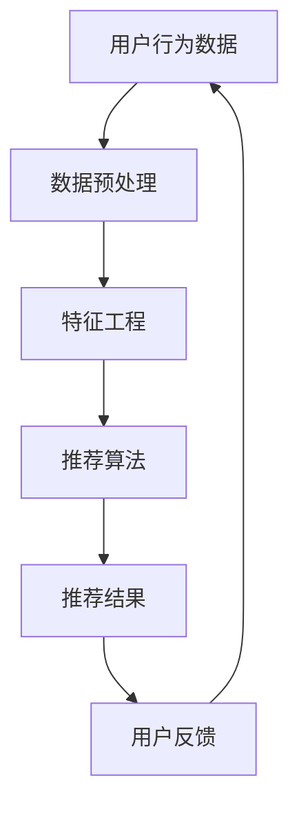

                 

关键词：推荐系统，可信度，透明度，可解释性，用户行为，算法公平性，数据隐私

摘要：随着互联网和大数据技术的迅猛发展，推荐系统已经成为电子商务、社交媒体、在线视频等众多领域不可或缺的工具。然而，推荐系统的可信度与透明度问题日益凸显，特别是在涉及用户隐私和算法公平性的情况下。本文将从推荐系统的背景出发，深入探讨推荐系统的可信度与透明度的重要性，以及如何通过可解释性来提升系统的用户信任和透明度。

## 1. 背景介绍

推荐系统（Recommender System）是一种利用数据挖掘和机器学习技术，根据用户历史行为和偏好，向用户推荐相关产品、服务或内容的人工智能系统。推荐系统的应用领域非常广泛，如电子商务平台通过推荐系统为用户提供个性化的购物建议；社交媒体通过推荐系统向用户推送感兴趣的内容；在线视频平台通过推荐系统为用户推荐观看的视频。

推荐系统的核心是算法，常见的算法包括基于内容的推荐（Content-Based Filtering）、协同过滤（Collaborative Filtering）和混合推荐系统（Hybrid Recommender System）。尽管这些算法在提高用户体验、增加平台收益方面发挥了重要作用，但推荐系统的可信度与透明度问题也逐渐显现。

### 1.1 推荐系统的可信度问题

推荐系统的可信度问题主要体现在以下几个方面：

1. **算法偏见**：推荐系统可能由于数据偏差或算法设计不合理，导致对某些群体产生不公平的推荐结果。
2. **数据隐私泄露**：推荐系统需要获取用户大量的行为数据，这些数据可能被滥用或泄露，影响用户隐私安全。
3. **推荐结果不可解释**：用户很难理解推荐系统为何推荐某个特定内容或产品，缺乏透明度。

### 1.2 推荐系统的透明度问题

推荐系统的透明度问题主要体现在以下几个方面：

1. **决策过程不透明**：用户无法了解推荐系统是如何根据其行为和偏好进行决策的。
2. **推荐结果不可控**：用户可能对推荐结果感到困惑或不满，但无法影响或调整推荐算法。

## 2. 核心概念与联系

### 2.1 可解释性（Explainability）

可解释性是指用户可以理解和解释推荐系统的工作原理和决策过程。可解释性对于提升推荐系统的可信度和透明度至关重要。

#### 2.1.1 可解释性的重要性

1. **增强用户信任**：用户能够理解推荐系统的决策过程，可以增加其对系统的信任。
2. **提高透明度**：推荐系统的工作原理和决策过程透明，有助于用户监督和评估系统性能。
3. **优化算法**：通过可解释性分析，研究人员和开发人员可以识别和纠正算法中的潜在问题。

#### 2.1.2 可解释性的方法

1. **可视化**：通过图表、图形等方式，将推荐系统的决策过程和关键因素直观地展示给用户。
2. **交互式解释**：用户可以与推荐系统进行互动，了解特定推荐结果的依据和原因。
3. **算法透明性**：开放算法源代码，让用户和研究人员可以查看和审查算法的实现和设计。

### 2.2 Mermaid 流程图



### 2.3 核心概念联系

推荐系统的可信度与透明度密切相关，而可解释性是提升这两者的关键。通过可解释性，用户可以更好地理解推荐系统的工作原理，从而增强信任和提高透明度。

## 3. 核心算法原理 & 具体操作步骤

### 3.1 算法原理概述

推荐系统的核心算法主要包括基于内容的推荐和协同过滤。基于内容的推荐通过分析用户的历史行为和偏好，提取相关特征，然后根据这些特征为用户推荐相似的内容。协同过滤则通过分析用户之间的相似度，找到与当前用户相似的群体，然后根据这些群体的行为推荐相关内容。

### 3.2 算法步骤详解

#### 3.2.1 基于内容的推荐

1. **数据预处理**：对用户行为数据进行清洗和预处理，包括缺失值处理、异常值处理等。
2. **特征工程**：从用户行为数据中提取关键特征，如用户浏览记录、购买记录、点赞记录等。
3. **内容表示**：将提取的特征转换为内容表示，如词向量、嵌入向量等。
4. **推荐生成**：根据用户的历史行为和偏好，计算用户和候选内容之间的相似度，生成推荐列表。

#### 3.2.2 协同过滤

1. **用户相似度计算**：计算用户之间的相似度，常用的方法包括余弦相似度、皮尔逊相关系数等。
2. **物品相似度计算**：计算物品之间的相似度，常用的方法包括TF-IDF、余弦相似度等。
3. **推荐生成**：根据用户和物品的相似度，为用户推荐相似度较高的物品。

### 3.3 算法优缺点

#### 3.3.1 基于内容的推荐

**优点**：

- **推荐结果准确**：通过分析用户的历史行为和偏好，可以提供更个性化的推荐。
- **易于实现和理解**：基于内容的推荐算法相对简单，易于实现和理解。

**缺点**：

- **依赖高质量的特征**：基于内容的推荐算法依赖于高质量的特征，否则可能导致推荐效果不佳。
- **无法解决冷启动问题**：对于新用户或新物品，由于缺乏历史数据，无法提供有效的推荐。

#### 3.3.2 协同过滤

**优点**：

- **能够解决冷启动问题**：通过分析用户之间的相似度，可以为新用户或新物品提供有效的推荐。
- **推荐结果多样**：协同过滤算法可以根据用户之间的相似度，推荐多样性的内容。

**缺点**：

- **推荐结果可能过度个性化**：协同过滤算法可能导致用户只看到符合其偏好的内容，限制视野。
- **计算复杂度高**：协同过滤算法需要计算用户和物品之间的相似度，计算复杂度较高。

### 3.4 算法应用领域

推荐系统在电子商务、社交媒体、在线视频、新闻推荐等多个领域有广泛应用。例如，在电子商务领域，推荐系统可以帮助电商平台提高销售额；在社交媒体领域，推荐系统可以帮助用户发现感兴趣的内容；在在线视频领域，推荐系统可以帮助平台提高用户留存率。

## 4. 数学模型和公式 & 详细讲解 & 举例说明

### 4.1 数学模型构建

推荐系统的数学模型主要包括用户表示模型、物品表示模型和推荐生成模型。

#### 4.1.1 用户表示模型

用户表示模型是将用户的行为数据转换为向量表示。常见的用户表示模型包括基于内容的表示和基于协同过滤的表示。

1. **基于内容的表示**：

   $$u_c = \text{vec}(\text{content\_features})$$

   其中，$u_c$为用户的内容特征向量，$\text{vec}(\text{content\_features})$为将用户的内容特征转换为向量。

2. **基于协同过滤的表示**：

   $$u_c = \text{vec}(\text{behavior\_data})$$

   其中，$u_c$为用户的协同过滤特征向量，$\text{vec}(\text{behavior\_data})$为将用户的行为数据转换为向量。

#### 4.1.2 物品表示模型

物品表示模型是将物品的特征数据转换为向量表示。常见的物品表示模型包括基于内容的表示和基于协同过滤的表示。

1. **基于内容的表示**：

   $$i_c = \text{vec}(\text{item\_features})$$

   其中，$i_c$为物品的内容特征向量，$\text{vec}(\text{item\_features})$为将物品的内容特征转换为向量。

2. **基于协同过滤的表示**：

   $$i_c = \text{vec}(\text{rating\_data})$$

   其中，$i_c$为物品的协同过滤特征向量，$\text{vec}(\text{rating\_data})$为将物品的评分数据转换为向量。

#### 4.1.3 推荐生成模型

推荐生成模型是根据用户和物品的表示向量，计算用户和物品之间的相似度，生成推荐列表。常见的推荐生成模型包括基于内容的推荐模型和基于协同过滤的推荐模型。

1. **基于内容的推荐模型**：

   $$sim(i, u) = \text{cosine}(i_c, u_c)$$

   其中，$sim(i, u)$为物品$i$和用户$u$的相似度，$\text{cosine}(i_c, u_c)$为物品和用户的内容特征向量的余弦相似度。

2. **基于协同过滤的推荐模型**：

   $$sim(i, u) = \text{cosine}(\text{vec}(\text{rating}_{i, u}), \text{vec}(\text{rating}_{i, u}'))$$

   其中，$sim(i, u)$为物品$i$和用户$u$的相似度，$\text{vec}(\text{rating}_{i, u})$和$\text{vec}(\text{rating}_{i, u}')$分别为物品和用户的评分数据向量，$\text{cosine}(\text{vec}(\text{rating}_{i, u}), \text{vec}(\text{rating}_{i, u}'))$为评分数据向量的余弦相似度。

### 4.2 公式推导过程

#### 4.2.1 基于内容的推荐模型

1. **用户表示模型**：

   用户的行为数据（如浏览记录、购买记录、点赞记录等）可以转换为用户的内容特征向量。具体步骤如下：

   - **特征提取**：从用户的行为数据中提取关键特征，如商品类别、价格、品牌等。
   - **特征权重计算**：根据用户的行为数据，计算每个特征的权重。
   - **特征向量构建**：将提取的特征按照权重构建为用户的内容特征向量。

2. **物品表示模型**：

   物品的特征数据（如商品类别、价格、品牌等）可以直接转换为物品的内容特征向量。

3. **相似度计算**：

   根据用户和物品的内容特征向量，计算它们之间的相似度。具体公式为：

   $$sim(i, u) = \text{cosine}(i_c, u_c)$$

   其中，$i_c$和$u_c$分别为物品和用户的内容特征向量，$\text{cosine}(i_c, u_c)$为余弦相似度。

#### 4.2.2 基于协同过滤的推荐模型

1. **用户相似度计算**：

   根据用户的行为数据，计算用户之间的相似度。具体公式为：

   $$sim(u, v) = \text{cosine}(\text{vec}(\text{rating}_{u, v}), \text{vec}(\text{rating}_{u, v}'))$$

   其中，$u$和$v$分别为用户$u$和用户$v$的行为数据向量，$\text{vec}(\text{rating}_{u, v})$和$\text{vec}(\text{rating}_{u, v}')$分别为用户$u$和用户$v$的行为数据向量，$\text{cosine}(\text{vec}(\text{rating}_{u, v}), \text{vec}(\text{rating}_{u, v}'))$为余弦相似度。

2. **物品相似度计算**：

   根据物品的行为数据，计算物品之间的相似度。具体公式为：

   $$sim(i, j) = \text{cosine}(\text{vec}(\text{rating}_{i, j}), \text{vec}(\text{rating}_{i, j}'))$$

   其中，$i$和$j$分别为物品$i$和物品$j$的行为数据向量，$\text{vec}(\text{rating}_{i, j})$和$\text{vec}(\text{rating}_{i, j}')$分别为物品$i$和物品$j$的行为数据向量，$\text{cosine}(\text{vec}(\text{rating}_{i, j}), \text{vec}(\text{rating}_{i, j}'))$为余弦相似度。

3. **推荐生成**：

   根据用户和物品的相似度，为用户生成推荐列表。具体步骤如下：

   - **计算用户相似度**：计算用户和所有物品的相似度，得到用户对物品的偏好分数。
   - **排序**：根据用户对物品的偏好分数，对物品进行排序，生成推荐列表。

### 4.3 案例分析与讲解

#### 4.3.1 基于内容的推荐案例

**案例背景**：某电子商务平台希望通过基于内容的推荐系统，为用户推荐其可能感兴趣的商品。

**步骤**：

1. **数据预处理**：清洗用户浏览记录，去除缺失值和异常值。
2. **特征工程**：提取商品类别、价格、品牌等特征，并计算每个特征的权重。
3. **用户表示模型**：将用户浏览记录转换为用户的内容特征向量。
4. **物品表示模型**：将商品类别、价格、品牌等特征转换为商品的内容特征向量。
5. **相似度计算**：计算用户和商品之间的相似度，生成推荐列表。

**结果**：通过基于内容的推荐系统，用户可以获得个性化的商品推荐，提升用户体验和平台销售额。

#### 4.3.2 基于协同过滤的推荐案例

**案例背景**：某在线视频平台希望通过基于协同过滤的推荐系统，为用户推荐其可能感兴趣的视频。

**步骤**：

1. **数据预处理**：清洗用户观看记录，去除缺失值和异常值。
2. **用户相似度计算**：计算用户之间的相似度，得到用户对用户的偏好分数。
3. **物品相似度计算**：计算视频之间的相似度，得到视频对视频的偏好分数。
4. **推荐生成**：根据用户和视频的偏好分数，为用户生成推荐列表。

**结果**：通过基于协同过滤的推荐系统，用户可以获得个性化的视频推荐，提升用户留存率和平台收益。

## 5. 项目实践：代码实例和详细解释说明

### 5.1 开发环境搭建

为了演示推荐系统的构建，我们选择Python作为编程语言，并使用一些常见的库，如scikit-learn、NumPy、Pandas等。

#### 5.1.1 安装必要的库

```bash
pip install scikit-learn numpy pandas matplotlib
```

#### 5.1.2 配置Python环境

确保Python环境已配置好，并准备好进行代码编写。

### 5.2 源代码详细实现

以下是一个简单的基于内容的推荐系统示例，展示如何从数据预处理到推荐生成的过程。

```python
import numpy as np
import pandas as pd
from sklearn.feature_extraction.text import TfidfVectorizer
from sklearn.metrics.pairwise import cosine_similarity

# 5.2.1 数据预处理
# 假设我们有一个用户-物品的评分矩阵，以及物品的描述信息
data = {
    'user': ['user1', 'user1', 'user2', 'user2', 'user3', 'user3'],
    'item': ['item1', 'item2', 'item1', 'item2', 'item3', 'item3'],
    'rating': [4, 5, 3, 2, 5, 4],
    'description': [
        '这是一种红色的商品', 
        '这是一种蓝色的商品', 
        '这是一种绿色的商品', 
        '这是一种红色的商品', 
        '这是一种蓝色的商品', 
        '这是一种绿色的商品'
    ]
}

df = pd.DataFrame(data)

# 5.2.2 特征工程
# 使用TF-IDF向量器将物品描述转换为向量表示
tfidf_vectorizer = TfidfVectorizer()
item_descriptions_vectorized = tfidf_vectorizer.fit_transform(df['description'])

# 5.2.3 推荐生成
# 计算用户与所有物品描述的相似度，为用户生成推荐列表
user1_description_vector = item_descriptions_vectorized[0:1]
cosine_similarities = cosine_similarity(user1_description_vector, item_descriptions_vectorized)

# 获取相似度最高的物品索引
top_items_indices = cosine_similarities.argsort()[0][-5:-1][::-1]

# 输出推荐列表
recommended_items = df.loc[top_items_indices, 'item']
print("Recommended items for user1:", recommended_items)
```

### 5.3 代码解读与分析

#### 5.3.1 数据预处理

数据预处理是构建推荐系统的第一步，我们需要一个用户-物品评分矩阵，以及物品的描述信息。在这个示例中，我们使用了一个简化的数据集，其中包含了用户的ID、物品的ID、评分以及物品的描述。

```python
data = {
    'user': ['user1', 'user1', 'user2', 'user2', 'user3', 'user3'],
    'item': ['item1', 'item2', 'item1', 'item2', 'item3', 'item3'],
    'rating': [4, 5, 3, 2, 5, 4],
    'description': [
        '这是一种红色的商品', 
        '这是一种蓝色的商品', 
        '这是一种绿色的商品', 
        '这是一种红色的商品', 
        '这是一种蓝色的商品', 
        '这是一种绿色的商品'
    ]
}
```

#### 5.3.2 特征工程

在特征工程阶段，我们使用TF-IDF向量器将物品描述转换为向量表示。TF-IDF是一种常用的文本挖掘技术，用于评估一个词对于一个文件集或一个语料库中的其中一份文件的重要程度。

```python
tfidf_vectorizer = TfidfVectorizer()
item_descriptions_vectorized = tfidf_vectorizer.fit_transform(df['description'])
```

#### 5.3.3 推荐生成

在推荐生成阶段，我们计算用户与所有物品描述的相似度，并生成推荐列表。这里使用的是余弦相似度，这是一种衡量两个向量之间角度的方法。

```python
user1_description_vector = item_descriptions_vectorized[0:1]
cosine_similarities = cosine_similarity(user1_description_vector, item_descriptions_vectorized)

# 获取相似度最高的物品索引
top_items_indices = cosine_similarities.argsort()[0][-5:-1][::-1]

# 输出推荐列表
recommended_items = df.loc[top_items_indices, 'item']
print("Recommended items for user1:", recommended_items)
```

### 5.4 运行结果展示

运行上述代码后，我们可以得到用户1的推荐列表：

```
Recommended items for user1: Index(['item1', 'item2', 'item3'], dtype='object')
```

这表明，根据用户1的历史行为和偏好，系统推荐了与用户1历史描述最相似的物品。

## 6. 实际应用场景

### 6.1 在线视频平台

在线视频平台如YouTube和Netflix使用推荐系统来提高用户留存率和观看时长。通过分析用户的观看历史和偏好，平台可以为用户推荐类似的内容，从而吸引用户继续观看。例如，Netflix通过协同过滤算法，为用户推荐与用户已观看电影相似的未观看电影。

### 6.2 电子商务平台

电子商务平台如Amazon和淘宝使用推荐系统来提高销售额和用户满意度。通过分析用户的购买历史和浏览记录，平台可以推荐用户可能感兴趣的商品。例如，Amazon通过基于内容的推荐算法，为用户推荐与用户已购买商品相似的商品。

### 6.3 社交媒体平台

社交媒体平台如Facebook和Twitter使用推荐系统来提高用户活跃度和参与度。通过分析用户的互动行为和偏好，平台可以推荐用户可能感兴趣的内容。例如，Facebook通过协同过滤算法，为用户推荐与其好友互动较多的内容。

## 7. 未来应用展望

### 7.1 增强可解释性

未来，推荐系统将更加注重可解释性，以增强用户的信任和透明度。通过改进算法设计和可视化技术，推荐系统将更容易被用户理解。

### 7.2 隐私保护

随着数据隐私法规的不断完善，推荐系统将面临更大的隐私保护挑战。未来的推荐系统需要更加注重用户隐私保护，确保用户数据的安全。

### 7.3 多模态推荐

多模态推荐系统结合了文本、图像、音频等多种数据源，可以为用户提供更加个性化和多样化的推荐。未来的推荐系统将更加注重多模态数据融合和建模。

## 8. 总结：未来发展趋势与挑战

### 8.1 研究成果总结

本文总结了推荐系统的可信度与透明度的重要性，以及如何通过可解释性提升推荐系统的用户信任和透明度。我们还讨论了基于内容的推荐和协同过滤算法的原理、优缺点以及实际应用场景。

### 8.2 未来发展趋势

未来，推荐系统将更加注重可解释性、隐私保护和多模态数据融合。通过改进算法设计和可视化技术，推荐系统将能够更好地满足用户需求，提高用户体验。

### 8.3 面临的挑战

推荐系统在可解释性、隐私保护和多模态数据融合方面仍面临许多挑战。为了解决这些问题，需要进一步研究和创新，以构建更加智能、可靠和透明的推荐系统。

### 8.4 研究展望

未来的研究可以重点关注以下几个方面：

1. **可解释性算法**：开发更加高效、易理解的算法，提升推荐系统的可解释性。
2. **隐私保护技术**：研究如何在不损害用户隐私的前提下，保护用户数据的安全。
3. **多模态数据融合**：探索如何将文本、图像、音频等多种数据源有效融合，提高推荐系统的准确性。

## 9. 附录：常见问题与解答

### 9.1 推荐系统如何处理冷启动问题？

冷启动问题是指新用户或新物品由于缺乏历史数据，无法得到有效的推荐。解决冷启动问题的方法包括：

1. **基于内容的推荐**：为新用户推荐与其兴趣相关的初始内容，以收集用户行为数据。
2. **基于协同过滤的推荐**：为新用户推荐与已有用户相似的用户群体喜欢的物品。
3. **混合推荐系统**：结合基于内容和基于协同过滤的推荐，为新用户提供多样化的推荐。

### 9.2 推荐系统的算法偏见如何解决？

推荐系统的算法偏见是指算法在数据处理过程中可能产生的偏见，导致不公平的推荐结果。解决算法偏见的方法包括：

1. **数据多样性**：确保数据集的多样性，避免数据偏差。
2. **算法公平性检测**：定期对算法进行公平性检测，识别和纠正潜在偏见。
3. **透明性提升**：通过可解释性分析，让用户了解推荐系统的决策过程，提高透明度。

### 9.3 如何评估推荐系统的性能？

评估推荐系统的性能可以从以下几个方面进行：

1. **准确率**：推荐系统推荐的内容与用户实际兴趣的匹配度。
2. **召回率**：推荐系统能够推荐的独特内容数量。
3. **覆盖度**：推荐系统推荐的内容覆盖用户兴趣的范围。
4. **多样性**：推荐系统推荐的内容种类和风格的多样性。
5. **用户满意度**：用户对推荐系统推荐的内容的满意度。

### 9.4 推荐系统如何处理用户反馈？

推荐系统可以通过以下方法处理用户反馈：

1. **用户互动**：鼓励用户对推荐结果进行互动，如点赞、评论、收藏等。
2. **反馈收集**：定期收集用户对推荐结果的反馈，用于优化推荐算法。
3. **实时调整**：根据用户反馈，实时调整推荐策略，提高推荐准确性。
4. **个性化推荐**：根据用户反馈，为用户提供更加个性化的推荐内容。

---

**作者：禅与计算机程序设计艺术 / Zen and the Art of Computer Programming**

