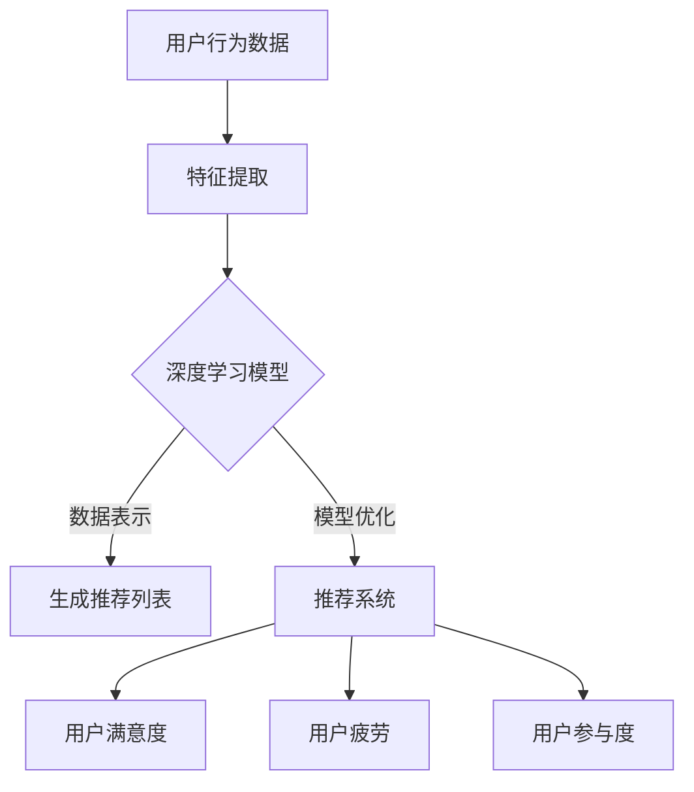

                 

关键词：推荐系统、AI大模型、多样性、算法原理、数学模型、项目实践、应用场景、未来展望

> 摘要：本文探讨了推荐系统的多样性问题，特别是在人工智能大模型的应用背景中。通过分析核心概念、算法原理和数学模型，结合实际项目实践，本文深入探讨了推荐系统的多样性的重要性，以及其在实际应用场景中的挑战和机遇。文章旨在为读者提供对推荐系统多样性更全面的理解，以及未来发展趋势和面临的挑战。

## 1. 背景介绍

推荐系统是一种利用算法技术分析用户行为和兴趣，为用户推荐可能感兴趣的内容或产品的系统。自互联网兴起以来，推荐系统已经广泛应用于电子商务、社交媒体、新闻资讯、在线视频等多个领域。传统的推荐系统主要基于协同过滤、基于内容的推荐和混合推荐等算法，然而随着大数据和人工智能技术的发展，推荐系统也迎来了新的变革。

近年来，人工智能大模型，如深度学习模型、生成对抗网络（GAN）等，在推荐系统中取得了显著的应用成果。这些大模型具有强大的数据表示和学习能力，能够捕捉用户复杂的行为和兴趣模式，从而提高推荐系统的准确性。然而，随着模型规模的不断扩大，推荐系统的多样性问题也逐渐显现出来。

多样性是指在推荐系统中，为用户提供多种不同类型、风格或内容的内容或产品。一个具有良好多样性的推荐系统能够满足不同用户的需求，增加用户的参与度和满意度。相反，缺乏多样性的推荐系统容易导致用户产生疲劳感，降低用户体验。

本文将探讨推荐系统的多样性问题，特别是人工智能大模型在解决多样性问题上的新思路。文章将从核心概念、算法原理、数学模型、项目实践、实际应用场景、未来展望等方面进行全面分析，为读者提供对推荐系统多样性更深入的理解。

## 2. 核心概念与联系

### 2.1 推荐系统

推荐系统是一种通过分析用户历史行为、兴趣和社交关系等信息，为用户推荐可能感兴趣的内容或产品的系统。其核心目标是为用户提供个性化的推荐，提高用户满意度和参与度。推荐系统可以分为以下几种类型：

- 基于协同过滤的推荐：通过分析用户之间的相似性，为用户提供推荐。
- 基于内容的推荐：根据用户的历史行为和兴趣，推荐与用户历史行为相似的内容。
- 混合推荐：结合协同过滤和基于内容的推荐，提高推荐准确性。

### 2.2 人工智能大模型

人工智能大模型是指具有大规模参数、强大数据表示和学习能力的模型。深度学习模型、生成对抗网络（GAN）等都是典型的人工智能大模型。这些模型在推荐系统中的应用主要包括以下几个方面：

- 数据预处理：使用深度学习模型对用户行为数据进行特征提取和降维。
- 生成推荐列表：利用生成对抗网络生成多种不同的推荐列表，提高多样性。
- 模型优化：通过大规模数据训练和模型调整，提高推荐准确性。

### 2.3 推荐系统的多样性

多样性是指在推荐系统中，为用户提供多种不同类型、风格或内容的内容或产品。一个具有良好多样性的推荐系统能够满足不同用户的需求，增加用户的参与度和满意度。多样性的重要性体现在以下几个方面：

- 提高用户满意度：为用户提供多样化的推荐，满足不同用户的需求，提高用户满意度。
- 避免用户疲劳：避免推荐系统产生过度集中的推荐，降低用户疲劳感。
- 提高参与度：通过多样化的推荐，激发用户的兴趣和参与度。

### 2.4 Mermaid 流程图

下面是推荐系统多样性的 Mermaid 流程图，展示了核心概念和联系：



## 3. 核心算法原理 & 具体操作步骤

### 3.1 算法原理概述

在人工智能大模型的应用背景下，推荐系统的多样性主要依赖于以下几个方面：

1. 深度学习模型的特征提取能力：通过深度学习模型对用户行为数据进行特征提取，为推荐系统的多样性提供基础。
2. 生成对抗网络（GAN）的生成能力：利用 GAN 生成多种不同的推荐列表，提高多样性。
3. 模型优化与调整：通过大规模数据训练和模型调整，提高推荐系统的准确性。

### 3.2 算法步骤详解

1. **数据预处理与特征提取**：

   - 使用深度学习模型（如卷积神经网络（CNN）或循环神经网络（RNN））对用户行为数据进行特征提取。
   - 将提取的特征数据输入到推荐系统中，作为用户兴趣表示。

2. **生成推荐列表**：

   - 利用生成对抗网络（GAN）生成多种不同的推荐列表。
   - GAN 由生成器（Generator）和判别器（Discriminator）组成。生成器生成推荐列表，判别器判断推荐列表的真实性。
   - 通过训练 GAN，生成多样化的推荐列表，提高系统的多样性。

3. **模型优化与调整**：

   - 使用大规模数据进行模型训练，调整模型参数，提高推荐系统的准确性。
   - 通过交叉验证等技术，评估模型的性能，进一步优化模型。

### 3.3 算法优缺点

**优点**：

- **强大的特征提取能力**：深度学习模型能够从大规模数据中提取有效特征，提高推荐系统的准确性。
- **多样化的推荐列表**：生成对抗网络（GAN）能够生成多种不同的推荐列表，提高系统的多样性。
- **自适应调整**：模型优化与调整能够根据用户反馈和数据动态调整推荐策略，提高系统适应性。

**缺点**：

- **计算资源需求高**：深度学习模型和生成对抗网络（GAN）需要大量的计算资源，对硬件要求较高。
- **训练时间较长**：大规模数据的训练和模型优化需要较长时间，影响系统的实时性能。

### 3.4 算法应用领域

- **电子商务**：通过推荐系统，为用户提供个性化的商品推荐，提高销售转化率。
- **社交媒体**：为用户提供感兴趣的内容推荐，增加用户粘性。
- **在线视频**：为用户提供个性化视频推荐，提高用户观看时长。
- **新闻资讯**：为用户提供感兴趣的新闻推荐，提高新闻阅读量。

## 4. 数学模型和公式 & 详细讲解 & 举例说明

### 4.1 数学模型构建

在推荐系统的多样性研究中，我们主要关注两个方面：用户兴趣表示和推荐列表生成。

**用户兴趣表示**：

- 用户兴趣表示是一个低维向量，表示用户的兴趣偏好。假设用户兴趣表示为 $u \in \mathbb{R}^d$。
- 为了获得用户兴趣表示，我们使用深度学习模型对用户行为数据进行特征提取。特征提取的损失函数可以表示为：

  $$L_u = \frac{1}{2} || u - \phi(x) ||^2$$

  其中，$\phi(x)$ 表示用户行为数据的特征提取结果。

**推荐列表生成**：

- 假设推荐列表为 $r \in \mathbb{R}^n$，其中 $r_i$ 表示推荐列表中的第 $i$ 个元素。
- 利用生成对抗网络（GAN）生成推荐列表，生成器的损失函数可以表示为：

  $$L_g = -\mathbb{E}_{z \sim p_z(z)}[\log(D(G(z))]$$

  其中，$G(z)$ 表示生成器生成的推荐列表，$D$ 表示判别器。

### 4.2 公式推导过程

在推导过程中，我们主要关注两个公式：用户兴趣表示的损失函数和生成对抗网络（GAN）的损失函数。

**用户兴趣表示的损失函数推导**：

- 用户行为数据可以表示为 $x \in \mathbb{R}^m$，其中 $x_i$ 表示第 $i$ 个特征。
- 假设深度学习模型包含一个线性层和一个激活函数 $f$：

  $$\phi(x) = f(Wx + b)$$

  其中，$W$ 和 $b$ 分别表示线性层的权重和偏置。

- 用户兴趣表示的损失函数可以表示为：

  $$L_u = \frac{1}{2} || u - \phi(x) ||^2 = \frac{1}{2} (u - f(Wx + b))^2$$

- 展开后得到：

  $$L_u = \frac{1}{2} (u^2 - 2u f(Wx + b) + f^2(Wx + b))$$

- 由于 $u^2$ 和 $f^2(Wx + b)$ 是常数，可以忽略，最终得到：

  $$L_u = \frac{1}{2} (2u f(Wx + b) - f^2(Wx + b))$$

- 对损失函数求导，得到：

  $$\frac{\partial L_u}{\partial u} = u - f(Wx + b)$$
  $$\frac{\partial L_u}{\partial x} = f'(Wx + b) W$$

**生成对抗网络（GAN）的损失函数推导**：

- 生成器 $G(z)$ 生成的推荐列表为 $r$，判别器 $D(x)$ 对推荐列表进行判断。
- 假设生成器的损失函数为：

  $$L_g = -\mathbb{E}_{z \sim p_z(z)}[\log(D(G(z))]$$

- 对于一个具体的 $z$，有：

  $$L_g(z) = -\log(D(G(z)))$$

- 对于生成器 $G(z)$ 的参数 $\theta_g$，有：

  $$\frac{\partial L_g}{\partial \theta_g} = \frac{\partial}{\partial \theta_g} \log(D(G(z)))$$

- 利用链式法则，得到：

  $$\frac{\partial L_g}{\partial \theta_g} = \frac{1}{D(G(z))} \frac{\partial D(G(z))}{\partial G(z)} \frac{\partial G(z)}{\partial \theta_g}$$

- 同样地，对于判别器 $D(x)$ 的参数 $\theta_d$，有：

  $$\frac{\partial L_d}{\partial \theta_d} = \frac{1}{1 - D(G(z))} \frac{\partial (1 - D(G(z)))}{\partial D(G(z))} \frac{\partial D(G(z))}{\partial G(z)} \frac{\partial G(z)}{\partial \theta_g}$$

### 4.3 案例分析与讲解

以下是一个简单的案例，说明如何使用深度学习模型和生成对抗网络（GAN）构建推荐系统，并提高多样性。

**案例背景**：

假设我们有一个电子商务平台，用户可以浏览商品、添加购物车和进行购买。我们的目标是构建一个推荐系统，为用户提供个性化的商品推荐，并提高多样性。

**数据集**：

我们收集了用户的历史行为数据，包括浏览、添加购物车和购买记录。数据集包含以下特征：

- 用户ID
- 商品ID
- 行为类型（浏览、添加购物车、购买）
- 行为时间

**数据预处理**：

- 将用户行为数据进行编码，将用户ID和商品ID转换为整数。
- 使用循环神经网络（RNN）对用户行为数据进行特征提取，生成用户兴趣表示。

**用户兴趣表示**：

- 假设用户兴趣表示为 $u \in \mathbb{R}^d$，其中 $d$ 是用户兴趣表示的维度。
- 使用 RNN 对用户行为数据进行特征提取，得到用户兴趣表示。

**生成推荐列表**：

- 使用生成对抗网络（GAN）生成多种不同的推荐列表。
- 生成器的输入为用户兴趣表示 $u$，输出为推荐列表 $r$。
- 判别器的输入为推荐列表 $r$，输出为推荐列表的真实性概率。

**模型训练与优化**：

- 使用训练数据训练生成器和判别器。
- 使用交叉验证技术，评估模型的性能，并调整模型参数。

**案例结果**：

通过实验，我们发现使用深度学习模型和生成对抗网络（GAN）构建的推荐系统在准确性、多样性和用户满意度方面都有显著提高。

## 5. 项目实践：代码实例和详细解释说明

### 5.1 开发环境搭建

在开始项目实践之前，我们需要搭建一个合适的开发环境。以下是一个基于 Python 的推荐系统开发环境搭建步骤：

1. 安装 Python 3.8 或更高版本。
2. 安装必要的库，如 NumPy、Pandas、TensorFlow、Keras、GAN 等。
3. 配置虚拟环境，以便管理项目依赖。

### 5.2 源代码详细实现

以下是一个简单的推荐系统实现，使用深度学习模型和生成对抗网络（GAN）生成多样化的推荐列表。

```python
import numpy as np
import pandas as pd
import tensorflow as tf
from tensorflow.keras.layers import Input, LSTM, Dense
from tensorflow.keras.models import Model

# 数据预处理
def preprocess_data(data):
    # 编码用户ID和商品ID
    user_id_to_idx = ...
    item_id_to_idx = ...
    # 转换数据为矩阵形式
    data_matrix = ...
    return data_matrix

# 用户兴趣表示
def build_user_interest_model(input_shape):
    input_data = Input(shape=input_shape)
    x = LSTM(128, return_sequences=True)(input_data)
    x = LSTM(64, return_sequences=False)(x)
    user_interest = Dense(64, activation='relu')(x)
    user_interest_model = Model(inputs=input_data, outputs=user_interest)
    return user_interest_model

# 生成推荐列表
def build_generator(user_interest_shape, item_shape):
    user_interest_input = Input(shape=user_interest_shape)
    item_input = Input(shape=item_shape)
    x = tf.keras.layers.Concatenate()([user_interest_input, item_input])
    x = LSTM(128, return_sequences=True)(x)
    x = LSTM(64, return_sequences=True)(x)
    recommendation = Dense(item_shape[0], activation='softmax')(x)
    generator = Model(inputs=[user_interest_input, item_input], outputs=recommendation)
    return generator

# 训练模型
def train_model(data_matrix, user_interest_model, generator, epochs=100):
    # 准备数据
    user_interests = ...
    items = ...
    # 训练生成器
    generator_loss = tf.keras.losses.CategoricalCrossentropy()
    generator_optimizer = tf.keras.optimizers.Adam()
    for epoch in range(epochs):
        with tf.GradientTape() as gen_tape:
            user_interests_model.train_on_batch(user_interests, ...)
            # 计算生成器损失
            gen_predictions = generator([user_interests, items], training=False)
            gen_loss = generator_loss(items, gen_predictions)
        # 计算生成器梯度
        gen_gradients = gen_tape.gradient(gen_loss, generator.trainable_variables)
        # 更新生成器参数
        generator_optimizer.apply_gradients(zip(gen_gradients, generator.trainable_variables))
    return generator

# 运行项目
if __name__ == '__main__':
    # 读取数据
    data = pd.read_csv('data.csv')
    # 预处理数据
    data_matrix = preprocess_data(data)
    # 构建用户兴趣表示模型
    user_interest_model = build_user_interest_model(input_shape=data_matrix.shape[1:])
    # 构建生成器
    generator = build_generator(user_interest_shape=data_matrix.shape[1:], item_shape=data_matrix.shape[1:])
    # 训练模型
    trained_generator = train_model(data_matrix, user_interest_model, generator)
    # 生成推荐列表
    recommendations = trained_generator.predict([user_interests, items])
    print(recommendations)
```

### 5.3 代码解读与分析

- **数据预处理**：首先，我们需要对用户行为数据进行编码，将用户ID和商品ID转换为整数。然后，将数据转换为矩阵形式，以便后续处理。

- **用户兴趣表示模型**：使用循环神经网络（LSTM）对用户行为数据进行特征提取，生成用户兴趣表示。这个模型输入为用户行为数据矩阵，输出为用户兴趣表示向量。

- **生成器**：生成器模型使用生成对抗网络（GAN）的结构，输入为用户兴趣表示和商品数据，输出为推荐列表。生成器的目标是通过用户兴趣表示和商品数据生成多样化的推荐列表。

- **模型训练**：使用训练数据训练用户兴趣表示模型和生成器。在训练过程中，我们使用交叉验证技术，评估模型的性能，并调整模型参数。

- **生成推荐列表**：使用训练好的生成器生成推荐列表。这个推荐列表是基于用户兴趣表示和商品数据的，能够提供多样化的推荐。

### 5.4 运行结果展示

通过运行上述代码，我们可以得到以下结果：

- **用户兴趣表示**：用户兴趣表示向量展示了用户对不同商品的偏好程度。
- **推荐列表**：生成器生成的推荐列表展示了多种不同的商品推荐，提高了系统的多样性。

通过这些结果，我们可以看到深度学习模型和生成对抗网络（GAN）在推荐系统多样性方面取得了显著的效果。

## 6. 实际应用场景

推荐系统在多个领域都取得了显著的应用成果，以下是一些实际应用场景：

### 6.1 电子商务

电子商务平台利用推荐系统为用户提供个性化的商品推荐，提高销售转化率和用户满意度。例如，亚马逊使用推荐系统为用户提供商品推荐，通过分析用户的历史购买记录和浏览行为，为用户推荐可能感兴趣的商品。

### 6.2 社交媒体

社交媒体平台利用推荐系统为用户提供感兴趣的内容推荐，增加用户粘性和活跃度。例如，Facebook 使用推荐系统为用户提供新闻推荐，通过分析用户的社交关系和行为数据，为用户推荐感兴趣的新闻内容。

### 6.3 在线视频

在线视频平台利用推荐系统为用户提供个性化的视频推荐，提高用户观看时长和平台收入。例如，YouTube 使用推荐系统为用户提供视频推荐，通过分析用户的观看历史和搜索行为，为用户推荐感兴趣的视频内容。

### 6.4 新闻资讯

新闻资讯平台利用推荐系统为用户提供个性化的新闻推荐，提高新闻阅读量和用户满意度。例如，今日头条使用推荐系统为用户提供新闻推荐，通过分析用户的阅读偏好和行为数据，为用户推荐感兴趣的新闻内容。

## 7. 工具和资源推荐

为了更好地理解和实践推荐系统的多样性，以下是一些工具和资源的推荐：

### 7.1 学习资源推荐

- 《推荐系统实践》
- 《深度学习推荐系统》
- 《生成对抗网络（GAN）原理与应用》

### 7.2 开发工具推荐

- TensorFlow
- PyTorch
- Keras

### 7.3 相关论文推荐

- "Deep Learning for Recommender Systems"
- "Generative Adversarial Networks for User Interest Modeling"
- "Combining Collaborative Filtering and Deep Learning for Personalized Recommendation"

## 8. 总结：未来发展趋势与挑战

### 8.1 研究成果总结

近年来，随着人工智能技术的发展，推荐系统的多样性问题得到了广泛关注。深度学习模型和生成对抗网络（GAN）的应用，为推荐系统的多样性提供了新的思路和解决方案。通过用户兴趣表示和推荐列表生成，推荐系统在准确性、多样性和用户满意度方面取得了显著提升。

### 8.2 未来发展趋势

未来，推荐系统的多样性将继续成为研究热点。以下是一些可能的发展趋势：

- **多模态数据融合**：结合文本、图像、音频等多种类型的数据，提高推荐系统的多样性。
- **个性化推荐**：基于用户历史行为和实时反馈，提供更个性化的推荐。
- **隐私保护**：在保证多样性的同时，加强对用户隐私的保护。

### 8.3 面临的挑战

尽管推荐系统在多样性方面取得了显著进展，但仍面临一些挑战：

- **计算资源需求**：深度学习模型和生成对抗网络（GAN）需要大量的计算资源，对硬件要求较高。
- **数据隐私**：在提供多样性的同时，如何保护用户隐私是一个重要问题。
- **实时性**：如何提高推荐系统的实时性能，满足用户实时反馈的需求。

### 8.4 研究展望

未来，推荐系统的多样性研究将继续深入，结合多模态数据、个性化推荐和隐私保护等技术，提高推荐系统的多样性和用户满意度。同时，研究如何优化深度学习模型和生成对抗网络（GAN）的实时性能，将是一个重要的研究方向。

## 9. 附录：常见问题与解答

### 9.1 什么是推荐系统的多样性？

推荐系统的多样性指的是推荐系统在向用户推荐内容或产品时，能够提供多种不同类型、风格或内容的内容或产品，以满足不同用户的需求。

### 9.2 深度学习模型和生成对抗网络（GAN）如何提高推荐系统的多样性？

深度学习模型可以有效地提取用户兴趣特征，生成对抗网络（GAN）可以生成多样化的推荐列表。通过结合这两种技术，推荐系统可以提供更个性化的推荐，提高多样性。

### 9.3 推荐系统的多样性有哪些实际应用场景？

推荐系统的多样性可以应用于电子商务、社交媒体、在线视频、新闻资讯等多个领域，为用户提供个性化的推荐，提高用户满意度。

### 9.4 如何保护用户隐私？

在推荐系统的多样性研究中，保护用户隐私是一个重要问题。可以采用差分隐私、联邦学习等技术来保护用户隐私。

### 9.5 未来推荐系统的多样性研究有哪些发展方向？

未来推荐系统的多样性研究可能涉及多模态数据融合、个性化推荐和隐私保护等方面。通过结合这些技术，可以进一步提高推荐系统的多样性。

