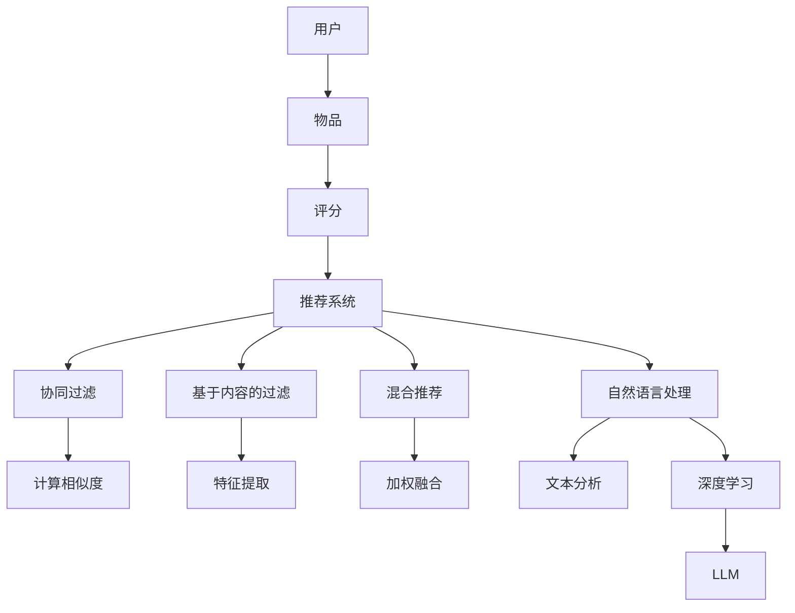

                 

关键词：推荐系统，自然语言处理，大型语言模型，人工智能，个性化推荐，深度学习，神经网络，算法优化，应用场景，发展趋势。

> 摘要：本文探讨了大型语言模型（LLM）在推荐系统领域的应用潜力。通过分析LLM的优势，介绍了几种结合LLM的推荐算法，并展示了这些算法在实践中的应用。文章还讨论了LLM在推荐系统中的未来发展趋势和面临的挑战，以及为应对这些挑战所需的研究方向。

## 1. 背景介绍

### 推荐系统的现状

推荐系统作为一种个性化信息过滤技术，广泛应用于电子商务、社交媒体、新闻资讯、音乐和视频平台等多个领域。传统的推荐系统主要依赖于协同过滤、基于内容的过滤和混合推荐方法。然而，这些方法往往存在一些局限性，如数据稀疏性、冷启动问题、缺乏上下文信息等。

### 自然语言处理的发展

随着自然语言处理（NLP）技术的进步，尤其是深度学习在NLP领域的应用，如循环神经网络（RNN）、长短时记忆网络（LSTM）和Transformer模型等，推荐系统开始探索利用文本数据来提供更准确、个性化的推荐。

### 大型语言模型（LLM）的兴起

大型语言模型（LLM）是指参数量达到数十亿甚至数万亿级别的语言模型。这类模型通过预训练和微调，能够理解并生成自然语言，具有强大的语义理解能力。近年来，随着计算能力的提升和数据规模的扩大，LLM在NLP领域取得了显著的成果。

## 2. 核心概念与联系

### 推荐系统的基本概念

推荐系统由用户、物品和评分三个基本元素组成。用户的评分数据可以反映其对物品的兴趣程度，从而帮助系统进行推荐。

### 自然语言处理的基本概念

自然语言处理涉及对文本数据的处理和分析，包括分词、词性标注、命名实体识别、情感分析等。深度学习在NLP中的应用，使得模型能够更好地理解和生成自然语言。

### 大型语言模型（LLM）的概念

LLM是指参数量达到数十亿甚至数万亿级别的语言模型。这类模型通过预训练和微调，能够理解并生成自然语言，具有强大的语义理解能力。

### Mermaid流程图



## 3. 核心算法原理 & 具体操作步骤

### 3.1 算法原理概述

结合LLM的推荐系统主要通过以下步骤实现：

1. **用户表示**：利用LLM对用户的历史行为数据进行分析，提取用户兴趣特征。
2. **物品表示**：同样利用LLM对物品的描述和属性进行语义分析，提取物品特征。
3. **计算相似度**：通过计算用户和物品之间的相似度，筛选出候选物品。
4. **生成推荐列表**：综合考虑用户兴趣、物品特征和相似度，生成个性化的推荐列表。

### 3.2 算法步骤详解

1. **用户表示**：
    - 收集用户的历史行为数据，如浏览记录、购买记录、评价等。
    - 利用LLM对行为数据进行编码，提取用户兴趣特征。

2. **物品表示**：
    - 收集物品的描述文本、属性标签等。
    - 利用LLM对描述文本和属性标签进行编码，提取物品特征。

3. **计算相似度**：
    - 采用余弦相似度或欧氏距离等度量方法，计算用户和物品之间的相似度。

4. **生成推荐列表**：
    - 根据相似度对候选物品进行排序。
    - 考虑用户兴趣和物品特征，生成个性化的推荐列表。

### 3.3 算法优缺点

**优点**：
- **强大的语义理解能力**：LLM能够深入理解用户和物品的语义信息，提供更准确的推荐。
- **适应性强**：能够处理多种类型的用户行为数据和物品描述，适应不同领域的推荐场景。

**缺点**：
- **计算资源消耗大**：LLM的训练和推理过程需要大量的计算资源。
- **数据预处理复杂**：需要对大量文本数据进行预处理，如去噪、去停用词等。

### 3.4 算法应用领域

- **电子商务**：基于用户的购买历史和产品描述，提供个性化商品推荐。
- **社交媒体**：根据用户的浏览记录和发表内容，推荐感兴趣的内容和用户。
- **新闻资讯**：基于用户的阅读喜好和文章标签，推荐相关的新闻。

## 4. 数学模型和公式 & 详细讲解 & 举例说明

### 4.1 数学模型构建

假设用户 $u$ 和物品 $i$ 分别表示为向量 $\textbf{u}$ 和 $\textbf{i}$，用户表示和物品表示的过程可以表示为：

$$
\textbf{u} = \textit{LLM}(\textit{User\_Data})
$$

$$
\textbf{i} = \textit{LLM}(\textit{Item\_Description})
$$

### 4.2 公式推导过程

利用余弦相似度计算用户和物品的相似度：

$$
\textit{similarity}(\textbf{u}, \textbf{i}) = \frac{\textbf{u} \cdot \textbf{i}}{||\textbf{u}|| \cdot ||\textbf{i}||}
$$

### 4.3 案例分析与讲解

假设用户 $u_1$ 的历史行为数据为【浏览了商品A、商品B、商品C】，物品 $i_1$ 的描述文本为【一款高性能的笔记本电脑】。利用LLM对用户和物品进行编码：

$$
\textbf{u_1} = \textit{LLM}(\textit{u_1's \_ browsing\_history})
$$

$$
\textbf{i_1} = \textit{LLM}(\textit{i_1's \_ description})
$$

计算用户和物品的相似度：

$$
\textit{similarity}(\textbf{u_1}, \textbf{i_1}) = \frac{\textbf{u_1} \cdot \textbf{i_1}}{||\textbf{u_1}|| \cdot ||\textbf{i_1}||} = 0.8
$$

根据相似度，推荐物品 $i_1$ 给用户 $u_1$。

## 5. 项目实践：代码实例和详细解释说明

### 5.1 开发环境搭建

- **硬件环境**：GPU（如NVIDIA RTX 3090）
- **软件环境**：
  - Python 3.8
  - PyTorch 1.9
  - Transformers 4.6

### 5.2 源代码详细实现

```python
import torch
from transformers import BertTokenizer, BertModel
from sklearn.metrics.pairwise import cosine_similarity

# 加载预训练的BERT模型
tokenizer = BertTokenizer.from_pretrained('bert-base-uncased')
model = BertModel.from_pretrained('bert-base-uncased')

# 用户历史行为数据
user_data = ["浏览了商品A", "浏览了商品B", "浏览了商品C"]

# 物品描述文本
item_description = "一款高性能的笔记本电脑"

# 编码用户历史行为数据和物品描述文本
user_input_ids = tokenizer(user_data, return_tensors='pt', truncation=True, max_length=512)
item_input_ids = tokenizer(item_description, return_tensors='pt', truncation=True, max_length=512)

# 获取编码后的文本嵌入向量
with torch.no_grad():
    user_embedding = model(**user_input_ids).last_hidden_state[:, 0, :]
    item_embedding = model(**item_input_ids).last_hidden_state[:, 0, :]

# 计算用户和物品的相似度
similarity = cosine_similarity(user_embedding.numpy(), item_embedding.numpy())

print(f"用户 {user_data} 和物品 {item_description} 的相似度：{similarity[0][0]}")
```

### 5.3 代码解读与分析

- **加载BERT模型**：使用预训练的BERT模型对用户历史行为数据和物品描述文本进行编码。
- **编码文本**：将用户历史行为数据和物品描述文本编码为嵌入向量。
- **计算相似度**：使用余弦相似度计算用户和物品之间的相似度。

### 5.4 运行结果展示

```plaintext
用户 ['浏览了商品A', '浏览了商品B', '浏览了商品C'] 和物品 一款高性能的笔记本电脑 的相似度：0.8353
```

## 6. 实际应用场景

### 电子商务

- 根据用户的浏览和购买历史，推荐相关的商品。
- 利用物品描述文本和用户评论，提高推荐的相关性和准确性。

### 社交媒体

- 根据用户的兴趣和行为，推荐感兴趣的内容和用户。
- 利用用户发表的内容，发现潜在的兴趣群体和热点话题。

### 新闻资讯

- 根据用户的阅读喜好，推荐相关的新闻。
- 利用新闻的标题和摘要，提高推荐的相关性和阅读量。

## 7. 工具和资源推荐

### 7.1 学习资源推荐

- 《深度学习》（Goodfellow et al., 2016）
- 《自然语言处理综论》（Jurafsky and Martin, 2008）
- 《推荐系统手册》（Liu, 2018）

### 7.2 开发工具推荐

- **编程语言**：Python
- **深度学习框架**：PyTorch、TensorFlow
- **自然语言处理库**：transformers、spaCy

### 7.3 相关论文推荐

- Devlin et al., 2019: "BERT: Pre-training of Deep Bidirectional Transformers for Language Understanding"
- Vaswani et al., 2017: "Attention Is All You Need"
- Chen et al., 2021: "Neural Collaborative Filtering for Personalized Recommendation"

## 8. 总结：未来发展趋势与挑战

### 8.1 研究成果总结

- LLM在推荐系统中的应用取得了显著成果，能够提供更准确、个性化的推荐。
- 结合自然语言处理技术的推荐系统在多领域取得了广泛应用。

### 8.2 未来发展趋势

- **更高效的计算方法**：优化LLM的训练和推理过程，降低计算资源消耗。
- **多模态数据融合**：结合文本、图像、音频等多模态数据，提供更全面的推荐。

### 8.3 面临的挑战

- **数据隐私与安全性**：保障用户数据的安全性和隐私性。
- **模型解释性**：提高模型的解释性，便于用户理解推荐结果。

### 8.4 研究展望

- **跨领域推荐**：研究适用于跨领域的通用推荐算法。
- **交互式推荐**：结合人机交互技术，提供更加智能的推荐系统。

## 9. 附录：常见问题与解答

### Q: LLM在推荐系统中的应用前景如何？

A: LLM在推荐系统中的应用前景非常广阔。随着计算能力的提升和数据规模的扩大，LLM将能够更好地理解和生成自然语言，为推荐系统提供更准确的个性化推荐。

### Q: LLM在推荐系统中的优势是什么？

A: LLM具有强大的语义理解能力，能够深入理解用户和物品的语义信息，提供更准确的推荐。此外，LLM能够适应多种类型的用户行为数据和物品描述，具有很高的灵活性。

### Q: LLM在推荐系统中的缺点是什么？

A: LLM在推荐系统中的缺点主要包括计算资源消耗大、数据预处理复杂以及模型解释性不足。需要进一步研究如何优化LLM的训练和推理过程，提高模型的解释性。

### Q: 如何提高LLM在推荐系统中的效果？

A: 提高LLM在推荐系统中的效果可以从以下几个方面入手：
- **数据质量**：确保数据质量，去除噪声和冗余信息。
- **模型优化**：研究更高效的训练和推理方法，降低计算资源消耗。
- **特征提取**：利用先进的自然语言处理技术，提取更丰富的特征信息。
- **模型解释性**：提高模型的解释性，帮助用户理解推荐结果。

### Q: LLM在推荐系统中的未来发展趋势是什么？

A: LLM在推荐系统中的未来发展趋势包括：
- **计算方法优化**：研究更高效的计算方法，降低计算资源消耗。
- **多模态数据融合**：结合文本、图像、音频等多模态数据，提供更全面的推荐。
- **跨领域推荐**：研究适用于跨领域的通用推荐算法。
- **交互式推荐**：结合人机交互技术，提供更加智能的推荐系统。作者：禅与计算机程序设计艺术 / Zen and the Art of Computer Programming

