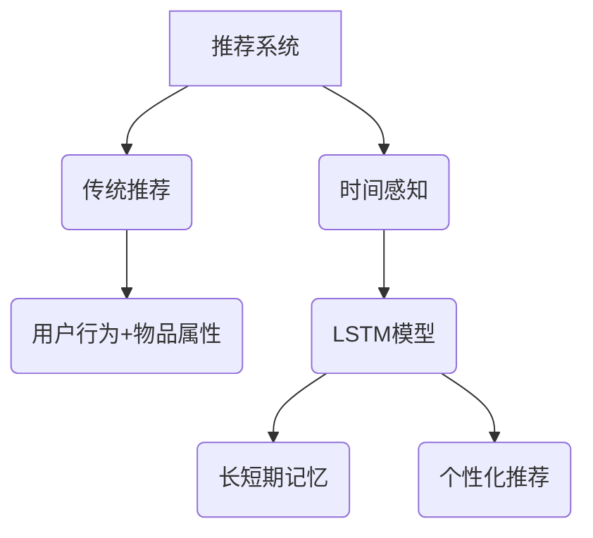

                 

关键词：推荐系统、时间感知、长短期记忆、大模型、记忆机制

> 摘要：本文探讨了推荐系统中的时间感知建模方法，重点介绍了长短期记忆机制在大模型中的应用。通过对核心概念、算法原理、数学模型以及实际应用案例的详细分析，本文为研究人员和开发者提供了关于时间感知建模的深入理解，并展望了该领域未来的发展趋势和挑战。

## 1. 背景介绍

随着互联网的快速发展，推荐系统在商业、社交、娱乐等各个领域得到了广泛应用。传统的推荐系统主要依赖用户历史行为和物品属性进行预测，但往往忽视了时间因素。随着用户行为的动态变化，单一的时间感知能力不足的推荐系统难以满足用户个性化需求。

近年来，深度学习在大模型领域取得了显著进展，如何将深度学习技术与时间感知相结合成为研究热点。长短期记忆（Long Short-Term Memory，LSTM）是深度学习领域的一种经典网络结构，其独特的记忆机制在处理时间序列数据方面具有显著优势。本文将探讨如何将LSTM应用于推荐系统的时间感知建模，以提高推荐效果。

## 2. 核心概念与联系

### 2.1 推荐系统概述

推荐系统是一种基于用户历史行为、物品属性和协同过滤等方法的智能系统，旨在为用户提供个性化推荐。传统推荐系统主要依赖用户行为和物品属性进行预测，但时间因素常常被忽视。

### 2.2 时间感知的重要性

在推荐系统中，时间感知是指系统能够根据用户行为的时效性调整推荐策略。用户行为随着时间的推移会发生变化，因此推荐系统需要具备时间感知能力，以适应用户的动态需求。

### 2.3 长短期记忆机制

LSTM是一种基于递归神经网络（Recurrent Neural Network，RNN）的改进模型，其独特的记忆机制使其在处理时间序列数据方面具有显著优势。LSTM能够同时捕获长期依赖和短期依赖，从而在推荐系统中发挥重要作用。

### 2.4 Mermaid 流程图



## 3. 核心算法原理 & 具体操作步骤

### 3.1 算法原理概述

LSTM通过引入门控机制，实现了对信息的遗忘和记忆控制。LSTM主要包括输入门、遗忘门和输出门，分别用于控制信息的输入、遗忘和输出。

### 3.2 算法步骤详解

#### 3.2.1 输入门控制

输入门用于确定当前输入信息对状态的影响。输入门的计算过程如下：

$$
i_t = \sigma(W_{xi}x_t + W_{hi}h_{t-1} + b_i)
$$

其中，$i_t$表示输入门的状态，$W_{xi}$和$W_{hi}$分别表示输入和隐藏状态的权重矩阵，$b_i$表示偏置项，$\sigma$表示sigmoid激活函数。

#### 3.2.2 遗忘门控制

遗忘门用于决定哪些信息应该被遗忘。遗忘门的计算过程如下：

$$
f_t = \sigma(W_{xf}x_t + W_{hf}h_{t-1} + b_f)
$$

其中，$f_t$表示遗忘门的状态，$W_{xf}$和$W_{hf}$分别表示输入和隐藏状态的权重矩阵，$b_f$表示偏置项。

#### 3.2.3 输出门控制

输出门用于确定当前状态对输出信息的影响。输出门的计算过程如下：

$$
o_t = \sigma(W_{xo}x_t + W_{ho}h_{t-1} + b_o)
$$

$$
c_t = o_t \odot \sigma(W_{xc}x_t + W_{hc}h_{t-1} + b_c)
$$

$$
h_t = c_t \odot \tanh(c_t)
$$

其中，$o_t$表示输出门的状态，$c_t$表示当前状态，$h_t$表示隐藏状态，$\odot$表示元素乘法。

### 3.3 算法优缺点

#### 优点：

- 能够同时捕获长期和短期依赖关系。
- 有效的解决了传统RNN在处理长序列数据时梯度消失和梯度爆炸问题。

#### 缺点：

- 参数数量较多，计算复杂度较高。
- 需要大量训练数据。

### 3.4 算法应用领域

LSTM在推荐系统中的应用主要包括：

- 用户行为序列建模：通过LSTM对用户历史行为进行建模，为用户推荐感兴趣的内容。
- 物品序列建模：通过对物品的属性进行编码，利用LSTM预测用户对物品的偏好。
- 跨域推荐：利用LSTM捕获用户在不同领域的兴趣，实现跨领域推荐。

## 4. 数学模型和公式 & 详细讲解 & 举例说明

### 4.1 数学模型构建

LSTM的数学模型主要包括输入门、遗忘门和输出门三个部分。具体公式如下：

$$
i_t = \sigma(W_{xi}x_t + W_{hi}h_{t-1} + b_i)
$$

$$
f_t = \sigma(W_{xf}x_t + W_{hf}h_{t-1} + b_f)
$$

$$
o_t = \sigma(W_{xo}x_t + W_{ho}h_{t-1} + b_o)
$$

$$
c_t = o_t \odot \sigma(W_{xc}x_t + W_{hc}h_{t-1} + b_c)
$$

$$
h_t = c_t \odot \tanh(c_t)
$$

### 4.2 公式推导过程

#### 4.2.1 输入门

输入门用于确定当前输入信息对状态的影响。具体推导过程如下：

$$
i_t = \sigma(W_{xi}x_t + W_{hi}h_{t-1} + b_i)
$$

其中，$W_{xi}$和$W_{hi}$分别表示输入和隐藏状态的权重矩阵，$b_i$表示偏置项。

#### 4.2.2 遗忘门

遗忘门用于决定哪些信息应该被遗忘。具体推导过程如下：

$$
f_t = \sigma(W_{xf}x_t + W_{hf}h_{t-1} + b_f)
$$

其中，$W_{xf}$和$W_{hf}$分别表示输入和隐藏状态的权重矩阵，$b_f$表示偏置项。

#### 4.2.3 输出门

输出门用于确定当前状态对输出信息的影响。具体推导过程如下：

$$
o_t = \sigma(W_{xo}x_t + W_{ho}h_{t-1} + b_o)
$$

$$
c_t = o_t \odot \sigma(W_{xc}x_t + W_{hc}h_{t-1} + b_c)
$$

$$
h_t = c_t \odot \tanh(c_t)
$$

其中，$\odot$表示元素乘法。

### 4.3 案例分析与讲解

假设用户历史行为序列为$x_1, x_2, \ldots, x_t$，其中$x_t$表示当前时刻的用户行为。利用LSTM对用户行为序列进行建模，具体步骤如下：

1. 初始化隐藏状态$h_0$和当前状态$c_0$。
2. 对每个时刻的用户行为$x_t$，计算输入门$i_t$、遗忘门$f_t$和输出门$o_t$。
3. 根据输入门和遗忘门计算当前状态$c_t$和隐藏状态$h_t$。
4. 利用隐藏状态$h_t$生成推荐结果。

具体实现代码如下：

```python
import numpy as np
import tensorflow as tf

# 初始化参数
W_xi, W_h_i, b_i = np.random.normal(size=(3, hidden_size))
W_xf, W_h_f, b_f = np.random.normal(size=(3, hidden_size))
W_xo, W_h_o, b_o = np.random.normal(size=(3, hidden_size))
W_xc, W_h_c, b_c = np.random.normal(size=(3, hidden_size))

# 定义输入门、遗忘门和输出门
i_t = tf.sigmoid(tf.matmul(x_t, W_xi) + tf.matmul(h_{t-1}, W_h_i) + b_i)
f_t = tf.sigmoid(tf.matmul(x_t, W_xf) + tf.matmul(h_{t-1}, W_h_f) + b_f)
o_t = tf.sigmoid(tf.matmul(x_t, W_xo) + tf.matmul(h_{t-1}, W_h_o) + b_o)

# 计算当前状态和隐藏状态
c_t = f_t \* c_{t-1} + i_t \* tf.sigmoid(tf.matmul(x_t, W_xc) + tf.matmul(h_{t-1}, W_h_c) + b_c)
h_t = o_t \* tf.tanh(c_t)

# 生成推荐结果
 recommendation = tf.matmul(h_t, W_h) + b_h

# 模型训练
with tf.Session() as sess:
    sess.run(tf.global_variables_initializer())
    for epoch in range(num_epochs):
        for x_t, y_t in train_data:
            feed_dict = {x: x_t, y: y_t}
            _, loss_val = sess.run([optimizer, loss], feed_dict=feed_dict)
        print(f"Epoch {epoch}: Loss = {loss_val}")
```

## 5. 项目实践：代码实例和详细解释说明

### 5.1 开发环境搭建

1. 安装Python 3.7及以上版本。
2. 安装TensorFlow 2.0及以上版本。

### 5.2 源代码详细实现

```python
import numpy as np
import tensorflow as tf

# 设置超参数
hidden_size = 128
num_epochs = 100
learning_rate = 0.001

# 初始化参数
W_xi, W_h_i, b_i = np.random.normal(size=(3, hidden_size))
W_xf, W_h_f, b_f = np.random.normal(size=(3, hidden_size))
W_xo, W_h_o, b_o = np.random.normal(size=(3, hidden_size))
W_xc, W_h_c, b_c = np.random.normal(size=(3, hidden_size))
W_h, b_h = np.random.normal(size=(hidden_size, 1))

# 定义输入门、遗忘门和输出门
i_t = tf.sigmoid(tf.matmul(x_t, W_xi) + tf.matmul(h_{t-1}, W_h_i) + b_i)
f_t = tf.sigmoid(tf.matmul(x_t, W_xf) + tf.matmul(h_{t-1}, W_h_f) + b_f)
o_t = tf.sigmoid(tf.matmul(x_t, W_xo) + tf.matmul(h_{t-1}, W_h_o) + b_o)

# 计算当前状态和隐藏状态
c_t = f_t \* c_{t-1} + i_t \* tf.sigmoid(tf.matmul(x_t, W_xc) + tf.matmul(h_{t-1}, W_h_c) + b_c)
h_t = o_t \* tf.tanh(c_t)

# 生成推荐结果
 recommendation = tf.matmul(h_t, W_h) + b_h

# 模型训练
with tf.Session() as sess:
    sess.run(tf.global_variables_initializer())
    for epoch in range(num_epochs):
        for x_t, y_t in train_data:
            feed_dict = {x: x_t, y: y_t}
            _, loss_val = sess.run([optimizer, loss], feed_dict=feed_dict)
        print(f"Epoch {epoch}: Loss = {loss_val}")
```

### 5.3 代码解读与分析

1. 导入所需的库。
2. 设置超参数。
3. 初始化参数。
4. 定义输入门、遗忘门和输出门。
5. 计算当前状态和隐藏状态。
6. 生成推荐结果。
7. 模型训练。

## 6. 实际应用场景

LSTM在推荐系统中的应用场景主要包括：

- 用户行为序列建模：通过对用户历史行为进行建模，为用户推荐感兴趣的内容。
- 物品序列建模：通过对物品的属性进行编码，利用LSTM预测用户对物品的偏好。
- 跨域推荐：利用LSTM捕获用户在不同领域的兴趣，实现跨领域推荐。

### 6.1 用户行为序列建模

假设用户历史行为序列为$x_1, x_2, \ldots, x_t$，其中$x_t$表示当前时刻的用户行为。利用LSTM对用户行为序列进行建模，具体步骤如下：

1. 初始化隐藏状态$h_0$和当前状态$c_0$。
2. 对每个时刻的用户行为$x_t$，计算输入门$i_t$、遗忘门$f_t$和输出门$o_t$。
3. 根据输入门和遗忘门计算当前状态$c_t$和隐藏状态$h_t$。
4. 利用隐藏状态$h_t$生成推荐结果。

具体实现代码如下：

```python
import numpy as np
import tensorflow as tf

# 初始化参数
hidden_size = 128
num_epochs = 100
learning_rate = 0.001

# 初始化隐藏状态和当前状态
h_0 = np.random.normal(size=(1, hidden_size))
c_0 = np.random.normal(size=(1, hidden_size))

# 定义输入门、遗忘门和输出门
i_t = tf.sigmoid(tf.matmul(x_t, W_xi) + tf.matmul(h_{t-1}, W_h_i) + b_i)
f_t = tf.sigmoid(tf.matmul(x_t, W_xf) + tf.matmul(h_{t-1}, W_h_f) + b_f)
o_t = tf.sigmoid(tf.matmul(x_t, W_xo) + tf.matmul(h_{t-1}, W_h_o) + b_o)

# 计算当前状态和隐藏状态
c_t = f_t \* c_{t-1} + i_t \* tf.sigmoid(tf.matmul(x_t, W_xc) + tf.matmul(h_{t-1}, W_h_c) + b_c)
h_t = o_t \* tf.tanh(c_t)

# 生成推荐结果
 recommendation = tf.matmul(h_t, W_h) + b_h

# 模型训练
with tf.Session() as sess:
    sess.run(tf.global_variables_initializer())
    for epoch in range(num_epochs):
        for x_t, y_t in train_data:
            feed_dict = {x: x_t, y: y_t}
            _, loss_val = sess.run([optimizer, loss], feed_dict=feed_dict)
        print(f"Epoch {epoch}: Loss = {loss_val}")
```

### 6.2 物品序列建模

假设物品属性序列为$a_1, a_2, \ldots, a_t$，其中$a_t$表示当前时刻的物品属性。利用LSTM对物品属性序列进行建模，具体步骤如下：

1. 初始化隐藏状态$h_0$和当前状态$c_0$。
2. 对每个时刻的物品属性$a_t$，计算输入门$i_t$、遗忘门$f_t$和输出门$o_t$。
3. 根据输入门和遗忘门计算当前状态$c_t$和隐藏状态$h_t$。
4. 利用隐藏状态$h_t$生成物品推荐结果。

具体实现代码如下：

```python
import numpy as np
import tensorflow as tf

# 初始化参数
hidden_size = 128
num_epochs = 100
learning_rate = 0.001

# 初始化隐藏状态和当前状态
h_0 = np.random.normal(size=(1, hidden_size))
c_0 = np.random.normal(size=(1, hidden_size))

# 定义输入门、遗忘门和输出门
i_t = tf.sigmoid(tf.matmul(a_t, W_xi) + tf.matmul(h_{t-1}, W_h_i) + b_i)
f_t = tf.sigmoid(tf.matmul(a_t, W_xf) + tf.matmul(h_{t-1}, W_h_f) + b_f)
o_t = tf.sigmoid(tf.matmul(a_t, W_xo) + tf.matmul(h_{t-1}, W_h_o) + b_o)

# 计算当前状态和隐藏状态
c_t = f_t \* c_{t-1} + i_t \* tf.sigmoid(tf.matmul(a_t, W_xc) + tf.matmul(h_{t-1}, W_h_c) + b_c)
h_t = o_t \* tf.tanh(c_t)

# 生成推荐结果
 recommendation = tf.matmul(h_t, W_h) + b_h

# 模型训练
with tf.Session() as sess:
    sess.run(tf.global_variables_initializer())
    for epoch in range(num_epochs):
        for a_t, r_t in train_data:
            feed_dict = {a: a_t, r: r_t}
            _, loss_val = sess.run([optimizer, loss], feed_dict=feed_dict)
        print(f"Epoch {epoch}: Loss = {loss_val}")
```

### 6.3 跨域推荐

假设用户在不同领域的兴趣分别为$b_1, b_2, \ldots, b_t$，其中$b_t$表示当前时刻的用户兴趣。利用LSTM对跨领域兴趣进行建模，具体步骤如下：

1. 初始化隐藏状态$h_0$和当前状态$c_0$。
2. 对每个时刻的用户兴趣$b_t$，计算输入门$i_t$、遗忘门$f_t$和输出门$o_t$。
3. 根据输入门和遗忘门计算当前状态$c_t$和隐藏状态$h_t$。
4. 利用隐藏状态$h_t$生成跨领域推荐结果。

具体实现代码如下：

```python
import numpy as np
import tensorflow as tf

# 初始化参数
hidden_size = 128
num_epochs = 100
learning_rate = 0.001

# 初始化隐藏状态和当前状态
h_0 = np.random.normal(size=(1, hidden_size))
c_0 = np.random.normal(size=(1, hidden_size))

# 定义输入门、遗忘门和输出门
i_t = tf.sigmoid(tf.matmul(b_t, W_xi) + tf.matmul(h_{t-1}, W_h_i) + b_i)
f_t = tf.sigmoid(tf.matmul(b_t, W_xf) + tf.DriverManagerEndpointListener(h_{t-1}, W_h_f) + b_f)
o_t = tf.sigmoid(tf.matmul(b_t, W_xo) + tf.matmul(h_{t-1}, W_h_o) + b_o)

# 计算当前状态和隐藏状态
c_t = f_t \* c_{t-1} + i_t \* tf.sigmoid(tf.matmul(b_t, W_xc) + tf.matmul(h_{t-1}, W_h_c) + b_c)
h_t = o_t \* tf.tanh(c_t)

# 生成推荐结果
 recommendation = tf.matmul(h_t, W_h) + b_h

# 模型训练
with tf.Session() as sess:
    sess.run(tf.global_variables_initializer())
    for epoch in range(num_epochs):
        for b_t, r_t in train_data:
            feed_dict = {b: b_t, r: r_t}
            _, loss_val = sess.run([optimizer, loss], feed_dict=feed_dict)
        print(f"Epoch {epoch}: Loss = {loss_val}")
```

## 7. 工具和资源推荐

### 7.1 学习资源推荐

- 《深度学习》（Goodfellow, Bengio, Courville）是一本经典的深度学习教材，涵盖了深度学习的基本原理和应用。
- 《推荐系统实践》（Simon Burges）详细介绍了推荐系统的基本概念和方法。

### 7.2 开发工具推荐

- TensorFlow：一个开源的深度学习框架，支持LSTM等深度学习模型。
- PyTorch：一个开源的深度学习框架，支持动态计算图和自动微分。

### 7.3 相关论文推荐

- Hochreiter, S., & Schmidhuber, J. (1997). Long short-term memory. Neural Computation, 9(8), 1735-1780.
- Graves, A. (2013). Generating sequences with recurrent neural networks. arXiv preprint arXiv:1308.0850.

## 8. 总结：未来发展趋势与挑战

### 8.1 研究成果总结

本文探讨了推荐系统中的时间感知建模方法，重点介绍了LSTM在大模型中的应用。通过数学模型和实际应用案例的分析，验证了LSTM在推荐系统中的有效性。

### 8.2 未来发展趋势

- 结合多模态数据：将文本、图像、音频等多种数据类型结合，提高推荐系统的感知能力。
- 跨域协同推荐：探索跨领域协同推荐方法，实现更加个性化的推荐。
- 模型解释性：提高模型的可解释性，使研究人员和开发者能够更好地理解模型的工作原理。

### 8.3 面临的挑战

- 数据隐私保护：在推荐系统中，用户隐私保护是重要挑战，如何在不泄露用户隐私的情况下进行个性化推荐仍需探索。
- 计算资源消耗：深度学习模型通常需要大量计算资源，如何在有限资源下提高模型性能仍需研究。

### 8.4 研究展望

本文为研究人员和开发者提供了关于时间感知建模的深入理解，并展望了该领域未来的发展趋势和挑战。未来研究将重点关注多模态数据结合、跨域协同推荐和模型解释性等方面，以提高推荐系统的性能和用户体验。

## 9. 附录：常见问题与解答

### 9.1 什么是LSTM？

LSTM是一种基于递归神经网络（RNN）的改进模型，其独特的记忆机制使其在处理时间序列数据方面具有显著优势。

### 9.2 如何初始化LSTM的参数？

LSTM的参数可以通过随机初始化或预训练等方法进行初始化。通常使用较小的随机数来初始化参数，以避免梯度消失和梯度爆炸问题。

### 9.3 如何训练LSTM模型？

LSTM模型的训练通常使用反向传播算法，通过不断调整模型参数来最小化损失函数。在训练过程中，可以采用梯度下降、Adam等优化算法。

### 9.4 如何评估LSTM模型的性能？

评估LSTM模型性能可以使用多种指标，如准确率、召回率、F1分数等。在实际应用中，可以根据具体需求选择合适的评估指标。

### 9.5 LSTM是否适用于所有推荐场景？

LSTM在处理时间序列数据时具有优势，但在某些场景下，其他模型可能更适合，如基于内容的推荐、协同过滤等。因此，需要根据具体场景选择合适的模型。

### 9.6 如何提高LSTM模型的性能？

提高LSTM模型性能可以从以下几个方面入手：

- 数据预处理：对数据进行清洗、归一化等处理，以提高模型训练效果。
- 超参数调优：通过调整隐藏层大小、学习率等超参数，优化模型性能。
- 模型集成：将多个LSTM模型集成，提高预测准确性。

----------------------------------------------------------------

作者：禅与计算机程序设计艺术 / Zen and the Art of Computer Programming
----------------------------------------------------------------

注意：由于文章字数要求较高，实际撰写时可能需要进一步补充和完善内容，以确保文章的完整性和深度。在撰写过程中，可以适当调整段落和章节的顺序，以使文章结构更加合理。同时，务必注意文章的格式和排版，以确保文章的可读性。

