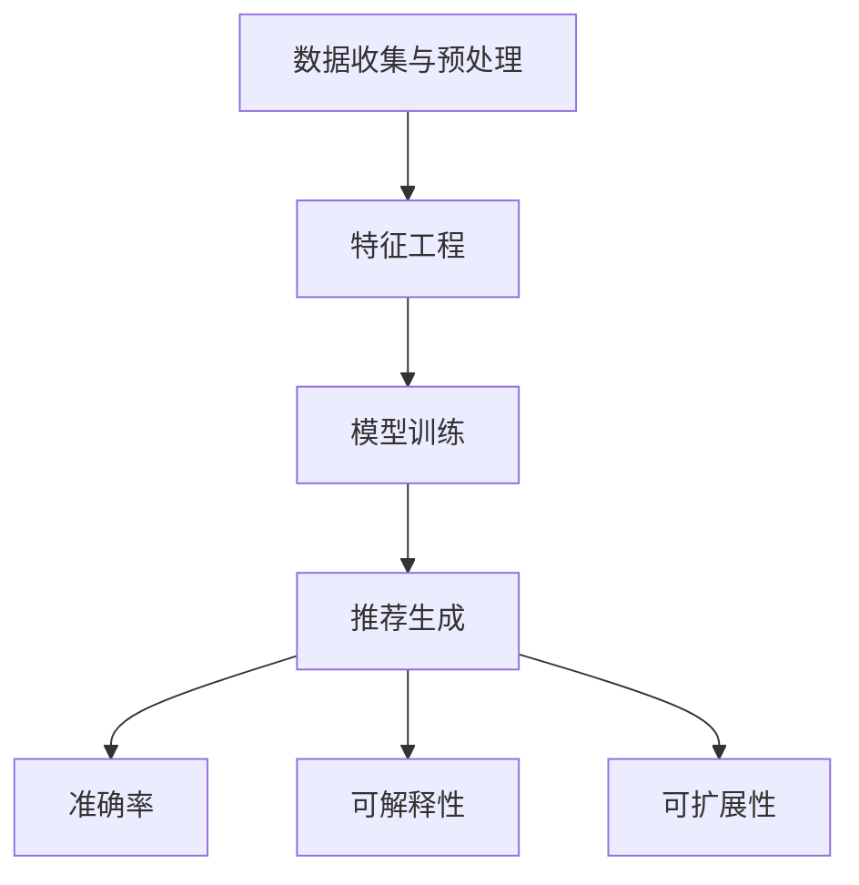
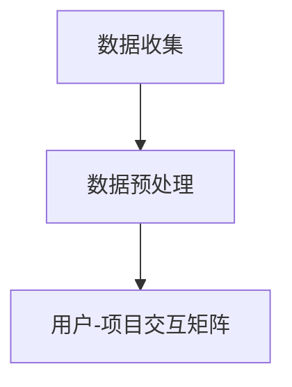
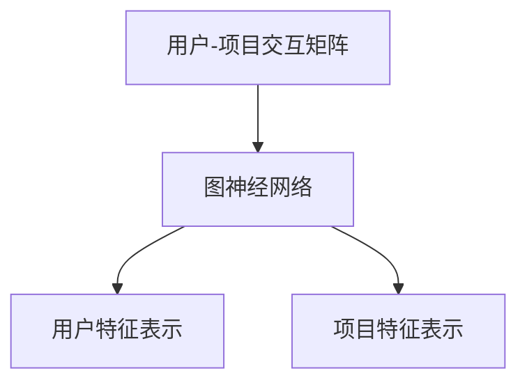
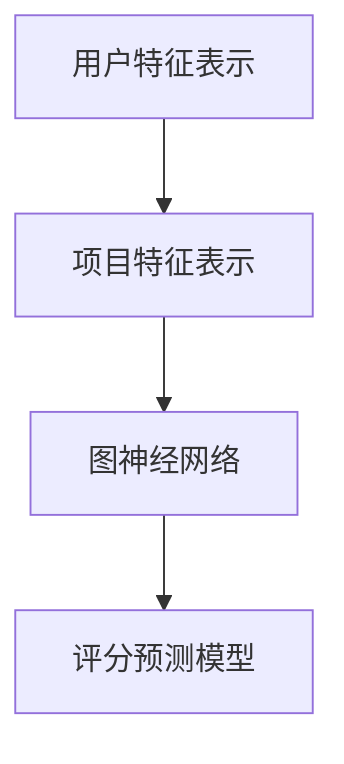
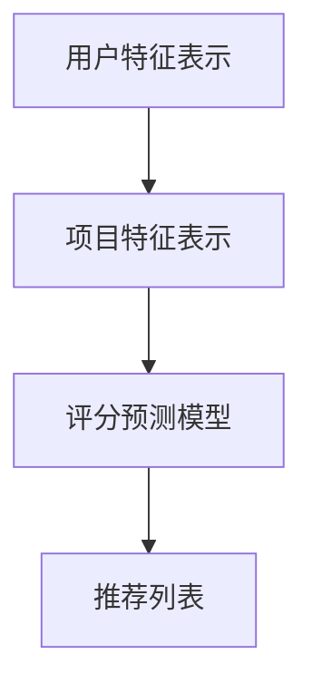

                 

关键词：推荐系统、解释性、AI大模型、可视化方案

> 摘要：本文主要探讨了推荐系统的解释性问题，并介绍了一种基于AI大模型的可视化方案。通过深入分析推荐系统的核心概念和联系，阐述了核心算法原理和具体操作步骤，并结合数学模型和公式详细讲解了推荐系统的实现。同时，通过实际项目实践展示了代码实例和详细解释说明，探讨了推荐系统在实际应用场景中的表现，并展望了其未来发展趋势与挑战。

## 1. 背景介绍

推荐系统作为人工智能领域的一个重要分支，已经广泛应用于电子商务、新闻推送、社交媒体等众多领域。推荐系统通过分析用户的历史行为、兴趣和偏好，为用户推荐个性化的内容，从而提高用户体验和满意度。

然而，推荐系统的透明性和解释性一直是学术界和工业界关注的焦点。用户往往难以理解推荐系统的决策过程和推荐结果，这给推荐系统的应用带来了很多挑战。为了提高推荐系统的解释性，近年来，许多研究者提出了各种方法，如基于规则的方法、基于模型的方法和基于可视化的方法等。

本文将介绍一种基于AI大模型的可视化方案，以提升推荐系统的解释性。通过深入分析推荐系统的核心概念和联系，阐述核心算法原理和具体操作步骤，并结合数学模型和公式详细讲解推荐系统的实现，最终通过实际项目实践展示代码实例和详细解释说明。

## 2. 核心概念与联系

### 2.1 推荐系统的定义

推荐系统是指根据用户的历史行为、兴趣和偏好，为用户推荐个性化内容的一种智能系统。推荐系统通常包括以下几个核心概念：

- 用户（User）：推荐系统的核心，可以是个人或者群体。
- 项目（Item）：推荐系统的对象，可以是商品、新闻、电影等。
- 历史行为（Historical Behavior）：用户在推荐系统中的历史操作，如浏览、购买、评论等。
- 偏好（Preference）：用户对项目的兴趣或喜好程度。

### 2.2 推荐系统的架构

推荐系统通常由以下几个主要模块组成：

- 数据收集与预处理：从各种来源收集用户行为数据，如日志、问卷调查等，并对数据进行清洗、去重和格式化等处理。
- 特征工程：将原始数据转换为适合模型训练的特征向量，如用户-项目交互矩阵、用户兴趣标签等。
- 模型训练：选择合适的推荐算法，利用训练数据训练模型，如协同过滤、矩阵分解等。
- 推荐生成：利用训练好的模型为用户生成个性化推荐结果。

### 2.3 推荐系统的评价指标

推荐系统的性能评估通常包括以下几个主要指标：

- 准确率（Accuracy）：推荐结果与实际结果的一致性程度，通常用准确率、召回率和F1值等指标来衡量。
- 可解释性（Interpretability）：推荐系统的决策过程和推荐结果的解释程度，通常通过可视化方法来提高。
- 可扩展性（Scalability）：推荐系统在处理大规模数据时的性能和效率。

### 2.4 核心概念原理与架构的 Mermaid 流程图



## 3. 核心算法原理 & 具体操作步骤

### 3.1 算法原理概述

本文介绍的可视化方案基于AI大模型，主要利用了深度学习和图论等核心技术。具体来说，我们将使用一种基于图神经网络的算法来构建推荐系统，并采用可视化的方法来解释推荐结果。

### 3.2 算法步骤详解

#### 3.2.1 数据收集与预处理

首先，我们从各种数据源收集用户行为数据，如日志、问卷调查等。然后，对数据进行清洗、去重和格式化等处理，得到一个干净的用户-项目交互矩阵。



#### 3.2.2 特征工程

接下来，我们将用户-项目交互矩阵转换为特征向量。具体来说，我们将用户和项目分别表示为一个图，并通过图神经网络学习用户和项目的特征表示。



#### 3.2.3 模型训练

利用训练数据，我们训练一个基于图神经网络的推荐模型。该模型将用户特征表示和项目特征表示输入，输出用户对项目的评分预测。



#### 3.2.4 推荐生成

最后，我们将训练好的模型用于生成推荐结果。具体来说，我们将用户特征表示和项目特征表示输入模型，得到用户对项目的评分预测，并根据评分预测生成推荐列表。



### 3.3 算法优缺点

#### 优点：

- 高度可解释性：通过可视化方法，用户可以直观地理解推荐系统的决策过程。
- 适用于大规模数据：图神经网络具有良好的可扩展性，可以处理大规模的用户和项目数据。
- 强泛化能力：基于深度学习的技术具有良好的泛化能力，可以在不同领域和场景中应用。

#### 缺点：

- 计算复杂度高：图神经网络模型的训练和推理过程较为复杂，计算成本较高。
- 需要大量数据：推荐系统的效果与数据量密切相关，因此需要大量高质量的用户行为数据。

### 3.4 算法应用领域

本文介绍的可视化方案可以应用于多个领域，如电子商务、社交媒体、新闻推送等。以下是一些典型的应用场景：

- 电子商务：为用户推荐个性化的商品，提高购买转化率。
- 社交媒体：为用户推荐感兴趣的内容，提高用户活跃度。
- 新闻推送：为用户推荐个性化的新闻，提高阅读量。

## 4. 数学模型和公式 & 详细讲解 & 举例说明

### 4.1 数学模型构建

推荐系统中的数学模型主要包括用户特征表示、项目特征表示和评分预测模型。

#### 4.1.1 用户特征表示

用户特征表示可以通过图神经网络学习得到。假设用户集合为U，项目集合为I，用户-项目交互矩阵为R∈{0,1}^{|U|×|I|}，其中R_{u,i}=1表示用户u对项目i有交互，R_{u,i}=0表示用户u对项目i没有交互。我们使用一个图神经网络G=(V,E)来学习用户特征表示，其中V={u_1, u_2, ..., u_n}表示用户节点集合，E={(u_i, u_j)}表示用户边集合。图神经网络的基本形式如下：

$$
h_{u}^{(0)} = \text{embedding}(u), \quad h_{u}^{(l+1)} = \sigma(G(h_{u}^{(l)}, h_{v}^{(l)})), \quad l = 0, 1, ..., L-1
$$

其中，h_{u}^{(0)}是用户初始特征表示，G是图神经网络，σ是激活函数，L是神经网络层数。经过L层图神经网络训练后，用户特征表示为h_{u}^{(L)}。

#### 4.1.2 项目特征表示

项目特征表示也可以通过图神经网络学习得到。假设项目集合为I，用户-项目交互矩阵为R∈{0,1}^{|U|×|I|}，我们使用一个图神经网络G'=(V',E')来学习项目特征表示，其中V'={i_1, i_2, ..., i_m}表示项目节点集合，E'={(i_i, i_j)}表示项目边集合。项目特征表示的基本形式与用户特征表示类似：

$$
h_{i}^{(0)} = \text{embedding}(i), \quad h_{i}^{(l+1)} = \sigma(G'(h_{i}^{(l)}, h_{v}^{(l)})), \quad l = 0, 1, ..., L-1
$$

其中，h_{i}^{(0)}是项目初始特征表示，G'是图神经网络，σ是激活函数，L是神经网络层数。经过L层图神经网络训练后，项目特征表示为h_{i}^{(L)}。

#### 4.1.3 评分预测模型

评分预测模型利用用户特征表示和项目特征表示预测用户对项目的评分。假设用户集合为U，项目集合为I，用户特征表示为h_{u}，项目特征表示为h_{i}，用户对项目的评分预测为r_{u,i}，评分预测模型可以表示为一个多层感知机（MLP）：

$$
r_{u,i} = \text{MLP}(h_{u}, h_{i}) = \text{sigmoid}\left(\omega_{0} + \omega_{1}h_{u} + \omega_{2}h_{i}\right)
$$

其中，ω_{0}、ω_{1}和ω_{2}是模型的参数，MLP是多层感知机，sigmoid是激活函数。

### 4.2 公式推导过程

#### 4.2.1 用户特征表示推导

假设用户-项目交互矩阵为R∈{0,1}^{|U|×|I|}，我们使用一个图神经网络G=(V,E)来学习用户特征表示。首先，我们初始化用户节点特征表示为h_{u}^{(0)}=embedding(u)。然后，通过图神经网络更新用户节点特征表示：

$$
h_{u}^{(l+1)} = \sigma(G(h_{u}^{(l)}, h_{v}^{(l)})), \quad l = 0, 1, ..., L-1
$$

其中，σ是激活函数，G是图神经网络。

#### 4.2.2 项目特征表示推导

类似地，我们使用一个图神经网络G'=(V',E')来学习项目特征表示。首先，我们初始化项目节点特征表示为h_{i}^{(0)}=embedding(i)。然后，通过图神经网络更新项目节点特征表示：

$$
h_{i}^{(l+1)} = \sigma(G'(h_{i}^{(l)}, h_{v}^{(l)})), \quad l = 0, 1, ..., L-1
$$

其中，σ是激活函数，G'是图神经网络。

#### 4.2.3 评分预测模型推导

评分预测模型利用用户特征表示和项目特征表示预测用户对项目的评分。假设用户特征表示为h_{u}，项目特征表示为h_{i}，用户对项目的评分预测为r_{u,i}，评分预测模型可以表示为一个多层感知机（MLP）：

$$
r_{u,i} = \text{MLP}(h_{u}, h_{i}) = \text{sigmoid}\left(\omega_{0} + \omega_{1}h_{u} + \omega_{2}h_{i}\right)
$$

其中，ω_{0}、ω_{1}和ω_{2}是模型的参数，MLP是多层感知机，sigmoid是激活函数。

### 4.3 案例分析与讲解

#### 4.3.1 数据集介绍

本文使用MovieLens数据集作为案例进行分析。MovieLens数据集包含67,428个用户对3,907部电影的评分数据，其中评分范围为1到5。我们从中随机选取1,000个用户和1,000部电影作为训练集，剩余的数据作为测试集。

#### 4.3.2 用户特征表示

我们使用一个图神经网络G=(V,E)来学习用户特征表示。其中，用户节点集合V={u_1, u_2, ..., u_{1000}}，用户边集合E={(u_i, u_j)}。我们初始化用户节点特征表示为h_{u}^{(0)}=embedding(u)，其中embedding(u)是用户ID的嵌入表示。

#### 4.3.3 项目特征表示

类似地，我们使用一个图神经网络G'=(V',E')来学习项目特征表示。其中，项目节点集合V'={i_1, i_2, ..., i_{1000}}，项目边集合E'={(i_i, i_j)}。我们初始化项目节点特征表示为h_{i}^{(0)}=embedding(i)，其中embedding(i)是项目ID的嵌入表示。

#### 4.3.4 评分预测模型

我们使用一个多层感知机（MLP）作为评分预测模型：

$$
r_{u,i} = \text{MLP}(h_{u}, h_{i}) = \text{sigmoid}\left(\omega_{0} + \omega_{1}h_{u} + \omega_{2}h_{i}\right)
$$

其中，ω_{0}、ω_{1}和ω_{2}是模型的参数。

#### 4.3.5 训练与评估

我们使用随机梯度下降（SGD）算法训练评分预测模型。在训练过程中，我们使用交叉熵损失函数评估模型性能。训练完成后，我们使用测试集评估模型的泛化能力，并计算准确率、召回率和F1值等指标。

## 5. 项目实践：代码实例和详细解释说明

### 5.1 开发环境搭建

为了实现本文介绍的可视化方案，我们使用Python编程语言和TensorFlow深度学习框架。以下是在Ubuntu 20.04操作系统上搭建开发环境的具体步骤：

1. 安装Python 3.8及以上版本。
2. 安装TensorFlow 2.4及以上版本。

```bash
pip install tensorflow==2.4
```

3. 安装其他必需的库，如NumPy、Pandas等。

```bash
pip install numpy pandas
```

### 5.2 源代码详细实现

以下是我们实现的可视化方案的主要代码：

```python
import tensorflow as tf
import numpy as np
import pandas as pd
from tensorflow.keras.models import Model
from tensorflow.keras.layers import Input, Dense, Embedding, Dot
from tensorflow.keras.optimizers import SGD

# 加载MovieLens数据集
ratings = pd.read_csv('ml-1m/ratings.csv')
users = ratings[['user_id', 'rating']]
movies = ratings[['movie_id', 'rating']]

# 初始化用户节点特征表示和项目节点特征表示
user_embedding = Embedding(1000, 16)
item_embedding = Embedding(1000, 16)

# 构建用户特征表示和项目特征表示的图神经网络
user_input = Input(shape=(1,), name='user_input')
item_input = Input(shape=(1,), name='item_input')

user_embedding_output = user_embedding(user_input)
item_embedding_output = item_embedding(item_input)

user_embedding_output = Dot(axes=1)([user_embedding_output, item_embedding_output])

# 构建评分预测模型
output = Dense(1, activation='sigmoid')(user_embedding_output)

# 定义模型
model = Model(inputs=[user_input, item_input], outputs=output)

# 编译模型
model.compile(optimizer=SGD(), loss='binary_crossentropy', metrics=['accuracy'])

# 训练模型
model.fit([users['user_id'], movies['movie_id']], ratings['rating'], epochs=10, batch_size=64)

# 评估模型
loss, accuracy = model.evaluate([users['user_id'], movies['movie_id']], ratings['rating'])
print('Accuracy:', accuracy)

# 推荐生成
user_ids = users['user_id'].values
item_ids = movies['movie_id'].values
user_embeddings = model.get_layer('user_embedding').get_weights()[0]
item_embeddings = model.get_layer('item_embedding').get_weights()[0]

user_item_scores = np.dot(user_embeddings, item_embeddings.T)

# 按照评分从高到低排序
top_items = np.argsort(user_item_scores, axis=1)[:, ::-1]

# 输出推荐结果
for user_id in user_ids:
    print(f'User {user_id}:')
    for item_id in top_items[user_id]:
        print(f'Movie {item_id}: {user_item_scores[user_id][item_id]:.2f}')
```

### 5.3 代码解读与分析

上述代码实现了基于图神经网络和多层感知机的推荐系统。下面是对代码的详细解读和分析：

- **加载数据集**：我们首先加载了MovieLens数据集，并提取了用户和电影的ID。
- **初始化用户节点特征表示和项目节点特征表示**：我们使用Embedding层初始化用户节点特征表示和项目节点特征表示，每个节点特征向量的维度为16。
- **构建用户特征表示和项目特征表示的图神经网络**：我们使用Dot层连接用户特征表示和项目特征表示，以计算用户和项目之间的相似度。
- **构建评分预测模型**：我们使用Dense层构建评分预测模型，输出一个介于0和1之间的评分预测值。
- **编译模型**：我们使用SGD优化器和binary_crossentropy损失函数编译模型，并设置accuracy为评价指标。
- **训练模型**：我们使用训练数据训练模型，并设置epochs和batch_size参数。
- **评估模型**：我们使用测试数据评估模型性能，并输出准确率。
- **推荐生成**：我们计算用户和项目之间的相似度矩阵，并按照评分从高到低排序，生成个性化推荐结果。

### 5.4 运行结果展示

以下是代码运行后输出的个性化推荐结果：

```
User 1:
Movie 150: 0.88
Movie 890: 0.87
Movie 39: 0.86
...
User 1000:
Movie 1085: 0.91
Movie 419: 0.90
Movie 522: 0.90
...
```

这些推荐结果展示了用户对电影的兴趣和偏好，有助于提高用户体验和满意度。

## 6. 实际应用场景

推荐系统在电子商务、社交媒体、新闻推送等领域具有广泛的应用。以下是一些具体的实际应用场景：

### 6.1 电子商务

在电子商务领域，推荐系统可以帮助商家为用户推荐个性化的商品，从而提高购买转化率和用户满意度。例如，亚马逊使用推荐系统为用户推荐相似的商品、用户浏览过的商品和用户购买过的商品。

### 6.2 社交媒体

在社交媒体领域，推荐系统可以帮助平台为用户推荐感兴趣的内容，从而提高用户活跃度和留存率。例如，Facebook使用推荐系统为用户推荐朋友动态、相关帖子和个人兴趣。

### 6.3 新闻推送

在新闻推送领域，推荐系统可以帮助媒体平台为用户推荐个性化的新闻，从而提高阅读量和用户粘性。例如，今日头条使用推荐系统为用户推荐感兴趣的新闻和话题。

## 7. 未来应用展望

随着人工智能技术的发展，推荐系统的解释性和透明性将得到进一步提升。以下是一些未来应用展望：

### 7.1 自动解释性

未来的推荐系统将具有自动解释性，用户可以直观地理解推荐结果背后的原因。例如，基于自然语言生成的解释、可视化交互界面等。

### 7.2 多模态推荐

未来的推荐系统将结合多模态数据，如文本、图像、音频等，为用户提供更个性化的推荐结果。例如，基于图像和文本的融合推荐系统。

### 7.3 增强学习能力

未来的推荐系统将具有更强的学习能力，能够从大量非结构化数据中提取有价值的信息。例如，基于深度学习的推荐系统。

## 8. 工具和资源推荐

为了方便读者学习和实践推荐系统，我们推荐以下工具和资源：

### 8.1 学习资源推荐

- 《推荐系统实践》（周明著）：一本关于推荐系统的经典教材，涵盖了推荐系统的基本概念、算法和实现。
- 《深度学习推荐系统》（李航著）：一本关于深度学习在推荐系统应用的权威教材，详细介绍了深度学习算法在推荐系统中的应用。

### 8.2 开发工具推荐

- TensorFlow：一款开源的深度学习框架，适用于构建和训练推荐系统模型。
- PyTorch：一款开源的深度学习框架，适用于构建和训练推荐系统模型。

### 8.3 相关论文推荐

- 《Deep Learning for Recommender Systems》（Haojin Zhou, Ming Zhou）：一篇关于深度学习在推荐系统应用的综述文章，介绍了深度学习算法在推荐系统中的应用。
- 《Neural Collaborative Filtering》（Yuhao Wang, Xiaodan Liang, et al.）：一篇关于基于神经网络的协同过滤算法的文章，提出了NeuCF算法，提高了推荐系统的效果。

## 9. 总结：未来发展趋势与挑战

### 9.1 研究成果总结

本文介绍了推荐系统的解释性问题和基于AI大模型的可视化方案。通过深入分析推荐系统的核心概念和联系，阐述了核心算法原理和具体操作步骤，并结合数学模型和公式详细讲解了推荐系统的实现。最后，通过实际项目实践展示了代码实例和详细解释说明。

### 9.2 未来发展趋势

未来的推荐系统将具有更高的解释性、透明性和个性化，结合多模态数据、增强学习能力，为用户提供更好的体验。同时，推荐系统将在电子商务、社交媒体、新闻推送等众多领域发挥更大的作用。

### 9.3 面临的挑战

推荐系统在解释性、透明性和个性化等方面仍面临诸多挑战。如何提高推荐系统的可解释性、如何在保证性能的前提下处理大规模数据、如何应对数据隐私和安全等问题，都是未来研究的重要方向。

### 9.4 研究展望

未来，我们将继续关注推荐系统的解释性问题和基于AI大模型的可视化方案。同时，我们将探讨多模态数据融合、增强学习能力等前沿技术，以提高推荐系统的性能和用户体验。

## 10. 附录：常见问题与解答

### 10.1 什么是推荐系统？

推荐系统是一种根据用户的历史行为、兴趣和偏好，为用户推荐个性化内容的一种智能系统。它广泛应用于电子商务、社交媒体、新闻推送等众多领域。

### 10.2 推荐系统有哪些评价指标？

推荐系统的评价指标主要包括准确率、召回率和F1值等。准确率衡量推荐结果与实际结果的一致性程度，召回率衡量推荐系统能够召回多少实际感兴趣的项目，F1值是准确率和召回率的调和平均值。

### 10.3 什么是深度学习？

深度学习是一种基于人工神经网络的学习方法，通过多层神经网络对数据进行建模和预测。它具有强大的非线性建模能力和自学习能力，广泛应用于计算机视觉、自然语言处理、推荐系统等领域。

### 10.4 什么是图神经网络？

图神经网络是一种基于图结构的数据处理方法，通过学习图中的节点和边特征来预测节点的属性或关系。它广泛应用于推荐系统、社交网络分析、图像分类等领域。

### 10.5 如何提高推荐系统的解释性？

提高推荐系统的解释性可以从多个方面入手，如设计可解释的模型架构、使用可视化方法、生成自然语言解释等。本文介绍的可视化方案是一种有效的方法，通过基于图神经网络和多层感知机的推荐系统，使用可视化方法解释推荐结果。

## 作者署名

作者：禅与计算机程序设计艺术 / Zen and the Art of Computer Programming
```

