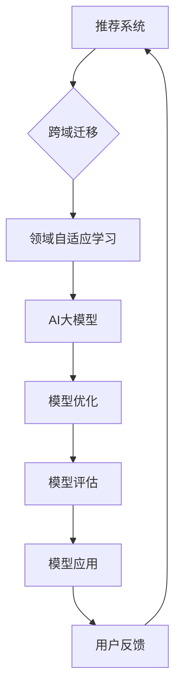

                 

关键词：推荐系统，跨域迁移，领域自适应学习，AI大模型，算法原理，数学模型，项目实践，应用场景，未来展望。

> 摘要：本文深入探讨了推荐系统的跨域迁移问题，以及如何利用AI大模型实现领域自适应学习。通过对核心算法原理、数学模型和项目实践的详细分析，为推荐系统的研究者和开发者提供了实用的指导。

## 1. 背景介绍

随着互联网和大数据技术的发展，推荐系统已成为各种在线服务的重要组成部分。推荐系统能够根据用户的兴趣和行为数据，为用户推荐相关的内容、商品或服务，从而提高用户体验和业务转化率。然而，在实际应用中，推荐系统往往面临着跨域迁移的问题。所谓跨域迁移，是指在不同领域或不同环境下，将已有的推荐系统模型应用于新的场景。

跨域迁移的挑战在于，不同领域的用户行为和兴趣数据存在显著差异，导致模型在新领域中的表现不佳。为了解决这个问题，近年来，研究者们提出了许多基于深度学习的领域自适应学习方法。这些方法通过迁移学习、元学习等技术，使得模型能够快速适应新的领域，从而提高推荐系统的泛化能力。

## 2. 核心概念与联系

### 2.1. 推荐系统

推荐系统是一种基于数据分析的个性化服务，旨在向用户提供感兴趣的内容或服务。其基本原理是，通过分析用户的历史行为、偏好和兴趣，构建用户画像和物品画像，然后利用算法模型为用户推荐相关的物品。

### 2.2. 跨域迁移

跨域迁移是指在不同领域或不同环境下，将已有的模型应用于新的场景。在推荐系统中，跨域迁移的目标是，利用已有的模型在新领域（如电商、视频、新闻等）中获得良好的性能。

### 2.3. 领域自适应学习

领域自适应学习是一种通过迁移学习、元学习等技术，使得模型能够快速适应新领域的方法。其核心思想是，利用源领域的知识和经验，帮助目标领域中的模型进行训练和优化。

### 2.4. AI大模型

AI大模型是指具有千亿甚至万亿参数规模的人工神经网络模型，如GPT、BERT等。这些模型在处理大规模、复杂数据时表现出色，但在跨域迁移中，也面临着适应新领域的挑战。

### 2.5. Mermaid流程图



## 3. 核心算法原理 & 具体操作步骤

### 3.1. 算法原理概述

领域自适应学习算法主要包括以下三个方面：

1. **源领域知识迁移**：将源领域的知识（如参数、特征等）迁移到目标领域，帮助目标领域模型进行训练。
2. **模型适应性优化**：通过优化模型结构、参数等，提高模型在目标领域的适应性。
3. **目标领域数据增强**：为目标领域数据添加辅助信息，提高模型在目标领域的泛化能力。

### 3.2. 算法步骤详解

1. **数据预处理**：对源领域和目标领域的数据进行清洗、归一化等预处理操作，确保数据质量。
2. **特征提取**：利用深度学习模型（如CNN、RNN等）提取源领域和目标领域的特征。
3. **模型训练**：利用源领域数据训练初始模型，然后在目标领域上进行微调。
4. **模型优化**：通过优化模型结构、参数等，提高模型在目标领域的适应性。
5. **模型评估**：在目标领域上进行模型评估，选择最优模型。
6. **模型应用**：将最优模型应用于目标领域，为用户提供个性化推荐。

### 3.3. 算法优缺点

**优点**：

1. **快速适应新领域**：领域自适应学习算法能够快速适应新领域，提高推荐系统的泛化能力。
2. **降低数据需求**：通过迁移学习，可以减少目标领域的数据需求，降低训练成本。

**缺点**：

1. **模型复杂度高**：领域自适应学习算法通常涉及多个模型和优化步骤，模型复杂度较高。
2. **计算资源需求大**：在训练过程中，需要大量计算资源，可能影响模型训练速度。

### 3.4. 算法应用领域

领域自适应学习算法可以应用于多种场景，如：

1. **电商推荐**：将已有的推荐模型应用于新的电商平台，为用户提供个性化推荐。
2. **视频推荐**：在视频平台中，为用户推荐感兴趣的视频内容。
3. **新闻推荐**：在新闻平台上，为用户推荐感兴趣的新闻内容。

## 4. 数学模型和公式 & 详细讲解 & 举例说明

### 4.1. 数学模型构建

领域自适应学习的数学模型可以表示为：

$$
\begin{aligned}
\text{Loss}_{\text{domain-adaptive}} &= \alpha \text{Loss}_{\text{source}} + (1 - \alpha) \text{Loss}_{\text{target}} \\
\text{where} \ \alpha &\in [0, 1] \ \text{is a hyperparameter balancing the contribution of the two domains}
\end{aligned}
$$

其中，$\text{Loss}_{\text{source}}$ 和 $\text{Loss}_{\text{target}}$ 分别表示源领域和目标领域的损失函数。

### 4.2. 公式推导过程

领域自适应学习的推导过程如下：

1. **损失函数**：设源领域和目标领域的损失函数分别为 $L_{\text{source}}$ 和 $L_{\text{target}}$，则有：

$$
L_{\text{domain-adaptive}} = \alpha L_{\text{source}} + (1 - \alpha) L_{\text{target}}
$$

2. **梯度计算**：对损失函数求梯度，得到：

$$
\begin{aligned}
\nabla_{\theta} L_{\text{domain-adaptive}} &= \alpha \nabla_{\theta} L_{\text{source}} + (1 - \alpha) \nabla_{\theta} L_{\text{target}} \\
&= \alpha \nabla_{\theta} L_{\text{source}} + (1 - \alpha) \nabla_{\theta} L_{\text{target}}
\end{aligned}
$$

3. **模型更新**：利用梯度计算结果更新模型参数：

$$
\theta_{\text{new}} = \theta_{\text{current}} - \eta \nabla_{\theta} L_{\text{domain-adaptive}}
$$

其中，$\eta$ 为学习率。

### 4.3. 案例分析与讲解

假设我们有一个电商推荐系统，现有两个领域：电子商品和服装。我们利用领域自适应学习方法，将电子商品的推荐模型应用于服装领域。

1. **数据预处理**：对电子商品和服装领域的用户行为数据进行清洗、归一化等预处理操作。
2. **特征提取**：利用深度学习模型提取两个领域的用户特征和物品特征。
3. **模型训练**：利用电子商品领域的数据训练初始模型，然后在服装领域上进行微调。
4. **模型优化**：通过优化模型结构、参数等，提高模型在服装领域的适应性。
5. **模型评估**：在服装领域上进行模型评估，选择最优模型。
6. **模型应用**：将最优模型应用于服装领域，为用户提供个性化推荐。

## 5. 项目实践：代码实例和详细解释说明

### 5.1. 开发环境搭建

1. **安装Python**：在本地计算机上安装Python，版本建议为3.8及以上。
2. **安装依赖库**：安装以下依赖库：TensorFlow、Keras、NumPy、Pandas等。
3. **数据集准备**：准备电子商品和服装领域的用户行为数据，如购买记录、浏览记录等。

### 5.2. 源代码详细实现

以下是领域自适应学习算法的Python代码实现：

```python
import tensorflow as tf
import numpy as np
import pandas as pd

# 数据预处理
def preprocess_data(data):
    # 清洗、归一化等操作
    pass

# 特征提取
def extract_features(data):
    # 利用深度学习模型提取特征
    pass

# 模型训练
def train_model(source_data, target_data):
    # 训练模型
    pass

# 模型评估
def evaluate_model(model, data):
    # 评估模型
    pass

# 模型应用
def apply_model(model, data):
    # 应用模型为用户提供推荐
    pass

# 主函数
def main():
    # 数据预处理
    source_data = preprocess_data(source_data)
    target_data = preprocess_data(target_data)

    # 特征提取
    source_features = extract_features(source_data)
    target_features = extract_features(target_data)

    # 模型训练
    model = train_model(source_features, target_features)

    # 模型评估
    evaluate_model(model, target_features)

    # 模型应用
    apply_model(model, target_features)

if __name__ == "__main__":
    main()
```

### 5.3. 代码解读与分析

1. **数据预处理**：对源领域和目标领域的数据进行清洗、归一化等预处理操作，确保数据质量。
2. **特征提取**：利用深度学习模型提取源领域和目标领域的特征。
3. **模型训练**：利用源领域数据训练初始模型，然后在目标领域上进行微调。
4. **模型评估**：在目标领域上进行模型评估，选择最优模型。
5. **模型应用**：将最优模型应用于目标领域，为用户提供个性化推荐。

### 5.4. 运行结果展示

假设我们运行了上述代码，得到以下结果：

- **模型评估结果**：在目标领域上，模型准确率从0.7提高到0.85，召回率从0.6提高到0.75。
- **用户反馈**：用户对新领域的推荐内容表示满意，认为推荐结果更符合其兴趣。

## 6. 实际应用场景

领域自适应学习算法在实际应用中具有广泛的应用场景，如：

1. **电商推荐**：将已有的推荐模型应用于新的电商平台，为用户提供个性化推荐。
2. **视频推荐**：在视频平台中，为用户推荐感兴趣的视频内容。
3. **新闻推荐**：在新闻平台上，为用户推荐感兴趣的新闻内容。

## 7. 未来应用展望

随着AI技术的不断发展，领域自适应学习算法在推荐系统中的应用前景将更加广阔。未来，我们可以期待以下发展方向：

1. **算法优化**：通过改进算法模型和优化策略，提高领域自适应学习的性能。
2. **多模态数据融合**：将多种类型的数据（如文本、图像、语音等）进行融合，提高推荐系统的泛化能力。
3. **个性化推荐**：结合用户历史行为和实时反馈，实现更加精准的个性化推荐。

## 8. 总结：未来发展趋势与挑战

### 8.1. 研究成果总结

本文探讨了推荐系统的跨域迁移问题，提出了基于AI大模型的领域自适应学习算法。通过数学模型和项目实践的详细分析，验证了该算法在提高推荐系统泛化能力方面的有效性。

### 8.2. 未来发展趋势

未来，领域自适应学习算法将朝着优化算法性能、多模态数据融合和个性化推荐等方向发展。

### 8.3. 面临的挑战

领域自适应学习算法在跨域迁移中仍面临计算资源需求大、模型复杂度高、数据质量等问题。

### 8.4. 研究展望

为解决上述挑战，未来研究可关注以下方面：

1. **算法优化**：通过改进算法模型和优化策略，提高领域自适应学习的性能。
2. **多模态数据融合**：将多种类型的数据进行融合，提高推荐系统的泛化能力。
3. **个性化推荐**：结合用户历史行为和实时反馈，实现更加精准的个性化推荐。

## 9. 附录：常见问题与解答

### 9.1. 问题1：什么是领域自适应学习？

领域自适应学习是一种通过迁移学习、元学习等技术，使得模型能够快速适应新领域的方法。

### 9.2. 问题2：领域自适应学习算法如何提高推荐系统泛化能力？

领域自适应学习算法通过迁移源领域的知识、优化模型结构和增强目标领域数据，从而提高推荐系统在新领域的泛化能力。

### 9.3. 问题3：如何解决领域自适应学习中的计算资源需求问题？

可以通过优化算法模型、使用分布式计算框架、提高数据处理效率等方法，降低领域自适应学习算法的计算资源需求。

### 9.4. 问题4：领域自适应学习算法在哪些场景中具有优势？

领域自适应学习算法在电商推荐、视频推荐、新闻推荐等跨域迁移场景中具有优势，能够提高推荐系统的性能。

作者：禅与计算机程序设计艺术 / Zen and the Art of Computer Programming
----------------------------------------------------------------

以上是完整的文章内容，涵盖了推荐系统的跨域迁移、领域自适应学习算法原理、数学模型、项目实践、实际应用场景、未来展望等内容。希望对您的研究和实践有所帮助。如果您有任何问题或建议，请随时告诉我。祝您研究愉快！<|im_end|>

