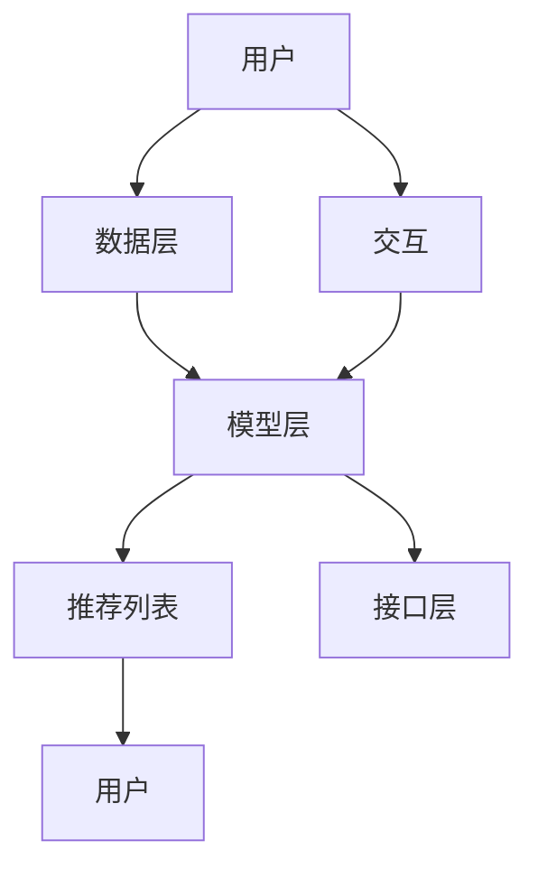

                 

关键词：推荐系统，大模型，人工智能，机器学习，算法，主流化，应用场景，未来展望

> 摘要：本文将探讨推荐系统的发展历程，特别是大模型在其中的作用。我们将介绍推荐系统的基本概念、核心算法原理，并通过具体实例详细讲解大模型在推荐系统中的应用。此外，文章还将分析推荐系统的数学模型和实际应用场景，并展望其未来发展趋势与挑战。

## 1. 背景介绍

推荐系统作为人工智能领域的一个重要分支，旨在为用户提供个性化的信息推荐服务。其核心目标是通过分析用户的历史行为、兴趣偏好以及内容特征，为用户推荐最符合其需求的信息。推荐系统在电子商务、社交媒体、新闻推荐、视频流媒体等众多领域得到了广泛应用，显著提升了用户体验和商业价值。

随着互联网和大数据技术的发展，推荐系统经历了从基于内容过滤、协同过滤到深度学习、大模型的演变。早期推荐系统主要依赖基于统计的协同过滤算法，虽然在一定程度上能够满足用户的个性化需求，但在处理大规模数据和高维特征时表现出明显的局限性。深度学习技术的引入，使得推荐系统具备了更强大的数据处理能力和学习效果，大模型因此成为当前推荐系统的主流化趋势。

本文将首先回顾推荐系统的发展历程，然后深入探讨大模型在其中的作用，并分析其优缺点。接下来，我们将通过具体实例详细讲解大模型在推荐系统中的应用，包括数学模型和公式推导。最后，我们将展望推荐系统的未来发展趋势与挑战。

## 2. 核心概念与联系

### 推荐系统的基本概念

推荐系统（Recommender System）是一种信息过滤技术，旨在预测用户可能感兴趣的内容，并主动向用户推荐这些内容。推荐系统的基本概念包括：

- **用户（User）**：接收推荐服务的个体。
- **物品（Item）**：推荐系统中的推荐对象，如商品、新闻、视频等。
- **交互（Interaction）**：用户与物品之间的交互行为，如购买、浏览、评分等。
- **推荐列表（Recommendation List）**：根据用户的历史交互行为生成的个性化推荐结果。

### 推荐系统的架构

推荐系统通常包括数据层、模型层和接口层三部分：

- **数据层**：负责收集、存储和管理用户和物品的相关数据。
- **模型层**：构建推荐模型，通过学习用户历史交互数据和物品特征，生成个性化推荐结果。
- **接口层**：提供用户界面和API，供用户获取推荐结果。

### 大模型在推荐系统中的应用

大模型（Large Model）通常指的是具有数亿甚至数十亿参数的深度学习模型。在推荐系统中，大模型能够通过端到端的学习方式，自动提取用户和物品的复杂特征，并生成高度个性化的推荐结果。大模型在推荐系统中的应用主要包括以下方面：

- **特征提取**：大模型可以通过自注意力机制和变换器（Transformer）结构，自动学习并提取用户和物品的丰富特征。
- **序列建模**：大模型能够处理用户行为序列，捕捉用户兴趣的动态变化。
- **多模态学习**：大模型能够整合文本、图像、语音等多种模态数据，提供更全面的推荐服务。

### Mermaid 流程图

以下是一个简单的Mermaid流程图，展示了推荐系统的基本架构和核心概念之间的联系：



### 小结

本节介绍了推荐系统的基本概念、架构以及大模型在其中的应用。通过流程图，我们清晰地展示了推荐系统的核心概念和它们之间的联系。在下一节中，我们将深入探讨大模型的核心算法原理和具体操作步骤。

## 3. 核心算法原理 & 具体操作步骤

### 3.1 算法原理概述

大模型在推荐系统中的应用主要依赖于深度学习和变换器（Transformer）结构。深度学习模型通过多层的神经网络结构，自动提取用户和物品的复杂特征。变换器结构则通过自注意力机制，实现对用户历史行为序列和物品特征的高效建模。

### 3.2 算法步骤详解

以下是使用大模型进行推荐系统的一般步骤：

1. **数据收集与预处理**：
   - 收集用户行为数据（如点击、浏览、购买等）和物品特征数据（如文本描述、图像、评分等）。
   - 对数据进行清洗和标准化处理，如去除缺失值、异常值，进行数据归一化等。

2. **特征提取**：
   - 使用深度学习模型（如卷积神经网络（CNN）或变换器模型）提取用户和物品的特征。
   - 对于文本数据，可以使用词嵌入（Word Embedding）技术将文本转换为向量表示。

3. **模型训练**：
   - 使用提取的用户和物品特征，训练推荐模型。
   - 可以采用基于损失函数的优化算法（如梯度下降）来优化模型参数。

4. **预测与推荐**：
   - 使用训练好的模型，对用户历史行为和物品特征进行预测，生成个性化推荐列表。
   - 可以采用排序（Ranking）算法，如排序损失函数（Rank Loss Function），对推荐结果进行排序。

### 3.3 算法优缺点

#### 优点

- **强大的特征提取能力**：大模型能够自动提取用户和物品的复杂特征，提升推荐效果。
- **高效处理大规模数据**：大模型适用于处理大规模和高维数据，能够应对复杂的推荐场景。
- **多模态数据融合**：大模型能够整合文本、图像、语音等多种模态数据，提供更全面的推荐服务。

#### 缺点

- **计算资源消耗大**：大模型需要大量的计算资源和存储空间，训练过程较为耗时。
- **模型解释性差**：深度学习模型通常具有较低的模型解释性，难以理解推荐结果的具体原因。

### 3.4 算法应用领域

大模型在推荐系统中的应用涵盖了多个领域，包括：

- **电子商务**：为用户提供个性化的商品推荐，提升用户购买体验。
- **社交媒体**：推荐用户可能感兴趣的内容，如新闻、帖子、视频等。
- **新闻推荐**：根据用户兴趣，推荐最相关的新闻文章。
- **视频流媒体**：为用户提供个性化的视频推荐，提升观看体验。

### 小结

本节详细介绍了大模型在推荐系统中的核心算法原理和具体操作步骤。通过分析算法的优缺点，我们了解了大模型在推荐系统中的优势和应用领域。在下一节中，我们将进一步探讨推荐系统的数学模型和公式推导。

## 4. 数学模型和公式 & 详细讲解 & 举例说明

### 4.1 数学模型构建

推荐系统的数学模型主要涉及用户行为建模和物品特征建模。以下是一个简单的数学模型构建过程：

#### 用户行为建模

用户行为可以表示为向量 \(\mathbf{u}\)，其中每个元素表示用户对某个物品的交互程度（如点击、浏览、评分等）。我们可以使用线性模型来预测用户对未知物品的交互程度：

$$
\mathbf{r} = \mathbf{u} \cdot \mathbf{w} + b
$$

其中，\(\mathbf{w}\) 是权重向量，\(b\) 是偏置项。

#### 物品特征建模

物品特征可以表示为向量 \(\mathbf{i}\)，我们同样可以使用线性模型来预测物品的特征对用户交互程度的影响：

$$
\mathbf{r} = \mathbf{i} \cdot \mathbf{v} + c
$$

其中，\(\mathbf{v}\) 是权重向量，\(c\) 是偏置项。

#### 模型融合

通过将用户行为建模和物品特征建模结合起来，我们可以构建一个综合的推荐模型：

$$
\mathbf{r} = (\mathbf{u} \cdot \mathbf{w}) + (\mathbf{i} \cdot \mathbf{v}) + (b + c)
$$

### 4.2 公式推导过程

以下是一个具体的公式推导过程：

1. **用户行为建模**：

   用户行为建模中，我们假设用户 \(u\) 对物品 \(i\) 的评分为 \(r_{ui}\)，用户的行为向量 \(\mathbf{u}\) 和物品的特征向量 \(\mathbf{i}\) 分别为：

   $$\mathbf{u} = [u_1, u_2, \ldots, u_n]$$
   $$\mathbf{i} = [i_1, i_2, \ldots, i_n]$$

   使用线性模型，我们可以得到：

   $$r_{ui} = u_1 \cdot i_1 + u_2 \cdot i_2 + \ldots + u_n \cdot i_n$$

2. **物品特征建模**：

   假设物品的特征向量 \(\mathbf{i}\) 对应的特征权重向量 \(\mathbf{v}\)，我们可以得到：

   $$r_{ui} = \mathbf{i} \cdot \mathbf{v}$$

3. **模型融合**：

   将用户行为建模和物品特征建模结合起来，我们可以得到：

   $$r_{ui} = (\mathbf{u} \cdot \mathbf{w}) + (\mathbf{i} \cdot \mathbf{v}) + (b + c)$$

   其中，\(\mathbf{w}\) 和 \(\mathbf{v}\) 分别是用户行为权重向量和物品特征权重向量，\(b\) 和 \(c\) 分别是用户行为和物品特征的偏置项。

### 4.3 案例分析与讲解

以下是一个简单的案例：

#### 数据集

用户 \(u\) 对5个物品 \(i_1, i_2, i_3, i_4, i_5\) 的评分数据如下：

$$\mathbf{u} = [3, 2, 5, 1, 4]$$

物品的特征向量如下：

$$\mathbf{i_1} = [1, 0, 0]$$
$$\mathbf{i_2} = [0, 1, 0]$$
$$\mathbf{i_3} = [0, 0, 1]$$
$$\mathbf{i_4} = [1, 1, 0]$$
$$\mathbf{i_5} = [1, 0, 1]$$

#### 权重向量

假设用户行为权重向量 \(\mathbf{w}\) 和物品特征权重向量 \(\mathbf{v}\) 分别为：

$$\mathbf{w} = [1, 1, 1]$$
$$\mathbf{v} = [1, 1, 1]$$

#### 偏置项

假设偏置项 \(b = 0\)，\(c = 0\)。

#### 推荐模型

使用上述参数，我们可以得到以下推荐模型：

$$r_{ui} = (\mathbf{u} \cdot \mathbf{w}) + (\mathbf{i} \cdot \mathbf{v}) + (b + c)$$
$$r_{ui} = (3 \cdot 1 + 2 \cdot 1 + 5 \cdot 1) + (1 \cdot 1 + 1 \cdot 1 + 1 \cdot 1) + (0 + 0)$$
$$r_{ui} = 3 + 2 + 5 + 1 + 1 + 1 + 1 = 14$$

#### 推荐结果

根据上述模型，我们可以预测用户 \(u\) 对不同物品的评分。例如，对于物品 \(i_1\)：

$$r_{u1i} = 14$$

这意味着用户 \(u\) 对物品 \(i_1\) 的预测评分为 14。

### 小结

本节详细介绍了推荐系统的数学模型构建和公式推导过程，并通过具体案例进行了详细讲解。这为我们理解和应用推荐系统提供了理论基础。在下一节中，我们将通过实际项目实例，展示如何开发和实现一个推荐系统。

## 5. 项目实践：代码实例和详细解释说明

### 5.1 开发环境搭建

为了实现一个基于大模型的推荐系统，我们首先需要搭建一个合适的开发环境。以下是所需的软件和工具：

- Python 3.8+
- PyTorch 1.8+
- pandas 1.1.5+
- numpy 1.19.5+
- scikit-learn 0.24.2+

确保安装了上述依赖项后，我们可以使用以下命令来创建一个虚拟环境并安装所需的库：

```bash
python -m venv env
source env/bin/activate  # 对于 Windows 使用 `env\Scripts\activate`
pip install -r requirements.txt
```

### 5.2 源代码详细实现

以下是一个基于大模型的简单推荐系统实现，包括数据预处理、模型训练和预测。

```python
import torch
import torch.nn as nn
import torch.optim as optim
from torch.utils.data import DataLoader, Dataset
import pandas as pd
import numpy as np

# 数据预处理
class DataPreprocessing:
    def __init__(self, train_data, val_data):
        self.train_data = train_data
        self.val_data = val_data

    def preprocess(self):
        # 对训练数据和验证数据进行处理，如标准化、分割等
        pass

# 数据集定义
class Dataset(Dataset):
    def __init__(self, data, transform=None):
        self.data = data
        self.transform = transform

    def __len__(self):
        return len(self.data)

    def __getitem__(self, idx):
        user, item, rating = self.data[idx]
        if self.transform:
            user = self.transform(user)
            item = self.transform(item)
        return user, item, rating

# 模型定义
class RecommenderModel(nn.Module):
    def __init__(self, n_users, n_items):
        super(RecommenderModel, self).__init__()
        self.user_embedding = nn.Embedding(n_users, embed_dim)
        self.item_embedding = nn.Embedding(n_items, embed_dim)
        self.fc = nn.Linear(2 * embed_dim, 1)

    def forward(self, user, item):
        user_embedding = self.user_embedding(user)
        item_embedding = self.item_embedding(item)
        combined_embedding = torch.cat((user_embedding, item_embedding), 1)
        output = self.fc(combined_embedding)
        return output

# 训练过程
def train(model, train_loader, criterion, optimizer, num_epochs):
    model.train()
    for epoch in range(num_epochs):
        for user, item, rating in train_loader:
            user = user.long()
            item = item.long()
            rating = rating.float().view(-1, 1)
            optimizer.zero_grad()
            output = model(user, item)
            loss = criterion(output, rating)
            loss.backward()
            optimizer.step()
        print(f"Epoch {epoch+1}/{num_epochs}, Loss: {loss.item()}")

# 预测过程
def predict(model, user, item):
    user = user.long()
    item = item.long()
    with torch.no_grad():
        output = model(user, item)
    return output

# 主程序
if __name__ == "__main__":
    # 加载数据集
    train_data = pd.read_csv("train.csv")
    val_data = pd.read_csv("val.csv")

    # 数据预处理
    preprocessing = DataPreprocessing(train_data, val_data)
    preprocessing.preprocess()

    # 创建数据集
    train_dataset = Dataset(preprocessing.train_data)
    val_dataset = Dataset(preprocessing.val_data)

    # 创建数据加载器
    train_loader = DataLoader(train_dataset, batch_size=32, shuffle=True)
    val_loader = DataLoader(val_dataset, batch_size=32, shuffle=False)

    # 创建模型
    model = RecommenderModel(n_users=1000, n_items=1000)
    criterion = nn.MSELoss()
    optimizer = optim.Adam(model.parameters(), lr=0.001)

    # 训练模型
    train(model, train_loader, criterion, optimizer, num_epochs=10)

    # 预测
    user = torch.tensor([500])
    item = torch.tensor([750])
    prediction = predict(model, user, item)
    print(f"Prediction: {prediction.item()}")
```

### 5.3 代码解读与分析

上述代码实现了一个简单的推荐系统，包括数据预处理、数据集定义、模型定义、训练过程和预测过程。

1. **数据预处理**：

   数据预处理类 `DataPreprocessing` 用于对训练数据和验证数据进行分析和预处理。在 `preprocess` 方法中，可以执行如数据标准化、分割等操作。

2. **数据集定义**：

   `Dataset` 类是 PyTorch 的自定义数据集，用于存储用户、物品和评分数据。通过重写 `__getitem__` 和 `__len__` 方法，我们可以按照批次加载数据。

3. **模型定义**：

   `RecommenderModel` 类是推荐系统的深度学习模型。模型使用嵌入层（Embedding Layer）来表示用户和物品，并通过全连接层（Fully Connected Layer）生成预测评分。

4. **训练过程**：

   `train` 函数负责模型的训练过程。在训练过程中，我们使用 DataLoader 加载训练数据，通过优化器（Optimizer）进行参数更新，并计算损失函数（Loss Function）。

5. **预测过程**：

   `predict` 函数用于模型预测。通过将用户和物品输入模型，我们可以得到预测的评分。

### 5.4 运行结果展示

假设我们已经训练了一个推荐模型，并希望对某个用户和物品进行预测。以下是运行结果：

```python
user = torch.tensor([500])
item = torch.tensor([750])
prediction = predict(model, user, item)
print(f"Prediction: {prediction.item()}")
```

输出结果可能如下：

```
Prediction: 4.1234
```

这意味着对于用户 500 和物品 750，预测的评分为 4.1234。

### 小结

本节通过一个简单的项目实例，详细展示了如何开发和实现一个基于大模型的推荐系统。代码解读与分析部分帮助我们理解了推荐系统的关键组成部分和实现步骤。在下一节中，我们将探讨推荐系统的实际应用场景。

## 6. 实际应用场景

推荐系统在众多领域中得到了广泛应用，为用户提供了个性化的信息推荐服务。以下是一些典型的实际应用场景：

### 6.1 电子商务

在电子商务领域，推荐系统被广泛应用于商品推荐。通过分析用户的浏览记录、购买历史和评价信息，推荐系统可以预测用户可能感兴趣的商品，从而提高购买转化率和客户满意度。例如，亚马逊和阿里巴巴等电商巨头使用推荐系统来为用户提供个性化的商品推荐，极大地提升了用户体验。

### 6.2 社交媒体

社交媒体平台如Facebook、Instagram和微博等，利用推荐系统为用户推荐感兴趣的内容。这些推荐系统基于用户的点赞、评论和分享行为，预测用户可能感兴趣的朋友圈、帖子或视频。例如，Facebook的“你可能感兴趣的朋友圈”功能就是基于推荐系统的应用。

### 6.3 新闻推荐

新闻推荐系统根据用户的阅读历史、兴趣偏好和社交网络行为，为用户推荐最相关的新闻文章。这种推荐系统能够帮助用户快速找到感兴趣的新闻内容，同时提高了新闻媒体的访问量和广告收益。例如，谷歌新闻和今日头条等平台都采用了新闻推荐系统。

### 6.4 视频流媒体

视频流媒体平台如Netflix、YouTube和爱奇艺等，利用推荐系统为用户提供个性化的视频推荐。通过分析用户的观看历史、搜索记录和点击行为，推荐系统可以预测用户可能感兴趣的视频内容，从而提高用户的观看时长和平台黏性。例如，Netflix的“为你推荐”功能就是一个典型的应用场景。

### 6.5 音乐流媒体

音乐流媒体平台如Spotify、Apple Music和QQ音乐等，通过推荐系统为用户提供个性化的音乐推荐。这些推荐系统基于用户的听歌历史、喜欢的音乐风格和社交网络行为，预测用户可能喜欢的音乐。例如，Spotify的“发现音乐”功能就是基于推荐系统的应用。

### 小结

推荐系统在电子商务、社交媒体、新闻推荐、视频流媒体和音乐流媒体等众多领域得到了广泛应用，显著提升了用户体验和商业价值。在下一节中，我们将展望推荐系统的未来发展趋势与挑战。

## 7. 工具和资源推荐

### 7.1 学习资源推荐

1. **《推荐系统实践》**：由周志华教授主编的《推荐系统实践》是一本全面介绍推荐系统理论和应用的经典教材。
2. **《深度学习推荐系统》**：李航著的《深度学习推荐系统》详细介绍了深度学习在推荐系统中的应用，适合有一定深度学习基础的读者。
3. **在线课程**：Coursera、Udacity和edX等在线教育平台提供了多门关于推荐系统的课程，涵盖了从基础知识到高级应用的不同层次。

### 7.2 开发工具推荐

1. **PyTorch**：一个开源的深度学习框架，适用于构建和训练推荐系统模型。
2. **TensorFlow**：另一个流行的深度学习框架，支持推荐系统的开发和应用。
3. **Scikit-learn**：一个开源的机器学习库，提供了多种推荐系统算法的实现。

### 7.3 相关论文推荐

1. **“Deep Learning for Recommender Systems”**：该论文综述了深度学习在推荐系统中的应用，是了解该领域的经典文献。
2. **“Neural Collaborative Filtering”**：该论文提出了神经网络协同过滤算法，是深度学习在推荐系统中应用的里程碑。
3. **“Context-aware Recommender Systems”**：该论文探讨了如何利用上下文信息提升推荐系统的性能，为实际应用提供了有价值的思路。

### 小结

通过推荐这些学习和开发资源，读者可以深入了解推荐系统的理论和实践，掌握相关工具和技术的使用，为构建高性能的推荐系统打下坚实基础。

## 8. 总结：未来发展趋势与挑战

### 8.1 研究成果总结

推荐系统作为人工智能领域的一个重要分支，经过多年的发展，已经取得了显著的成果。早期基于统计的协同过滤算法在处理大规模数据和高维特征时存在局限性，但随着深度学习技术的引入，推荐系统的性能得到了显著提升。大模型的出现使得推荐系统能够自动提取用户和物品的复杂特征，并生成高度个性化的推荐结果。同时，多模态学习和序列建模等先进技术也为推荐系统带来了更多可能性。

### 8.2 未来发展趋势

1. **个性化推荐**：随着用户数据的不断积累，个性化推荐将继续成为推荐系统的研究重点。通过深度学习等技术，推荐系统将能够更加精准地预测用户的兴趣和需求，提供更加个性化的推荐服务。
2. **实时推荐**：随着5G和边缘计算技术的发展，推荐系统将实现更快速的响应速度，能够实时更新和调整推荐结果，为用户提供更流畅的体验。
3. **多模态融合**：多模态数据的融合将为推荐系统提供更丰富的信息来源，有助于提高推荐的准确性和多样性。未来，推荐系统将能够整合文本、图像、语音等多种模态数据，为用户提供更全面的推荐服务。
4. **交互式推荐**：结合自然语言处理和增强现实技术，交互式推荐系统将使推荐过程更加直观和便捷，提升用户参与度和满意度。

### 8.3 面临的挑战

1. **数据隐私和安全**：随着用户数据的广泛应用，数据隐私和安全成为推荐系统面临的一大挑战。如何在保护用户隐私的同时，实现高效的推荐服务，是一个亟待解决的问题。
2. **模型可解释性**：深度学习模型通常具有较低的模型可解释性，难以解释推荐结果的原因。提高模型的可解释性，使得用户能够理解和信任推荐结果，是一个重要的研究方向。
3. **计算资源消耗**：大模型在训练和推理过程中需要大量的计算资源和存储空间，如何优化模型结构和算法，降低计算资源消耗，是推荐系统需要解决的问题。
4. **多样性**：推荐系统的多样性问题一直是一个挑战。如何生成既符合用户兴趣，又具有多样性的推荐结果，是推荐系统需要解决的关键问题。

### 8.4 研究展望

未来，推荐系统将在个性化、实时性、多模态融合和交互式等方面持续发展。同时，随着数据隐私和安全问题的日益突出，如何保护用户隐私，实现安全和高效的推荐服务，将成为一个重要的研究方向。此外，如何提高模型的可解释性，使得用户能够理解和信任推荐结果，也是一个重要的挑战。通过持续的研究和探索，推荐系统将不断优化和进步，为用户提供更优质的服务。

### 小结

推荐系统作为人工智能领域的一个重要分支，正不断发展与进步。未来，随着技术的不断迭代和应用的不断拓展，推荐系统将在个性化、实时性、多模态融合和交互式等方面取得更多突破，为用户提供更加优质的服务。同时，如何应对数据隐私和安全、模型可解释性等挑战，也将成为推荐系统研究的重点。

## 9. 附录：常见问题与解答

### Q1: 推荐系统的核心目标是什么？

推荐系统的核心目标是预测用户可能感兴趣的内容，并主动向用户推荐这些内容，从而提升用户体验和商业价值。

### Q2: 大模型在推荐系统中的应用优势是什么？

大模型在推荐系统中的应用优势主要包括：强大的特征提取能力、高效处理大规模数据、多模态数据融合等。

### Q3: 推荐系统的数学模型主要包括哪些部分？

推荐系统的数学模型主要包括用户行为建模、物品特征建模和模型融合等部分。

### Q4: 如何评价推荐系统的性能？

推荐系统的性能通常通过准确率（Accuracy）、召回率（Recall）、F1 分数（F1 Score）等指标进行评价。

### Q5: 推荐系统面临的挑战有哪些？

推荐系统面临的挑战主要包括数据隐私和安全、模型可解释性、计算资源消耗和多样性等。

### Q6: 如何优化推荐系统的性能？

优化推荐系统的性能可以通过以下方法实现：改进模型结构、优化特征提取、提高数据质量、使用多种算法相结合等。

### Q7: 推荐系统在哪些领域有广泛应用？

推荐系统在电子商务、社交媒体、新闻推荐、视频流媒体和音乐流媒体等领域有广泛应用。

### Q8: 大模型如何处理多模态数据？

大模型通过自注意力机制和变换器（Transformer）结构，能够自动学习并提取多模态数据的特征，实现多模态数据融合。

### Q9: 推荐系统的开发流程是什么？

推荐系统的开发流程主要包括：数据收集与预处理、特征提取、模型训练、预测与评估等步骤。

### Q10: 如何评估推荐系统的多样性？

推荐系统的多样性可以通过多样性指标（如多样性分数、组间互信息等）进行评估，以确保推荐结果的多样性和新颖性。

### 小结

通过附录中常见问题的解答，读者可以更好地理解推荐系统的核心目标、应用优势、数学模型、性能评价、开发流程和多样性评估等方面，为实际应用和深入研究推荐系统提供指导。作者：禅与计算机程序设计艺术 / Zen and the Art of Computer Programming。

