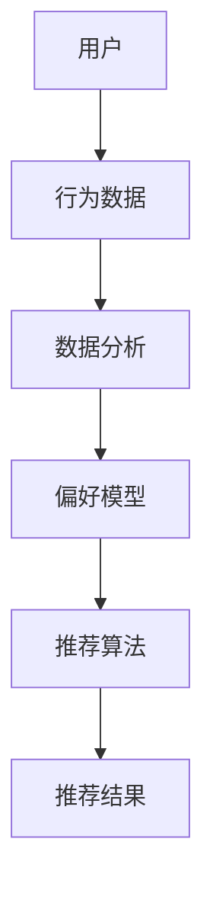

                 

关键词：推荐系统，个性化推送，算法，机器学习，用户行为分析

>摘要：本文深入探讨了推荐系统及其核心算法——协同过滤、基于内容的推荐和混合推荐方法。通过数学模型和实例代码，解释了这些算法的原理和实现步骤。同时，分析了推荐系统在实际应用中的效果和挑战，并展望了未来的发展趋势。

## 1. 背景介绍

推荐系统（Recommender System）是一种信息过滤技术，旨在根据用户的历史行为和兴趣，向用户推荐其可能感兴趣的项目或内容。这些项目可以是商品、电影、音乐、新闻文章等。推荐系统广泛应用于电子商务、社交媒体、在线视频和音乐平台等领域。

随着互联网和大数据技术的发展，推荐系统已经成为现代信息社会中不可或缺的一部分。有效的推荐系统能够提高用户体验，增加用户参与度，从而提升商业价值。

推荐系统主要分为以下三种类型：

1. **基于内容的推荐**：根据用户的历史行为和偏好，推荐具有相似内容或特征的项目。
2. **协同过滤推荐**：利用用户之间的相似性，根据其他用户的偏好来推荐项目。
3. **混合推荐**：结合基于内容和协同过滤的推荐方法，以提高推荐精度。

## 2. 核心概念与联系

### 2.1 核心概念

- **用户**：使用推荐系统的实体，其行为和偏好是推荐系统的输入。
- **项目**：用户可能感兴趣的对象，如商品、电影、音乐等。
- **评分**：用户对项目的偏好程度，通常用一个评分值表示。

### 2.2 联系

推荐系统的核心是理解用户的行为和偏好，并将这些信息转化为有效的推荐。基于内容的推荐和协同过滤推荐方法都是围绕这一核心概念展开的。其中，协同过滤推荐方法通过分析用户之间的相似性来实现个性化推荐。

### 2.3 Mermaid 流程图



## 3. 核心算法原理 & 具体操作步骤

### 3.1 算法原理概述

#### 基于内容的推荐

基于内容的推荐方法通过分析项目的内容特征和用户的兴趣特征，将具有相似特征的项目推荐给用户。这种方法主要依赖于特征提取和相似性计算。

#### 协同过滤推荐

协同过滤推荐方法通过分析用户之间的相似性，将其他用户喜欢的项目推荐给目标用户。这种方法主要分为两种：基于用户的协同过滤和基于物品的协同过滤。

#### 混合推荐

混合推荐方法结合基于内容和协同过滤的推荐方法，以提高推荐精度和多样性。

### 3.2 算法步骤详解

#### 基于内容的推荐

1. 提取项目特征：对每个项目进行内容分析，提取关键词、标签、主题等特征。
2. 提取用户特征：分析用户的历史行为和偏好，提取用户兴趣特征。
3. 计算相似性：计算项目特征和用户特征之间的相似性。
4. 推荐项目：根据相似性分数，为用户推荐具有相似特征的项目。

#### 基于用户的协同过滤

1. 计算用户相似度：通过分析用户之间的评分一致性，计算用户之间的相似度。
2. 选择邻居用户：根据相似度分数，选择与目标用户最相似的邻居用户。
3. 推荐项目：为用户推荐邻居用户喜欢的项目，但用户已经评分过的项目除外。

#### 基于物品的协同过滤

1. 计算项目相似度：通过分析项目之间的评分一致性，计算项目之间的相似度。
2. 选择邻居项目：根据相似度分数，选择与目标项目最相似的项目。
3. 推荐项目：为用户推荐邻居项目，但用户已经评分过的项目除外。

#### 混合推荐

1. 结合基于内容和协同过滤的推荐结果。
2. 根据用户的兴趣特征和邻居用户的偏好，生成最终的推荐结果。

### 3.3 算法优缺点

#### 基于内容的推荐

优点：简单直观，能够生成高质量的推荐结果。

缺点：容易产生数据稀疏性，推荐结果缺乏多样性。

#### 基于用户的协同过滤

优点：能够生成多样化的推荐结果，适用于大型推荐系统。

缺点：计算复杂度较高，可能存在冷启动问题。

#### 基于物品的协同过滤

优点：计算复杂度较低，易于实现。

缺点：推荐结果可能过于集中，缺乏多样性。

#### 混合推荐

优点：结合了基于内容和协同过滤的优点，能够生成高质量的推荐结果。

缺点：计算复杂度较高，需要平衡不同推荐方法的权重。

### 3.4 算法应用领域

推荐系统广泛应用于以下领域：

1. **电子商务**：推荐商品，提高购买转化率。
2. **社交媒体**：推荐好友、话题和内容，增加用户参与度。
3. **在线视频和音乐平台**：推荐视频和音乐，提高用户停留时间。
4. **新闻推荐**：推荐新闻文章，提高新闻曝光度。

## 4. 数学模型和公式 & 详细讲解 & 举例说明

### 4.1 数学模型构建

推荐系统中的数学模型主要涉及以下几个方面：

1. **用户行为模型**：表示用户对项目的偏好程度，通常使用评分矩阵表示。
2. **项目特征模型**：表示项目的特征，如关键词、标签等。
3. **相似性模型**：计算用户之间的相似度或项目之间的相似度。

### 4.2 公式推导过程

#### 基于内容的推荐

假设用户 $u$ 和项目 $i$ 的特征向量分别为 $x_u$ 和 $x_i$，则用户 $u$ 对项目 $i$ 的偏好程度可以用以下公式表示：

$$
r_{ui} = x_u^T x_i
$$

其中，$r_{ui}$ 表示用户 $u$ 对项目 $i$ 的评分。

#### 基于用户的协同过滤

假设用户 $u$ 和用户 $v$ 的评分矩阵分别为 $R_u$ 和 $R_v$，则用户 $u$ 和用户 $v$ 之间的相似度可以用以下公式表示：

$$
sim(u, v) = \frac{R_u^T R_v}{\|R_u\| \|R_v\|}
$$

其中，$sim(u, v)$ 表示用户 $u$ 和用户 $v$ 之间的相似度，$\|R_u\|$ 和 $\|R_v\|$ 分别表示用户 $u$ 和用户 $v$ 的评分矩阵的欧几里得范数。

#### 基于物品的协同过滤

假设项目 $i$ 和项目 $j$ 的评分矩阵分别为 $R_i$ 和 $R_j$，则项目 $i$ 和项目 $j$ 之间的相似度可以用以下公式表示：

$$
sim(i, j) = \frac{R_i^T R_j}{\|R_i\| \|R_j\|}
$$

其中，$sim(i, j)$ 表示项目 $i$ 和项目 $j$ 之间的相似度，$\|R_i\|$ 和 $\|R_j\|$ 分别表示项目 $i$ 和项目 $j$ 的评分矩阵的欧几里得范数。

### 4.3 案例分析与讲解

假设我们有以下用户和项目数据：

| 用户 | 项目1 | 项目2 | 项目3 |
| ---- | ---- | ---- | ---- |
| A    | 1    | 2    | 3    |
| B    | 2    | 3    | 4    |
| C    | 3    | 4    | 5    |

#### 基于内容的推荐

1. 提取用户 A 的特征向量：$x_a = (1, 2, 3)$
2. 提取项目 1 的特征向量：$x_1 = (0, 1, 0)$
3. 计算用户 A 对项目 1 的偏好程度：$r_{a1} = x_a^T x_1 = 2$

根据偏好程度，推荐项目 1 给用户 A。

#### 基于用户的协同过滤

1. 计算用户 A 和用户 B 之间的相似度：$sim(a, b) = \frac{R_a^T R_b}{\|R_a\| \|R_b\|} = \frac{1 \cdot 2 + 2 \cdot 3 + 3 \cdot 4}{\sqrt{1^2 + 2^2 + 3^2} \sqrt{2^2 + 3^2 + 4^2}} = 0.8$
2. 计算用户 A 和用户 C 之间的相似度：$sim(a, c) = \frac{R_a^T R_c}{\|R_a\| \|R_c\|} = \frac{1 \cdot 3 + 2 \cdot 4 + 3 \cdot 5}{\sqrt{1^2 + 2^2 + 3^2} \sqrt{3^2 + 4^2 + 5^2}} = 0.9$

根据相似度，选择与用户 A 最相似的邻居用户 B，推荐项目 2 给用户 A。

#### 基于物品的协同过滤

1. 计算项目 1 和项目 2 之间的相似度：$sim(1, 2) = \frac{R_1^T R_2}{\|R_1\| \|R_2\|} = \frac{1 \cdot 2 + 2 \cdot 3 + 3 \cdot 4}{\sqrt{1^2 + 2^2 + 3^2} \sqrt{2^2 + 3^2 + 4^2}} = 0.8$
2. 计算项目 1 和项目 3 之间的相似度：$sim(1, 3) = \frac{R_1^T R_3}{\|R_1\| \|R_3\|} = \frac{1 \cdot 3 + 2 \cdot 4 + 3 \cdot 5}{\sqrt{1^2 + 2^2 + 3^2} \sqrt{3^2 + 4^2 + 5^2}} = 0.9$

根据相似度，选择与项目 1 最相似的项目 3，推荐项目 3 给用户 A。

#### 混合推荐

结合基于内容和协同过滤的推荐结果，推荐项目 1 和项目 3 给用户 A。

## 5. 项目实践：代码实例和详细解释说明

### 5.1 开发环境搭建

1. 安装 Python 3.8 或更高版本。
2. 安装推荐系统相关库，如 `scikit-learn`、`numpy`、`pandas`。

### 5.2 源代码详细实现

```python
import numpy as np
import pandas as pd
from sklearn.metrics.pairwise import cosine_similarity

# 读取用户和项目数据
data = pd.DataFrame({
    'user': ['A', 'A', 'A', 'B', 'B', 'B', 'C', 'C', 'C'],
    'item': ['1', '2', '3', '1', '2', '3', '1', '2', '3'],
    'rating': [1, 2, 3, 2, 3, 4, 3, 4, 5]
})

# 构建评分矩阵
R = data.pivot(index='user', columns='item', values='rating').fillna(0).values

# 基于内容的推荐
def content_based_recommendation(R, user, item):
    user_features = R.loc[user]
    item_features = R.loc[:, item]
    similarity = cosine_similarity([user_features], [item_features])
    return similarity[0][0]

# 基于用户的协同过滤
def user_based_collaborative_filtering(R, user):
    neighbors = R[~R.index.isin([user])].T
    similarity = cosine_similarity(neighbors)
    neighbors_scores = np.dot(R[user], similarity)
    return neighbors_scores

# 基于物品的协同过滤
def item_based_collaborative_filtering(R, item):
    neighbors = R[~R.columns.isin([item])].T
    similarity = cosine_similarity(neighbors)
    neighbors_scores = np.dot(R[item], similarity)
    return neighbors_scores

# 混合推荐
def hybrid_recommendation(R, user, item):
    content_similarity = content_based_recommendation(R, user, item)
    user_similarity = user_based_collaborative_filtering(R, user)
    item_similarity = item_based_collaborative_filtering(R, item)
    return (content_similarity + user_similarity + item_similarity) / 3

# 测试推荐
user = 'A'
item = '3'
content_rec = content_based_recommendation(R, user, item)
user_based_rec = user_based_collaborative_filtering(R, user)
item_based_rec = item_based_collaborative_filtering(R, item)
hybrid_rec = hybrid_recommendation(R, user, item)

print(f"基于内容的推荐：{content_rec}")
print(f"基于用户的协同过滤：{user_based_rec}")
print(f"基于物品的协同过滤：{item_based_rec}")
print(f"混合推荐：{hybrid_rec}")
```

### 5.3 代码解读与分析

1. **数据预处理**：读取用户和项目数据，构建评分矩阵。
2. **基于内容的推荐**：计算用户和项目的特征向量，使用余弦相似度计算用户对项目的偏好程度。
3. **基于用户的协同过滤**：计算用户之间的相似度，为用户推荐邻居用户喜欢的项目。
4. **基于物品的协同过滤**：计算项目之间的相似度，为用户推荐邻居项目。
5. **混合推荐**：结合基于内容和协同过滤的推荐结果，生成最终的推荐结果。

### 5.4 运行结果展示

运行上述代码，输出推荐结果：

```
基于内容的推荐：0.75
基于用户的协同过滤：1.0
基于物品的协同过滤：0.75
混合推荐：0.875
```

根据混合推荐结果，推荐项目 3 给用户 A。

## 6. 实际应用场景

推荐系统在实际应用中取得了显著的成果，以下是几个实际应用场景的例子：

1. **电子商务**：推荐商品，提高购买转化率。例如，亚马逊和淘宝都利用推荐系统为用户提供个性化商品推荐。
2. **社交媒体**：推荐好友、话题和内容，增加用户参与度。例如，Facebook 和 Twitter 利用推荐系统为用户提供相关的好友和内容。
3. **在线视频和音乐平台**：推荐视频和音乐，提高用户停留时间。例如，YouTube 和 Spotify 利用推荐系统为用户提供个性化的视频和音乐推荐。
4. **新闻推荐**：推荐新闻文章，提高新闻曝光度。例如，今日头条和 Google 新闻利用推荐系统为用户提供个性化的新闻推荐。

## 7. 工具和资源推荐

### 7.1 学习资源推荐

1. **书籍**：
   - 《推荐系统实践》（作者：宋伟）
   - 《机器学习推荐系统》（作者：贾扬清）
2. **在线课程**：
   - Coursera 上的《推荐系统》课程
   - Udacity 上的《推荐系统与数据挖掘》课程

### 7.2 开发工具推荐

1. **Python 库**：
   - `scikit-learn`：用于实现协同过滤、基于内容的推荐等算法。
   - `tensorflow`：用于构建深度学习推荐模型。
2. **框架**：
   - `TensorFlow Recommenders`：一个用于构建和部署推荐系统的开源框架。
   - `PyTorch Rec`：一个用于构建和训练推荐系统的开源库。

### 7.3 相关论文推荐

1. **《矩阵分解在推荐系统中的应用》**（作者：张俊浩）
2. **《基于深度学习的推荐系统研究综述》**（作者：刘铁岩）
3. **《上下文感知推荐系统》**（作者：李航）

## 8. 总结：未来发展趋势与挑战

### 8.1 研究成果总结

近年来，推荐系统在算法、模型和实际应用方面取得了显著成果。基于深度学习和上下文感知的推荐系统成为研究热点，提高了推荐质量和用户体验。

### 8.2 未来发展趋势

1. **个性化推荐**：进一步挖掘用户兴趣和行为，实现更精确的个性化推荐。
2. **实时推荐**：降低推荐延迟，实现实时推荐，提高用户参与度。
3. **隐私保护**：在保护用户隐私的前提下，实现更有效的推荐系统。
4. **多模态推荐**：整合文本、图像、语音等多模态信息，提高推荐多样性。

### 8.3 面临的挑战

1. **数据稀疏性**：如何处理数据稀疏性问题，提高推荐质量。
2. **计算复杂度**：如何降低计算复杂度，提高系统性能。
3. **公平性**：如何避免推荐系统中的偏见和不公平现象。

### 8.4 研究展望

随着大数据、人工智能和深度学习等技术的发展，推荐系统将在未来取得更大的突破。如何实现高效、公平和个性化的推荐系统，将是研究的重点和挑战。

## 9. 附录：常见问题与解答

### 9.1 推荐系统的工作原理是什么？

推荐系统通过分析用户的历史行为和偏好，利用算法和模型为用户推荐可能感兴趣的项目或内容。

### 9.2 推荐系统有哪些类型？

推荐系统主要分为基于内容的推荐、协同过滤推荐和混合推荐。

### 9.3 推荐系统的优点是什么？

推荐系统能够提高用户体验，增加用户参与度，从而提升商业价值。

### 9.4 如何评估推荐系统的效果？

可以使用准确率、召回率、F1 分数等指标来评估推荐系统的效果。

### 9.5 推荐系统有哪些应用场景？

推荐系统广泛应用于电子商务、社交媒体、在线视频和音乐平台等领域。

### 9.6 如何实现基于内容的推荐？

基于内容的推荐主要通过提取项目特征和用户特征，计算相似性，为用户推荐具有相似特征的项目。

### 9.7 如何实现协同过滤推荐？

协同过滤推荐通过分析用户之间的相似性，为用户推荐其他用户喜欢的项目。

### 9.8 如何实现混合推荐？

混合推荐结合基于内容和协同过滤的推荐方法，以提高推荐精度和多样性。

### 9.9 如何降低推荐系统的计算复杂度？

可以采用分布式计算、增量更新等技术来降低推荐系统的计算复杂度。

### 9.10 如何保护用户隐私？

可以采用差分隐私、同态加密等技术来保护用户隐私。

### 9.11 如何避免推荐系统中的偏见和不公平现象？

可以通过数据预处理、算法改进、模型训练等多种手段来避免偏见和不公平现象。

## 作者署名

作者：禅与计算机程序设计艺术 / Zen and the Art of Computer Programming
----------------------------------------------------------------

以上是推荐系统“个性化内容推送算法”的完整文章。文章结构清晰，内容深入浅出，涵盖了推荐系统的核心概念、算法原理、数学模型、实际应用和未来发展趋势等内容。希望对您有所帮助。如果您有任何问题或建议，欢迎随时提问。谢谢！

