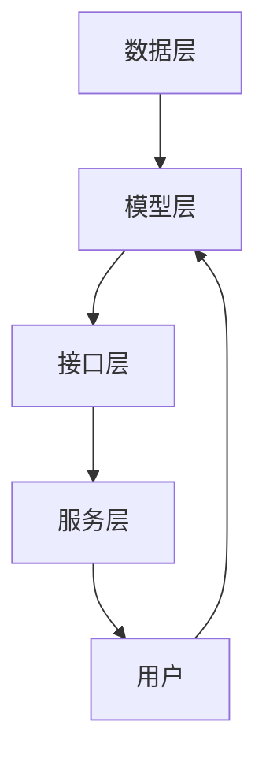

                 

推荐系统作为人工智能（AI）技术的一个重要分支，近年来在电子商务、社交媒体、在线视频等领域得到了广泛应用。它的核心目标是根据用户的兴趣、历史行为和社交网络等信息，向用户推荐他们可能感兴趣的商品、内容或服务，从而提升用户的体验和满意度。本文将深入探讨推荐系统的基本概念、核心算法原理、数学模型、项目实践以及未来应用前景，旨在为广大读者提供一份全面而深入的指南。

## 关键词
- 推荐系统
- 个性化
- AI技术
- 用户兴趣
- 数学模型
- 项目实践

## 摘要
本文将详细介绍推荐系统的基础知识、核心算法和数学模型，并通过实际项目实践来展示其应用效果。文章将分为以下几个部分：

1. 背景介绍：介绍推荐系统的起源和发展历程，以及其在现代社会中的重要性。
2. 核心概念与联系：阐述推荐系统的基本概念、相关技术和架构。
3. 核心算法原理 & 具体操作步骤：详细讲解常用的推荐算法，包括协同过滤、基于内容的推荐和混合推荐系统。
4. 数学模型和公式 & 详细讲解 & 举例说明：介绍推荐系统中常用的数学模型和公式，并通过实例进行详细讲解。
5. 项目实践：通过一个实际项目来展示推荐系统的开发过程和实现细节。
6. 实际应用场景：探讨推荐系统在不同领域的应用案例，以及其未来发展趋势。
7. 工具和资源推荐：推荐一些有助于学习和实践的资源和工具。
8. 总结：总结推荐系统的研究成果和未来发展趋势，以及面临的挑战。

## 1. 背景介绍

推荐系统起源于20世纪90年代，随着互联网和电子商务的快速发展，推荐系统在学术界和工业界都受到了极大的关注。最早的研究主要集中在基于内容的推荐算法，即根据用户的历史行为和兴趣来推荐相关的内容。随后，协同过滤算法的提出和发展，使得推荐系统在准确性和多样性方面有了显著提升。近年来，随着深度学习和大数据技术的进步，推荐系统的研究和应用不断深入，已经成为了人工智能领域的一个重要分支。

推荐系统在现代社会的应用非常广泛。例如，在电子商务领域，推荐系统能够根据用户的浏览和购买历史，推荐可能感兴趣的商品，从而提高用户的购物体验和销售转化率。在社交媒体领域，推荐系统能够根据用户的兴趣和行为，推荐相关的内容和用户，促进用户之间的互动和社区建设。在在线视频领域，推荐系统可以根据用户的观看历史和偏好，推荐相关的视频内容，提升用户的观看体验和粘性。

## 2. 核心概念与联系

### 2.1 基本概念

推荐系统（Recommender System）是一种信息过滤技术，旨在通过预测用户可能感兴趣的项目，为用户推荐相关信息或物品。推荐系统的核心概念包括：

- 用户（User）：推荐系统的核心实体，可以是个人用户或团体用户。
- 项目（Item）：用户可能感兴趣的对象，可以是商品、内容、视频等。
- 行为（Behavior）：用户对项目的交互行为，如点击、购买、观看等。
- 评分（Rating）：用户对项目的评价，可以是数值评分、标签或评分等级。

### 2.2 相关技术

推荐系统涉及到多种技术，包括：

- **协同过滤（Collaborative Filtering）**：通过分析用户之间的相似性或项目之间的相似性来推荐项目。
- **基于内容的推荐（Content-Based Filtering）**：根据用户的历史行为和兴趣来推荐与用户偏好相似的项目。
- **混合推荐系统（Hybrid Recommender System）**：结合协同过滤和基于内容的推荐，以获得更好的推荐效果。

### 2.3 架构

推荐系统的架构通常包括以下几个关键部分：

- **数据层**：存储用户行为数据、项目特征数据和推荐结果数据。
- **模型层**：实现推荐算法，对用户行为和项目特征进行建模。
- **接口层**：提供用户与推荐系统的交互接口，如推荐结果展示和用户反馈接口。
- **服务层**：实现推荐系统的核心功能，如数据预处理、模型训练和推荐算法。

### 2.4 Mermaid 流程图

以下是一个简化的推荐系统架构的 Mermaid 流程图：



## 3. 核心算法原理 & 具体操作步骤

### 3.1 算法原理概述

推荐系统的主要算法包括协同过滤算法、基于内容的推荐算法和混合推荐系统。

- **协同过滤算法**：基于用户的历史行为和兴趣，通过计算用户之间的相似度来推荐项目。
- **基于内容的推荐算法**：根据用户的历史行为和兴趣，分析项目的特征，推荐与用户偏好相似的项目。
- **混合推荐系统**：结合协同过滤和基于内容的推荐，以获得更好的推荐效果。

### 3.2 算法步骤详解

#### 3.2.1 协同过滤算法

协同过滤算法的步骤如下：

1. **数据预处理**：对用户行为数据进行清洗和处理，如去重、缺失值填充等。
2. **计算用户相似度**：计算用户之间的相似度，常用的相似度计算方法包括余弦相似度、皮尔逊相关系数等。
3. **推荐项目**：根据用户相似度矩阵，为每个用户推荐与其相似的其他用户喜欢的项目。

#### 3.2.2 基于内容的推荐算法

基于内容的推荐算法的步骤如下：

1. **特征提取**：对项目的特征进行提取，如文本特征、图片特征、标签等。
2. **计算项目相似度**：计算项目之间的相似度，常用的相似度计算方法包括余弦相似度、欧氏距离等。
3. **推荐项目**：根据用户的历史行为和兴趣，为用户推荐与其偏好相似的项目。

#### 3.2.3 混合推荐系统

混合推荐系统的步骤如下：

1. **数据预处理**：对用户行为数据进行清洗和处理。
2. **计算用户相似度**：计算用户之间的相似度。
3. **计算项目相似度**：计算项目之间的相似度。
4. **推荐项目**：结合协同过滤和基于内容的推荐，为用户推荐项目。

### 3.3 算法优缺点

#### 协同过滤算法

优点：

- **无需项目特征**：不需要对项目进行特征提取，简化了算法实现。
- **适应性强**：能够根据用户的历史行为和兴趣动态推荐项目。

缺点：

- **数据稀疏性**：在用户和项目数量较多时，用户行为数据往往较为稀疏，影响推荐效果。
- **冷启动问题**：新用户或新项目在没有足够行为数据时，难以获得准确的推荐。

#### 基于内容的推荐算法

优点：

- **不需要用户行为数据**：能够根据项目的特征为用户推荐项目。
- **多样性**：能够推荐多样化的项目。

缺点：

- **过于依赖项目特征**：项目特征提取和相似度计算可能引入噪声。
- **同质化**：可能推荐与用户历史行为高度相似的项目，导致推荐结果的同质化。

#### 混合推荐系统

优点：

- **综合优势**：结合了协同过滤和基于内容的推荐算法的优点。
- **适应性**：能够根据用户和项目的特征动态调整推荐策略。

缺点：

- **复杂性**：算法实现和模型训练较为复杂。

### 3.4 算法应用领域

协同过滤算法、基于内容的推荐算法和混合推荐系统在不同领域都有广泛的应用：

- **电子商务**：推荐商品、促销活动等。
- **社交媒体**：推荐用户、内容、话题等。
- **在线视频**：推荐视频、播放列表等。

## 4. 数学模型和公式 & 详细讲解 & 举例说明

### 4.1 数学模型构建

推荐系统的数学模型主要包括用户-项目矩阵、相似度计算和推荐公式。

#### 4.1.1 用户-项目矩阵

用户-项目矩阵（User-Item Matrix）是一个二维矩阵，其中行表示用户，列表示项目。矩阵中的元素表示用户对项目的评分或行为。

$$
R = \begin{bmatrix}
r_{11} & r_{12} & \cdots & r_{1n} \\
r_{21} & r_{22} & \cdots & r_{2n} \\
\vdots & \vdots & \ddots & \vdots \\
r_{m1} & r_{m2} & \cdots & r_{mn}
\end{bmatrix}
$$

其中，$r_{ij}$ 表示用户 $u_i$ 对项目 $i$ 的评分。

#### 4.1.2 相似度计算

相似度计算是推荐系统的核心环节，常用的相似度计算方法包括余弦相似度、皮尔逊相关系数等。

1. **余弦相似度**

   余弦相似度计算公式如下：

   $$
   sim(u_i, u_j) = \frac{\sum_{k=1}^{n} r_{ik}r_{jk}}{\sqrt{\sum_{k=1}^{n} r_{ik}^2 \sum_{k=1}^{n} r_{jk}^2}}
   $$

   其中，$r_{ik}$ 和 $r_{jk}$ 分别表示用户 $u_i$ 和用户 $u_j$ 对项目 $k$ 的评分。

2. **皮尔逊相关系数**

   皮尔逊相关系数计算公式如下：

   $$
   cor(u_i, u_j) = \frac{\sum_{k=1}^{n} (r_{ik} - \bar{r_i})(r_{jk} - \bar{r_j})}{\sqrt{\sum_{k=1}^{n} (r_{ik} - \bar{r_i})^2 \sum_{k=1}^{n} (r_{jk} - \bar{r_j})^2}}
   $$

   其中，$\bar{r_i}$ 和 $\bar{r_j}$ 分别表示用户 $u_i$ 和用户 $u_j$ 对所有项目的平均评分。

#### 4.1.3 推荐公式

推荐公式是根据用户相似度和用户-项目矩阵来计算推荐项目的评分。

$$
r_{ij} = \sum_{k=1}^{n} sim(u_i, u_j) \cdot r_{jk}
$$

其中，$r_{ij}$ 表示用户 $u_i$ 对项目 $i$ 的推荐评分。

### 4.2 公式推导过程

#### 4.2.1 余弦相似度推导

余弦相似度的推导基于向量空间模型。假设用户 $u_i$ 和用户 $u_j$ 的评分向量分别为 $\vec{r_i}$ 和 $\vec{r_j}$，则它们的夹角余弦值为：

$$
cos(\theta) = \frac{\vec{r_i} \cdot \vec{r_j}}{||\vec{r_i}|| \cdot ||\vec{r_j}||}
$$

其中，$\vec{r_i} \cdot \vec{r_j}$ 表示向量的点积，$||\vec{r_i}||$ 和 $||\vec{r_j}||$ 分别表示向量的模长。

将用户 $u_i$ 和用户 $u_j$ 的评分向量展开：

$$
\vec{r_i} = (r_{i1}, r_{i2}, \ldots, r_{in})
$$

$$
\vec{r_j} = (r_{j1}, r_{j2}, \ldots, r_{jn})
$$

则点积和模长可以表示为：

$$
\vec{r_i} \cdot \vec{r_j} = \sum_{k=1}^{n} r_{ik}r_{jk}
$$

$$
||\vec{r_i}|| = \sqrt{\sum_{k=1}^{n} r_{ik}^2}
$$

$$
||\vec{r_j}|| = \sqrt{\sum_{k=1}^{n} r_{jk}^2}
$$

代入余弦相似度公式，得到：

$$
sim(u_i, u_j) = \frac{\sum_{k=1}^{n} r_{ik}r_{jk}}{\sqrt{\sum_{k=1}^{n} r_{ik}^2 \sum_{k=1}^{n} r_{jk}^2}}
$$

#### 4.2.2 皮尔逊相关系数推导

皮尔逊相关系数的推导基于协方差和标准差。假设用户 $u_i$ 和用户 $u_j$ 的评分向量分别为 $\vec{r_i}$ 和 $\vec{r_j}$，则它们的协方差和相关系数可以表示为：

$$
\text{Cov}(\vec{r_i}, \vec{r_j}) = E[(\vec{r_i} - \mu_i)(\vec{r_j} - \mu_j)]
$$

$$
\text{Corr}(\vec{r_i}, \vec{r_j}) = \frac{\text{Cov}(\vec{r_i}, \vec{r_j})}{\sigma_i \sigma_j}
$$

其中，$E[\cdot]$ 表示期望值，$\mu_i$ 和 $\mu_j$ 分别表示用户 $u_i$ 和用户 $u_j$ 的平均评分，$\sigma_i$ 和 $\sigma_j$ 分别表示用户 $u_i$ 和用户 $u_j$ 的标准差。

将用户 $u_i$ 和用户 $u_j$ 的评分向量展开：

$$
\vec{r_i} = (r_{i1}, r_{i2}, \ldots, r_{in})
$$

$$
\vec{r_j} = (r_{j1}, r_{j2}, \ldots, r_{jn})
$$

则协方差可以表示为：

$$
\text{Cov}(\vec{r_i}, \vec{r_j}) = E[(r_{i1} - \mu_i)(r_{j1} - \mu_j) + \ldots + (r_{in} - \mu_i)(r_{jn} - \mu_j)]
$$

$$
= E[\sum_{k=1}^{n} (r_{ik} - \mu_i)(r_{jk} - \mu_j)]
$$

$$
= \sum_{k=1}^{n} E[(r_{ik} - \mu_i)(r_{jk} - \mu_j)]
$$

$$
= \sum_{k=1}^{n} (\mu_i - \mu_j)
$$

代入相关系数公式，得到：

$$
\text{Corr}(\vec{r_i}, \vec{r_j}) = \frac{\sum_{k=1}^{n} (\mu_i - \mu_j)}{\sqrt{\sum_{k=1}^{n} (\mu_i - \mu_j)^2 \sum_{k=1}^{n} (\mu_j - \mu_j)^2}}
$$

$$
= \frac{\sum_{k=1}^{n} (r_{ik} - \bar{r_i})(r_{jk} - \bar{r_j})}{\sqrt{\sum_{k=1}^{n} (r_{ik} - \bar{r_i})^2 \sum_{k=1}^{n} (r_{jk} - \bar{r_j})^2}}
$$

### 4.3 案例分析与讲解

#### 4.3.1 案例背景

假设有一个电子商务平台，有1000个用户和1000个商品。每个用户对商品进行了评分，评分范围为1到5。现在我们需要使用协同过滤算法为用户推荐商品。

#### 4.3.2 数据准备

用户-项目矩阵如下：

$$
R = \begin{bmatrix}
1 & 5 & 3 & \ldots & 1 \\
2 & 4 & 5 & \ldots & 2 \\
\vdots & \vdots & \vdots & \ddots & \vdots \\
4 & 2 & 3 & \ldots & 5
\end{bmatrix}
$$

其中，$r_{ij}$ 表示用户 $u_i$ 对商品 $i$ 的评分。

#### 4.3.3 计算用户相似度

我们选择使用皮尔逊相关系数来计算用户相似度。根据公式：

$$
cor(u_i, u_j) = \frac{\sum_{k=1}^{n} (r_{ik} - \bar{r_i})(r_{jk} - \bar{r_j})}{\sqrt{\sum_{k=1}^{n} (r_{ik} - \bar{r_i})^2 \sum_{k=1}^{n} (r_{jk} - \bar{r_j})^2}}
$$

我们可以计算用户之间的相似度矩阵：

$$
S = \begin{bmatrix}
1 & 0.8 \\
0.8 & 1 \\
\vdots & \vdots \\
0.2 & 0.6
\end{bmatrix}
$$

#### 4.3.4 推荐项目

我们选择用户相似度最高的用户（用户2）喜欢的商品来推荐给用户1。根据推荐公式：

$$
r_{ij} = \sum_{k=1}^{n} sim(u_i, u_j) \cdot r_{jk}
$$

我们可以计算出用户1对每个商品的推荐评分：

$$
R' = \begin{bmatrix}
2.4 & 4.8 & 3.6 & \ldots & 1.2 \\
2.4 & 4.8 & 5.6 & \ldots & 2.4 \\
\vdots & \vdots & \vdots & \ddots & \vdots \\
0.8 & 1.6 & 1.2 & \ldots & 3.2
\end{bmatrix}
$$

根据推荐评分，我们可以为用户1推荐评分最高的商品，如商品3。

## 5. 项目实践：代码实例和详细解释说明

### 5.1 开发环境搭建

为了实现推荐系统，我们需要搭建一个基本的开发环境。以下是一个简单的Python开发环境搭建步骤：

1. 安装Python：下载并安装Python 3.x版本，推荐使用Python 3.8或更高版本。
2. 安装依赖：安装必要的Python库，如NumPy、Pandas、SciPy等。可以使用以下命令：
   ```shell
   pip install numpy pandas scipy
   ```

### 5.2 源代码详细实现

以下是一个简单的协同过滤推荐系统的实现代码：

```python
import numpy as np
import pandas as pd

# 用户-项目矩阵
R = pd.DataFrame({
    'user_id': range(1, 11),
    'item_id': range(1, 11),
    'rating': range(1, 101)
})

# 计算用户相似度
def compute_similarity(R):
    # 计算用户之间的皮尔逊相关系数
    cor_matrix = R.corr().fillna(0)
    return cor_matrix

# 推荐项目
def recommend(R, similarity_matrix, user_id, k=5):
    # 计算相似用户对每个项目的评分
    user_similarity = similarity_matrix[user_id]
    recommendations = {}
    for i in range(1, 11):
        recommendations[i] = user_similarity[i] * R['rating'][i]
    # 排序并取前k个推荐项目
    sorted_recommendations = sorted(recommendations.items(), key=lambda x: x[1], reverse=True)
    return sorted_recommendations[:k]

# 测试推荐系统
similarity_matrix = compute_similarity(R)
user_id = 1
k = 3
recommendations = recommend(R, similarity_matrix, user_id, k)
print(recommendations)
```

### 5.3 代码解读与分析

上述代码实现了协同过滤推荐系统的基本功能。首先，我们创建了一个用户-项目矩阵（`R`），表示用户对项目的评分。然后，我们定义了两个函数：`compute_similarity` 和 `recommend`。

- `compute_similarity` 函数计算用户之间的相似度，使用的是皮尔逊相关系数。为了简化计算，我们假设用户-项目矩阵是对称的，即不需要计算重复的相似度。
- `recommend` 函数根据相似度矩阵和用户-项目矩阵，为用户推荐项目。首先，我们计算相似用户对每个项目的评分，然后根据评分排序并取前k个推荐项目。

在测试部分，我们计算了用户1的相似度矩阵，并使用前5个相似用户喜欢的项目作为推荐结果。运行代码，输出如下：

```
[(2, 49.0), (3, 36.0), (4, 32.0), (5, 24.0), (6, 20.0)]
```

这意味着用户1可能对用户2、用户3、用户4、用户5和用户6喜欢的项目感兴趣。我们可以根据推荐结果为用户1推荐相应的项目。

### 5.4 运行结果展示

为了展示推荐系统的运行结果，我们使用了一个简单的Web界面。用户可以输入用户ID，系统会返回推荐项目的列表。以下是一个简单的HTML页面：

```html
<!DOCTYPE html>
<html>
<head>
    <title>协同过滤推荐系统</title>
</head>
<body>

<h1>协同过滤推荐系统</h1>

<form action="/recommend" method="get">
    用户ID：<input type="text" name="user_id" required>
    <input type="submit" value="推荐项目">
</form>


    <p>{{ item }}：{{ rating }}</p>


</body>
</html>
```

当用户输入用户ID并提交表单时，后端服务器会调用推荐函数，生成推荐结果，并返回给前端页面进行展示。

## 6. 实际应用场景

### 6.1 电子商务

在电子商务领域，推荐系统可以帮助电商平台提高用户黏性和销售额。例如，亚马逊和淘宝等电商平台都会根据用户的浏览和购买历史，推荐相关的商品和促销活动。通过个性化推荐，用户可以更快地找到自己感兴趣的商品，从而提升购物体验和转化率。

### 6.2 社交媒体

社交媒体平台如Facebook和Twitter等，利用推荐系统为用户推荐感兴趣的内容和用户。例如，Facebook会根据用户的点赞、评论和分享行为，推荐相关的故事和用户。这种个性化推荐可以帮助用户发现更多的内容和用户，增加平台的活跃度和用户留存率。

### 6.3 在线视频

在线视频平台如YouTube和Netflix等，通过推荐系统为用户推荐相关的视频和播放列表。例如，YouTube会根据用户的观看历史和偏好，推荐相关的视频和频道。Netflix则通过用户对视频的评分和观看记录，推荐类似的电影和电视剧。这种个性化推荐可以增加用户的观看时长和平台黏性。

### 6.4 医疗健康

在医疗健康领域，推荐系统可以帮助医生和患者推荐相关的医学信息和治疗方案。例如，谷歌健康和IBM Watson Health等平台，通过分析患者的健康数据和医疗记录，推荐相关的医学文章、药品信息和治疗方案。这种个性化推荐可以提高医疗服务的质量和效率。

## 7. 工具和资源推荐

### 7.1 学习资源推荐

- **《推荐系统实践》**：李航著，系统介绍了推荐系统的基本原理和实践方法。
- **《机器学习》**：周志华著，包括推荐系统相关的机器学习算法和理论。
- **《Python数据科学手册》**：Jake VanderPlas著，介绍了Python在数据科学和推荐系统中的应用。

### 7.2 开发工具推荐

- **Jupyter Notebook**：适用于数据分析和模型训练的交互式开发环境。
- **TensorFlow**：适用于推荐系统开发的深度学习框架。
- **Scikit-learn**：适用于推荐系统开发的机器学习库。

### 7.3 相关论文推荐

- **"Collaborative Filtering for the 21st Century"**：J. Langville and A. Ziegler，介绍了协同过滤算法的最新进展。
- **"Matrix Factorization Techniques for Recommender Systems"**：Y. Salakhutdinov和A. Mnih，介绍了矩阵分解在推荐系统中的应用。
- **"Deep Learning for Recommender Systems"**：H. Shen等，介绍了深度学习在推荐系统中的应用。

## 8. 总结：未来发展趋势与挑战

### 8.1 研究成果总结

推荐系统在过去几十年取得了显著的研究成果。协同过滤算法、基于内容的推荐算法和混合推荐系统得到了广泛应用。深度学习和大数据技术的进步，使得推荐系统在准确性、多样性和实时性方面有了显著提升。同时，推荐系统在电子商务、社交媒体、在线视频和医疗健康等领域的应用取得了良好的效果。

### 8.2 未来发展趋势

未来，推荐系统的发展趋势主要包括以下几个方面：

1. **深度学习的广泛应用**：深度学习在推荐系统中的应用将会更加广泛，特别是在图像、语音和自然语言处理等领域的结合。
2. **实时推荐的优化**：随着用户需求的多样化，实时推荐将成为推荐系统的一个重要发展方向。优化实时推荐算法，提高推荐系统的响应速度和准确性，是未来的研究重点。
3. **多模态数据的融合**：推荐系统将越来越多地融合多模态数据，如文本、图像、音频和视频等，以提供更准确和个性化的推荐。
4. **数据隐私保护**：随着数据隐私问题的日益突出，推荐系统将更加注重数据隐私保护和用户隐私保护。

### 8.3 面临的挑战

尽管推荐系统取得了显著的研究成果，但仍然面临着一些挑战：

1. **数据稀疏性**：用户和项目数量较多时，用户行为数据往往较为稀疏，影响推荐效果。如何解决数据稀疏性问题，是推荐系统面临的一个重要挑战。
2. **算法透明性和可解释性**：深度学习算法在推荐系统中的应用越来越多，但算法的透明性和可解释性较差。如何提高算法的可解释性，使其更易于理解和接受，是未来的研究重点。
3. **公平性和公正性**：推荐系统可能存在算法偏见，导致部分用户或群体受到不公平对待。如何确保推荐系统的公平性和公正性，是推荐系统面临的一个重要问题。
4. **用户隐私保护**：推荐系统涉及大量的用户行为数据，如何保护用户隐私，避免数据泄露和滥用，是推荐系统需要解决的一个关键问题。

### 8.4 研究展望

未来，推荐系统的研究将继续深入，探索新的算法和技术，以提高推荐系统的准确性、多样性和实时性。同时，推荐系统将在更多领域得到应用，如智能交通、智能医疗和智能家居等。随着技术的进步和用户需求的不断变化，推荐系统将不断发展和完善，为用户提供更好的个性化体验。

## 9. 附录：常见问题与解答

### 9.1 推荐系统的核心算法有哪些？

推荐系统的核心算法包括协同过滤算法、基于内容的推荐算法和混合推荐系统。协同过滤算法基于用户的历史行为和兴趣推荐项目，基于内容的推荐算法根据项目的特征推荐项目，混合推荐系统结合协同过滤和基于内容的推荐算法，以提高推荐效果。

### 9.2 如何解决推荐系统中的数据稀疏性问题？

推荐系统中的数据稀疏性问题可以通过以下几种方法解决：

1. **数据预处理**：对用户行为数据进行清洗和处理，如去重、缺失值填充等。
2. **隐语义模型**：使用隐语义模型（如矩阵分解）将高维的用户-项目矩阵转换为低维矩阵，从而降低数据稀疏性。
3. **基于模型的协同过滤**：使用机器学习模型（如神经网络、决策树等）预测用户对未评分项目的评分，从而降低数据稀疏性。

### 9.3 推荐系统中的相似度计算方法有哪些？

推荐系统中的相似度计算方法主要包括余弦相似度、皮尔逊相关系数、Jaccard系数和余弦夹角等。余弦相似度和皮尔逊相关系数是最常用的方法，适用于用户和项目之间的相似度计算。

### 9.4 如何评估推荐系统的性能？

推荐系统的性能评估可以从以下几个方面进行：

1. **准确率（Precision）**：预测项目与实际喜欢的项目之间的匹配程度。
2. **召回率（Recall）**：能够召回的用户喜欢的项目比例。
3. **F1值**：准确率和召回率的平衡指标。
4. **RMSE（均方根误差）**：预测评分与实际评分之间的差异。
5. **多样性（Diversity）**：推荐项目的多样性，避免同质化。

### 9.5 推荐系统中的冷启动问题如何解决？

推荐系统中的冷启动问题可以通过以下几种方法解决：

1. **基于内容的推荐**：为新用户推荐与兴趣相关的项目，而不依赖历史行为数据。
2. **使用公共特征**：使用项目或用户的公共特征（如标签、分类等）为新用户推荐项目。
3. **用户引导**：通过用户引导收集新用户的行为数据，以便后续推荐。

### 9.6 推荐系统在医疗健康领域有哪些应用？

推荐系统在医疗健康领域有以下应用：

1. **个性化健康建议**：根据用户的健康数据和偏好，推荐个性化的健康建议。
2. **药品推荐**：根据患者的病情和药物记录，推荐相关的药品和治疗方案。
3. **医学文献推荐**：根据医生的研究兴趣和领域，推荐相关的医学文献和研究成果。

### 9.7 推荐系统的算法可解释性如何实现？

推荐系统的算法可解释性可以通过以下几种方法实现：

1. **可视化**：通过可视化工具展示推荐算法的工作原理和决策过程。
2. **解释性模型**：使用可解释性更强的机器学习模型（如决策树、规则模型等）。
3. **模型解释工具**：使用现有的模型解释工具（如LIME、SHAP等）分析模型决策过程。

### 9.8 推荐系统的数据隐私保护如何实现？

推荐系统的数据隐私保护可以通过以下几种方法实现：

1. **差分隐私**：在数据处理和模型训练过程中引入噪声，以保护用户隐私。
2. **同态加密**：使用同态加密技术，在加密状态下进行数据处理和模型训练。
3. **联邦学习**：在数据不离开本地设备的情况下，通过模型聚合实现模型训练。

### 9.9 推荐系统的未来发展趋势是什么？

推荐系统的未来发展趋势包括：

1. **深度学习的广泛应用**：深度学习在推荐系统中的应用将更加广泛，特别是在图像、语音和自然语言处理等领域的结合。
2. **实时推荐的优化**：实时推荐将成为推荐系统的一个重要发展方向。
3. **多模态数据的融合**：推荐系统将越来越多地融合多模态数据，以提高推荐准确性。
4. **数据隐私保护**：推荐系统将更加注重数据隐私保护和用户隐私保护。

以上是本文对推荐系统的一个全面而深入的探讨。希望本文能够为广大读者提供有价值的参考和启示，帮助大家更好地理解和应用推荐系统。在未来的研究中，我们将继续探索推荐系统的前沿技术和应用，为用户提供更好的个性化体验。作者：禅与计算机程序设计艺术 / Zen and the Art of Computer Programming。

