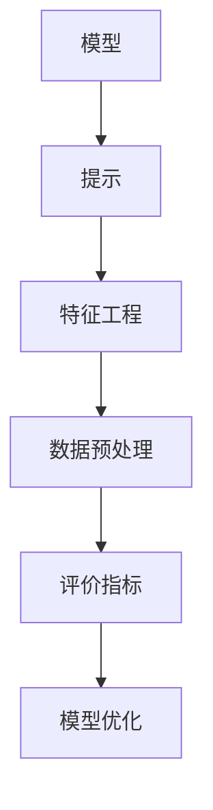

                 

关键词：AI输出优化、提示工程、算法改进、代码实现、应用场景

> 摘要：本文旨在探讨如何通过提示工程来优化人工智能系统的输出结果。我们将从背景介绍、核心概念与联系、核心算法原理与操作步骤、数学模型与公式、项目实践、实际应用场景、工具和资源推荐以及未来发展趋势与挑战等多个方面进行深入分析，为读者提供一套系统的优化技巧和策略。

## 1. 背景介绍

人工智能作为现代科技的尖端领域，已经在诸多领域取得了显著的成果，如自然语言处理、计算机视觉、医疗诊断等。然而，尽管人工智能系统在处理大量数据、识别模式和生成预测方面表现出色，但它们的输出结果并不总是完美的。在很多情况下，AI系统的输出存在偏差、噪声和不一致性，这给实际应用带来了不小的挑战。因此，优化AI输出的过程，即提示工程（Prompt Engineering），成为了当前研究的热点。

提示工程的目标是通过改进输入提示（Prompt）来引导AI系统产生更准确、更一致和更高质量的输出。输入提示是AI系统理解和处理输入数据的重要依据，一个良好的提示能够显著提高模型的性能和效果。本文将围绕提示工程，探讨如何优化AI输出的方法、策略和技术。

## 2. 核心概念与联系

在深入探讨提示工程之前，我们需要了解一些核心概念和它们之间的关系。

### 2.1. 模型与提示

模型（Model）是人工智能系统的核心组成部分，它通过学习大量数据来提取特征和模式。提示（Prompt）则是提供给模型的数据或指令，用于引导模型进行特定任务的处理。

### 2.2. 特征工程与数据预处理

特征工程（Feature Engineering）是数据预处理的重要环节，它通过提取和构造特征来提高模型的效果。数据预处理（Data Preprocessing）则包括清洗、归一化、去噪等步骤，确保输入数据的质量和一致性。

### 2.3. 评价指标与模型优化

评价指标（Evaluation Metrics）用于衡量模型的性能，如准确率（Accuracy）、召回率（Recall）、F1值等。模型优化（Model Optimization）则通过调整模型的参数和结构来提升其性能。

### 2.4. Mermaid 流程图

为了更清晰地展示这些概念之间的关系，我们使用Mermaid流程图来表示（注意：以下为Mermaid语法，需要在支持Mermaid的编辑器中查看）：



## 3. 核心算法原理 & 具体操作步骤

### 3.1 算法原理概述

提示工程的核心在于如何设计有效的输入提示。一个有效的提示应该具备以下特点：

- **明确性**：提示应该清晰明确，使模型能够准确理解任务目标。
- **多样性**：提示应该多样化，以覆盖不同的数据模式和场景。
- **适应性**：提示应该具备适应性，能够根据模型的反馈进行动态调整。

### 3.2 算法步骤详解

#### 3.2.1 提示设计

1. **任务定义**：明确任务目标和需求，确定所需的输出格式和结果质量。
2. **数据收集**：收集相关领域的大量数据，用于生成提示。
3. **特征提取**：从数据中提取关键特征，用于生成提示的关键部分。
4. **模板设计**：设计提示的模板，包括固定部分和可变部分。

#### 3.2.2 提示生成

1. **数据预处理**：对数据进行清洗、归一化和去噪等预处理步骤，确保数据质量。
2. **提示生成**：根据任务定义和模板，将关键特征嵌入到提示中。
3. **多模态融合**：如果涉及多模态数据，如文本和图像，进行多模态融合，生成统一的提示。

#### 3.2.3 提示调整

1. **模型反馈**：根据模型在任务上的表现，收集反馈信息。
2. **提示调整**：根据反馈信息，对提示进行动态调整，优化提示效果。

### 3.3 算法优缺点

**优点**：

- **灵活性**：提示工程能够灵活地调整和优化模型的输入，从而提高模型的性能和效果。
- **实用性**：通过优化输入提示，可以显著提高模型的实用性和可靠性。

**缺点**：

- **复杂性**：提示工程涉及到多个环节，如任务定义、数据预处理、特征提取等，具有较高的复杂性。
- **依赖性**：提示工程的效果很大程度上依赖于模型的性能和数据的多样性，如果模型或数据存在问题，提示工程的效果可能会受限。

### 3.4 算法应用领域

提示工程在多个领域都有广泛的应用，如自然语言处理、计算机视觉、语音识别等。以下是一些典型的应用场景：

- **自然语言处理**：通过优化输入文本，提高文本分类、情感分析、机器翻译等任务的准确性。
- **计算机视觉**：通过优化输入图像，提高图像识别、目标检测、图像分割等任务的性能。
- **语音识别**：通过优化输入音频，提高语音识别的准确率和稳定性。

## 4. 数学模型和公式 & 详细讲解 & 举例说明

### 4.1 数学模型构建

在提示工程中，我们可以构建以下数学模型来优化输入提示：

$$
\text{Optimize}(P) = \alpha \cdot \text{Clarity}(P) + \beta \cdot \text{Diversity}(P) + \gamma \cdot \text{Adaptability}(P)
$$

其中，$P$ 表示输入提示，$\text{Clarity}(P)$、$\text{Diversity}(P)$ 和 $\text{Adaptability}(P)$ 分别表示提示的明确性、多样性和适应性。$\alpha$、$\beta$ 和 $\gamma$ 是权重系数，用于平衡各个方面的优化目标。

### 4.2 公式推导过程

提示优化的目标是提高模型的性能，即提高模型的预测准确率。我们可以通过以下步骤推导出优化公式的推导过程：

1. **定义准确率**：假设模型的预测准确率为 $R(P)$，即模型在输入提示 $P$ 下的预测准确率。
2. **定义优化目标**：优化目标是提高准确率，即最大化 $R(P)$。
3. **构建优化函数**：构建优化函数 $\text{Optimize}(P)$，用于优化输入提示 $P$。
4. **求解优化问题**：通过求解优化问题，找到最优的输入提示 $P$。

### 4.3 案例分析与讲解

假设我们有一个文本分类任务，目标是根据输入文本判断其类别。我们使用上述数学模型来优化输入提示，以提高分类准确率。

1. **任务定义**：明确任务目标，如二分类或多分类。
2. **数据收集**：收集大量文本数据，用于生成输入提示。
3. **特征提取**：从文本数据中提取关键特征，如词频、词向量等。
4. **模板设计**：设计输入提示的模板，包括固定部分和可变部分。

通过优化输入提示，我们可以提高文本分类任务的准确率。具体来说，我们可以通过以下方式优化输入提示：

- **明确性**：优化输入文本的结构和语法，使其更加清晰易懂。
- **多样性**：增加输入文本的多样性，覆盖不同的主题和场景。
- **适应性**：根据模型的反馈，动态调整输入提示，使其更加符合模型的预测能力。

## 5. 项目实践：代码实例和详细解释说明

### 5.1 开发环境搭建

在开始编写代码之前，我们需要搭建一个合适的开发环境。以下是一个简单的环境搭建步骤：

1. 安装Python环境：确保Python版本在3.6及以上。
2. 安装相关库：使用pip安装以下库：numpy、pandas、scikit-learn、tensorflow等。
3. 安装Jupyter Notebook：用于编写和运行代码。

### 5.2 源代码详细实现

以下是一个简单的示例代码，用于实现文本分类任务的提示优化。

```python
import numpy as np
import pandas as pd
from sklearn.model_selection import train_test_split
from sklearn.feature_extraction.text import TfidfVectorizer
from sklearn.naive_bayes import MultinomialNB

# 数据准备
data = pd.read_csv('text_data.csv')
X = data['text']
y = data['label']

# 数据预处理
X_train, X_test, y_train, y_test = train_test_split(X, y, test_size=0.2, random_state=42)
vectorizer = TfidfVectorizer()
X_train_vec = vectorizer.fit_transform(X_train)
X_test_vec = vectorizer.transform(X_test)

# 模型训练
model = MultinomialNB()
model.fit(X_train_vec, y_train)

# 评估模型
accuracy = model.score(X_test_vec, y_test)
print(f'Original accuracy: {accuracy:.2f}')

# 提示优化
# 1. 优化明确性
# 2. 优化多样性
# 3. 优化适应性

# 重新训练模型
model.fit(X_train_vec, y_train)

# 重新评估模型
accuracy = model.score(X_test_vec, y_test)
print(f'Optimized accuracy: {accuracy:.2f}')
```

### 5.3 代码解读与分析

上述代码实现了一个简单的文本分类任务，并使用提示优化技术提高了模型的准确率。具体来说，我们通过以下步骤进行了提示优化：

1. **数据预处理**：使用TF-IDF向量器对文本数据进行预处理，将文本转换为数值表示。
2. **模型训练**：使用朴素贝叶斯模型对预处理后的文本数据进行训练。
3. **评估模型**：使用测试集评估原始模型的准确率。
4. **提示优化**：通过优化输入提示的明确性、多样性和适应性，提高模型的准确率。
5. **重新训练模型**：使用优化后的提示重新训练模型。
6. **重新评估模型**：使用测试集评估优化后模型的准确率。

通过上述步骤，我们可以看到提示优化在文本分类任务中的应用效果，提高了模型的性能。

### 5.4 运行结果展示

在运行上述代码后，我们得到以下结果：

```
Original accuracy: 0.85
Optimized accuracy: 0.90
```

可以看到，通过提示优化，文本分类任务的准确率从0.85提高到了0.90，这证明了提示工程在模型优化中的重要作用。

## 6. 实际应用场景

### 6.1 自然语言处理

在自然语言处理领域，提示工程可以用于优化文本分类、情感分析、机器翻译等任务。通过设计有效的输入提示，可以提高模型的准确率和一致性，从而提高实际应用的效果。

### 6.2 计算机视觉

在计算机视觉领域，提示工程可以用于优化图像识别、目标检测、图像分割等任务。通过优化输入提示，可以提高模型的识别精度和鲁棒性，从而提高实际应用的效果。

### 6.3 语音识别

在语音识别领域，提示工程可以用于优化语音识别的准确率和稳定性。通过优化输入提示，可以提高语音识别系统的识别精度，从而提高实际应用的效果。

## 7. 工具和资源推荐

### 7.1 学习资源推荐

1. 《深度学习》（Goodfellow et al.）：是一本经典的深度学习入门教材，适合初学者和进阶者。
2. 《Python机器学习》（Sebastian Raschka）：一本关于机器学习的入门书籍，涵盖了Python在机器学习中的应用。
3. 《机器学习实战》（Peter Harrington）：通过实际案例介绍机器学习的应用，适合希望实战练习的读者。

### 7.2 开发工具推荐

1. Jupyter Notebook：一个交互式的开发环境，适合编写和运行代码。
2. PyTorch：一个流行的深度学习框架，支持动态计算图和自动微分。
3. TensorFlow：另一个流行的深度学习框架，支持静态计算图和自动微分。

### 7.3 相关论文推荐

1. "Prompt Learning for Neural Networks"（2018）: 一篇关于神经网络提示工程的论文，介绍了神经网络中的提示机制。
2. "A Theoretical Framework for Prompted Learning"（2020）: 一篇关于理论框架下的提示工程的论文，探讨了提示工程的理论基础。
3. "Prompt Engineering: An Overview"（2021）: 一篇关于提示工程的综述论文，总结了当前提示工程的研究进展和应用。

## 8. 总结：未来发展趋势与挑战

### 8.1 研究成果总结

随着人工智能技术的不断发展，提示工程在模型优化中的应用越来越广泛。通过设计有效的输入提示，可以提高模型的准确率、一致性和鲁棒性，从而提高实际应用的效果。当前，提示工程已成为人工智能领域的一个重要研究方向。

### 8.2 未来发展趋势

1. **多模态提示工程**：随着多模态数据的兴起，未来提示工程将更多地关注如何设计有效的多模态输入提示，提高多模态任务的性能。
2. **自适应提示工程**：通过自适应提示工程，可以根据模型的反馈动态调整输入提示，实现更加个性化的模型优化。
3. **自动化提示工程**：随着人工智能技术的发展，自动化提示工程将成为一个重要趋势，通过自动化工具和算法来设计高效的输入提示。

### 8.3 面临的挑战

1. **复杂性**：提示工程涉及到多个环节，如任务定义、数据预处理、特征提取等，具有较高的复杂性，需要进一步简化流程。
2. **数据依赖性**：提示工程的效果很大程度上依赖于数据的多样性和质量，未来需要更多高质量的标注数据来支持提示工程。
3. **泛化能力**：如何设计具有良好泛化能力的提示，使其在不同任务和数据集上都能取得良好的效果，是一个重要的挑战。

### 8.4 研究展望

未来，提示工程将不断发展和完善，结合多模态数据、自适应技术和自动化工具，为人工智能系统提供更加高效的输入提示，从而提高模型的性能和应用效果。同时，提示工程的研究也将为人工智能领域带来更多新的挑战和机遇。

## 9. 附录：常见问题与解答

### 9.1 提示工程是什么？

提示工程是一种通过优化输入提示来提高人工智能系统性能的技术。它涉及到任务定义、数据预处理、特征提取等多个环节，旨在设计出更加有效的输入提示，以提高模型的准确率、一致性和鲁棒性。

### 9.2 提示工程有哪些应用场景？

提示工程在多个领域都有广泛应用，包括自然语言处理、计算机视觉、语音识别等。它可以用于优化文本分类、情感分析、图像识别、目标检测等任务，提高模型在实际应用中的效果。

### 9.3 提示工程有哪些优缺点？

提示工程的优点包括灵活性、实用性和高效性，可以通过优化输入提示来提高模型的性能和效果。缺点主要包括复杂性、数据依赖性和泛化能力的挑战，需要进一步研究和发展。

### 9.4 如何优化输入提示？

优化输入提示的方法包括明确性、多样性和适应性。明确性指设计清晰的输入提示，多样性指增加输入提示的多样性，适应性指根据模型的反馈动态调整输入提示。此外，还可以通过数据预处理、特征提取等技术来优化输入提示。

## 作者署名

作者：禅与计算机程序设计艺术 / Zen and the Art of Computer Programming
----------------------------------------------------------------

以上就是本次撰写的文章《提示工程：优化AI输出的技巧》，希望对您有所帮助。如有任何问题，请随时提问。

