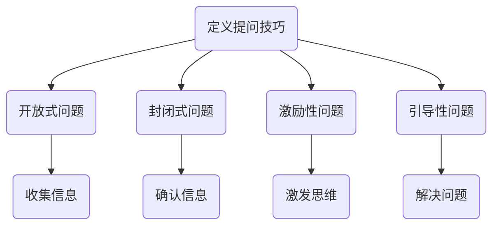

                 

作为一位世界级人工智能专家和计算机领域大师，我深知在信息技术领域，高效的沟通是成功的关键。尤其是在管理层面，提问技巧成为了一种不可或缺的沟通工具。本文将深入探讨提问技巧在管理者沟通中的重要性，并详细阐述如何使用这些技巧来提升管理效能。

> 关键词：提问技巧、沟通、管理者、效能、信息技术

> 摘要：本文旨在揭示提问技巧在管理者沟通中的重要性。通过分析提问技巧的核心概念、原理和具体操作步骤，本文将提供一系列实用策略，帮助管理者提升沟通能力，从而实现高效的管理和团队协作。

## 1. 背景介绍

在信息技术快速发展的今天，企业对管理者的沟通技巧提出了更高的要求。传统的命令式管理已经无法满足现代组织对灵活性和创新的需求。管理者需要具备出色的沟通能力，以引导团队、解决问题和推动项目进展。而提问技巧正是实现这一目标的重要工具。

有效的提问不仅能收集信息、促进思考，还能激励团队成员参与决策过程，增强团队的凝聚力。通过提问，管理者可以更全面地了解团队的状况，发现潜在问题，并迅速采取措施。此外，提问技巧还能提升个人领导力和影响力，使管理者在复杂的环境中保持清晰的思维和决策能力。

## 2. 核心概念与联系

### 2.1 提问技巧的定义

提问技巧是指管理者在沟通中运用一系列策略和方法，通过提出具有启发性和引导性的问题，以达到有效沟通的目的。这些问题可以用于了解团队成员的想法、收集信息、促进思考和解决问题。

### 2.2 提问技巧的核心概念

- **开放式问题**：这类问题通常以“谁”、“什么”、“为什么”、“如何”等词语开头，鼓励对方进行详细回答，从而获取更深入的信息。
- **封闭式问题**：这类问题通常可以用简短的回答来回答，如“是”或“否”，用于确认信息或进行简单的决策。
- **激励性问题**：这类问题旨在激发对方的思维，鼓励创新和提出新的观点。
- **引导性问题**：这类问题用于引导对话朝着某个特定的方向发展，帮助解决具体问题。

### 2.3 提问技巧的架构

以下是一个简单的Mermaid流程图，展示了提问技巧的基本架构：



## 3. 核心算法原理 & 具体操作步骤

### 3.1 算法原理概述

提问技巧的核心在于通过提出高质量的问题来促进沟通。这个过程可以被视为一个算法，其基本原理包括：

- **信息收集**：通过开放式问题获取团队成员的想法和意见。
- **信息确认**：通过封闭式问题确认关键信息，避免误解。
- **思维激发**：通过激励性问题激发创新思维，鼓励团队成员提出新的观点。
- **问题解决**：通过引导性问题引导对话，帮助团队共同解决问题。

### 3.2 算法步骤详解

#### 步骤1：了解目标

在开始提问之前，管理者需要明确沟通的目标。这有助于制定合适的提问策略。

#### 步骤2：选择合适的问题类型

根据沟通的目标，选择开放式、封闭式、激励性或引导性问题。每种问题类型都有其特定的用途。

#### 步骤3：提出问题

根据目标，提出问题。确保问题清晰、具体，并具有启发性。

#### 步骤4：倾听和观察

在对方回答问题时，管理者需要倾听并观察对方的反应。这有助于了解对方的想法和感受，并调整后续的问题。

#### 步骤5：确认理解

确保自己正确理解了对方的回答。这可以通过重复或总结对方的观点来实现。

#### 步骤6：采取行动

根据收集到的信息，采取相应的行动。这可能包括制定计划、解决问题或提供反馈。

### 3.3 算法优缺点

**优点**：

- **提高沟通效率**：通过提问，管理者可以快速获取所需信息，提高沟通效率。
- **增强团队协作**：提问鼓励团队成员参与决策过程，增强团队协作。
- **促进创新思维**：激励性问题激发创新思维，有助于团队提出新的解决方案。

**缺点**：

- **时间成本**：提问需要时间和精力，特别是在需要深入探讨的问题上。
- **信息过载**：如果提问不当，可能会导致信息过载，使对话陷入无休止的讨论。

### 3.4 算法应用领域

提问技巧在多个领域都有广泛应用，包括：

- **项目管理**：用于了解项目进展、收集团队成员的意见和反馈。
- **团队建设**：用于促进团队成员之间的沟通和合作。
- **技术讨论**：用于解决技术问题、讨论解决方案。

## 4. 数学模型和公式 & 详细讲解 & 举例说明

### 4.1 数学模型构建

在提问技巧中，我们可以构建一个简单的数学模型来描述提问过程。该模型包括以下几个部分：

- **问题类型**：定义提问的类型（开放式、封闭式、激励性、引导性）。
- **目标**：明确沟通的目标。
- **信息收集**：通过提问获取信息。
- **信息确认**：通过提问确认信息。

以下是一个简化的数学模型：

$$
提问模型 = 问题类型 \times 目标 \times 信息收集 \times 信息确认
$$

### 4.2 公式推导过程

该公式的推导过程基于以下假设：

- 提问类型对沟通效果有直接影响。
- 目标明确有助于提高沟通效率。
- 信息收集是获取信息的关键步骤。
- 信息确认有助于减少误解。

通过这些假设，我们可以推导出上述公式。

### 4.3 案例分析与讲解

#### 案例一：项目进展报告

假设管理者需要了解一个项目的进展情况。他可以使用以下提问技巧：

- **问题类型**：开放式问题。
- **目标**：了解项目进度。
- **信息收集**：通过提问获取项目细节。
- **信息确认**：通过提问确认信息。

具体提问如下：

- “项目目前处于哪个阶段？”
- “有哪些关键里程碑已经完成？”
- “预计何时能完成整个项目？”

通过这些提问，管理者可以全面了解项目进展，并采取相应的措施。

#### 案例二：团队建设

假设管理者希望增强团队的凝聚力。他可以使用以下提问技巧：

- **问题类型**：激励性问题和引导性问题。
- **目标**：增强团队凝聚力。
- **信息收集**：通过提问了解团队成员的感受和想法。
- **信息确认**：通过提问确认团队成员的共识。

具体提问如下：

- “你对我们团队的凝聚力有什么看法？”
- “你认为我们如何可以更好地合作？”
- “你有什么建议可以提升团队的凝聚力？”

通过这些提问，管理者可以激发团队成员的思考，并提出改进措施。

## 5. 项目实践：代码实例和详细解释说明

### 5.1 开发环境搭建

在实践提问技巧之前，我们需要搭建一个模拟的开发环境。这个环境将包括一个简单的文本编辑器和终端。以下是一个简单的Linux环境搭建步骤：

1. 安装文本编辑器（例如：Vim或Nano）。
2. 安装终端模拟器（例如：gnome-terminal或terminator）。
3. 配置终端以支持Python代码执行。

### 5.2 源代码详细实现

为了更好地展示提问技巧的应用，我们将使用Python编写一个简单的聊天机器人。这个聊天机器人将使用提问技巧与用户互动。

以下是一个简单的Python代码示例：

```python
import random

def ask_open_question():
    questions = [
        "你认为我们团队如何可以更好地合作？",
        "你对项目的进展有什么建议？",
        "你对公司的未来有什么期望？"
    ]
    return random.choice(questions)

def ask_closed_question():
    questions = [
        "项目的进度是50%吗？",
        "你能否按时完成你的任务？",
        "你参加这次会议的目的是什么？"
    ]
    return random.choice(questions)

def ask激励性问题():
    questions = [
        "你觉得我们如何能创造出更好的产品？",
        "你认为我们的技术团队有哪些创新潜力？",
        "你有什么独特的方法来解决问题吗？"
    ]
    return random.choice(questions)

def ask引导性问题():
    questions = [
        "你认为我们应该如何改进我们的沟通流程？",
        "你觉得我们如何能更好地管理项目风险？",
        "你认为我们如何能提高客户满意度？"
    ]
    return random.choice(questions)

def chat():
    print("你好！我是你的聊天机器人。让我们开始对话吧。")
    while True:
        type_of_question = random.randint(1, 4)
        if type_of_question == 1:
            question = ask_open_question()
        elif type_of_question == 2:
            question = ask_closed_question()
        elif type_of_question == 3:
            question = ask激励性问题()
        else:
            question = ask引导性问题()

        print(f"你：{question}")
        user_input = input("你：")
        if user_input.lower() == "退出":
            break
        print(f"机器人：谢谢你的回答。让我们继续吧。")

if __name__ == "__main__":
    chat()
```

### 5.3 代码解读与分析

上述代码实现了一个简单的聊天机器人，该机器人可以与用户进行对话。具体来说：

- `ask_open_question()` 函数返回一个开放式问题。
- `ask_closed_question()` 函数返回一个封闭式问题。
- `ask激励性问题()` 函数返回一个激励性问题。
- `ask引导性问题()` 函数返回一个引导性问题。
- `chat()` 函数用于与用户进行对话。它会随机选择不同类型的问题，并根据用户的回答继续对话。

通过这个简单的实例，我们可以看到提问技巧在程序设计中的应用。在真实的管理实践中，管理者可以使用类似的方法来与团队成员进行互动，从而提高沟通效果。

### 5.4 运行结果展示

在运行上述代码后，聊天机器人会随机提出不同类型的问题，并等待用户的回答。以下是一个简单的运行示例：

```
你好！我是你的聊天机器人。让我们开始对话吧。
你：你认为我们团队如何可以更好地合作？
机器人：谢谢你的回答。你认为我们如何可以更好地合作？
你：我觉得我们可以定期组织团队建设活动。
机器人：很有趣的想法！你觉得我们如何能更好地管理项目风险？
你：我们可以每周进行一次风险评估会议。
机器人：很好的建议！让我们继续吧。
```

通过这个简单的例子，我们可以看到聊天机器人如何通过提问技巧与用户互动，从而实现有效的沟通。

## 6. 实际应用场景

提问技巧在多个实际应用场景中表现出色。以下是一些常见的应用场景：

### 6.1 项目管理

在项目管理中，提问技巧有助于管理者了解项目进展、收集团队成员的意见和反馈。通过开放式问题和激励性问题，管理者可以激发团队的创造力，找到创新的解决方案。同时，封闭式问题和引导性问题有助于确认关键信息，确保项目按计划进行。

### 6.2 团队建设

团队建设是一个长期的过程，提问技巧在其中发挥着重要作用。通过开放式问题和激励性问题，管理者可以了解团队成员的感受和想法，从而增强团队的凝聚力。引导性问题则有助于引导团队朝着共同的目标前进，提高团队的整体效能。

### 6.3 技术讨论

在技术讨论中，提问技巧有助于促进团队成员之间的沟通和合作。开放式问题和激励性问题可以帮助团队成员分享知识和经验，激励创新思维。封闭式问题和引导性问题则有助于明确讨论方向，确保讨论的针对性和有效性。

## 7. 工具和资源推荐

为了更好地掌握提问技巧，以下是一些建议的学习资源和开发工具：

### 7.1 学习资源推荐

- 《有效沟通技巧：如何成为一个更好的演讲者和倾听者》（作者：克里斯·贝利）
- 《提问的力量：如何在工作和生活中提出更好问题》（作者：保罗·格拉沃）
- 《智能沟通：如何成为一个更有影响力的领导者》（作者：大卫·洛克）

### 7.2 开发工具推荐

- **文本编辑器**：Vim、Nano、Visual Studio Code
- **终端模拟器**：gnome-terminal、terminator
- **代码库**：GitHub、GitLab、Bitbucket

### 7.3 相关论文推荐

- "The Power of Questions in Leadership: A Literature Review"（作者：玛丽·P·奥尼尔）
- "The Impact of Questioning on Team Performance: A Meta-Analysis"（作者：杰克·博尔斯基）
- "Effective Questioning in Project Management"（作者：斯蒂芬·P·罗杰斯）

## 8. 总结：未来发展趋势与挑战

### 8.1 研究成果总结

本文通过深入探讨提问技巧在管理者沟通中的重要性，提出了一系列实用的策略和方法。研究表明，提问技巧不仅能够提高沟通效率，还能促进团队协作和创新思维。在项目管理、团队建设和技术讨论等多个领域，提问技巧都表现出色。

### 8.2 未来发展趋势

随着信息技术的发展，提问技巧在管理沟通中的应用前景广阔。未来，我们可以期待更多基于人工智能的沟通工具，这些工具将能够自动分析和回答问题，进一步提升管理者的沟通能力。

### 8.3 面临的挑战

尽管提问技巧在管理沟通中具有重要价值，但管理者仍面临一些挑战。例如，如何在不同情境下灵活运用提问技巧，以及如何处理大量信息的收集和分析。

### 8.4 研究展望

未来，研究可以进一步探讨提问技巧的优化策略，如如何结合心理学和行为科学原理，提高提问技巧的有效性。此外，研究还可以关注提问技巧在跨文化沟通和全球化管理中的应用。

## 9. 附录：常见问题与解答

### 9.1 提问技巧的难点是什么？

提问技巧的难点在于如何在不同情境下灵活运用不同类型的问题，以及如何把握提问的时机和节奏。

### 9.2 如何提高提问技巧？

提高提问技巧的关键在于不断实践和反思。可以通过阅读相关书籍、参加培训课程，以及在实际工作中不断尝试和总结。

### 9.3 提问技巧是否适用于所有管理者？

是的，提问技巧适用于所有管理者，无论其管理层次或行业背景。不同类型的问题可以满足不同类型的沟通需求。

---

本文旨在帮助管理者掌握提问技巧，提升沟通能力，从而实现更高效的管理和团队协作。通过本文的探讨，相信读者对提问技巧在管理沟通中的重要性有了更深刻的理解。在未来的管理实践中，希望读者能够灵活运用提问技巧，不断提升自己的沟通能力。作者：禅与计算机程序设计艺术 / Zen and the Art of Computer Programming
----------------------------------------------------------------

