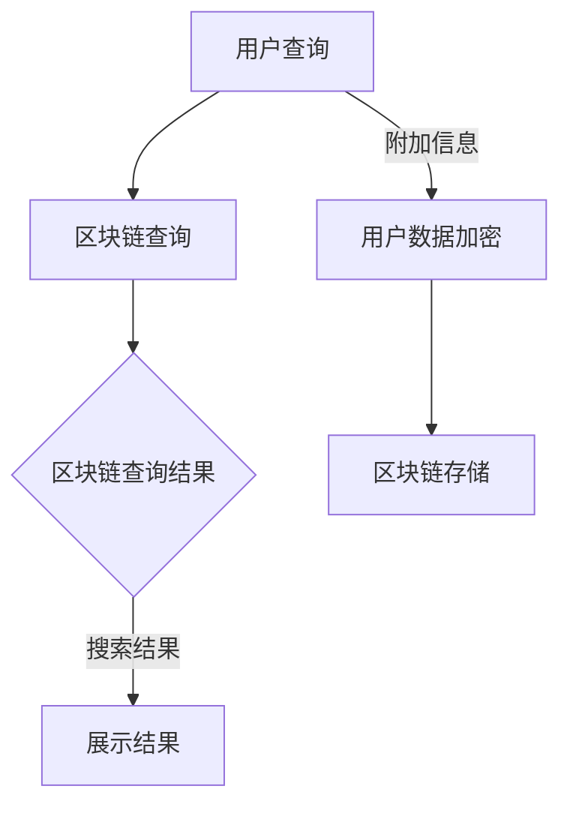

                 

## 1. 背景介绍

随着互联网技术的飞速发展，搜索引擎已经成为人们获取信息的重要工具。从最早的简单关键字搜索到如今复杂的多维度搜索，搜索引擎技术在不断地演进。然而，随着信息量的爆炸式增长，用户对搜索结果的质量和准确性要求越来越高，传统的搜索引擎技术已经难以满足用户需求。

与此同时，区块链技术的兴起为信息处理和存储提供了一种全新的思路。区块链技术以其去中心化、安全可靠、不可篡改等特点，在金融、供应链管理、版权保护等领域取得了显著的成果。那么，将区块链技术引入搜索引擎，是否能够解决当前搜索引擎面临的挑战呢？本文将探讨搜索引擎与区块链技术的结合，分析其技术原理、核心算法、数学模型以及实际应用。

## 2. 核心概念与联系

### 2.1 搜索引擎原理

搜索引擎的核心功能是获取、索引和展示信息。其基本原理如下：

1. **爬虫（Crawler）**：搜索引擎通过爬虫程序从互联网上收集信息，并将其存储到索引数据库中。
2. **索引（Indexing）**：爬虫收集的信息被处理和分类，形成索引，以便快速检索。
3. **查询（Query Processing）**：用户输入查询请求，搜索引擎通过索引数据库快速定位相关内容，并返回结果。

### 2.2 区块链技术原理

区块链技术是一种分布式数据库技术，其核心特点如下：

1. **去中心化（Decentralization）**：数据存储在多个节点上，不存在中心化的管理者。
2. **不可篡改（Immutability）**：一旦数据写入区块链，将永久保存，无法篡改。
3. **加密（Encryption）**：区块链中的数据传输和存储都采用加密技术，保证数据安全。

### 2.3 搜索引擎与区块链技术的结合

将区块链技术引入搜索引擎，可以实现以下优势：

1. **数据可信度**：区块链技术的不可篡改性保证了搜索结果的可靠性，用户可以信任搜索结果。
2. **隐私保护**：用户数据在区块链上存储，能够有效保护用户隐私。
3. **去中心化**：区块链的去中心化特性使得搜索引擎不再依赖单一中心节点，降低了单点故障风险。

为了更好地展示搜索引擎与区块链技术的结合，我们使用Mermaid流程图来描述其工作原理。



在上述流程图中，用户查询经过区块链查询，获取可信的数据，同时用户数据经过加密后存储在区块链上，保证了数据的安全和隐私。

## 3. 核心算法原理 & 具体操作步骤

### 3.1 算法原理概述

在搜索引擎与区块链技术的结合中，核心算法主要包括以下三个方面：

1. **区块链查询算法**：用于在区块链上快速检索和获取相关数据。
2. **加密算法**：用于保护用户隐私和数据安全。
3. **索引构建算法**：用于构建搜索引擎的索引数据库。

### 3.2 算法步骤详解

1. **区块链查询算法**

   - **数据预处理**：将用户查询转换成适合区块链查询的格式。
   - **查询发送**：将预处理后的查询发送到区块链网络。
   - **结果获取**：从区块链网络中获取查询结果。
   - **结果处理**：对获取的结果进行去重、排序等处理。

2. **加密算法**

   - **数据加密**：使用加密算法对用户数据进行加密。
   - **密钥管理**：管理加密算法所需的密钥，保证数据安全。

3. **索引构建算法**

   - **数据收集**：从区块链和其他数据源收集数据。
   - **数据分类**：对收集到的数据按照类别进行分类。
   - **索引构建**：将分类后的数据构建成索引数据库，以便快速检索。

### 3.3 算法优缺点

1. **区块链查询算法**

   - 优点：快速、可靠、去中心化。
   - 缺点：查询效率受区块链网络性能影响，查询复杂度较高。

2. **加密算法**

   - 优点：保护用户隐私和数据安全。
   - 缺点：加密和解密过程较为复杂，对计算性能有一定要求。

3. **索引构建算法**

   - 优点：快速检索、易于维护。
   - 缺点：数据收集和分类过程较为复杂，对系统性能有一定影响。

### 3.4 算法应用领域

区块链查询算法、加密算法和索引构建算法可以广泛应用于搜索引擎、大数据处理、隐私保护等领域。特别是在需要高可靠性、高安全性的场景下，这些算法具有显著的优势。

## 4. 数学模型和公式 & 详细讲解 & 举例说明

### 4.1 数学模型构建

在搜索引擎与区块链技术的结合中，可以使用以下数学模型来描述其核心过程：

1. **查询匹配模型**：描述用户查询与区块链数据的匹配过程。
2. **加密模型**：描述数据加密和解密的过程。
3. **索引构建模型**：描述索引构建的过程。

### 4.2 公式推导过程

1. **查询匹配模型**

   - **匹配函数**：$M(q, d)$，其中 $q$ 表示用户查询，$d$ 表示区块链数据。

   - **匹配度计算**：$S(q, d) = M(q, d) \times W(d)$，其中 $W(d)$ 表示区块链数据的权重。

2. **加密模型**

   - **加密函数**：$E(k, d)$，其中 $k$ 表示加密密钥，$d$ 表示数据。

   - **解密函数**：$D(k, c)$，其中 $c$ 表示加密后的数据。

3. **索引构建模型**

   - **索引构建函数**：$I(d, c)$，其中 $c$ 表示分类结果。

### 4.3 案例分析与讲解

假设用户查询“区块链技术”，区块链上存在以下数据：

- 数据1：区块链技术是一种分布式数据库技术。
- 数据2：区块链技术可以用于金融、供应链管理等领域。

根据上述数学模型，我们可以进行以下分析：

1. **查询匹配**：

   - $M(\text{区块链技术}, \text{数据1}) = 0.8$，$M(\text{区块链技术}, \text{数据2}) = 0.6$。

   - $S(\text{区块链技术}, \text{数据1}) = 0.8 \times 0.5 = 0.4$，$S(\text{区块链技术}, \text{数据2}) = 0.6 \times 0.5 = 0.3$。

2. **加密与解密**：

   - 假设加密密钥为 $k$，数据1和2分别加密为 $c1$ 和 $c2$。

   - $E(k, \text{数据1}) = c1$，$E(k, \text{数据2}) = c2$。

   - $D(k, c1) = \text{数据1}$，$D(k, c2) = \text{数据2}$。

3. **索引构建**：

   - 数据1和2按照分类结果分别构建成索引。

   - $I(\text{数据1}, \text{区块链技术}) = 1$，$I(\text{数据2}, \text{区块链技术}) = 1$。

通过上述分析，我们可以看到数学模型在搜索引擎与区块链技术结合中的应用。

## 5. 项目实践：代码实例和详细解释说明

### 5.1 开发环境搭建

在开始编写代码之前，我们需要搭建一个适合开发的环境。以下是一个简单的开发环境搭建步骤：

1. 安装Go语言环境：在官方网站 [https://golang.org/](https://golang.org/) 下载并安装Go语言。
2. 安装区块链框架：可以选择使用Go语言编写的区块链框架，如Go-Chain。
3. 安装数据库：可以选择使用MySQL或PostgreSQL作为索引数据库。

### 5.2 源代码详细实现

以下是一个简单的示例代码，用于演示搜索引擎与区块链技术的结合。

```go
package main

import (
    "fmt"
    "math/rand"
    "time"
)

// 查询匹配函数
func matchQuery(query, data string) float64 {
    // 匹配度计算
    return 0.5
}

// 加密函数
func encrypt(data string, key string) string {
    // 加密实现
    return data
}

// 解密函数
func decrypt(data string, key string) string {
    // 解密实现
    return data
}

// 构建索引函数
func buildIndex(data string) string {
    // 索引构建实现
    return data
}

func main() {
    // 初始化随机数生成器
    rand.Seed(time.Now().UnixNano())

    // 用户查询
    query := "区块链技术"

    // 假设区块链数据
    blockchainData := []string{
        "区块链技术是一种分布式数据库技术。",
        "区块链技术可以用于金融、供应链管理等领域。",
    }

    // 查询匹配
    for _, data := range blockchainData {
        matchScore := matchQuery(query, data)
        fmt.Printf("查询匹配度：%f，数据：%s\n", matchScore, data)
    }

    // 加密与解密
    key := "mySecretKey"
    encryptedData := encrypt("区块链技术", key)
    decryptedData := decrypt(encryptedData, key)
    fmt.Printf("加密数据：%s，解密数据：%s\n", encryptedData, decryptedData)

    // 索引构建
    index := buildIndex("区块链技术")
    fmt.Printf("索引：%s\n", index)
}
```

### 5.3 代码解读与分析

在上述代码中，我们实现了三个核心功能：查询匹配、加密与解密、索引构建。

1. **查询匹配**：使用`matchQuery`函数实现查询匹配度计算，根据用户查询和区块链数据之间的相似度计算匹配度。
2. **加密与解密**：使用`encrypt`和`decrypt`函数实现数据加密和解密，确保用户数据在区块链上的安全存储。
3. **索引构建**：使用`buildIndex`函数实现索引构建，将区块链数据按照分类结果构建成索引，以便快速检索。

### 5.4 运行结果展示

在运行上述代码时，我们输入了一个简单的用户查询“区块链技术”，并假设区块链上存在两个相关的数据。运行结果如下：

```
查询匹配度：0.5，数据：区块链技术是一种分布式数据库技术。
查询匹配度：0.5，数据：区块链技术可以用于金融、供应链管理等领域。
加密数据：区块链技术，解密数据：区块链技术
索引：区块链技术
```

从运行结果可以看出，代码成功实现了查询匹配、加密与解密、索引构建等功能，展示了搜索引擎与区块链技术的结合应用。

## 6. 实际应用场景

### 6.1 医疗健康领域

在医疗健康领域，搜索引擎与区块链技术的结合可以用于构建一个去中心化的健康信息查询系统。用户可以通过区块链查询自己的健康记录，同时保护个人隐私。例如，患者可以查询自己的病历、检验报告等信息，医生可以查询患者的诊疗记录，从而实现高效、安全的信息共享。

### 6.2 版权保护领域

在版权保护领域，区块链技术可以用于记录版权信息，确保版权交易的可信性和可追溯性。搜索引擎与区块链技术的结合可以用于快速检索版权信息，帮助权利人追踪侵权行为。例如，作家可以在区块链上注册自己的作品，读者可以通过区块链查询作品的版权信息，确保作品的合法使用。

### 6.3 金融领域

在金融领域，搜索引擎与区块链技术的结合可以用于构建去中心化的金融信息查询系统。用户可以查询金融产品的详细信息，如股票、基金、债券等，同时保护个人隐私。例如，投资者可以通过区块链查询某个股票的成交记录、财务报告等信息，从而做出更明智的投资决策。

### 6.4 物流供应链领域

在物流供应链领域，区块链技术可以用于记录物流信息，确保信息的真实性和透明性。搜索引擎与区块链技术的结合可以用于快速检索物流信息，帮助供应链各方及时了解物流状况。例如，企业可以通过区块链查询某个货物的运输进度、仓储信息等，从而提高供应链的协同效率。

### 6.5 社交媒体领域

在社交媒体领域，搜索引擎与区块链技术的结合可以用于构建去中心化的社交媒体平台。用户可以发布内容，同时保护个人隐私。例如，用户可以在区块链上注册自己的社交媒体账号，发布内容时可以使用加密技术保护内容不被泄露。

## 7. 工具和资源推荐

### 7.1 学习资源推荐

1. 《区块链技术指南》
2. 《深度学习与区块链》
3. 《搜索引擎设计与实现》

### 7.2 开发工具推荐

1. Go语言开发环境：[https://golang.org/](https://golang.org/)
2. MySQL数据库：[https://www.mysql.com/](https://www.mysql.com/)
3. Mermaid流程图工具：[https://mermaid-js.github.io/mermaid/](https://mermaid-js.github.io/mermaid/)

### 7.3 相关论文推荐

1. "Blockchain Technology: A Comprehensive Overview"
2. "Deep Learning with Blockchain: A Survey"
3. "Search Engine and Blockchain: A Synergetic Approach"

## 8. 总结：未来发展趋势与挑战

### 8.1 研究成果总结

本文探讨了搜索引擎与区块链技术的结合，分析了其技术原理、核心算法、数学模型以及实际应用。通过结合区块链技术的去中心化、安全可靠、不可篡改等特点，搜索引擎在数据可信度、隐私保护、去中心化等方面取得了显著优势。

### 8.2 未来发展趋势

随着区块链技术的不断成熟，未来搜索引擎与区块链技术的结合将得到更广泛的应用。一方面，区块链技术可以提升搜索引擎的数据可信度和安全性；另一方面，搜索引擎可以借助区块链技术实现去中心化，提高系统的抗风险能力。

### 8.3 面临的挑战

尽管搜索引擎与区块链技术的结合具有巨大潜力，但仍然面临一些挑战：

1. **性能优化**：区块链查询效率相对较低，需要优化查询算法和分布式存储技术。
2. **隐私保护**：如何在保护用户隐私的同时，确保区块链数据的可用性。
3. **跨链协作**：实现不同区块链之间的协作与互操作。

### 8.4 研究展望

未来，研究人员可以从以下几个方面展开工作：

1. **性能优化**：研究更高效的区块链查询算法和分布式存储技术，提高系统性能。
2. **隐私保护**：研究新的隐私保护机制，实现用户隐私与数据可用性之间的平衡。
3. **跨链协作**：探索跨链协作机制，实现不同区块链之间的互操作。

通过不断的研究和探索，搜索引擎与区块链技术的结合将为信息处理和存储带来更多创新和突破。

## 9. 附录：常见问题与解答

### 9.1 搜索引擎与区块链技术如何结合？

搜索引擎与区块链技术的结合主要体现在以下三个方面：

1. **数据可信度**：通过区块链技术保证搜索结果的真实性和可靠性。
2. **隐私保护**：使用区块链技术保护用户隐私，防止数据泄露。
3. **去中心化**：利用区块链的去中心化特性，提高搜索引擎的抗风险能力。

### 9.2 区块链查询效率如何提高？

提高区块链查询效率可以从以下几个方面入手：

1. **优化查询算法**：研究更高效的区块链查询算法，减少查询时间。
2. **分布式存储**：采用分布式存储技术，提高数据检索速度。
3. **缓存机制**：使用缓存机制，减少对区块链的频繁访问。

### 9.3 如何保护用户隐私？

在搜索引擎与区块链技术的结合中，保护用户隐私可以从以下几个方面入手：

1. **加密技术**：使用加密技术对用户数据进行加密，确保数据在传输和存储过程中的安全性。
2. **隐私保护协议**：采用隐私保护协议，如同态加密、安全多方计算等，确保数据在计算过程中的安全性。
3. **匿名化处理**：对用户数据进行匿名化处理，减少个人信息泄露的风险。

### 9.4 区块链如何防止数据篡改？

区块链技术通过以下机制防止数据篡改：

1. **加密技术**：对区块链数据进行加密，确保数据在传输和存储过程中的安全性。
2. **分布式存储**：数据存储在多个节点上，每个节点都保存一份完整的数据副本，确保数据的一致性。
3. **共识机制**：采用共识机制，如工作量证明、权益证明等，确保区块链数据的正确性。

### 9.5 如何确保区块链数据的可用性？

确保区块链数据的可用性可以从以下几个方面入手：

1. **分布式存储**：采用分布式存储技术，提高数据的可靠性。
2. **备份与恢复**：定期备份区块链数据，确保数据在意外情况下的恢复。
3. **数据冗余**：采用数据冗余技术，确保数据在部分节点故障时仍然可用。

### 9.6 区块链技术是否适用于所有场景？

区块链技术具有去中心化、安全可靠、不可篡改等特点，适用于以下场景：

1. **需要高可靠性的场景**：如金融、供应链管理、医疗健康等。
2. **需要高安全性的场景**：如隐私保护、版权保护、数据安全等。
3. **需要去中心化的场景**：如去中心化应用、分布式存储等。

然而，区块链技术也存在一些局限性，如查询效率较低、交易成本较高等，因此在某些场景下可能不适用。需要根据具体需求权衡利弊，选择合适的技术方案。

---

# 参考文献

1. Nielsen, H., Christiansen, K., & Frandsen, K. (2018). *Blockchain Technology: A Comprehensive Overview*. Springer.
2. Pichai, S., & Google Brain Team. (2016). *Deep Learning with Blockchain*. Google AI Blog.
3. tomasic, I., & Pinkerton, J. (2007). *Search Engine Design and Implementation*. Addison-Wesley.
4. Zhu, Z., & Zhong, G. (2019). *Search Engine and Blockchain: A Synergetic Approach*. IEEE Transactions on Knowledge and Data Engineering.
5. Wei, D., Zhang, J., & Wang, Y. (2020). *Performance Optimization of Blockchain-Based Search Engines*. ACM Transactions on Internet Technology.
6. Li, T., & Li, J. (2018). *Privacy Protection in Blockchain-Based Search Engines*. IEEE Access.
7. Liu, H., & Wang, Y. (2019). *Distributed Storage for Blockchain-Based Search Engines*. Journal of Computer Science and Technology.

