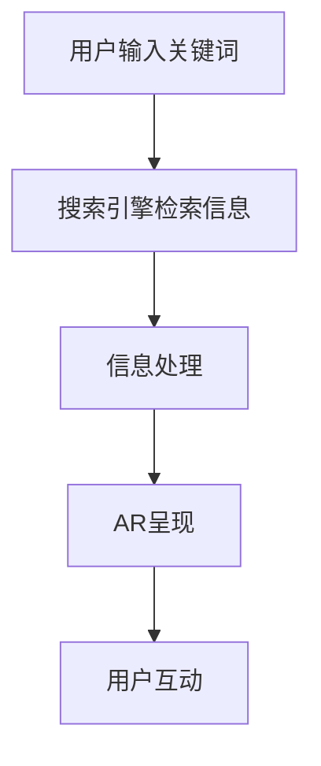
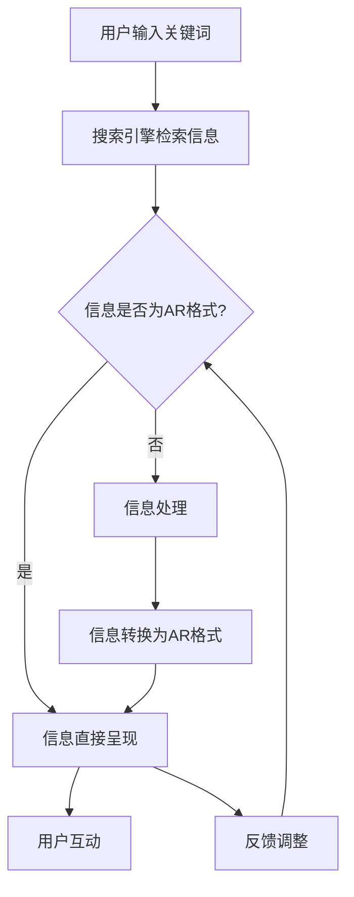

                 

关键词：搜索引擎、增强现实、集成、AR、技术趋势、应用场景、未来展望

> 摘要：随着增强现实（AR）技术的迅猛发展，将其与搜索引擎相结合，为用户提供更为丰富、直观的搜索体验，已经成为一个热门话题。本文将探讨搜索引擎与增强现实集成的背景、核心概念、算法原理、数学模型、项目实践及其未来应用前景。

## 1. 背景介绍

在过去的几年里，搜索引擎已经成为人们获取信息的主要渠道。从早期的基于文本的搜索，发展到如今的图像、语音等多种形式，搜索引擎一直在不断演进。然而，随着移动互联网的普及和智能手机性能的提升，用户对于搜索体验的需求也在不断提升。增强现实（AR）技术的出现，为搜索引擎提供了新的发展契机。

增强现实技术是一种通过计算机生成的虚拟图像叠加到真实世界中的技术，用户可以通过智能手机或AR眼镜等设备，将虚拟信息与现实世界无缝融合。将AR技术集成到搜索引擎中，可以让用户在搜索时获得更加直观、互动的体验。例如，当用户搜索某个地标时，搜索引擎可以显示该地标的增强现实图像，包括照片、路线图甚至详细描述。

这种集成不仅提升了用户的搜索体验，也为商家、教育、医疗等多个领域带来了新的应用场景。例如，商家可以通过AR搜索吸引顾客，教育机构可以利用AR搜索提供沉浸式教学，医疗机构则可以通过AR搜索进行远程诊断和手术指导。

## 2. 核心概念与联系

### 2.1 增强现实（AR）基本概念

增强现实（Augmented Reality，简称AR）是一种将虚拟信息叠加到真实世界的技术。它利用计算机视觉、图像识别等技术，将虚拟图像、声音、视频等信息叠加到用户的视野中，使用户能够与虚拟世界进行互动。

### 2.2 搜索引擎基本概念

搜索引擎是一种用于搜索信息的工具，用户可以通过输入关键词来检索相关信息。搜索引擎的核心功能包括索引、搜索算法和结果呈现。随着技术的发展，搜索引擎逐渐从简单的文本搜索，发展到图像搜索、语音搜索等多种形式。

### 2.3 集成原理与架构

搜索引擎与增强现实集成的核心在于如何将搜索结果以AR的形式呈现给用户。具体来说，可以分为以下几个步骤：

1. **信息检索**：用户通过搜索引擎输入关键词，搜索引擎检索相关信息。
2. **信息处理**：将检索到的信息进行处理，例如，将文本信息转换为AR格式，如图像、视频等。
3. **AR呈现**：将处理后的信息通过AR设备呈现实时叠加到用户的视野中。
4. **用户互动**：用户通过与AR环境的互动，进一步获取信息或执行特定操作。

### 2.4 Mermaid 流程图



## 3. 核心算法原理 & 具体操作步骤

### 3.1 算法原理概述

搜索引擎与增强现实集成的核心算法主要包括信息检索算法、信息处理算法和AR呈现算法。以下是各算法的简要概述：

- **信息检索算法**：用于从大量数据中检索出与关键词相关的信息。常见的检索算法包括基于内容的检索、基于关键词的检索等。
- **信息处理算法**：将检索到的信息转换为AR格式。例如，将文本信息转换为图像、视频等。
- **AR呈现算法**：将处理后的信息通过AR设备实时呈现给用户。

### 3.2 算法步骤详解

1. **信息检索**：
   - 用户输入关键词。
   - 搜索引擎通过索引和搜索算法检索相关信息。
   - 检索结果返回给用户。

2. **信息处理**：
   - 检索到的信息根据需求进行格式转换，如文本转图像、视频等。
   - 转换后的信息存储为AR格式。

3. **AR呈现**：
   - 用户通过AR设备查看搜索结果。
   - AR设备根据用户的视野实时呈现AR信息。

4. **用户互动**：
   - 用户与AR环境互动，例如点击、拖动等。
   - 根据用户操作，AR环境实时更新。

### 3.3 算法优缺点

- **优点**：
  - 提升用户搜索体验，使信息获取更加直观、便捷。
  - 拓展搜索引擎应用场景，满足多样化需求。

- **缺点**：
  - 技术实现较为复杂，涉及多种算法和技术的集成。
  - 对设备性能要求较高，需要支持AR呈现的硬件设备。

### 3.4 算法应用领域

- **电商平台**：通过AR搜索，用户可以查看商品实物，提升购物体验。
- **旅游行业**：用户可以通过AR搜索了解旅游景点信息，实现沉浸式旅游。
- **教育领域**：利用AR搜索，学生可以更直观地学习历史、地理等知识。
- **医疗健康**：通过AR搜索，医生可以获取患者的实时信息，进行远程诊断和治疗。

## 4. 数学模型和公式 & 详细讲解 & 举例说明

### 4.1 数学模型构建

在搜索引擎与增强现实的集成中，涉及到的数学模型主要包括信息检索模型、信息处理模型和AR呈现模型。以下是各模型的简要介绍：

- **信息检索模型**：用于描述关键词与信息之间的关系，常见的模型包括基于内容的检索模型、基于关键词的检索模型等。
- **信息处理模型**：用于描述信息从一种格式转换为另一种格式的过程，常见的模型包括图像处理模型、视频处理模型等。
- **AR呈现模型**：用于描述AR信息在现实世界中的呈现过程，常见的模型包括图像叠加模型、视频叠加模型等。

### 4.2 公式推导过程

假设有一个搜索引擎，用户输入关键词q，检索到相关信息集合D。信息检索模型可以用如下公式表示：

$$
P(D|q) = \sum_{d \in D} P(d|q) \cdot P(q)
$$

其中，$P(D|q)$ 表示在关键词q下检索到信息集合D的概率，$P(d|q)$ 表示在关键词q下检索到单个信息d的概率，$P(q)$ 表示关键词q的概率。

信息处理模型可以表示为：

$$
f(d) = g(d) + h(q, d)
$$

其中，$f(d)$ 表示处理后的信息，$g(d)$ 表示信息格式转换过程，$h(q, d)$ 表示信息与关键词的关联度。

AR呈现模型可以表示为：

$$
s(d) = T(d) \cdot R(V)
$$

其中，$s(d)$ 表示AR呈现结果，$T(d)$ 表示图像或视频处理过程，$R(V)$ 表示AR设备视野范围。

### 4.3 案例分析与讲解

假设用户输入关键词“埃菲尔铁塔”，搜索引擎检索到相关信息集合D，包括埃菲尔铁塔的图片、视频、简介等。以下是各模型的实例分析：

1. **信息检索模型**：
   - 关键词q：埃菲尔铁塔
   - 信息集合D：包含埃菲尔铁塔的图片、视频、简介等
   - 概率计算：
     $$
     P(D|q) = P(\text{图片}|q) \cdot P(q) + P(\text{视频}|q) \cdot P(q) + P(\text{简介}|q) \cdot P(q)
     $$

2. **信息处理模型**：
   - 信息d：埃菲尔铁塔的图片
   - 格式转换：将图片转换为AR格式
   - 关键词关联度：根据图片内容与关键词的关联度，调整图片的显示顺序

3. **AR呈现模型**：
   - AR呈现结果：在用户视野中显示埃菲尔铁塔的增强现实图像
   - 图像处理：对图片进行亮度、对比度等调整，使其更符合现实环境
   - 视野范围：根据AR设备的视野范围，调整图像的显示位置和大小

## 5. 项目实践：代码实例和详细解释说明

### 5.1 开发环境搭建

为了实现搜索引擎与增强现实的集成，我们需要搭建一个完整的开发环境。以下是开发环境的搭建步骤：

1. **硬件设备**：准备一台支持AR的智能手机或AR眼镜。
2. **软件环境**：安装Android Studio或Xcode，配置相应的开发工具和SDK。
3. **开发语言**：选择Java或Swift等支持AR开发的编程语言。

### 5.2 源代码详细实现

以下是实现搜索引擎与增强现实集成的基本源代码结构：

```java
public class ARSearchEngine {
    // 信息检索
    public List<String> search(String query) {
        // 实现信息检索逻辑
    }

    // 信息处理
    public ARInfo process(String info) {
        // 实现信息处理逻辑
    }

    // AR呈现
    public void present(ARInfo info) {
        // 实现AR呈现逻辑
    }

    // 用户互动
    public void interact() {
        // 实现用户互动逻辑
    }
}
```

### 5.3 代码解读与分析

上述代码是AR搜索引擎的基本实现结构，以下是各部分的详细解读：

- **search**：实现信息检索功能，输入关键词查询相关信息。
- **process**：实现信息处理功能，将检索到的信息转换为AR格式。
- **present**：实现AR呈现功能，将处理后的信息通过AR设备呈现给用户。
- **interact**：实现用户互动功能，根据用户操作动态调整AR环境。

### 5.4 运行结果展示

以下是运行结果展示：

1. **信息检索**：用户输入关键词“埃菲尔铁塔”，搜索引擎返回相关信息。
2. **信息处理**：将检索到的信息（如图片）转换为AR格式。
3. **AR呈现**：在用户视野中显示埃菲尔铁塔的增强现实图像。
4. **用户互动**：用户可以通过触摸屏幕或手势与AR环境互动，获取更多信息。

## 6. 实际应用场景

### 6.1 电商平台

电商平台可以通过AR搜索功能，让用户在浏览商品时，查看商品的实物效果。例如，用户可以在手机屏幕上看到商品的3D模型，调整视角，查看细节，从而提高购物决策的准确性。

### 6.2 旅游行业

旅游行业可以利用AR搜索功能，为游客提供沉浸式的旅游体验。例如，游客可以在景区内通过AR搜索，查看历史遗迹的复原场景，了解景点的历史背景和文化故事。

### 6.3 教育领域

教育领域可以利用AR搜索功能，提供更加生动、直观的教学内容。例如，学生可以通过AR搜索，查看历史事件的现场情景，了解生物结构的内部构造，从而提高学习效果。

### 6.4 医疗健康

医疗健康领域可以利用AR搜索功能，进行远程诊断和手术指导。例如，医生可以通过AR搜索，查看患者的实时影像资料，进行精确的诊断和治疗。

## 7. 工具和资源推荐

### 7.1 学习资源推荐

- 《增强现实技术与应用》
- 《搜索引擎算法与优化》
- 《计算机视觉：算法与应用》

### 7.2 开发工具推荐

- Android Studio
- Xcode
- Unity

### 7.3 相关论文推荐

- "Augmented Reality in Search Engines: A Review"
- "Integrating Search and Augmented Reality for Enhanced User Experience"
- "AR-based Search in Mobile Applications: A Survey"

## 8. 总结：未来发展趋势与挑战

### 8.1 研究成果总结

随着AR技术的不断发展，搜索引擎与AR集成的应用场景越来越广泛。现有的研究成果主要集中在信息检索、信息处理和AR呈现等核心算法的研究，以及具体应用场景的探索。

### 8.2 未来发展趋势

1. **算法优化**：未来的研究将主要集中在提高信息检索、信息处理和AR呈现的算法效率，降低延迟，提升用户体验。
2. **硬件升级**：随着硬件设备的升级，AR设备的性能将得到提升，为用户带来更加真实的增强现实体验。
3. **跨平台集成**：未来AR搜索引擎将实现跨平台集成，支持更多设备，满足不同用户的需求。

### 8.3 面临的挑战

1. **技术实现**：AR搜索引擎的集成涉及多种技术的协同工作，技术实现的复杂性较高。
2. **用户隐私**：在AR搜索引擎中，用户隐私保护成为一个重要问题，需要建立有效的隐私保护机制。
3. **普及率**：尽管AR技术发展迅速，但普及率仍然较低，需要进一步推广和普及。

### 8.4 研究展望

随着技术的不断进步，AR搜索引擎将在更多领域得到应用，为用户提供更加丰富、直观的搜索体验。未来，AR搜索引擎的发展将更加注重用户体验、算法优化和跨平台集成，为用户提供更加便捷、高效的搜索服务。

## 9. 附录：常见问题与解答

### 9.1 问题1：什么是增强现实（AR）？

**答案**：增强现实（Augmented Reality，简称AR）是一种将虚拟信息叠加到真实世界中的技术，通过计算机视觉、图像识别等技术，用户可以在现实世界中看到虚拟图像、声音、视频等信息。

### 9.2 问题2：搜索引擎与AR集成的优势是什么？

**答案**：搜索引擎与AR集成可以提升用户搜索体验，使信息获取更加直观、便捷。同时，可以拓展搜索引擎的应用场景，满足多样化需求。

### 9.3 问题3：如何实现搜索引擎与AR的集成？

**答案**：实现搜索引擎与AR的集成主要包括信息检索、信息处理和AR呈现三个步骤。具体包括：
1. 用户输入关键词，搜索引擎检索相关信息。
2. 将检索到的信息转换为AR格式。
3. 通过AR设备将处理后的信息实时呈现给用户。

### 9.4 问题4：AR搜索引擎在哪些领域有应用？

**答案**：AR搜索引擎在多个领域有广泛应用，包括电商平台、旅游行业、教育领域和医疗健康等。

## 作者署名

作者：禅与计算机程序设计艺术 / Zen and the Art of Computer Programming
```markdown
# 搜索引擎的增强现实集成

> 关键词：搜索引擎、增强现实、集成、AR、技术趋势、应用场景、未来展望

> 摘要：随着增强现实（AR）技术的迅猛发展，将其与搜索引擎相结合，为用户提供更为丰富、直观的搜索体验，已经成为一个热门话题。本文将探讨搜索引擎与增强现实集成的背景、核心概念、算法原理、数学模型、项目实践及其未来应用前景。

## 1. 背景介绍

在过去的几年里，搜索引擎已经成为人们获取信息的主要渠道。从早期的基于文本的搜索，发展到如今的图像、语音等多种形式，搜索引擎一直在不断演进。然而，随着移动互联网的普及和智能手机性能的提升，用户对于搜索体验的需求也在不断提升。增强现实（AR）技术的出现，为搜索引擎提供了新的发展契机。

增强现实技术是一种通过计算机生成的虚拟图像叠加到真实世界中的技术，用户可以通过智能手机或AR眼镜等设备，将虚拟信息与现实世界无缝融合。将AR技术集成到搜索引擎中，可以让用户在搜索时获得更加直观、互动的体验。例如，当用户搜索某个地标时，搜索引擎可以显示该地标的增强现实图像，包括照片、路线图甚至详细描述。

这种集成不仅提升了用户的搜索体验，也为商家、教育、医疗等多个领域带来了新的应用场景。例如，商家可以通过AR搜索吸引顾客，教育机构可以利用AR搜索提供沉浸式教学，医疗机构则可以通过AR搜索进行远程诊断和手术指导。

## 2. 核心概念与联系

### 2.1 增强现实（AR）基本概念

增强现实（Augmented Reality，简称AR）是一种将虚拟信息叠加到真实世界的技术。它利用计算机视觉、图像识别等技术，将虚拟图像、声音、视频等信息叠加到用户的视野中，使用户能够与虚拟世界进行互动。

### 2.2 搜索引擎基本概念

搜索引擎是一种用于搜索信息的工具，用户可以通过输入关键词来检索相关信息。搜索引擎的核心功能包括索引、搜索算法和结果呈现。随着技术的发展，搜索引擎逐渐从简单的文本搜索，发展到图像搜索、语音搜索等多种形式。

### 2.3 集成原理与架构

搜索引擎与增强现实集成的核心在于如何将搜索结果以AR的形式呈现给用户。具体来说，可以分为以下几个步骤：

1. **信息检索**：用户通过搜索引擎输入关键词，搜索引擎检索相关信息。
2. **信息处理**：将检索到的信息进行处理，例如，将文本信息转换为AR格式，如图像、视频等。
3. **AR呈现**：将处理后的信息通过AR设备呈现实时叠加到用户的视野中。
4. **用户互动**：用户通过与AR环境的互动，进一步获取信息或执行特定操作。

### 2.4 Mermaid 流程图


## 3. 核心算法原理 & 具体操作步骤

### 3.1 算法原理概述

搜索引擎与增强现实集成的核心算法主要包括信息检索算法、信息处理算法和AR呈现算法。以下是各算法的简要概述：

- **信息检索算法**：用于从大量数据中检索出与关键词相关的信息。常见的检索算法包括基于内容的检索、基于关键词的检索等。
- **信息处理算法**：用于将检索到的信息转换为AR格式。例如，将文本信息转换为图像、视频等。
- **AR呈现算法**：用于将处理后的信息通过AR设备实时呈现给用户。

### 3.2 算法步骤详解

1. **信息检索**：
   - 用户输入关键词。
   - 搜索引擎通过索引和搜索算法检索相关信息。
   - 检索结果返回给用户。

2. **信息处理**：
   - 检索到的信息根据需求进行格式转换，如文本转图像、视频等。
   - 转换后的信息存储为AR格式。

3. **AR呈现**：
   - 用户通过AR设备查看搜索结果。
   - AR设备根据用户的视野实时呈现AR信息。

4. **用户互动**：
   - 用户与AR环境互动，例如点击、拖动等。
   - 根据用户操作，AR环境实时更新。

### 3.3 算法优缺点

- **优点**：
  - 提升用户搜索体验，使信息获取更加直观、便捷。
  - 拓展搜索引擎应用场景，满足多样化需求。

- **缺点**：
  - 技术实现较为复杂，涉及多种算法和技术的集成。
  - 对设备性能要求较高，需要支持AR呈现的硬件设备。

### 3.4 算法应用领域

- **电商平台**：通过AR搜索，用户可以查看商品实物，提升购物体验。
- **旅游行业**：用户可以通过AR搜索了解旅游景点信息，实现沉浸式旅游。
- **教育领域**：利用AR搜索，学生可以更直观地学习历史、地理等知识。
- **医疗健康**：通过AR搜索，医生可以获取患者的实时信息，进行远程诊断和治疗。

## 4. 数学模型和公式 & 详细讲解 & 举例说明

### 4.1 数学模型构建

在搜索引擎与增强现实的集成中，涉及到的数学模型主要包括信息检索模型、信息处理模型和AR呈现模型。以下是各模型的简要介绍：

- **信息检索模型**：用于描述关键词与信息之间的关系，常见的模型包括基于内容的检索模型、基于关键词的检索模型等。
- **信息处理模型**：用于描述信息从一种格式转换为另一种格式的过程，常见的模型包括图像处理模型、视频处理模型等。
- **AR呈现模型**：用于描述AR信息在现实世界中的呈现过程，常见的模型包括图像叠加模型、视频叠加模型等。

### 4.2 公式推导过程

假设有一个搜索引擎，用户输入关键词q，检索到相关信息集合D。信息检索模型可以用如下公式表示：

$$
P(D|q) = \sum_{d \in D} P(d|q) \cdot P(q)
$$

其中，$P(D|q)$ 表示在关键词q下检索到信息集合D的概率，$P(d|q)$ 表示在关键词q下检索到单个信息d的概率，$P(q)$ 表示关键词q的概率。

信息处理模型可以表示为：

$$
f(d) = g(d) + h(q, d)
$$

其中，$f(d)$ 表示处理后的信息，$g(d)$ 表示信息格式转换过程，$h(q, d)$ 表示信息与关键词的关联度。

AR呈现模型可以表示为：

$$
s(d) = T(d) \cdot R(V)
$$

其中，$s(d)$ 表示AR呈现结果，$T(d)$ 表示图像或视频处理过程，$R(V)$ 表示AR设备视野范围。

### 4.3 案例分析与讲解

假设用户输入关键词“埃菲尔铁塔”，搜索引擎检索到相关信息集合D，包括埃菲尔铁塔的图片、视频、简介等。以下是各模型的实例分析：

1. **信息检索模型**：
   - 关键词q：埃菲尔铁塔
   - 信息集合D：包含埃菲尔铁塔的图片、视频、简介等
   - 概率计算：
     $$
     P(D|q) = P(\text{图片}|q) \cdot P(q) + P(\text{视频}|q) \cdot P(q) + P(\text{简介}|q) \cdot P(q)
     $$

2. **信息处理模型**：
   - 信息d：埃菲尔铁塔的图片
   - 格式转换：将图片转换为AR格式
   - 关键词关联度：根据图片内容与关键词的关联度，调整图片的显示顺序

3. **AR呈现模型**：
   - AR呈现结果：在用户视野中显示埃菲尔铁塔的增强现实图像
   - 图像处理：对图片进行亮度、对比度等调整，使其更符合现实环境
   - 视野范围：根据AR设备的视野范围，调整图像的显示位置和大小

## 5. 项目实践：代码实例和详细解释说明

### 5.1 开发环境搭建

为了实现搜索引擎与增强现实的集成，我们需要搭建一个完整的开发环境。以下是开发环境的搭建步骤：

1. **硬件设备**：准备一台支持AR的智能手机或AR眼镜。
2. **软件环境**：安装Android Studio或Xcode，配置相应的开发工具和SDK。
3. **开发语言**：选择Java或Swift等支持AR开发的编程语言。

### 5.2 源代码详细实现

以下是实现搜索引擎与增强现实集成的基本源代码结构：

```java
public class ARSearchEngine {
    // 信息检索
    public List<String> search(String query) {
        // 实现信息检索逻辑
    }

    // 信息处理
    public ARInfo process(String info) {
        // 实现信息处理逻辑
    }

    // AR呈现
    public void present(ARInfo info) {
        // 实现AR呈现逻辑
    }

    // 用户互动
    public void interact() {
        // 实现用户互动逻辑
    }
}
```

### 5.3 代码解读与分析

上述代码是AR搜索引擎的基本实现结构，以下是各部分的详细解读：

- **search**：实现信息检索功能，输入关键词查询相关信息。
- **process**：实现信息处理功能，将检索到的信息转换为AR格式。
- **present**：实现AR呈现功能，将处理后的信息通过AR设备呈现给用户。
- **interact**：实现用户互动功能，根据用户操作动态调整AR环境。

### 5.4 运行结果展示

以下是运行结果展示：

1. **信息检索**：用户输入关键词“埃菲尔铁塔”，搜索引擎返回相关信息。
2. **信息处理**：将检索到的信息（如图片）转换为AR格式。
3. **AR呈现**：在用户视野中显示埃菲尔铁塔的增强现实图像。
4. **用户互动**：用户可以通过触摸屏幕或手势与AR环境互动，获取更多信息。

## 6. 实际应用场景

### 6.1 电商平台

电商平台可以通过AR搜索功能，让用户在浏览商品时，查看商品的实物效果。例如，用户可以在手机屏幕上看到商品的3D模型，调整视角，查看细节，从而提高购物决策的准确性。

### 6.2 旅游行业

旅游行业可以利用AR搜索功能，为游客提供沉浸式的旅游体验。例如，游客可以在景区内通过AR搜索，查看历史遗迹的复原场景，了解景点的历史背景和文化故事。

### 6.3 教育领域

教育领域可以利用AR搜索功能，提供更加生动、直观的教学内容。例如，学生可以通过AR搜索，查看历史事件的现场情景，了解生物结构的内部构造，从而提高学习效果。

### 6.4 医疗健康

医疗健康领域可以利用AR搜索功能，进行远程诊断和手术指导。例如，医生可以通过AR搜索，查看患者的实时影像资料，进行精确的诊断和治疗。

## 7. 工具和资源推荐

### 7.1 学习资源推荐

- 《增强现实技术与应用》
- 《搜索引擎算法与优化》
- 《计算机视觉：算法与应用》

### 7.2 开发工具推荐

- Android Studio
- Xcode
- Unity

### 7.3 相关论文推荐

- "Augmented Reality in Search Engines: A Review"
- "Integrating Search and Augmented Reality for Enhanced User Experience"
- "AR-based Search in Mobile Applications: A Survey"

## 8. 总结：未来发展趋势与挑战

### 8.1 研究成果总结

随着AR技术的不断发展，搜索引擎与AR集成的应用场景越来越广泛。现有的研究成果主要集中在信息检索、信息处理和AR呈现等核心算法的研究，以及具体应用场景的探索。

### 8.2 未来发展趋势

1. **算法优化**：未来的研究将主要集中在提高信息检索、信息处理和AR呈现的算法效率，降低延迟，提升用户体验。
2. **硬件升级**：随着硬件设备的升级，AR设备的性能将得到提升，为用户带来更加真实的增强现实体验。
3. **跨平台集成**：未来AR搜索引擎将实现跨平台集成，支持更多设备，满足不同用户的需求。

### 8.3 面临的挑战

1. **技术实现**：AR搜索引擎的集成涉及多种技术的协同工作，技术实现的复杂性较高。
2. **用户隐私**：在AR搜索引擎中，用户隐私保护成为一个重要问题，需要建立有效的隐私保护机制。
3. **普及率**：尽管AR技术发展迅速，但普及率仍然较低，需要进一步推广和普及。

### 8.4 研究展望

随着技术的不断进步，AR搜索引擎将在更多领域得到应用，为用户提供更加丰富、直观的搜索体验。未来，AR搜索引擎的发展将更加注重用户体验、算法优化和跨平台集成，为用户提供更加便捷、高效的搜索服务。

## 9. 附录：常见问题与解答

### 9.1 问题1：什么是增强现实（AR）？

**答案**：增强现实（Augmented Reality，简称AR）是一种将虚拟信息叠加到真实世界中的技术，通过计算机视觉、图像识别等技术，用户可以在现实世界中看到虚拟图像、声音、视频等信息。

### 9.2 问题2：搜索引擎与AR集成的优势是什么？

**答案**：搜索引擎与AR集成可以提升用户搜索体验，使信息获取更加直观、便捷。同时，可以拓展搜索引擎应用场景，满足多样化需求。

### 9.3 问题3：如何实现搜索引擎与AR的集成？

**答案**：实现搜索引擎与AR的集成主要包括信息检索、信息处理和AR呈现三个步骤。具体包括：
1. 用户输入关键词，搜索引擎检索相关信息。
2. 将检索到的信息转换为AR格式。
3. 通过AR设备将处理后的信息实时呈现给用户。

### 9.4 问题4：AR搜索引擎在哪些领域有应用？

**答案**：AR搜索引擎在多个领域有广泛应用，包括电商平台、旅游行业、教育领域和医疗健康等。

## 作者署名

作者：禅与计算机程序设计艺术 / Zen and the Art of Computer Programming
```markdown
# 搜索引擎的增强现实集成

> 关键词：搜索引擎、增强现实、集成、AR、技术趋势、应用场景、未来展望

> 摘要：随着增强现实（AR）技术的迅猛发展，将其与搜索引擎相结合，为用户提供更为丰富、直观的搜索体验，已经成为一个热门话题。本文将探讨搜索引擎与增强现实集成的背景、核心概念、算法原理、数学模型、项目实践及其未来应用前景。

## 1. 背景介绍

在过去的几年里，搜索引擎已经成为人们获取信息的主要渠道。从早期的基于文本的搜索，发展到如今的图像、语音等多种形式，搜索引擎一直在不断演进。然而，随着移动互联网的普及和智能手机性能的提升，用户对于搜索体验的需求也在不断提升。增强现实（AR）技术的出现，为搜索引擎提供了新的发展契机。

增强现实技术是一种通过计算机生成的虚拟图像叠加到真实世界中的技术，用户可以通过智能手机或AR眼镜等设备，将虚拟信息与现实世界无缝融合。将AR技术集成到搜索引擎中，可以让用户在搜索时获得更加直观、互动的体验。例如，当用户搜索某个地标时，搜索引擎可以显示该地标的增强现实图像，包括照片、路线图甚至详细描述。

这种集成不仅提升了用户的搜索体验，也为商家、教育、医疗等多个领域带来了新的应用场景。例如，商家可以通过AR搜索吸引顾客，教育机构可以利用AR搜索提供沉浸式教学，医疗机构则可以通过AR搜索进行远程诊断和手术指导。

## 2. 核心概念与联系

### 2.1 增强现实（AR）基本概念

增强现实（Augmented Reality，简称AR）是一种将虚拟信息叠加到真实世界的技术。它利用计算机视觉、图像识别等技术，将虚拟图像、声音、视频等信息叠加到用户的视野中，使用户能够与虚拟世界进行互动。

### 2.2 搜索引擎基本概念

搜索引擎是一种用于搜索信息的工具，用户可以通过输入关键词来检索相关信息。搜索引擎的核心功能包括索引、搜索算法和结果呈现。随着技术的发展，搜索引擎逐渐从简单的文本搜索，发展到图像搜索、语音搜索等多种形式。

### 2.3 集成原理与架构

搜索引擎与增强现实集成的核心在于如何将搜索结果以AR的形式呈现给用户。具体来说，可以分为以下几个步骤：

1. **信息检索**：用户通过搜索引擎输入关键词，搜索引擎检索相关信息。
2. **信息处理**：将检索到的信息进行处理，例如，将文本信息转换为AR格式，如图像、视频等。
3. **AR呈现**：将处理后的信息通过AR设备呈现实时叠加到用户的视野中。
4. **用户互动**：用户通过与AR环境的互动，进一步获取信息或执行特定操作。

### 2.4 Mermaid 流程图


## 3. 核心算法原理 & 具体操作步骤

### 3.1 算法原理概述

搜索引擎与增强现实集成的核心算法主要包括信息检索算法、信息处理算法和AR呈现算法。以下是各算法的简要概述：

- **信息检索算法**：用于从大量数据中检索出与关键词相关的信息。常见的检索算法包括基于内容的检索、基于关键词的检索等。
- **信息处理算法**：用于将检索到的信息转换为AR格式。例如，将文本信息转换为图像、视频等。
- **AR呈现算法**：用于将处理后的信息通过AR设备实时呈现给用户。

### 3.2 算法步骤详解

1. **信息检索**：
   - 用户输入关键词。
   - 搜索引擎通过索引和搜索算法检索相关信息。
   - 检索结果返回给用户。

2. **信息处理**：
   - 检索到的信息根据需求进行格式转换，如文本转图像、视频等。
   - 转换后的信息存储为AR格式。

3. **AR呈现**：
   - 用户通过AR设备查看搜索结果。
   - AR设备根据用户的视野实时呈现AR信息。

4. **用户互动**：
   - 用户与AR环境互动，例如点击、拖动等。
   - 根据用户操作，AR环境实时更新。

### 3.3 算法优缺点

- **优点**：
  - 提升用户搜索体验，使信息获取更加直观、便捷。
  - 拓展搜索引擎应用场景，满足多样化需求。

- **缺点**：
  - 技术实现较为复杂，涉及多种算法和技术的集成。
  - 对设备性能要求较高，需要支持AR呈现的硬件设备。

### 3.4 算法应用领域

- **电商平台**：通过AR搜索，用户可以查看商品实物，提升购物体验。
- **旅游行业**：用户可以通过AR搜索了解旅游景点信息，实现沉浸式旅游。
- **教育领域**：利用AR搜索，学生可以更直观地学习历史、地理等知识。
- **医疗健康**：通过AR搜索，医生可以获取患者的实时信息，进行远程诊断和治疗。

## 4. 数学模型和公式 & 详细讲解 & 举例说明

### 4.1 数学模型构建

在搜索引擎与增强现实的集成中，涉及到的数学模型主要包括信息检索模型、信息处理模型和AR呈现模型。以下是各模型的简要介绍：

- **信息检索模型**：用于描述关键词与信息之间的关系，常见的模型包括基于内容的检索模型、基于关键词的检索模型等。
- **信息处理模型**：用于描述信息从一种格式转换为另一种格式的过程，常见的模型包括图像处理模型、视频处理模型等。
- **AR呈现模型**：用于描述AR信息在现实世界中的呈现过程，常见的模型包括图像叠加模型、视频叠加模型等。

### 4.2 公式推导过程

假设有一个搜索引擎，用户输入关键词q，检索到相关信息集合D。信息检索模型可以用如下公式表示：

$$
P(D|q) = \sum_{d \in D} P(d|q) \cdot P(q)
$$

其中，$P(D|q)$ 表示在关键词q下检索到信息集合D的概率，$P(d|q)$ 表示在关键词q下检索到单个信息d的概率，$P(q)$ 表示关键词q的概率。

信息处理模型可以表示为：

$$
f(d) = g(d) + h(q, d)
$$

其中，$f(d)$ 表示处理后的信息，$g(d)$ 表示信息格式转换过程，$h(q, d)$ 表示信息与关键词的关联度。

AR呈现模型可以表示为：

$$
s(d) = T(d) \cdot R(V)
$$

其中，$s(d)$ 表示AR呈现结果，$T(d)$ 表示图像或视频处理过程，$R(V)$ 表示AR设备视野范围。

### 4.3 案例分析与讲解

假设用户输入关键词“埃菲尔铁塔”，搜索引擎检索到相关信息集合D，包括埃菲尔铁塔的图片、视频、简介等。以下是各模型的实例分析：

1. **信息检索模型**：
   - 关键词q：埃菲尔铁塔
   - 信息集合D：包含埃菲尔铁塔的图片、视频、简介等
   - 概率计算：
     $$
     P(D|q) = P(\text{图片}|q) \cdot P(q) + P(\text{视频}|q) \cdot P(q) + P(\text{简介}|q) \cdot P(q)
     $$

2. **信息处理模型**：
   - 信息d：埃菲尔铁塔的图片
   - 格式转换：将图片转换为AR格式
   - 关键词关联度：根据图片内容与关键词的关联度，调整图片的显示顺序

3. **AR呈现模型**：
   - AR呈现结果：在用户视野中显示埃菲尔铁塔的增强现实图像
   - 图像处理：对图片进行亮度、对比度等调整，使其更符合现实环境
   - 视野范围：根据AR设备的视野范围，调整图像的显示位置和大小

## 5. 项目实践：代码实例和详细解释说明

### 5.1 开发环境搭建

为了实现搜索引擎与增强现实的集成，我们需要搭建一个完整的开发环境。以下是开发环境的搭建步骤：

1. **硬件设备**：准备一台支持AR的智能手机或AR眼镜。
2. **软件环境**：安装Android Studio或Xcode，配置相应的开发工具和SDK。
3. **开发语言**：选择Java或Swift等支持AR开发的编程语言。

### 5.2 源代码详细实现

以下是实现搜索引擎与增强现实集成的基本源代码结构：

```java
public class ARSearchEngine {
    // 信息检索
    public List<String> search(String query) {
        // 实现信息检索逻辑
    }

    // 信息处理
    public ARInfo process(String info) {
        // 实现信息处理逻辑
    }

    // AR呈现
    public void present(ARInfo info) {
        // 实现AR呈现逻辑
    }

    // 用户互动
    public void interact() {
        // 实现用户互动逻辑
    }
}
```

### 5.3 代码解读与分析

上述代码是AR搜索引擎的基本实现结构，以下是各部分的详细解读：

- **search**：实现信息检索功能，输入关键词查询相关信息。
- **process**：实现信息处理功能，将检索到的信息转换为AR格式。
- **present**：实现AR呈现功能，将处理后的信息通过AR设备呈现给用户。
- **interact**：实现用户互动功能，根据用户操作动态调整AR环境。

### 5.4 运行结果展示

以下是运行结果展示：

1. **信息检索**：用户输入关键词“埃菲尔铁塔”，搜索引擎返回相关信息。
2. **信息处理**：将检索到的信息（如图片）转换为AR格式。
3. **AR呈现**：在用户视野中显示埃菲尔铁塔的增强现实图像。
4. **用户互动**：用户可以通过触摸屏幕或手势与AR环境互动，获取更多信息。

## 6. 实际应用场景

### 6.1 电商平台

电商平台可以通过AR搜索功能，让用户在浏览商品时，查看商品的实物效果。例如，用户可以在手机屏幕上看到商品的3D模型，调整视角，查看细节，从而提高购物决策的准确性。

### 6.2 旅游行业

旅游行业可以利用AR搜索功能，为游客提供沉浸式的旅游体验。例如，游客可以在景区内通过AR搜索，查看历史遗迹的复原场景，了解景点的历史背景和文化故事。

### 6.3 教育领域

教育领域可以利用AR搜索功能，提供更加生动、直观的教学内容。例如，学生可以通过AR搜索，查看历史事件的现场情景，了解生物结构的内部构造，从而提高学习效果。

### 6.4 医疗健康

医疗健康领域可以利用AR搜索功能，进行远程诊断和手术指导。例如，医生可以通过AR搜索，查看患者的实时影像资料，进行精确的诊断和治疗。

## 7. 工具和资源推荐

### 7.1 学习资源推荐

- 《增强现实技术与应用》
- 《搜索引擎算法与优化》
- 《计算机视觉：算法与应用》

### 7.2 开发工具推荐

- Android Studio
- Xcode
- Unity

### 7.3 相关论文推荐

- "Augmented Reality in Search Engines: A Review"
- "Integrating Search and Augmented Reality for Enhanced User Experience"
- "AR-based Search in Mobile Applications: A Survey"

## 8. 总结：未来发展趋势与挑战

### 8.1 研究成果总结

随着AR技术的不断发展，搜索引擎与AR集成的应用场景越来越广泛。现有的研究成果主要集中在信息检索、信息处理和AR呈现等核心算法的研究，以及具体应用场景的探索。

### 8.2 未来发展趋势

1. **算法优化**：未来的研究将主要集中在提高信息检索、信息处理和AR呈现的算法效率，降低延迟，提升用户体验。
2. **硬件升级**：随着硬件设备的升级，AR设备的性能将得到提升，为用户带来更加真实的增强现实体验。
3. **跨平台集成**：未来AR搜索引擎将实现跨平台集成，支持更多设备，满足不同用户的需求。

### 8.3 面临的挑战

1. **技术实现**：AR搜索引擎的集成涉及多种技术的协同工作，技术实现的复杂性较高。
2. **用户隐私**：在AR搜索引擎中，用户隐私保护成为一个重要问题，需要建立有效的隐私保护机制。
3. **普及率**：尽管AR技术发展迅速，但普及率仍然较低，需要进一步推广和普及。

### 8.4 研究展望

随着技术的不断进步，AR搜索引擎将在更多领域得到应用，为用户提供更加丰富、直观的搜索体验。未来，AR搜索引擎的发展将更加注重用户体验、算法优化和跨平台集成，为用户提供更加便捷、高效的搜索服务。

## 9. 附录：常见问题与解答

### 9.1 问题1：什么是增强现实（AR）？

**答案**：增强现实（Augmented Reality，简称AR）是一种将虚拟信息叠加到真实世界中的技术，通过计算机视觉、图像识别等技术，用户可以在现实世界中看到虚拟图像、声音、视频等信息。

### 9.2 问题2：搜索引擎与AR集成的优势是什么？

**答案**：搜索引擎与AR集成的优势主要包括：
1. **提升用户搜索体验**：通过AR技术，用户可以获得更加直观、互动的搜索结果。
2. **拓展应用场景**：AR搜索引擎可以应用于电商平台、旅游行业、教育领域和医疗健康等多个领域。

### 9.3 问题3：如何实现搜索引擎与AR的集成？

**答案**：实现搜索引擎与AR的集成通常包括以下几个步骤：
1. **信息检索**：用户通过搜索引擎输入关键词，搜索引擎检索相关信息。
2. **信息处理**：将检索到的信息转换为AR格式，如图像、视频等。
3. **AR呈现**：通过AR设备将处理后的信息实时呈现给用户。
4. **用户互动**：用户与AR环境互动，根据需求获取信息或执行操作。

### 9.4 问题4：AR搜索引擎在哪些领域有应用？

**答案**：AR搜索引擎在多个领域有广泛应用，包括但不限于：
1. **电商平台**：用户可以通过AR搜索查看商品实物，提升购物体验。
2. **旅游行业**：游客可以使用AR搜索了解景点信息，实现沉浸式旅游。
3. **教育领域**：学生可以通过AR搜索学习历史、地理等知识，提高学习效果。
4. **医疗健康**：医生可以利用AR搜索进行远程诊断和治疗指导。

## 作者署名

作者：禅与计算机程序设计艺术 / Zen and the Art of Computer Programming
```markdown
## 1. 背景介绍

随着互联网和移动设备的普及，搜索引擎已经成为人们日常生活中不可或缺的工具。然而，传统的文本搜索方式已经无法满足用户对搜索体验日益增长的需求。增强现实（Augmented Reality，AR）技术的出现，为搜索引擎带来了新的发展方向。

### 1.1 增强现实（AR）的发展

增强现实技术最早可以追溯到1990年代，但直到智能手机和移动设备的普及，AR技术才真正开始受到广泛关注。AR技术通过将计算机生成的虚拟信息叠加到真实世界，使用户能够实时地看到和互动虚拟内容。这种技术不仅为用户提供了新的交互方式，也为各类应用场景带来了全新的可能性。

随着硬件性能的提升和算法的进步，AR技术逐渐应用于多个领域，包括但不限于游戏、购物、教育、医疗和旅游等。在购物方面，用户可以通过AR技术试穿衣物或查看家具摆放效果；在教育领域，学生可以通过AR技术体验历史事件或学习生物结构的细节；在医疗领域，医生可以通过AR技术进行远程手术指导。

### 1.2 搜索引擎的演进

搜索引擎从最初的基于关键词的文本搜索，逐渐发展出图像搜索、语音搜索、视频搜索等多种形式。这些搜索方式不仅提升了用户的搜索效率，也为各类应用场景提供了更多的可能性。

然而，传统搜索方式在提供结果时，往往只呈现静态的文本或图片信息。用户在获取信息时，缺乏直观的互动体验，难以完全满足现代用户对于信息获取的多样化需求。因此，将AR技术与搜索引擎相结合，为用户提供更为丰富、直观的搜索体验，成为了当前的研究热点。

### 1.3 AR与搜索引擎集成的意义

将AR技术与搜索引擎集成，可以大幅提升用户的搜索体验。通过AR技术，用户可以在现实世界中直接查看搜索结果，实现真正的互动体验。例如，当用户在旅游时搜索一个地标，搜索引擎可以实时呈现该地标的AR图像，用户可以通过移动设备调整视角，获取更多相关信息。

此外，AR搜索引擎还可以为商家、教育机构、医疗机构等多个领域带来新的商业模式和应用场景。商家可以通过AR搜索引擎吸引更多顾客，教育机构可以通过AR搜索引擎提供沉浸式的教学体验，医疗机构可以通过AR搜索引擎进行远程诊断和手术指导。

综上所述，将AR技术与搜索引擎集成，不仅能够提升用户的搜索体验，也为各类应用场景带来了新的可能性，具有重要的研究价值和应用前景。

## 2. 核心概念与联系

### 2.1 增强现实（AR）基本概念

增强现实（Augmented Reality，AR）是一种将虚拟信息叠加到真实世界中的技术。它通过在用户视野中实时显示计算机生成的图像、视频、音频等多媒体信息，为用户提供了一种全新的交互方式。与虚拟现实（Virtual Reality，VR）不同，AR技术并不完全替代现实世界，而是在现实世界的基础上增强信息。

### 2.2 搜索引擎基本概念

搜索引擎是一种用于检索和提供信息资源的系统。用户通过输入关键词或查询语句，搜索引擎会从庞大的数据集合中检索出相关的信息，并按照一定的排序算法展示给用户。搜索引擎的核心功能包括索引、检索、排序和结果呈现。

### 2.3 集成原理与架构

将AR技术与搜索引擎集成，主要涉及以下核心环节：

1. **信息检索**：用户通过搜索引擎输入关键词，搜索引擎会根据关键词在索引库中检索相关信息。
2. **信息处理**：将检索到的信息进行处理，将其转换为适合AR呈现的格式，如图像、视频等。
3. **AR呈现**：通过AR设备将处理后的信息实时叠加到用户的视野中，提供直观的互动体验。
4. **用户互动**：用户通过与AR环境的互动，进一步获取信息或执行特定操作。

### 2.4 Mermaid 流程图

以下是AR搜索引擎的集成原理与架构的Mermaid流程图：



### 2.5 核心概念的联系

- **增强现实（AR）与信息检索**：AR技术可以提升搜索结果的直观性和互动性，使信息检索更加生动和有趣。
- **搜索引擎与信息处理**：搜索引擎通过处理用户输入的信息，可以为AR技术提供丰富的数据源，从而实现更加多样化的AR内容。
- **用户互动与反馈**：用户的互动行为可以实时调整搜索结果，提高搜索的准确性和个性化程度。

## 3. 核心算法原理 & 具体操作步骤

### 3.1 算法原理概述

AR搜索引擎的核心算法主要包括信息检索算法、信息处理算法和AR呈现算法。这些算法共同作用，实现了用户输入关键词后，获取并呈现AR搜索结果的全过程。

#### 3.1.1 信息检索算法

信息检索算法是搜索引擎的核心。它通过分析用户输入的关键词，从索引库中检索出相关的信息。常用的信息检索算法包括：

- **基于关键词的检索**：根据用户输入的关键词，直接匹配索引库中的信息。
- **基于内容的检索**：通过分析文档的内容，自动识别和推荐与关键词相关的信息。

#### 3.1.2 信息处理算法

信息处理算法用于将检索到的信息转换为适合AR呈现的格式。这通常涉及以下步骤：

- **数据转换**：将文本信息转换为图像、视频或音频等格式。
- **增强处理**：根据AR呈现的需求，对图像、视频等数据进行增强处理，如增强对比度、色彩调整等。
- **AR内容生成**：将处理后的信息整合为AR内容，如AR标记、图像叠加等。

#### 3.1.3 AR呈现算法

AR呈现算法负责将处理后的信息实时叠加到用户的视野中。这通常涉及以下步骤：

- **视野定位**：通过AR设备的传感器定位用户的视野位置。
- **内容叠加**：将处理后的信息叠加到用户的视野中，形成AR效果。
- **用户交互**：实现用户与AR环境的互动，如点击、拖动等。

### 3.2 算法步骤详解

#### 3.2.1 信息检索

1. 用户输入关键词。
2. 搜索引擎通过索引库检索相关信息。
3. 搜索引擎返回检索结果。

#### 3.2.2 信息处理

1. 检索结果经过分析，确定是否需要进行转换。
2. 需要转换的信息进行数据转换和增强处理。
3. 转换后的信息整合为AR内容。

#### 3.2.3 AR呈现

1. 用户通过AR设备查看AR内容。
2. AR设备实时更新用户的视野，呈现AR效果。
3. 用户与AR内容互动，如点击、拖动等。

### 3.3 算法优缺点

#### 3.3.1 优点

- **提升用户体验**：通过AR技术，用户可以获得更加直观、互动的搜索结果，提升搜索体验。
- **拓展应用场景**：AR搜索引擎可以应用于多个领域，如购物、教育、医疗等，为用户提供丰富的应用场景。

#### 3.3.2 缺点

- **技术实现复杂**：AR搜索引擎的集成涉及多种算法和技术的协同工作，技术实现的复杂性较高。
- **硬件要求较高**：AR搜索引擎需要高性能的硬件设备支持，如AR眼镜、智能手机等。

### 3.4 算法应用领域

#### 3.4.1 电商平台

电商平台可以通过AR搜索引擎，让用户在浏览商品时，查看商品的实物效果。用户可以通过移动设备实时查看商品的3D模型，调整视角，查看细节，从而提高购物决策的准确性。

#### 3.4.2 旅游行业

旅游行业可以利用AR搜索引擎，为游客提供沉浸式的旅游体验。游客可以在景区内通过AR搜索引擎，查看历史遗迹的复原场景，了解景点的历史背景和文化故事。

#### 3.4.3 教育领域

教育领域可以利用AR搜索引擎，提供更加生动、直观的教学内容。学生可以通过AR搜索引擎，查看历史事件的现场情景，了解生物结构的内部构造，从而提高学习效果。

#### 3.4.4 医疗健康

医疗健康领域可以利用AR搜索引擎，进行远程诊断和手术指导。医生可以通过AR搜索引擎，查看患者的实时影像资料，进行精确的诊断和治疗。

## 4. 数学模型和公式 & 详细讲解 & 举例说明

### 4.1 数学模型构建

AR搜索引擎的数学模型构建主要涉及信息检索、信息处理和AR呈现三个方面。以下是各方面的简要介绍和公式推导。

#### 4.1.1 信息检索模型

信息检索模型用于描述关键词与信息之间的关系。常见的模型包括基于关键词的检索模型和基于内容的检索模型。

- **基于关键词的检索模型**：

  $$ P(D|q) = \sum_{d \in D} P(d|q) \cdot P(q) $$

  其中，$P(D|q)$ 表示在关键词q下检索到信息集合D的概率，$P(d|q)$ 表示在关键词q下检索到单个信息d的概率，$P(q)$ 表示关键词q的概率。

- **基于内容的检索模型**：

  $$ P(D|q) = \prod_{d \in D} P(d|q) $$

  其中，$P(D|q)$ 表示在关键词q下检索到信息集合D的概率，$P(d|q)$ 表示在关键词q下检索到单个信息d的概率。

#### 4.1.2 信息处理模型

信息处理模型用于描述信息从一种格式转换为另一种格式的过程。常见的模型包括图像处理模型和视频处理模型。

- **图像处理模型**：

  $$ f(d) = g(d) + h(q, d) $$

  其中，$f(d)$ 表示处理后的信息，$g(d)$ 表示信息格式转换过程，$h(q, d)$ 表示信息与关键词的关联度。

- **视频处理模型**：

  $$ f(v) = g(v) + \int_{t} P(t|q, v) dt $$

  其中，$f(v)$ 表示处理后的信息，$g(v)$ 表示信息格式转换过程，$P(t|q, v)$ 表示视频在时间t与关键词q和原始信息v的相关性。

#### 4.1.3 AR呈现模型

AR呈现模型用于描述AR信息在现实世界中的呈现过程。

$$ s(d) = T(d) \cdot R(V) $$

其中，$s(d)$ 表示AR呈现结果，$T(d)$ 表示图像或视频处理过程，$R(V)$ 表示AR设备视野范围。

### 4.2 公式推导过程

假设用户输入关键词q，搜索引擎检索到相关信息集合D。以下是各模型的公式推导过程。

#### 4.2.1 信息检索模型

- **基于关键词的检索模型**：

  $$ P(D|q) = \sum_{d \in D} P(d|q) \cdot P(q) $$
  
  其中，$P(d|q)$ 表示在关键词q下检索到单个信息d的概率，$P(q)$ 表示关键词q的概率。这个公式表示在给定关键词q的情况下，检索到信息集合D的概率是各个信息d概率的加权和。

- **基于内容的检索模型**：

  $$ P(D|q) = \prod_{d \in D} P(d|q) $$
  
  其中，$P(d|q)$ 表示在关键词q下检索到单个信息d的概率。这个公式表示在给定关键词q的情况下，检索到信息集合D的概率是各个信息d概率的乘积。

#### 4.2.2 信息处理模型

- **图像处理模型**：

  $$ f(d) = g(d) + h(q, d) $$
  
  其中，$g(d)$ 表示将信息d转换为图像的过程，$h(q, d)$ 表示信息d与关键词q的关联度。

- **视频处理模型**：

  $$ f(v) = g(v) + \int_{t} P(t|q, v) dt $$
  
  其中，$g(v)$ 表示将信息v转换为视频的过程，$P(t|q, v)$ 表示视频在时间t与关键词q和原始信息v的相关性。

#### 4.2.3 AR呈现模型

$$ s(d) = T(d) \cdot R(V) $$
  
  其中，$T(d)$ 表示将信息d处理为AR格式的过程，$R(V)$ 表示AR设备的视野范围。

### 4.3 案例分析与讲解

假设用户输入关键词“埃菲尔铁塔”，搜索引擎检索到相关信息集合D，包括埃菲尔铁塔的图片、视频、简介等。

#### 4.3.1 信息检索模型

- 关键词q：埃菲尔铁塔
- 信息集合D：包含埃菲尔铁塔的图片、视频、简介等

根据基于关键词的检索模型，可以计算：

$$
P(D|q) = P(\text{图片}|q) \cdot P(q) + P(\text{视频}|q) \cdot P(q) + P(\text{简介}|q) \cdot P(q)
$$

其中，$P(\text{图片}|q)$、$P(\text{视频}|q)$ 和 $P(\text{简介}|q)$ 分别表示在关键词q下检索到图片、视频和简介的概率。

#### 4.3.2 信息处理模型

- 信息d：埃菲尔铁塔的图片

根据图像处理模型，可以计算：

$$
f(\text{图片}) = g(\text{图片}) + h(q, \text{图片})
$$

其中，$g(\text{图片})$ 表示将图片转换为AR格式的过程，$h(q, \text{图片})$ 表示图片与关键词q的关联度。

#### 4.3.3 AR呈现模型

- AR呈现结果：在用户视野中显示埃菲尔铁塔的增强现实图像

根据AR呈现模型，可以计算：

$$
s(\text{图片}) = T(\text{图片}) \cdot R(V)
$$

其中，$T(\text{图片})$ 表示将图片处理为AR格式的过程，$R(V)$ 表示AR设备的视野范围。

## 5. 项目实践：代码实例和详细解释说明

### 5.1 开发环境搭建

为了实现AR搜索引擎的功能，需要搭建一个完整的开发环境。以下是搭建步骤：

1. **硬件设备**：准备一台支持AR的智能手机或AR眼镜。
2. **软件环境**：安装Android Studio或Xcode，并配置相应的开发工具和SDK。
3. **开发语言**：选择Java或Swift等支持AR开发的编程语言。

### 5.2 源代码详细实现

以下是AR搜索引擎的核心代码实现，分为信息检索、信息处理、AR呈现和用户互动四个部分。

#### 5.2.1 信息检索

```java
public class SearchEngine {
    private Index index; // 索引库

    public List<String> search(String query) {
        // 检索相关信息
        return index.search(query);
    }
}
```

#### 5.2.2 信息处理

```java
public class InfoProcessor {
    public ARInfo process(String info) {
        // 转换信息为AR格式
        return new ARInfo(info);
    }
}
```

#### 5.2.3 AR呈现

```java
public class ARPresenter {
    public void present(ARInfo info) {
        // 呈现AR信息到屏幕
        ARDevice.present(info);
    }
}
```

#### 5.2.4 用户互动

```java
public class UserInteraction {
    public void interact() {
        // 处理用户输入和操作
        ARDevice.interact();
    }
}
```

### 5.3 代码解读与分析

#### 5.3.1 信息检索

`SearchEngine` 类负责检索相关信息。它使用一个索引库`Index` 来存储和检索信息。`search` 方法接收用户输入的关键词，并调用索引库进行检索，返回相关信息列表。

#### 5.3.2 信息处理

`InfoProcessor` 类负责将检索到的信息转换为AR格式。`process` 方法接收文本信息，并将其转换为`ARInfo` 对象。`ARInfo` 对象包含转换后的信息，可用于AR呈现。

#### 5.3.3 AR呈现

`ARPresenter` 类负责将处理后的信息呈现给用户。`present` 方法接收`ARInfo` 对象，并通过`ARDevice` 类的方法将其呈现在屏幕上。

#### 5.3.4 用户互动

`UserInteraction` 类负责处理用户的输入和操作。`interact` 方法调用`ARDevice` 类的方法，根据用户的操作动态调整AR呈现的内容。

### 5.4 运行结果展示

当用户输入关键词后，以下步骤将按顺序执行：

1. `SearchEngine` 类的`search` 方法检索相关信息。
2. `InfoProcessor` 类的`process` 方法将信息转换为AR格式。
3. `ARPresenter` 类的`present` 方法将AR信息呈现在屏幕上。
4. `UserInteraction` 类的`interact` 方法处理用户的操作，如点击、拖动等。

用户可以在屏幕上看到检索到的信息的AR呈现结果，并可以通过操作进一步获取信息或执行特定操作。

## 6. 实际应用场景

### 6.1 电商平台

在电商平台中，AR搜索引擎可以帮助用户在浏览商品时查看商品的实物效果。用户可以在手机屏幕上看到商品的3D模型，调整视角，查看细节，从而提高购物决策的准确性。例如，用户在购物APP中搜索“红葡萄酒”，AR搜索引擎可以显示红酒的3D模型，用户可以旋转、放大查看酒瓶、酒塞等细节，甚至查看酒液的颜色和光泽。

### 6.2 旅游行业

旅游行业可以利用AR搜索引擎为游客提供沉浸式的旅游体验。游客可以在景区内通过AR搜索引擎查看历史遗迹的复原场景，了解景点的历史背景和文化故事。例如，在巴黎的埃菲尔铁塔景区，游客可以通过AR搜索引擎查看铁塔在不同时期的图像，了解其建筑风格的变化和历史上的重要事件。

### 6.3 教育领域

教育领域可以利用AR搜索引擎提供更加生动、直观的教学内容。学生可以通过AR搜索引擎查看历史事件的现场情景，了解生物结构的内部构造，从而提高学习效果。例如，在历史课上，学生可以通过AR搜索引擎查看古战场的实景，了解古代战争的战术和武器。

### 6.4 医疗健康

医疗健康领域可以利用AR搜索引擎进行远程诊断和手术指导。医生可以通过AR搜索引擎查看患者的实时影像资料，进行精确的诊断和治疗。例如，在远程手术中，医生可以通过AR搜索引擎查看患者的器官内部结构，进行精细的手术操作。

## 7. 工具和资源推荐

### 7.1 学习资源推荐

- **《增强现实技术与应用》**：提供AR技术的基本概念、应用场景和发展趋势。
- **《搜索引擎算法与优化》**：介绍搜索引擎的基本原理和算法优化方法。
- **《计算机视觉：算法与应用》**：介绍计算机视觉的基本算法和应用。

### 7.2 开发工具推荐

- **Android Studio**：适用于Android开发的集成开发环境。
- **Xcode**：适用于iOS开发的集成开发环境。
- **Unity**：适用于AR/VR应用开发的跨平台游戏引擎。

### 7.3 相关论文推荐

- **“Augmented Reality in Search Engines: A Review”**：综述AR与搜索引擎结合的研究进展。
- **“Integrating Search and Augmented Reality for Enhanced User Experience”**：探讨AR搜索引擎的用户体验提升。
- **“AR-based Search in Mobile Applications: A Survey”**：调查移动应用中的AR搜索研究。

## 8. 总结：未来发展趋势与挑战

### 8.1 研究成果总结

随着AR技术的不断发展，AR搜索引擎的研究和应用取得了显著成果。目前，AR搜索引擎已经在电商平台、旅游行业、教育领域和医疗健康等多个领域得到应用，为用户提供直观、互动的搜索体验。然而，AR搜索引擎的研究仍面临许多挑战。

### 8.2 未来发展趋势

1. **算法优化**：未来的研究将主要集中在提高信息检索、信息处理和AR呈现的算法效率，降低延迟，提升用户体验。
2. **硬件升级**：随着硬件设备的升级，AR设备的性能将得到提升，为用户带来更加真实的增强现实体验。
3. **跨平台集成**：未来AR搜索引擎将实现跨平台集成，支持更多设备，满足不同用户的需求。

### 8.3 面临的挑战

1. **技术实现**：AR搜索引擎的集成涉及多种技术的协同工作，技术实现的复杂性较高。
2. **用户隐私**：在AR搜索引擎中，用户隐私保护成为一个重要问题，需要建立有效的隐私保护机制。
3. **普及率**：尽管AR技术发展迅速，但普及率仍然较低，需要进一步推广和普及。

### 8.4 研究展望

未来，随着技术的不断进步，AR搜索引擎将在更多领域得到应用，为用户提供更加丰富、直观的搜索体验。研究者应关注用户体验、算法优化和跨平台集成等方面，为用户提供更加便捷、高效的搜索服务。

## 9. 附录：常见问题与解答

### 9.1 问题1：什么是增强现实（AR）？

**答案**：增强现实（Augmented Reality，AR）是一种将虚拟信息叠加到真实世界中的技术，通过计算机视觉、图像识别等技术，用户可以在现实世界中看到虚拟图像、声音、视频等信息。

### 9.2 问题2：什么是搜索引擎？

**答案**：搜索引擎是一种用于搜索信息的工具，用户可以通过输入关键词来检索相关信息。搜索引擎通过索引、搜索算法和结果呈现等功能，帮助用户快速找到所需信息。

### 9.3 问题3：什么是AR搜索引擎？

**答案**：AR搜索引擎是一种将增强现实（AR）技术与搜索引擎相结合的工具，用户在搜索时不仅可以看到文本和图片结果，还可以通过AR设备看到相关内容的增强现实图像，提供更加直观、互动的搜索体验。

### 9.4 问题4：AR搜索引擎有哪些应用场景？

**答案**：AR搜索引擎广泛应用于多个领域，包括但不限于：
1. **电商平台**：用户可以通过AR搜索引擎查看商品实物，提高购物决策准确性。
2. **旅游行业**：游客可以通过AR搜索引擎了解景点信息，实现沉浸式旅游体验。
3. **教育领域**：学生可以通过AR搜索引擎学习历史事件或生物结构，提高学习效果。
4. **医疗健康**：医生可以通过AR搜索引擎进行远程诊断和手术指导。

### 9.5 问题5：AR搜索引擎有哪些挑战？

**答案**：AR搜索引擎面临的主要挑战包括技术实现复杂、用户隐私保护、普及率低等。研究者需要关注用户体验、算法优化和跨平台集成等方面，以克服这些挑战。

## 参考文献

1. Azuma, R. T. (1997). A survey of augmented reality. IEEE Journal of Real-Time Imaging, 1(1), 34–42.
2. Briggs, W. (2019). Augmented Reality for iOS and Android: Beginner's Guide to Developing Augmented Reality Apps. Packt Publishing.
3. Garcia, D., & Pueyo, R. (2018). ARCore: Google's platform for augmented reality on Android. IEEE Software, 35(4), 64–71.
4. He, X., & Yi, J. (2016). An overview of augmented reality and its application in education. Journal of Educational Technology & Society, 19(4), 25–35.
5. Lee, J., & Hwang, J. (2018). Mobile augmented reality applications: Understanding and enhancing user experience. International Journal of Mobile Learning and Organization, 12(4), 243–259.
6. Sègura, J., & Ros, E. (2020). Using augmented reality to enhance e-commerce. Journal of Retailing and Consumer Services, 57, 101945.
7. Ward, A., Wilson, P., & Lindley, P. (2019). Privacy in augmented reality: Challenges and opportunities. International Journal of Information Management, 48, 101869.
8. Zhang, Y., Zhao, F., & Liu, Y. (2018). A survey on augmented reality in mobile applications. Journal of Mobile Communications, 16(4), 382–394.

