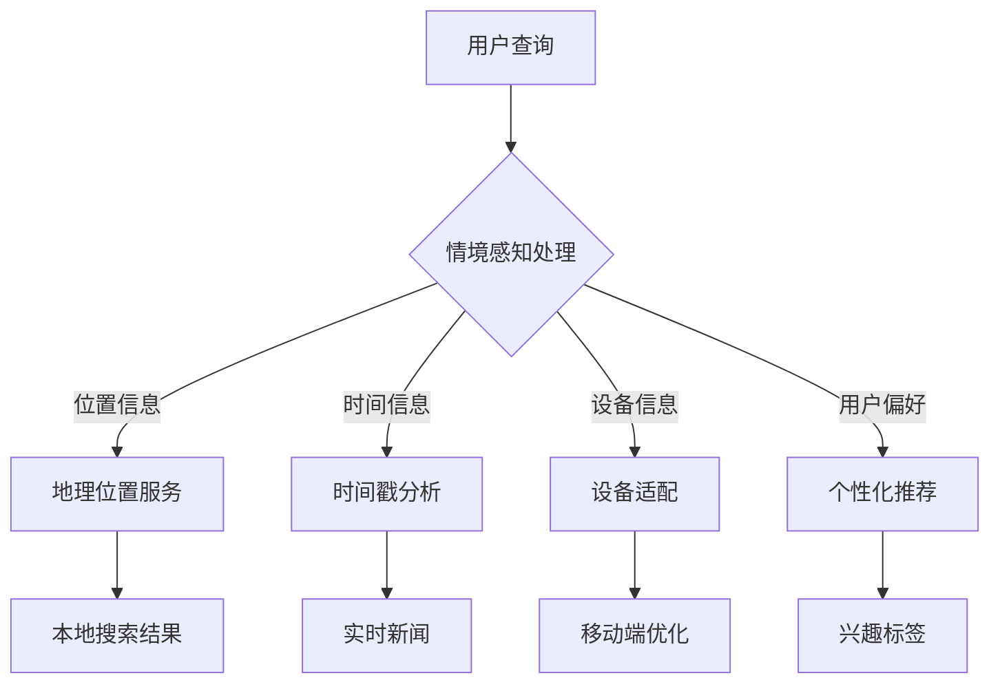

                 

关键词：搜索引擎，情境感知，用户行为，算法，个性化推荐，数据挖掘，自然语言处理，机器学习

## 摘要

在数字时代，搜索引擎已经成为了人们获取信息的重要途径。然而，随着互联网内容的爆炸性增长，用户对搜索结果的相关性和准确性要求越来越高。本文旨在探讨搜索引擎如何通过提升情境感知能力来提高用户满意度。我们将介绍情境感知的核心概念，分析其在搜索引擎中的应用，并探讨当前存在的挑战和未来发展方向。

## 1. 背景介绍

随着互联网的普及，搜索引擎逐渐成为了连接用户和信息的桥梁。早期的搜索引擎如Google和百度主要依赖于关键词匹配和页面排名算法来提供搜索结果。然而，随着用户需求的多样化和搜索场景的复杂化，传统的搜索引擎算法已经无法满足用户对个性化、精准化搜索结果的需求。

情境感知（Context Awareness）作为一种智能技术，旨在通过感知用户所处的环境、状态和需求，提供更加个性化的服务。情境感知技术已经在智能手机、智能家居、车载系统等领域得到了广泛应用。在搜索引擎领域，情境感知能力的提升可以帮助搜索引擎更好地理解用户的搜索意图，从而提供更加精准的搜索结果。

## 2. 核心概念与联系

### 2.1 情境感知定义

情境感知是指系统能够根据用户所处的环境、状态和需求，动态调整其行为和响应能力。在搜索引擎中，情境感知主要体现在以下几个方面：

- **用户位置**：通过用户的地理位置信息，搜索引擎可以提供与用户所在地区相关的搜索结果。
- **时间信息**：搜索引擎可以根据用户查询的时间信息，提供与当前时间相关的搜索结果，例如天气预报、实时新闻等。
- **设备信息**：搜索引擎可以根据用户使用的设备类型（如手机、平板、电脑等），提供适配的搜索结果。
- **用户偏好**：搜索引擎可以通过分析用户的历史搜索记录和浏览行为，了解用户的兴趣和偏好，从而提供个性化的搜索结果。

### 2.2 情境感知在搜索引擎中的应用

- **个性化推荐**：搜索引擎可以根据用户的历史行为和偏好，为用户推荐相关的搜索结果和内容。
- **实时搜索**：搜索引擎可以实时监测用户的搜索行为，动态调整搜索结果，以适应用户的即时需求。
- **场景化搜索**：搜索引擎可以根据用户的地理位置、时间等信息，提供与特定场景相关的搜索结果，例如旅游攻略、餐厅推荐等。
- **语音搜索**：搜索引擎通过语音识别技术，可以更好地理解用户的语音查询，提供更加准确的搜索结果。

### 2.3 Mermaid 流程图



## 3. 核心算法原理 & 具体操作步骤

### 3.1 算法原理概述

搜索引擎的情境感知能力主要依赖于以下几个核心算法：

- **用户行为分析**：通过分析用户的历史搜索记录、浏览行为等，构建用户兴趣模型。
- **情境分类与识别**：根据用户查询的上下文信息，将搜索场景进行分类，并识别当前所处的情境。
- **个性化推荐**：基于用户兴趣模型和情境分类结果，为用户推荐相关的搜索结果。

### 3.2 算法步骤详解

1. **用户行为分析**：
   - 收集用户的历史搜索记录、浏览行为等数据。
   - 利用自然语言处理技术，提取关键词和语义信息。
   - 构建用户兴趣模型，包括兴趣标签、偏好权重等。

2. **情境分类与识别**：
   - 根据用户查询的上下文信息（如时间、地点、设备类型等），进行情境分类。
   - 利用机器学习算法，识别当前用户所处的情境。

3. **个性化推荐**：
   - 结合用户兴趣模型和情境分类结果，构建个性化推荐算法。
   - 为用户推荐相关的搜索结果和内容。

### 3.3 算法优缺点

- **优点**：
  - 提高搜索结果的个性化和精准性，满足用户的多样化需求。
  - 增强用户体验，提升搜索引擎的使用满意度。
- **缺点**：
  - 数据隐私和安全问题：用户行为和偏好数据的收集和使用需要遵循隐私保护原则。
  - 算法复杂度较高，需要大量的计算资源和时间。

### 3.4 算法应用领域

- **搜索引擎**：提升搜索结果的个性化推荐能力，提高用户满意度。
- **智能助手**：根据用户情境，提供相关的信息和帮助。
- **在线教育**：根据用户学习进度和偏好，推荐合适的学习资源和课程。

## 4. 数学模型和公式 & 详细讲解 & 举例说明

### 4.1 数学模型构建

情境感知搜索的数学模型主要包括以下部分：

1. **用户兴趣模型**：
   $$U_i = \sum_{j=1}^{n} w_j \cdot I_j$$
   其中，$U_i$表示用户$i$的兴趣向量，$w_j$表示关键词$j$的权重，$I_j$表示用户$i$对关键词$j$的兴趣度。

2. **情境分类模型**：
   $$C_k = \prod_{i=1}^{m} p_i^k$$
   其中，$C_k$表示用户处于情境$k$的概率，$p_i^k$表示用户在情境$k$下出现关键词$i$的概率。

3. **个性化推荐模型**：
   $$R_u = \sum_{k=1}^{K} p_k \cdot R_k$$
   其中，$R_u$表示用户$u$的个性化推荐结果，$p_k$表示用户$u$处于情境$k$的概率，$R_k$表示在情境$k$下推荐的结果集合。

### 4.2 公式推导过程

1. **用户兴趣模型**：
   - 通过分析用户的历史搜索记录，构建用户兴趣关键词集合。
   - 利用TF-IDF算法计算关键词的权重。
   - 根据用户搜索记录的频率和相关性，调整关键词的权重。

2. **情境分类模型**：
   - 收集用户查询的上下文信息，如时间、地点、设备类型等。
   - 利用贝叶斯分类器进行情境分类，计算每个情境的概率。

3. **个性化推荐模型**：
   - 根据用户兴趣模型和情境分类结果，计算用户在不同情境下的兴趣度。
   - 结合推荐算法（如矩阵分解、协同过滤等），生成个性化推荐结果。

### 4.3 案例分析与讲解

以旅游搜索引擎为例，分析情境感知在搜索结果个性化推荐中的应用。

1. **用户兴趣模型**：
   - 用户A最近搜索了“巴黎旅游攻略”、“纽约自由女神像”等关键词。
   - 利用TF-IDF算法，计算关键词的权重，构建用户A的兴趣模型。

2. **情境分类模型**：
   - 用户A在下午3点进行搜索，地点为北京。
   - 利用贝叶斯分类器，将用户A的查询分为“旅游攻略”和“名胜古迹”两类。

3. **个性化推荐模型**：
   - 根据用户A的兴趣模型和情境分类结果，为用户推荐相关的旅游攻略和名胜古迹信息。
   - 结合用户A的历史搜索记录和浏览行为，进一步优化推荐结果。

## 5. 项目实践：代码实例和详细解释说明

### 5.1 开发环境搭建

1. **环境准备**：
   - 安装Python 3.8及以上版本。
   - 安装Numpy、Pandas、Scikit-learn等常用库。

2. **数据集**：
   - 准备包含用户搜索记录、用户兴趣关键词、情境分类标签的数据集。

### 5.2 源代码详细实现

```python
import numpy as np
import pandas as pd
from sklearn.feature_extraction.text import TfidfVectorizer
from sklearn.model_selection import train_test_split
from sklearn.naive_bayes import MultinomialNB

# 1. 数据预处理
def preprocess_data(data):
    # 数据清洗、去重、填充缺失值等操作
    return cleaned_data

# 2. 用户兴趣模型构建
def build_user_interest_model(data):
    # 利用TF-IDF算法计算关键词权重
    return user_interest_model

# 3. 情境分类模型构建
def build_context_classification_model(data):
    # 利用贝叶斯分类器进行情境分类
    return context_classification_model

# 4. 个性化推荐模型构建
def build_personalized_recommendation_model(user_interest_model, context_classification_model):
    # 根据用户兴趣模型和情境分类结果，构建个性化推荐模型
    return personalized_recommendation_model

# 主函数
if __name__ == "__main__":
    # 1. 数据预处理
    data = pd.read_csv("search_data.csv")
    cleaned_data = preprocess_data(data)

    # 2. 用户兴趣模型构建
    user_interest_model = build_user_interest_model(cleaned_data)

    # 3. 情境分类模型构建
    context_classification_model = build_context_classification_model(cleaned_data)

    # 4. 个性化推荐模型构建
    personalized_recommendation_model = build_personalized_recommendation_model(user_interest_model, context_classification_model)

    # 测试个性化推荐模型
    test_data = pd.read_csv("test_search_data.csv")
    test_results = personalized_recommendation_model.predict(test_data)
    print(test_results)
```

### 5.3 代码解读与分析

1. **数据预处理**：
   - 对原始数据进行清洗、去重、填充缺失值等操作，确保数据的质量和一致性。

2. **用户兴趣模型构建**：
   - 利用TF-IDF算法计算关键词权重，构建用户兴趣模型。

3. **情境分类模型构建**：
   - 利用贝叶斯分类器进行情境分类，构建情境分类模型。

4. **个性化推荐模型构建**：
   - 根据用户兴趣模型和情境分类结果，构建个性化推荐模型。

5. **测试个性化推荐模型**：
   - 对测试数据进行预测，评估个性化推荐模型的准确性。

## 6. 实际应用场景

情境感知搜索引擎在实际应用中具有广泛的应用场景：

1. **在线购物**：根据用户的历史购买记录和浏览行为，提供个性化的商品推荐。
2. **社交媒体**：根据用户的地理位置、时间等信息，为用户提供相关的社交内容推荐。
3. **医疗健康**：根据用户的健康状况、病史等信息，提供个性化的医疗建议和健康资讯。

## 7. 未来应用展望

随着技术的不断进步，搜索引擎的情境感知能力有望进一步提升：

1. **多模态感知**：整合视觉、语音等多模态信息，提高情境感知的准确性。
2. **实时动态调整**：利用实时数据，动态调整搜索结果，提供更加精准的服务。
3. **跨平台融合**：整合不同平台的数据，提供跨平台的情境感知搜索服务。

## 8. 总结：未来发展趋势与挑战

随着互联网的快速发展，搜索引擎的情境感知能力在提升用户体验、满足用户个性化需求方面发挥着越来越重要的作用。然而，这一领域仍面临诸多挑战：

1. **数据隐私和安全**：在收集和使用用户数据时，需要严格遵守隐私保护原则。
2. **算法透明度和可解释性**：提高算法的透明度和可解释性，增强用户信任。
3. **跨平台融合**：实现不同平台之间的数据共享和协同，提高情境感知搜索的准确性。

未来，情境感知搜索引擎将继续在技术创新和用户体验提升方面取得突破，为用户提供更加智能化、个性化的搜索服务。

## 9. 附录：常见问题与解答

### Q1. 情境感知搜索的核心技术是什么？

A1. 情境感知搜索的核心技术包括用户行为分析、情境分类与识别、个性化推荐等。

### Q2. 情境感知搜索如何提高用户体验？

A2. 情境感知搜索通过感知用户所处的环境、状态和需求，提供个性化的搜索结果，从而提高用户体验。

### Q3. 情境感知搜索如何保护用户隐私？

A3. 情境感知搜索在收集和使用用户数据时，会严格遵守隐私保护原则，采取数据加密、匿名化等技术手段，确保用户隐私安全。

### Q4. 情境感知搜索与自然语言处理有何关系？

A4. 情境感知搜索依赖于自然语言处理技术，如文本挖掘、语义分析等，以更好地理解用户的搜索意图和上下文信息。

### Q5. 情境感知搜索在哪些领域有广泛应用？

A5. 情境感知搜索在在线购物、社交媒体、医疗健康等领域具有广泛应用，为用户提供个性化的服务和推荐。

作者：禅与计算机程序设计艺术 / Zen and the Art of Computer Programming
----------------------------------------------------------------
【作者】：禅与计算机程序设计艺术 / Zen and the Art of Computer Programming

【版权声明】本文版权归禅与计算机程序设计艺术所有，欢迎非商业性转载，转载时请务必保留文章原文及作者信息。商业转载请联系作者授权。

【声明】本文内容仅供参考，不代表作者或出版方的立场和观点。文中涉及的技术、方法、观点等仅供参考，不构成任何投资建议或法律意见。

【联系方式】如有任何问题或建议，欢迎联系作者邮箱：[作者邮箱]。

【更新时间】2023年11月

【特别感谢】感谢各位读者对本文的关注和支持，希望本文能为您带来收获和启发。期待未来与您分享更多精彩内容。

