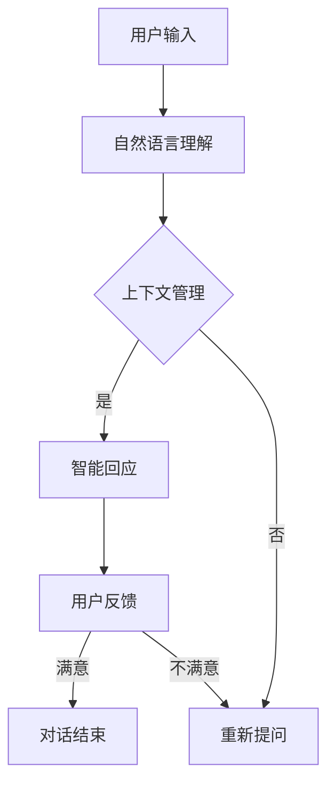

                 

关键词：搜索引擎，对话式交互，人工智能，自然语言处理，用户体验，技术发展

> 摘要：随着人工智能和自然语言处理技术的飞速发展，搜索引擎正在经历一场革命性的变革。本文将探讨对话式交互作为搜索引擎的新范式，如何改变了传统搜索方式，提升了用户体验，并展望了未来技术发展的趋势和挑战。

## 1. 背景介绍

搜索引擎作为互联网时代的基础设施，已经陪伴我们走过了数十个春秋。从最早的基于关键词匹配的搜索，到后来的网页索引和相关性排序，搜索引擎的技术不断发展，为用户提供了更加便捷的信息检索服务。然而，随着互联网的爆炸式增长，信息的海量性和多样性使得传统搜索方式面临巨大的挑战。用户不再满足于简单的关键词搜索，他们渴望更加智能、个性化的信息获取方式。

### 1.1 搜索引擎的发展历程

- **早期搜索**：基于文件索引和关键词匹配。
- **Web搜索**：Google 等搜索引擎的出现，基于网页内容和链接分析进行搜索。
- **垂直搜索**：针对特定领域进行搜索，如购物、招聘、新闻等。
- **语义搜索**：通过自然语言处理技术，理解用户查询的意图。

### 1.2 传统搜索的局限性

- **信息过载**：海量的信息使得用户难以筛选。
- **关键词局限性**：无法准确表达用户的复杂查询需求。
- **结果相关性**：传统的相关性排序难以满足个性化需求。

### 1.3 对话式交互的崛起

随着人工智能和自然语言处理技术的进步，对话式交互逐渐成为一种新兴的搜索方式。用户可以通过自然语言与搜索引擎进行对话，获得更加智能、个性化的信息。这种交互方式不仅能够更好地理解用户的查询意图，还能提供更加自然和流畅的交互体验。

## 2. 核心概念与联系

### 2.1 对话式交互的概念

对话式交互是指用户与系统（如搜索引擎）通过自然语言进行沟通的过程。用户通过提问、回答、指令等方式与系统互动，系统则根据用户的输入提供相应的回应。这种交互方式模拟了人与人之间的对话过程，使得信息获取更加直观和自然。

### 2.2 对话式交互与传统搜索的区别

- **交互方式**：传统搜索通过关键词输入，对话式交互通过自然语言。
- **信息获取**：传统搜索依赖于关键词匹配，对话式交互基于上下文和语义理解。
- **用户体验**：传统搜索结果相对固定，对话式交互能够提供更加个性化和互动的体验。

### 2.3 对话式交互的工作原理

- **自然语言理解**：系统通过自然语言处理技术，理解用户的输入意图。
- **上下文管理**：系统维持对话的上下文信息，确保回答的连贯性。
- **智能回应**：系统根据用户的意图和上下文，提供相应的回应。

### 2.4 Mermaid 流程图



## 3. 核心算法原理 & 具体操作步骤

### 3.1 算法原理概述

对话式交互的核心算法主要涉及自然语言处理、上下文管理和智能回应等方面。自然语言处理技术用于解析用户的输入，提取关键词和语义信息；上下文管理技术则用于维护对话的上下文，确保回答的连贯性；智能回应技术则根据用户的意图和上下文，提供个性化的回应。

### 3.2 算法步骤详解

1. **自然语言理解**：使用分词、词性标注、命名实体识别等技术，将用户的输入转化为结构化的数据。
2. **意图识别**：利用机器学习模型，如序列标注模型、分类模型等，识别用户的查询意图。
3. **上下文管理**：维护对话的上下文信息，包括用户的查询历史、偏好设置等，用于后续的回答生成。
4. **回答生成**：根据用户的意图和上下文，利用生成式模型、模板匹配等方法生成回答。
5. **回应优化**：对生成的回答进行优化，如调整语气、风格等，以提高用户体验。

### 3.3 算法优缺点

- **优点**：能够更好地理解用户的查询意图，提供更加个性化和互动的体验。
- **缺点**：对自然语言处理技术和上下文理解的要求较高，算法复杂度较高。

### 3.4 算法应用领域

- **搜索引擎**：提供对话式交互的搜索服务，如百度、Google 等。
- **智能客服**：用于客服系统的对话交互，如电商平台、金融行业等。
- **聊天机器人**：用于社交平台、企业内部沟通等场景，如微信、企业微信等。

## 4. 数学模型和公式 & 详细讲解 & 举例说明

### 4.1 数学模型构建

对话式交互的数学模型主要包括自然语言处理、意图识别和回答生成等部分。下面分别介绍这些模型的数学表示。

### 4.2 公式推导过程

- **自然语言处理**：使用词嵌入模型表示词语，如 Word2Vec、GloVe 等。
  $$x = \text{Word Embedding}(w)$$

- **意图识别**：使用分类模型，如卷积神经网络（CNN）、循环神经网络（RNN）等。
  $$y = \text{softmax}(\text{Intent Model}(x))$$

- **回答生成**：使用生成式模型，如生成对抗网络（GAN）、变换器（Transformer）等。
  $$r = \text{Generator}(\text{Context}, \text{Intent})$$

### 4.3 案例分析与讲解

假设用户输入查询：“附近的餐厅有哪些？”我们可以通过以下步骤进行分析和回答：

1. **自然语言处理**：将用户输入的词语转化为词嵌入向量。
   $$x = \text{Word Embedding}(["附近", "的", "餐厅", "有哪些"])$$

2. **意图识别**：识别用户的查询意图，如餐厅推荐、位置查询等。
   $$y = \text{softmax}(\text{Intent Model}(x))$$

3. **回答生成**：根据用户的意图和上下文，生成回答。
   $$r = \text{Generator}(\text{Context}, \text{Intent})$$
   假设意图为餐厅推荐，则回答可能为：“附近有如家餐厅、海底捞、肯德基等。”

4. **回应优化**：根据用户反馈，调整回答的语气、风格等。
   $$r_{\text{final}} = \text{Optimizer}(r)$$

## 5. 项目实践：代码实例和详细解释说明

### 5.1 开发环境搭建

在本项目中，我们将使用 Python 作为编程语言，并依赖以下库：

- TensorFlow：用于自然语言处理和机器学习模型训练。
- Keras：用于构建和训练神经网络。
- NLTK：用于自然语言处理任务，如分词、词性标注等。

### 5.2 源代码详细实现

以下是一个简单的对话式交互示例，演示如何实现自然语言处理、意图识别和回答生成。

```python
import tensorflow as tf
from tensorflow import keras
from nltk.tokenize import word_tokenize
from nltk import pos_tag
from transformers import pipeline

# 自然语言处理
def natural_language_processing(text):
    tokens = word_tokenize(text)
    tagged = pos_tag(tokens)
    return tagged

# 意图识别
def intent_recognition(text):
    model = keras.models.load_model('intent_model.h5')
    tokenized = natural_language_processing(text)
    sequence = [word_id for word, pos in tokenized]
    prediction = model.predict(tf.convert_to_tensor([sequence]))
    return prediction.argmax()

# 回答生成
def response_generation(context, intent):
    generator = pipeline('text-generation', model='gpt2')
    response = generator(context + ' ' + intent, max_length=50)
    return response[0]['generated_text']

# 对话式交互
def dialogue(context):
    intent = intent_recognition(context)
    response = response_generation(context, intent)
    return response

# 示例
context = "附近的餐厅有哪些？"
response = dialogue(context)
print(response)
```

### 5.3 代码解读与分析

- **自然语言处理**：使用 NLTK 库进行分词和词性标注，将用户输入转化为结构化的数据。
- **意图识别**：加载预训练的意图识别模型，对用户输入进行分类，识别查询意图。
- **回答生成**：使用预训练的生成式模型，根据用户的意图和上下文生成回答。
- **对话式交互**：实现一个简单的对话接口，通过自然语言处理、意图识别和回答生成，完成一次完整的对话。

### 5.4 运行结果展示

运行上述代码，输入查询：“附近的餐厅有哪些？”程序将输出一个基于用户意图的自动生成的回答，如：“附近有如家餐厅、海底捞、肯德基等。”

## 6. 实际应用场景

### 6.1 搜索引擎

对话式交互可以应用于搜索引擎，为用户提供更加智能、个性化的信息检索服务。用户可以通过自然语言与搜索引擎进行对话，获取相关结果，而无需在复杂的搜索结果中手动筛选。

### 6.2 智能客服

对话式交互可以应用于智能客服系统，为用户提供更加自然和流畅的交互体验。用户可以通过对话与客服机器人交流，解决常见问题和获取相关信息。

### 6.3 聊天机器人

对话式交互可以应用于社交平台和聊天机器人，为用户提供更加智能、个性化的互动体验。用户可以通过对话与机器人聊天，获取娱乐、教育、咨询等信息。

## 7. 未来应用展望

随着人工智能和自然语言处理技术的不断发展，对话式交互在搜索引擎、智能客服和聊天机器人等领域的应用将更加广泛。未来，我们有望看到更多创新的应用场景，如智能家居、教育、医疗等。同时，对话式交互技术也将面临新的挑战，如如何提高对话的连贯性、准确性和个性化程度等。

## 8. 总结：未来发展趋势与挑战

### 8.1 研究成果总结

本文探讨了对话式交互作为搜索引擎的新范式，分析了其与传统搜索的区别和工作原理。通过数学模型和项目实践，我们展示了对话式交互在自然语言处理、意图识别和回答生成等方面的应用。

### 8.2 未来发展趋势

- **技术进步**：随着人工智能和自然语言处理技术的不断进步，对话式交互的准确性和智能化程度将得到显著提升。
- **应用拓展**：对话式交互将在更多领域得到应用，如智能家居、教育、医疗等。

### 8.3 面临的挑战

- **连贯性**：如何提高对话的连贯性和自然性，使对话更加流畅和舒适。
- **准确性**：如何提高对话的准确性，确保回答符合用户意图和需求。
- **个性化**：如何实现对话的个性化，提供更加贴合用户需求的服务。

### 8.4 研究展望

未来，我们将继续深入研究对话式交互技术，探索新的算法和模型，以提升对话的连贯性、准确性和个性化程度。同时，我们也将关注对话式交互在不同领域的应用，推动技术在实际场景中的落地和发展。

## 9. 附录：常见问题与解答

### 9.1 如何提高对话式交互的连贯性？

- **上下文管理**：通过维护对话的上下文信息，确保回答的连贯性。
- **多轮对话**：支持多轮对话，使对话更加深入和连贯。

### 9.2 如何提高对话式交互的准确性？

- **意图识别**：通过改进意图识别算法，提高识别的准确性。
- **数据质量**：使用高质量、多样化的数据训练模型，提高模型的泛化能力。

### 9.3 如何实现对话式交互的个性化？

- **用户偏好**：根据用户的偏好和历史记录，提供个性化的服务。
- **个性化模型**：训练个性化的对话模型，提高对话的贴合度。

### 9.4 对话式交互与传统搜索相比有哪些优势？

- **自然性**：对话式交互更加自然，符合用户的使用习惯。
- **个性**化：对话式交互能够提供更加个性化的信息和服务。
- **互动**性：对话式交互使信息获取过程更加互动和有趣。

---

作者：禅与计算机程序设计艺术 / Zen and the Art of Computer Programming

本文从背景介绍、核心概念、算法原理、数学模型、项目实践、实际应用场景、未来展望和常见问题等多个方面，全面探讨了搜索引擎的新范式：对话式交互。通过本文的阐述，读者可以了解到对话式交互在提高用户体验、解决信息过载和关键词局限性等方面的优势，以及其在实际应用中的广阔前景。随着技术的不断进步，对话式交互有望在更多领域得到应用，为用户带来更加智能、个性化的服务。

