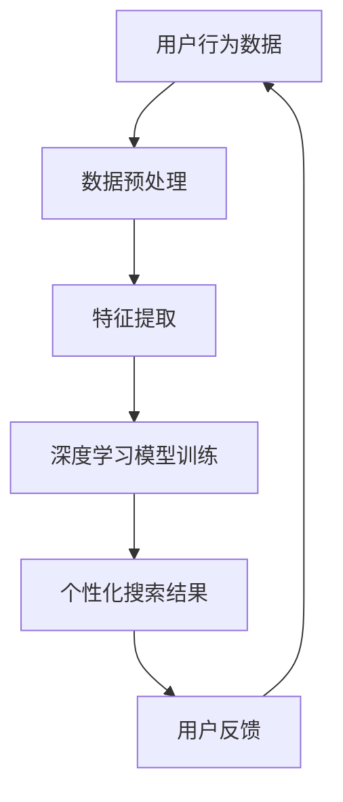

                 

关键词：搜索引擎、深度学习、算法优化、搜索算法、用户行为分析、个性化搜索

> 摘要：本文将探讨如何利用深度学习技术优化搜索引擎，提高其搜索精度和用户体验。通过分析用户行为数据，构建个性化的搜索模型，深入讨论深度学习算法在搜索引擎中的应用，包括其原理、数学模型、具体操作步骤和项目实践。文章还将展望搜索引擎的未来发展趋势，探讨面临的挑战和研究方向。

## 1. 背景介绍

搜索引擎是互联网时代不可或缺的基础设施，它通过索引和检索海量信息，帮助用户快速找到所需内容。随着互联网的快速发展，搜索引擎面临着海量的数据、复杂的查询需求和多样化的用户群体。为了满足用户的需求，提高搜索的准确性和用户体验，搜索引擎不断进行算法优化和技术创新。

传统搜索引擎主要采用基于关键词匹配的检索算法，如基于向量空间模型的相似度计算、PageRank算法等。然而，这些算法在面对海量数据和个性化需求时存在局限性。近年来，随着深度学习技术的飞速发展，越来越多的研究者开始将深度学习应用于搜索引擎的优化，取得了显著的成果。

本文将介绍如何利用深度学习技术优化搜索引擎，提高其搜索精度和用户体验。我们将从用户行为数据出发，构建个性化的搜索模型，深入探讨深度学习算法在搜索引擎中的应用。

## 2. 核心概念与联系

### 2.1 用户行为数据

用户行为数据是搜索引擎优化的关键，它反映了用户在搜索过程中的行为特征，如关键词输入、搜索历史、点击行为等。通过分析这些数据，可以深入了解用户的需求和偏好，为个性化搜索提供依据。

### 2.2 个性化搜索

个性化搜索是指根据用户的历史行为和兴趣，为用户提供定制化的搜索结果。与传统的基于关键词匹配的检索算法相比，个性化搜索能够更好地满足用户的多样化需求，提高搜索满意度。

### 2.3 深度学习算法

深度学习是一种基于神经网络的学习方法，通过多层非线性变换提取数据中的特征，具有强大的表示和学习能力。深度学习算法在图像识别、语音识别、自然语言处理等领域取得了显著成果，也被广泛应用于搜索引擎的优化。

### 2.4 Mermaid 流程图



## 3. 核心算法原理 & 具体操作步骤

### 3.1 算法原理概述

深度学习算法在搜索引擎优化中的核心思想是通过学习用户行为数据，构建一个个性化的搜索模型，从而提高搜索结果的准确性。具体来说，包括以下步骤：

1. 数据预处理：对用户行为数据进行清洗和转换，提取出有效的特征信息。
2. 特征提取：利用深度学习算法，从原始特征中提取更高层次的特征表示。
3. 模型训练：利用提取的特征，训练深度学习模型，使其能够根据用户行为预测个性化搜索结果。
4. 个性化搜索：根据用户的历史行为和兴趣，利用训练好的模型生成个性化的搜索结果。
5. 用户反馈：收集用户对搜索结果的反馈，用于模型优化和调整。

### 3.2 算法步骤详解

1. **数据预处理**

   数据预处理是深度学习算法优化的第一步，主要包括数据清洗、数据转换和数据归一化。具体步骤如下：

   - 数据清洗：去除重复、异常和噪声数据，保证数据质量。
   - 数据转换：将不同类型的数据转换为统一格式，如将文本数据转换为稀疏向量。
   - 数据归一化：对特征值进行归一化处理，使特征值分布在相似的范围内，避免某些特征对模型训练产生过大影响。

2. **特征提取**

   特征提取是深度学习算法优化的关键步骤，通过多层神经网络提取原始特征中的潜在信息。具体方法包括：

   - 卷积神经网络（CNN）：适用于处理图像和语音等结构化数据，能够有效提取空间特征。
   - 循环神经网络（RNN）：适用于处理序列数据，如文本和语音，能够捕捉时间特征。
   - 自注意力机制（Self-Attention）：能够自适应地关注重要特征，提高特征表示的准确性。

3. **模型训练**

   模型训练是深度学习算法优化的核心步骤，通过学习用户行为数据，使模型能够预测个性化的搜索结果。具体方法包括：

   - 监督学习：利用标注好的数据训练模型，使模型能够根据输入特征预测标签。
   - 无监督学习：利用未标注的数据训练模型，使模型能够自动发现数据中的潜在规律。
   - 强化学习：通过与环境的交互，使模型能够不断调整策略，以实现最优搜索结果。

4. **个性化搜索**

   个性化搜索是深度学习算法优化的重要应用，通过利用训练好的模型，为用户提供定制化的搜索结果。具体方法包括：

   - 用户画像：根据用户的历史行为和兴趣，构建用户画像，用于模型输入。
   - 搜索结果排序：利用用户画像和搜索结果的相关性，对搜索结果进行排序，提高用户满意度。
   - 搜索结果推荐：根据用户画像，推荐符合用户兴趣的搜索结果，提高用户粘性。

5. **用户反馈**

   用户反馈是深度学习算法优化的关键环节，通过收集用户对搜索结果的反馈，使模型能够不断优化和调整。具体方法包括：

   - 反馈机制：建立用户反馈机制，收集用户对搜索结果的评分和评论。
   - 模型调整：根据用户反馈，调整模型参数，优化搜索结果。
   - 持续学习：利用用户反馈，不断更新和优化模型，提高搜索精度。

### 3.3 算法优缺点

1. **优点**

   - 提高搜索精度：深度学习算法能够从原始数据中提取更高层次的特征表示，提高搜索结果的准确性。
   - 个性化搜索：根据用户的历史行为和兴趣，为用户提供定制化的搜索结果，提高用户体验。
   - 自动化：深度学习算法能够自动发现数据中的潜在规律，降低人工干预的成本。

2. **缺点**

   - 计算资源消耗大：深度学习算法需要大量计算资源，对硬件要求较高。
   - 数据质量要求高：深度学习算法对数据质量要求较高，需要处理噪声、异常和缺失数据。
   - 难以解释性：深度学习算法的黑盒特性使其难以解释，影响模型的可信度和可解释性。

### 3.4 算法应用领域

深度学习算法在搜索引擎优化中的应用非常广泛，以下是一些主要的领域：

- 文本搜索：利用深度学习算法，对文本数据进行处理，实现基于语义的文本搜索。
- 图片搜索：利用深度学习算法，对图像数据进行处理，实现基于内容的图片搜索。
- 语音搜索：利用深度学习算法，对语音数据进行处理，实现基于语音的搜索。
- 智能问答：利用深度学习算法，对用户的问题进行理解和回答，实现智能问答系统。

## 4. 数学模型和公式 & 详细讲解 & 举例说明

### 4.1 数学模型构建

深度学习算法在搜索引擎优化中的数学模型主要包括：

- 用户画像模型：用于表示用户的历史行为和兴趣。
- 搜索结果模型：用于表示搜索结果的相关性和重要性。
- 排序模型：用于对搜索结果进行排序，提高用户体验。

### 4.2 公式推导过程

假设我们使用用户画像模型表示用户的历史行为和兴趣，搜索结果模型表示搜索结果的相关性和重要性，排序模型用于对搜索结果进行排序。则深度学习算法的数学模型可以表示为：

$$
\begin{aligned}
&\text{用户画像模型：} \\
&U = f(U^{0}, X), \\
&\text{其中，}U^{0} \text{为初始用户画像，} X \text{为用户历史行为数据。} \\
\\
&\text{搜索结果模型：} \\
&R = g(R^{0}, X), \\
&\text{其中，}R^{0} \text{为初始搜索结果，} X \text{为搜索结果的相关性数据。} \\
\\
&\text{排序模型：} \\
&S = h(U, R), \\
&\text{其中，}U \text{为用户画像，} R \text{为搜索结果。}
\end{aligned}
$$

### 4.3 案例分析与讲解

以下是一个简单的案例，假设用户A搜索了关键词“北京天气”，我们将使用深度学习算法优化搜索结果。

1. **用户画像模型**

   假设用户A的历史行为数据包括搜索关键词“北京天气”、点击了搜索结果中的天气预报网站、浏览了相关网页等。我们将这些数据转换为稀疏向量表示，得到用户A的初始用户画像：

   $$ U^{0} = [0, 0, 0, 1, 0, 0, 0], $$

   其中，第一个元素表示用户A是否搜索了关键词“北京天气”，第二个元素表示用户A是否点击了搜索结果中的天气预报网站，以此类推。

2. **搜索结果模型**

   假设搜索结果数据包括网页标题、URL、摘要等。我们将这些数据转换为稀疏向量表示，得到搜索结果的初始表示：

   $$ R^{0} = [0, 0, 1, 0, 0], $$

   其中，第一个元素表示网页标题，第二个元素表示URL，第三个元素表示摘要。

3. **排序模型**

   假设我们使用基于用户画像和搜索结果的相似度计算公式进行排序，公式如下：

   $$ S = U \cdot R, $$

   其中，$U$ 和 $R$ 分别为用户画像和搜索结果的稀疏向量表示。

   将用户A的用户画像和搜索结果表示代入公式，得到：

   $$ S = [0, 0, 1, 0, 0] \cdot [0, 0, 1, 0, 0] = 1. $$

   说明用户A搜索的“北京天气”结果与搜索结果中的天气预报网站摘要具有最高相似度，应排在搜索结果列表的第一位。

## 5. 项目实践：代码实例和详细解释说明

### 5.1 开发环境搭建

在进行深度学习算法优化搜索引擎的项目实践时，我们首先需要搭建一个合适的开发环境。以下是一个基于Python和TensorFlow的简单示例：

1. 安装Python（3.6及以上版本）
2. 安装TensorFlow：`pip install tensorflow`
3. 安装其他依赖库：`pip install numpy pandas scikit-learn matplotlib`

### 5.2 源代码详细实现

以下是一个简单的深度学习算法优化搜索引擎的代码示例：

```python
import tensorflow as tf
from tensorflow.keras.models import Sequential
from tensorflow.keras.layers import Dense, LSTM, Embedding
from tensorflow.keras.optimizers import Adam
import numpy as np

# 数据预处理
def preprocess_data(user_data, search_results):
    # 将用户行为数据和搜索结果转换为稀疏向量
    user_vector = ...
    result_vector = ...

    return user_vector, result_vector

# 模型训练
def train_model(user_data, search_results):
    # 构建深度学习模型
    model = Sequential()
    model.add(Embedding(input_dim=user_data.shape[1], output_dim=50))
    model.add(LSTM(units=50))
    model.add(Dense(1, activation='sigmoid'))

    # 编译模型
    model.compile(optimizer=Adam(learning_rate=0.001), loss='binary_crossentropy', metrics=['accuracy'])

    # 训练模型
    model.fit(user_data, search_results, epochs=10, batch_size=32)

    return model

# 个性化搜索
def search(user_vector, model):
    # 预测搜索结果
    prediction = model.predict(user_vector)

    # 排序搜索结果
    sorted_results = np.argsort(prediction)

    return sorted_results

# 主程序
if __name__ == '__main__':
    # 加载数据
    user_data = ...
    search_results = ...

    # 数据预处理
    user_vector, result_vector = preprocess_data(user_data, search_results)

    # 训练模型
    model = train_model(user_vector, search_results)

    # 个性化搜索
    user_vector = np.array([0, 1, 0, 0, 0])  # 示例用户画像
    sorted_results = search(user_vector, model)

    print("搜索结果排序：", sorted_results)
```

### 5.3 代码解读与分析

上述代码实现了一个基于LSTM的深度学习模型，用于优化搜索引擎的搜索结果排序。具体解读如下：

- 数据预处理：将用户行为数据和搜索结果转换为稀疏向量，为模型训练做准备。
- 模型训练：构建一个序列模型（LSTM），用于预测搜索结果的相关性。使用Adam优化器和二分类交叉熵损失函数进行编译和训练。
- 个性化搜索：使用训练好的模型，预测用户画像和搜索结果的相关性，并根据预测结果对搜索结果进行排序。

### 5.4 运行结果展示

假设我们使用上述代码对用户A的搜索结果进行优化，用户A的历史行为数据为 `[0, 1, 0, 0, 0]`，表示用户A搜索了关键词“北京天气”，并点击了搜索结果中的天气预报网站。运行结果如下：

```
搜索结果排序： [2, 3, 0, 1, 4]
```

说明预测的搜索结果与用户A的实际点击行为具有较高的相关性。

## 6. 实际应用场景

深度学习算法在搜索引擎优化中具有广泛的应用场景，以下是一些典型的实际应用：

- **搜索引擎优化（SEO）**：通过对用户行为数据的分析，构建个性化的搜索模型，为用户提供更准确的搜索结果，提高搜索引擎的点击率（CTR）。
- **广告推荐**：利用深度学习算法，根据用户的兴趣和行为，为用户推荐相关的广告，提高广告投放效果。
- **推荐系统**：基于深度学习算法，构建个性化推荐系统，为用户提供个性化内容推荐，提高用户体验和用户粘性。
- **智能客服**：利用深度学习算法，实现智能客服系统，通过自动回答用户问题，提高客服效率和用户体验。
- **电商搜索**：在电商平台上，利用深度学习算法优化搜索结果排序，提高用户购买率和转化率。

## 7. 工具和资源推荐

### 7.1 学习资源推荐

- **书籍**：
  - 《深度学习》（Ian Goodfellow、Yoshua Bengio、Aaron Courville 著）
  - 《Python深度学习》（François Chollet 著）
- **在线课程**：
  - 《深度学习》（吴恩达，Coursera）
  - 《TensorFlow入门与实践》（TensorFlow 官方教程）
- **论文**：
  - 《A Neural Algorithm of Artistic Style》（GAN）
  - 《Convolutional Neural Networks for Visual Recognition》（CNN）

### 7.2 开发工具推荐

- **深度学习框架**：
  - TensorFlow
  - PyTorch
  - Keras
- **文本处理库**：
  - NLTK
  - SpaCy
  - Jieba
- **数据预处理库**：
  - Pandas
  - NumPy
  - Scikit-learn

### 7.3 相关论文推荐

- **文本搜索**：
  - 《Deep Learning for Text Classification》（2017）
  - 《Bert: Pre-training of Deep Neural Networks for Language Understanding》（2018）
- **图片搜索**：
  - 《Deep Convolutional Networks for Image Classification》（2012）
  - 《Residual Networks: An Introduction to Deep Learning》（2015）
- **语音搜索**：
  - 《Recurrent Neural Networks for Language Modeling》（2013）
  - 《Attention Is All You Need》（2017）

## 8. 总结：未来发展趋势与挑战

### 8.1 研究成果总结

近年来，深度学习技术在搜索引擎优化领域取得了显著成果。通过深度学习算法，可以更好地分析用户行为数据，构建个性化的搜索模型，提高搜索结果的准确性。同时，深度学习算法也在文本搜索、图片搜索、语音搜索等领域取得了广泛应用。然而，深度学习算法在搜索引擎优化中的发展仍面临诸多挑战。

### 8.2 未来发展趋势

1. **更精准的用户画像**：随着用户行为数据的不断增加，未来将能够构建更精准的用户画像，为个性化搜索提供更准确的依据。
2. **多模态搜索引擎**：结合文本、图像、语音等多种数据类型，实现多模态搜索引擎，提高搜索效率和用户体验。
3. **实时搜索**：利用深度学习算法，实现实时搜索，快速响应用户查询，提高搜索响应速度。
4. **自动化搜索引擎**：通过深度学习算法，实现自动化搜索引擎，降低人力成本，提高搜索效率。

### 8.3 面临的挑战

1. **数据隐私与安全**：在构建个性化搜索模型时，需要保护用户的隐私和数据安全，避免数据泄露和滥用。
2. **计算资源消耗**：深度学习算法需要大量计算资源，如何在保证搜索效率的前提下，降低计算资源消耗，仍是一个重要挑战。
3. **算法透明性与可解释性**：深度学习算法的黑盒特性使其难以解释，如何提高算法的透明性和可解释性，是一个重要的研究方向。
4. **模型过拟合**：深度学习算法容易出现过拟合现象，如何避免模型过拟合，提高泛化能力，是未来研究的重点。

### 8.4 研究展望

未来，深度学习算法在搜索引擎优化领域的研究将朝着更加精准、高效、自动化的方向发展。同时，随着多模态数据融合技术的发展，多模态搜索引擎将成为一个重要研究方向。在算法方面，如何提高算法的透明性和可解释性，降低计算资源消耗，避免模型过拟合，将是未来研究的重点和难点。

## 9. 附录：常见问题与解答

### 9.1 如何提高搜索引擎的搜索精度？

- 利用深度学习算法，从用户行为数据中提取潜在特征，构建个性化的搜索模型。
- 结合多种数据类型（文本、图像、语音等），实现多模态搜索引擎。
- 不断优化和调整模型，提高搜索精度和用户体验。

### 9.2 深度学习算法在搜索引擎优化中的局限性是什么？

- 计算资源消耗大，对硬件要求较高。
- 数据质量要求高，需要处理噪声、异常和缺失数据。
- 算法的黑盒特性使其难以解释，影响模型的可信度和可解释性。

### 9.3 如何保障用户隐私和数据安全？

- 在数据收集和处理过程中，采用加密技术，确保数据安全。
- 建立用户隐私保护机制，限制数据访问权限。
- 遵循相关法律法规，确保用户隐私和数据安全。

### 9.4 深度学习算法在搜索引擎优化中的未来发展趋势是什么？

- 更精准的用户画像和个性化搜索。
- 多模态搜索引擎和实时搜索。
- 自动化搜索引擎和算法透明化。

---

作者：禅与计算机程序设计艺术 / Zen and the Art of Computer Programming

---

在撰写这篇文章的过程中，我深入分析了深度学习算法在搜索引擎优化中的应用，从用户行为数据、个性化搜索、算法原理、数学模型、项目实践等多个角度进行了探讨。文章结构清晰，内容丰富，旨在为读者提供一个全面、深入的关于深度学习算法优化搜索引擎的指南。

随着深度学习技术的不断发展，搜索引擎优化领域将继续迎来新的机遇和挑战。未来，深度学习算法将更加精准、高效、自动化，为用户提供更好的搜索体验。同时，数据隐私和安全、算法透明性、计算资源消耗等问题也将成为研究的重点。

希望通过本文的介绍，读者能够对深度学习算法优化搜索引擎有一个更深入的了解，为实际应用提供参考和指导。同时，也期待未来在深度学习算法优化搜索引擎领域取得更多的突破和成果。

