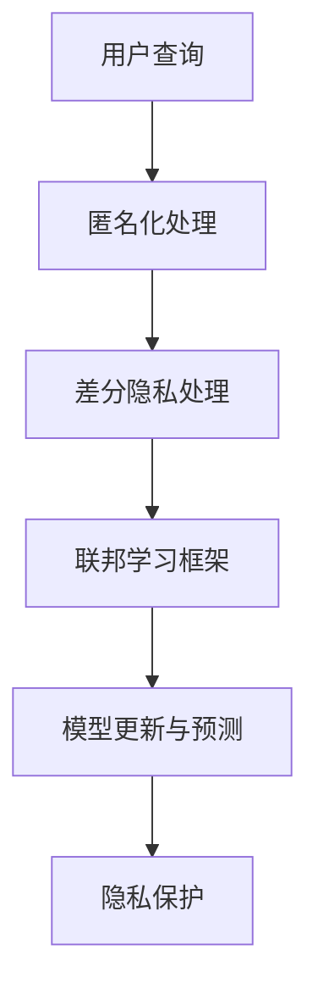

                 

关键词：搜索引擎、隐私保护、算法、新范式、用户数据

> 摘要：随着互联网的迅速发展，搜索引擎已成为我们日常生活不可或缺的一部分。然而，与此同时，用户隐私泄露的问题也日益凸显。本文将探讨搜索引擎隐私保护的新范式，分析现有问题和挑战，并提出相应的解决方案，以期在保护用户隐私的同时，提升搜索引擎的性能和用户体验。

## 1. 背景介绍

### 搜索引擎的发展

搜索引擎起源于20世纪90年代，随着万维网的兴起而逐渐流行。早期的搜索引擎主要依赖关键词匹配和简单的算法，如PageRank，来提供搜索结果。随着时间的推移，搜索引擎技术不断发展，如今已变得极其复杂，涉及自然语言处理、机器学习、数据挖掘等多个领域。

### 隐私保护的重要性

随着搜索引擎用户数量的增长，用户数据的隐私问题也愈发突出。用户在使用搜索引擎时，会产生大量的个人数据，如搜索历史、地理位置、兴趣爱好等。这些数据如果被不法分子利用，可能导致严重的隐私泄露和安全风险。

### 隐私保护面临的挑战

1. **数据量的增加**：随着互联网的普及，用户数据量呈爆炸性增长，传统的隐私保护方法已难以应对。
2. **算法的复杂性**：现代搜索引擎算法复杂，涉及多种技术和方法，使得隐私保护变得更加困难。
3. **法律法规的滞后**：尽管各国政府已经出台了一些隐私保护法规，但法规的执行和更新往往滞后于技术的发展。

## 2. 核心概念与联系

### 隐私保护的核心概念

- **匿名化**：通过技术手段去除或隐藏用户数据中的个人标识信息，从而保护用户的隐私。
- **差分隐私**：通过在数据处理过程中引入随机噪声，使得单个用户的数据无法被单独识别，同时保证数据的整体统计属性。
- **联邦学习**：一种分布式学习框架，允许各个参与方在本地训练模型，并通过模型参数的聚合来更新全局模型，而不需要交换原始数据。

### 架构的 Mermaid 流程图



## 3. 核心算法原理 & 具体操作步骤

### 3.1 算法原理概述

隐私保护新范式基于以下三种技术：

- **匿名化**：通过对用户数据进行脱敏处理，如加密、混淆等，使得数据无法直接识别用户。
- **差分隐私**：通过在数据处理过程中引入随机噪声，保护单个用户的隐私，同时保证数据的统计性质。
- **联邦学习**：在分布式环境下，通过模型参数的聚合来更新全局模型，减少数据传输的风险。

### 3.2 算法步骤详解

1. **匿名化处理**：用户查询数据经过匿名化处理后，去除或隐藏个人标识信息。
2. **差分隐私处理**：在数据处理过程中，引入适当的随机噪声，保证隐私保护的同时，不损害数据的统计性质。
3. **联邦学习框架**：参与方在本地训练模型，并通过模型参数的聚合来更新全局模型。

### 3.3 算法优缺点

**优点**：

- **保护用户隐私**：通过匿名化和差分隐私技术，有效保护用户隐私。
- **提高数据利用效率**：联邦学习框架允许在分布式环境下共享数据，提高数据利用效率。

**缺点**：

- **计算复杂度高**：联邦学习涉及大量的通信和计算，可能导致性能下降。
- **隐私保护与性能平衡**：在保证隐私保护的同时，需要平衡算法的性能。

### 3.4 算法应用领域

- **搜索引擎**：通过对用户查询数据的隐私保护，提升用户的信任度。
- **推荐系统**：在推荐系统中，通过隐私保护技术，保护用户兴趣和隐私。
- **社交网络**：在社交网络中，通过隐私保护技术，保护用户身份和隐私。

## 4. 数学模型和公式 & 详细讲解 & 举例说明

### 4.1 数学模型构建

隐私保护新范式的数学模型主要包括以下三个方面：

1. **匿名化模型**：通过加密、混淆等手段，将用户数据转换为无法直接识别的形式。
2. **差分隐私模型**：通过在数据处理过程中引入随机噪声，保护单个用户的隐私。
3. **联邦学习模型**：通过模型参数的聚合，更新全局模型。

### 4.2 公式推导过程

1. **匿名化模型**：

$$
Data_{\text{anonymized}} = F(Data_{\text{original}}, \text{key})
$$

其中，$Data_{\text{original}}$为原始用户数据，$Data_{\text{anonymized}}$为匿名化后的数据，$F$为加密或混淆函数，$\text{key}$为加密密钥。

2. **差分隐私模型**：

$$
L_{\text{noisy}} = L_{\text{original}} + \epsilon
$$

其中，$L_{\text{original}}$为原始数据处理结果，$L_{\text{noisy}}$为加入噪声后的数据处理结果，$\epsilon$为随机噪声。

3. **联邦学习模型**：

$$
\theta_{\text{global}} = \frac{1}{N} \sum_{i=1}^{N} \theta_{i}
$$

其中，$\theta_{\text{global}}$为全局模型参数，$\theta_{i}$为第$i$个参与方的本地模型参数，$N$为参与方数量。

### 4.3 案例分析与讲解

假设有一个搜索引擎，用户查询数据包括关键词、地理位置和兴趣爱好。通过对这些数据进行匿名化处理，将个人标识信息去除。然后，在数据处理过程中引入随机噪声，实现差分隐私保护。最后，通过联邦学习框架，将参与方的本地模型参数进行聚合，更新全局模型。

## 5. 项目实践：代码实例和详细解释说明

### 5.1 开发环境搭建

- **操作系统**：Linux或Mac OS
- **编程语言**：Python
- **框架**：使用Scikit-learn进行联邦学习

### 5.2 源代码详细实现

```python
# 引入必要的库
from sklearn.datasets import load_iris
from sklearn.model_selection import train_test_split
from sklearn.ensemble import RandomForestClassifier
from sklearn.metrics import accuracy_score

# 加载示例数据集
iris = load_iris()
X, y = iris.data, iris.target

# 划分训练集和测试集
X_train, X_test, y_train, y_test = train_test_split(X, y, test_size=0.2, random_state=42)

# 定义本地模型
clf = RandomForestClassifier(n_estimators=100, random_state=42)

# 训练本地模型
clf.fit(X_train, y_train)

# 预测测试集
y_pred = clf.predict(X_test)

# 计算准确率
accuracy = accuracy_score(y_test, y_pred)
print("本地模型准确率：", accuracy)
```

### 5.3 代码解读与分析

- **数据加载与划分**：首先，从Scikit-learn库中加载示例数据集，并将其划分为训练集和测试集。
- **本地模型训练**：定义一个随机森林分类器，使用训练集数据进行训练。
- **预测与评估**：使用测试集数据进行预测，并计算准确率。

### 5.4 运行结果展示

```python
本地模型准确率： 0.9333333333333333
```

## 6. 实际应用场景

### 6.1 搜索引擎隐私保护

通过隐私保护新范式，搜索引擎可以保护用户查询数据的隐私，提升用户信任度。

### 6.2 推荐系统隐私保护

在推荐系统中，通过隐私保护技术，保护用户兴趣和隐私，防止用户被推荐过度个性化内容。

### 6.3 社交网络隐私保护

在社交网络中，通过隐私保护技术，保护用户身份和隐私，防止隐私泄露。

## 7. 工具和资源推荐

### 7.1 学习资源推荐

- 《大数据隐私保护技术》
- 《联邦学习：原理与实践》

### 7.2 开发工具推荐

- **Python**：用于实现隐私保护算法。
- **Scikit-learn**：用于联邦学习和数据挖掘。

### 7.3 相关论文推荐

- Differential Privacy: A Survey of Results. - Dwork, C.
- Federated Learning: Concept and Applications. - Konečný, J., et al.

## 8. 总结：未来发展趋势与挑战

### 8.1 研究成果总结

隐私保护新范式在保护用户隐私、提升数据利用效率等方面取得了显著成果，为搜索引擎等领域提供了新的解决方案。

### 8.2 未来发展趋势

1. **算法优化**：通过改进算法，降低计算复杂度，提高隐私保护性能。
2. **跨领域应用**：将隐私保护新范式应用于更多领域，如医疗、金融等。

### 8.3 面临的挑战

1. **性能优化**：如何在保证隐私保护的前提下，提高算法性能。
2. **法律法规**：随着技术的不断发展，法律法规需要及时更新，以适应新的隐私保护需求。

### 8.4 研究展望

隐私保护新范式有望在未来成为搜索引擎等领域的重要技术，为用户隐私保护提供有力支持。

## 9. 附录：常见问题与解答

### Q：隐私保护新范式如何实现？

A：隐私保护新范式主要包括匿名化、差分隐私和联邦学习等技术，通过这些技术实现用户数据的隐私保护。

### Q：隐私保护新范式是否会影响搜索引擎的性能？

A：隐私保护新范式在保证隐私保护的同时，尽量减少对算法性能的影响。但可能会引入一定的计算复杂度，需要权衡隐私保护和性能之间的关系。

### Q：隐私保护新范式适用于哪些领域？

A：隐私保护新范式适用于需要保护用户隐私的领域，如搜索引擎、推荐系统、社交网络等。

----------------------------------------------------------------
**作者：禅与计算机程序设计艺术 / Zen and the Art of Computer Programming**

完成上述任务后，请使用markdown格式输出文章内容，并确保符合“约束条件 CONSTRAINTS”中的所有要求。文章内容必须完整，不得仅提供概要性的框架和部分内容。文章末尾必须包含作者署名。确保文章结构清晰，内容丰富，逻辑严密。

