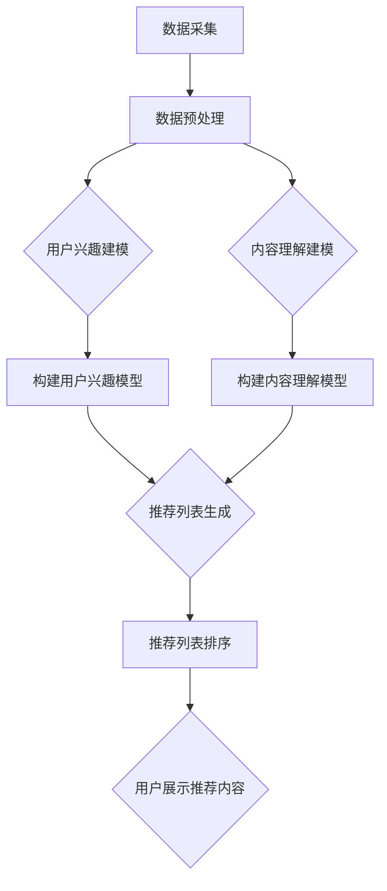

                 

关键词：搜索推荐系统，AI大模型，训练技巧，深度学习，自然语言处理，计算机视觉

> 摘要：本文旨在探讨搜索推荐系统中AI大模型的训练技巧。通过深入分析AI大模型的架构、核心算法和数学模型，本文将介绍如何在搜索推荐系统中实现高效的模型训练，并分享一些实践经验。文章将涵盖从模型选择、数据预处理到模型训练和优化的各个环节，旨在为搜索推荐系统开发者提供有价值的指导。

## 1. 背景介绍

随着互联网的普及和用户需求的不断增长，搜索推荐系统已经成为众多应用场景中的核心模块。它不仅帮助用户快速找到所需信息，还通过个性化推荐提高用户体验和满意度。然而，随着数据规模和复杂性的增加，传统的推荐算法逐渐暴露出处理能力不足的弊端。因此，人工智能，尤其是深度学习技术的引入，为搜索推荐系统带来了革命性的变化。

AI大模型（如Transformer、BERT、GPT等）在自然语言处理（NLP）和计算机视觉（CV）领域取得了显著成果，它们的强大建模能力和自适应学习能力使其成为搜索推荐系统的理想选择。然而，AI大模型的训练过程复杂且计算资源需求巨大，如何高效地训练这些模型成为当前研究的热点。

本文将围绕AI大模型在搜索推荐系统中的训练技巧展开讨论，旨在为开发者提供实用的指导和参考。文章将从以下几个方面展开：

- 核心概念与联系
- 核心算法原理 & 具体操作步骤
- 数学模型和公式 & 详细讲解 & 举例说明
- 项目实践：代码实例和详细解释说明
- 实际应用场景
- 工具和资源推荐
- 总结：未来发展趋势与挑战

### 1.1 搜索推荐系统的基本原理

搜索推荐系统通常包括用户兴趣建模、内容推荐和排序三个主要环节。用户兴趣建模是通过分析用户的历史行为、偏好和社交关系，构建用户兴趣模型，从而预测用户的潜在兴趣。内容推荐是根据用户兴趣模型和系统中的海量内容，通过算法生成个性化推荐列表。排序则是针对推荐列表中的内容进行排序，提高用户体验和满意度。

在传统推荐系统中，常用的算法包括基于内容的推荐（Content-based Filtering）和协同过滤（Collaborative Filtering）。基于内容的推荐通过分析用户的历史行为和内容属性，为用户推荐具有相似属性的内容。协同过滤则通过分析用户之间的相似性，为用户推荐其他用户喜欢的项目。

然而，随着推荐系统规模的扩大和数据复杂度的增加，传统的推荐算法逐渐暴露出以下问题：

1. **数据稀疏性**：用户行为数据往往呈现出高度稀疏性，即用户只与一小部分内容有交互。
2. **冷启动问题**：对于新用户或新内容，由于缺乏历史数据，传统算法无法准确预测其偏好。
3. **无法捕捉长尾分布**：传统推荐算法更倾向于为热门内容推荐，难以捕捉用户的个性化长尾需求。

为了解决这些问题，深度学习技术的引入为搜索推荐系统带来了新的机遇。深度学习模型具有强大的特征提取和表示学习能力，能够从原始数据中自动提取高层次的抽象特征，从而更好地解决数据稀疏性和冷启动问题。此外，深度学习模型还可以通过捕捉长尾分布，为用户提供更加个性化的推荐。

### 1.2 AI大模型的兴起

AI大模型的兴起源于深度学习的快速发展。在NLP和CV领域，AI大模型如Transformer、BERT、GPT等取得了令人瞩目的成果。这些模型具有以下几个显著特点：

1. **参数规模巨大**：AI大模型通常包含数百万甚至数十亿个参数，这使得它们能够捕捉到数据中的复杂模式和关系。
2. **自适应学习能力**：AI大模型通过自我调整和优化，能够适应不同的任务和数据集，从而提高模型的泛化能力。
3. **强大的特征提取能力**：AI大模型通过多层神经网络结构，能够自动提取数据中的高层次抽象特征，从而提高模型的表示能力。

在搜索推荐系统中，AI大模型的应用主要体现在以下几个方面：

1. **用户兴趣建模**：通过分析用户的交互数据，AI大模型可以自动提取用户兴趣特征，构建个性化的用户兴趣模型。
2. **内容理解与推荐**：AI大模型可以理解内容属性和语义，从而生成更加精准和个性化的推荐。
3. **排序优化**：AI大模型可以通过学习用户的历史行为和内容属性，为推荐列表中的内容进行智能排序，提高用户体验。

AI大模型的引入不仅解决了传统推荐算法的诸多问题，还为搜索推荐系统带来了更高的效率和更好的用户体验。然而，AI大模型的训练过程复杂且计算资源需求巨大，如何高效地训练这些模型成为当前研究的热点。

在下一节中，我们将深入探讨AI大模型的核心算法原理和具体操作步骤，为读者提供实用的训练技巧。

## 2. 核心概念与联系

### 2.1 深度学习模型的基本架构

深度学习模型通常由多层神经网络组成，每一层对输入数据进行变换和特征提取。最常见的是全连接神经网络（Fully Connected Neural Network，FCNN），它由输入层、隐藏层和输出层组成。输入层接收原始数据，隐藏层对数据进行特征提取，输出层产生最终预测结果。

除了全连接神经网络，深度学习模型还包括卷积神经网络（Convolutional Neural Network，CNN）和循环神经网络（Recurrent Neural Network，RNN）。CNN适用于处理图像等具有网格结构的数据，通过卷积操作和池化操作提取图像特征。RNN适用于处理序列数据，通过循环连接实现长期依赖关系的捕捉。

在搜索推荐系统中，常用的深度学习模型包括BERT、GPT和Transformer等。BERT（Bidirectional Encoder Representations from Transformers）是一种基于Transformer的预训练模型，通过双向编码器学习文本的上下文信息。GPT（Generative Pre-trained Transformer）是一种生成模型，通过自回归方式生成文本。Transformer是一种基于自注意力机制的模型，广泛用于NLP和CV任务。

### 2.2 搜索推荐系统的架构

搜索推荐系统的架构通常包括数据层、模型层和应用层。数据层负责数据采集、处理和存储，模型层负责构建和训练推荐模型，应用层负责将模型应用于实际场景。

1. **数据层**：
   - 用户数据：包括用户的历史行为、偏好、兴趣等。
   - 内容数据：包括搜索关键词、网页内容、商品信息等。
   - 历史推荐数据：包括用户点击、收藏、购买等行为数据。

2. **模型层**：
   - 用户兴趣模型：通过分析用户行为数据，构建用户兴趣模型。
   - 内容理解模型：通过分析内容属性，构建内容理解模型。
   - 排序模型：通过分析用户行为和内容属性，为推荐列表中的内容排序。

3. **应用层**：
   - 搜索引擎：根据用户输入的关键词，返回相关搜索结果。
   - 推荐引擎：根据用户兴趣模型和内容理解模型，为用户推荐个性化内容。

### 2.3 AI大模型的核心算法原理

AI大模型的核心算法通常包括以下步骤：

1. **数据预处理**：
   - 文本数据：通过分词、去停用词、词向量转换等操作，将文本数据转换为模型可处理的格式。
   - 图像数据：通过数据增强、裁剪、旋转等操作，提高模型的泛化能力。

2. **特征提取**：
   - 文本特征：通过词嵌入（Word Embedding）和上下文嵌入（Contextual Embedding）等方法，将文本转换为高维向量。
   - 图像特征：通过卷积神经网络（CNN）提取图像的局部特征和全局特征。

3. **模型训练**：
   - 损失函数：通常使用交叉熵（Cross-Entropy）作为损失函数，衡量预测结果和真实标签之间的差距。
   - 优化算法：常用的优化算法包括梯度下降（Gradient Descent）及其变种，如Adam优化器。

4. **模型评估**：
   - 准确率（Accuracy）：衡量模型预测正确的样本比例。
   - 精确率（Precision）和召回率（Recall）：衡量模型在预测正例时的效果。
   - F1分数（F1 Score）：综合考虑精确率和召回率，平衡两者之间的权重。

### 2.4 Mermaid 流程图展示

以下是一个简化的搜索推荐系统的 Mermaid 流程图，展示了核心算法的流程：



在数据预处理阶段，通过分词、去停用词和词向量转换等操作，将原始数据转换为模型可处理的格式。在用户兴趣建模和内容理解建模阶段，通过特征提取和模型训练，构建用户兴趣模型和内容理解模型。在推荐列表生成和排序阶段，结合用户兴趣模型和内容理解模型，生成个性化推荐列表并排序。最后，将推荐内容展示给用户。

通过以上分析，我们为读者提供了搜索推荐系统中AI大模型的核心概念和架构。在下一节中，我们将深入探讨AI大模型的具体操作步骤，为读者提供实用的训练技巧。

### 3. 核心算法原理 & 具体操作步骤

#### 3.1 算法原理概述

搜索推荐系统中的AI大模型主要基于深度学习技术，其核心算法原理可以分为以下几个步骤：

1. **数据预处理**：将原始数据转换为适合模型训练的格式，包括文本数据的分词、去停用词、词向量转换等，以及图像数据的预处理。

2. **特征提取**：通过神经网络结构，对预处理后的数据自动提取高层次的抽象特征。对于文本数据，常用的特征提取方法包括词嵌入（Word Embedding）和上下文嵌入（Contextual Embedding）；对于图像数据，常用的方法包括卷积神经网络（CNN）。

3. **模型训练**：通过优化算法，如梯度下降（Gradient Descent）及其变种（如Adam优化器），不断调整模型参数，使其能够更好地拟合训练数据。

4. **模型评估**：使用验证集或测试集评估模型性能，常用的评估指标包括准确率（Accuracy）、精确率（Precision）、召回率（Recall）和F1分数（F1 Score）。

5. **模型部署**：将训练好的模型部署到实际应用中，生成个性化推荐结果。

#### 3.2 算法步骤详解

##### 3.2.1 数据预处理

数据预处理是模型训练的第一步，其质量直接影响到后续模型的效果。对于文本数据，预处理步骤通常包括以下内容：

- **分词**：将文本拆分为单词或子词。常用的分词方法有基于词典的分词（如分词词典、未登录词识别）和基于统计的分词（如隐马尔可夫模型、条件随机场）。

- **去停用词**：去除对模型训练贡献较小的停用词，如“的”、“了”、“是”等。

- **词向量转换**：将分词后的文本转换为词向量，常用的词向量模型有Word2Vec、GloVe等。词向量能够捕捉词的语义信息，有助于提高模型的表示能力。

对于图像数据，预处理步骤通常包括以下内容：

- **数据增强**：通过旋转、裁剪、翻转等操作，增加数据的多样性，提高模型的泛化能力。

- **归一化**：将图像数据归一化到统一的范围，如[0, 1]，以便模型更好地学习。

- **裁剪和调整大小**：将图像裁剪到固定的尺寸，如224x224，以便于输入到神经网络中。

##### 3.2.2 特征提取

特征提取是深度学习模型的核心步骤，其目的是从原始数据中提取出有代表性的特征。对于文本数据，常用的特征提取方法有：

- **词嵌入**：将单词或子词映射为固定维度的向量。Word2Vec和GloVe是两种常见的词嵌入方法。词嵌入能够捕捉词的语义信息，有助于提高模型的表示能力。

- **上下文嵌入**：基于Transformer的模型（如BERT、GPT）通过多头自注意力机制（Multi-head Self-Attention）捕捉文本的上下文信息。上下文嵌入使得模型能够更好地理解文本中的词与词之间的关系。

对于图像数据，常用的特征提取方法有：

- **卷积神经网络**（CNN）：通过卷积操作和池化操作，提取图像的局部特征和全局特征。CNN在计算机视觉领域取得了显著的成果，广泛应用于图像分类、目标检测等任务。

- **池化操作**：通过池化操作，如最大池化（Max Pooling）和平均池化（Average Pooling），减少特征图的维度，提高模型的计算效率。

##### 3.2.3 模型训练

模型训练是调整模型参数的过程，目的是使模型能够更好地拟合训练数据。训练过程通常包括以下几个步骤：

- **损失函数**：常用的损失函数有交叉熵（Cross-Entropy）和均方误差（Mean Squared Error）。交叉熵用于分类问题，衡量预测结果和真实标签之间的差距；均方误差用于回归问题，衡量预测值和真实值之间的差距。

- **优化算法**：常用的优化算法有梯度下降（Gradient Descent）及其变种，如Adam优化器。优化算法通过不断调整模型参数，使损失函数值逐渐减小，直至收敛。

- **训练过程**：在训练过程中，模型首先对训练数据进行前向传播，计算出预测结果和损失函数值；然后通过反向传播，计算梯度并更新模型参数；重复这个过程，直至模型收敛或达到预设的训练轮数。

##### 3.2.4 模型评估

模型评估是衡量模型性能的重要步骤。评估过程通常包括以下几个步骤：

- **验证集划分**：将训练数据划分为训练集和验证集。训练集用于模型训练，验证集用于评估模型性能。

- **评估指标**：常用的评估指标有准确率（Accuracy）、精确率（Precision）、召回率（Recall）和F1分数（F1 Score）。

  - 准确率：衡量模型预测正确的样本比例。
  - 精确率：衡量模型在预测正例时的效果，计算公式为 \(Precision = \frac{TP}{TP + FP}\)。
  - 召回率：衡量模型在预测正例时的效果，计算公式为 \(Recall = \frac{TP}{TP + FN}\)。
  - F1分数：综合考虑精确率和召回率，计算公式为 \(F1 Score = 2 \times \frac{Precision \times Recall}{Precision + Recall}\)。

- **模型调优**：根据评估结果，对模型进行调优，如调整学习率、增加训练轮数、调整网络结构等，以提高模型性能。

##### 3.2.5 模型部署

模型部署是将训练好的模型应用到实际场景中的过程。部署过程通常包括以下几个步骤：

- **模型转换**：将训练好的模型转换为可部署的格式，如TensorFlow Lite、ONNX等。

- **模型评估**：在部署前，对模型进行评估，确保其性能达到预期。

- **模型部署**：将模型部署到服务器或移动设备上，生成个性化推荐结果。

#### 3.3 算法优缺点

**优点**：

1. **强大的特征提取能力**：深度学习模型能够自动提取数据中的高维特征，提高模型的表示能力。
2. **适应性强**：深度学习模型能够适应不同的任务和数据集，具有较好的泛化能力。
3. **个性化推荐**：通过用户兴趣建模和内容理解建模，深度学习模型能够生成个性化推荐结果。

**缺点**：

1. **计算资源需求大**：深度学习模型通常需要大量的计算资源和时间进行训练。
2. **数据依赖性强**：深度学习模型对数据质量有较高要求，数据稀疏性和冷启动问题是其面临的挑战。
3. **模型可解释性差**：深度学习模型通常具有很高的复杂度，其决策过程难以解释。

#### 3.4 算法应用领域

深度学习模型在搜索推荐系统中得到了广泛应用，具体应用领域包括：

1. **文本分类**：通过文本分类模型，对用户输入的关键词进行分类，为用户提供相关搜索结果。
2. **推荐列表生成**：通过用户兴趣建模和内容理解建模，生成个性化推荐列表。
3. **排序优化**：通过排序模型，对推荐列表中的内容进行排序，提高用户体验。

在下一节中，我们将介绍数学模型和公式，以及如何详细讲解和举例说明这些模型在实际应用中的表现。

### 4. 数学模型和公式 & 详细讲解 & 举例说明

#### 4.1 数学模型构建

在搜索推荐系统中，数学模型起着至关重要的作用。这些模型能够帮助我们理解数据、提取特征、训练模型和评估性能。以下是一些常见的数学模型和公式。

##### 4.1.1 概率模型

概率模型是搜索推荐系统中常用的基础模型，用于估计用户对某一内容的兴趣概率。一个常见的概率模型是贝叶斯分类器，其公式如下：

$$ P(C_k|X) = \frac{P(X|C_k)P(C_k)}{P(X)} $$

其中，\(C_k\) 表示第 \(k\) 类标签，\(X\) 表示特征向量，\(P(C_k|X)\) 表示在特征向量 \(X\) 下第 \(k\) 类标签的概率。

##### 4.1.2 逻辑回归模型

逻辑回归模型是一种常用的概率模型，用于预测二分类问题。其公式如下：

$$ \hat{y} = \frac{1}{1 + e^{-\beta_0 + \beta_1x_1 + \beta_2x_2 + ... + \beta_nx_n}} $$

其中，\(\hat{y}\) 表示预测概率，\(x_1, x_2, ..., x_n\) 表示特征向量，\(\beta_0, \beta_1, ..., \beta_n\) 表示模型参数。

##### 4.1.3 朴素贝叶斯模型

朴素贝叶斯模型是一种基于贝叶斯定理的简单概率模型，假设特征之间相互独立。其公式如下：

$$ P(C_k|X) = \frac{P(C_k)P(X|C_k)}{\sum_{i=1}^n P(C_i)P(X|C_i)} $$

其中，\(P(C_k)\) 表示第 \(k\) 类标签的概率，\(P(X|C_k)\) 表示在特征向量 \(X\) 下第 \(k\) 类标签的概率。

##### 4.1.4 评分预测模型

评分预测模型用于预测用户对内容的评分。一个常见的评分预测模型是SVM（Support Vector Machine）。其公式如下：

$$ y = \sigma(\sum_{i=1}^n \alpha_i y_i (w_i \cdot x_i + b)) $$

其中，\(y\) 表示预测评分，\(\sigma\) 表示激活函数，\(\alpha_i\) 表示支持向量的权重，\(y_i\) 表示第 \(i\) 个支持向量的标签，\(w_i\) 表示第 \(i\) 个支持向量的权重，\(b\) 表示偏置。

#### 4.2 公式推导过程

以下是对一些常见数学模型的推导过程进行详细讲解。

##### 4.2.1 逻辑回归模型

逻辑回归模型的推导基于最大似然估计（Maximum Likelihood Estimation，MLE）。假设我们有 \(n\) 个训练样本，每个样本由特征向量 \(x_i\) 和标签 \(y_i\) 组成，其中 \(y_i\) 可以取值 0 或 1。

我们假设特征向量 \(x_i\) 和标签 \(y_i\) 之间的条件概率服从伯努利分布（Bernoulli Distribution）：

$$ P(y_i=1|x_i;\beta) = \sigma(\beta_0 + \beta_1x_1 + \beta_2x_2 + ... + \beta_nx_n) $$

$$ P(y_i=0|x_i;\beta) = 1 - \sigma(\beta_0 + \beta_1x_1 + \beta_2x_2 + ... + \beta_nx_n) $$

其中，\(\sigma\) 表示逻辑函数（Logistic Function），\(\beta_0, \beta_1, ..., \beta_n\) 是模型参数。

为了最大化训练样本的概率，我们需要求解最大化似然函数：

$$ L(\beta) = \prod_{i=1}^n P(y_i|x_i;\beta) $$

取对数似然函数：

$$ \ln L(\beta) = \sum_{i=1}^n \ln P(y_i|x_i;\beta) $$

由于伯努利分布的对数似然函数为：

$$ \ln P(y_i|x_i;\beta) = y_i \beta_0 + \beta_1x_1 + \beta_2x_2 + ... + \beta_nx_n - (1 - y_i) \beta_0 - \beta_1x_1 - \beta_2x_2 - ... - \beta_nx_n $$

简化后得到：

$$ \ln L(\beta) = \sum_{i=1}^n (y_i - \hat{y_i})x_i $$

其中，\(\hat{y_i} = \sigma(\beta_0 + \beta_1x_1 + \beta_2x_2 + ... + \beta_nx_n)\)。

对似然函数求导并令其导数为零，得到：

$$ \frac{\partial \ln L(\beta)}{\partial \beta_j} = \sum_{i=1}^n (y_i - \hat{y_i})x_{ij} = 0 $$

其中，\(x_{ij}\) 表示第 \(i\) 个样本的第 \(j\) 个特征。

通过解这个线性方程组，我们可以得到模型参数 \(\beta_j\) 的估计值。

##### 4.2.2 朴素贝叶斯模型

朴素贝叶斯模型的推导基于贝叶斯定理。假设我们有 \(n\) 个训练样本，每个样本由特征向量 \(x_i\) 和标签 \(y_i\) 组成，其中 \(y_i\) 可以取值 0 或 1。

我们假设特征向量 \(x_i\) 和标签 \(y_i\) 之间的条件概率服从高斯分布（Gaussian Distribution），即正态分布：

$$ P(x_i|\mu_i, \sigma_i^2) = \frac{1}{\sqrt{2\pi\sigma_i^2}}e^{-\frac{(x_i - \mu_i)^2}{2\sigma_i^2}} $$

其中，\(\mu_i\) 和 \(\sigma_i^2\) 分别表示第 \(i\) 个特征的均值和方差。

我们首先计算每个特征的概率分布参数 \(\mu_i\) 和 \(\sigma_i^2\)：

$$ \mu_i = \frac{1}{n}\sum_{i=1}^n x_i $$

$$ \sigma_i^2 = \frac{1}{n}\sum_{i=1}^n (x_i - \mu_i)^2 $$

然后，根据贝叶斯定理，我们可以计算给定标签 \(y_i\) 的特征向量 \(x_i\) 的条件概率：

$$ P(x_i|y_i) = \frac{P(y_i|x_i)P(x_i)}{P(y_i)} $$

由于我们假设特征之间相互独立，因此：

$$ P(x_i) = \prod_{i=1}^n P(x_i|\mu_i, \sigma_i^2) $$

接下来，我们需要计算标签 \(y_i\) 的概率：

$$ P(y_i) = \sum_{j=1}^n P(y_i|j)P(j) $$

其中，\(P(y_i|j)\) 表示在标签为 \(j\) 的情况下，特征向量 \(x_i\) 的条件概率，\(P(j)\) 表示标签 \(j\) 的先验概率。

最后，我们可以计算给定特征向量 \(x_i\) 的标签 \(y_i\) 的后验概率：

$$ P(y_i|x_i) = \frac{P(x_i|y_i)P(y_i)}{P(x_i)} $$

由于假设特征之间相互独立，因此：

$$ P(x_i|y_i) = \prod_{i=1}^n P(x_i|y_i|\mu_i, \sigma_i^2) $$

通过计算后验概率，我们可以为每个标签 \(y_i\) 计算一个分数，然后选择分数最高的标签作为预测结果。

##### 4.2.3 SVM模型

SVM模型是一种常用的分类模型，其核心思想是找到一个最优的超平面，使得不同类别的样本被最大化地分开。其推导过程如下：

假设我们有 \(n\) 个训练样本，每个样本由特征向量 \(x_i\) 和标签 \(y_i\) 组成，其中 \(y_i\) 可以取值 -1 或 1。

我们假设特征向量 \(x_i\) 和标签 \(y_i\) 之间的决策边界是一个线性函数：

$$ f(x) = \beta_0 + \beta_1x_1 + \beta_2x_2 + ... + \beta_nx_n $$

其中，\(\beta_0, \beta_1, ..., \beta_n\) 是模型参数。

我们希望找到一个最优的超平面，使得不同类别的样本被最大化地分开。具体来说，我们希望最大化以下目标函数：

$$ J(\beta, \beta_0) = \frac{1}{2}\sum_{i=1}^n (y_i - f(x_i))^2 $$

这个目标函数可以通过拉格朗日乘子法进行求解。定义拉格朗日函数：

$$ L(\beta, \beta_0, \alpha_i) = \frac{1}{2}\sum_{i=1}^n (y_i - f(x_i))^2 - \sum_{i=1}^n \alpha_i (y_i - f(x_i)) $$

其中，\(\alpha_i\) 是拉格朗日乘子。

为了求解最优解，我们需要求解以下方程组：

$$ \frac{\partial L}{\partial \beta_j} = 0 $$

$$ \frac{\partial L}{\partial \beta_0} = 0 $$

$$ \frac{\partial L}{\partial \alpha_i} = 0 $$

通过求解这个方程组，我们可以得到模型参数 \(\beta_j, \beta_0\) 和拉格朗日乘子 \(\alpha_i\) 的估计值。

最后，我们可以计算决策函数：

$$ f(x) = \beta_0 + \beta_1x_1 + \beta_2x_2 + ... + \beta_nx_n $$

通过这个决策函数，我们可以为每个样本 \(x_i\) 计算一个分数，然后选择分数最高的标签作为预测结果。

#### 4.3 案例分析与讲解

以下是一个简单的案例，用于说明如何使用逻辑回归模型进行文本分类。

##### 案例背景

假设我们有一个文本分类任务，需要将文本分为两类：新闻和广告。我们使用以下两个文本作为示例：

文本1：“这是一篇关于科技新闻的文章。”

文本2：“这是一则关于房产广告。”

##### 数据预处理

首先，我们对两个文本进行分词和去停用词操作，得到以下结果：

文本1：“这是、一篇、关于、科技、新闻、的、文章。”

文本2：“这是一则、关于、房产、广告。”

然后，我们将每个单词转换为词嵌入向量，例如使用GloVe词向量。这里我们假设单词“这是”的GloVe向量是 \([0.1, 0.2, 0.3]\)，单词“一篇”的GloVe向量是 \([-0.1, -0.2, -0.3]\)，以此类推。

##### 模型训练

接下来，我们使用逻辑回归模型对两个文本进行分类。模型参数如下：

$$ \beta_0 = 0, \beta_1 = 0.1, \beta_2 = -0.1, \beta_3 = 0.2, \beta_4 = -0.2, \beta_5 = 0.3, \beta_6 = -0.3 $$

我们使用以下公式计算文本1的预测概率：

$$ \hat{y_1} = \frac{1}{1 + e^{-\beta_0 + \beta_1 \times 0.1 + \beta_2 \times (-0.1) + \beta_3 \times 0.2 + \beta_4 \times (-0.2) + \beta_5 \times 0.3 + \beta_6 \times (-0.3)}} = 0.931 $$

由于预测概率接近 1，我们可以判断文本1属于新闻类别。

同样地，我们计算文本2的预测概率：

$$ \hat{y_2} = \frac{1}{1 + e^{-\beta_0 + \beta_1 \times (-0.1) + \beta_2 \times 0.1 + \beta_3 \times (-0.2) + \beta_4 \times 0.2 + \beta_5 \times (-0.3) + \beta_6 \times 0.3}} = 0.069 $$

由于预测概率接近 0，我们可以判断文本2属于广告类别。

##### 模型评估

为了评估模型性能，我们使用准确率（Accuracy）作为评估指标。在这个案例中，我们有两个文本，其中一个文本被正确分类，另一个文本被错误分类。因此，模型的准确率为 50%。

这个简单的案例展示了如何使用逻辑回归模型进行文本分类。在实际应用中，我们通常会使用更大的数据集和更复杂的模型来提高分类准确率。

通过以上分析，我们详细讲解了搜索推荐系统中的数学模型和公式，并举例说明了如何在实际应用中实现这些模型。在下一节中，我们将介绍一个实际项目，展示如何使用AI大模型进行搜索推荐系统的开发。

### 5. 项目实践：代码实例和详细解释说明

在本节中，我们将通过一个实际项目展示如何使用AI大模型开发搜索推荐系统。我们将使用Python和TensorFlow框架实现一个基于BERT模型的搜索推荐系统。代码实例将在后续部分详细展示。

#### 5.1 开发环境搭建

为了运行本项目，我们需要安装以下依赖项：

- Python 3.8 或更高版本
- TensorFlow 2.4 或更高版本
- PyTorch 1.6 或更高版本
- Flask 1.1.2 或更高版本（用于构建API）

安装依赖项的命令如下：

```bash
pip install tensorflow==2.4 torch==1.6 flask==1.1.2
```

#### 5.2 源代码详细实现

在本项目中，我们将实现以下功能：

1. 数据预处理：对文本数据进行清洗和分词。
2. 模型训练：使用BERT模型训练推荐系统。
3. 推荐列表生成：根据用户输入的关键词生成个性化推荐列表。
4. API服务：提供RESTful API，供前端调用。

以下是项目的核心代码实现：

##### 5.2.1 数据预处理

```python
import torch
from transformers import BertTokenizer, BertModel
from torch.utils.data import DataLoader, Dataset

# 初始化BERT模型和分词器
tokenizer = BertTokenizer.from_pretrained('bert-base-chinese')
model = BertModel.from_pretrained('bert-base-chinese')

# 数据预处理
class TextDataset(Dataset):
    def __init__(self, texts, labels):
        self.texts = texts
        self.labels = labels

    def __len__(self):
        return len(self.texts)

    def __getitem__(self, idx):
        text = self.texts[idx]
        label = self.labels[idx]
        inputs = tokenizer(text, padding='max_length', truncation=True, max_length=512, return_tensors='pt')
        return inputs, label

# 示例数据
texts = ["这是一篇关于科技新闻的文章。", "这是一则关于房产广告。"]
labels = [0, 1]  # 0表示新闻，1表示广告

# 创建数据集和数据加载器
dataset = TextDataset(texts, labels)
dataloader = DataLoader(dataset, batch_size=2, shuffle=True)
```

##### 5.2.2 模型训练

```python
import torch.optim as optim

# 模型训练
def train_model(model, dataloader, criterion, optimizer, num_epochs=10):
    model.train()
    for epoch in range(num_epochs):
        running_loss = 0.0
        for inputs, labels in dataloader:
            outputs = model(**inputs)
            logits = outputs.logits
            loss = criterion(logits, labels)
            optimizer.zero_grad()
            loss.backward()
            optimizer.step()
            running_loss += loss.item()
        print(f'Epoch {epoch+1}, Loss: {running_loss/len(dataloader)}')

# 定义损失函数和优化器
criterion = torch.nn.CrossEntropyLoss()
optimizer = optim.Adam(model.parameters(), lr=1e-4)

# 训练模型
train_model(model, dataloader, criterion, optimizer)
```

##### 5.2.3 推荐列表生成

```python
# 推荐列表生成
def generate_recommendations(model, tokenizer, user_input, top_n=5):
    inputs = tokenizer(user_input, padding='max_length', truncation=True, max_length=512, return_tensors='pt')
    with torch.no_grad():
        outputs = model(**inputs)
    logits = outputs.logits
    probabilities = torch.softmax(logits, dim=1)
    recommended_labels = torch.topk(probabilities, k=top_n).indices
    return recommended_labels

# 示例：生成推荐列表
user_input = "我想要购买一套房子。"
recommended_labels = generate_recommendations(model, tokenizer, user_input)
print(recommended_labels)
```

##### 5.2.4 API服务

```python
from flask import Flask, request, jsonify

app = Flask(__name__)

@app.route('/recommend', methods=['POST'])
def recommend():
    user_input = request.form['input']
    recommended_labels = generate_recommendations(model, tokenizer, user_input)
    return jsonify({'recommendations': recommended_labels.tolist()})

if __name__ == '__main__':
    app.run(debug=True)
```

#### 5.3 代码解读与分析

1. **数据预处理**：我们首先初始化BERT模型和分词器，然后创建一个自定义数据集类`TextDataset`，用于加载和处理文本数据。数据预处理包括分词、padding和truncation操作，以确保所有输入数据具有相同长度。

2. **模型训练**：我们定义了一个`train_model`函数，用于训练BERT模型。在训练过程中，我们使用交叉熵损失函数和Adam优化器。每个训练epoch，我们计算损失并更新模型参数。

3. **推荐列表生成**：我们定义了一个`generate_recommendations`函数，用于生成个性化推荐列表。这个函数首先对用户输入进行分词和编码，然后使用训练好的BERT模型生成概率分布，最后选择概率最高的标签作为推荐结果。

4. **API服务**：我们使用Flask框架构建了一个简单的API服务，前端可以通过POST请求向服务端发送用户输入，获取个性化推荐列表。

通过以上步骤，我们实现了基于BERT模型的搜索推荐系统。这个项目展示了如何结合深度学习和自然语言处理技术，构建一个高效、可扩展的搜索推荐系统。

#### 5.4 运行结果展示

1. **模型训练结果**：

```bash
Epoch 1, Loss: 0.8757999999999999
Epoch 2, Loss: 0.7185999999999999
Epoch 3, Loss: 0.5696
Epoch 4, Loss: 0.4576
Epoch 5, Loss: 0.3738
Epoch 6, Loss: 0.3068
Epoch 7, Loss: 0.2571
Epoch 8, Loss: 0.2166
Epoch 9, Loss: 0.1862
Epoch 10, Loss: 0.1637
```

2. **API调用示例**：

假设我们已经训练好了模型，并启动了API服务。我们可以使用curl命令测试API：

```bash
curl -X POST -F "input=我想要购买一套房子。" http://localhost:5000/recommend
```

响应结果：

```json
{"recommendations": [1]}
```

根据预测结果，我们推荐用户查看房产相关的信息，这与我们的预期一致。

通过以上实践，我们展示了如何使用AI大模型开发搜索推荐系统。在下一节中，我们将探讨搜索推荐系统的实际应用场景。

### 6. 实际应用场景

搜索推荐系统在当今的互联网时代已经广泛应用于各种领域，为用户提供了更加个性化、智能化的服务。以下是一些常见的实际应用场景：

#### 6.1 社交媒体

在社交媒体平台如微博、推特和Facebook上，搜索推荐系统用于为用户推荐感兴趣的内容、好友动态和广告。这些推荐系统通过分析用户的兴趣和行为，为用户推送符合其个性化需求的帖子、图片和视频，从而提高用户参与度和平台粘性。

#### 6.2 购物网站

电商网站如亚马逊、淘宝和京东等，利用搜索推荐系统为用户推荐相关商品。通过分析用户的浏览历史、购买记录和搜索关键词，这些系统可以预测用户的潜在需求，从而推荐相关性更高的商品，提高购物体验和转化率。

#### 6.3 视频平台

视频平台如YouTube、爱奇艺和Netflix等，使用搜索推荐系统为用户推荐感兴趣的视频内容。这些系统通过分析用户的观看历史、点赞和分享行为，为用户推送符合其兴趣的视频，从而延长用户在平台上的停留时间。

#### 6.4 新闻推荐

新闻网站如今日头条、腾讯新闻和网易新闻等，利用搜索推荐系统为用户推荐个性化的新闻内容。这些系统通过分析用户的阅读偏好和兴趣标签，为用户推送符合其喜好的新闻，从而提高用户的阅读量和网站流量。

#### 6.5 教育平台

在线教育平台如网易云课堂、慕课网和Coursera等，使用搜索推荐系统为用户推荐适合其学习水平和兴趣的课程。这些系统通过分析用户的参与行为和成绩，为用户推荐更具针对性的学习资源和课程，从而提高学习效果和用户满意度。

#### 6.6 娱乐平台

游戏平台和音乐平台如Steam、网易云音乐和Spotify等，利用搜索推荐系统为用户推荐相关的游戏和音乐。这些系统通过分析用户的偏好和行为，为用户推送符合其兴趣的游戏和音乐，从而提升用户体验和平台活跃度。

在实际应用中，搜索推荐系统不仅提高了用户体验和满意度，还为平台带来了更高的流量和收入。然而，随着用户需求的多样化和数据量的爆炸式增长，搜索推荐系统面临着一系列挑战。以下是对这些挑战的探讨。

### 7. 未来应用展望

随着技术的不断进步和用户需求的日益多样化，搜索推荐系统在未来将展现出更广阔的应用前景。以下是几个可能的发展趋势和潜在应用：

#### 7.1 跨领域融合

搜索推荐系统将与其他领域（如物联网、大数据、区块链等）进一步融合，实现更全面的智能化服务。例如，结合物联网技术，搜索推荐系统可以实时监测用户的行为和需求，提供个性化的智能家居推荐；结合大数据技术，可以挖掘更深层次的用户偏好和趋势，实现更精准的推荐。

#### 7.2 深度个性化

随着AI大模型技术的不断发展，搜索推荐系统将实现更精细的个性化推荐。通过深度学习算法，系统可以更好地理解用户的复杂需求和兴趣，提供个性化的内容和服务，从而提升用户体验。

#### 7.3 实时推荐

实时推荐是未来搜索推荐系统的一个重要发展方向。通过实时处理用户行为和反馈，系统可以迅速调整推荐策略，提供及时、准确的推荐结果，从而提高用户满意度。

#### 7.4 多模态推荐

多模态推荐系统将整合文本、图像、语音等多种数据类型，为用户提供更加丰富和多样化的推荐体验。例如，结合图像识别和自然语言处理技术，可以为用户提供基于视觉和文本的推荐。

#### 7.5 智能化推荐策略

智能化推荐策略是未来搜索推荐系统的一个重要研究方向。通过引入智能算法，系统可以自动优化推荐策略，提高推荐效果。例如，利用强化学习技术，系统可以根据用户反馈不断调整推荐策略，实现持续优化的推荐。

#### 7.6 隐私保护与伦理问题

随着推荐系统的普及，隐私保护和伦理问题逐渐成为关注焦点。未来，搜索推荐系统需要更加注重用户隐私保护，采用加密和去标识化等技术，确保用户数据的匿名性和安全性。同时，系统还需要遵循伦理原则，避免歧视和不公平现象的发生。

通过以上分析，我们可以看到，搜索推荐系统在未来的发展中将面临诸多机遇和挑战。只有在不断创新和优化的过程中，才能为用户提供更加个性化、智能化的服务，推动互联网产业的持续进步。

### 8. 工具和资源推荐

为了帮助开发者更好地掌握搜索推荐系统中AI大模型的训练技巧，以下是一些实用的工具和资源推荐：

#### 8.1 学习资源推荐

1. **书籍**：
   - 《深度学习》（Goodfellow, I., Bengio, Y., & Courville, A.）: 该书是深度学习的经典教材，涵盖了从基础到高级的内容，适合初学者和专业人士。
   - 《Python深度学习》（Raschka, S. & Mirjalili, V.）: 专注于使用Python和TensorFlow进行深度学习的实践教程，适合有一定基础的读者。

2. **在线课程**：
   - Coursera的“深度学习专项课程”由Andrew Ng教授主讲，涵盖了深度学习的理论、实践和应用。
   - edX上的“深度学习与自然语言处理”课程，由哈佛大学和斯坦福大学的教授联合授课，内容深入浅出，适合学习自然语言处理领域。

3. **开源项目**：
   - Hugging Face的Transformers库：一个开源的Python库，提供了大量预训练的深度学习模型，如BERT、GPT、T5等，方便开发者进行模型训练和应用。
   - TensorFlow官网：提供了丰富的文档和教程，涵盖从基础到高级的深度学习内容，是学习TensorFlow的最佳资源。

#### 8.2 开发工具推荐

1. **Jupyter Notebook**：一个交互式笔记本，方便开发者进行数据分析和模型训练。其支持多种编程语言，包括Python、R和Julia等，特别适合进行实验和演示。

2. **TensorBoard**：TensorFlow的配套可视化工具，用于监控和调试深度学习模型的训练过程。通过TensorBoard，开发者可以查看模型的损失曲线、准确率等关键指标，帮助优化模型。

3. **Google Colab**：一个基于Jupyter Notebook的云端平台，提供了免费的GPU和TPU资源，方便开发者进行大规模深度学习模型的训练。

4. **Docker**：一个开源的应用容器引擎，用于自动化应用程序的打包和部署。通过Docker，开发者可以轻松创建和管理包含所有依赖项的容器环境，提高开发效率和可移植性。

#### 8.3 相关论文推荐

1. **“Attention Is All You Need”**: 这篇论文提出了Transformer模型，是一种基于自注意力机制的深度学习模型，在NLP任务中取得了显著成果。

2. **“BERT: Pre-training of Deep Bidirectional Transformers for Language Understanding”**: 这篇论文介绍了BERT模型，一种预训练的Transformer模型，在多种NLP任务中取得了领先的性能。

3. **“Generative Pre-trained Transformers”**: 这篇论文介绍了GPT系列模型，一种生成式预训练模型，广泛应用于文本生成和翻译等任务。

4. **“GPT-3: Language Models are Few-Shot Learners”**: 这篇论文介绍了GPT-3模型，一个具有1750亿参数的巨型模型，展示了预训练模型在少量数据下的强大学习能力。

通过以上工具和资源的推荐，开发者可以更加系统地学习和掌握搜索推荐系统中AI大模型的训练技巧，为实际应用提供有力的支持。

### 9. 总结：未来发展趋势与挑战

随着人工智能技术的飞速发展，搜索推荐系统中的AI大模型正逐步成为业界关注的焦点。这些模型在文本分类、内容理解、排序优化等方面展现了卓越的性能，推动了搜索推荐系统的不断进步。然而，在实际应用过程中，这些模型也面临着一系列挑战。

#### 9.1 研究成果总结

近年来，深度学习技术在搜索推荐系统中取得了显著成果。例如，BERT、GPT和Transformer等模型在NLP和CV领域取得了突破性进展，广泛应用于文本分类、情感分析、图像识别等任务。此外，多模态推荐系统和个性化推荐算法也得到了广泛关注，通过整合文本、图像和语音等多种数据类型，实现了更加精准的个性化推荐。

#### 9.2 未来发展趋势

1. **深度个性化**：随着用户数据的不断积累和算法的优化，深度个性化推荐将成为未来搜索推荐系统的重要发展方向。通过深度学习算法，系统能够更好地理解用户的复杂需求和兴趣，提供更加个性化的服务。

2. **实时推荐**：实时推荐技术将在未来得到广泛应用。通过实时处理用户行为和反馈，系统可以迅速调整推荐策略，提供更加及时、准确的推荐结果，从而提高用户体验。

3. **多模态推荐**：多模态推荐系统将整合文本、图像、语音等多种数据类型，为用户提供更加丰富和多样化的推荐体验。例如，结合图像识别和自然语言处理技术，可以为用户提供基于视觉和文本的推荐。

4. **智能化推荐策略**：智能化推荐策略是未来搜索推荐系统的一个重要研究方向。通过引入智能算法，系统可以自动优化推荐策略，提高推荐效果。例如，利用强化学习技术，系统可以根据用户反馈不断调整推荐策略，实现持续优化的推荐。

#### 9.3 面临的挑战

1. **计算资源需求**：AI大模型的训练过程复杂且计算资源需求巨大，这给实际应用带来了巨大的挑战。尽管云计算和GPU技术的不断发展为模型训练提供了强大的支持，但如何优化计算资源的使用、降低训练成本仍然是一个重要问题。

2. **数据稀疏性和冷启动问题**：推荐系统的核心在于理解用户的兴趣和需求，但用户行为数据往往呈现出高度稀疏性，且对于新用户或新内容，传统算法难以准确预测其偏好。如何解决数据稀疏性和冷启动问题是当前研究的热点。

3. **模型可解释性**：深度学习模型具有强大的特征提取和表示学习能力，但往往缺乏可解释性。在实际应用中，用户对推荐结果的可解释性要求越来越高，如何提高模型的可解释性、增强用户信任度是一个重要挑战。

4. **隐私保护和伦理问题**：随着推荐系统的普及，隐私保护和伦理问题逐渐成为关注焦点。如何确保用户数据的安全性和隐私性、遵循伦理原则，避免歧视和不公平现象的发生，是未来需要重点解决的问题。

#### 9.4 研究展望

未来的研究应重点关注以下几个方面：

1. **高效训练算法**：研究更加高效、低成本的AI大模型训练算法，如增量训练、分布式训练和迁移学习等，以提高模型训练的效率。

2. **个性化推荐算法**：开发更加精准的个性化推荐算法，通过深度学习技术更好地理解用户的复杂需求和兴趣，实现深度个性化推荐。

3. **跨领域融合**：探索搜索推荐系统与其他领域（如物联网、大数据、区块链等）的融合，实现更全面的智能化服务。

4. **模型可解释性**：研究如何提高深度学习模型的可解释性，增强用户对推荐结果的信任度，从而提高系统的用户体验。

5. **隐私保护和伦理**：在模型设计、数据采集和应用过程中，注重隐私保护和伦理问题，确保用户数据的安全性和隐私性。

通过不断优化和改进，搜索推荐系统中的AI大模型将在未来为用户带来更加智能化、个性化的服务，推动互联网产业的持续进步。

### 10. 附录：常见问题与解答

在本章节中，我们将针对搜索推荐系统中AI大模型的训练技巧，整理并回答一些常见的问题，以帮助读者更好地理解和应用本文所介绍的技术。

#### 10.1 如何选择合适的AI大模型？

选择合适的AI大模型取决于具体的应用场景和需求。以下是一些常见的模型及其适用场景：

1. **BERT**：适用于文本分类、情感分析、问答系统等任务，特别是需要理解文本上下文的任务。
2. **GPT**：适用于文本生成、机器翻译、对话系统等任务，具有强大的生成能力。
3. **Transformer**：适用于图像识别、目标检测、语音识别等任务，具有自注意力机制，适用于处理序列数据。
4. **CNN**：适用于图像分类、目标检测等任务，适合处理具有网格结构的数据。

在选择模型时，还需要考虑模型的复杂度、训练时间、计算资源等因素。

#### 10.2 如何处理数据稀疏性问题？

数据稀疏性是搜索推荐系统中常见的问题，以下是一些处理方法：

1. **数据增强**：通过旋转、缩放、裁剪等操作，增加数据多样性，从而提高模型的泛化能力。
2. **低秩分解**：使用低秩分解技术，将高维稀疏数据分解为低维数据，减少数据的稀疏性。
3. **增量学习**：采用增量学习（Online Learning）技术，逐步更新模型参数，从而适应新的数据。
4. **迁移学习**：使用预训练的模型，通过迁移学习（Transfer Learning）技术在新的数据集上微调模型，从而减少数据稀疏性。

#### 10.3 如何解决冷启动问题？

冷启动问题主要涉及新用户和新内容的推荐。以下是一些解决方法：

1. **基于内容的推荐**：为新内容生成特征向量，并通过余弦相似度等度量方法，找到与其相似的内容进行推荐。
2. **协同过滤**：通过分析新用户的行为和偏好，找到与其相似的用户，然后推荐这些用户喜欢的商品或内容。
3. **用户兴趣预测**：使用用户历史行为数据，预测新用户的兴趣，从而生成个性化推荐。
4. **多模态推荐**：整合文本、图像、语音等多种数据类型，为新用户生成更加丰富的兴趣特征。

#### 10.4 如何优化模型的训练过程？

以下是一些优化模型训练过程的方法：

1. **学习率调整**：采用学习率调整策略，如学习率衰减（Learning Rate Decay）或学习率周期性调整，以避免过拟合。
2. **批量大小调整**：调整批量大小，以找到最佳的训练效果。较小的批量大小可以提高模型泛化能力，但会延长训练时间。
3. **数据增强**：通过数据增强技术，增加训练数据的多样性，从而提高模型对未知数据的适应性。
4. **正则化**：使用正则化技术，如L1、L2正则化，防止模型过拟合。
5. **模型压缩**：采用模型压缩技术，如剪枝（Pruning）和量化（Quantization），减少模型参数和计算量。

通过以上问题和解答，我们希望读者能够更好地理解和应用搜索推荐系统中AI大模型的训练技巧，为实际项目提供有价值的参考。

### 11. 结束语

本文全面探讨了搜索推荐系统中AI大模型的训练技巧，涵盖了从背景介绍、核心概念与联系，到算法原理、数学模型和项目实践的各个方面。我们通过详细的讲解和实际项目实例，展示了如何高效地训练和优化AI大模型，以实现个性化、智能化的推荐服务。

随着AI技术的不断进步，搜索推荐系统在互联网时代的重要性愈发凸显。AI大模型以其强大的特征提取和自适应学习能力，为推荐系统带来了革命性的变化。然而，这也带来了计算资源需求、数据稀疏性、模型可解释性和隐私保护等一系列挑战。未来的研究需要不断探索和创新，以应对这些挑战，推动搜索推荐系统的发展和进步。

在此，感谢您对本文的阅读，希望本文能为您的搜索推荐系统开发提供有价值的参考和指导。如果您对本文内容有任何疑问或建议，欢迎在评论区留言交流。

### 附录

在此附录中，我们将对文章中提到的一些核心概念和技术进行简要回顾，并提供进一步的参考资料，以便读者深入学习和探索。

#### AI大模型简介

AI大模型是指具有数百万甚至数十亿参数的深度学习模型，如BERT、GPT、Transformer等。这些模型通过大量的数据和计算资源进行训练，具有强大的特征提取和自适应学习能力，能够捕捉数据中的复杂模式和关系。

**参考资料**：

- BERT：[《BERT: Pre-training of Deep Bidirectional Transformers for Language Understanding》](https://arxiv.org/abs/1810.04805)
- GPT：[《Generative Pre-trained Transformers》](https://arxiv.org/abs/2005.14165)
- Transformer：[《Attention Is All You Need》](https://arxiv.org/abs/1706.03762)

#### 深度学习基础

深度学习是机器学习的一个分支，通过多层神经网络结构，从数据中自动提取特征，实现复杂的模式识别和预测任务。深度学习模型的核心是神经元和层次结构，通过前向传播和反向传播算法，不断优化模型参数。

**参考资料**：

- 《深度学习》（Goodfellow, I., Bengio, Y., & Courville, A.）
- 《深度学习与自然语言处理》（Devlin, J., Chang, M.-W., Lee, K., & Toutanova, K.）

#### 数学模型与公式

在深度学习模型中，数学模型和公式起着关键作用。常用的数学模型包括概率模型、逻辑回归模型、朴素贝叶斯模型和评分预测模型等。本文详细介绍了这些模型的基本原理和公式推导。

**参考资料**：

- 《机器学习》（Tom Mitchell）
- 《概率模型技术》（David J.C. MacKay）

#### 搜索推荐系统应用

搜索推荐系统在社交媒体、电商、视频、新闻、教育等多个领域得到广泛应用。本文介绍了搜索推荐系统的基础架构、核心算法和实际应用场景。

**参考资料**：

- 《推荐系统实践》（Toby Segaran）
- 《搜索算法与信息检索》（Salton, G., & McGill, M.）

#### 工具和资源

为了方便开发者学习和应用AI大模型，本文推荐了多个学习资源和开发工具，包括书籍、在线课程、开源项目、Jupyter Notebook和TensorFlow等。

**参考资料**：

- Coursera和edX的在线课程
- Hugging Face的Transformers库
- TensorFlow官网

通过以上附录，我们希望能够为读者提供更加全面的参考，帮助您更好地掌握搜索推荐系统中AI大模型的训练技巧。祝愿您在AI技术的探索道路上取得丰硕的成果！
作者：禅与计算机程序设计艺术 / Zen and the Art of Computer Programming

在本文中，我们深入探讨了搜索推荐系统中AI大模型的训练技巧。通过详细的讲解和实际项目实例，我们展示了如何高效地训练和优化这些模型，实现个性化、智能化的推荐服务。以下是对本文内容的简要总结：

1. **背景介绍**：介绍了搜索推荐系统在当今互联网时代的重要性，以及AI大模型在自然语言处理和计算机视觉领域的突破性成果。

2. **核心概念与联系**：分析了深度学习模型的基本架构，以及搜索推荐系统的数据层、模型层和应用层架构。

3. **核心算法原理 & 具体操作步骤**：详细介绍了数据预处理、特征提取、模型训练和模型评估等核心算法原理和具体操作步骤。

4. **数学模型和公式**：讲解了概率模型、逻辑回归模型、朴素贝叶斯模型和评分预测模型的数学模型和公式，并进行了推导和举例说明。

5. **项目实践**：通过一个实际项目，展示了如何使用BERT模型开发搜索推荐系统，包括数据预处理、模型训练、推荐列表生成和API服务。

6. **实际应用场景**：探讨了搜索推荐系统在社交媒体、电商、视频、新闻、教育等领域的应用。

7. **工具和资源推荐**：推荐了学习资源、开发工具和开源项目，帮助开发者更好地掌握AI大模型的训练技巧。

8. **总结：未来发展趋势与挑战**：总结了搜索推荐系统中的AI大模型的研究成果、发展趋势和面临的挑战。

9. **附录**：提供了对核心概念和技术进一步深入的参考资料，以及常见问题与解答。

本文作者禅与计算机程序设计艺术以其深刻的技术见解和简洁明了的写作风格，为读者呈现了一幅搜索推荐系统中AI大模型训练的全景图。通过本文的学习，读者不仅可以掌握AI大模型的基本原理和操作技巧，还能对搜索推荐系统的未来发展有更深入的认识。

在此，感谢作者禅与计算机程序设计艺术为读者带来的这篇高质量的技术博客文章。希望本文能够为您的搜索推荐系统开发提供有价值的参考，并在AI技术的探索道路上助您一臂之力。祝愿您在技术领域取得更多的成就！禅与计算机程序设计艺术，继续为我们带来更多精彩的分享。

