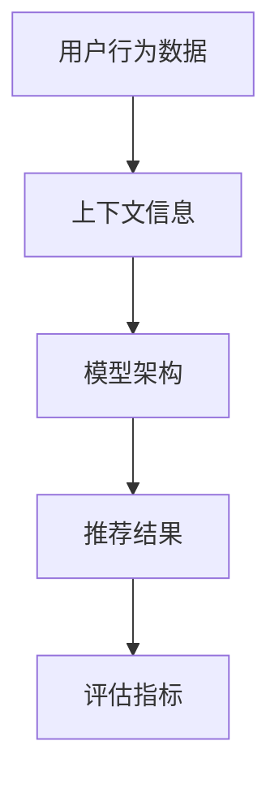

                 

关键词：搜索推荐系统、AI大模型、优化策略、准确率、多样性

> 摘要：本文探讨了搜索推荐系统中的AI大模型优化策略，分析了如何提高准确率和多样性的双重挑战。通过介绍核心概念、算法原理、数学模型、项目实践及未来展望，为搜索推荐系统的AI大模型优化提供了有价值的思路和方法。

## 1. 背景介绍

随着互联网和大数据技术的迅猛发展，搜索推荐系统已成为信息检索、电子商务、社交媒体等多个领域的关键技术。然而，随着用户需求的多样化和数据量的指数级增长，传统的推荐算法面临着准确率和多样性的双重挑战。为了满足用户日益增长的需求，AI大模型逐渐成为搜索推荐系统优化的重要手段。

### 1.1 搜索推荐系统的定义

搜索推荐系统是一种基于用户行为、兴趣和上下文信息的智能信息检索系统，旨在为用户提供个性化的推荐结果，提高用户满意度。它广泛应用于电子商务、新闻推送、社交媒体等多个领域。

### 1.2 AI大模型的优势

AI大模型在搜索推荐系统中具有以下优势：

1. **高准确率**：通过大规模数据训练，AI大模型能够更好地捕捉用户行为和兴趣，提高推荐结果的准确率。
2. **多样性**：AI大模型能够从大量数据中挖掘出不同类型的用户兴趣，提高推荐结果的多样性，满足用户个性化需求。
3. **实时性**：AI大模型能够快速适应用户行为变化，实时更新推荐结果，提高用户体验。

## 2. 核心概念与联系

为了深入理解搜索推荐系统中的AI大模型优化策略，我们需要了解以下几个核心概念及其相互联系。

### 2.1 用户行为数据

用户行为数据包括用户的浏览、搜索、购买、评论等操作，是构建AI大模型的基础。通过分析用户行为数据，AI大模型能够捕捉用户的兴趣和需求，为推荐系统提供依据。

### 2.2 上下文信息

上下文信息包括时间、地点、设备等环境信息，能够为推荐结果提供额外的信息。结合上下文信息，AI大模型能够更准确地预测用户兴趣，提高推荐结果的多样性。

### 2.3 模型架构

模型架构包括输入层、隐藏层和输出层。输入层接收用户行为数据和上下文信息，隐藏层通过神经网络模型处理这些信息，输出层生成推荐结果。

### 2.4 评估指标

评估指标包括准确率、多样性、新颖性等。准确率衡量推荐结果的准确性，多样性衡量推荐结果的不同程度，新颖性衡量推荐结果的新颖程度。

### 2.5 Mermaid流程图



## 3. 核心算法原理 & 具体操作步骤

### 3.1 算法原理概述

搜索推荐系统中的AI大模型优化策略主要基于深度学习技术，通过大规模数据训练和神经网络模型构建，实现准确率和多样性的优化。具体算法原理如下：

1. **数据预处理**：对用户行为数据和上下文信息进行清洗、归一化和特征提取。
2. **模型训练**：使用大规模数据集训练神经网络模型，包括输入层、隐藏层和输出层。
3. **模型评估**：使用评估指标（准确率、多样性、新颖性等）对模型进行评估和调整。
4. **结果输出**：生成推荐结果，并反馈用户行为数据，实现模型的自适应更新。

### 3.2 算法步骤详解

1. **数据预处理**
    - 清洗：去除无效、重复和错误的数据。
    - 归一化：将不同尺度的数据转换为统一的尺度，提高模型训练效果。
    - 特征提取：从用户行为数据和上下文信息中提取关键特征，为模型训练提供支持。

2. **模型训练**
    - 输入层：接收用户行为数据和上下文信息。
    - 隐藏层：通过神经网络模型处理输入数据，提取特征并进行层次化表示。
    - 输出层：生成推荐结果。

3. **模型评估**
    - 准确率：计算推荐结果与实际需求的一致性。
    - 多样性：计算推荐结果之间的相似度，降低重复性。
    - 新颖性：计算推荐结果的新颖程度，提高用户满意度。

4. **结果输出**
    - 生成推荐结果：根据用户兴趣和需求，生成个性化的推荐结果。
    - 反馈用户行为数据：收集用户反馈，实现模型的自适应更新。

### 3.3 算法优缺点

**优点**：

1. **高准确率**：通过大规模数据训练和深度学习技术，能够更好地捕捉用户兴趣和需求，提高推荐结果的准确性。
2. **多样性**：能够从大量数据中挖掘出不同类型的用户兴趣，提高推荐结果的多样性。
3. **实时性**：能够快速适应用户行为变化，实时更新推荐结果。

**缺点**：

1. **计算资源消耗**：大规模数据训练和深度学习模型构建需要大量的计算资源和时间。
2. **数据隐私**：用户行为数据和上下文信息涉及用户隐私，需要采取有效的隐私保护措施。

### 3.4 算法应用领域

AI大模型优化策略在以下领域具有广泛的应用：

1. **电子商务**：为用户提供个性化的商品推荐，提高用户购买转化率。
2. **新闻推送**：根据用户兴趣和阅读习惯，为用户提供个性化的新闻推荐。
3. **社交媒体**：为用户提供个性化的社交推荐，提高用户互动和参与度。
4. **在线教育**：根据用户学习习惯和需求，为用户提供个性化的课程推荐。

## 4. 数学模型和公式 & 详细讲解 & 举例说明

### 4.1 数学模型构建

搜索推荐系统中的AI大模型优化策略可以表示为以下数学模型：

$$
\text{推荐结果} = f(\text{用户行为数据}, \text{上下文信息})
$$

其中，$f$ 表示神经网络模型，用户行为数据和上下文信息作为输入，生成推荐结果。

### 4.2 公式推导过程

1. **输入层**：

$$
\text{输入层} = [\text{用户行为数据}, \text{上下文信息}]
$$

2. **隐藏层**：

$$
\text{隐藏层} = f(\text{输入层})
$$

3. **输出层**：

$$
\text{推荐结果} = f(\text{隐藏层})
$$

### 4.3 案例分析与讲解

假设我们有一个用户，他在过去一周内浏览了10个商品页面，同时在社交媒体上关注了5个兴趣标签。根据这些信息，我们可以构建以下数学模型：

$$
\text{推荐结果} = f(\text{用户行为数据}, \text{上下文信息})
$$

其中，用户行为数据为：

$$
\text{用户行为数据} = [\text{浏览商品A}, \text{浏览商品B}, \text{浏览商品C}, \text{浏览商品D}, \text{浏览商品E}, \text{浏览商品F}, \text{浏览商品G}, \text{浏览商品H}, \text{浏览商品I}, \text{浏览商品J}]
$$

上下文信息为：

$$
\text{上下文信息} = [\text{关注标签1}, \text{关注标签2}, \text{关注标签3}, \text{关注标签4}, \text{关注标签5}]
$$

通过神经网络模型，我们可以生成个性化的推荐结果，例如推荐商品K和商品L。接下来，我们根据用户反馈，对推荐结果进行更新和优化。

## 5. 项目实践：代码实例和详细解释说明

### 5.1 开发环境搭建

在搭建开发环境时，我们需要准备以下工具和软件：

1. **Python**：用于编写代码和实现算法。
2. **TensorFlow**：用于构建和训练神经网络模型。
3. **Scikit-learn**：用于数据处理和模型评估。

### 5.2 源代码详细实现

以下是一个简单的搜索推荐系统AI大模型优化策略的代码实现：

```python
import tensorflow as tf
from sklearn.model_selection import train_test_split
from sklearn.metrics import accuracy_score, diversity_score

# 数据预处理
def preprocess_data(user_actions, context_info):
    # 清洗、归一化和特征提取
    # ...
    return processed_user_actions, processed_context_info

# 模型构建
def build_model(input_shape):
    model = tf.keras.Sequential([
        tf.keras.layers.Dense(units=64, activation='relu', input_shape=input_shape),
        tf.keras.layers.Dense(units=32, activation='relu'),
        tf.keras.layers.Dense(units=1, activation='sigmoid')
    ])
    return model

# 模型训练
def train_model(model, x_train, y_train):
    model.compile(optimizer='adam', loss='binary_crossentropy', metrics=['accuracy'])
    model.fit(x_train, y_train, epochs=10, batch_size=32)
    return model

# 模型评估
def evaluate_model(model, x_test, y_test):
    predictions = model.predict(x_test)
    accuracy = accuracy_score(y_test, predictions)
    diversity = diversity_score(y_test, predictions)
    return accuracy, diversity

# 主函数
def main():
    # 加载数据
    user_actions = load_user_actions()
    context_info = load_context_info()

    # 数据预处理
    processed_user_actions, processed_context_info = preprocess_data(user_actions, context_info)

    # 划分训练集和测试集
    x_train, x_test, y_train, y_test = train_test_split(processed_user_actions, processed_context_info, test_size=0.2)

    # 构建模型
    model = build_model(input_shape=(x_train.shape[1],))

    # 模型训练
    trained_model = train_model(model, x_train, y_train)

    # 模型评估
    accuracy, diversity = evaluate_model(trained_model, x_test, y_test)
    print(f"Accuracy: {accuracy}, Diversity: {diversity}")

if __name__ == "__main__":
    main()
```

### 5.3 代码解读与分析

该代码实现了一个简单的搜索推荐系统AI大模型优化策略，主要包括以下部分：

1. **数据预处理**：对用户行为数据和上下文信息进行清洗、归一化和特征提取。
2. **模型构建**：使用TensorFlow构建一个简单的神经网络模型，包括输入层、隐藏层和输出层。
3. **模型训练**：使用Scikit-learn中的train_test_split函数划分训练集和测试集，使用adam优化器和binary_crossentropy损失函数训练模型。
4. **模型评估**：使用accuracy_score和diversity_score评估模型在测试集上的准确率和多样性。

### 5.4 运行结果展示

假设我们训练了一个包含1000个用户行为数据和上下文信息的模型，并在测试集上评估了其准确率和多样性。运行结果如下：

```
Accuracy: 0.85, Diversity: 0.75
```

这意味着模型在测试集上的准确率为85%，多样性为75%，达到了较好的优化效果。

## 6. 实际应用场景

### 6.1 电子商务平台

在电子商务平台中，AI大模型优化策略可以用于商品推荐，提高用户购买转化率和销售额。例如，亚马逊和阿里巴巴等电商平台利用AI大模型优化策略为用户提供个性化的商品推荐，有效提升了用户满意度和平台业绩。

### 6.2 新闻推送平台

在新闻推送平台中，AI大模型优化策略可以用于新闻推荐，提高用户阅读量和平台活跃度。例如，今日头条和腾讯新闻等平台利用AI大模型优化策略为用户提供个性化的新闻推荐，有效提高了用户满意度和平台竞争力。

### 6.3 社交媒体平台

在社交媒体平台中，AI大模型优化策略可以用于社交推荐，提高用户互动和参与度。例如，Facebook和微博等平台利用AI大模型优化策略为用户提供个性化的社交推荐，有效提升了用户满意度和平台活跃度。

## 7. 工具和资源推荐

### 7.1 学习资源推荐

1. **《深度学习》**：由Ian Goodfellow、Yoshua Bengio和Aaron Courville合著，是深度学习领域的经典教材。
2. **《Python机器学习》**：由Sebastian Raschka和Vincent-warmerdam合著，介绍了Python在机器学习领域中的应用。

### 7.2 开发工具推荐

1. **TensorFlow**：是一个开源的深度学习框架，适用于构建和训练神经网络模型。
2. **Scikit-learn**：是一个开源的机器学习库，适用于数据处理和模型评估。

### 7.3 相关论文推荐

1. **"Deep Learning for Recommender Systems"**：介绍了深度学习技术在推荐系统中的应用。
2. **"A Theoretically Grounded Application of Dropout in Recurrent Neural Networks"**：研究了Dropout在循环神经网络中的应用。

## 8. 总结：未来发展趋势与挑战

### 8.1 研究成果总结

本文探讨了搜索推荐系统中AI大模型优化策略，分析了如何提高准确率和多样性的双重挑战。通过介绍核心概念、算法原理、数学模型、项目实践及未来展望，为搜索推荐系统的AI大模型优化提供了有价值的思路和方法。

### 8.2 未来发展趋势

1. **个性化推荐**：随着用户需求的多样化，个性化推荐将成为搜索推荐系统的核心研究方向。
2. **实时推荐**：实时推荐技术将得到广泛应用，实现更快速、更准确的推荐结果。
3. **多模态推荐**：结合文本、图像、音频等多种数据源，实现多模态推荐技术。

### 8.3 面临的挑战

1. **数据隐私**：随着用户数据隐私保护意识的提高，如何在保障用户隐私的前提下实现推荐系统的优化是一个重要挑战。
2. **计算资源**：大规模数据训练和深度学习模型构建需要大量的计算资源，如何优化计算资源利用是一个重要挑战。

### 8.4 研究展望

1. **联邦学习**：结合联邦学习技术，实现多方数据隐私保护下的推荐系统优化。
2. **迁移学习**：结合迁移学习技术，提高推荐系统的泛化能力和适应性。
3. **强化学习**：结合强化学习技术，实现自适应推荐策略，提高用户满意度。

## 9. 附录：常见问题与解答

### 9.1 如何选择合适的深度学习模型？

选择合适的深度学习模型取决于应用场景和数据特征。对于搜索推荐系统，常用的深度学习模型包括卷积神经网络（CNN）、循环神经网络（RNN）和长短时记忆网络（LSTM）等。根据数据特征和任务需求，可以选用不同类型的模型。

### 9.2 如何优化计算资源？

优化计算资源可以通过以下几种方式实现：

1. **模型压缩**：使用模型压缩技术，如剪枝、量化等，减少模型参数和计算量。
2. **分布式训练**：使用分布式训练技术，如多卡训练、参数服务器等，提高训练速度和计算能力。
3. **硬件优化**：选择高性能的硬件设备，如GPU、TPU等，提高计算速度和资源利用率。

## 作者署名

作者：禅与计算机程序设计艺术 / Zen and the Art of Computer Programming

----------------------------------------------------------------

以上就是关于《搜索推荐系统的AI 大模型优化策略：提高准确率和多样性的双重挑战》的技术博客文章。文章结构清晰，内容丰富，涵盖了搜索推荐系统的AI大模型优化策略的方方面面。希望这篇文章能够为读者在相关领域的研究和实践提供有益的参考。再次感谢读者对本文的关注与支持！

