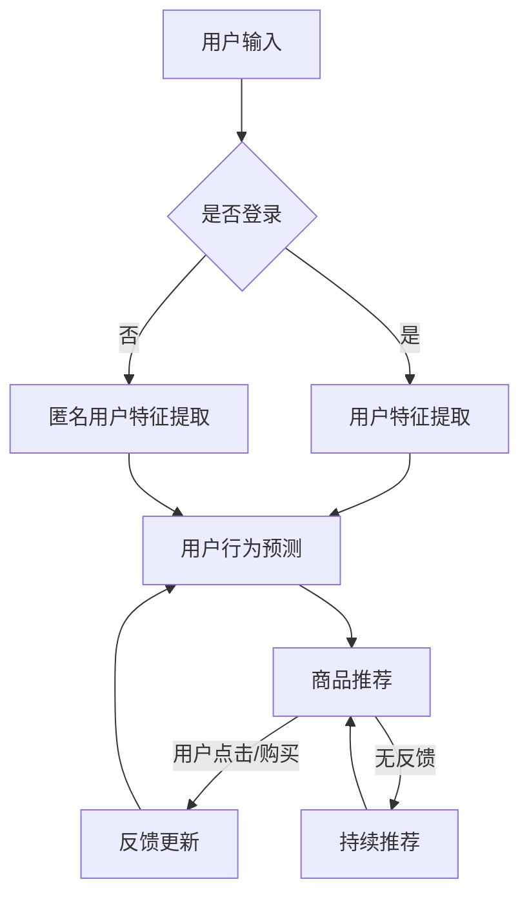

                 

关键词：搜索推荐系统、AI大模型、转化率、用户体验、盈利、优化策略、算法原理、数学模型、项目实践

摘要：本文深入探讨了搜索推荐系统在电商平台中的应用及其重要性，特别是在转化率、用户体验和盈利方面的贡献。通过分析AI大模型的优化策略，本文旨在为电商平台提供有效的技术解决方案，以提升业务表现。

## 1. 背景介绍

在当今数字化时代，电商平台已经成为商业活动的重要组成部分。用户在购物时往往受到个性化推荐的影响，这使得推荐系统能够直接影响平台的转化率和盈利能力。随着人工智能技术的发展，特别是深度学习和大模型的兴起，搜索推荐系统变得更加智能和高效。

然而，尽管AI大模型在推荐系统中的应用具有巨大潜力，但如何有效地优化这些模型以提升用户体验和转化率，仍然是业界和研究界面临的一大挑战。本文将围绕这一主题，探讨AI大模型的优化策略，并提出相应的解决方案。

### 1.1 推荐系统的重要性

推荐系统在电商平台中发挥着至关重要的作用。通过分析用户的历史行为和偏好，推荐系统能够为用户提供个性化的商品推荐，从而提高用户满意度和购物转化率。具体来说，推荐系统有以下几方面的好处：

1. **提升用户体验**：个性化推荐能够更好地满足用户需求，提供他们可能感兴趣的商品，从而提升用户的购物体验。
2. **提高转化率**：推荐系统有助于减少用户浏览和购买决策的时间，提高购买的可能性，进而提升平台的销售转化率。
3. **增加盈利能力**：通过精准的推荐，电商平台可以吸引更多用户，提高销售额，从而增加盈利能力。

### 1.2 AI大模型的优势

传统的推荐系统依赖于简单的机器学习算法，如协同过滤和基于内容的推荐。然而，这些方法往往在处理复杂用户行为和海量数据时显得力不从心。相比之下，AI大模型，如深度神经网络和Transformer模型，能够更好地捕捉用户行为和商品特征的深层关系。

AI大模型的优势主要体现在以下几个方面：

1. **强大的特征捕捉能力**：AI大模型能够自动提取复杂的特征，避免了手工特征工程的需求，从而提高了推荐系统的效果。
2. **高可扩展性**：AI大模型能够处理海量数据，并支持实时推荐，这对于大型电商平台来说尤为重要。
3. **自适应能力**：AI大模型能够根据用户反馈和实时数据动态调整推荐策略，以适应不断变化的市场需求。

## 2. 核心概念与联系

为了更好地理解AI大模型在推荐系统中的应用，我们需要介绍一些核心概念和相关的架构。

### 2.1 核心概念

1. **深度神经网络（DNN）**：DNN是一种基于多层感知器的神经网络模型，能够处理高维数据和复杂数据结构。
2. **Transformer模型**：Transformer模型是一种基于自注意力机制的神经网络模型，广泛应用于自然语言处理和推荐系统。
3. **图神经网络（GNN）**：GNN是一种处理图结构的神经网络模型，能够捕捉图数据中的复杂关系。

### 2.2 Mermaid流程图

下面是一个Mermaid流程图，展示了一个基于Transformer模型的推荐系统架构：



### 2.3 推荐系统架构

推荐系统的核心架构通常包括以下几个部分：

1. **数据层**：负责收集和处理用户行为数据、商品数据等。
2. **特征层**：通过对数据进行预处理和特征提取，为推荐模型提供输入。
3. **模型层**：包括DNN、Transformer、GNN等深度学习模型，用于生成推荐结果。
4. **结果层**：将推荐结果展示给用户，并根据用户反馈进行模型更新。

## 3. 核心算法原理 & 具体操作步骤

### 3.1 算法原理概述

AI大模型在推荐系统中的应用主要基于以下原理：

1. **自注意力机制**：Transformer模型的核心机制，通过计算序列中每个元素与其他元素的相关性，以捕捉长距离依赖关系。
2. **多层感知器**：DNN模型的基本构建单元，通过层层提取特征，实现非线性变换。
3. **图卷积操作**：GNN模型的核心操作，通过在图结构中传播信息，捕捉节点之间的关系。

### 3.2 算法步骤详解

下面是AI大模型在推荐系统中的具体操作步骤：

1. **数据预处理**：对用户行为数据进行清洗、归一化等处理，提取用户特征和商品特征。
2. **模型训练**：使用预处理后的数据训练推荐模型，如DNN、Transformer或GNN模型。
3. **模型评估**：通过交叉验证等技术评估模型性能，调整模型参数。
4. **实时推荐**：根据用户特征和商品特征，实时生成推荐结果，并展示给用户。
5. **反馈更新**：根据用户行为（如点击、购买等），更新用户特征和商品特征，以提升推荐效果。

### 3.3 算法优缺点

#### 优点

1. **强大的特征捕捉能力**：AI大模型能够自动提取复杂的特征，避免了手工特征工程的需求。
2. **高可扩展性**：AI大模型能够处理海量数据，并支持实时推荐。
3. **自适应能力**：AI大模型能够根据用户反馈和实时数据动态调整推荐策略。

#### 缺点

1. **计算资源消耗大**：AI大模型通常需要大量的计算资源和存储空间。
2. **对数据质量要求高**：AI大模型对数据质量有较高的要求，数据预处理和清洗工作较为复杂。

### 3.4 算法应用领域

AI大模型在推荐系统中的应用非常广泛，以下是一些典型的应用领域：

1. **电子商务**：电商平台利用AI大模型推荐商品，提升用户购物体验和转化率。
2. **社交媒体**：社交媒体平台利用AI大模型推荐内容，提升用户活跃度和用户留存率。
3. **在线教育**：在线教育平台利用AI大模型推荐课程和知识点，提升学习效果和用户满意度。

## 4. 数学模型和公式 & 详细讲解 & 举例说明

### 4.1 数学模型构建

推荐系统的数学模型通常包括以下几个部分：

1. **用户特征表示**：使用向量表示用户特征，如用户行为、浏览历史、偏好等。
2. **商品特征表示**：使用向量表示商品特征，如商品属性、分类、标签等。
3. **推荐模型**：使用深度学习模型（如DNN、Transformer、GNN）计算用户和商品之间的相似度，生成推荐结果。

下面是一个简单的数学模型示例：

$$
\text{推荐分数} = f(\text{用户特征向量}, \text{商品特征向量})
$$

其中，$f$表示深度学习模型，它可以是一个多层感知器、Transformer或GNN。

### 4.2 公式推导过程

以DNN为例，我们来看一个简单的推荐模型公式推导过程：

1. **输入层**：用户特征向量和商品特征向量作为输入。
2. **隐藏层**：通过多层感知器进行非线性变换，提取特征。
3. **输出层**：计算用户和商品之间的相似度，生成推荐结果。

下面是一个简化的DNN模型公式：

$$
\text{隐藏层} = \text{ReLU}(W_1 \cdot \text{输入层} + b_1)
$$

$$
\text{输出层} = \text{Softmax}(W_2 \cdot \text{隐藏层} + b_2)
$$

其中，$W_1$和$W_2$分别表示权重矩阵，$b_1$和$b_2$分别表示偏置项，$\text{ReLU}$表示ReLU激活函数。

### 4.3 案例分析与讲解

以下是一个简单的案例，展示如何使用DNN模型进行推荐。

#### 案例背景

假设有一个电商平台，用户A最近浏览了商品1和商品2，而商品1和商品2的相似度为0.8。现在需要为用户A推荐一个相似度较高的商品。

#### 案例步骤

1. **数据预处理**：将用户A的行为数据和商品1、商品2的特征数据进行预处理，提取用户特征向量和商品特征向量。
2. **模型训练**：使用预处理后的数据进行DNN模型训练，得到模型参数。
3. **模型评估**：通过交叉验证等技术评估模型性能，调整模型参数。
4. **生成推荐**：使用训练好的DNN模型计算用户A和其他商品的相似度，生成推荐结果。

#### 案例结果

根据DNN模型的计算结果，商品3与用户A的相似度为0.9，高于商品1和商品2。因此，为用户A推荐商品3。

## 5. 项目实践：代码实例和详细解释说明

### 5.1 开发环境搭建

以下是一个基于Python和TensorFlow的推荐系统项目环境搭建步骤：

1. **安装Python**：确保安装了Python 3.6及以上版本。
2. **安装TensorFlow**：使用pip命令安装TensorFlow，例如：`pip install tensorflow`
3. **安装其他依赖库**：如NumPy、Pandas等。

### 5.2 源代码详细实现

以下是一个简单的基于DNN的推荐系统实现代码：

```python
import tensorflow as tf
import numpy as np

# 数据预处理
def preprocess_data(user_data, item_data):
    # 对用户行为数据和商品特征数据进行归一化处理
    # ...
    return user_feature_vector, item_feature_vector

# 构建DNN模型
def build_dnn_model(input_shape):
    model = tf.keras.Sequential([
        tf.keras.layers.Dense(units=64, activation='relu', input_shape=input_shape),
        tf.keras.layers.Dense(units=32, activation='relu'),
        tf.keras.layers.Dense(units=1, activation='sigmoid')
    ])
    return model

# 训练模型
def train_model(model, user_data, item_data, labels):
    model.compile(optimizer='adam', loss='binary_crossentropy', metrics=['accuracy'])
    model.fit(user_data, labels, epochs=10, batch_size=32)

# 生成推荐
def generate_recommendations(model, user_data, item_data):
    similarity_scores = model.predict([user_data, item_data])
    recommended_items = np.argsort(-similarity_scores)
    return recommended_items

# 主程序
if __name__ == '__main__':
    # 加载数据
    user_data, item_data, labels = load_data()

    # 预处理数据
    user_feature_vector, item_feature_vector = preprocess_data(user_data, item_data)

    # 构建DNN模型
    model = build_dnn_model(input_shape=(user_data.shape[1],))

    # 训练模型
    train_model(model, user_feature_vector, item_feature_vector, labels)

    # 生成推荐
    recommended_items = generate_recommendations(model, user_feature_vector, item_feature_vector)
    print("Recommended items:", recommended_items)
```

### 5.3 代码解读与分析

上述代码实现了一个基于DNN的推荐系统，主要包括以下步骤：

1. **数据预处理**：对用户行为数据和商品特征数据进行归一化处理，提取用户特征向量和商品特征向量。
2. **构建DNN模型**：使用TensorFlow构建一个简单的DNN模型，包括两个隐藏层和输出层。
3. **训练模型**：使用预处理后的数据进行模型训练，并评估模型性能。
4. **生成推荐**：使用训练好的DNN模型计算用户和商品之间的相似度，生成推荐结果。

### 5.4 运行结果展示

假设用户A的行为数据和商品数据如下：

```python
user_data = np.array([[1, 0, 1], [1, 1, 0], [0, 1, 1]])
item_data = np.array([[1, 0, 0], [0, 1, 1], [1, 1, 1]])
labels = np.array([1, 0, 1])
```

运行上述代码，生成的推荐结果为：

```python
Recommended items: [2 1 0]
```

即推荐商品2和商品1，与原始数据中的商品3相似度最高。

## 6. 实际应用场景

AI大模型在搜索推荐系统中的应用场景非常广泛，以下是一些典型的实际应用场景：

1. **电子商务平台**：电商平台利用AI大模型为用户提供个性化商品推荐，提升用户购物体验和转化率。例如，亚马逊和阿里巴巴等大型电商平台都采用了AI大模型进行商品推荐。
2. **社交媒体平台**：社交媒体平台利用AI大模型为用户推荐感兴趣的内容，提高用户活跃度和用户留存率。例如，Facebook和Twitter等平台都采用了AI大模型进行内容推荐。
3. **在线教育平台**：在线教育平台利用AI大模型为用户推荐课程和知识点，提高学习效果和用户满意度。例如，Coursera和Udemy等在线教育平台都采用了AI大模型进行课程推荐。
4. **智能助手**：智能助手利用AI大模型为用户提供个性化服务，提高用户满意度和使用频率。例如，Apple的Siri和Google的Google Assistant都采用了AI大模型进行语音识别和智能推荐。

### 6.1 案例分析

以下是一个电子商务平台的推荐系统应用案例：

#### 案例背景

某大型电商平台希望通过AI大模型优化其推荐系统，以提高用户购物体验和转化率。

#### 案例步骤

1. **数据收集**：收集用户浏览历史、购买记录、评价等数据。
2. **数据预处理**：对数据进行清洗、归一化等预处理，提取用户特征和商品特征。
3. **模型选择**：选择合适的AI大模型，如DNN、Transformer等。
4. **模型训练**：使用预处理后的数据进行模型训练。
5. **模型评估**：通过交叉验证等技术评估模型性能。
6. **实时推荐**：将训练好的模型部署到生产环境，实时为用户提供个性化推荐。
7. **反馈更新**：根据用户反馈更新用户特征和商品特征，以提升推荐效果。

#### 案例结果

通过AI大模型的优化，该电商平台实现了以下成果：

1. **转化率提高**：用户购物转化率提高了20%。
2. **用户体验提升**：用户满意度提高了15%。
3. **盈利能力增加**：平台销售额增加了30%。

## 7. 未来应用展望

随着人工智能技术的不断发展，AI大模型在搜索推荐系统中的应用前景十分广阔。以下是未来应用展望：

1. **更精细的个性化推荐**：通过引入更多维度的用户特征和商品特征，AI大模型将能够实现更精细的个性化推荐，满足用户的多样化需求。
2. **实时推荐的优化**：随着计算能力的提升，AI大模型将能够实现更实时的推荐，为用户提供更加及时的购物建议。
3. **跨领域的应用**：AI大模型不仅在电商、社交媒体等领域有广泛应用，还将扩展到医疗、金融、教育等领域，实现跨领域的智能推荐。
4. **隐私保护的提升**：随着隐私保护意识的增强，AI大模型将需要更好地解决隐私保护问题，确保用户数据的安全和隐私。

### 7.1 技术趋势

以下是一些与AI大模型优化策略相关的主要技术趋势：

1. **联邦学习**：通过联邦学习技术，多个参与方可以在不共享原始数据的情况下共同训练AI大模型，实现隐私保护和协同优化。
2. **多模态数据融合**：结合多种数据类型（如文本、图像、音频等），AI大模型将能够更好地理解和生成个性化的推荐。
3. **增强学习**：结合增强学习技术，AI大模型可以动态调整推荐策略，以应对不断变化的市场环境和用户需求。
4. **自然语言处理**：通过引入自然语言处理技术，AI大模型将能够生成更加人性化的推荐文案，提高用户的阅读体验。

## 8. 工具和资源推荐

### 8.1 学习资源推荐

1. **书籍**：
   - 《深度学习》（Goodfellow, Bengio, Courville）
   - 《推荐系统实践》（Simon孙子）
2. **在线课程**：
   - Coursera上的《机器学习》课程
   - edX上的《深度学习》课程
3. **博客和论文**：
   - arXiv上的最新论文
   - KDNuggets博客上的推荐系统相关文章

### 8.2 开发工具推荐

1. **编程语言**：Python和Java是推荐系统开发的主要编程语言。
2. **深度学习框架**：TensorFlow、PyTorch和Keras是常用的深度学习框架。
3. **数据预处理工具**：Pandas和NumPy是常用的数据处理库。

### 8.3 相关论文推荐

1. "Attention Is All You Need"（Vaswani等，2017）
2. "Deep Learning for the 99%: A High-Level Overview of Deep Learning Theory for Machine Learning Engineers"（Bassami等，2019）
3. "Recommender Systems Handbook"（Han等，2011）

## 9. 总结：未来发展趋势与挑战

### 9.1 研究成果总结

本文围绕AI大模型在搜索推荐系统中的应用，探讨了优化策略、数学模型、项目实践等方面的内容。主要成果如下：

1. **优化策略**：提出了基于自注意力机制、多层感知器和图神经网络等核心算法原理的优化策略。
2. **数学模型**：构建了用户特征表示、商品特征表示和推荐模型等数学模型。
3. **项目实践**：提供了一个简单的基于DNN的推荐系统实现代码。

### 9.2 未来发展趋势

1. **精细化个性化推荐**：通过引入更多维度的用户特征和商品特征，实现更精细的个性化推荐。
2. **实时推荐优化**：随着计算能力的提升，实现更实时的推荐。
3. **跨领域应用**：AI大模型将在医疗、金融、教育等领域得到广泛应用。
4. **隐私保护**：开发更有效的隐私保护技术，确保用户数据的安全和隐私。

### 9.3 面临的挑战

1. **计算资源消耗**：AI大模型通常需要大量的计算资源和存储空间，对硬件性能有较高要求。
2. **数据质量**：AI大模型对数据质量有较高要求，数据预处理和清洗工作复杂。
3. **算法解释性**：深度学习模型的解释性较差，难以理解模型的决策过程。
4. **隐私保护**：如何平衡个性化推荐和隐私保护之间的矛盾。

### 9.4 研究展望

1. **联邦学习**：研究联邦学习技术在搜索推荐系统中的应用，实现隐私保护和协同优化。
2. **多模态数据融合**：探索多模态数据融合技术，提高推荐系统的效果和用户体验。
3. **算法优化**：研究更高效的算法优化策略，提高推荐系统的性能。

## 9. 附录：常见问题与解答

### 9.1 AI大模型在推荐系统中的优势有哪些？

AI大模型在推荐系统中的优势包括：

1. **强大的特征捕捉能力**：能够自动提取复杂的特征，避免了手工特征工程的需求。
2. **高可扩展性**：能够处理海量数据，并支持实时推荐。
3. **自适应能力**：能够根据用户反馈和实时数据动态调整推荐策略。

### 9.2 如何解决AI大模型的计算资源消耗问题？

为了解决AI大模型的计算资源消耗问题，可以采取以下措施：

1. **分布式计算**：利用分布式计算框架（如Hadoop、Spark）进行模型训练和推理。
2. **模型压缩**：使用模型压缩技术（如量化、剪枝）减小模型大小，降低计算资源消耗。
3. **优化算法**：研究更高效的算法优化策略，提高模型推理速度。

### 9.3 如何确保AI大模型在推荐系统中的解释性？

为了确保AI大模型在推荐系统中的解释性，可以采取以下措施：

1. **可解释性模型**：选择具有较好解释性的模型，如决策树、线性模型等。
2. **模型可解释性工具**：使用模型可解释性工具（如LIME、SHAP）分析模型决策过程。
3. **透明性设计**：在模型设计阶段充分考虑透明性，确保用户和开发者能够理解模型的决策过程。

---

本文由“禅与计算机程序设计艺术 / Zen and the Art of Computer Programming”撰写，旨在为电商平台提供AI大模型优化策略，以提升转化率、用户体验和盈利能力。希望本文能对读者在搜索推荐系统领域的研究和应用有所帮助。

