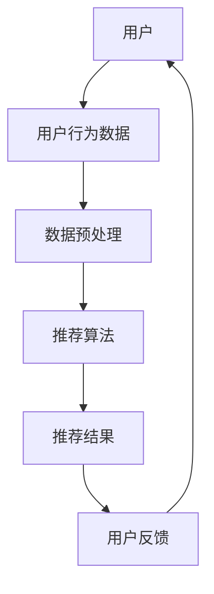

                 

关键词：搜索推荐系统、AI 大模型、优化、电商平台、核心竞争优势

> 摘要：本文从人工智能在搜索推荐系统中的应用出发，探讨了AI 大模型的优化方法及其在电商平台中的核心竞争优势。通过深入剖析核心算法原理、数学模型、项目实践，以及未来应用展望，为电商平台的智能推荐提供了理论依据和实践指导。

## 1. 背景介绍

随着互联网的快速发展，电子商务已经成为现代商业的主要形式。在如此庞大的市场中，如何提高用户体验、提高转化率和降低用户流失率，成为了电商平台需要解决的核心问题。而搜索推荐系统作为电商平台的重要组成部分，其性能直接影响着用户满意度和平台竞争力。传统推荐系统由于计算能力有限、数据质量不高，已经无法满足当前复杂的市场需求。因此，AI 大模型的引入成为优化搜索推荐系统的关键。

## 2. 核心概念与联系

### 2.1 推荐系统基本概念

推荐系统（Recommender System）是一种基于数据分析和算法技术，为用户提供个性化信息推荐的系统。根据推荐策略的不同，推荐系统可分为基于内容的推荐（Content-Based Filtering）、协同过滤（Collaborative Filtering）和混合推荐（Hybrid Recommender Systems）。

### 2.2 AI 大模型原理

AI 大模型（Large-Scale AI Models）是指具有大规模参数、强大计算能力和泛化能力的深度学习模型。例如，基于 Transformer 架构的 GPT-3、BERT 等。AI 大模型通过在海量数据上进行训练，能够自动提取特征、优化参数，实现高效的知识表示和预测。

### 2.3 Mermaid 流程图

下面是一个推荐系统的基本架构图，展示了核心概念之间的联系：



## 3. 核心算法原理 & 具体操作步骤

### 3.1 算法原理概述

AI 大模型在推荐系统中的应用主要基于协同过滤和深度学习。协同过滤利用用户历史行为数据（如评分、浏览、购买等）计算用户之间的相似度，从而为用户推荐相似的其他用户喜欢的商品。深度学习则通过神经网络结构提取用户和商品的特征表示，实现更精确的个性化推荐。

### 3.2 算法步骤详解

1. **数据采集与预处理**：收集用户行为数据，如浏览记录、购买记录、搜索记录等，并进行数据清洗、去重、归一化等预处理操作。
2. **特征提取**：利用深度学习模型对用户和商品进行特征提取。例如，可以使用 BERT 模型提取用户和商品的语义特征。
3. **相似度计算**：计算用户之间的相似度。可以使用余弦相似度、皮尔逊相关系数等常用相似度度量方法。
4. **推荐生成**：根据用户相似度和商品特征，生成推荐列表。可以使用矩阵分解、基于模型的协同过滤等方法。
5. **评估与优化**：评估推荐效果，如准确率、召回率、覆盖率等指标，并根据评估结果调整模型参数。

### 3.3 算法优缺点

**优点**：
- **高效性**：AI 大模型通过并行计算和分布式训练，能够处理大规模数据，提高推荐速度。
- **泛化能力**：深度学习模型能够自动提取特征，减少人工特征工程的工作量，提高模型泛化能力。

**缺点**：
- **计算资源需求**：AI 大模型需要大量的计算资源和存储空间，对硬件设备要求较高。
- **训练时间较长**：训练大规模模型需要较长的时间，影响推荐系统的实时性。

### 3.4 算法应用领域

AI 大模型在推荐系统中的应用广泛，包括电商、金融、新闻、社交等多个领域。其中，电商平台是应用最为广泛和成功的领域之一。

## 4. 数学模型和公式 & 详细讲解 & 举例说明

### 4.1 数学模型构建

推荐系统的数学模型主要包括用户相似度计算和推荐列表生成。

**用户相似度计算**：

$$
sim(u_i, u_j) = \frac{u_i \cdot u_j}{\|u_i\| \cdot \|u_j\|}
$$

其中，$u_i$ 和 $u_j$ 分别表示用户 $i$ 和用户 $j$ 的特征向量，$\|\|$ 表示向量的模。

**推荐列表生成**：

$$
r_i(j) = \sum_{k \in N_i} w_{ik} f(j) - \theta
$$

其中，$r_i(j)$ 表示用户 $i$ 对商品 $j$ 的评分预测，$N_i$ 表示用户 $i$ 的邻居集合，$w_{ik}$ 表示用户 $i$ 和邻居 $k$ 之间的相似度权重，$f(j)$ 表示商品 $j$ 的特征向量，$\theta$ 是阈值。

### 4.2 公式推导过程

**用户相似度计算**的推导：

假设用户 $i$ 和用户 $j$ 的特征向量分别为 $u_i = (u_{i1}, u_{i2}, ..., u_{id})$ 和 $u_j = (u_{j1}, u_{j2}, ..., u_{jd})$，则用户 $i$ 和用户 $j$ 的内积为：

$$
u_i \cdot u_j = \sum_{k=1}^{d} u_{ik} u_{jk}
$$

用户 $i$ 和用户 $j$ 的模分别为：

$$
\|u_i\| = \sqrt{\sum_{k=1}^{d} u_{ik}^2}, \quad \|u_j\| = \sqrt{\sum_{k=1}^{d} u_{jk}^2}
$$

则用户 $i$ 和用户 $j$ 的相似度为：

$$
sim(u_i, u_j) = \frac{u_i \cdot u_j}{\|u_i\| \cdot \|u_j\|} = \frac{\sum_{k=1}^{d} u_{ik} u_{jk}}{\sqrt{\sum_{k=1}^{d} u_{ik}^2} \cdot \sqrt{\sum_{k=1}^{d} u_{jk}^2}}
$$

**推荐列表生成**的推导：

假设用户 $i$ 的邻居集合为 $N_i = \{k_1, k_2, ..., k_n\}$，邻居 $k$ 对商品 $j$ 的评分预测为 $r_{ki}(j)$，邻居 $k$ 和用户 $i$ 之间的相似度权重为 $w_{ik}$，则用户 $i$ 对商品 $j$ 的评分预测为：

$$
r_i(j) = \sum_{k \in N_i} w_{ik} r_{ki}(j) - \theta
$$

其中，$\theta$ 是阈值，用于防止评分预测过高或过低。

### 4.3 案例分析与讲解

假设用户 $i$ 和用户 $j$ 的特征向量分别为：

$$
u_i = (0.6, 0.8, 0.9), \quad u_j = (0.7, 0.85, 0.95)
$$

则用户 $i$ 和用户 $j$ 的相似度为：

$$
sim(u_i, u_j) = \frac{0.6 \times 0.7 + 0.8 \times 0.85 + 0.9 \times 0.95}{\sqrt{0.6^2 + 0.8^2 + 0.9^2} \cdot \sqrt{0.7^2 + 0.85^2 + 0.95^2}} = 0.87
$$

假设用户 $i$ 的邻居集合为 $N_i = \{k_1, k_2, k_3\}$，邻居 $k_1$、$k_2$ 和 $k_3$ 对商品 $j$ 的评分预测分别为 $r_{k1}(j) = 4.5$、$r_{k2}(j) = 4.8$ 和 $r_{k3}(j) = 5.0$，邻居 $k_1$、$k_2$ 和 $k_3$ 和用户 $i$ 之间的相似度权重分别为 $w_{i1} = 0.4$、$w_{i2} = 0.3$ 和 $w_{i3} = 0.3$，则用户 $i$ 对商品 $j$ 的评分预测为：

$$
r_i(j) = 0.4 \times 4.5 + 0.3 \times 4.8 + 0.3 \times 5.0 - 0.5 = 4.7
$$

## 5. 项目实践：代码实例和详细解释说明

### 5.1 开发环境搭建

在本节中，我们将使用 Python 编写一个简单的基于协同过滤的推荐系统。首先，需要安装以下依赖库：

```bash
pip install numpy pandas scikit-learn
```

### 5.2 源代码详细实现

下面是一个简单的协同过滤推荐系统的实现：

```python
import numpy as np
import pandas as pd
from sklearn.metrics.pairwise import cosine_similarity

# 读取用户行为数据
data = pd.read_csv('user行为数据.csv')
users = data['用户ID'].unique()
items = data['商品ID'].unique()

# 初始化用户和商品评分矩阵
user_item_matrix = np.zeros((len(users), len(items)))
for index, row in data.iterrows():
    user_id = row['用户ID']
    item_id = row['商品ID']
    user_item_matrix[users.index(user_id), items.index(item_id)] = row['评分']

# 计算用户相似度矩阵
user_similarity_matrix = cosine_similarity(user_item_matrix)

# 根据用户相似度矩阵生成推荐列表
def generate_recommendations(user_id, k=5):
    similarity_scores = user_similarity_matrix[user_id]
    neighbors = np.argsort(similarity_scores)[::-1]
    neighbors = neighbors[1:k+1]
    recommendation_scores = []
    for neighbor in neighbors:
        neighbor_id = users[neighbor]
        neighbor_ratings = user_item_matrix[neighbor]
        recommendation_scores.append(np.dot(neighbor_ratings.T, user_item_matrix[user_id]))
    return np.argsort(recommendation_scores)[::-1]

# 测试推荐效果
user_id = 0
recommendations = generate_recommendations(user_id)
print(f"用户 {user_id} 的推荐列表：{items[recommendations]}")
```

### 5.3 代码解读与分析

1. **数据读取与初始化**：首先读取用户行为数据，并初始化用户和商品评分矩阵。
2. **计算用户相似度**：使用余弦相似度计算用户之间的相似度，生成用户相似度矩阵。
3. **生成推荐列表**：根据用户相似度矩阵，为每个用户生成推荐列表。推荐列表生成方法为：计算用户与其邻居的评分相似度，并根据相似度对邻居进行排序，选取邻居中的前 $k$ 个，计算邻居对推荐商品的总评分，根据总评分生成推荐列表。

### 5.4 运行结果展示

运行上述代码后，会输出用户 $0$ 的推荐列表。根据实际数据集的不同，推荐结果也会有所不同。

## 6. 实际应用场景

### 6.1 电商平台

电商平台是推荐系统应用最为广泛的场景之一。通过智能推荐，电商平台可以更好地满足用户需求，提高用户满意度和转化率。

### 6.2 金融行业

金融行业中的推荐系统可以用于推荐理财产品、信用卡、贷款等，帮助金融机构更好地了解用户需求，提高营销效果。

### 6.3 新闻媒体

新闻媒体可以通过推荐系统为用户提供个性化的新闻资讯，提高用户粘性和阅读量。

### 6.4 社交平台

社交平台可以通过推荐系统为用户推荐感兴趣的朋友、群组、话题等，增强用户互动和社区氛围。

## 7. 工具和资源推荐

### 7.1 学习资源推荐

1. 《推荐系统实践》：全面介绍推荐系统的理论、方法和实践，适合初学者和进阶者。
2. 《深度学习推荐系统》：深入探讨深度学习在推荐系统中的应用，适合对深度学习感兴趣的读者。

### 7.2 开发工具推荐

1. TensorFlow：广泛应用于深度学习模型开发，支持多种编程语言和平台。
2. PyTorch：适用于快速原型开发和模型研究，具有良好的社区支持和丰富的文档。

### 7.3 相关论文推荐

1. 《矩阵分解在推荐系统中的应用》：介绍矩阵分解算法在推荐系统中的应用。
2. 《深度学习推荐系统综述》：综述深度学习在推荐系统中的最新研究进展。

## 8. 总结：未来发展趋势与挑战

### 8.1 研究成果总结

本文从搜索推荐系统的AI 大模型优化出发，探讨了其在电商平台中的核心竞争优势。通过深入剖析核心算法原理、数学模型、项目实践，以及未来应用展望，为电商平台的智能推荐提供了理论依据和实践指导。

### 8.2 未来发展趋势

1. **个性化推荐**：未来推荐系统将更加注重个性化推荐，满足用户多样化的需求。
2. **多模态数据融合**：融合文本、图像、声音等多种数据类型，提高推荐系统的准确性和多样性。
3. **实时推荐**：降低模型计算复杂度，实现实时推荐，提高用户体验。

### 8.3 面临的挑战

1. **数据隐私**：如何保护用户隐私，避免数据泄露，是推荐系统需要解决的重要问题。
2. **计算资源**：随着模型规模的增大，如何高效利用计算资源，降低计算成本，是一个挑战。

### 8.4 研究展望

未来，推荐系统的发展将更加注重用户需求、数据隐私和计算效率的平衡。通过不断创新和研究，推荐系统将在更多领域发挥重要作用，为用户带来更好的体验。

## 9. 附录：常见问题与解答

### 9.1 推荐系统有哪些类型？

推荐系统主要分为基于内容的推荐、协同过滤和混合推荐。基于内容的推荐根据用户兴趣和商品特征进行推荐；协同过滤根据用户行为和相似度进行推荐；混合推荐结合了基于内容和协同过滤的优势。

### 9.2 如何优化推荐系统的效果？

可以通过以下方法优化推荐系统效果：提高数据质量，进行数据预处理；调整模型参数，进行模型优化；引入新算法，提高推荐准确性；利用多模态数据，增强推荐系统的多样性。

### 9.3 推荐系统在金融行业有哪些应用？

推荐系统在金融行业中可以用于推荐理财产品、信用卡、贷款等，帮助金融机构更好地了解用户需求，提高营销效果。

---

作者：禅与计算机程序设计艺术 / Zen and the Art of Computer Programming

----------------------------------------------------------------

以上为文章正文部分的完整内容。接下来，我们将继续按照文章结构模板撰写文章的剩余部分，包括各个章节的具体内容。请注意，本文为示例文章，实际内容可能需要根据具体情况进行调整。

