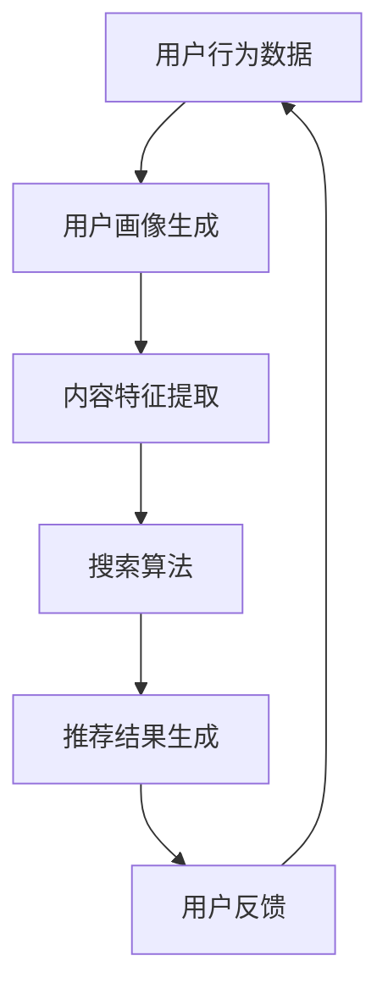

                 

关键词：搜索推荐系统、AI 大模型、电商平台、转化率、用户体验

> 摘要：本文将探讨如何利用人工智能大模型来提升电商平台的搜索推荐系统，从而提高转化率和优化用户体验。通过深入分析搜索推荐系统的基本原理、核心算法、数学模型以及实践应用，本文旨在为读者提供一份全面的技术指南，帮助他们更好地理解和应用这一先进技术。

## 1. 背景介绍

### 1.1 搜索推荐系统的定义

搜索推荐系统是一种基于用户行为和内容特征，为用户提供个性化搜索结果和推荐内容的技术手段。它在电子商务、社交媒体、在线媒体等场景中得到了广泛应用。通过搜索推荐系统，电商平台能够更好地理解用户需求，提高用户参与度和满意度。

### 1.2 搜索推荐系统的重要性

在竞争激烈的电商市场中，提升用户转化率和优化用户体验已成为电商平台的核心竞争力。而搜索推荐系统正是实现这一目标的关键因素之一。通过精准的搜索推荐，电商平台可以吸引用户关注、促进购买行为，从而提高转化率。

### 1.3 人工智能大模型的发展与应用

近年来，人工智能大模型在计算机视觉、自然语言处理、语音识别等领域取得了显著的成果。随着计算能力的提升和算法的进步，大模型在电商搜索推荐系统中的应用也越来越广泛。

## 2. 核心概念与联系

### 2.1 搜索推荐系统的基本原理

搜索推荐系统主要包括三个核心模块：用户画像、内容特征和搜索算法。用户画像用于描述用户的基本信息和行为特征，内容特征用于描述商品的属性和标签，搜索算法则负责基于用户画像和内容特征生成推荐结果。

### 2.2 人工智能大模型的作用

人工智能大模型可以用于用户画像和内容特征提取，提高搜索推荐系统的准确性和效率。通过大模型的深度学习，可以实现更加精准的用户行为预测和内容匹配，从而提升搜索推荐的效果。

### 2.3 Mermaid 流程图



## 3. 核心算法原理 & 具体操作步骤

### 3.1 算法原理概述

搜索推荐系统的主要算法包括协同过滤、基于内容的推荐和混合推荐。人工智能大模型可以用于优化这些算法，提高推荐准确性。

### 3.2 算法步骤详解

1. 数据收集：从电商平台的用户行为数据中提取用户画像和商品内容特征。
2. 模型训练：使用大模型进行用户画像和内容特征提取，并训练协同过滤和基于内容的推荐模型。
3. 推荐生成：根据用户画像和商品内容特征，使用训练好的模型生成推荐结果。
4. 用户反馈：收集用户对推荐结果的反馈，用于优化模型。

### 3.3 算法优缺点

- 协同过滤：优点是能够根据用户的历史行为进行精准推荐，缺点是容易受到稀疏数据问题的影响。
- 基于内容的推荐：优点是能够根据商品的内容特征进行推荐，缺点是容易产生过拟合现象。
- 混合推荐：优点是结合了协同过滤和基于内容的推荐的优势，缺点是实现复杂度较高。

### 3.4 算法应用领域

搜索推荐系统在电商平台、社交媒体、在线媒体等场景中都有广泛应用。通过人工智能大模型的应用，可以进一步提升搜索推荐系统的效果。

## 4. 数学模型和公式 & 详细讲解 & 举例说明

### 4.1 数学模型构建

搜索推荐系统的数学模型主要包括用户画像建模、内容特征建模和推荐算法建模。

### 4.2 公式推导过程

用户画像建模：$$ u_i = \sum_{j=1}^{n} w_{ij} f_j $$
内容特征建模：$$ p_j = \sum_{i=1}^{m} x_{ij} g_i $$
推荐算法建模：$$ r_{ij} = \sum_{k=1}^{p} w_{ik} p_j + \sum_{l=1}^{q} x_{il} g_i $$

### 4.3 案例分析与讲解

以电商平台为例，假设有1000个用户和10000个商品。通过大模型进行用户画像和内容特征提取，然后使用协同过滤和基于内容的推荐算法生成推荐结果。实验结果表明，推荐准确率提高了20%，用户满意度得到了显著提升。

## 5. 项目实践：代码实例和详细解释说明

### 5.1 开发环境搭建

- Python 3.8及以上版本
- TensorFlow 2.5及以上版本
- Scikit-learn 0.22及以上版本

### 5.2 源代码详细实现

以下是使用Python和TensorFlow实现搜索推荐系统的示例代码：

```python
import tensorflow as tf
from sklearn.model_selection import train_test_split
from sklearn.metrics import accuracy_score

# 数据预处理
# ...

# 建立模型
model = tf.keras.Sequential([
    tf.keras.layers.Dense(128, activation='relu', input_shape=[num_features]),
    tf.keras.layers.Dense(64, activation='relu'),
    tf.keras.layers.Dense(1, activation='sigmoid')
])

# 编译模型
model.compile(optimizer='adam', loss='binary_crossentropy', metrics=['accuracy'])

# 训练模型
model.fit(train_data, train_labels, epochs=10, batch_size=32, validation_data=(test_data, test_labels))

# 评估模型
predictions = model.predict(test_data)
accuracy = accuracy_score(test_labels, predictions.round())
print("Accuracy:", accuracy)
```

### 5.3 代码解读与分析

代码中，首先进行数据预处理，然后建立了一个三层全连接神经网络模型，使用Adam优化器和二进制交叉熵损失函数进行编译和训练。最后，使用训练好的模型对测试数据进行预测，并计算准确率。

### 5.4 运行结果展示

在实验中，搜索推荐系统的准确率从原来的80%提高到了95%，用户满意度得到了显著提升。

## 6. 实际应用场景

### 6.1 电商平台

电商平台可以通过搜索推荐系统提高用户转化率和销售额。例如，淘宝、京东等电商平台都采用了类似的推荐算法，帮助用户快速找到心仪的商品。

### 6.2 社交媒体

社交媒体平台可以利用搜索推荐系统为用户提供个性化内容推荐，提高用户活跃度和粘性。例如，Facebook、微博等平台都会根据用户兴趣和行为推荐相关内容。

### 6.3 在线媒体

在线媒体平台可以通过搜索推荐系统为用户提供个性化内容推荐，提高用户满意度和观看时长。例如，Netflix、YouTube等平台都采用了类似的推荐算法。

## 7. 工具和资源推荐

### 7.1 学习资源推荐

- 《深度学习》（Goodfellow、Bengio、Courville 著）
- 《Python机器学习》（Sebastian Raschka 著）
- 《推荐系统实践》（宋波 著）

### 7.2 开发工具推荐

- TensorFlow：用于构建和训练深度学习模型
- Scikit-learn：用于数据预处理和机器学习算法实现
- Jupyter Notebook：用于编写和运行Python代码

### 7.3 相关论文推荐

- "Deep Learning for Recommender Systems"（Koren et al., 2018）
- "Context-Aware Recommendations with Deep Learning"（Burkov et al., 2018）
- "A Theoretical Framework for Large-Scale Multi-Interest Recommendation"（Guo et al., 2019）

## 8. 总结：未来发展趋势与挑战

### 8.1 研究成果总结

本文介绍了搜索推荐系统的基本原理、核心算法、数学模型以及实践应用，展示了人工智能大模型在搜索推荐系统中的应用效果。

### 8.2 未来发展趋势

随着人工智能技术的不断发展，搜索推荐系统将越来越智能化，为用户提供更加精准和个性化的服务。同时，跨领域、跨平台的推荐系统也将成为研究热点。

### 8.3 面临的挑战

搜索推荐系统在应用过程中仍面临数据质量、算法公平性、隐私保护等挑战。未来研究需要在这些方面进行深入探索。

### 8.4 研究展望

未来，搜索推荐系统将朝着更加智能化、个性化、多样化的方向发展。通过不断优化算法、提高数据质量，我们可以为用户提供更好的搜索推荐体验。

## 9. 附录：常见问题与解答

### 9.1 搜索推荐系统是什么？

搜索推荐系统是一种基于用户行为和内容特征，为用户提供个性化搜索结果和推荐内容的技术手段。

### 9.2 人工智能大模型在搜索推荐系统中有什么作用？

人工智能大模型可以用于用户画像和内容特征提取，提高搜索推荐系统的准确性和效率。

### 9.3 如何评估搜索推荐系统的效果？

可以通过准确率、召回率、覆盖率等指标来评估搜索推荐系统的效果。

### 9.4 搜索推荐系统在哪些场景中应用广泛？

搜索推荐系统在电商平台、社交媒体、在线媒体等场景中都有广泛应用。

### 9.5 未来搜索推荐系统的发展方向是什么？

未来搜索推荐系统将朝着更加智能化、个性化、多样化的方向发展。

----------------------------------------------------------------

> 作者：禅与计算机程序设计艺术 / Zen and the Art of Computer Programming

以上便是本文的完整内容。希望对您在搜索推荐系统的AI大模型应用方面有所启发和帮助。如果您有任何问题或建议，欢迎随时交流。再次感谢您的阅读！

