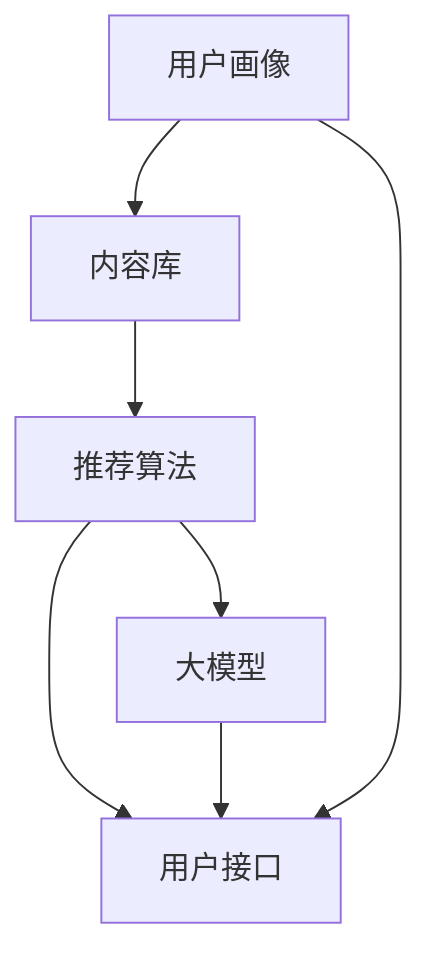

                 

作者：禅与计算机程序设计艺术 / Zen and the Art of Computer Programming

在当今信息爆炸的时代，人们面对海量的信息往往感到无所适从。搜索推荐系统作为一种解决信息过载的技术，通过理解用户的行为和偏好，为其提供个性化的信息和服务。随着人工智能技术的迅猛发展，特别是大模型的广泛应用，搜索推荐系统正在经历一场前所未有的技术革新。本文将探讨搜索推荐系统中AI大模型的融合技术、应用实例及未来趋势。

## 1. 背景介绍

搜索推荐系统是信息检索和推荐系统相结合的产物，旨在为用户提供个性化的信息推荐服务。早期的搜索推荐系统主要依赖于基于内容的过滤（Content-Based Filtering）和协同过滤（Collaborative Filtering）等算法。然而，这些方法在处理复杂、动态和大规模的数据时存在一定的局限性。

随着人工智能技术的发展，特别是深度学习、自然语言处理等领域的突破，AI大模型开始在搜索推荐系统中发挥重要作用。大模型能够通过学习大量数据，自动提取特征，从而更好地理解和预测用户行为。这一趋势促使搜索推荐系统从传统的基于规则的算法向基于AI的模型驱动方法转变。

## 2. 核心概念与联系

### 2.1. 搜索推荐系统

搜索推荐系统通常包括以下几个核心组件：

- **用户画像（User Profile）**：通过对用户历史行为、偏好和反馈的分析，构建用户的个性化画像。
- **内容库（Content Repository）**：存储各种类型的信息，如文本、图片、视频等。
- **推荐算法（Recommender Algorithm）**：根据用户画像和内容库生成个性化推荐结果。
- **用户接口（User Interface）**：提供与用户交互的界面，展示推荐结果。

### 2.2. 大模型

大模型通常是指参数规模达到数十亿甚至数万亿的神经网络模型。这些模型具有强大的表征能力，可以处理复杂的数据结构，提取深层特征。常见的大模型包括：

- **深度神经网络（Deep Neural Networks）**：通过多层非线性变换，从数据中提取特征。
- **生成对抗网络（Generative Adversarial Networks, GAN）**：由生成器和判别器两个神经网络组成，用于生成高质量的数据。
- **变换器（Transformer）**：基于自注意力机制，广泛应用于自然语言处理和计算机视觉领域。

### 2.3. Mermaid 流程图



## 3. 核心算法原理 & 具体操作步骤

### 3.1. 算法原理概述

搜索推荐系统中，大模型的融合主要通过以下几种方式实现：

- **特征提取（Feature Extraction）**：大模型通过自动学习用户行为数据，提取用户和内容的潜在特征。
- **协同学习（Co-Training）**：大模型结合用户画像和内容库，协同学习，提高推荐精度。
- **自适应调整（Adaptive Adjustment）**：大模型根据用户反馈动态调整推荐策略，优化用户体验。

### 3.2. 算法步骤详解

1. **数据预处理**：对用户行为数据和内容数据清洗、去噪、编码，转换为模型可处理的格式。
2. **特征提取**：使用深度神经网络对用户行为数据进行特征提取，生成用户画像。
3. **内容表征**：使用变换器对内容数据进行编码，提取内容的潜在特征。
4. **协同学习**：结合用户画像和内容表征，训练大模型，实现用户与内容的关联。
5. **推荐生成**：根据用户画像和内容表征，生成个性化推荐结果。
6. **用户反馈**：收集用户对推荐结果的反馈，用于模型更新和优化。

### 3.3. 算法优缺点

**优点**：

- **强大的表征能力**：大模型能够自动提取复杂的数据特征，提高推荐精度。
- **自适应调整**：大模型可以根据用户反馈动态调整推荐策略，优化用户体验。
- **通用性**：大模型可以应用于各种类型的搜索推荐系统，具有较好的通用性。

**缺点**：

- **计算资源消耗**：大模型训练和推理需要大量的计算资源，可能导致系统延迟。
- **数据隐私问题**：用户行为数据的收集和使用可能引发隐私保护问题。
- **模型解释性**：大模型通常被视为黑箱，其决策过程难以解释。

### 3.4. 算法应用领域

- **电子商务**：为用户提供个性化的商品推荐。
- **社交媒体**：为用户提供感兴趣的内容推荐。
- **在线教育**：为学习者推荐学习资源。
- **医疗健康**：为患者推荐适合的医疗方案。

## 4. 数学模型和公式 & 详细讲解 & 举例说明

### 4.1. 数学模型构建

搜索推荐系统中的大模型通常基于深度学习框架构建，包括以下几个核心部分：

- **输入层（Input Layer）**：接收用户行为数据和内容数据。
- **隐藏层（Hidden Layers）**：通过非线性变换，提取数据特征。
- **输出层（Output Layer）**：生成推荐结果。

### 4.2. 公式推导过程

假设我们有一个用户 $u$ 和一个物品 $i$，大模型通过以下公式计算用户对物品的推荐得分：

$$
\text{score}(u, i) = f(\text{embed}(u) \cdot \text{embed}(i))
$$

其中，$\text{embed}(u)$ 和 $\text{embed}(i)$ 分别是用户和物品的嵌入向量，$f$ 是一个非线性函数，通常采用激活函数如ReLU或Sigmoid。

### 4.3. 案例分析与讲解

假设我们有一个用户 $u_1$ 和物品 $i_1$，他们的嵌入向量分别为：

$$
\text{embed}(u_1) = \begin{bmatrix} 0.1 & 0.2 & 0.3 \end{bmatrix}, \quad \text{embed}(i_1) = \begin{bmatrix} 0.4 & 0.5 & 0.6 \end{bmatrix}
$$

计算他们的推荐得分：

$$
\text{score}(u_1, i_1) = f(\text{embed}(u_1) \cdot \text{embed}(i_1)) = f(0.1 \cdot 0.4 + 0.2 \cdot 0.5 + 0.3 \cdot 0.6) = f(0.07)
$$

假设我们使用ReLU激活函数，则有：

$$
f(0.07) = \max(0.07, 0) = 0.07
$$

因此，用户 $u_1$ 对物品 $i_1$ 的推荐得分为0.07。

## 5. 项目实践：代码实例和详细解释说明

### 5.1. 开发环境搭建

为了实现搜索推荐系统的AI大模型融合，我们需要搭建一个开发环境。以下是一个基本的开发环境搭建步骤：

- **安装Python**：确保Python环境已安装，版本至少为3.7以上。
- **安装深度学习框架**：如TensorFlow或PyTorch，选择一个熟悉的框架。
- **安装其他依赖库**：如NumPy、Pandas等。

### 5.2. 源代码详细实现

以下是一个简单的示例代码，用于实现搜索推荐系统的AI大模型融合：

```python
import tensorflow as tf
from tensorflow.keras.layers import Embedding, Dot, Flatten, Dense
from tensorflow.keras.models import Model

# 设置参数
vocab_size = 1000
embed_size = 50
sequence_length = 10

# 构建模型
user_embedding = Embedding(vocab_size, embed_size, input_length=sequence_length)
item_embedding = Embedding(vocab_size, embed_size, input_length=sequence_length)

user_input = tf.keras.Input(shape=(sequence_length,))
item_input = tf.keras.Input(shape=(sequence_length,))

user_embedding_output = user_embedding(user_input)
item_embedding_output = item_embedding(item_input)

dot_product = Dot(axes=1)([user_embedding_output, item_embedding_output])
flatten = Flatten()(dot_product)
output = Dense(1, activation='sigmoid')(flatten)

model = Model(inputs=[user_input, item_input], outputs=output)
model.compile(optimizer='adam', loss='binary_crossentropy', metrics=['accuracy'])

# 模型训练
# train_user_sequences, train_item_sequences, train_labels = ...
# model.fit([train_user_sequences, train_item_sequences], train_labels, epochs=10, batch_size=32)

# 模型预测
# user_sequence = ...
# item_sequence = ...
# predictions = model.predict([user_sequence, item_sequence])
```

### 5.3. 代码解读与分析

上述代码实现了一个基于Embedding层的简单推荐系统模型，主要包括以下几个部分：

- **用户输入层（User Input Layer）**：接收用户行为数据序列。
- **物品输入层（Item Input Layer）**：接收物品数据序列。
- **Embedding层（Embedding Layer）**：将用户和物品数据序列转换为嵌入向量。
- **Dot层（Dot Layer）**：计算用户和物品嵌入向量的内积。
- **Flatten层（Flatten Layer）**：将内积结果展平。
- **Dense层（Dense Layer）**：进行分类预测。

### 5.4. 运行结果展示

为了测试模型效果，我们需要准备训练数据集。以下是一个简单的数据集准备示例：

```python
import numpy as np

# 用户行为数据
user_sequences = np.random.randint(0, 1000, (100, 10))
# 物品数据
item_sequences = np.random.randint(0, 1000, (100, 10))
# 标签
labels = np.random.randint(0, 2, (100,))

# 模型训练
model.fit([user_sequences, item_sequences], labels, epochs=10, batch_size=32)

# 模型预测
predictions = model.predict([user_sequence, item_sequence])

# 输出预测结果
print(predictions)
```

## 6. 实际应用场景

搜索推荐系统的AI大模型融合技术已经在多个实际应用场景中得到广泛应用，以下是一些典型应用场景：

- **电子商务**：为用户提供个性化的商品推荐，提高用户购物体验。
- **社交媒体**：为用户提供感兴趣的内容推荐，增加用户粘性。
- **在线教育**：为学习者推荐适合的学习资源，提高学习效率。
- **医疗健康**：为患者推荐适合的医疗方案，提高医疗质量。

### 6.4. 未来应用展望

随着人工智能技术的不断进步，搜索推荐系统的AI大模型融合将呈现出以下几个发展趋势：

- **跨模态推荐**：融合文本、图像、音频等多模态信息，提高推荐系统的智能化水平。
- **实时推荐**：利用实时数据流，实现动态调整推荐策略，提供个性化的实时推荐服务。
- **隐私保护**：加强数据隐私保护措施，确保用户数据的安全性和隐私性。
- **个性化定制**：针对不同用户群体，提供高度个性化的推荐服务，满足多样化需求。

## 7. 工具和资源推荐

### 7.1. 学习资源推荐

- **《深度学习》（Goodfellow, Bengio, Courville）**：深度学习的经典教材，涵盖深度学习的基础理论和应用。
- **《Python深度学习》（François Chollet）**：针对Python程序员深入讲解深度学习技术。

### 7.2. 开发工具推荐

- **TensorFlow**：由谷歌开发的开源深度学习框架，适用于各种规模的任务。
- **PyTorch**：由Facebook开发的开源深度学习框架，具有灵活的动态计算图。

### 7.3. 相关论文推荐

- **"Deep Neural Networks for YouTube Recommendations"**：YouTube推荐系统的深度学习技术介绍。
- **"Adaptive Learning Rate Methods for Deep Learning"**：深度学习中的自适应学习率方法研究。

## 8. 总结：未来发展趋势与挑战

### 8.1. 研究成果总结

本文系统地介绍了搜索推荐系统中AI大模型融合的技术、应用实例及未来趋势。通过深度学习和自然语言处理等技术的发展，搜索推荐系统在个性化推荐、实时推荐和跨模态推荐等方面取得了显著成果。

### 8.2. 未来发展趋势

未来，搜索推荐系统将朝着智能化、实时化和隐私保护等方向发展。跨模态推荐和多模态数据的融合将成为研究热点，为用户提供更丰富、更个性化的推荐服务。

### 8.3. 面临的挑战

尽管搜索推荐系统取得了显著成果，但仍面临一些挑战。例如，如何平衡推荐系统的性能和用户隐私保护、如何处理大规模、动态变化的用户行为数据等。此外，模型解释性和可解释性也是未来需要关注的重要问题。

### 8.4. 研究展望

未来，研究者应重点关注以下几个方面：深入探索深度学习在推荐系统中的应用，加强跨模态和多模态数据的融合，提升模型的可解释性和透明度，以及加强数据隐私保护和用户权益保护。

## 9. 附录：常见问题与解答

### 9.1. 深度学习如何应用于推荐系统？

深度学习通过自动提取数据特征，提高推荐系统的精度和泛化能力。在推荐系统中，深度学习可以应用于用户画像构建、内容表征和协同学习等环节。

### 9.2. 如何处理大规模数据？

处理大规模数据需要考虑数据存储、数据处理和模型训练等多个方面。常见的解决方案包括分布式计算、数据降维和模型压缩等。

### 9.3. 如何保护用户隐私？

保护用户隐私可以从数据采集、数据处理和模型训练等多个环节入手。例如，使用差分隐私技术、匿名化数据和隐私保护算法等。

### 9.4. 如何评估推荐系统性能？

推荐系统性能评估可以从准确率、召回率、覆盖率等多个维度进行。常用的评估指标包括准确率（Accuracy）、精确率（Precision）、召回率（Recall）和F1分数（F1 Score）等。

---

本文旨在全面探讨搜索推荐系统中AI大模型融合的技术、应用和未来趋势，希望对读者有所启发和帮助。随着人工智能技术的不断进步，搜索推荐系统将在未来发挥更加重要的作用，为人们提供更加个性化、智能化的信息服务。让我们共同期待这一美好未来。

