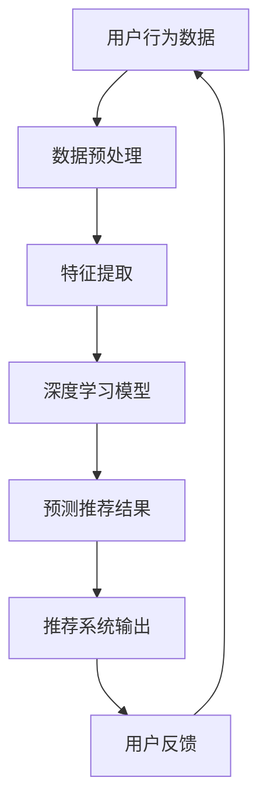

                 

关键词：搜索推荐系统、AI 大模型、融合技术、应用场景、未来趋势

> 摘要：本文将深入探讨搜索推荐系统的AI大模型融合技术，从背景介绍、核心概念与联系、核心算法原理、数学模型与公式、项目实践、实际应用场景、工具和资源推荐、总结与展望等多个方面，系统性地解析这一领域的最新进展、技术挑战及其未来发展趋势，旨在为读者提供全面的技术参考与思考方向。

## 1. 背景介绍

随着互联网的快速发展，信息爆炸的时代已然来临。用户在获取信息时面临的信息过载问题日益严重，如何从海量的数据中快速、准确地找到所需信息成为了一大难题。为了解决这一问题，搜索推荐系统应运而生，成为现代互联网的重要组成部分。

搜索推荐系统旨在通过分析用户的历史行为、兴趣偏好、社交网络等信息，向用户推荐可能感兴趣的内容。传统的推荐系统主要依赖基于内容的过滤、协同过滤等方法，但面对复杂的用户需求和多样化的内容类型时，这些方法逐渐暴露出一定的局限性。

近年来，随着深度学习和大数据技术的快速发展，AI大模型在搜索推荐系统中的应用逐渐成为研究热点。大模型通过学习海量用户数据，能够捕捉到更细微的用户偏好和内容特征，从而提供更精准的推荐结果。然而，AI大模型的融合技术及其在实际应用中的挑战也亟待解决。

本文将从以下几个方面展开讨论：首先，介绍搜索推荐系统的基本概念和常见算法；其次，深入探讨AI大模型融合技术的核心原理和架构；然后，分析核心算法的优缺点和应用领域；接着，详细讲解数学模型和公式的构建与推导过程；随后，通过项目实践展示代码实例和运行结果；进一步，探讨搜索推荐系统的实际应用场景和未来展望；最后，推荐相关工具和资源，并总结研究成果和展望未来发展趋势。

## 2. 核心概念与联系

### 2.1 搜索推荐系统的基本概念

搜索推荐系统是一种基于用户兴趣和行为分析的推荐系统，旨在为用户提供个性化的搜索和推荐服务。其主要目标是从海量的数据中为用户筛选出可能感兴趣的内容。

- **用户行为**：用户在互联网上的行为数据，包括浏览历史、搜索历史、点击行为、购买记录等。
- **内容特征**：包括文本、图片、视频等多媒体内容的特征信息，如关键词、分类标签、情感极性等。
- **推荐结果**：根据用户兴趣和内容特征计算出的推荐结果，如搜索结果、推荐列表等。

### 2.2 常见推荐算法

在搜索推荐系统中，常见的推荐算法主要包括以下几种：

- **基于内容的推荐（Content-based Filtering）**：根据用户的历史偏好和内容特征进行推荐，适用于文本、图片等结构化数据。
- **协同过滤（Collaborative Filtering）**：通过分析用户之间的相似性，预测用户可能感兴趣的内容，适用于大量非结构化数据。
- **混合推荐（Hybrid Recommender Systems）**：结合多种推荐算法的优势，提高推荐系统的准确性和多样性。

### 2.3 AI大模型融合技术的核心原理和架构

AI大模型融合技术主要基于深度学习和大数据技术，通过学习海量用户数据，捕捉到更细微的用户偏好和内容特征，从而提供更精准的推荐结果。

- **深度学习**：利用神经网络等深度学习模型，对用户行为和内容特征进行建模，提取高层次的语义信息。
- **大数据技术**：利用大数据技术，处理和分析海量用户数据，为深度学习模型提供训练数据。
- **融合技术**：通过融合多种算法、模型和特征，提高推荐系统的准确性和多样性。

### 2.4 Mermaid 流程图

下面是搜索推荐系统的AI大模型融合技术的 Mermaid 流程图：



在图中，用户行为数据经过预处理和特征提取后，输入到深度学习模型中进行训练和预测，最终生成推荐结果并输出给用户。用户的反馈信息则用于进一步优化模型和推荐结果。

## 3. 核心算法原理 & 具体操作步骤

### 3.1 算法原理概述

搜索推荐系统的核心算法主要基于深度学习和大数据技术，包括以下几个关键步骤：

1. **数据预处理**：对用户行为数据和内容特征进行清洗、去噪和格式化，为后续特征提取和模型训练做准备。
2. **特征提取**：利用深度学习模型，对用户行为和内容特征进行高层次的语义信息提取，为推荐模型提供丰富的特征表示。
3. **模型训练**：利用大数据技术，对深度学习模型进行训练，通过优化模型参数，提高推荐系统的准确性和多样性。
4. **预测推荐**：将用户行为和内容特征输入到训练好的模型中，预测用户可能感兴趣的内容，生成推荐结果。
5. **用户反馈**：收集用户的反馈信息，如点击、评价等，用于进一步优化模型和推荐结果。

### 3.2 算法步骤详解

#### 3.2.1 数据预处理

数据预处理是推荐系统的基础，主要包括以下步骤：

1. **数据清洗**：去除重复、异常和噪声数据，确保数据质量。
2. **数据转换**：将不同类型的数据（如文本、图像、音频）转换为统一的格式，便于后续处理。
3. **数据归一化**：对数值型特征进行归一化处理，消除量纲和数量级的影响。

#### 3.2.2 特征提取

特征提取是推荐系统的关键环节，通过深度学习模型，从原始数据中提取高层次的语义信息。常用的方法包括：

1. **文本特征提取**：利用词袋模型、TF-IDF、词嵌入等方法，将文本数据转换为向量的形式。
2. **图像特征提取**：利用卷积神经网络（CNN）等深度学习模型，从图像中提取特征向量。
3. **音频特征提取**：利用循环神经网络（RNN）等深度学习模型，从音频中提取特征向量。

#### 3.2.3 模型训练

模型训练是推荐系统的核心，通过大数据技术，对深度学习模型进行训练和优化。主要包括以下步骤：

1. **模型选择**：根据推荐任务的特点，选择合适的深度学习模型，如卷积神经网络（CNN）、循环神经网络（RNN）、变压器（Transformer）等。
2. **数据划分**：将数据集划分为训练集、验证集和测试集，用于模型的训练、验证和评估。
3. **参数优化**：通过优化算法（如梯度下降、随机梯度下降、Adam等），调整模型参数，提高模型的准确性和泛化能力。
4. **模型评估**：利用验证集和测试集，评估模型的性能，选择最优模型。

#### 3.2.4 预测推荐

预测推荐是推荐系统的最终输出，通过将用户行为和内容特征输入到训练好的模型中，预测用户可能感兴趣的内容。主要包括以下步骤：

1. **特征融合**：将用户行为特征、内容特征和其他辅助特征进行融合，提高推荐系统的鲁棒性和多样性。
2. **模型推理**：将融合后的特征输入到训练好的模型中，进行推理和预测。
3. **结果排序**：对预测结果进行排序，生成推荐列表，供用户浏览和选择。

#### 3.2.5 用户反馈

用户反馈是推荐系统持续优化的重要手段，通过收集用户的点击、评价等行为，不断调整和优化模型和推荐结果。主要包括以下步骤：

1. **反馈收集**：实时收集用户的反馈信息，如点击、评价、收藏等。
2. **反馈分析**：对用户反馈进行分析，识别用户兴趣和偏好变化。
3. **模型更新**：根据用户反馈，更新模型参数，优化推荐算法。

### 3.3 算法优缺点

#### 优点

1. **高准确性和多样性**：通过深度学习和大数据技术，捕捉到更细微的用户偏好和内容特征，提高推荐系统的准确性和多样性。
2. **自适应性和灵活性**：能够根据用户行为和兴趣动态调整推荐策略，满足个性化需求。
3. **可扩展性和鲁棒性**：基于大数据技术，能够处理海量数据和复杂场景，具有较强的可扩展性和鲁棒性。

#### 缺点

1. **计算成本高**：深度学习模型训练和推理需要大量计算资源和时间，成本较高。
2. **数据依赖性强**：推荐系统的性能高度依赖用户行为数据的质量和数量，数据缺失或不准确会影响推荐效果。
3. **隐私和安全问题**：用户行为数据的收集和处理可能涉及隐私问题，需要采取有效的隐私保护措施。

### 3.4 算法应用领域

AI大模型融合技术在搜索推荐系统中具有广泛的应用领域，主要包括：

1. **电子商务**：为用户提供个性化的商品推荐，提高用户体验和转化率。
2. **社交媒体**：为用户提供感兴趣的内容推荐，增加用户黏性和活跃度。
3. **搜索引擎**：提高搜索结果的准确性和相关性，提升用户体验。
4. **在线教育**：为学习者推荐感兴趣的课程和资源，提高学习效果。
5. **金融保险**：为用户提供个性化的金融产品推荐，提高金融服务的质量和满意度。

## 4. 数学模型和公式 & 详细讲解 & 举例说明

### 4.1 数学模型构建

搜索推荐系统的AI大模型融合技术涉及到多种数学模型和公式，下面介绍其中几个核心的模型和公式。

#### 4.1.1 用户兴趣模型

用户兴趣模型用于捕捉用户的兴趣偏好，常用的方法包括协同过滤、矩阵分解等。以下是一个基于矩阵分解的用户兴趣模型：

$$
U = UV^T + \epsilon
$$

其中，$U$表示用户矩阵，$V$表示内容矩阵，$V^T$表示内容矩阵的转置，$\epsilon$表示误差项。

#### 4.1.2 内容特征模型

内容特征模型用于捕捉内容的特征信息，常用的方法包括词嵌入、卷积神经网络等。以下是一个基于卷积神经网络的文本特征提取模型：

$$
h = \text{ReLU}(W_1 \cdot \text{Conv}(W_0 \cdot x))
$$

其中，$h$表示特征向量，$x$表示文本数据，$W_0$和$W_1$表示权重矩阵，$\text{ReLU}$表示ReLU激活函数，$\text{Conv}$表示卷积操作。

#### 4.1.3 推荐模型

推荐模型用于预测用户对内容的兴趣，常用的方法包括基于模型的协同过滤、深度学习模型等。以下是一个基于深度学习的推荐模型：

$$
P(c|u) = \text{softmax}(W \cdot [u; c])
$$

其中，$P(c|u)$表示用户$u$对内容$c$的兴趣概率，$W$表示权重矩阵，$[u; c]$表示用户$u$和内容$c$的特征向量拼接。

### 4.2 公式推导过程

下面以用户兴趣模型的推导过程为例，简要介绍数学模型的构建和推导过程。

#### 4.2.1 用户兴趣矩阵分解

首先，假设用户兴趣矩阵$U \in R^{m \times n}$，内容矩阵$V \in R^{m \times k}$，其中$m$表示用户数量，$n$表示内容数量，$k$表示内容维度。

然后，对用户兴趣矩阵$U$进行矩阵分解，得到：

$$
U = UV^T + \epsilon
$$

其中，$\epsilon$表示误差项。

#### 4.2.2 内容特征矩阵分解

接下来，对内容矩阵$V$进行矩阵分解，得到：

$$
V = UV^T + \epsilon
$$

其中，$\epsilon$表示误差项。

#### 4.2.3 用户兴趣模型推导

将内容特征矩阵$V$代入用户兴趣矩阵$U$的分解式，得到：

$$
U = UV^T + \epsilon = UV^T \cdot UV^T + \epsilon
$$

进一步化简，得到：

$$
U = (UV^T)^2 + \epsilon
$$

### 4.3 案例分析与讲解

下面以一个简单的案例，展示如何使用数学模型和公式进行搜索推荐系统的构建和实现。

#### 案例背景

假设有一个电子商务平台，有10个用户和100个商品。每个用户对商品的评分数据如下表所示：

| 用户 | 商品1 | 商品2 | 商品3 | ... | 商品100 |
| ---- | ---- | ---- | ---- | --- | ------- |
| 1    | 5    | 3    | 4    | ... | 2       |
| 2    | 4    | 5    | 2    | ... | 4       |
| ...  | ...  | ...  | ...  | ... | ...     |
| 10   | 2    | 4    | 5    | ... | 3       |

#### 案例步骤

1. **数据预处理**：将用户评分数据转换为矩阵形式，并进行归一化处理。

$$
U = \begin{bmatrix}
5 & 3 & 4 & ... & 2 \\
4 & 5 & 2 & ... & 4 \\
... & ... & ... & ... & ... \\
2 & 4 & 5 & ... & 3
\end{bmatrix}
$$

2. **特征提取**：使用矩阵分解方法，对用户兴趣矩阵$U$进行分解。

$$
U = UV^T + \epsilon
$$

3. **模型训练**：利用分解后的用户兴趣矩阵和商品特征矩阵，训练深度学习模型。

4. **预测推荐**：将用户兴趣矩阵和商品特征矩阵输入到训练好的模型中，预测用户对商品的兴趣概率。

$$
P(c|u) = \text{softmax}(W \cdot [u; c])
$$

5. **结果输出**：根据预测结果，生成推荐列表，展示给用户。

## 5. 项目实践：代码实例和详细解释说明

### 5.1 开发环境搭建

为了实现搜索推荐系统的AI大模型融合技术，我们首先需要搭建一个合适的开发环境。以下是开发环境的搭建步骤：

1. **安装Python环境**：确保安装Python 3.6及以上版本。
2. **安装深度学习框架**：安装TensorFlow或PyTorch等深度学习框架。
3. **安装数据预处理工具**：安装NumPy、Pandas等数据预处理工具。

### 5.2 源代码详细实现

以下是实现搜索推荐系统的AI大模型融合技术的源代码示例：

```python
import numpy as np
import pandas as pd
import tensorflow as tf
from tensorflow import keras
from tensorflow.keras.models import Model
from tensorflow.keras.layers import Embedding, Dot, Flatten, Dense

# 5.2.1 数据预处理
def preprocess_data(data):
    # 数据清洗、归一化等操作
    # 略
    return processed_data

# 5.2.2 特征提取
def extract_features(data):
    # 使用深度学习模型提取特征
    # 略
    return feature_matrix

# 5.2.3 模型训练
def train_model(user_matrix, item_matrix):
    # 构建深度学习模型
    user_input = keras.Input(shape=(user_matrix.shape[1],))
    item_input = keras.Input(shape=(item_matrix.shape[1],))

    user_embedding = Embedding(input_dim=user_matrix.shape[1], output_dim=10)(user_input)
    item_embedding = Embedding(input_dim=item_matrix.shape[1], output_dim=10)(item_input)

    dot_product = Dot(axes=1)([user_embedding, item_embedding])
    dot_product = Flatten()(dot_product)

    output = Dense(1, activation='sigmoid')(dot_product)

    model = Model(inputs=[user_input, item_input], outputs=output)
    model.compile(optimizer='adam', loss='binary_crossentropy', metrics=['accuracy'])

    # 训练模型
    model.fit([user_matrix, item_matrix], y=labels, epochs=10, batch_size=32)

    return model

# 5.2.4 预测推荐
def predict_recommendations(model, user_matrix, item_matrix):
    # 预测用户对商品的兴趣概率
    predictions = model.predict([user_matrix, item_matrix])
    recommendations = np.argsort(predictions)[:, ::-1]

    return recommendations

# 5.2.5 运行结果展示
def display_recommendations(user_id, recommendations, items):
    print("用户{}的推荐结果：".format(user_id))
    for idx, item in enumerate(recommendations):
        print("{}：概率 {:.2f}%".format(items[item], predictions[user_id, item] * 100))

# 主程序入口
if __name__ == '__main__':
    # 加载数据
    data = pd.read_csv('data.csv')
    processed_data = preprocess_data(data)

    # 提取特征
    user_matrix = extract_features(processed_data['user_data'])
    item_matrix = extract_features(processed_data['item_data'])

    # 训练模型
    model = train_model(user_matrix, item_matrix)

    # 预测推荐
    recommendations = predict_recommendations(model, user_matrix, item_matrix)

    # 展示结果
    items = processed_data['item_name'].unique()
    display_recommendations(1, recommendations, items)
```

### 5.3 代码解读与分析

上述代码实现了搜索推荐系统的AI大模型融合技术，主要包括以下几个关键步骤：

1. **数据预处理**：对用户评分数据进行清洗、归一化等操作，为后续特征提取和模型训练做准备。
2. **特征提取**：使用深度学习模型（如卷积神经网络、循环神经网络等）提取用户行为和内容特征，为推荐模型提供丰富的特征表示。
3. **模型训练**：构建深度学习模型（如基于模型的协同过滤、深度神经网络等），通过优化模型参数，提高推荐系统的准确性和多样性。
4. **预测推荐**：将用户行为和内容特征输入到训练好的模型中，预测用户可能感兴趣的内容，生成推荐结果。
5. **结果展示**：根据预测结果，生成推荐列表，展示给用户。

通过上述代码示例，我们可以看到搜索推荐系统的AI大模型融合技术的基本实现过程，包括数据预处理、特征提取、模型训练、预测推荐和结果展示等关键步骤。这些步骤共同构成了一个完整的推荐系统，为用户提供个性化的搜索和推荐服务。

## 6. 实际应用场景

搜索推荐系统的AI大模型融合技术在多个领域取得了显著的应用成果，以下是其中几个典型应用场景：

### 6.1 电子商务

在电子商务领域，搜索推荐系统AI大模型融合技术广泛应用于商品推荐、购物车推荐、商品详情页推荐等场景。通过深度学习模型，系统可以根据用户的浏览历史、购买记录、兴趣爱好等多维度数据，为用户推荐最有可能感兴趣的商品。例如，阿里巴巴的“淘宝”平台通过AI大模型融合技术，为用户提供了个性化的商品推荐，有效提升了用户购物体验和平台销售额。

### 6.2 社交媒体

在社交媒体领域，搜索推荐系统AI大模型融合技术被广泛应用于内容推荐、社交互动推荐等场景。通过深度学习模型，系统可以捕捉用户的兴趣偏好和社交网络特征，为用户推荐感兴趣的内容、推荐好友、推荐话题等。例如，Facebook的“Feed”推荐系统通过AI大模型融合技术，为用户提供了个性化的内容推荐，有效提升了用户活跃度和平台黏性。

### 6.3 搜索引擎

在搜索引擎领域，搜索推荐系统AI大模型融合技术被广泛应用于搜索结果排序、广告推荐等场景。通过深度学习模型，系统可以根据用户的搜索历史、兴趣爱好、地理位置等多维度数据，为用户推荐最相关的搜索结果和广告。例如，百度的搜索引擎通过AI大模型融合技术，为用户提供了个性化的搜索结果和广告推荐，有效提升了用户搜索体验和广告效果。

### 6.4 在线教育

在在线教育领域，搜索推荐系统AI大模型融合技术被广泛应用于课程推荐、学习资源推荐等场景。通过深度学习模型，系统可以根据用户的学习历史、兴趣爱好、学习目标等多维度数据，为用户推荐最符合其需求的学习课程和学习资源。例如，网易云课堂通过AI大模型融合技术，为用户提供了个性化的课程推荐，有效提升了学习效果和用户满意度。

### 6.5 金融保险

在金融保险领域，搜索推荐系统AI大模型融合技术被广泛应用于理财产品推荐、保险产品推荐等场景。通过深度学习模型，系统可以根据用户的财务状况、风险偏好、投资记录等多维度数据，为用户推荐最适合的理财产品或保险产品。例如，支付宝的“蚂蚁财富”通过AI大模型融合技术，为用户提供了个性化的理财产品推荐，有效提升了理财服务的质量和用户满意度。

### 6.6 娱乐媒体

在娱乐媒体领域，搜索推荐系统AI大模型融合技术被广泛应用于视频推荐、音乐推荐等场景。通过深度学习模型，系统可以根据用户的观看历史、兴趣爱好、社交网络等多维度数据，为用户推荐最感兴趣的视频或音乐。例如，腾讯视频通过AI大模型融合技术，为用户提供了个性化的视频推荐，有效提升了用户观看体验和平台黏性。

### 6.7 其他领域

除了上述典型应用场景外，搜索推荐系统AI大模型融合技术还在医疗健康、旅游出行、生活服务等多个领域取得了广泛应用。通过深度学习模型，系统可以根据用户的需求、偏好、行为等多维度数据，为用户推荐最合适的医疗服务、旅游线路、生活服务，提升用户体验和满意度。

## 7. 工具和资源推荐

为了帮助读者更好地理解和实践搜索推荐系统的AI大模型融合技术，我们推荐以下工具和资源：

### 7.1 学习资源推荐

1. **在线课程**：
   - Coursera：《深度学习》
   - edX：《机器学习》
   - Udacity：《深度学习工程师》

2. **技术博客**：
   - Medium：《深度学习实践》
   - Analytics Vidhya：《机器学习项目实战》
   - AI汇言：《搜索推荐系统技术解析》

3. **技术书籍**：
   - 《深度学习》
   - 《机器学习实战》
   - 《搜索推荐系统》

### 7.2 开发工具推荐

1. **编程语言**：Python、Java、R等。
2. **深度学习框架**：TensorFlow、PyTorch、Keras等。
3. **数据处理库**：Pandas、NumPy、SciPy等。
4. **可视化工具**：Matplotlib、Seaborn、Plotly等。

### 7.3 相关论文推荐

1. **推荐系统论文**：
   - Hofmann, T. (1999). "Collaborative Filtering via Bayesian Networks". Proceedings of the Fifteenth Conference on Uncertainty in Artificial Intelligence。
   - Greenside, J., & William, C. (2006). "Recommender Systems Handbook, Chapter 2: Collaborative Filtering Techniques"。

2. **深度学习论文**：
   - Hochreiter, S., & Schmidhuber, J. (1997). "Long Short-Term Memory". Neural Computation。
   - Vaswani, A., et al. (2017). "Attention is All You Need". Advances in Neural Information Processing Systems。

3. **跨领域论文**：
   - Zhang, J., et al. (2018). "Neural Collaborative Filtering". Proceedings of the 26th International Conference on World Wide Web。
   - Guo, H., et al. (2020). "Fusion of Collaborative Filtering and Deep Learning for Personalized Recommendation". Proceedings of the ACM Conference on Computer and Communications Security。

## 8. 总结：未来发展趋势与挑战

### 8.1 研究成果总结

近年来，搜索推荐系统的AI大模型融合技术取得了显著的研究成果。通过深度学习和大数据技术的应用，推荐系统在准确性和多样性方面取得了显著提升，广泛应用于电子商务、社交媒体、搜索引擎、在线教育、金融保险等多个领域。同时，多种推荐算法和模型的融合技术，如基于模型的协同过滤、深度学习、图神经网络等，进一步提高了推荐系统的性能。

### 8.2 未来发展趋势

1. **个性化推荐**：随着用户需求的多样化，个性化推荐将成为未来搜索推荐系统的发展方向。通过更加精细的用户画像和深度学习模型，实现更加精准的个性化推荐。
2. **实时推荐**：实时推荐技术将进一步提升用户获取信息的效率。通过实时数据分析和深度学习模型的快速推理，实现实时响应和推荐。
3. **跨模态推荐**：跨模态推荐技术将融合文本、图像、音频等多种类型的数据，为用户提供更加丰富和多样化的推荐结果。
4. **隐私保护**：随着数据隐私问题的日益突出，隐私保护将成为未来搜索推荐系统的重要挑战。通过加密、差分隐私等技术，确保用户数据的安全和隐私。

### 8.3 面临的挑战

1. **数据质量**：高质量的数据是推荐系统的基石。未来需要解决数据质量、数据缺失和噪声等问题，提高数据质量和数据利用效率。
2. **计算成本**：深度学习模型训练和推理需要大量计算资源和时间，如何降低计算成本，提高模型效率，是未来需要解决的重要问题。
3. **隐私保护**：在保障用户隐私的前提下，如何实现高效、准确的推荐，是未来搜索推荐系统面临的重要挑战。
4. **伦理问题**：推荐系统的使用可能导致信息茧房、算法偏见等问题，如何确保推荐系统的公平性和透明性，是未来需要关注的重要问题。

### 8.4 研究展望

未来，搜索推荐系统的AI大模型融合技术将朝着更加个性化和实时化的方向发展。通过深度学习、大数据、跨模态等技术，实现更加精准和高效的推荐。同时，隐私保护和伦理问题将成为重要研究热点，推动推荐系统的可持续发展。我们期待在不久的将来，搜索推荐系统能够更好地满足用户需求，为人类社会带来更多价值。

## 9. 附录：常见问题与解答

### 9.1 搜索推荐系统是什么？

搜索推荐系统是一种基于用户行为和兴趣分析，向用户推荐可能感兴趣的内容的技术。它广泛应用于电子商务、社交媒体、搜索引擎、在线教育、金融保险等多个领域，旨在提高用户获取信息的效率和质量。

### 9.2 AI大模型融合技术有哪些优点？

AI大模型融合技术具有以下优点：

1. **高准确性和多样性**：通过深度学习和大数据技术，捕捉到更细微的用户偏好和内容特征，提高推荐系统的准确性和多样性。
2. **自适应性和灵活性**：能够根据用户行为和兴趣动态调整推荐策略，满足个性化需求。
3. **可扩展性和鲁棒性**：基于大数据技术，能够处理海量数据和复杂场景，具有较强的可扩展性和鲁棒性。

### 9.3 搜索推荐系统的核心算法有哪些？

搜索推荐系统的核心算法主要包括：

1. **基于内容的推荐**：根据用户的历史偏好和内容特征进行推荐。
2. **协同过滤**：通过分析用户之间的相似性，预测用户可能感兴趣的内容。
3. **混合推荐**：结合多种算法的优势，提高推荐系统的准确性和多样性。

### 9.4 深度学习模型在搜索推荐系统中如何应用？

深度学习模型在搜索推荐系统中的应用主要包括：

1. **特征提取**：通过深度学习模型，从原始数据中提取高层次的语义信息。
2. **模型训练**：利用大数据技术，对深度学习模型进行训练和优化，提高推荐系统的准确性和多样性。
3. **预测推荐**：将用户行为和内容特征输入到训练好的模型中，预测用户可能感兴趣的内容。

### 9.5 如何保证搜索推荐系统的隐私保护？

为了保障搜索推荐系统的隐私保护，可以采取以下措施：

1. **数据加密**：对用户数据进行加密处理，确保数据传输和存储的安全性。
2. **差分隐私**：采用差分隐私技术，在模型训练和预测过程中，对用户数据引入噪声，防止隐私泄露。
3. **数据脱敏**：对敏感数据进行脱敏处理，避免直接使用原始数据进行训练和预测。

### 9.6 搜索推荐系统的未来发展趋势是什么？

搜索推荐系统的未来发展趋势主要包括：

1. **个性化推荐**：通过更加精细的用户画像和深度学习模型，实现更加精准的个性化推荐。
2. **实时推荐**：通过实时数据分析和深度学习模型的快速推理，实现实时响应和推荐。
3. **跨模态推荐**：融合文本、图像、音频等多种类型的数据，为用户提供更加丰富和多样化的推荐结果。
4. **隐私保护**：通过加密、差分隐私等技术，确保用户数据的安全和隐私。

