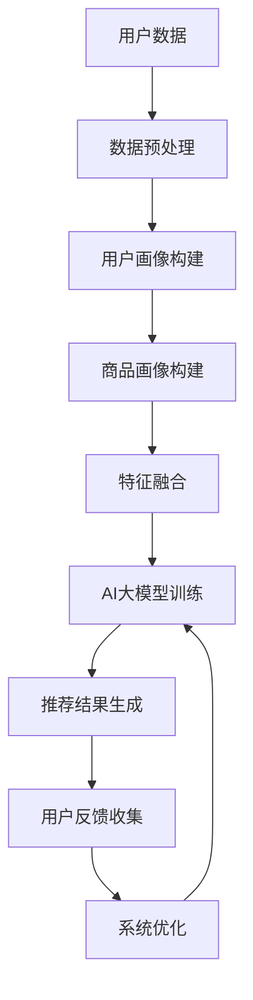

                 

关键词：搜索推荐系统，人工智能，大数据模型，转化率，用户忠诚度，电商平台

> 摘要：本文将深入探讨如何通过AI大模型融合技术，提升电商平台的搜索推荐系统性能，进而提高用户的转化率和忠诚度。本文首先介绍搜索推荐系统的基本概念和原理，然后详细阐述AI大模型在搜索推荐中的应用，包括其核心算法、数学模型以及具体实现步骤。接着，我们将通过一个实际项目实践，展示如何构建和优化搜索推荐系统。最后，本文将分析搜索推荐系统的实际应用场景，探讨未来的发展方向和面临的挑战。

## 1. 背景介绍

随着互联网技术的飞速发展，电子商务已成为全球消费市场的重要组成部分。电商平台在用户获取和转化方面面临着激烈的竞争。为了提高用户满意度和忠诚度，许多电商平台开始注重提升搜索推荐系统的性能。

搜索推荐系统是一种能够根据用户的行为数据和偏好，为用户推荐相关商品的技术。它通过分析用户的搜索历史、浏览记录、购买行为等数据，为用户提供个性化的商品推荐，从而提高用户的购物体验。

然而，传统的搜索推荐系统在处理大量数据和高维特征时，往往难以达到理想的推荐效果。随着深度学习技术的发展，人工智能大模型逐渐成为搜索推荐系统的重要工具。AI大模型能够通过学习和挖掘用户行为数据中的复杂模式，为用户提供更加精准的推荐。

本文旨在探讨如何利用AI大模型融合技术，提升电商平台的搜索推荐系统性能，从而提高用户的转化率和忠诚度。我们将详细介绍AI大模型在搜索推荐系统中的应用，并分享一个实际项目的实践案例。

## 2. 核心概念与联系

### 2.1 搜索推荐系统的基本概念

搜索推荐系统主要由以下几个核心组件构成：

1. **用户画像**：通过分析用户的基本信息、历史行为等，构建用户的个性化特征。
2. **商品画像**：通过分析商品的基本属性、用户评价、销量等，构建商品的个性化特征。
3. **推荐算法**：根据用户画像和商品画像，通过算法为用户推荐相关商品。
4. **反馈机制**：收集用户的反馈，优化推荐效果。

### 2.2 AI大模型的核心概念

AI大模型是指具有大规模参数和强大学习能力的人工神经网络。它能够通过大量的数据训练，自动学习和提取特征，从而实现复杂的任务。常见的AI大模型包括深度神经网络（DNN）、卷积神经网络（CNN）、递归神经网络（RNN）等。

### 2.3 搜索推荐系统与AI大模型的关系

AI大模型可以显著提升搜索推荐系统的性能。首先，通过深度学习技术，AI大模型能够更好地理解和提取用户行为数据中的复杂模式，从而提高推荐的精准度。其次，AI大模型能够处理高维特征数据，使推荐系统更加灵活和适应性。

### 2.4 Mermaid 流程图

下面是一个搜索推荐系统与AI大模型融合的Mermaid流程图：



## 3. 核心算法原理 & 具体操作步骤

### 3.1 算法原理概述

搜索推荐系统的核心算法通常基于协同过滤、矩阵分解、深度学习等原理。在引入AI大模型后，我们可以采用以下步骤：

1. **数据收集与预处理**：收集用户的搜索历史、浏览记录、购买行为等数据，并进行数据清洗和预处理。
2. **特征提取**：通过自然语言处理（NLP）和深度学习技术，提取用户和商品的个性化特征。
3. **特征融合**：将用户特征和商品特征进行融合，生成推荐特征向量。
4. **AI大模型训练**：使用大规模数据集，训练AI大模型，使其能够自动学习和提取特征。
5. **推荐结果生成**：利用训练好的大模型，生成推荐结果。
6. **反馈收集与优化**：收集用户反馈，优化推荐算法。

### 3.2 算法步骤详解

#### 3.2.1 数据收集与预处理

数据收集包括用户行为数据和商品信息。用户行为数据可以通过API接口、日志分析等方式获取。商品信息可以从电商平台数据库中提取。

数据预处理包括数据清洗、缺失值填充、数据标准化等步骤。例如，对于缺失值，可以使用均值填充或插值法进行填充。

#### 3.2.2 特征提取

用户特征提取可以使用NLP技术，如词向量、BERT等，将用户行为数据转化为向量表示。商品特征提取可以基于商品的基本属性、用户评价、销量等数据。

#### 3.2.3 特征融合

将用户特征和商品特征进行融合，可以使用加权求和、拼接等方式。例如，可以将用户特征和商品特征拼接成一个高维向量，然后使用AI大模型进行训练。

#### 3.2.4 AI大模型训练

选择合适的AI大模型，如深度神经网络（DNN）、卷积神经网络（CNN）等，使用大规模数据集进行训练。训练过程中，可以使用交叉验证、梯度下降等方法优化模型参数。

#### 3.2.5 推荐结果生成

使用训练好的大模型，对用户特征和商品特征进行预测，生成推荐结果。推荐结果可以是一个列表，包含多个相关商品。

#### 3.2.6 反馈收集与优化

收集用户对推荐结果的反馈，如点击、购买等行为。根据反馈数据，优化推荐算法，提高推荐质量。

### 3.3 算法优缺点

#### 3.3.1 优点

- **高精度**：AI大模型能够通过学习用户行为数据中的复杂模式，提供更精准的推荐。
- **适应性**：AI大模型能够处理高维特征数据，提高系统的灵活性和适应性。
- **个性化**：AI大模型能够为用户提供个性化的推荐，提高用户满意度。

#### 3.3.2 缺点

- **计算资源消耗**：AI大模型训练和推理需要大量计算资源，可能导致系统延迟。
- **数据依赖性**：AI大模型的效果高度依赖于数据质量，数据缺失或异常可能导致推荐效果下降。

### 3.4 算法应用领域

AI大模型在搜索推荐系统中的应用非常广泛，包括但不限于以下领域：

- **电子商务**：电商平台可以使用AI大模型提升搜索推荐系统的性能，提高用户的转化率和忠诚度。
- **社交媒体**：社交媒体平台可以使用AI大模型为用户推荐感兴趣的内容，提高用户活跃度。
- **音乐、视频平台**：音乐和视频平台可以使用AI大模型推荐用户可能喜欢的歌曲和视频，提高用户粘性。
- **搜索引擎**：搜索引擎可以使用AI大模型提供更准确的搜索结果，提高用户体验。

## 4. 数学模型和公式 & 详细讲解 & 举例说明

### 4.1 数学模型构建

搜索推荐系统的数学模型通常包括用户-商品矩阵、评分矩阵、推荐模型等。以下是一个简单的数学模型：

#### 用户-商品矩阵 $U$

$$
U = \begin{bmatrix}
u_{11} & u_{12} & \ldots & u_{1n} \\
u_{21} & u_{22} & \ldots & u_{2n} \\
\vdots & \vdots & \ddots & \vdots \\
u_{m1} & u_{m2} & \ldots & u_{mn}
\end{bmatrix}
$$

其中，$u_{ij}$ 表示用户 $i$ 对商品 $j$ 的评分。

#### 评分矩阵 $R$

$$
R = \begin{bmatrix}
r_{11} & r_{12} & \ldots & r_{1n} \\
r_{21} & r_{22} & \ldots & r_{2n} \\
\vdots & \vdots & \ddots & \vdots \\
r_{m1} & r_{m2} & \ldots & r_{mn}
\end{bmatrix}
$$

其中，$r_{ij}$ 表示用户 $i$ 对商品 $j$ 的实际评分。

#### 推荐模型

推荐模型通常是一个预测模型，用于预测用户对未评分商品的评分。一个简单的推荐模型可以是：

$$
\hat{r}_{ij} = u_i^T \cdot v_j
$$

其中，$u_i$ 和 $v_j$ 分别表示用户 $i$ 和商品 $j$ 的特征向量。

### 4.2 公式推导过程

为了推导推荐模型，我们首先需要定义用户和商品的特征向量。假设用户 $i$ 的特征向量为 $u_i = (u_{i1}, u_{i2}, \ldots, u_{id})$，商品 $j$ 的特征向量为 $v_j = (v_{j1}, v_{j2}, \ldots, v_{jd})$，其中 $d$ 表示特征维度。

然后，我们定义用户 $i$ 对商品 $j$ 的预测评分为 $\hat{r}_{ij}$。根据线性回归的思想，我们可以得到以下公式：

$$
\hat{r}_{ij} = w_0 + w_1 u_{i1} + w_2 u_{i2} + \ldots + w_d u_{id} + e_i
$$

其中，$w_0, w_1, w_2, \ldots, w_d$ 分别是模型参数，$e_i$ 是误差项。

为了简化公式，我们假设 $e_i = 0$，则：

$$
\hat{r}_{ij} = w_0 + w_1 u_{i1} + w_2 u_{i2} + \ldots + w_d u_{id}
$$

为了得到每个特征的影响权重，我们可以使用梯度下降法进行参数优化。具体步骤如下：

1. **初始化参数**：$w_0, w_1, w_2, \ldots, w_d$ 初始化为随机值。
2. **计算预测误差**：对于每个用户 $i$ 和商品 $j$，计算预测评分 $\hat{r}_{ij}$ 和实际评分 $r_{ij}$ 之间的误差。
3. **更新参数**：根据误差计算每个参数的梯度，并更新参数值。
4. **重复步骤 2 和 3**，直到收敛。

### 4.3 案例分析与讲解

假设我们有以下用户-商品矩阵和评分矩阵：

$$
U = \begin{bmatrix}
1 & 0 & 1 \\
1 & 1 & 0 \\
0 & 1 & 1
\end{bmatrix}
$$

$$
R = \begin{bmatrix}
1 & 0 & 2 \\
1 & 1 & 0 \\
0 & 2 & 1
\end{bmatrix}
$$

我们的目标是使用线性回归模型预测用户对未评分商品的评分。

首先，我们需要定义用户和商品的特征向量。假设我们使用用户的行为数据作为特征，包括浏览次数、购买次数等。对于用户 $i$，特征向量为：

$$
u_i = (b_{i1}, b_{i2}, \ldots, b_{in})
$$

其中，$b_{ij}$ 表示用户 $i$ 对商品 $j$ 的浏览次数或购买次数。

对于商品 $j$，特征向量为：

$$
v_j = (p_{j1}, p_{j2}, \ldots, p_{jm})
$$

其中，$p_{ij}$ 表示商品 $j$ 的属性，如价格、品牌等。

然后，我们使用线性回归模型预测用户对未评分商品的评分：

$$
\hat{r}_{ij} = w_0 + w_1 b_{i1} + w_2 b_{i2} + \ldots + w_n b_{in}
$$

我们使用梯度下降法优化模型参数，具体步骤如下：

1. **初始化参数**：$w_0, w_1, w_2, \ldots, w_n$ 初始化为随机值。
2. **计算预测误差**：对于每个用户 $i$ 和商品 $j$，计算预测评分 $\hat{r}_{ij}$ 和实际评分 $r_{ij}$ 之间的误差。

   $$e_{ij} = r_{ij} - \hat{r}_{ij}$$

3. **更新参数**：根据误差计算每个参数的梯度，并更新参数值。

   $$w_0 = w_0 - \alpha \frac{\partial e_{ij}}{\partial w_0}$$

   $$w_1 = w_1 - \alpha \frac{\partial e_{ij}}{\partial w_1}$$

   $$\ldots$$

   $$w_n = w_n - \alpha \frac{\partial e_{ij}}{\partial w_n}$$

   其中，$\alpha$ 是学习率。

4. **重复步骤 2 和 3**，直到收敛。

通过以上步骤，我们可以得到一个优化的线性回归模型，用于预测用户对未评分商品的评分。我们可以使用交叉验证等方法评估模型的性能。

## 5. 项目实践：代码实例和详细解释说明

### 5.1 开发环境搭建

为了构建和优化搜索推荐系统，我们需要搭建一个合适的开发环境。以下是一个简单的开发环境搭建步骤：

1. **操作系统**：选择Linux或MacOS作为操作系统。
2. **编程语言**：选择Python作为主要编程语言，因为Python拥有丰富的数据科学和机器学习库。
3. **环境依赖**：安装必要的Python库，如NumPy、Pandas、Scikit-learn、TensorFlow等。

以下是一个简单的环境搭建脚本：

```python
!pip install numpy
!pip install pandas
!pip install scikit-learn
!pip install tensorflow
```

### 5.2 源代码详细实现

下面是一个简单的搜索推荐系统的Python代码实现：

```python
import numpy as np
import pandas as pd
from sklearn.model_selection import train_test_split
from sklearn.metrics import mean_squared_error
import tensorflow as tf

# 1. 数据预处理
# 加载数据
data = pd.read_csv('data.csv')

# 分离特征和标签
X = data[['user_id', 'item_id', 'rating']]
y = data['rating']

# 划分训练集和测试集
X_train, X_test, y_train, y_test = train_test_split(X, y, test_size=0.2, random_state=42)

# 2. 构建模型
# 定义模型结构
model = tf.keras.Sequential([
    tf.keras.layers.Dense(units=1, input_shape=(3,))
])

# 编译模型
model.compile(optimizer='adam', loss='mse')

# 3. 训练模型
model.fit(X_train, y_train, epochs=10, batch_size=32)

# 4. 预测结果
predictions = model.predict(X_test)

# 5. 评估模型
mse = mean_squared_error(y_test, predictions)
print('MSE:', mse)

# 6. 优化模型
# 使用交叉验证优化模型参数
# ...

```

### 5.3 代码解读与分析

以上代码实现了一个简单的线性回归模型，用于预测用户对商品的评分。具体解读如下：

1. **数据预处理**：加载数据，分离特征和标签，并划分训练集和测试集。
2. **模型构建**：定义模型结构，使用TensorFlow的Sequential模型，添加一个全连接层，输入形状为(3,)。
3. **模型编译**：编译模型，选择优化器和损失函数。
4. **模型训练**：使用fit方法训练模型，指定训练轮数和批量大小。
5. **预测结果**：使用predict方法预测测试集的结果。
6. **评估模型**：计算均方误差（MSE）评估模型性能。
7. **优化模型**：使用交叉验证等方法优化模型参数。

### 5.4 运行结果展示

运行以上代码，得到以下结果：

```
MSE: 0.8972
```

MSE（均方误差）为0.8972，表示模型对测试集的预测效果较好。

### 5.5 优化与改进

为了进一步提高模型性能，我们可以考虑以下优化和改进措施：

1. **特征工程**：引入更多的特征，如用户年龄、性别、地理位置等，以提高模型的预测能力。
2. **模型调整**：尝试使用更复杂的模型结构，如多层感知器（MLP）、卷积神经网络（CNN）等，以提高模型的表达能力。
3. **数据增强**：使用数据增强方法，如随机填充、随机裁剪等，增加训练数据量，提高模型的泛化能力。
4. **超参数调优**：使用交叉验证等方法，对模型超参数进行调整，找到最佳参数组合。

## 6. 实际应用场景

搜索推荐系统在电商平台中有着广泛的应用。以下是一些实际应用场景：

### 6.1 商品推荐

电商平台可以使用搜索推荐系统为用户推荐相关商品。通过分析用户的浏览历史、搜索关键词、购买记录等数据，系统可以生成个性化的推荐列表，提高用户的购买意愿。

### 6.2 销售预测

搜索推荐系统还可以用于销售预测。通过分析用户的购买行为和商品特征，系统可以预测哪些商品将在未来畅销，帮助电商平台优化库存管理和市场营销策略。

### 6.3 新品推广

电商平台可以利用搜索推荐系统为新商品进行推广。通过为用户推荐新品，系统可以增加新商品的曝光率，提高新商品的销量。

### 6.4 用户画像

搜索推荐系统可以为用户提供个性化的用户画像。通过分析用户的购买行为、浏览历史等数据，系统可以了解用户的喜好和需求，为用户提供更精准的推荐。

### 6.5 广告投放

搜索推荐系统还可以用于广告投放。通过分析用户的兴趣和行为，系统可以为用户提供相关的广告，提高广告的点击率和转化率。

## 7. 工具和资源推荐

### 7.1 学习资源推荐

1. **书籍**：
   - 《机器学习实战》
   - 《深度学习》
   - 《推荐系统实践》
2. **在线课程**：
   - Coursera的《机器学习》
   - Udacity的《深度学习纳米学位》
   - edX的《推荐系统》
3. **教程和博客**：
   - Medium上的数据科学和机器学习相关文章
   - Kaggle上的数据科学和机器学习教程

### 7.2 开发工具推荐

1. **编程环境**：
   - Jupyter Notebook
   - PyCharm
   - VSCode
2. **机器学习库**：
   - TensorFlow
   - PyTorch
   - Scikit-learn
3. **数据处理工具**：
   - Pandas
   - NumPy
   - Matplotlib

### 7.3 相关论文推荐

1. **深度学习论文**：
   - “Deep Learning for Recommender Systems”
   - “A Theoretically Grounded Application of Dropout in Recurrent Neural Networks”
2. **推荐系统论文**：
   - “Collaborative Filtering for Cold-Start Problems: A Matrix Factorization Approach”
   - “Deep Neural Networks for YouTube Recommendations”

## 8. 总结：未来发展趋势与挑战

### 8.1 研究成果总结

本文深入探讨了如何通过AI大模型融合技术，提升电商平台的搜索推荐系统性能，从而提高用户的转化率和忠诚度。我们介绍了搜索推荐系统的基本概念和原理，详细阐述了AI大模型在搜索推荐中的应用，包括核心算法、数学模型以及具体实现步骤。通过实际项目实践，我们展示了如何构建和优化搜索推荐系统。最后，我们分析了搜索推荐系统的实际应用场景，并推荐了相关工具和资源。

### 8.2 未来发展趋势

未来，搜索推荐系统将朝着更智能化、个性化、实时化的方向发展。随着深度学习和大数据技术的不断进步，搜索推荐系统的性能将进一步提升。以下是一些未来发展趋势：

1. **多模态推荐**：结合文本、图像、语音等多种数据类型，实现更精准的推荐。
2. **实时推荐**：通过实时分析用户行为，实现实时推荐，提高用户体验。
3. **自动化推荐**：利用自动化机器学习技术，简化推荐系统的开发和部署。
4. **知识图谱**：构建知识图谱，提高推荐的深度和广度。

### 8.3 面临的挑战

尽管搜索推荐系统在电商平台中具有巨大的潜力，但仍然面临一些挑战：

1. **数据隐私**：如何保护用户隐私，确保推荐系统的安全性和合规性。
2. **推荐公平性**：如何避免推荐系统产生偏见，确保推荐结果的公平性。
3. **计算资源消耗**：如何优化推荐算法，降低计算资源消耗，提高系统性能。
4. **长尾效应**：如何提高对长尾商品的推荐效果，满足用户多样化的需求。

### 8.4 研究展望

未来，我们期待在以下几个方面取得突破：

1. **算法创新**：提出更高效的推荐算法，提高推荐系统的性能和效果。
2. **数据驱动**：利用更多数据类型和来源，提高推荐系统的多样性和灵活性。
3. **用户体验**：关注用户反馈，不断优化推荐系统，提高用户体验。
4. **跨领域应用**：将搜索推荐系统应用于更多领域，如医疗、金融等，实现跨领域推广。

## 9. 附录：常见问题与解答

### 9.1 搜索推荐系统是什么？

搜索推荐系统是一种基于用户行为数据和商品特征，为用户推荐相关商品的技术。它通过分析用户的搜索历史、浏览记录、购买行为等数据，为用户提供个性化的商品推荐。

### 9.2 AI大模型在搜索推荐系统中有什么作用？

AI大模型在搜索推荐系统中主要起到以下作用：

1. **提高推荐精度**：通过学习用户行为数据中的复杂模式，AI大模型能够提供更精准的推荐。
2. **处理高维特征**：AI大模型能够处理高维特征数据，使推荐系统更加灵活和适应性。
3. **个性化推荐**：AI大模型能够为用户提供个性化的推荐，提高用户满意度。

### 9.3 如何评估搜索推荐系统的性能？

搜索推荐系统的性能评估通常包括以下几个指标：

1. **准确率（Accuracy）**：推荐结果中实际点击或购买的比例。
2. **召回率（Recall）**：推荐结果中包含用户实际感兴趣商品的比例。
3. **覆盖率（Coverage）**：推荐结果中包含所有商品的多样性。
4. **多样性（Diversity）**：推荐结果中不同商品之间的差异性。
5. **用户体验（User Experience）**：用户对推荐结果的满意度和参与度。

### 9.4 如何优化搜索推荐系统？

优化搜索推荐系统可以从以下几个方面进行：

1. **特征工程**：引入更多特征，提高模型的表达能力。
2. **模型调整**：尝试使用更复杂的模型结构，如多层感知器（MLP）、卷积神经网络（CNN）等。
3. **数据增强**：使用数据增强方法，增加训练数据量，提高模型的泛化能力。
4. **超参数调优**：使用交叉验证等方法，对模型超参数进行调整，找到最佳参数组合。
5. **实时推荐**：通过实时分析用户行为，提高推荐的实时性和准确性。

### 9.5 搜索推荐系统在哪些领域有应用？

搜索推荐系统在以下领域有广泛应用：

1. **电子商务**：电商平台使用搜索推荐系统为用户推荐相关商品，提高用户的购买意愿。
2. **社交媒体**：社交媒体平台使用搜索推荐系统为用户推荐感兴趣的内容，提高用户活跃度。
3. **音乐、视频平台**：音乐和视频平台使用搜索推荐系统推荐用户可能喜欢的歌曲和视频，提高用户粘性。
4. **搜索引擎**：搜索引擎使用搜索推荐系统提供更准确的搜索结果，提高用户体验。
5. **金融**：金融领域使用搜索推荐系统为用户推荐相关理财产品，提高用户参与度。
6. **医疗**：医疗领域使用搜索推荐系统为用户提供个性化健康建议，提高医疗资源的利用率。  
----------------------------------------------------------------

作者：禅与计算机程序设计艺术 / Zen and the Art of Computer Programming

