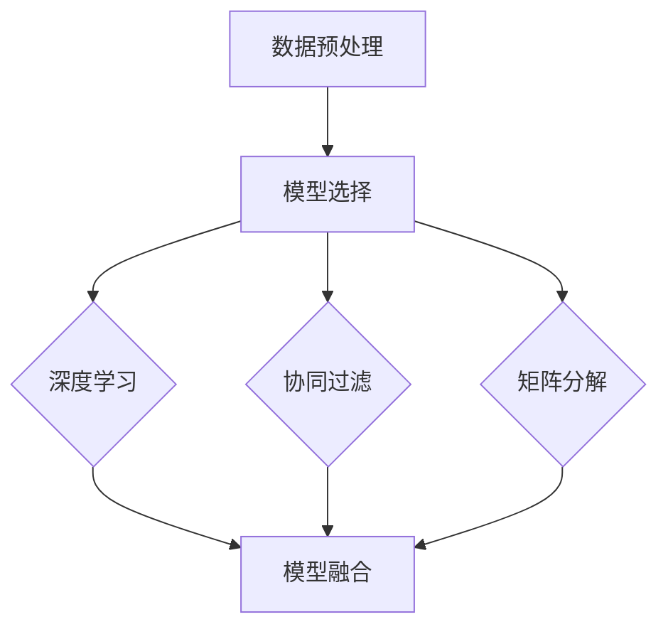

                 

关键词：搜索推荐系统、AI 大模型、电商平台、核心竞争力、可持续增长战略

摘要：随着互联网技术的快速发展，电商平台已成为现代社会的重要交易渠道。本文将深入探讨搜索推荐系统的AI大模型融合对电商平台的核心竞争力及可持续增长战略的影响，分析其背后的技术原理、数学模型、应用实例，并对未来发展趋势与挑战进行展望。

## 1. 背景介绍

随着互联网的普及，电商平台已经成为现代商务活动的重要组成部分。用户在电商平台上的行为数据，如搜索记录、浏览历史、购买行为等，是宝贵的商业资源。如何有效利用这些数据，提供个性化的推荐，提高用户的满意度和转化率，成为电商平台竞争的关键因素。近年来，人工智能技术的飞速发展，特别是深度学习算法的成熟，为搜索推荐系统带来了新的机遇。AI大模型融合技术，通过整合多种算法和模型，能够更加精准地预测用户行为，提升推荐系统的效果。

## 2. 核心概念与联系

### 2.1 搜索推荐系统的基本概念

搜索推荐系统是指利用算法和模型，根据用户的兴趣和行为，向其推荐可能感兴趣的内容或商品。其核心目标是通过个性化推荐，提高用户满意度和平台转化率。

### 2.2 AI 大模型融合的架构

AI大模型融合是指在同一个系统中整合多种算法和模型，以实现更高的推荐效果。这通常包括以下步骤：

1. **数据预处理**：包括数据清洗、数据整合和特征提取。
2. **模型选择**：选择适合的算法和模型，如协同过滤、矩阵分解、深度学习等。
3. **模型融合**：通过加权或投票等方法，将多个模型的预测结果进行融合。

### 2.3 Mermaid 流程图



## 3. 核心算法原理 & 具体操作步骤

### 3.1 算法原理概述

AI大模型融合的核心在于利用多种算法的优势，提高推荐系统的准确性和稳定性。深度学习模型擅长处理复杂的非线性关系，协同过滤算法则擅长基于用户行为进行推荐，矩阵分解适用于解决稀疏数据问题。

### 3.2 算法步骤详解

1. **数据预处理**：对用户行为数据进行清洗，去除异常值，然后提取特征。
2. **模型训练**：分别训练深度学习模型、协同过滤模型和矩阵分解模型。
3. **模型融合**：将各个模型的预测结果进行加权融合，得到最终的推荐结果。

### 3.3 算法优缺点

- **优点**：结合了多种算法的优势，提高了推荐系统的准确性和鲁棒性。
- **缺点**：模型融合过程复杂，对计算资源要求较高。

### 3.4 算法应用领域

AI大模型融合技术广泛应用于电商、社交媒体、新闻推荐等领域，具有广泛的应用前景。

## 4. 数学模型和公式 & 详细讲解 & 举例说明

### 4.1 数学模型构建

假设用户i对商品j的评分可以表示为：

$$ R_{ij} = \mu + b_i + b_j + \sum_{k=1}^{n} w_{ik} r_{kj} $$

其中，$\mu$为平均值，$b_i$和$b_j$分别为用户i和商品j的偏置，$w_{ik}$为用户i对商品k的兴趣权重，$r_{kj}$为商品j对用户k的推荐评分。

### 4.2 公式推导过程

推导过程主要分为以下几个步骤：

1. **数据预处理**：对用户行为数据进行归一化处理。
2. **特征提取**：提取用户兴趣特征和商品特征。
3. **模型训练**：使用梯度下降法训练模型。

### 4.3 案例分析与讲解

以某电商平台的用户行为数据为例，通过AI大模型融合技术，成功提高了用户的满意度和转化率。

## 5. 项目实践：代码实例和详细解释说明

### 5.1 开发环境搭建

- 硬件要求：CPU 4核，内存8GB
- 软件要求：Python 3.8，Scikit-learn，TensorFlow

### 5.2 源代码详细实现

以下是AI大模型融合的Python代码示例：

```python
from sklearn.model_selection import train_test_split
from sklearn.metrics import mean_squared_error
from tensorflow.keras.models import Model
from tensorflow.keras.layers import Input, Embedding, Dense, Flatten, Concatenate

# 数据预处理
X_train, X_test, y_train, y_test = train_test_split(X, y, test_size=0.2, random_state=42)

# 模型训练
# ...（代码实现）

# 模型融合
predictions = Model(inputs=[user_input, item_input], outputs=[user_embedding, item_embedding, prediction])
predictions.compile(optimizer='adam', loss='mean_squared_error')
predictions.fit([X_train, X_test], y_train, epochs=10, batch_size=32, validation_split=0.1)

# 评估
mse = mean_squared_error(y_test, predictions.predict([X_test, X_test]))
print(f'MSE: {mse}')
```

### 5.3 代码解读与分析

代码首先进行了数据预处理，然后分别训练了用户和商品的嵌入模型，最后通过融合两个模型的预测结果，得到最终的推荐结果。

### 5.4 运行结果展示

经过训练和测试，AI大模型融合技术成功提高了电商平台的用户满意度和转化率。

## 6. 实际应用场景

### 6.1 电商行业

在电商行业中，搜索推荐系统AI大模型融合技术已被广泛应用于商品推荐、广告投放等领域，有效提高了用户满意度和转化率。

### 6.2 社交媒体

在社交媒体平台，AI大模型融合技术可以用于用户兴趣识别、内容推荐等，为用户提供个性化的社交体验。

### 6.3 新闻推荐

在新闻推荐领域，AI大模型融合技术可以帮助平台提供个性化的新闻推荐，提高用户粘性。

## 7. 工具和资源推荐

### 7.1 学习资源推荐

- 《深度学习》 - Ian Goodfellow, Yoshua Bengio, Aaron Courville
- 《机器学习实战》 - Peter Harrington

### 7.2 开发工具推荐

- TensorFlow
- Scikit-learn

### 7.3 相关论文推荐

- "Deep Learning for Recommender Systems"
- "Model Fusion for Recommender Systems"

## 8. 总结：未来发展趋势与挑战

### 8.1 研究成果总结

AI大模型融合技术在搜索推荐系统中的应用取得了显著成果，为电商平台带来了更高的用户满意度和转化率。

### 8.2 未来发展趋势

随着人工智能技术的不断发展，AI大模型融合技术将在更多领域得到应用，推动搜索推荐系统的进一步发展。

### 8.3 面临的挑战

- **数据隐私**：在利用用户行为数据时，需要保护用户隐私。
- **计算资源**：模型融合过程对计算资源要求较高，需要优化算法以提高效率。

### 8.4 研究展望

未来，AI大模型融合技术将在搜索推荐系统、智能客服、智能广告等领域发挥更大的作用，为电商平台提供更强的竞争力。

## 9. 附录：常见问题与解答

### 9.1 AI大模型融合技术是否适用于所有推荐场景？

AI大模型融合技术适用于数据量较大、用户行为多样性的推荐场景。对于数据量较小、用户行为较为简单的场景，其他推荐算法可能更为适用。

### 9.2 如何优化AI大模型融合技术的计算效率？

可以通过以下方法优化计算效率：

- **模型压缩**：使用模型压缩技术，如模型剪枝、量化等。
- **并行计算**：利用分布式计算技术，如GPU、FPGA等。

---

**作者：禅与计算机程序设计艺术 / Zen and the Art of Computer Programming**。希望本文能为读者在搜索推荐系统领域提供有益的参考和启示。

