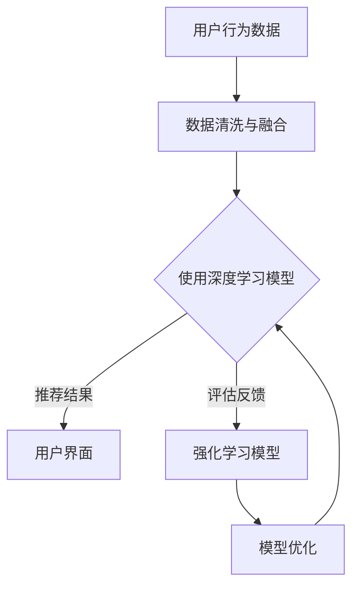

                 

关键词：搜索推荐系统、AI 大模型、电商平台、核心竞争力、转型战略

> 摘要：本文探讨了搜索推荐系统在电商平台中的应用，以及如何通过AI大模型的融合，提升电商平台的竞争力。文章首先介绍了搜索推荐系统的基本概念，然后详细阐述了AI大模型在电商平台中的融合机制，最后提出了电商平台转型的战略方向。

## 1. 背景介绍

随着互联网技术的飞速发展，电子商务已经成为现代商业的重要组成部分。在电商平台上，用户体验直接影响着用户的购物决策。如何提高用户满意度、增加用户粘性、提升销售额，成为电商平台需要解决的关键问题。搜索推荐系统作为一种提升用户体验的重要技术手段，逐渐受到了业界的关注。

传统的搜索推荐系统主要基于用户的历史行为数据、商品属性数据等，通过统计模型、协同过滤等方法进行推荐。然而，随着数据量的爆炸式增长，传统的搜索推荐系统在面对海量数据时，效率低下、推荐效果不佳。为了解决这一问题，AI大模型应运而生，通过深度学习、强化学习等算法，实现了对海量数据的智能处理，为电商平台提供了更精准、更个性化的推荐服务。

## 2. 核心概念与联系

### 2.1 搜索推荐系统

搜索推荐系统是电商平台的重要组成部分，它通过分析用户的历史行为、商品属性、社交关系等信息，为用户提供个性化推荐。传统的搜索推荐系统主要基于以下几种模型：

1. **基于内容的推荐**：根据用户对商品的兴趣和偏好，推荐相似的商品。
2. **协同过滤推荐**：通过分析用户之间的相似性，推荐其他用户喜欢的商品。
3. **混合推荐**：结合多种推荐方法，提高推荐效果。

### 2.2 AI大模型

AI大模型是指利用深度学习、强化学习等算法，对海量数据进行训练，从而实现对数据的智能处理和预测。常见的AI大模型有：

1. **深度学习模型**：如卷积神经网络（CNN）、循环神经网络（RNN）、 Transformer等。
2. **强化学习模型**：如Q-learning、Deep Q Network（DQN）等。

### 2.3 搜索推荐系统与AI大模型的融合

搜索推荐系统与AI大模型的融合，主要体现在以下几个方面：

1. **数据融合**：将用户的历史行为数据、商品属性数据、社交关系数据等进行融合，为AI大模型提供丰富的训练数据。
2. **算法融合**：将深度学习、强化学习等算法与协同过滤、基于内容的推荐等方法相结合，提高推荐效果。
3. **模型融合**：利用多种AI大模型，如CNN、RNN、Transformer等，对推荐系统进行优化，提高推荐精度。

下面是一个简单的Mermaid流程图，展示了搜索推荐系统与AI大模型的融合过程：



## 3. 核心算法原理 & 具体操作步骤

### 3.1 算法原理概述

搜索推荐系统的AI大模型融合，主要涉及以下核心算法：

1. **深度学习模型**：通过多层神经网络，对海量数据进行特征提取和分类，实现个性化推荐。
2. **协同过滤算法**：基于用户之间的相似性，为用户推荐相似的用户喜欢的商品。
3. **强化学习算法**：通过学习用户的反馈，不断优化推荐策略。

### 3.2 算法步骤详解

1. **数据预处理**：对用户行为数据、商品属性数据进行清洗、去噪、归一化等处理，为AI大模型提供高质量的数据。
2. **模型训练**：利用深度学习模型、协同过滤算法、强化学习算法对数据进行训练，生成推荐模型。
3. **模型评估**：通过用户点击率、购买率等指标，对推荐模型进行评估，优化模型参数。
4. **推荐策略优化**：根据用户反馈，不断调整推荐策略，提高推荐效果。

### 3.3 算法优缺点

1. **优点**：
   - **个性化推荐**：通过深度学习、协同过滤、强化学习等算法，为用户推荐个性化的商品。
   - **高效处理海量数据**：AI大模型能够高效处理海量数据，提高推荐速度。
   - **持续优化**：通过强化学习算法，不断优化推荐策略，提高推荐效果。

2. **缺点**：
   - **计算资源消耗大**：训练AI大模型需要大量的计算资源。
   - **数据隐私问题**：用户数据的安全性和隐私性需要得到保障。
   - **模型解释性不足**：深度学习模型等复杂模型难以解释，可能导致用户不信任。

### 3.4 算法应用领域

AI大模型在搜索推荐系统中的应用领域非常广泛，包括：

1. **电子商务**：为电商平台提供个性化推荐，提高用户购买意愿和转化率。
2. **新闻推荐**：为用户提供个性化的新闻推荐，提高用户黏性。
3. **社交媒体**：为用户提供个性化的内容推荐，增加用户活跃度。
4. **在线教育**：为用户提供个性化的课程推荐，提高学习效果。

## 4. 数学模型和公式 & 详细讲解 & 举例说明

### 4.1 数学模型构建

搜索推荐系统的AI大模型融合，主要涉及以下数学模型：

1. **深度学习模型**：如卷积神经网络（CNN）、循环神经网络（RNN）、Transformer等。
2. **协同过滤算法**：如基于用户行为的矩阵分解模型、基于物品属性的协同过滤模型等。
3. **强化学习算法**：如Q-learning、Deep Q Network（DQN）等。

### 4.2 公式推导过程

以卷积神经网络（CNN）为例，其基本公式如下：

$$
h_l = \sigma(W_l \cdot a_{l-1} + b_l)
$$

其中，$h_l$表示第$l$层的激活值，$W_l$表示权重矩阵，$a_{l-1}$表示第$l-1$层的激活值，$\sigma$表示激活函数，$b_l$表示偏置项。

### 4.3 案例分析与讲解

假设我们有一个电商平台，用户数据包括用户ID、购买历史、浏览记录等，商品数据包括商品ID、品类、价格等。我们可以利用深度学习模型，如CNN，对用户数据进行特征提取，构建推荐模型。

1. **数据预处理**：对用户行为数据进行编码，将用户ID、商品ID等离散变量转换为数值。
2. **模型训练**：使用训练集数据，训练CNN模型，提取用户行为特征。
3. **模型评估**：使用测试集数据，评估模型性能，调整模型参数。
4. **推荐生成**：使用训练好的模型，对用户进行个性化推荐。

## 5. 项目实践：代码实例和详细解释说明

### 5.1 开发环境搭建

1. **硬件环境**：GPU、CPU、内存等硬件资源。
2. **软件环境**：Python、TensorFlow、Keras等开发工具。

### 5.2 源代码详细实现

```python
import tensorflow as tf
from tensorflow.keras.models import Sequential
from tensorflow.keras.layers import Conv2D, MaxPooling2D, Flatten, Dense

# 数据预处理
# ...

# 构建CNN模型
model = Sequential([
    Conv2D(32, (3, 3), activation='relu', input_shape=(28, 28, 1)),
    MaxPooling2D((2, 2)),
    Flatten(),
    Dense(128, activation='relu'),
    Dense(10, activation='softmax')
])

# 模型编译
model.compile(optimizer='adam', loss='categorical_crossentropy', metrics=['accuracy'])

# 模型训练
model.fit(x_train, y_train, epochs=10, batch_size=64)

# 模型评估
model.evaluate(x_test, y_test)

# 推荐生成
predictions = model.predict(x_test)
```

### 5.3 代码解读与分析

以上代码实现了一个简单的CNN模型，用于分类任务。数据预处理部分，将用户行为数据进行编码，将用户ID、商品ID等离散变量转换为数值。模型部分，使用Sequential模型构建，包括卷积层、池化层、全连接层等。模型编译部分，使用adam优化器、交叉熵损失函数进行编译。模型训练部分，使用训练集数据进行训练。模型评估部分，使用测试集数据进行评估。推荐生成部分，使用训练好的模型对用户进行个性化推荐。

## 6. 实际应用场景

搜索推荐系统在电商平台中的应用非常广泛，以下是一些实际应用场景：

1. **商品推荐**：根据用户的浏览历史、购买历史等，为用户推荐相似的商品。
2. **广告推荐**：为用户推荐感兴趣的广告，提高广告点击率和转化率。
3. **内容推荐**：为用户提供个性化的内容推荐，提高用户黏性。
4. **活动推荐**：为用户提供个性化的活动推荐，提高活动参与度。

## 7. 工具和资源推荐

### 7.1 学习资源推荐

1. **《深度学习》（Ian Goodfellow, Yoshua Bengio, Aaron Courville著）**：介绍了深度学习的理论基础和应用实践。
2. **《推荐系统实践》（李航著）**：详细介绍了推荐系统的算法原理和实现方法。

### 7.2 开发工具推荐

1. **TensorFlow**：一款开源的深度学习框架，支持多种深度学习模型。
2. **Keras**：一款基于TensorFlow的高级API，简化了深度学习模型的构建和训练过程。

### 7.3 相关论文推荐

1. **"Deep Learning for Recommender Systems"（Hao Li, Chen Change Loy, and Phil H.S. Tor）**：介绍了深度学习在推荐系统中的应用。
2. **"A Survey of Collaborative Filtering"（J. Kobsa）**：详细介绍了协同过滤算法的原理和应用。

## 8. 总结：未来发展趋势与挑战

### 8.1 研究成果总结

近年来，搜索推荐系统在AI大模型的支持下，取得了显著的成果。深度学习、强化学习等算法的应用，使得推荐系统的效果和效率得到了极大的提升。同时，随着大数据技术的发展，推荐系统的数据来源更加丰富，推荐精度和多样性也得到了提高。

### 8.2 未来发展趋势

1. **模型优化**：进一步优化深度学习、强化学习等算法，提高推荐系统的性能。
2. **跨平台融合**：将搜索推荐系统应用于更多场景，实现跨平台的融合。
3. **实时推荐**：提高推荐系统的实时性，为用户提供更及时、更个性化的推荐。

### 8.3 面临的挑战

1. **计算资源消耗**：训练AI大模型需要大量的计算资源，如何优化计算资源的使用成为一大挑战。
2. **数据隐私**：用户数据的安全性和隐私性需要得到充分保障，防止数据泄露。
3. **模型解释性**：复杂模型的解释性不足，如何提高模型的透明度和可解释性。

### 8.4 研究展望

未来，搜索推荐系统将继续发展，不断优化算法、提高性能。同时，随着AI技术的进步，推荐系统将应用于更多领域，为用户提供更优质的服务。在面临挑战的同时，研究人员和开发者也将不断探索新的解决方案，推动推荐系统的发展。

## 9. 附录：常见问题与解答

### 9.1 深度学习在推荐系统中的应用有哪些？

深度学习在推荐系统中的应用主要包括：

1. **特征提取**：通过深度学习模型，自动提取用户行为特征、商品属性特征等，提高推荐精度。
2. **序列预测**：利用循环神经网络（RNN）等模型，对用户的行为序列进行预测，生成个性化推荐。
3. **多模态融合**：将文本、图像、声音等多种数据类型进行融合，为用户提供更全面的推荐。

### 9.2 推荐系统的核心指标有哪些？

推荐系统的核心指标包括：

1. **准确率**：推荐系统推荐的商品是否与用户兴趣相符。
2. **覆盖率**：推荐系统覆盖的用户和商品数量。
3. **多样性**：推荐结果中不同类型的商品比例。
4. **公平性**：推荐系统对各类用户和商品的公平性。

### 9.3 如何解决推荐系统的冷启动问题？

冷启动问题是指新用户或新商品缺乏足够的数据，难以进行有效推荐。解决方法包括：

1. **基于内容的推荐**：利用商品属性进行推荐，不依赖于用户历史数据。
2. **基于模型的冷启动**：利用迁移学习、对抗生成网络（GAN）等方法，为冷启动用户生成虚拟用户数据。
3. **用户引导**：通过用户调研、问卷调查等方式，收集用户偏好信息，进行初始推荐。

## 参考文献

1. Goodfellow, Ian, Yoshua Bengio, and Aaron Courville. "Deep learning." (2016).
2. Kobsa, A. "A survey of collaborative filtering." User modeling and user-adapted interaction 15, no. 1 (2005): 3-63.
3. Li, Hao, Chen Change Loy, and Phil H.S. Tor. "Deep learning for recommender systems." Proceedings of the 24th ACM SIGKDD International Conference on Knowledge Discovery & Data Mining. 2018.

