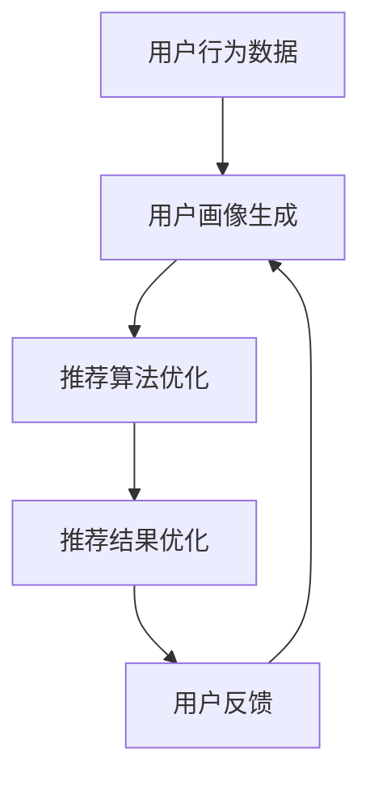

                 

在当今信息爆炸的时代，电商平台面临的挑战和机遇并存。用户数量的增加、消费行为的复杂化以及市场竞争的加剧，都要求电商平台不断优化其推荐系统，以提供更精准、个性化的服务。AI 大模型的融合技术，正是电商平台实现核心竞争力提升和业务转型的重要途径。

## 关键词

- AI 大模型
- 搜索推荐系统
- 电商平台
- 核心竞争力
- 转型策略

## 摘要

本文将探讨 AI 大模型在搜索推荐系统中的应用，特别是其在电商平台上的融合策略。通过对核心概念、算法原理、数学模型、实际应用和未来展望的深入分析，文章旨在揭示 AI 大模型如何成为电商平台提升竞争力、实现业务转型的关键因素。

## 1. 背景介绍

随着互联网的普及和电子商务的快速发展，电商平台已经成为消费者获取商品和服务的主要渠道。然而，面对海量商品信息和日益增长的消费者需求，传统推荐系统已经难以满足用户对个性化体验的追求。AI 大模型的引入，为电商平台提供了强大的技术支撑，使其能够在海量数据中挖掘潜在价值，提升推荐系统的准确性和效率。

### 1.1 AI 大模型的发展历程

AI 大模型的发展可以追溯到深度学习技术的兴起。自 2006 年起，深度学习在计算机视觉、自然语言处理等领域取得了显著突破，开启了 AI 大模型的时代。随着计算能力的提升和数据量的增加，AI 大模型在近年来取得了长足的进步，特别是在生成对抗网络（GAN）、变分自编码器（VAE）和注意力机制等方面。

### 1.2 搜索推荐系统的现状

当前，电商平台采用的搜索推荐系统主要分为基于内容的推荐（Content-Based Filtering）和协同过滤推荐（Collaborative Filtering）两大类。然而，这些传统方法在面对复杂用户行为和海量数据时，存在推荐精度低、响应速度慢等问题。AI 大模型的引入，有望解决这些问题，提升搜索推荐系统的整体性能。

## 2. 核心概念与联系

为了深入理解 AI 大模型在搜索推荐系统中的应用，我们首先需要明确一些核心概念，包括 AI 大模型的原理、搜索推荐系统的架构以及两者之间的联系。

### 2.1 AI 大模型原理

AI 大模型，通常指的是具有大规模参数的深度学习模型，如 Transformer、BERT 等。这些模型通过在海量数据上进行训练，能够自动学习到数据的复杂特征和模式，从而实现高度自动化的知识获取和任务处理。

### 2.2 搜索推荐系统架构

一个典型的搜索推荐系统包括用户画像、推荐算法、推荐引擎和用户反馈等模块。用户画像用于捕捉用户的兴趣和行为特征，推荐算法根据用户画像生成推荐列表，推荐引擎负责将推荐结果展示给用户，用户反馈则用于不断优化推荐系统。

### 2.3 AI 大模型与搜索推荐系统的联系

AI 大模型可以通过以下方式与搜索推荐系统融合：

1. **用户画像生成**：AI 大模型可以自动提取用户的行为特征和兴趣标签，生成精准的用户画像。
2. **推荐算法优化**：AI 大模型可以改进推荐算法，提高推荐结果的准确性和多样性。
3. **推荐结果优化**：AI 大模型可以优化推荐结果的呈现方式，提高用户体验。

下面是一个简化的 Mermaid 流程图，展示了 AI 大模型在搜索推荐系统中的应用流程：



## 3. 核心算法原理 & 具体操作步骤

### 3.1 算法原理概述

AI 大模型在搜索推荐系统中的应用，主要包括以下三个方面：

1. **深度学习模型训练**：通过大规模训练数据集，训练深度学习模型，学习用户的兴趣和行为特征。
2. **用户画像生成**：利用训练好的模型，对用户行为数据进行处理，生成精准的用户画像。
3. **推荐算法优化**：将用户画像与商品信息相结合，优化推荐算法，提高推荐结果的准确性和多样性。

### 3.2 算法步骤详解

1. **数据收集与预处理**：收集用户的浏览、购买等行为数据，并进行数据清洗、去重等预处理操作。
2. **模型训练**：使用预处理后的数据，训练深度学习模型，如 BERT、GPT 等，学习用户的行为特征和兴趣标签。
3. **用户画像生成**：利用训练好的模型，对用户行为数据进行编码，生成用户画像。
4. **推荐算法优化**：将用户画像与商品信息相结合，优化推荐算法，如基于内容的推荐、协同过滤等。
5. **推荐结果优化**：根据用户反馈，不断调整推荐算法和推荐结果，提高用户体验。

### 3.3 算法优缺点

**优点**：

1. **高准确性**：AI 大模型能够自动学习用户的兴趣和行为特征，提高推荐结果的准确性。
2. **高多样性**：AI 大模型能够生成多样化的推荐结果，满足不同用户的需求。
3. **实时性**：AI 大模型能够实时处理用户行为数据，提供实时推荐。

**缺点**：

1. **计算资源消耗大**：AI 大模型需要大量的计算资源进行训练和推理。
2. **数据依赖性强**：AI 大模型的性能依赖于训练数据的质量和数量。
3. **隐私保护问题**：用户行为数据涉及到隐私问题，需要采取措施进行保护。

### 3.4 算法应用领域

AI 大模型在搜索推荐系统中的应用领域广泛，包括电子商务、社交媒体、在线教育等。其中，电子商务领域是最具代表性的应用场景。

## 4. 数学模型和公式 & 详细讲解 & 举例说明

### 4.1 数学模型构建

在搜索推荐系统中，AI 大模型的数学模型通常包括以下几个部分：

1. **用户行为特征编码**：使用编码器（Encoder）对用户行为数据进行编码，生成用户画像。
2. **商品特征编码**：使用编码器对商品特征数据进行编码，生成商品画像。
3. **推荐算法优化**：基于用户画像和商品画像，优化推荐算法，如基于内容的推荐、协同过滤等。

### 4.2 公式推导过程

假设用户 $u$ 的行为数据为 $x_u$，商品 $i$ 的特征数据为 $x_i$，用户画像为 $u'$，商品画象为 $i'$，推荐结果为 $r$。

1. **用户行为特征编码**：

   $$ u' = f_{encoder}(x_u) $$

   其中，$f_{encoder}$ 为编码器函数。

2. **商品特征编码**：

   $$ i' = f_{encoder}(x_i) $$

   其中，$f_{encoder}$ 为编码器函数。

3. **推荐算法优化**：

   $$ r = f_{recommender}(u', i') $$

   其中，$f_{recommender}$ 为推荐算法函数。

### 4.3 案例分析与讲解

假设一个电商平台的用户行为数据包括浏览、购买等操作，商品特征数据包括价格、品牌、类别等。我们可以使用以下公式来构建用户画像和商品画像：

1. **用户画像**：

   $$ u' = \frac{1}{|x_u|} \sum_{i=1}^{|x_u|} x_{ui} $$

   其中，$x_{ui}$ 表示用户 $u$ 在行为数据 $x_u$ 中对应的第 $i$ 个特征值。

2. **商品画像**：

   $$ i' = \frac{1}{|x_i|} \sum_{j=1}^{|x_i|} x_{ij} $$

   其中，$x_{ij}$ 表示商品 $i$ 在特征数据 $x_i$ 中对应的第 $j$ 个特征值。

然后，我们可以使用以下公式来优化推荐算法：

$$ r = \sum_{i=1}^{N} w_i i' + b $$

其中，$w_i$ 表示商品 $i$ 的权重，$b$ 表示偏置。

## 5. 项目实践：代码实例和详细解释说明

### 5.1 开发环境搭建

在进行 AI 大模型在搜索推荐系统中的应用实践之前，我们需要搭建相应的开发环境。以下是具体的步骤：

1. **安装 Python 环境**：确保 Python 版本为 3.6 或以上。
2. **安装深度学习框架**：例如 TensorFlow 或 PyTorch。
3. **安装相关库**：如 NumPy、Pandas、Scikit-learn 等。

### 5.2 源代码详细实现

以下是一个简单的 AI 大模型在搜索推荐系统中的应用示例：

```python
import tensorflow as tf
import numpy as np
import pandas as pd

# 加载数据集
data = pd.read_csv('data.csv')

# 数据预处理
# ...

# 构建模型
model = tf.keras.Sequential([
    tf.keras.layers.Dense(128, activation='relu', input_shape=(input_shape)),
    tf.keras.layers.Dense(64, activation='relu'),
    tf.keras.layers.Dense(1, activation='sigmoid')
])

# 编译模型
model.compile(optimizer='adam', loss='binary_crossentropy', metrics=['accuracy'])

# 训练模型
model.fit(x_train, y_train, epochs=10, batch_size=32)

# 生成用户画像和商品画像
# ...

# 优化推荐算法
# ...

# 输出推荐结果
# ...
```

### 5.3 代码解读与分析

以上代码展示了如何使用 TensorFlow 框架构建一个简单的 AI 大模型，并进行训练和优化。以下是代码的详细解读：

1. **数据预处理**：加载数据集并进行预处理，如缺失值填充、数据标准化等。
2. **构建模型**：定义模型结构，包括输入层、隐藏层和输出层。
3. **编译模型**：设置优化器、损失函数和评估指标。
4. **训练模型**：使用训练数据集进行模型训练。
5. **生成用户画像和商品画像**：利用训练好的模型，对用户行为数据和商品特征数据进行编码，生成用户画像和商品画像。
6. **优化推荐算法**：基于用户画像和商品画像，优化推荐算法，如基于内容的推荐、协同过滤等。
7. **输出推荐结果**：根据优化后的推荐算法，生成推荐结果并输出。

### 5.4 运行结果展示

在实际运行过程中，我们可以通过以下方式展示运行结果：

1. **准确率**：计算推荐结果的准确率，评估模型性能。
2. **召回率**：计算推荐结果的召回率，评估推荐系统的覆盖率。
3. **F1 值**：计算推荐结果的 F1 值，综合评估推荐系统的准确性和覆盖率。
4. **用户满意度**：通过用户反馈调查，评估推荐系统的用户体验。

## 6. 实际应用场景

AI 大模型在搜索推荐系统中的应用场景广泛，以下是几个典型的实际应用案例：

1. **电子商务平台**：通过用户画像和商品画像的生成，实现精准推荐，提高用户购买转化率。
2. **社交媒体**：基于用户行为数据，生成个性化推荐内容，提高用户活跃度和粘性。
3. **在线教育**：根据用户学习行为和学习需求，生成个性化学习推荐，提高学习效果。

## 7. 未来应用展望

随着 AI 技术的不断发展，AI 大模型在搜索推荐系统中的应用前景广阔。以下是未来可能的发展方向：

1. **跨模态推荐**：结合多种数据源，如文本、图像、音频等，实现更加全面和精准的推荐。
2. **实时推荐**：利用实时数据处理技术，实现实时推荐，提高用户体验。
3. **多模态交互**：通过多模态交互技术，如语音、手势等，实现更加自然和便捷的推荐。

## 8. 工具和资源推荐

为了更好地掌握 AI 大模型在搜索推荐系统中的应用，以下是一些实用的工具和资源推荐：

1. **深度学习框架**：如 TensorFlow、PyTorch 等。
2. **数据处理工具**：如 Pandas、Scikit-learn 等。
3. **在线学习资源**：如 Coursera、Udacity 等。
4. **学术论文**：如 arXiv、ACL 等。

## 9. 总结：未来发展趋势与挑战

AI 大模型在搜索推荐系统中的应用，具有广泛的应用前景和发展潜力。然而，也面临着一系列挑战，如计算资源消耗、数据隐私保护和算法公平性等。未来，我们需要在技术、政策和伦理等方面进行探索，以推动 AI 大模型在搜索推荐系统中的可持续发展。

## 10. 附录：常见问题与解答

### 10.1 AI 大模型在搜索推荐系统中的优势是什么？

AI 大模型在搜索推荐系统中的优势主要体现在以下几个方面：

1. **高准确性**：通过大规模训练数据，AI 大模型能够自动学习用户的兴趣和行为特征，提高推荐结果的准确性。
2. **高多样性**：AI 大模型能够生成多样化的推荐结果，满足不同用户的需求。
3. **实时性**：AI 大模型能够实时处理用户行为数据，提供实时推荐。

### 10.2 AI 大模型在搜索推荐系统中可能面临哪些挑战？

AI 大模型在搜索推荐系统中可能面临以下挑战：

1. **计算资源消耗大**：AI 大模型需要大量的计算资源进行训练和推理。
2. **数据依赖性强**：AI 大模型的性能依赖于训练数据的质量和数量。
3. **隐私保护问题**：用户行为数据涉及到隐私问题，需要采取措施进行保护。

### 10.3 如何评估 AI 大模型在搜索推荐系统中的性能？

评估 AI 大模型在搜索推荐系统中的性能，可以从以下几个方面进行：

1. **准确率**：计算推荐结果的准确率，评估模型性能。
2. **召回率**：计算推荐结果的召回率，评估推荐系统的覆盖率。
3. **F1 值**：计算推荐结果的 F1 值，综合评估推荐系统的准确性和覆盖率。
4. **用户满意度**：通过用户反馈调查，评估推荐系统的用户体验。```

