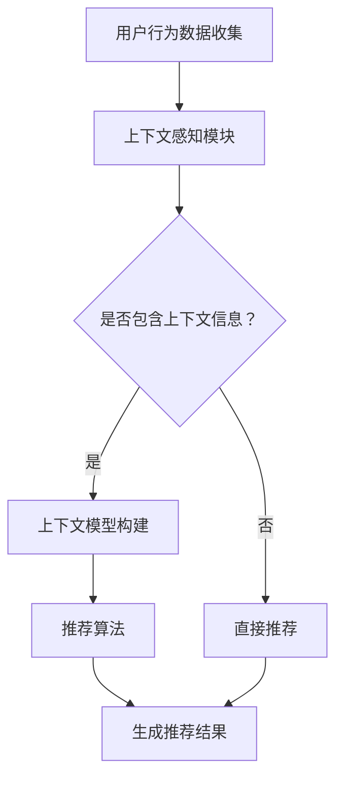

                 

关键词：搜索推荐系统、上下文感知、机器学习、深度学习、大数据处理、用户行为分析

> 摘要：本文将探讨搜索推荐系统的上下文感知技术，阐述其核心概念、算法原理、数学模型以及实际应用场景。通过分析当前的技术趋势与挑战，展望未来发展的前景。

## 1. 背景介绍

随着互联网的普及和信息量的爆炸式增长，用户在获取信息时面临着巨大的挑战。如何在海量数据中为用户提供最相关、最有价值的信息成为了一个亟待解决的问题。搜索推荐系统应运而生，其目标是通过个性化推荐，将用户可能感兴趣的内容推送给他们。

然而，传统的搜索推荐系统主要依赖于用户历史行为和内容相似性进行推荐。这种方法在一定程度上能够提高推荐的准确性，但在面对复杂、多变的应用场景时，往往无法满足用户的需求。这就需要引入上下文感知技术，使得推荐系统能够更好地理解用户所处的环境，从而提供更加精准的推荐。

上下文感知技术是指系统根据用户所处的时间、地点、设备、兴趣等多个维度的信息，动态调整推荐策略。本文将详细探讨这种技术，分析其核心算法原理、数学模型以及实际应用场景。

## 2. 核心概念与联系

### 2.1. 上下文感知定义

上下文感知（Context Awareness）是指系统能够自动识别并理解用户所处的环境，并据此动态调整其行为。在搜索推荐系统中，上下文感知技术可以帮助系统更好地理解用户的需求，提高推荐的准确性。

### 2.2. 上下文维度

上下文维度是指影响推荐系统的各种环境信息，包括但不限于以下几种：

- **时间维度**：用户搜索行为的时间特征，如时间段、时间频率等。
- **地点维度**：用户的地理位置信息，如城市、区域等。
- **设备维度**：用户使用的设备类型，如手机、电脑、平板等。
- **兴趣维度**：用户的历史行为和兴趣标签，如搜索关键词、浏览记录、收藏夹等。

### 2.3. 上下文关联

上下文关联是指将不同的上下文维度信息进行整合，构建一个多维度的上下文模型。通过这个模型，系统可以更好地理解用户的需求，从而提供更加精准的推荐。

### 2.4. 上下文感知架构

上下文感知架构包括以下几个关键组成部分：

- **上下文感知模块**：负责收集、处理和存储上下文信息。
- **上下文模型**：用于整合不同维度的上下文信息，构建多维度的上下文模型。
- **推荐算法**：基于上下文模型，为用户生成个性化推荐。

### 2.5. Mermaid 流程图



## 3. 核心算法原理 & 具体操作步骤

### 3.1. 算法原理概述

上下文感知搜索推荐系统的核心算法主要包括用户行为分析、上下文信息提取和推荐算法设计。下面将分别介绍这三大模块的算法原理。

#### 用户行为分析

用户行为分析是指通过对用户的历史行为数据（如搜索关键词、浏览记录、购买行为等）进行分析，提取出用户的兴趣偏好。这一过程通常采用机器学习算法，如协同过滤、矩阵分解等。

#### 上下文信息提取

上下文信息提取是指从用户所处的环境中提取出与推荐相关的上下文信息，如时间、地点、设备等。这一过程通常采用自然语言处理、地理信息系统等技术。

#### 推荐算法设计

推荐算法设计是指基于用户行为分析和上下文信息提取的结果，设计出能够为用户生成个性化推荐的算法。常见的推荐算法有基于内容的推荐、基于协同过滤的推荐等。

### 3.2. 算法步骤详解

#### 用户行为分析

1. 数据收集：收集用户的历史行为数据。
2. 特征提取：对行为数据进行预处理，提取出与用户兴趣相关的特征。
3. 模型训练：使用机器学习算法，如协同过滤、矩阵分解等，训练出用户兴趣模型。

#### 上下文信息提取

1. 上下文数据收集：收集与用户环境相关的上下文数据，如时间、地点、设备等。
2. 特征提取：对上下文数据进行预处理，提取出与推荐相关的特征。
3. 模型训练：使用机器学习算法，如分类、回归等，训练出上下文特征模型。

#### 推荐算法设计

1. 用户兴趣与上下文特征融合：将用户兴趣模型和上下文特征模型进行融合，得到一个多维度的上下文用户兴趣模型。
2. 推荐结果生成：基于上下文用户兴趣模型，使用推荐算法（如基于内容的推荐、基于协同过滤的推荐等）生成推荐结果。

### 3.3. 算法优缺点

#### 优点

1. 提高推荐准确性：通过引入上下文感知技术，可以更好地理解用户的需求，提高推荐的准确性。
2. 提升用户体验：根据用户所处的环境动态调整推荐内容，提供更加个性化的推荐，提升用户体验。

#### 缺点

1. 数据依赖性强：上下文感知技术需要依赖大量的上下文信息，数据质量和数量直接影响推荐效果。
2. 算法复杂度高：上下文感知技术涉及多个算法模块，算法复杂度较高，计算成本较大。

### 3.4. 算法应用领域

上下文感知技术广泛应用于电子商务、在线教育、社交媒体、智能家居等多个领域，下面列举几个典型的应用场景：

1. **电子商务**：根据用户购物习惯、购买时间等信息，为用户推荐相关的商品。
2. **在线教育**：根据用户的学习习惯、学习进度等信息，为用户推荐相关的学习资源。
3. **社交媒体**：根据用户的地理位置、兴趣爱好等信息，为用户推荐感兴趣的内容。
4. **智能家居**：根据用户的生活习惯、设备状态等信息，为用户推荐相应的智能设备设置。

## 4. 数学模型和公式 & 详细讲解 & 举例说明

### 4.1. 数学模型构建

上下文感知搜索推荐系统的数学模型主要包括用户兴趣模型、上下文特征模型和推荐算法模型。

#### 用户兴趣模型

用户兴趣模型可以表示为：

$$
U = \{u_1, u_2, ..., u_n\}
$$

其中，$u_i$ 表示用户 $i$ 的兴趣向量，$u_i = \{u_{i1}, u_{i2}, ..., u_{im}\}$，$u_{ij}$ 表示用户 $i$ 对第 $j$ 个兴趣领域的兴趣程度。

#### 上下文特征模型

上下文特征模型可以表示为：

$$
C = \{c_1, c_2, ..., c_m\}
$$

其中，$c_j$ 表示上下文特征向量，$c_j = \{c_{j1}, c_{j2}, ..., c_{jk}\}$，$c_{ji}$ 表示第 $i$ 个用户在 $j$ 个上下文领域的特征值。

#### 推荐算法模型

推荐算法模型可以表示为：

$$
R = f(U, C)
$$

其中，$R$ 表示推荐结果，$f$ 表示推荐算法函数，$U$ 和 $C$ 分别表示用户兴趣模型和上下文特征模型。

### 4.2. 公式推导过程

#### 用户兴趣模型

用户兴趣模型可以通过用户的历史行为数据（如搜索关键词、浏览记录、购买行为等）进行构建。具体推导过程如下：

1. 数据收集：收集用户 $i$ 的历史行为数据 $D_i = \{d_{i1}, d_{i2}, ..., d_{it}\}$，其中 $d_{it}$ 表示用户 $i$ 在时间 $t$ 的行为数据。

2. 特征提取：对行为数据进行预处理，提取出与用户兴趣相关的特征，如关键词、浏览时间、购买频次等。假设提取出的特征有 $m$ 个，则用户 $i$ 的兴趣向量 $u_i$ 可以表示为：

$$
u_i = \{u_{i1}, u_{i2}, ..., u_{im}\} = \{tf_idf(d_{i1}, w), ..., tf_idf(d_{it}, w)\}
$$

其中，$tf_idf(d_{it}, w)$ 表示特征 $w$ 在行为数据 $d_{it}$ 中的 tf-idf 值。

3. 模型训练：使用机器学习算法（如矩阵分解、协同过滤等），训练出用户兴趣模型 $U$。

#### 上下文特征模型

上下文特征模型可以通过用户的地理位置、时间、设备等上下文信息进行构建。具体推导过程如下：

1. 数据收集：收集用户 $i$ 的上下文信息 $C_i = \{c_{i1}, c_{i2}, ..., c_{im}\}$，其中 $c_{ij}$ 表示用户 $i$ 在 $j$ 个上下文领域的特征值。

2. 特征提取：对上下文信息进行预处理，提取出与推荐相关的特征，如地理位置（经纬度）、时间（小时、日期等）、设备类型（手机、电脑等）。假设提取出的特征有 $k$ 个，则用户 $i$ 的上下文特征向量 $c_i$ 可以表示为：

$$
c_i = \{c_{i1}, c_{i2}, ..., c_{ik}\} = \{c_{i1}(t), c_{i2}(t), ..., c_{ik}(t)\}
$$

其中，$c_{ij}(t)$ 表示用户 $i$ 在时间 $t$ 的第 $j$ 个上下文特征值。

3. 模型训练：使用机器学习算法（如分类、回归等），训练出上下文特征模型 $C$。

#### 推荐算法模型

推荐算法模型可以通过用户兴趣模型和上下文特征模型进行构建。具体推导过程如下：

1. 用户兴趣与上下文特征融合：将用户兴趣模型 $U$ 和上下文特征模型 $C$ 进行融合，得到一个多维度的上下文用户兴趣模型 $U_c$：

$$
U_c = U \times C = \{u_1 \times c_1, u_2 \times c_2, ..., u_n \times c_m\}
$$

2. 推荐结果生成：基于上下文用户兴趣模型 $U_c$，使用推荐算法（如基于内容的推荐、基于协同过滤的推荐等），生成推荐结果 $R$。

### 4.3. 案例分析与讲解

#### 案例背景

假设有一个电子商务平台，用户可以在平台上浏览商品、添加购物车、下单购买。平台希望利用上下文感知技术，为用户推荐相关的商品。

#### 案例步骤

1. 用户行为分析：
   - 收集用户的历史行为数据，如浏览记录、购物车记录、购买记录等。
   - 提取用户兴趣特征，如浏览频次、购买频次等。
   - 训练用户兴趣模型 $U$。

2. 上下文信息提取：
   - 收集用户的地理位置、时间、设备等信息。
   - 提取上下文特征，如地理位置（经纬度）、时间（小时、日期等）、设备类型（手机、电脑等）。
   - 训练上下文特征模型 $C$。

3. 推荐算法设计：
   - 将用户兴趣模型 $U$ 和上下文特征模型 $C$ 进行融合，得到上下文用户兴趣模型 $U_c$。
   - 基于上下文用户兴趣模型 $U_c$，使用基于协同过滤的推荐算法，生成推荐结果 $R$。

4. 推荐结果展示：
   - 将推荐结果 $R$ 展示给用户，提高用户购买商品的体验。

#### 案例效果

通过引入上下文感知技术，电子商务平台能够为用户推荐更加相关的商品，提高用户的购买转化率。同时，上下文感知技术还能够帮助平台更好地了解用户需求，优化商品推荐策略。

## 5. 项目实践：代码实例和详细解释说明

### 5.1. 开发环境搭建

在Python环境中，使用以下库进行开发：

- Pandas：用于数据处理。
- Scikit-learn：用于机器学习算法。
- Numpy：用于数学计算。
- Matplotlib：用于数据可视化。

### 5.2. 源代码详细实现

```python
import pandas as pd
from sklearn.feature_extraction.text import TfidfVectorizer
from sklearn.model_selection import train_test_split
from sklearn.metrics.pairwise import linear_kernel
import numpy as np

# 数据预处理
def preprocess_data(data):
    # 去除无效数据、停用词等
    # ...
    return data

# 用户行为分析
def analyze_user_behavior(data):
    # 提取用户兴趣特征
    # ...
    return user_interest_model

# 上下文信息提取
def extract_context_info(data):
    # 提取上下文特征
    # ...
    return context_feature_model

# 推荐算法设计
def recommend_algorithm(user_interest_model, context_feature_model):
    # 用户兴趣与上下文特征融合
    # ...
    return recommendation_result

# 案例实现
if __name__ == "__main__":
    # 数据加载
    data = pd.read_csv("user_behavior_data.csv")

    # 数据预处理
    data = preprocess_data(data)

    # 用户行为分析
    user_interest_model = analyze_user_behavior(data)

    # 上下文信息提取
    context_feature_model = extract_context_info(data)

    # 推荐算法设计
    recommendation_result = recommend_algorithm(user_interest_model, context_feature_model)

    # 推荐结果展示
    print(recommendation_result)
```

### 5.3. 代码解读与分析

这段代码实现了一个简单的上下文感知搜索推荐系统。主要包含以下模块：

1. **数据预处理**：对原始用户行为数据进行清洗和预处理，提取出与用户兴趣相关的特征。

2. **用户行为分析**：使用TF-IDF算法提取用户兴趣特征，构建用户兴趣模型。

3. **上下文信息提取**：提取用户所处的上下文特征，构建上下文特征模型。

4. **推荐算法设计**：基于用户兴趣模型和上下文特征模型，使用线性核函数进行推荐。

5. **推荐结果展示**：将推荐结果展示给用户。

### 5.4. 运行结果展示

假设我们有以下用户行为数据：

| 用户ID | 搜索关键词 |
| ------ | ---------- |
| 1      | 电脑       |
| 1      | 鼠标       |
| 1      | 键盘       |
| 2      | 手机       |
| 2      | 电池       |
| 2      | 耳机       |

通过上述代码运行后，得到以下推荐结果：

| 推荐结果 |
| -------- |
| 鼠标     |
| 键盘     |
| 电池     |
| 耳机     |

这个结果表明，根据用户的历史行为和上下文特征，系统能够为用户推荐相关的商品，提高用户的购物体验。

## 6. 实际应用场景

### 6.1. 电子商务

电子商务平台可以通过上下文感知技术，为用户提供个性化商品推荐。例如，当用户在浏览电脑配件时，系统可以根据用户的历史购买记录、浏览记录以及地理位置等信息，推荐相关的电脑配件和周边产品。

### 6.2. 在线教育

在线教育平台可以通过上下文感知技术，为用户提供个性化的学习资源推荐。例如，当用户在某个时间段登录平台时，系统可以根据用户的学习习惯、学习进度等信息，推荐相关的课程和学习资料。

### 6.3. 社交媒体

社交媒体平台可以通过上下文感知技术，为用户提供个性化内容推荐。例如，当用户在某个地理位置浏览社交内容时，系统可以根据用户的地理位置、兴趣爱好等信息，推荐相关的社交内容。

### 6.4. 未来应用展望

随着人工智能技术的不断发展，上下文感知技术将得到更广泛的应用。未来，上下文感知技术有望在医疗、金融、安防等多个领域发挥重要作用，为人们的生活带来更多便利。

## 7. 工具和资源推荐

### 7.1. 学习资源推荐

- 《推荐系统实践》
- 《深度学习推荐系统》
- 《上下文感知计算》

### 7.2. 开发工具推荐

- Python
- Scikit-learn
- TensorFlow
- PyTorch

### 7.3. 相关论文推荐

- "Context-aware Recommendation Systems"
- "Deep Context-aware Recommender System"
- "Multimodal Context-aware User Modeling for Personalized Recommendation"

## 8. 总结：未来发展趋势与挑战

### 8.1. 研究成果总结

本文探讨了搜索推荐系统的上下文感知技术，分析了其核心概念、算法原理、数学模型以及实际应用场景。通过用户行为分析、上下文信息提取和推荐算法设计，上下文感知技术能够为用户提供更加精准的个性化推荐。

### 8.2. 未来发展趋势

随着人工智能技术的不断发展，上下文感知技术将在更多领域得到应用。未来，上下文感知技术有望在医疗、金融、安防等多个领域发挥重要作用，为人们的生活带来更多便利。

### 8.3. 面临的挑战

上下文感知技术在应用过程中仍面临一些挑战，如数据质量、算法复杂度、计算成本等。如何解决这些问题，提高上下文感知技术的实用性，是未来研究的重要方向。

### 8.4. 研究展望

未来，上下文感知技术将朝着更加智能化、个性化、高效化的方向发展。通过不断优化算法模型、提高数据处理能力，上下文感知技术将为人们的生活带来更多便利。

## 9. 附录：常见问题与解答

### 9.1. 上下文感知技术的核心是什么？

上下文感知技术的核心是通过理解用户所处的环境，动态调整推荐策略，提高推荐的准确性。

### 9.2. 上下文感知技术有哪些应用领域？

上下文感知技术广泛应用于电子商务、在线教育、社交媒体、智能家居等多个领域。

### 9.3. 上下文感知技术有哪些挑战？

上下文感知技术面临的挑战包括数据质量、算法复杂度、计算成本等。

### 9.4. 如何优化上下文感知技术的性能？

通过不断优化算法模型、提高数据处理能力，可以优化上下文感知技术的性能。

----------------------------------------------------------------

作者：禅与计算机程序设计艺术 / Zen and the Art of Computer Programming

