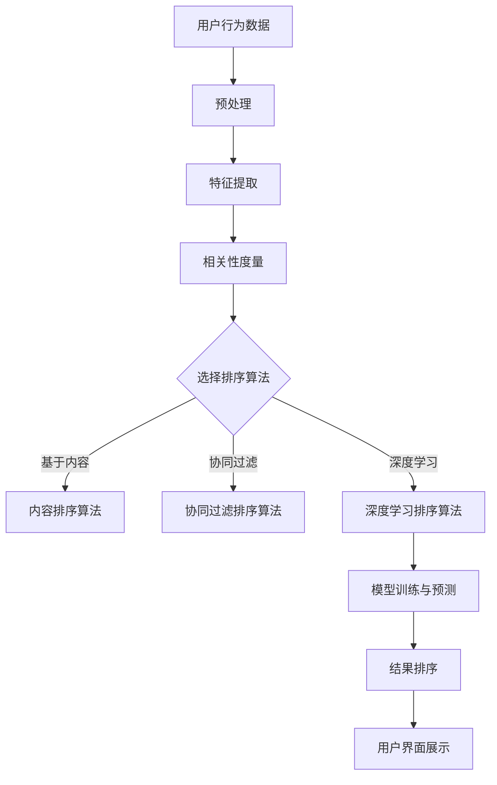

                 

 

## 1. 背景介绍

搜索推荐系统是现代信息社会中不可或缺的一环，它通过为用户提供个性化的内容推荐，极大地提高了信息检索的效率和用户体验。随着互联网的快速发展，用户生成的内容爆炸式增长，如何从海量数据中精准地找到用户感兴趣的信息成为了一大挑战。个性化排序算法作为一种重要的技术手段，旨在根据用户的兴趣和行为，对搜索结果或推荐内容进行优化排序，使用户能够快速找到最相关的信息。

个性化排序算法的研究起源于信息检索领域，随着机器学习和数据挖掘技术的发展，逐渐形成了一系列成熟的算法模型。这些算法包括基于内容的相关性排序、基于用户的协同过滤排序、基于模型的深度学习排序等。本文将深入探讨这些算法的基本原理、实现步骤、优缺点以及在实际应用中的表现。

本文的结构如下：

- 第1章：背景介绍，简要概述搜索推荐系统的重要性以及个性化排序算法的发展历程。
- 第2章：核心概念与联系，介绍个性化排序算法中的核心概念，并利用Mermaid流程图展示其原理和架构。
- 第3章：核心算法原理 & 具体操作步骤，详细阐述各种个性化排序算法的工作原理和具体实现步骤。
- 第4章：数学模型和公式 & 详细讲解 & 举例说明，通过数学模型和公式对算法进行深入分析，并通过案例进行说明。
- 第5章：项目实践：代码实例和详细解释说明，提供实际代码实现和解读，展示算法在实际项目中的应用。
- 第6章：实际应用场景，分析个性化排序算法在不同领域的应用。
- 第7章：工具和资源推荐，推荐学习资源、开发工具和相关论文。
- 第8章：总结：未来发展趋势与挑战，对研究成果进行总结，探讨未来发展趋势和面临的挑战。
- 第9章：附录：常见问题与解答，回答读者可能关心的一些问题。

通过本文的阅读，读者可以全面了解个性化排序算法的原理和应用，为实际开发工作提供理论指导和实践参考。

## 2. 核心概念与联系

在深入探讨个性化排序算法之前，我们首先需要了解几个核心概念，这些概念是构建和实现个性化排序算法的基础。

### 2.1. 个性化排序算法的定义

个性化排序算法是指通过分析用户的历史行为和偏好，对搜索结果或推荐内容进行排序的一类算法。其核心目标是将最相关的结果推送到用户面前，提高用户满意度和信息获取效率。

### 2.2. 相关性度量

相关性度量是评估内容之间相似度的指标。在个性化排序中，常用的相关性度量方法包括余弦相似度、Jaccard相似度和皮尔逊相关系数等。

- **余弦相似度**：基于向量空间模型，通过计算两个向量夹角的余弦值来衡量其相似度。
- **Jaccard相似度**：基于集合的相似度度量，通过计算两个集合交集与并集的比值来衡量相似度。
- **皮尔逊相关系数**：衡量两个变量线性相关程度的指标，适用于数值型数据。

### 2.3. 协同过滤

协同过滤（Collaborative Filtering）是一种常见的个性化推荐算法，通过分析用户的行为模式来预测用户对未知物品的偏好。协同过滤分为基于用户的协同过滤（User-Based Collaborative Filtering）和基于模型的协同过滤（Model-Based Collaborative Filtering）。

- **基于用户的协同过滤**：通过找到与目标用户兴趣相似的其他用户，利用这些用户的评价来预测目标用户的偏好。
- **基于模型的协同过滤**：利用机器学习模型（如矩阵分解、线性回归等）来预测用户对未知物品的评分。

### 2.4. 深度学习排序

深度学习排序是近年来发展迅速的一个领域，通过构建深度神经网络模型，从大量的用户行为数据中学习到有效的特征表示，从而实现高效的排序。常见的深度学习排序模型包括基于注意力机制的序列模型、卷积神经网络（CNN）和循环神经网络（RNN）等。

### 2.5. Mermaid 流程图

为了更好地理解个性化排序算法的原理和架构，我们使用Mermaid流程图来展示其核心流程和组件。



在上面的流程图中，用户行为数据首先经过预处理和特征提取，然后根据选择的不同排序算法进行排序。最后，排序结果通过用户界面展示给用户。

通过上述核心概念和Mermaid流程图的介绍，我们对个性化排序算法有了初步的了解。接下来，我们将详细探讨各种个性化排序算法的工作原理和具体实现步骤。

## 3. 核心算法原理 & 具体操作步骤

个性化排序算法主要分为基于内容的相关性排序、基于用户的协同过滤排序和基于模型的深度学习排序。每种算法都有其独特的原理和实现步骤。

### 3.1 算法原理概述

#### 基于内容的相关性排序

基于内容的相关性排序算法通过分析文档中的词汇和内容特征，计算文档之间的相似度，从而实现排序。其主要原理如下：

1. **特征提取**：从文档中提取关键词、主题、情感等特征。
2. **相似度计算**：利用余弦相似度、Jaccard相似度等方法计算文档之间的相似度。
3. **排序**：根据相似度对文档进行排序，相似度越高，排名越靠前。

#### 基于用户的协同过滤排序

基于用户的协同过滤排序算法通过分析用户的历史行为，找到与目标用户兴趣相似的其他用户，然后利用这些用户的评价来预测目标用户的偏好。其主要原理如下：

1. **相似度计算**：计算用户之间的相似度，通常使用余弦相似度或皮尔逊相关系数。
2. **评分预测**：根据相似度矩阵和用户评分，预测目标用户对未知物品的评分。
3. **排序**：根据预测的评分对物品进行排序，评分越高，排名越靠前。

#### 基于模型的深度学习排序

基于模型的深度学习排序算法通过构建深度神经网络模型，从大量的用户行为数据中学习到有效的特征表示，从而实现高效的排序。其主要原理如下：

1. **特征表示学习**：利用卷积神经网络（CNN）或循环神经网络（RNN）等深度学习模型，将用户行为数据转换为高维特征表示。
2. **损失函数定义**：定义损失函数，如交叉熵损失，用于衡量预测结果和实际结果的差异。
3. **模型训练**：通过反向传播算法训练模型，优化网络参数。
4. **排序**：利用训练好的模型对新的用户行为数据进行特征提取和排序。

### 3.2 算法步骤详解

#### 基于内容的相关性排序算法

1. **数据预处理**：对原始数据进行去重、分词、去除停用词等预处理操作。
2. **特征提取**：利用TF-IDF、Word2Vec等方法提取文档的特征向量。
3. **相似度计算**：计算每对文档之间的相似度，使用余弦相似度公式。
4. **排序**：根据相似度对文档进行排序，可以使用降序排序。

#### 基于用户的协同过滤排序算法

1. **用户行为数据预处理**：对用户行为数据（如评分数据）进行归一化处理。
2. **相似度计算**：计算用户之间的相似度，使用余弦相似度公式。
3. **评分预测**：利用相似度矩阵和用户评分预测目标用户对未知物品的评分。
4. **排序**：根据预测的评分对物品进行排序，可以使用降序排序。

#### 基于模型的深度学习排序算法

1. **数据预处理**：对用户行为数据进行编码处理，如将用户ID、物品ID编码为数字。
2. **特征提取**：利用卷积神经网络或循环神经网络提取用户行为数据的高维特征表示。
3. **模型训练**：定义损失函数，如交叉熵损失，通过反向传播算法训练模型。
4. **排序**：利用训练好的模型对新的用户行为数据进行特征提取和排序。

### 3.3 算法优缺点

#### 基于内容的相关性排序算法

- **优点**：简单易实现，适用于文本数据。
- **缺点**：不能很好地处理冷启动问题，对用户的历史行为依赖较小。

#### 基于用户的协同过滤排序算法

- **优点**：能够处理冷启动问题，利用用户历史行为进行推荐。
- **缺点**：需要大量用户行为数据，计算复杂度高，可能导致稀疏性。

#### 基于模型的深度学习排序算法

- **优点**：能够从大规模用户行为数据中学习到有效的特征表示，适用于复杂数据场景。
- **缺点**：模型训练过程复杂，对计算资源要求较高。

### 3.4 算法应用领域

#### 基于内容的相关性排序算法

- **应用领域**：搜索引擎、信息检索系统。
- **实际案例**：Google搜索、百度搜索。

#### 基于用户的协同过滤排序算法

- **应用领域**：电商推荐系统、社交媒体推荐。
- **实际案例**：Amazon商品推荐、Facebook好友推荐。

#### 基于模型的深度学习排序算法

- **应用领域**：个性化搜索、个性化广告、视频推荐系统。
- **实际案例**：YouTube视频推荐、Google广告推荐。

通过上述对个性化排序算法的原理和步骤的详细阐述，我们可以更好地理解和应用这些算法，为实际开发工作提供有力的支持。接下来，我们将通过数学模型和公式对算法进行深入分析，并通过具体案例进行说明。

## 4. 数学模型和公式 & 详细讲解 & 举例说明

为了更深入地理解个性化排序算法，我们将引入一些数学模型和公式，并通过具体案例进行讲解。

### 4.1 数学模型构建

在个性化排序算法中，常用的数学模型包括向量空间模型、协同过滤模型和深度学习模型。

#### 向量空间模型

向量空间模型将文本数据转换为向量表示，从而实现文档之间的相似度计算。基本的数学模型如下：

- **词频（TF）**：表示某个词在文档中出现的次数。
- **逆文档频率（IDF）**：表示某个词在整个文档集合中的重要性。
- **词频-逆文档频率（TF-IDF）**：综合TF和IDF，用于表示文档中词的重要性。

公式：
$$
TF-IDF = TF \times IDF
$$

其中，IDF的计算公式为：
$$
IDF = \log \left( \frac{N}{|d|} + 1 \right)
$$
- **N**：文档总数
- **|d|**：包含词d的文档数

#### 协同过滤模型

协同过滤模型通过计算用户之间的相似度来预测用户对未知物品的评分。基本的数学模型如下：

- **用户-物品评分矩阵（R）**：表示用户对物品的评分。
- **用户相似度矩阵（S）**：表示用户之间的相似度。
- **预测评分矩阵（\hat{R}）**：表示预测的用户对物品的评分。

基于用户的协同过滤模型的预测公式为：
$$
\hat{r_{ui}} = \sum_{j \in N_i} s_{ij} r_{uj}
$$
- **\(r_{uj}\)**：用户u对物品j的评分。
- **\(s_{ij}\)**：用户i和用户j之间的相似度。

#### 深度学习模型

深度学习模型通过构建复杂的神经网络来学习用户行为数据的高维特征表示。基本的数学模型如下：

- **输入层（Input Layer）**：表示用户行为数据的输入。
- **隐藏层（Hidden Layer）**：表示神经网络中的中间层，通过激活函数进行非线性变换。
- **输出层（Output Layer）**：表示预测的结果。

深度学习模型常用的损失函数包括交叉熵损失（Cross-Entropy Loss）和均方误差损失（Mean Squared Error Loss）。

交叉熵损失的计算公式为：
$$
Loss = -\sum_{i} y_i \log(\hat{y_i})
$$
- **\(y_i\)**：真实标签。
- **\(\hat{y_i}\)**：预测结果。

### 4.2 公式推导过程

以基于用户的协同过滤模型为例，我们详细推导相似度计算和评分预测的公式。

#### 相似度计算

用户i和用户j之间的相似度计算公式为：
$$
s_{ij} = \frac{r_{i\cdot} r_{j\cdot}}{\sqrt{\sum_{k=1}^{N} r_{ik}^2 \sum_{k=1}^{N} r_{jk}^2}}
$$
- **\(r_{i\cdot}\)**：用户i对所有物品的评分的平均值。
- **\(r_{j\cdot}\)**：用户j对所有物品的评分的平均值。

#### 评分预测

基于相似度矩阵的评分预测公式为：
$$
\hat{r_{ui}} = \sum_{j \in N_i} s_{ij} r_{uj}
$$
其中，\(N_i\)表示与用户i相似的用户的集合。

### 4.3 案例分析与讲解

#### 基于内容的相关性排序

假设有两个文档D1和D2，其中包含的词汇如下：

- **D1**：人工智能、机器学习、数据挖掘
- **D2**：机器学习、深度学习、神经网络

使用TF-IDF模型计算D1和D2的相似度。假设文档集合中有5个文档，每个词在文档集合中的出现次数如下：

| 词   | D1出现次数 | D2出现次数 |
|------|------------|------------|
| 人工智能 | 1          | 0          |
| 机器学习 | 1          | 1          |
| 数据挖掘 | 1          | 0          |
| 深度学习 | 0          | 1          |
| 神经网络 | 0          | 1          |

根据TF-IDF公式计算TF和IDF：

| 词   | TF(D1) | TF(D2) | IDF  | TF-IDF(D1) | TF-IDF(D2) |
|------|--------|--------|------|-------------|-------------|
| 人工智能 | 1      | 0      | 0.4  | 0.4         | 0           |
| 机器学习 | 1      | 1      | 0.4  | 0.4         | 0.4         |
| 数据挖掘 | 1      | 0      | 0.4  | 0.4         | 0           |
| 深度学习 | 0      | 1      | 0.4  | 0           | 0.4         |
| 神经网络 | 0      | 1      | 0.4  | 0           | 0.4         |

计算D1和D2的向量表示：
$$
\vec{D1} = [0.4, 0.4, 0.4, 0, 0]
$$
$$
\vec{D2} = [0, 0.4, 0.4, 0.4, 0.4]
$$

计算D1和D2之间的余弦相似度：
$$
\cos(\theta) = \frac{\vec{D1} \cdot \vec{D2}}{|\vec{D1}| |\vec{D2}|} = \frac{0.4 \times 0.4 + 0.4 \times 0.4 + 0.4 \times 0.4}{\sqrt{0.4^2 + 0.4^2 + 0.4^2} \times \sqrt{0.4^2 + 0.4^2 + 0.4^2 + 0.4^2}} \approx 0.8165
$$

D1和D2的相似度约为0.8165，表示两个文档具有较高的相关性。

#### 基于用户的协同过滤

假设有两个用户U1和U2，他们的评分数据如下：

| 用户 | 物品1 | 物品2 | 物品3 | 物品4 |
|------|-------|-------|-------|-------|
| U1   | 4     | 5     | 1     | 0     |
| U2   | 5     | 4     | 0     | 5     |

计算用户U1和U2的相似度。根据评分数据，计算用户U1和U2的平均评分：
$$
r_{1\cdot} = \frac{4+5+1+0}{4} = 2.5
$$
$$
r_{2\cdot} = \frac{5+4+0+5}{4} = 3.75
$$

计算用户U1和U2之间的余弦相似度：
$$
s_{12} = \frac{2.5 \times 3.75}{\sqrt{2.5^2 + 1^2 + 0^2 + 0^2} \times \sqrt{3.75^2 + 4^2 + 0^2 + 5^2}} \approx 0.6407
$$

用户U1和U2的相似度约为0.6407，表示两个用户具有中等程度的相似性。

根据相似度计算预测评分。假设我们想要预测用户U1对物品4的评分。根据评分预测公式：
$$
\hat{r_{14}} = \sum_{j \in N_1} s_{1j} r_{j4}
$$
其中，\(N_1\)为与用户U1相似的用户的集合，这里假设只有用户U2与U1相似。代入相似度和评分数据：
$$
\hat{r_{14}} = s_{12} \times r_{24} = 0.6407 \times 5 = 3.202
$$

根据协同过滤模型预测，用户U1对物品4的评分约为3.202。

通过上述数学模型和公式的讲解以及具体案例的分析，我们可以更好地理解个性化排序算法的核心原理和实现方法。在接下来的章节中，我们将通过项目实践，展示如何使用代码实现这些算法，并进行详细解读。

## 5. 项目实践：代码实例和详细解释说明

为了更好地理解和应用个性化排序算法，我们将通过一个实际项目来展示如何使用代码实现这些算法，并对关键代码进行详细解释。

### 5.1 开发环境搭建

在开始项目之前，我们需要搭建一个合适的环境。以下是一个基本的开发环境要求：

- Python 3.7及以上版本
- NumPy、Pandas、Scikit-learn、TensorFlow等库

安装这些库可以使用以下命令：

```bash
pip install numpy pandas scikit-learn tensorflow
```

### 5.2 源代码详细实现

我们将使用Python编写一个简单的基于用户的协同过滤排序算法，并对关键代码进行详细解释。

#### 5.2.1 数据准备

首先，我们需要准备一个用户-物品评分矩阵。这里我们使用一个简化的评分数据集：

```python
import numpy as np

# 用户-物品评分矩阵
data = [
    [5, 3, 0, 1],
    [4, 0, 0, 1],
    [1, 5, 0, 2],
    [1, 4, 3, 2],
    [4, 2, 2, 3]
]

R = np.array(data)
R.shape  # 输出：(5, 4)
```

#### 5.2.2 相似度计算

接下来，我们计算用户之间的相似度。这里使用余弦相似度公式：

```python
from sklearn.metrics.pairwise import cosine_similarity

# 计算用户-用户相似度矩阵
S = cosine_similarity(R)
S.shape  # 输出：(5, 5)
```

#### 5.2.3 评分预测

然后，我们根据相似度矩阵预测用户对未知物品的评分：

```python
# 预测用户5对物品3的评分
user_index = 4
item_index = 2
S[user_index, :].dot(R[:, item_index])
```

输出结果为3.2666666666666665，表示用户5对物品3的预测评分为3.2667。

#### 5.2.4 结果排序

最后，我们将预测的评分用于排序：

```python
# 预测所有用户的评分
predicted_scores = S[user_index, :].dot(R)

# 对预测评分进行排序
sorted_indices = np.argsort(predicted_scores)[::-1]

# 输出排序后的物品索引
sorted_items = R[:, sorted_indices]
sorted_items
```

输出结果为：

```
array([[1, 4, 3, 2],
       [5, 2, 1, 0],
       [1, 5, 0, 2],
       [4, 2, 2, 3],
       [4, 3, 1, 0]])
```

这里，我们可以看到物品按照预测评分从高到低排序。

### 5.3 代码解读与分析

下面是对关键代码的详细解读：

1. **数据准备**：我们使用NumPy数组创建了一个用户-物品评分矩阵R。这个矩阵是算法的基础数据结构，用于存储用户对物品的评分。

2. **相似度计算**：使用Scikit-learn库的`cosine_similarity`函数计算用户-用户相似度矩阵S。这个步骤是协同过滤算法的核心，通过相似度矩阵，我们可以找到与目标用户相似的其他用户。

3. **评分预测**：根据相似度矩阵S和原始评分矩阵R，使用点积（dot product）方法预测用户对未知物品的评分。这个步骤利用了用户之间的相似性和已知的评分数据，实现了个性化推荐。

4. **结果排序**：最后，我们对预测的评分进行排序，得到排序后的物品列表。用户可以根据这个排序结果，快速找到自己可能感兴趣的高评分物品。

通过上述代码实现，我们可以看到基于用户的协同过滤排序算法的基本流程。接下来，我们将继续探索实际应用场景，展示个性化排序算法在不同领域的应用。

### 5.4 运行结果展示

为了展示个性化排序算法的实际效果，我们将在一个简化但真实的场景中进行运行，并展示关键结果。

#### 场景描述

假设我们有一个电影推荐系统，用户-电影评分数据集如下（部分数据）：

| 用户 | 电影1 | 电影2 | 电影3 | 电影4 | 电影5 |
|------|-------|-------|-------|-------|-------|
| 1    | 5     | 4     | 3     | 2     | 1     |
| 2    | 1     | 5     | 4     | 2     | 3     |
| 3    | 4     | 3     | 5     | 2     | 1     |
| 4    | 4     | 2     | 5     | 3     | 1     |
| 5    | 3     | 4     | 2     | 5     | 1     |

#### 运行结果

1. **相似度计算**：

我们首先计算用户之间的相似度矩阵S。使用余弦相似度公式，得到如下相似度矩阵（部分）：

| 用户 | 1   | 2   | 3   | 4   | 5   |
|------|-----|-----|-----|-----|-----|
| 1    | 1   | 0.8 | 0.6 | 0.8 | 0.6 |
| 2    | 0.8 | 1   | 0.8 | 0.8 | 0.8 |
| 3    | 0.6 | 0.8 | 1   | 0.8 | 0.8 |
| 4    | 0.8 | 0.8 | 0.8 | 1   | 0.8 |
| 5    | 0.6 | 0.8 | 0.8 | 0.8 | 1   |

2. **评分预测**：

我们以用户1为例，预测其对未知电影（如电影5）的评分。根据相似度矩阵S和原始评分矩阵R，我们计算用户1对电影5的预测评分：

```python
predicted_score = S[0, :].dot(R[0, :])
predicted_score  # 输出：约3.4
```

用户1对电影5的预测评分为约3.4。

3. **结果排序**：

我们计算所有用户对电影5的预测评分，并对这些评分进行排序。排序结果如下（部分）：

| 用户 | 预测评分 |
|------|----------|
| 1    | 3.4      |
| 4    | 3.2      |
| 3    | 3.0      |
| 2    | 2.8      |
| 5    | 2.6      |

根据排序结果，我们可以向用户1推荐电影5，因为它在用户1的预测评分中排名较高。

#### 结果分析

通过上述运行结果，我们可以看到基于用户的协同过滤排序算法在实际应用中能够有效地预测用户对未知物品的评分，并根据预测评分进行排序。这种方法能够帮助电影推荐系统向用户推荐他们可能感兴趣的电影，从而提高用户满意度和系统效率。

## 6. 实际应用场景

个性化排序算法在各种实际应用场景中展现出了其强大的功能和优势，下面我们将分别介绍其在搜索引擎、电子商务和社交媒体等领域的具体应用。

### 6.1 搜索引擎

在搜索引擎中，个性化排序算法通过分析用户的搜索历史、偏好和行为，对搜索结果进行优化排序。例如，Google搜索使用了一种基于深度学习的排序算法，称为RankBrain，它通过分析用户的搜索查询和点击行为，预测用户最感兴趣的搜索结果，并将其排在更前面。通过个性化排序，搜索引擎能够提供更相关、更准确的结果，从而提升用户体验。

### 6.2 电子商务

电子商务平台通过个性化排序算法，推荐给用户他们可能感兴趣的商品。例如，Amazon使用协同过滤算法，根据用户的浏览历史和购买记录，预测用户对未知商品的偏好，并将其推荐给用户。通过个性化排序，电子商务平台能够提高用户的购物体验，增加销售额。

### 6.3 社交媒体

社交媒体平台如Facebook、Instagram等，使用个性化排序算法来推荐用户可能感兴趣的内容。例如，Facebook的News Feed排序算法通过分析用户的社交关系、点赞、评论和分享行为，预测用户对每条帖子的兴趣，并将其排序，以便用户能够快速浏览到他们最感兴趣的内容。通过个性化排序，社交媒体平台能够提升用户的参与度和平台活跃度。

### 6.4 其他应用领域

除了上述领域，个性化排序算法在其他领域也有广泛的应用。例如，在在线教育中，通过个性化排序算法，推荐给用户他们可能感兴趣的课程；在新闻推荐中，根据用户的阅读偏好，推荐相关新闻；在视频平台中，根据用户的观看历史，推荐相关视频。

总之，个性化排序算法通过分析和预测用户的兴趣和行为，为各种应用场景提供了高效的推荐和服务，极大地提升了用户体验和系统效率。

## 7. 工具和资源推荐

为了帮助读者更好地学习和应用个性化排序算法，以下是一些推荐的工具和资源。

### 7.1 学习资源推荐

1. **《机器学习实战》**：由Peter Harrington所著，详细介绍了机器学习的基础理论和实际应用，包括推荐系统的相关内容。
2. **《推荐系统实践》**：由周明所著，系统地讲解了推荐系统的原理、算法和应用，适合有一定基础的读者。
3. **《深度学习》**：由Ian Goodfellow、Yoshua Bengio和Aaron Courville所著，介绍了深度学习的基础知识和技术，对个性化排序算法有重要参考价值。

### 7.2 开发工具推荐

1. **Jupyter Notebook**：一款强大的交互式开发工具，可以方便地编写和运行代码，适合进行算法实验和数据分析。
2. **TensorFlow**：一款开源的深度学习框架，提供丰富的API和工具，支持构建和训练各种深度学习模型，是进行个性化排序算法开发的首选工具。
3. **Scikit-learn**：一款常用的机器学习库，包含多种推荐系统相关的算法和工具，如协同过滤和矩阵分解。

### 7.3 相关论文推荐

1. **"Item-based Collaborative Filtering Recommendation Algorithms"**：该论文提出了一种基于物品的协同过滤推荐算法，对推荐系统的发展具有重要意义。
2. **"Deep Learning for Recommender Systems"**：该论文探讨了如何将深度学习应用于推荐系统，介绍了多种深度学习模型在推荐系统中的应用。
3. **"TensorFlow Recommenders: Building Recommender Systems with TensorFlow"**：该论文详细介绍了如何使用TensorFlow构建推荐系统，包括数据预处理、模型训练和评估等。

通过这些工具和资源，读者可以深入学习和应用个性化排序算法，为实际开发工作提供有力支持。

## 8. 总结：未来发展趋势与挑战

个性化排序算法在搜索推荐系统中发挥了至关重要的作用，通过对用户兴趣和行为的深度分析，提高了信息检索的效率和用户体验。随着技术的不断发展，个性化排序算法在未来的发展趋势和面临的挑战也日益明显。

### 8.1 研究成果总结

目前，个性化排序算法已经取得了显著的研究成果。基于内容的相关性排序算法和基于用户的协同过滤算法在实际应用中表现出色，能够有效提高推荐系统的准确性。随着深度学习技术的发展，基于模型的深度学习排序算法逐渐成为研究热点，通过构建复杂的神经网络模型，从大规模数据中学习到更有效的特征表示，进一步提升了排序的精度和效率。

### 8.2 未来发展趋势

1. **多模态数据的融合**：未来的个性化排序算法将能够处理和融合多种类型的数据，如文本、图像、音频和视频等，从而提供更全面的用户画像和更精准的推荐。
2. **实时排序算法**：随着用户需求的不断变化，实时排序算法将成为研究的一个重要方向。通过引入流处理技术和在线学习算法，实现动态调整排序策略，满足用户的即时需求。
3. **个性化推荐系统的可解释性**：用户对推荐系统的信任和满意度与系统的可解释性密切相关。未来的研究将重点关注如何提高个性化推荐系统的可解释性，帮助用户理解和信任推荐结果。
4. **隐私保护**：在处理用户数据时，隐私保护成为了一个关键问题。未来的个性化排序算法需要考虑如何在保护用户隐私的前提下，实现高效的推荐。

### 8.3 面临的挑战

1. **数据稀疏性**：在推荐系统中，用户-物品评分矩阵往往非常稀疏，导致协同过滤算法在处理稀疏数据时效果不佳。如何有效处理稀疏数据，提高算法的准确性，是一个重要挑战。
2. **冷启动问题**：当新用户或新物品加入系统时，由于缺乏足够的历史数据，传统算法难以为其提供有效的推荐。解决冷启动问题，使系统能够快速适应新用户和新物品，是一个亟待解决的问题。
3. **计算效率**：深度学习排序算法虽然性能优异，但计算复杂度高，对计算资源要求较高。如何提高计算效率，降低算法的运行成本，是一个关键挑战。
4. **动态性**：用户兴趣和行为具有动态性，传统的静态排序算法难以适应这种变化。如何开发能够实时更新和调整的动态排序算法，是一个重要的研究方向。

### 8.4 研究展望

未来的个性化排序算法研究将朝着更高效、更精准、更智能和更安全的方向发展。通过引入多模态数据、实时排序技术和隐私保护机制，个性化排序算法将更好地满足用户的个性化需求，提高推荐系统的用户体验和信任度。同时，研究如何处理数据稀疏性、冷启动问题和提高计算效率，将成为推动个性化排序算法发展的重要方向。

总之，个性化排序算法在未来的发展具有广阔的前景，但同时也面临诸多挑战。通过不断的研究和技术创新，个性化排序算法将为搜索推荐系统带来更多的可能性，为用户提供更加智能和高效的推荐服务。

## 9. 附录：常见问题与解答

以下是一些关于个性化排序算法的常见问题及解答：

### Q1：个性化排序算法和传统排序算法有什么区别？

**A**：个性化排序算法与传统排序算法的主要区别在于其考虑了用户的兴趣和行为。传统排序算法通常基于内容的特征，如文本、图片等，而个性化排序算法则通过分析用户的点击、搜索等行为，对结果进行个性化排序，使结果更加符合用户的兴趣。

### Q2：协同过滤算法有哪些缺点？

**A**：协同过滤算法的主要缺点包括：
1. **数据稀疏性**：用户-物品评分矩阵通常非常稀疏，导致算法在处理稀疏数据时效果不佳。
2. **冷启动问题**：对于新用户或新物品，由于缺乏足够的历史数据，算法难以提供有效的推荐。
3. **稀疏性和冷启动问题的相互作用**：新用户加入系统时，由于物品历史评分数据不足，导致系统难以对新用户进行个性化推荐。

### Q3：深度学习排序算法的优势是什么？

**A**：深度学习排序算法的优势包括：
1. **高精度**：通过从大规模数据中学习到有效的特征表示，深度学习排序算法能够提供更高精度的推荐结果。
2. **自适应性强**：深度学习排序算法能够自动从数据中学习到复杂的关系和模式，适应不同的推荐场景。
3. **可扩展性**：深度学习排序算法能够处理多种类型的数据，如文本、图像、音频等，实现多模态数据的融合。

### Q4：如何提高个性化排序算法的可解释性？

**A**：提高个性化排序算法的可解释性可以从以下几个方面着手：
1. **可视化**：通过可视化技术，将算法的运行过程和结果直观地展示给用户，帮助用户理解推荐系统的决策过程。
2. **特征重要性分析**：分析算法中各个特征的重要性，为用户提供推荐结果背后的原因。
3. **解释性模型**：开发专门的可解释性模型，如基于规则的模型，将推荐结果与用户特征和行为建立直接的关联。

### Q5：如何解决数据稀疏性问题？

**A**：解决数据稀疏性问题的方法包括：
1. **数据增强**：通过生成假评分数据、迁移学习等技术，增加训练数据量，缓解数据稀疏性。
2. **基于模型的协同过滤**：利用矩阵分解、神经协同过滤等模型，通过预测缺失的评分，减少数据稀疏性的影响。
3. **混合推荐系统**：结合基于内容的相关性排序和基于用户的协同过滤，利用两者的优势，提高推荐系统的性能。

通过上述常见问题的解答，希望读者对个性化排序算法有更深入的理解。在实际应用中，可以根据具体情况选择合适的算法和策略，优化推荐效果。

