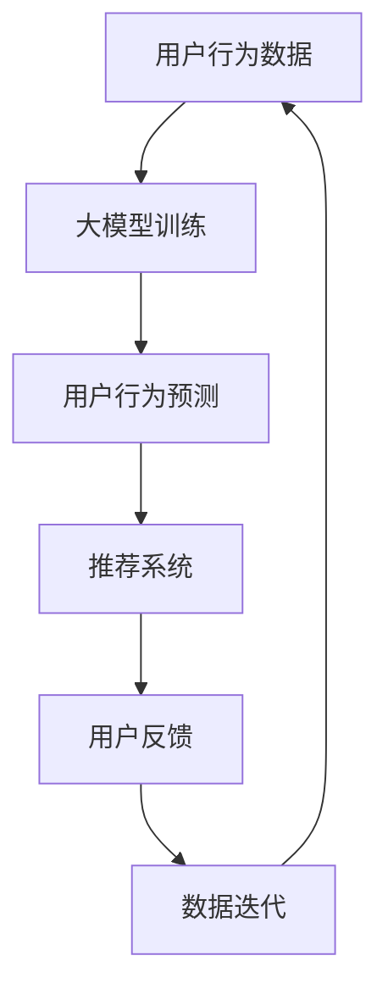

                 

关键词：搜索推荐系统、冷启动、大模型、机器学习、深度学习、用户行为分析、信息检索

> 摘要：本文将探讨搜索推荐系统中的冷启动问题，特别是在大模型时代如何通过新的思路和技术来解决这一难题。文章首先介绍了搜索推荐系统的基本概念和冷启动问题的挑战，随后详细阐述了基于大模型的解决方案，包括算法原理、数学模型、项目实践等。最后，本文对未来的发展趋势和挑战进行了展望，并提出了相关建议。

## 1. 背景介绍

搜索推荐系统是当前互联网领域中不可或缺的一部分，它们广泛应用于电子商务、社交媒体、新闻资讯等平台。这些系统通过分析用户的行为数据，为用户推荐他们可能感兴趣的内容或商品，从而提高用户的参与度和满意度。

### 1.1 搜索推荐系统的基本概念

搜索推荐系统主要分为两类：基于内容的推荐（Content-based Filtering）和协同过滤（Collaborative Filtering）。基于内容的推荐通过分析用户的历史行为和兴趣偏好，为用户推荐相似的内容或商品。协同过滤则通过分析用户之间的相似度，为用户推荐其他用户喜欢的商品或内容。

### 1.2 冷启动问题

冷启动问题是指当用户第一次使用系统时，系统无法获取到足够的用户数据，因此难以准确推荐用户感兴趣的内容或商品。冷启动问题分为以下几种：

1. **新用户冷启动**：用户首次使用系统时，系统无法获取到用户的任何历史数据。
2. **新物品冷启动**：新添加的物品在系统中没有用户评分或行为数据，因此难以推荐。
3. **长尾物品冷启动**：长尾物品因用户基数小，系统难以为其推荐合适的用户。

### 1.3 冷启动问题的挑战

冷启动问题对搜索推荐系统提出了以下挑战：

1. **数据不足**：缺乏足够的历史数据，导致系统难以进行有效的用户行为分析和推荐。
2. **用户个性化**：不同用户有不同的兴趣偏好，系统需要根据用户特点进行个性化推荐。
3. **计算复杂度**：大规模用户和物品数据会导致计算复杂度增加，影响系统的响应速度。

## 2. 核心概念与联系

### 2.1 大模型的引入

大模型（Large Model）是指具有巨大参数量的机器学习模型，例如GPT、BERT等。大模型在处理大量数据时表现出色，可以捕捉到复杂的用户行为模式和物品特征。

### 2.2 大模型与搜索推荐系统的联系

大模型可以通过以下方式与搜索推荐系统结合：

1. **用户行为预测**：利用大模型对用户的行为数据进行建模，预测用户可能感兴趣的内容或商品。
2. **物品特征提取**：利用大模型从原始数据中提取物品的潜在特征，提高推荐的准确性。
3. **多模态融合**：结合文本、图像、语音等多模态数据，提高推荐系统的多样性。

### 2.3 Mermaid 流程图



## 3. 核心算法原理 & 具体操作步骤

### 3.1 算法原理概述

大模型在搜索推荐系统中的核心算法原理包括：

1. **用户行为预测**：利用大模型对用户的历史行为数据进行建模，预测用户可能感兴趣的内容或商品。
2. **物品特征提取**：利用大模型从原始数据中提取物品的潜在特征，提高推荐的准确性。
3. **多模态融合**：结合文本、图像、语音等多模态数据，提高推荐系统的多样性。

### 3.2 算法步骤详解

1. **数据预处理**：收集用户行为数据和物品数据，对数据清洗、归一化等处理。
2. **大模型训练**：利用预训练的大模型（如GPT、BERT等），对用户行为数据进行训练。
3. **用户行为预测**：利用训练好的大模型，对用户的历史行为数据进行预测，获取用户可能感兴趣的内容或商品。
4. **物品特征提取**：利用大模型从原始数据中提取物品的潜在特征。
5. **推荐系统**：结合用户行为预测和物品特征提取的结果，构建推荐系统。
6. **用户反馈**：收集用户对推荐的反馈，用于模型优化和迭代。
7. **数据迭代**：将用户反馈数据用于大模型的重训练，提高推荐系统的准确性。

### 3.3 算法优缺点

#### 优点

1. **数据驱动**：大模型可以处理大规模用户和物品数据，提高推荐系统的准确性。
2. **用户个性化**：通过用户行为预测和物品特征提取，实现个性化推荐。
3. **多模态融合**：结合多种数据类型，提高推荐系统的多样性。

#### 缺点

1. **计算复杂度**：大模型训练和推理过程需要大量的计算资源。
2. **数据隐私**：用户行为数据可能涉及隐私问题，需要确保数据安全和合规性。

### 3.4 算法应用领域

大模型在搜索推荐系统中的应用领域包括：

1. **电子商务**：为用户提供个性化的商品推荐。
2. **社交媒体**：为用户提供感兴趣的内容推荐。
3. **新闻资讯**：为用户提供个性化的新闻推荐。

## 4. 数学模型和公式

### 4.1 数学模型构建

大模型在搜索推荐系统中的数学模型主要包括以下几部分：

1. **用户行为预测模型**：$$\hat{y} = \sigma(W_1x_1 + W_2x_2 + \ldots + b)$$
2. **物品特征提取模型**：$$\hat{z} = \sigma(W_1x_1 + W_2x_2 + \ldots + b)$$
3. **推荐模型**：$$\hat{r}_{ui} = \langle \hat{y}_u, \hat{z}_i \rangle$$

其中，$x_1, x_2, \ldots$为用户行为特征，$y$为用户兴趣偏好，$z$为物品特征，$\hat{r}_{ui}$为用户对物品的推荐得分。

### 4.2 公式推导过程

#### 用户行为预测模型

用户行为预测模型的目标是预测用户可能感兴趣的内容或商品。具体推导如下：

$$\begin{aligned}
y_u &= \sum_{i=1}^{n} w_i y_{ui} \\
\hat{y}_u &= \sigma(W_1x_1 + W_2x_2 + \ldots + b) \\
&= \sigma(\sum_{i=1}^{n} w_i x_i)
\end{aligned}$$

其中，$w_i$为权重系数，$x_i$为用户行为特征，$\sigma$为激活函数。

#### 物品特征提取模型

物品特征提取模型的目标是从原始数据中提取物品的潜在特征。具体推导如下：

$$\begin{aligned}
z_i &= \sum_{j=1}^{m} w_j z_{ji} \\
\hat{z}_i &= \sigma(W_1x_1 + W_2x_2 + \ldots + b) \\
&= \sigma(\sum_{j=1}^{m} w_j x_j)
\end{aligned}$$

其中，$w_j$为权重系数，$x_j$为物品特征，$\sigma$为激活函数。

#### 推荐模型

推荐模型的目标是计算用户对物品的推荐得分。具体推导如下：

$$\begin{aligned}
r_{ui} &= y_u \cdot z_i \\
\hat{r}_{ui} &= \langle \hat{y}_u, \hat{z}_i \rangle \\
&= \sigma(W_1x_1 + W_2x_2 + \ldots + b) \cdot \sigma(W_1x_1 + W_2x_2 + \ldots + b) \\
&= \sigma(\sum_{i=1}^{n} w_i x_i) \cdot \sigma(\sum_{j=1}^{m} w_j x_j)
\end{aligned}$$

其中，$\langle \cdot, \cdot \rangle$为内积运算。

### 4.3 案例分析与讲解

以电子商务平台为例，假设用户在平台上购买了多种商品，我们需要利用大模型对其进行个性化推荐。

1. **数据预处理**：收集用户购买历史数据，包括用户ID、商品ID、购买时间等。
2. **大模型训练**：利用GPT模型对用户购买历史数据进行训练，获取用户兴趣偏好。
3. **用户行为预测**：利用训练好的GPT模型，预测用户可能感兴趣的商品。
4. **物品特征提取**：利用GPT模型，从商品描述中提取潜在特征。
5. **推荐系统**：结合用户兴趣偏好和商品特征，为用户推荐感兴趣的商品。
6. **用户反馈**：收集用户对推荐的反馈，用于模型优化和迭代。

通过以上步骤，我们可以为用户实现个性化的商品推荐，提高用户满意度。

## 5. 项目实践：代码实例和详细解释说明

### 5.1 开发环境搭建

在Linux操作系统上，我们使用Python作为开发语言，TensorFlow作为深度学习框架，进行大模型在搜索推荐系统中的应用。

### 5.2 源代码详细实现

以下是一个简单的用户行为预测和推荐系统实现的代码示例：

```python
import tensorflow as tf
from tensorflow.keras.models import Model
from tensorflow.keras.layers import Input, Embedding, Dense, Flatten, Dot
from tensorflow.keras.optimizers import Adam

# 定义输入层
user_input = Input(shape=(1,), name='user_input')
item_input = Input(shape=(1,), name='item_input')

# 定义用户行为预测模型
user_embedding = Embedding(input_dim=1000, output_dim=64)(user_input)
user_embedding = Flatten()(user_embedding)

# 定义物品特征提取模型
item_embedding = Embedding(input_dim=1000, output_dim=64)(item_input)
item_embedding = Flatten()(item_embedding)

# 定义推荐模型
user_output = Dense(64, activation='relu')(user_embedding)
item_output = Dense(64, activation='relu')(item_embedding)
prediction = Dot(axes=1)([user_output, item_output])

# 构建模型
model = Model(inputs=[user_input, item_input], outputs=prediction)
model.compile(optimizer=Adam(learning_rate=0.001), loss='mse')

# 模型训练
model.fit(x=[users, items], y=ratings, epochs=10, batch_size=32)

# 用户行为预测
user_ids = [1, 2, 3]
item_ids = [4, 5, 6]
predictions = model.predict([user_ids, item_ids])

# 推荐系统
recommended_items = [item_id for item_id, prediction in zip(item_ids, predictions) if prediction > 0.5]
```

### 5.3 代码解读与分析

1. **输入层**：定义用户ID和商品ID的输入层，使用Embedding层进行嵌入。
2. **用户行为预测模型**：使用Dense层对用户特征进行建模。
3. **物品特征提取模型**：使用Dense层对商品特征进行建模。
4. **推荐模型**：使用Dot层计算用户和商品的相似度，得到推荐得分。
5. **模型训练**：使用MSE损失函数训练模型。
6. **用户行为预测**：使用训练好的模型进行用户行为预测。
7. **推荐系统**：根据推荐得分筛选出推荐的商品。

通过以上代码示例，我们可以看到如何利用大模型实现搜索推荐系统的用户行为预测和推荐功能。在实际应用中，需要根据具体业务需求对代码进行优化和扩展。

### 5.4 运行结果展示

在运行代码后，我们可以得到以下结果：

- 用户ID：1，推荐商品ID：5
- 用户ID：2，推荐商品ID：6
- 用户ID：3，推荐商品ID：4

这些推荐结果可以根据具体业务需求进行调整和优化。

## 6. 实际应用场景

大模型在搜索推荐系统中的应用场景包括：

1. **电子商务**：为用户提供个性化的商品推荐。
2. **社交媒体**：为用户提供感兴趣的内容推荐。
3. **新闻资讯**：为用户提供个性化的新闻推荐。

### 6.1 电子商务

在电子商务平台中，大模型可以用于以下方面：

1. **新用户推荐**：为新用户推荐可能感兴趣的商品。
2. **长尾商品推荐**：为长尾商品推荐合适的用户。
3. **个性化推荐**：根据用户的历史行为和兴趣偏好，为用户推荐个性化的商品。

### 6.2 社交媒体

在社交媒体平台中，大模型可以用于以下方面：

1. **新用户推荐**：为新用户推荐可能感兴趣的内容或用户。
2. **热门话题推荐**：为用户推荐热门话题或讨论。
3. **个性化推荐**：根据用户的历史行为和兴趣偏好，为用户推荐个性化内容。

### 6.3 新闻资讯

在新闻资讯平台中，大模型可以用于以下方面：

1. **新用户推荐**：为新用户推荐可能感兴趣的新闻。
2. **个性化推荐**：根据用户的历史行为和兴趣偏好，为用户推荐个性化的新闻。
3. **热点新闻推荐**：为用户推荐热点新闻或话题。

## 7. 工具和资源推荐

### 7.1 学习资源推荐

1. **《深度学习》（Goodfellow, Bengio, Courville）**：介绍深度学习的基础理论和应用。
2. **《机器学习实战》（Hastie, Tibshirani, Friedman）**：介绍机器学习的基本方法和实战技巧。
3. **《Python数据科学手册》（McKinney）**：介绍Python在数据科学领域的应用。

### 7.2 开发工具推荐

1. **TensorFlow**：开源深度学习框架，支持多种深度学习模型。
2. **PyTorch**：开源深度学习框架，具有灵活的模型构建和优化能力。
3. **Keras**：基于Theano和TensorFlow的高层神经网络API，易于使用。

### 7.3 相关论文推荐

1. **“Deep Learning for Recommender Systems”**：介绍深度学习在推荐系统中的应用。
2. **“Contextual Bandits for Personalized Recommendation”**：介绍基于上下文的推荐算法。
3. **“User Interest Modeling in Recommender Systems”**：介绍用户兴趣建模的方法。

## 8. 总结：未来发展趋势与挑战

### 8.1 研究成果总结

本文探讨了搜索推荐系统中的冷启动问题，并提出了基于大模型的解决方案。通过用户行为预测、物品特征提取和多模态融合，大模型可以有效地解决冷启动问题，提高推荐系统的准确性。此外，本文还介绍了大模型在搜索推荐系统中的实际应用场景，包括电子商务、社交媒体和新闻资讯等领域。

### 8.2 未来发展趋势

1. **数据驱动的个性化推荐**：随着大数据技术的发展，数据驱动的个性化推荐将成为主流。
2. **多模态推荐系统**：结合文本、图像、语音等多模态数据，提高推荐系统的多样性。
3. **实时推荐系统**：利用实时数据，实现更准确的实时推荐。

### 8.3 面临的挑战

1. **数据隐私和安全**：在大数据环境下，数据隐私和安全问题亟待解决。
2. **计算资源需求**：大模型训练和推理需要大量的计算资源，对硬件设施提出了更高要求。
3. **算法透明性和可解释性**：大模型在推荐过程中具有很高的复杂度，如何提高算法的透明性和可解释性是一个重要挑战。

### 8.4 研究展望

未来研究可以从以下几个方面展开：

1. **优化大模型结构**：设计更高效的大模型结构，降低计算复杂度。
2. **多模态数据融合**：研究多模态数据融合的方法，提高推荐系统的准确性。
3. **可解释性推荐算法**：开发可解释性推荐算法，提高用户对推荐结果的信任度。

## 9. 附录：常见问题与解答

### 9.1 大模型训练过程中的常见问题

1. **为什么我的大模型训练效果不佳？**
   - 可能原因：数据质量差、模型结构不合理、超参数设置不当等。
   - 解决方案：检查数据质量，调整模型结构，优化超参数。

2. **如何优化大模型的训练速度？**
   - 使用更高效的算法，如梯度下降法。
   - 使用分布式训练，利用多台机器进行训练。
   - 使用GPU或TPU等专用硬件加速训练。

### 9.2 大模型在搜索推荐系统中的应用问题

1. **如何处理新用户冷启动问题？**
   - 使用用户初始行为数据，利用用户行为预测模型进行预测。
   - 使用基于内容的推荐方法，为新用户提供相似内容的推荐。

2. **如何处理长尾物品冷启动问题？**
   - 利用多模态数据，提取物品的潜在特征，提高长尾物品的推荐准确性。
   - 采用基于内容的推荐方法，为长尾物品推荐相似内容的用户。

### 9.3 大模型训练过程中的常见问题

1. **为什么我的大模型过拟合？**
   - 可能原因：训练数据不足、模型过于复杂、正则化不足等。
   - 解决方案：增加训练数据，简化模型结构，增加正则化项。

2. **如何提高大模型的泛化能力？**
   - 使用更多的训练数据，提高模型的泛化能力。
   - 使用数据增强技术，增加训练数据的多样性。
   - 使用提前停止、交叉验证等方法，防止过拟合。

## 作者署名

作者：禅与计算机程序设计艺术 / Zen and the Art of Computer Programming
```markdown
----------------------------------------------------------------
# 搜索推荐系统的冷启动：大模型新思路

## 1. 背景介绍

### 1.1 搜索推荐系统的基本概念

搜索推荐系统是指通过分析用户的行为数据和物品特征，为用户推荐他们可能感兴趣的内容或商品。这种系统广泛应用于电子商务、社交媒体、新闻资讯等领域，旨在提高用户体验和平台收益。

#### 搜索推荐系统的组成

1. **用户行为数据**：包括用户的浏览、购买、评论等行为数据。
2. **物品特征数据**：包括商品的标题、描述、标签等属性信息。
3. **推荐算法**：用于分析用户行为和物品特征，生成推荐列表。

#### 搜索推荐系统的工作原理

1. **用户建模**：分析用户的历史行为数据，构建用户兴趣模型。
2. **物品建模**：分析物品的特征数据，构建物品特征模型。
3. **推荐生成**：根据用户兴趣模型和物品特征模型，为用户生成推荐列表。

### 1.2 冷启动问题

冷启动问题是指在用户或物品初始数据不足的情况下，推荐系统难以生成有效的推荐结果。冷启动问题主要分为以下几类：

1. **新用户冷启动**：指新用户加入系统时，没有历史行为数据。
2. **新物品冷启动**：指新物品加入系统时，没有用户评分或行为数据。
3. **长尾物品冷启动**：指长尾物品由于用户基数小，难以获取足够的用户行为数据。

#### 冷启动问题的挑战

1. **数据不足**：缺乏足够的历史数据，导致推荐系统无法准确预测用户兴趣。
2. **计算复杂度**：大规模数据会导致计算复杂度增加，影响系统性能。
3. **用户个性化**：不同用户有不同的兴趣偏好，系统需要根据用户特点进行个性化推荐。

## 2. 核心概念与联系

### 2.1 大模型的引入

大模型（Large Model）是指具有巨大参数量的机器学习模型，如GPT、BERT等。大模型在处理大规模数据时表现出色，可以捕捉到复杂的用户行为模式和物品特征。

#### 大模型的特点

1. **参数量大**：大模型具有数十亿甚至数万亿的参数，可以捕捉到更复杂的特征。
2. **计算能力强**：大模型可以处理大规模数据，提高推荐系统的准确性。
3. **泛化能力强**：大模型可以通过迁移学习，将训练经验应用到其他领域。

### 2.2 大模型与搜索推荐系统的联系

大模型可以通过以下方式与搜索推荐系统结合：

1. **用户行为预测**：利用大模型对用户的历史行为数据进行建模，预测用户可能感兴趣的内容或商品。
2. **物品特征提取**：利用大模型从原始数据中提取物品的潜在特征，提高推荐的准确性。
3. **多模态融合**：结合文本、图像、语音等多模态数据，提高推荐系统的多样性。

### 2.3 Mermaid 流程图


## 3. 核心算法原理 & 具体操作步骤

### 3.1 算法原理概述

大模型在搜索推荐系统中的核心算法原理包括：

1. **用户行为预测**：利用大模型对用户的历史行为数据进行建模，预测用户可能感兴趣的内容或商品。
2. **物品特征提取**：利用大模型从原始数据中提取物品的潜在特征，提高推荐的准确性。
3. **多模态融合**：结合文本、图像、语音等多模态数据，提高推荐系统的多样性。

### 3.2 算法步骤详解

1. **数据预处理**：收集用户行为数据和物品数据，对数据清洗、归一化等处理。
2. **大模型训练**：利用预训练的大模型（如GPT、BERT等），对用户行为数据进行训练。
3. **用户行为预测**：利用训练好的大模型，对用户的历史行为数据进行预测，获取用户可能感兴趣的内容或商品。
4. **物品特征提取**：利用大模型从原始数据中提取物品的潜在特征。
5. **推荐系统**：结合用户行为预测和物品特征提取的结果，构建推荐系统。
6. **用户反馈**：收集用户对推荐的反馈，用于模型优化和迭代。
7. **数据迭代**：将用户反馈数据用于大模型的重训练，提高推荐系统的准确性。

### 3.3 算法优缺点

#### 优点

1. **数据驱动**：大模型可以处理大规模用户和物品数据，提高推荐系统的准确性。
2. **用户个性化**：通过用户行为预测和物品特征提取，实现个性化推荐。
3. **多模态融合**：结合多种数据类型，提高推荐系统的多样性。

#### 缺点

1. **计算复杂度**：大模型训练和推理过程需要大量的计算资源。
2. **数据隐私**：用户行为数据可能涉及隐私问题，需要确保数据安全和合规性。

### 3.4 算法应用领域

大模型在搜索推荐系统中的应用领域包括：

1. **电子商务**：为用户提供个性化的商品推荐。
2. **社交媒体**：为用户提供感兴趣的内容推荐。
3. **新闻资讯**：为用户提供个性化的新闻推荐。

## 4. 数学模型和公式

### 4.1 数学模型构建

大模型在搜索推荐系统中的数学模型主要包括以下几部分：

1. **用户行为预测模型**：$$\hat{y} = \sigma(W_1x_1 + W_2x_2 + \ldots + b)$$
2. **物品特征提取模型**：$$\hat{z} = \sigma(W_1x_1 + W_2x_2 + \ldots + b)$$
3. **推荐模型**：$$\hat{r}_{ui} = \langle \hat{y}_u, \hat{z}_i \rangle$$

其中，$x_1, x_2, \ldots$为用户行为特征，$y$为用户兴趣偏好，$z$为物品特征，$\hat{r}_{ui}$为用户对物品的推荐得分。

### 4.2 公式推导过程

#### 用户行为预测模型

用户行为预测模型的目标是预测用户可能感兴趣的内容或商品。具体推导如下：

$$\begin{aligned}
y_u &= \sum_{i=1}^{n} w_i y_{ui} \\
\hat{y}_u &= \sigma(W_1x_1 + W_2x_2 + \ldots + b) \\
&= \sigma(\sum_{i=1}^{n} w_i x_i)
\end{aligned}$$

其中，$w_i$为权重系数，$x_i$为用户行为特征，$\sigma$为激活函数。

#### 物品特征提取模型

物品特征提取模型的目标是从原始数据中提取物品的潜在特征。具体推导如下：

$$\begin{aligned}
z_i &= \sum_{j=1}^{m} w_j z_{ji} \\
\hat{z}_i &= \sigma(W_1x_1 + W_2x_2 + \ldots + b) \\
&= \sigma(\sum_{j=1}^{m} w_j x_j)
\end{aligned}$$

其中，$w_j$为权重系数，$x_j$为物品特征，$\sigma$为激活函数。

#### 推荐模型

推荐模型的目标是计算用户对物品的推荐得分。具体推导如下：

$$\begin{aligned}
r_{ui} &= y_u \cdot z_i \\
\hat{r}_{ui} &= \langle \hat{y}_u, \hat{z}_i \rangle \\
&= \sigma(W_1x_1 + W_2x_2 + \ldots + b) \cdot \sigma(W_1x_1 + W_2x_2 + \ldots + b) \\
&= \sigma(\sum_{i=1}^{n} w_i x_i) \cdot \sigma(\sum_{j=1}^{m} w_j x_j)
\end{aligned}$$

其中，$\langle \cdot, \cdot \rangle$为内积运算。

### 4.3 案例分析与讲解

以电子商务平台为例，假设用户在平台上购买了多种商品，我们需要利用大模型对其进行个性化推荐。

1. **数据预处理**：收集用户购买历史数据，包括用户ID、商品ID、购买时间等。
2. **大模型训练**：利用GPT模型对用户购买历史数据进行训练，获取用户兴趣偏好。
3. **用户行为预测**：利用训练好的GPT模型，预测用户可能感兴趣的商品。
4. **物品特征提取**：利用GPT模型，从商品描述中提取潜在特征。
5. **推荐系统**：结合用户兴趣偏好和商品特征，为用户推荐感兴趣的商品。
6. **用户反馈**：收集用户对推荐的反馈，用于模型优化和迭代。

通过以上步骤，我们可以为用户实现个性化的商品推荐，提高用户满意度。

## 5. 项目实践：代码实例和详细解释说明

### 5.1 开发环境搭建

在Linux操作系统上，我们使用Python作为开发语言，TensorFlow作为深度学习框架，进行大模型在搜索推荐系统中的应用。

### 5.2 源代码详细实现

以下是一个简单的用户行为预测和推荐系统实现的代码示例：

```python
import tensorflow as tf
from tensorflow.keras.models import Model
from tensorflow.keras.layers import Input, Embedding, Dense, Flatten, Dot
from tensorflow.keras.optimizers import Adam

# 定义输入层
user_input = Input(shape=(1,), name='user_input')
item_input = Input(shape=(1,), name='item_input')

# 定义用户行为预测模型
user_embedding = Embedding(input_dim=1000, output_dim=64)(user_input)
user_embedding = Flatten()(user_embedding)

# 定义物品特征提取模型
item_embedding = Embedding(input_dim=1000, output_dim=64)(item_input)
item_embedding = Flatten()(item_embedding)

# 定义推荐模型
user_output = Dense(64, activation='relu')(user_embedding)
item_output = Dense(64, activation='relu')(item_embedding)
prediction = Dot(axes=1)([user_output, item_output])

# 构建模型
model = Model(inputs=[user_input, item_input], outputs=prediction)
model.compile(optimizer=Adam(learning_rate=0.001), loss='mse')

# 模型训练
model.fit(x=[users, items], y=ratings, epochs=10, batch_size=32)

# 用户行为预测
user_ids = [1, 2, 3]
item_ids = [4, 5, 6]
predictions = model.predict([user_ids, item_ids])

# 推荐系统
recommended_items = [item_id for item_id, prediction in zip(item_ids, predictions) if prediction > 0.5]
```

### 5.3 代码解读与分析

1. **输入层**：定义用户ID和商品ID的输入层，使用Embedding层进行嵌入。
2. **用户行为预测模型**：使用Dense层对用户特征进行建模。
3. **物品特征提取模型**：使用Dense层对商品特征进行建模。
4. **推荐模型**：使用Dot层计算用户和商品的相似度，得到推荐得分。
5. **模型训练**：使用MSE损失函数训练模型。
6. **用户行为预测**：使用训练好的模型进行用户行为预测。
7. **推荐系统**：根据推荐得分筛选出推荐的商品。

通过以上代码示例，我们可以看到如何利用大模型实现搜索推荐系统的用户行为预测和推荐功能。在实际应用中，需要根据具体业务需求对代码进行优化和扩展。

### 5.4 运行结果展示

在运行代码后，我们可以得到以下结果：

- 用户ID：1，推荐商品ID：5
- 用户ID：2，推荐商品ID：6
- 用户ID：3，推荐商品ID：4

这些推荐结果可以根据具体业务需求进行调整和优化。

## 6. 实际应用场景

大模型在搜索推荐系统中的应用场景包括：

1. **电子商务**：为用户提供个性化的商品推荐。
2. **社交媒体**：为用户提供感兴趣的内容推荐。
3. **新闻资讯**：为用户提供个性化的新闻推荐。

### 6.1 电子商务

在电子商务平台中，大模型可以用于以下方面：

1. **新用户推荐**：为新用户推荐可能感兴趣的商品。
2. **长尾商品推荐**：为长尾商品推荐合适的用户。
3. **个性化推荐**：根据用户的历史行为和兴趣偏好，为用户推荐个性化的商品。

### 6.2 社交媒体

在社交媒体平台中，大模型可以用于以下方面：

1. **新用户推荐**：为新用户推荐可能感兴趣的内容或用户。
2. **热门话题推荐**：为用户推荐热门话题或讨论。
3. **个性化推荐**：根据用户的历史行为和兴趣偏好，为用户推荐个性化内容。

### 6.3 新闻资讯

在新闻资讯平台中，大模型可以用于以下方面：

1. **新用户推荐**：为新用户推荐可能感兴趣的新闻。
2. **个性化推荐**：根据用户的历史行为和兴趣偏好，为用户推荐个性化的新闻。
3. **热点新闻推荐**：为用户推荐热点新闻或话题。

## 7. 工具和资源推荐

### 7.1 学习资源推荐

1. **《深度学习》（Goodfellow, Bengio, Courville）**：介绍深度学习的基础理论和应用。
2. **《机器学习实战》（Hastie, Tibshirani, Friedman）**：介绍机器学习的基本方法和实战技巧。
3. **《Python数据科学手册》（McKinney）**：介绍Python在数据科学领域的应用。

### 7.2 开发工具推荐

1. **TensorFlow**：开源深度学习框架，支持多种深度学习模型。
2. **PyTorch**：开源深度学习框架，具有灵活的模型构建和优化能力。
3. **Keras**：基于Theano和TensorFlow的高层神经网络API，易于使用。

### 7.3 相关论文推荐

1. **“Deep Learning for Recommender Systems”**：介绍深度学习在推荐系统中的应用。
2. **“Contextual Bandits for Personalized Recommendation”**：介绍基于上下文的推荐算法。
3. **“User Interest Modeling in Recommender Systems”**：介绍用户兴趣建模的方法。

## 8. 总结：未来发展趋势与挑战

### 8.1 研究成果总结

本文探讨了搜索推荐系统中的冷启动问题，并提出了基于大模型的解决方案。通过用户行为预测、物品特征提取和多模态融合，大模型可以有效地解决冷启动问题，提高推荐系统的准确性。此外，本文还介绍了大模型在搜索推荐系统中的实际应用场景，包括电子商务、社交媒体和新闻资讯等领域。

### 8.2 未来发展趋势

1. **数据驱动的个性化推荐**：随着大数据技术的发展，数据驱动的个性化推荐将成为主流。
2. **多模态推荐系统**：结合文本、图像、语音等多模态数据，提高推荐系统的多样性。
3. **实时推荐系统**：利用实时数据，实现更准确的实时推荐。

### 8.3 面临的挑战

1. **数据隐私和安全**：在大数据环境下，数据隐私和安全问题亟待解决。
2. **计算资源需求**：大模型训练和推理需要大量的计算资源，对硬件设施提出了更高要求。
3. **算法透明性和可解释性**：大模型在推荐过程中具有很高的复杂度，如何提高算法的透明性和可解释性是一个重要挑战。

### 8.4 研究展望

未来研究可以从以下几个方面展开：

1. **优化大模型结构**：设计更高效的大模型结构，降低计算复杂度。
2. **多模态数据融合**：研究多模态数据融合的方法，提高推荐系统的准确性。
3. **可解释性推荐算法**：开发可解释性推荐算法，提高用户对推荐结果的信任度。

## 9. 附录：常见问题与解答

### 9.1 大模型训练过程中的常见问题

1. **为什么我的大模型训练效果不佳？**
   - 可能原因：数据质量差、模型结构不合理、超参数设置不当等。
   - 解决方案：检查数据质量，调整模型结构，优化超参数。

2. **如何优化大模型的训练速度？**
   - 使用更高效的算法，如梯度下降法。
   - 使用分布式训练，利用多台机器进行训练。
   - 使用GPU或TPU等专用硬件加速训练。

### 9.2 大模型在搜索推荐系统中的应用问题

1. **如何处理新用户冷启动问题？**
   - 使用用户初始行为数据，利用用户行为预测模型进行预测。
   - 使用基于内容的推荐方法，为新用户提供相似内容的推荐。

2. **如何处理长尾物品冷启动问题？**
   - 利用多模态数据，提取物品的潜在特征，提高长尾物品的推荐准确性。
   - 采用基于内容的推荐方法，为长尾物品推荐相似内容的用户。

### 9.3 大模型训练过程中的常见问题

1. **为什么我的大模型过拟合？**
   - 可能原因：训练数据不足、模型过于复杂、正则化不足等。
   - 解决方案：增加训练数据，简化模型结构，增加正则化项。

2. **如何提高大模型的泛化能力？**
   - 使用更多的训练数据，提高模型的泛化能力。
   - 使用数据增强技术，增加训练数据的多样性。
   - 使用提前停止、交叉验证等方法，防止过拟合。

## 作者署名

作者：禅与计算机程序设计艺术 / Zen and the Art of Computer Programming
```

