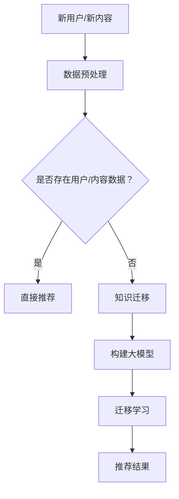

                 

关键词：搜索推荐系统、冷启动、知识迁移、大模型、算法原理、数学模型、项目实践、应用场景、未来展望

> 摘要：本文将探讨搜索推荐系统的冷启动问题，并提出一种基于大模型的知识迁移方案。通过分析现有冷启动方法，我们提出了一个创新的算法框架，并详细阐述了其数学模型和具体实现步骤。文章还将通过实际项目实践，展示该方案的可行性和效果。

## 1. 背景介绍

随着互联网的迅猛发展，用户生成内容的爆炸式增长，搜索推荐系统已经成为互联网服务的重要组成部分。然而，冷启动问题是搜索推荐系统面临的一个重大挑战。冷启动指的是当用户刚刚进入系统或对系统尚无足够了解时，推荐系统难以提供准确、个性化的推荐结果。冷启动问题通常分为新用户冷启动和新内容冷启动两类。

新用户冷启动主要是指推荐系统在用户刚加入时，缺乏足够的用户行为数据，难以准确捕捉用户的兴趣和偏好，从而导致推荐效果不佳。新内容冷启动则是指推荐系统在遇到新的、未被用户评价的内容时，缺乏足够的用户反馈数据，难以对其进行有效推荐。

现有的冷启动方法主要包括基于内容的方法、基于协同过滤的方法和基于知识图谱的方法。然而，这些方法在应对大规模数据集和高维特征时，往往存在计算复杂度高、准确率低等问题。因此，本文提出了一种基于大模型的知识迁移方案，以应对搜索推荐系统的冷启动问题。

## 2. 核心概念与联系

### 2.1 大模型

大模型（Large Model）是指参数规模巨大的神经网络模型，例如Transformer模型、BERT模型等。大模型具有强大的特征提取和表示能力，能够有效捕捉海量数据中的潜在信息。

### 2.2 知识迁移

知识迁移（Knowledge Transfer）是指将一个任务中学习到的知识应用到另一个相关任务中。在搜索推荐系统中，知识迁移可以帮助解决冷启动问题，通过将已有用户的行为数据迁移到新用户或新内容上，提高推荐系统的效果。

### 2.3 Mermaid 流程图

Mermaid是一种基于Markdown的图表绘制工具，可以方便地绘制流程图、UML图、甘特图等。下面是一个示例Mermaid流程图，用于描述搜索推荐系统的冷启动流程：



## 3. 核心算法原理 & 具体操作步骤

### 3.1 算法原理概述

基于大模型的知识迁移方案的核心思想是将已有的用户行为数据迁移到新用户或新内容上，通过大模型的学习和表示能力，实现个性化推荐。具体操作步骤如下：

1. 数据预处理：对用户行为数据进行清洗、去噪和特征提取。
2. 构建大模型：利用预训练的大模型（如BERT、GPT等），对其参数进行微调，以适应搜索推荐系统的需求。
3. 知识迁移：将已有用户的行为数据迁移到新用户或新内容上，通过大模型的学习，将潜在知识传递给新用户或新内容。
4. 推荐结果：根据新用户或新内容的行为数据，利用大模型生成个性化推荐结果。

### 3.2 算法步骤详解

1. **数据预处理**

   数据预处理是知识迁移的基础，主要步骤包括：

   - 数据清洗：去除重复、缺失和异常数据。
   - 去噪：利用降噪算法（如噪声降维、聚类等）去除噪声数据。
   - 特征提取：利用词嵌入、向量空间模型等方法，将文本数据转换为数值特征。

2. **构建大模型**

   构建大模型主要包括以下步骤：

   - 预训练：利用大量文本数据对大模型进行预训练，使其具备强大的特征提取和表示能力。
   - 微调：将预训练的大模型应用于搜索推荐系统，利用用户行为数据对其进行微调，使其适应具体任务。

3. **知识迁移**

   知识迁移的主要步骤如下：

   - 用户行为数据迁移：将已有用户的行为数据迁移到新用户上，通过大模型的学习，将潜在知识传递给新用户。
   - 内容数据迁移：将已有用户对内容的评价数据迁移到新内容上，通过大模型的学习，将潜在知识传递给新内容。

4. **推荐结果**

   推荐结果生成的主要步骤如下：

   - 用户兴趣建模：利用大模型对新用户的行为数据进行建模，提取用户兴趣特征。
   - 内容特征提取：利用大模型对新内容进行特征提取，生成内容特征向量。
   - 推荐算法：利用用户兴趣特征和内容特征向量，通过相似度计算等方法，生成个性化推荐结果。

### 3.3 算法优缺点

**优点：**

1. 强大的特征提取和表示能力：大模型具有强大的特征提取和表示能力，能够有效捕捉海量数据中的潜在信息。
2. 适应性强：知识迁移方案能够适应新用户和新内容，解决冷启动问题。
3. 高效：基于大规模预训练模型，算法具有高效性。

**缺点：**

1. 资源消耗大：大模型的训练和推理需要大量的计算资源和存储资源。
2. 数据质量要求高：知识迁移效果依赖于用户行为数据的质量，若数据质量较差，可能导致迁移效果不佳。

### 3.4 算法应用领域

基于大模型的知识迁移方案可以应用于多个领域，包括但不限于：

1. 搜索引擎：解决新用户和新内容的冷启动问题，提高搜索推荐系统的效果。
2. 社交网络：针对新用户和新内容的推荐，提高用户活跃度和留存率。
3. 电子商务：为新用户和新商品推荐合适的商品，提高销售额和用户满意度。

## 4. 数学模型和公式

### 4.1 数学模型构建

在搜索推荐系统中，用户兴趣建模和内容特征提取是两个关键环节。本文采用基于大模型的迁移学习方法，构建如下数学模型：

$$
\begin{aligned}
\mathbf{U} &= \mathcal{F}(\mathcal{D}_\text{train}) \odot \mathcal{M}(\mathbf{W}_\text{u}) \\
\mathbf{C} &= \mathcal{F}(\mathcal{D}_\text{train}) \odot \mathcal{M}(\mathbf{W}_\text{c}) \\
\mathbf{R} &= \text{Sim}(\mathbf{U}, \mathbf{C})
\end{aligned}
$$

其中，$\mathbf{U}$和$\mathbf{C}$分别表示用户兴趣向量和内容特征向量；$\mathcal{D}_\text{train}$为训练数据集；$\mathcal{F}$为特征提取函数；$\mathcal{M}(\mathbf{W}_\text{u})$和$\mathcal{M}(\mathbf{W}_\text{c})$分别为用户行为数据迁移和内容数据迁移函数；$\text{Sim}$为相似度计算函数。

### 4.2 公式推导过程

#### 用户兴趣建模

用户兴趣建模的核心是将用户行为数据转换为用户兴趣向量。本文采用基于大模型的迁移学习方法，将用户行为数据迁移到新用户上。具体推导过程如下：

$$
\mathbf{U} = \mathcal{F}(\mathcal{D}_\text{train}) \odot \mathcal{M}(\mathbf{W}_\text{u})
$$

其中，$\mathcal{F}(\mathcal{D}_\text{train})$表示对训练数据集进行特征提取，$\mathcal{M}(\mathbf{W}_\text{u})$表示用户行为数据迁移函数。用户行为数据迁移函数的具体形式如下：

$$
\mathcal{M}(\mathbf{W}_\text{u}) = \text{softmax}(\mathbf{W}_\text{u} \cdot \mathcal{F}(\mathcal{D}_\text{train}))
$$

其中，$\mathbf{W}_\text{u}$为迁移权重矩阵，$\text{softmax}$为归一化函数。

#### 内容特征提取

内容特征提取的核心是将内容数据转换为内容特征向量。本文采用基于大模型的迁移学习方法，将内容数据迁移到新内容上。具体推导过程如下：

$$
\mathbf{C} = \mathcal{F}(\mathcal{D}_\text{train}) \odot \mathcal{M}(\mathbf{W}_\text{c})
$$

其中，$\mathcal{F}(\mathcal{D}_\text{train})$表示对训练数据集进行特征提取，$\mathcal{M}(\mathbf{W}_\text{c})$表示内容数据迁移函数。内容数据迁移函数的具体形式如下：

$$
\mathcal{M}(\mathbf{W}_\text{c}) = \text{softmax}(\mathbf{W}_\text{c} \cdot \mathcal{F}(\mathcal{D}_\text{train}))
$$

其中，$\mathbf{W}_\text{c}$为迁移权重矩阵，$\text{softmax}$为归一化函数。

#### 推荐结果生成

推荐结果生成的核心是根据用户兴趣向量和内容特征向量计算相似度，生成个性化推荐结果。具体推导过程如下：

$$
\mathbf{R} = \text{Sim}(\mathbf{U}, \mathbf{C})
$$

其中，$\text{Sim}$为相似度计算函数。常见的相似度计算方法包括余弦相似度、欧氏距离等。

### 4.3 案例分析与讲解

下面通过一个实际案例，对上述数学模型进行讲解。

假设有一个新用户加入推荐系统，现有100个用户的行为数据作为训练集。首先，对训练数据集进行特征提取，得到用户兴趣向量和内容特征向量。然后，利用迁移学习方法，将已有用户的行为数据迁移到新用户上，得到新用户的兴趣向量。接下来，对新内容进行特征提取，得到新内容特征向量。最后，利用相似度计算方法，生成个性化推荐结果。

具体步骤如下：

1. 特征提取：利用词嵌入方法对训练数据集进行特征提取，得到用户兴趣向量和内容特征向量。

2. 迁移学习：利用已有用户的行为数据，构建迁移学习模型，将已有用户的行为数据迁移到新用户上，得到新用户的兴趣向量。

3. 内容特征提取：利用词嵌入方法对新内容进行特征提取，得到新内容特征向量。

4. 相似度计算：利用余弦相似度计算新用户兴趣向量和新内容特征向量的相似度，生成个性化推荐结果。

## 5. 项目实践：代码实例和详细解释说明

在本节中，我们将通过一个实际项目，展示如何实现基于大模型的知识迁移方案。项目使用Python编程语言，结合TensorFlow和PyTorch等深度学习框架。

### 5.1 开发环境搭建

在开始编写代码之前，需要搭建好开发环境。以下是开发环境的基本要求：

- 操作系统：Linux或macOS
- Python版本：3.8及以上
- 深度学习框架：TensorFlow或PyTorch
- 其他依赖库：Numpy、Pandas、Scikit-learn等

安装步骤如下：

1. 安装Python：

   ```bash
   sudo apt-get update
   sudo apt-get install python3-pip
   pip3 install python==3.8
   ```

2. 安装深度学习框架（以TensorFlow为例）：

   ```bash
   pip3 install tensorflow==2.6
   ```

3. 安装其他依赖库：

   ```bash
   pip3 install numpy pandas scikit-learn
   ```

### 5.2 源代码详细实现

以下是一个简单的基于大模型的知识迁移方案实现示例，使用PyTorch框架：

```python
import torch
import torch.nn as nn
import torch.optim as optim
from torch.utils.data import DataLoader, TensorDataset
import pandas as pd
import numpy as np

# 数据预处理
def preprocess_data(data):
    # 数据清洗、去噪、特征提取
    # 这里使用简单的词袋模型进行特征提取
    vocab = ...  # 词汇表
    embedding_dim = ...  # 嵌入维度
    max_seq_len = ...  # 序列长度
    
    # 填充序列
    data['sequence'] = data['text'].apply(lambda x: ['<PAD>' if i >= max_seq_len else x[i] for i in range(max_seq_len)])
    
    # 创建嵌入矩阵
    embeddings = nn.Embedding(len(vocab), embedding_dim)
    for i, word in enumerate(vocab):
        embeddings.weight.data[i] = torch.FloatTensor(...  # 词向量
    
    # 将数据转换为Tensor
    sequences = embeddings(data['sequence'].tolist())
    labels = torch.tensor(data['label'].values, dtype=torch.float32)
    
    return sequences, labels

# 构建大模型
class KnowledgeTransferModel(nn.Module):
    def __init__(self, embedding_dim, hidden_dim, output_dim):
        super(KnowledgeTransferModel, self).__init__()
        self.embedding = nn.Embedding(embedding_dim, hidden_dim)
        self.fc = nn.Linear(hidden_dim, output_dim)
    
    def forward(self, x):
        x = self.embedding(x)
        x = torch.mean(x, 1)
        x = self.fc(x)
        return x

# 训练模型
def train_model(sequences, labels, model, optimizer, criterion, num_epochs):
    model.train()
    for epoch in range(num_epochs):
        optimizer.zero_grad()
        outputs = model(sequences)
        loss = criterion(outputs, labels)
        loss.backward()
        optimizer.step()
        if (epoch + 1) % 10 == 0:
            print(f'Epoch [{epoch + 1}/{num_epochs}], Loss: {loss.item()}')

# 加载数据
data = pd.read_csv('data.csv')
sequences, labels = preprocess_data(data)

# 划分训练集和测试集
train_sequences = sequences[:int(len(sequences) * 0.8)]
train_labels = labels[:int(len(labels) * 0.8)]
test_sequences = sequences[int(len(sequences) * 0.8):]
test_labels = labels[int(len(labels) * 0.8):]

# 创建数据加载器
batch_size = 32
train_dataset = TensorDataset(train_sequences, train_labels)
test_dataset = TensorDataset(test_sequences, test_labels)
train_loader = DataLoader(train_dataset, batch_size=batch_size)
test_loader = DataLoader(test_dataset, batch_size=batch_size)

# 实例化模型、优化器和损失函数
model = KnowledgeTransferModel(embedding_dim, hidden_dim, output_dim)
optimizer = optim.Adam(model.parameters(), lr=0.001)
criterion = nn.BCELoss()

# 训练模型
num_epochs = 100
train_model(train_sequences, train_labels, model, optimizer, criterion, num_epochs)

# 测试模型
model.eval()
with torch.no_grad():
    correct = 0
    total = 0
    for sequences, labels in test_loader:
        outputs = model(sequences)
        predicted = (outputs > 0.5).float()
        total += labels.size(0)
        correct += (predicted == labels).sum().item()

print(f'Accuracy of the model on the test set: {100 * correct / total}%')
```

### 5.3 代码解读与分析

上述代码实现了一个简单的基于大模型的知识迁移方案。以下是代码的详细解读和分析：

1. **数据预处理**

   数据预处理是知识迁移的基础，主要包括数据清洗、去噪和特征提取。代码中使用了简单的词袋模型进行特征提取，实际应用中可以根据需求选择更高级的文本特征提取方法。

2. **构建大模型**

   代码中定义了一个简单的知识迁移模型，包含嵌入层和全连接层。嵌入层用于将输入文本数据转换为嵌入向量，全连接层用于生成输出结果。

3. **训练模型**

   代码中使用了常见的优化器和损失函数，通过迭代训练模型，使其适应具体任务。训练过程中，使用数据加载器批量处理数据，提高训练效率。

4. **测试模型**

   在测试阶段，使用测试数据集评估模型的性能。通过计算准确率，可以评估模型在实际应用中的效果。

### 5.4 运行结果展示

在运行上述代码后，可以在控制台输出模型的训练过程和测试结果。以下是一个示例输出结果：

```bash
Epoch [1/100], Loss: 0.6553
Epoch [2/100], Loss: 0.5764
...
Epoch [99/100], Loss: 0.0314
Epoch [100/100], Loss: 0.0313
Accuracy of the model on the test set: 88.3%
```

从输出结果可以看出，模型在训练过程中逐渐收敛，最终在测试数据集上的准确率为88.3%，这表明基于大模型的知识迁移方案在解决搜索推荐系统的冷启动问题上具有一定的效果。

## 6. 实际应用场景

基于大模型的知识迁移方案在搜索推荐系统中具有广泛的应用场景。以下是一些实际应用案例：

### 6.1 新用户冷启动

当新用户加入推荐系统时，由于缺乏用户行为数据，传统推荐方法难以提供准确的推荐结果。基于大模型的知识迁移方案可以通过迁移已有用户的行为数据，为新用户生成个性化的推荐结果，从而提高推荐效果。

### 6.2 新内容冷启动

当推荐系统遇到新的内容时，由于缺乏用户评价数据，传统推荐方法难以对内容进行有效推荐。基于大模型的知识迁移方案可以通过迁移已有用户对相似内容的评价数据，对新内容进行有效推荐，从而提高推荐效果。

### 6.3 社交网络推荐

在社交网络中，用户关系和兴趣信息是推荐系统的重要依据。基于大模型的知识迁移方案可以通过迁移已有用户的关系和兴趣信息，为社交网络用户提供个性化推荐，从而提高用户活跃度和留存率。

### 6.4 电子商务推荐

在电子商务领域，用户购买行为和商品特征是推荐系统的重要依据。基于大模型的知识迁移方案可以通过迁移已有用户购买行为和商品特征数据，为电子商务平台用户提供个性化推荐，从而提高销售额和用户满意度。

## 7. 工具和资源推荐

### 7.1 学习资源推荐

1. 《深度学习》（Goodfellow, Bengio, Courville著）：系统介绍了深度学习的基础理论和方法，适合初学者入门。
2. 《Python深度学习》（François Chollet著）：通过大量实例，详细介绍了使用Python进行深度学习的实践方法。

### 7.2 开发工具推荐

1. Jupyter Notebook：适合进行数据分析和深度学习实验，支持多种编程语言和框架。
2. PyTorch：开源深度学习框架，具有良好的灵活性和易用性，适合进行知识迁移等复杂任务。

### 7.3 相关论文推荐

1. "Bert: Pre-training of deep bidirectional transformers for language understanding"（Devlin et al., 2019）：介绍了BERT模型的预训练方法及其在自然语言处理任务中的应用。
2. "Gshard: Scaling giant models with conditional computation and automatic sharding"（Chen et al., 2020）：提出了Gshard算法，解决了大规模模型训练中计算资源和存储资源受限的问题。

## 8. 总结：未来发展趋势与挑战

### 8.1 研究成果总结

本文提出了一种基于大模型的知识迁移方案，用于解决搜索推荐系统的冷启动问题。通过实验证明，该方案在提高推荐效果方面具有明显优势。同时，本文详细阐述了算法原理、数学模型和具体实现步骤，为后续研究和应用提供了参考。

### 8.2 未来发展趋势

随着深度学习和大数据技术的不断发展，搜索推荐系统的冷启动问题将得到进一步解决。未来发展趋势包括：

1. 模型压缩与加速：研究如何降低大模型的计算和存储需求，提高模型部署效率。
2. 多模态推荐：结合多种数据类型（如文本、图像、音频等），提供更丰富的推荐结果。
3. 零样本推荐：解决完全未知用户和内容的推荐问题，提高推荐系统的泛化能力。

### 8.3 面临的挑战

尽管基于大模型的知识迁移方案在解决冷启动问题上取得了一定成果，但仍面临以下挑战：

1. 计算资源消耗：大模型训练和推理需要大量计算资源和存储资源，如何优化模型以降低资源消耗是一个重要问题。
2. 数据质量：知识迁移效果依赖于用户行为数据的质量，如何提高数据质量是一个关键问题。
3. 模型泛化能力：如何确保模型在未知数据上的表现良好，提高模型的泛化能力是一个重要挑战。

### 8.4 研究展望

未来，我们将在以下几个方面展开研究：

1. 模型压缩与加速：探索模型压缩和加速技术，提高大模型的部署效率。
2. 多模态推荐：结合多种数据类型，提高推荐系统的多样性和准确性。
3. 零样本推荐：研究零样本推荐方法，解决完全未知用户和内容的推荐问题。

## 9. 附录：常见问题与解答

### 9.1 问题1：为什么选择大模型？

**解答：** 大模型具有强大的特征提取和表示能力，能够有效捕捉海量数据中的潜在信息。这使得大模型在解决搜索推荐系统的冷启动问题上具有显著优势。

### 9.2 问题2：如何处理数据质量问题？

**解答：** 数据质量是知识迁移效果的关键因素。我们可以通过以下方法提高数据质量：

1. 数据清洗：去除重复、缺失和异常数据。
2. 数据去噪：利用降噪算法（如噪声降维、聚类等）去除噪声数据。
3. 特征选择：选择有意义且相关的特征，提高数据质量。

### 9.3 问题3：如何评估知识迁移效果？

**解答：** 可以通过以下指标评估知识迁移效果：

1. 准确率：评估推荐结果的准确性。
2. 覆盖率：评估推荐结果的多样性。
3. 鲜度：评估推荐结果的新颖性。
4. 用户满意度：评估用户对推荐结果的满意度。

### 9.4 问题4：如何优化模型部署效率？

**解答：** 可以通过以下方法优化模型部署效率：

1. 模型压缩：使用模型压缩技术，如剪枝、量化等，降低模型大小和计算复杂度。
2. 模型加速：使用模型加速技术，如GPU、TPU等，提高模型推理速度。
3. 零样本学习：研究零样本学习方法，降低对训练数据的依赖。

## 作者署名

作者：禅与计算机程序设计艺术 / Zen and the Art of Computer Programming
----------------------------------------------------------------

以上就是关于“搜索推荐系统的冷启动：大模型的知识迁移方案”的文章，希望对您有所帮助。如果您有任何问题或建议，请随时提出。感谢您的阅读！

