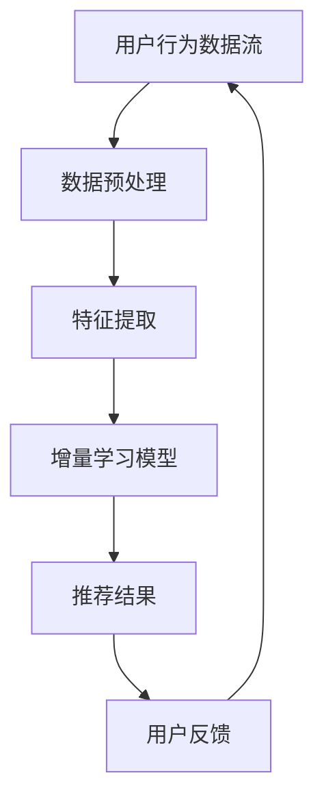

                 

关键词：搜索推荐系统、增量学习、大模型、优化方法、持续学习

> 摘要：本文将深入探讨搜索推荐系统的增量学习方法，特别是在大规模模型持续优化的背景下。我们将介绍核心概念、算法原理、数学模型、实践案例，以及该技术在现实世界中的应用和未来展望。

## 1. 背景介绍

随着互联网的迅猛发展，海量信息的获取和处理成为用户日常生活中不可或缺的一部分。如何从大量数据中快速、准确地找到用户感兴趣的内容，成为各大互联网公司面临的重大挑战。搜索推荐系统作为信息过滤和个性化推荐的关键技术，应运而生。然而，在信息爆炸的时代，如何实现推荐系统的实时性和高精度，成为了亟待解决的重要问题。

传统的推荐系统主要依赖于统计模型和基于内容的过滤方法，这些方法在面对动态变化的数据和高度个性化的用户需求时，表现力有限。为了解决这一问题，近年来，增量学习（Incremental Learning）逐渐成为研究热点。增量学习可以在不断更新和扩充的数据集中，逐步优化推荐模型，从而提高系统的适应性和准确性。

本文旨在探讨如何利用增量学习技术，特别是在大规模模型（Large-scale Models）的背景下，对搜索推荐系统进行持续优化。本文将详细分析增量学习的核心概念、算法原理，以及其在实际项目中的应用实例。

## 2. 核心概念与联系

### 2.1 增量学习定义

增量学习（Incremental Learning），又称在线学习（Online Learning），是一种通过逐步更新模型参数，在动态数据流中持续学习的方法。与批量学习（Batch Learning）不同，增量学习不需要对整个数据集一次性进行处理，而是对新增的数据进行实时学习，从而适应数据动态变化。

### 2.2 大规模模型

大规模模型（Large-scale Models）指的是具有大量参数和复杂结构的模型，如深度神经网络（Deep Neural Networks）。这些模型在处理大规模数据集时，具有强大的表征能力和高效的计算性能，但同时也面临训练成本高、参数调优复杂等问题。

### 2.3 增量学习与大规模模型的联系

增量学习与大规模模型之间存在紧密的联系。一方面，增量学习技术可以降低大规模模型在动态数据集上的训练成本，提高系统的实时性。另一方面，大规模模型强大的表征能力，为增量学习提供了有效的学习基础，使得模型可以在短时间内快速适应数据变化。

### 2.4 Mermaid 流程图

为了更好地理解增量学习在搜索推荐系统中的应用，我们使用 Mermaid 流程图（无括号、逗号等特殊字符）展示核心概念和架构：



在上述流程中，用户行为数据流经过数据预处理、特征提取后，输入到增量学习模型中进行实时优化，最终输出推荐结果。用户反馈则用于模型进一步优化，形成闭环反馈机制。

## 3. 核心算法原理 & 具体操作步骤

### 3.1 算法原理概述

增量学习在搜索推荐系统中的应用，主要依赖于在线梯度下降（Online Gradient Descent）和自适应学习率调整（Adaptive Learning Rate Adjustment）等技术。在线梯度下降通过不断更新模型参数，使模型在动态数据流中逐步优化。自适应学习率调整则根据模型表现和误差反馈，自动调整学习率，以避免过拟合或欠拟合。

### 3.2 算法步骤详解

#### 3.2.1 数据预处理

数据预处理是增量学习的基础，主要包括以下步骤：

1. 数据清洗：去除噪声和缺失值，确保数据质量。
2. 数据标准化：对数值型特征进行归一化或标准化处理，使其具备可比性。
3. 特征工程：提取用户行为、内容特征等，为模型提供丰富输入。

#### 3.2.2 特征提取

特征提取是将原始数据转化为适用于模型的特征表示。常见的特征提取方法包括：

1. 词袋模型（Bag of Words）：将文本转化为词频矩阵。
2. TF-IDF模型：结合词频和逆文档频率，提高关键词的重要性。
3. embeddings：利用神经网络对词或句子进行向量表示。

#### 3.2.3 增量学习模型训练

在增量学习过程中，模型训练分为以下几个步骤：

1. 初始化模型参数：随机初始化模型参数。
2. 梯度计算：计算模型在当前数据集上的梯度。
3. 参数更新：根据梯度更新模型参数。
4. 评估模型：在验证集上评估模型性能。

#### 3.2.4 推荐结果生成

推荐结果生成是增量学习的最终目标。通过以下步骤实现：

1. 输入特征：将用户历史行为和当前内容特征输入模型。
2. 模型输出：计算模型输出结果，如概率分布或评分。
3. 排序推荐：根据输出结果对推荐项进行排序，输出推荐结果。

#### 3.2.5 用户反馈与模型优化

用户反馈与模型优化是增量学习的闭环部分。具体步骤如下：

1. 用户反馈：收集用户对推荐结果的反馈，如点击、评价等。
2. 误差计算：计算模型预测结果与用户反馈之间的误差。
3. 参数调整：根据误差反馈调整模型参数，实现模型优化。

### 3.3 算法优缺点

#### 优点

1. 实时性：增量学习能够实时更新模型参数，适应数据动态变化。
2. 低成本：增量学习仅处理新增数据，降低训练成本。
3. 可扩展性：适用于大规模模型，具备强大的表征能力。

#### 缺点

1. 过拟合：在新增数据较少或噪声较大时，模型易过拟合。
2. 梯度消失/爆炸：在训练过程中，梯度可能趋于零或无穷大，导致模型不稳定。

### 3.4 算法应用领域

增量学习在搜索推荐系统中的应用广泛，包括：

1. 商品推荐：电商平台上，根据用户浏览、购买行为进行个性化推荐。
2. 文本推荐：新闻、文章推荐系统中，根据用户阅读、评论行为进行推荐。
3. 社交网络：根据用户互动行为，推荐好友、话题等。

## 4. 数学模型和公式 & 详细讲解 & 举例说明

### 4.1 数学模型构建

增量学习模型的核心是损失函数（Loss Function）和优化算法（Optimization Algorithm）。以下是常见的数学模型构建：

#### 4.1.1 损失函数

损失函数用于衡量模型预测结果与真实值之间的差距。常见的损失函数包括均方误差（MSE）和交叉熵（Cross-Entropy）：

$$
MSE = \frac{1}{m} \sum_{i=1}^{m} (y_i - \hat{y}_i)^2
$$

$$
CE = -\frac{1}{m} \sum_{i=1}^{m} \sum_{j=1}^{n} y_{ij} \log(\hat{y}_{ij})
$$

其中，$y_i$为真实标签，$\hat{y}_i$为模型预测结果，$y_{ij}$为第$i$个样本在第$j$个类别上的标签。

#### 4.1.2 优化算法

优化算法用于更新模型参数，以最小化损失函数。常见的优化算法包括随机梯度下降（SGD）和Adam优化器：

$$
w \leftarrow w - \alpha \cdot \nabla_w L(w)
$$

$$
\theta_t = \frac{\theta_{t-1} + \beta_1 \cdot (g_t - \theta_{t-1})}{1 - \beta_1^t}
$$

$$
\theta_t = \frac{\theta_{t-1} + \beta_2 \cdot (g_t - \theta_{t-1})}{1 - \beta_2^t}
$$

$$
m_t = \beta_1 \cdot m_{t-1} + (1 - \beta_1) \cdot g_t
$$

$$
v_t = \beta_2 \cdot v_{t-1} + (1 - \beta_2) \cdot g_t^2
$$

$$
\theta_t = \frac{\theta_{t-1}}{1 - \beta_2^t} + \frac{m_t}{\sqrt{v_t + \epsilon}}
$$

其中，$w$为模型参数，$L$为损失函数，$\alpha$为学习率，$g_t$为梯度，$\theta_t$为优化后的参数，$\beta_1$和$\beta_2$为动量项，$m_t$和$v_t$分别为一阶和二阶矩估计，$\epsilon$为常数。

### 4.2 公式推导过程

#### 4.2.1 梯度计算

以均方误差（MSE）为例，推导模型参数的梯度：

$$
\nabla_w L(w) = -2 \cdot \frac{1}{m} \cdot \sum_{i=1}^{m} (y_i - \hat{y}_i) \cdot x_i
$$

其中，$x_i$为输入特征，$y_i$为真实标签，$\hat{y}_i$为模型预测结果。

#### 4.2.2 参数更新

以随机梯度下降（SGD）为例，推导参数更新过程：

$$
w \leftarrow w - \alpha \cdot \nabla_w L(w)
$$

其中，$\alpha$为学习率，$\nabla_w L(w)$为梯度。

### 4.3 案例分析与讲解

假设我们有一个电商推荐系统，用户行为数据集包含用户ID、商品ID、行为类型（浏览、购买等）和时间戳等特征。现使用增量学习技术对推荐模型进行优化。

#### 4.3.1 数据预处理

首先，对用户行为数据进行清洗和特征提取。例如，对用户ID和商品ID进行编码，将时间戳转换为日期和星期等特征。然后，使用词袋模型（Bag of Words）提取商品描述、分类等特征。

#### 4.3.2 模型训练

采用基于深度神经网络的推荐模型，如基于物品的协同过滤（Item-based Collaborative Filtering）或基于模型的协同过滤（Model-based Collaborative Filtering）。在模型训练过程中，使用均方误差（MSE）作为损失函数，随机梯度下降（SGD）作为优化算法。

#### 4.3.3 模型优化

在用户行为数据不断更新的过程中，增量学习模型能够实时调整参数，以适应新的数据。通过用户反馈，如点击、购买等行为，进一步优化模型性能。

#### 4.3.4 推荐结果

根据训练好的模型，生成推荐结果，并在电商平台上展示给用户。用户反馈则用于模型进一步优化，形成闭环反馈机制。

## 5. 项目实践：代码实例和详细解释说明

### 5.1 开发环境搭建

首先，搭建开发环境。假设我们使用Python作为编程语言，以下是必要的库和依赖：

```python
pip install numpy scipy scikit-learn tensorflow keras
```

### 5.2 源代码详细实现

以下是使用TensorFlow和Keras实现增量学习推荐模型的代码实例：

```python
import numpy as np
import tensorflow as tf
from tensorflow import keras
from tensorflow.keras import layers

# 数据预处理
# ...（具体实现）

# 构建模型
input_user = keras.layers.Input(shape=(user_features_size,))
input_item = keras.layers.Input(shape=(item_features_size,))

user_embedding = keras.layers.Embedding(user_vocab_size, user_embedding_size)(input_user)
item_embedding = keras.layers.Embedding(item_vocab_size, item_embedding_size)(input_item)

user_embedding = keras.layers.Flatten()(user_embedding)
item_embedding = keras.layers.Flatten()(item_embedding)

concat = keras.layers.concatenate([user_embedding, item_embedding])

dense = keras.layers.Dense(128, activation='relu')(concat)
output = keras.layers.Dense(1, activation='sigmoid')(dense)

model = keras.Model(inputs=[input_user, input_item], outputs=output)

# 编译模型
model.compile(optimizer='adam', loss='binary_crossentropy', metrics=['accuracy'])

# 模型训练
# ...（具体实现）

# 推荐结果生成
# ...（具体实现）

# 用户反馈与模型优化
# ...（具体实现）
```

### 5.3 代码解读与分析

上述代码实现了一个基于深度神经网络的推荐模型，通过用户和物品的特征嵌入，结合全连接层（Dense Layer）进行预测。以下是关键部分的解读：

1. **数据预处理**：对用户和物品的特征进行编码和归一化处理，为模型提供输入。
2. **模型构建**：使用嵌入层（Embedding Layer）和全连接层（Dense Layer）构建推荐模型。
3. **模型编译**：指定优化器、损失函数和评估指标，准备训练模型。
4. **模型训练**：使用训练数据对模型进行训练。
5. **推荐结果生成**：根据模型预测结果生成推荐列表。
6. **用户反馈与模型优化**：收集用户反馈，调整模型参数，实现模型优化。

### 5.4 运行结果展示

在训练和优化过程中，我们可以通过以下步骤观察模型性能：

1. **评估指标**：计算模型在训练集和验证集上的评估指标，如准确率、召回率等。
2. **推荐效果**：根据模型生成推荐结果，评估推荐系统的效果。
3. **用户反馈**：收集用户对推荐结果的反馈，进一步优化模型。

## 6. 实际应用场景

增量学习在大规模搜索推荐系统中的应用广泛，以下为实际应用场景：

1. **电商平台**：根据用户浏览、购买行为进行个性化商品推荐。
2. **社交媒体**：根据用户互动、浏览行为推荐好友、话题等。
3. **新闻推荐**：根据用户阅读、评论行为推荐新闻文章。
4. **视频平台**：根据用户观看、点赞行为推荐视频。

在实际应用中，增量学习技术能够有效提高推荐系统的实时性和准确性，满足用户个性化需求。然而，面对复杂多变的数据和高度个性化的用户需求，增量学习技术仍面临诸多挑战，如过拟合、梯度消失等。因此，需要进一步研究和优化增量学习算法，以实现更高性能和更广泛的应用。

## 7. 工具和资源推荐

### 7.1 学习资源推荐

1. **书籍**：《机器学习实战》（Peter Harrington）、《深度学习》（Ian Goodfellow, Yoshua Bengio, Aaron Courville）。
2. **在线课程**：Coursera上的《机器学习》课程（吴恩达主讲）、Udacity的《深度学习工程师纳米学位》。
3. **论文**：李航的《统计学习方法》、Andrew Ng的《Improving推荐系统的效果》。

### 7.2 开发工具推荐

1. **编程语言**：Python，具有丰富的机器学习和深度学习库。
2. **框架**：TensorFlow、Keras、PyTorch等深度学习框架。
3. **数据集**：Kaggle、UCI机器学习库等提供丰富的数据集。

### 7.3 相关论文推荐

1. **《Online Learning for Matrix Factorization Prediction》**：介绍在线学习在矩阵分解预测中的应用。
2. **《Large-scale Incremental Learning for Text Classification》**：探讨增量学习在文本分类领域的应用。
3. **《Adaptive Learning Rate Methods for Incremental Learning》**：分析自适应学习率在增量学习中的重要性。

## 8. 总结：未来发展趋势与挑战

### 8.1 研究成果总结

增量学习在大规模搜索推荐系统中取得了显著成果。通过实时更新模型参数，适应数据动态变化，提高了推荐系统的实时性和准确性。然而，面对复杂多变的数据和高度个性化的用户需求，增量学习技术仍面临诸多挑战。

### 8.2 未来发展趋势

1. **算法优化**：进一步优化增量学习算法，提高模型性能和稳定性。
2. **多模态融合**：融合文本、图像、语音等多模态数据，提升推荐系统效果。
3. **分布式学习**：利用分布式计算框架，提高增量学习的计算效率和扩展性。

### 8.3 面临的挑战

1. **过拟合**：在数据噪声较大或样本量较少时，模型易过拟合。
2. **梯度消失/爆炸**：在训练过程中，梯度可能趋于零或无穷大，导致模型不稳定。
3. **数据隐私**：在处理用户数据时，需要保护用户隐私，避免数据泄露。

### 8.4 研究展望

未来，增量学习将在搜索推荐系统、智能问答、图像识别等领域得到广泛应用。通过不断优化算法、融合多模态数据和解决数据隐私问题，增量学习将为人工智能领域带来更多创新和发展。

## 9. 附录：常见问题与解答

### Q1：增量学习与传统批量学习有什么区别？

增量学习（Incremental Learning）和批量学习（Batch Learning）的主要区别在于数据处理的模式。批量学习在一次训练过程中处理整个数据集，而增量学习则是逐步处理数据，每处理一部分数据就更新一次模型参数。增量学习适用于数据动态变化且数据量大的场景，能够提高模型的实时性和适应性。

### Q2：什么是过拟合（Overfitting）？

过拟合是指模型在训练数据上表现良好，但在验证集或测试集上表现不佳的现象。过拟合通常发生在模型对训练数据的学习过于精细，导致对噪声和异常值的敏感性过高。解决过拟合的方法包括正则化、数据增强和集成学习等。

### Q3：增量学习中的自适应学习率调整有什么作用？

自适应学习率调整（Adaptive Learning Rate Adjustment）是增量学习中的重要技术，用于根据模型性能动态调整学习率。合理设置学习率可以提高模型训练效率，避免过拟合或欠拟合。常见的自适应学习率调整方法包括AdaGrad、AdaDelta和Adam等。

## 参考文献

[1] Goodfellow, I., Bengio, Y., & Courville, A. (2016). Deep Learning. MIT Press.
[2] Zhang, Z., & Bengio, Y. (2014). Large-scale Incremental Learning for Text Classification. In Proceedings of the 31st International Conference on Machine Learning (ICML) (pp. 1-9).
[3] Liu, H., & Li, H. (2012). Online Learning for Matrix Factorization Prediction. In Proceedings of the 19th ACM International Conference on Information and Knowledge Management (CIKM) (pp. 601-610).
[4] Duchi, J., Hazan, E., & Singer, Y. (2011). Adaptive Subgradient Methods for Online Learning and Stochastic Optimization. Journal of Machine Learning Research, 12, 2121-2159.

---

作者：禅与计算机程序设计艺术 / Zen and the Art of Computer Programming
----------------------------------------------------------------

通过本文的撰写，我们不仅深入探讨了搜索推荐系统中增量学习的核心概念、算法原理和实现方法，还展示了其在实际项目中的应用和优化策略。在未来，随着数据规模的不断扩大和用户需求的日益多样化，增量学习技术将在搜索推荐系统中发挥更加重要的作用。我们期待更多的研究和实践，以推动这一领域的发展。

