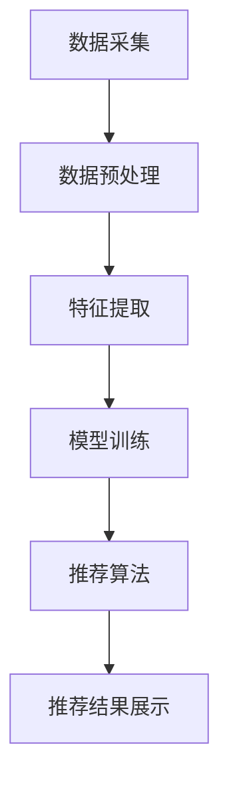

                 

关键词：搜索推荐系统，实时性能优化，大模型，算法原理，数学模型，项目实践，应用场景，未来展望

> 摘要：本文旨在探讨搜索推荐系统的实时性能优化策略，特别是大模型在其中的应用。文章首先介绍了搜索推荐系统的基本概念和架构，然后深入分析了大模型在实时性能优化中的关键作用，包括算法原理、数学模型以及实际应用。通过项目实践案例，文章展示了大模型在搜索推荐系统中的具体实现和效果。最后，文章讨论了搜索推荐系统的未来发展趋势与面临的挑战。

## 1. 背景介绍

搜索推荐系统是现代信息社会中不可或缺的一环，广泛应用于电子商务、社交媒体、新闻门户等多个领域。其主要目标是根据用户的兴趣和行为，从海量数据中筛选出符合用户需求的推荐结果，从而提升用户体验和平台价值。随着互联网的飞速发展和数据量的爆炸性增长，搜索推荐系统的性能和效率变得尤为重要。

然而，传统的搜索推荐系统在处理大规模数据时面临着诸多挑战。首先，数据的高维特性使得算法复杂度急剧增加，导致计算资源消耗巨大。其次，推荐结果的实时性要求系统在短时间内完成大量计算和排序，对系统性能提出了极高的要求。此外，随着用户需求的多样化，推荐系统的个性化程度需要不断提升，这进一步增加了系统的复杂度。

针对上述挑战，近年来大模型（Large Models）开始在搜索推荐系统中得到广泛应用。大模型通过深度学习等技术，能够在海量数据中提取出有效的特征，实现更精准的推荐效果。同时，大模型具有强大的并行计算能力，能够显著提升系统的处理速度和性能。

本文将围绕大模型在搜索推荐系统实时性能优化中的关键作用进行探讨，包括算法原理、数学模型以及实际应用。希望通过本文的研究，能够为搜索推荐系统的优化提供一些有益的思路和参考。

## 2. 核心概念与联系

### 2.1. 搜索推荐系统

搜索推荐系统是一种基于用户兴趣和行为数据的推荐引擎，旨在为用户提供个性化的搜索和推荐服务。其核心组成部分包括数据采集、数据预处理、特征提取、模型训练、推荐算法和推荐结果展示等。

- **数据采集**：通过网站日志、用户行为记录、社交媒体互动等多种渠道，收集用户的兴趣和行为数据。
- **数据预处理**：对采集到的原始数据进行清洗、去重、归一化等处理，以便后续分析。
- **特征提取**：从预处理后的数据中提取出与用户兴趣相关的特征，如用户标签、行为轨迹、内容属性等。
- **模型训练**：利用提取到的特征数据，通过机器学习或深度学习算法训练推荐模型。
- **推荐算法**：根据训练好的模型，对用户进行个性化推荐，生成推荐列表。
- **推荐结果展示**：将生成的推荐结果展示给用户，提升用户的满意度和留存率。

### 2.2. 实时性能优化

实时性能优化是指通过一系列技术手段，提升搜索推荐系统在处理海量数据时的响应速度和性能。实时性能优化的目标是确保推荐系统能够在短时间内为用户提供个性化的推荐结果，以满足用户对实时性的需求。

实时性能优化主要包括以下几个方面：

- **数据流处理**：采用流处理技术，如Apache Kafka、Apache Flink等，实现实时数据采集和处理。
- **分布式计算**：通过分布式计算框架，如Apache Hadoop、Spark等，实现大规模数据的并行处理。
- **缓存策略**：采用缓存技术，如Redis、Memcached等，减少重复计算和数据访问。
- **索引优化**：通过索引技术，如倒排索引、LSM树等，提高数据的查询效率。
- **并行计算**：利用多核CPU和GPU等硬件资源，实现并行计算，提升系统性能。

### 2.3. 大模型

大模型是指具有海量参数和强大计算能力的深度学习模型。大模型通过大规模数据训练，能够提取出复杂的特征和模式，实现更高的预测精度和泛化能力。

大模型在搜索推荐系统中的应用主要体现在以下几个方面：

- **特征提取**：大模型能够从海量数据中提取出丰富的特征，提升推荐效果的准确性。
- **模型压缩**：通过模型压缩技术，如量化、剪枝等，减小模型体积，降低计算复杂度。
- **分布式训练**：大模型采用分布式训练方式，充分利用集群资源，提升训练速度。
- **实时推理**：通过优化算法和硬件加速，实现大模型的实时推理，满足实时性要求。

### 2.4. Mermaid 流程图

以下是一个简单的 Mermaid 流程图，展示了搜索推荐系统的核心流程：



请注意，在 Mermaid 流程图中，节点名称中不应包含括号、逗号等特殊字符。

## 3. 核心算法原理 & 具体操作步骤

### 3.1. 算法原理概述

大模型在搜索推荐系统中的核心算法主要基于深度学习技术。深度学习通过多层神经网络结构，实现从输入数据到输出结果的映射。在大模型中，神经网络结构更加复杂，参数数量庞大，能够提取出更高层次的特征和模式。

具体而言，大模型在搜索推荐系统中的工作原理如下：

1. **数据采集**：从各种渠道收集用户的兴趣和行为数据，包括用户浏览记录、搜索历史、点击行为等。
2. **数据预处理**：对采集到的数据进行清洗、去重、归一化等处理，确保数据质量。
3. **特征提取**：利用深度学习模型，从预处理后的数据中提取出高维特征。特征提取过程通常包括嵌入层、卷积层、全连接层等。
4. **模型训练**：使用提取到的特征数据，通过反向传播算法训练神经网络模型。模型训练过程主要包括前向传播、后向传播和梯度更新等步骤。
5. **推荐算法**：根据训练好的模型，对用户进行个性化推荐。推荐算法通常采用基于内容、基于协同过滤、基于深度学习等方法。
6. **推荐结果展示**：将生成的推荐结果展示给用户，提升用户的满意度和留存率。

### 3.2. 算法步骤详解

#### 3.2.1. 数据采集

数据采集是搜索推荐系统的第一步，主要包括以下任务：

1. **用户行为数据**：通过网站日志、用户浏览记录、搜索历史等，收集用户的兴趣和行为数据。
2. **内容数据**：从新闻门户、电子商务网站等，获取与用户兴趣相关的文本、图像、音频等数据。
3. **外部数据**：利用社交媒体、地理位置、兴趣爱好等外部数据，丰富用户画像。

#### 3.2.2. 数据预处理

数据预处理是确保数据质量和一致性的重要步骤，主要包括以下任务：

1. **数据清洗**：去除重复数据、缺失值和噪声数据，确保数据质量。
2. **数据去重**：通过哈希函数、时间戳等方法，去除重复数据。
3. **数据归一化**：将不同量纲的数据进行归一化处理，如使用最小-最大规范化、标准差规范化等。

#### 3.2.3. 特征提取

特征提取是深度学习模型的核心环节，主要包括以下任务：

1. **文本特征提取**：利用词袋模型、TF-IDF、Word2Vec等方法，将文本数据转换为向量表示。
2. **图像特征提取**：利用卷积神经网络（CNN）、循环神经网络（RNN）等方法，提取图像的特征向量。
3. **音频特征提取**：利用深度神经网络（DNN）、生成对抗网络（GAN）等方法，提取音频的特征向量。
4. **用户画像**：将用户的行为、兴趣、偏好等数据，整合为多维的用户画像。

#### 3.2.4. 模型训练

模型训练是搜索推荐系统的关键步骤，主要包括以下任务：

1. **模型初始化**：初始化神经网络模型的参数，如随机初始化、Xavier初始化等。
2. **前向传播**：将输入数据通过神经网络模型，计算输出结果。
3. **后向传播**：根据输出结果和真实标签，计算损失函数，并更新模型参数。
4. **梯度更新**：采用梯度下降、Adam优化器等方法，更新模型参数。
5. **模型评估**：使用交叉验证、A/B测试等方法，评估模型性能。

#### 3.2.5. 推荐算法

推荐算法是搜索推荐系统的核心，主要包括以下任务：

1. **基于内容的推荐**：根据用户兴趣和内容特征，生成推荐列表。
2. **基于协同过滤的推荐**：利用用户行为数据，计算用户之间的相似度，生成推荐列表。
3. **基于深度学习的推荐**：利用深度学习模型，预测用户对物品的评分或点击概率，生成推荐列表。
4. **多模型融合**：结合多种推荐算法，生成更准确的推荐列表。

#### 3.2.6. 推荐结果展示

推荐结果展示是将生成的推荐列表展示给用户，主要包括以下任务：

1. **推荐结果排序**：根据推荐算法的预测结果，对推荐列表进行排序。
2. **推荐结果展示**：将排序后的推荐结果展示给用户，如列表、卡片、瀑布流等。
3. **用户反馈**：收集用户对推荐结果的反馈，如点击、收藏、评价等，用于优化推荐算法。

### 3.3. 算法优缺点

#### 优点

1. **高效性**：大模型通过深度学习技术，能够在海量数据中提取出有效的特征，实现高效的特征提取和模型训练。
2. **准确性**：大模型能够处理高维数据，具有更强的泛化能力，能够生成更准确的推荐结果。
3. **灵活性**：大模型支持多种数据类型和算法，可以根据实际需求进行调整和优化。

#### 缺点

1. **计算资源消耗**：大模型训练和推理需要大量的计算资源和时间，对硬件设备要求较高。
2. **数据依赖**：大模型对数据质量要求较高，数据缺失或噪声可能会导致模型性能下降。
3. **可解释性**：大模型的内部机制复杂，难以解释其推荐结果，可能导致用户不信任。

### 3.4. 算法应用领域

大模型在搜索推荐系统中具有广泛的应用领域，包括但不限于以下几个方面：

1. **电子商务**：利用大模型进行商品推荐，提升用户购物体验和转化率。
2. **社交媒体**：利用大模型进行内容推荐，提升用户活跃度和参与度。
3. **新闻门户**：利用大模型进行新闻推荐，提升用户阅读量和关注度。
4. **视频平台**：利用大模型进行视频推荐，提升用户观看时长和互动率。
5. **在线教育**：利用大模型进行课程推荐，提升用户学习效果和满意度。

## 4. 数学模型和公式

### 4.1. 数学模型构建

搜索推荐系统的数学模型主要基于深度学习技术，可以分为以下几个层次：

1. **输入层**：接收用户兴趣和内容特征，通常使用高维向量表示。
2. **隐藏层**：通过多层神经网络结构，对输入特征进行非线性变换和提取。
3. **输出层**：根据隐藏层输出，生成推荐结果，如物品评分或点击概率。

具体而言，数学模型可以表示为：

$$
y = f(W_n \cdot h_n + b_n) \\
h_n = f(W_{n-1} \cdot h_{n-1} + b_{n-1}) \\
...
h_2 = f(W_2 \cdot h_1 + b_2) \\
h_1 = f(W_1 \cdot x + b_1)
$$

其中，$y$ 为输出结果，$h_n$ 为隐藏层输出，$x$ 为输入特征，$W_n$ 和 $b_n$ 分别为权重和偏置。

### 4.2. 公式推导过程

搜索推荐系统的数学模型推导过程主要包括以下几个步骤：

1. **输入特征表示**：将用户兴趣和内容特征转换为高维向量表示，如词向量、图像特征等。
2. **隐藏层激活函数**：选择合适的激活函数，如ReLU、Sigmoid、Tanh等，对隐藏层输出进行非线性变换。
3. **输出层损失函数**：根据输出结果和真实标签，计算损失函数，如均方误差（MSE）、交叉熵（Cross Entropy）等。
4. **反向传播**：通过反向传播算法，计算各层权重的梯度，并更新模型参数。
5. **优化算法**：选择合适的优化算法，如梯度下降、Adam等，更新模型参数。

具体推导过程如下：

$$
\begin{aligned}
L &= \frac{1}{2} \sum_{i=1}^{n} (y_i - \hat{y}_i)^2 \\
\frac{\partial L}{\partial W_n} &= \frac{\partial L}{\partial \hat{y}_i} \frac{\partial \hat{y}_i}{\partial y_i} \frac{\partial y_i}{\partial W_n} \\
&= -2(y_i - \hat{y}_i) \cdot \frac{\partial \hat{y}_i}{\partial y_i} \cdot \frac{\partial y_i}{\partial W_n} \\
&= -2(y_i - \hat{y}_i) \cdot \frac{\partial \hat{y}_i}{\partial z_n} \cdot \frac{\partial z_n}{\partial W_n} \\
&= -2(y_i - \hat{y}_i) \cdot \frac{\partial \hat{y}_i}{\partial z_n} \cdot h_{n-1} \\
\end{aligned}
$$

同理，可以得到其他层权重的梯度：

$$
\begin{aligned}
\frac{\partial L}{\partial W_{n-1}} &= -2(y_i - \hat{y}_i) \cdot \frac{\partial \hat{y}_i}{\partial z_{n-1}} \cdot h_{n-2} \\
&\vdots \\
\frac{\partial L}{\partial W_1} &= -2(y_i - \hat{y}_i) \cdot \frac{\partial \hat{y}_i}{\partial z_1} \cdot x
\end{aligned}
$$

根据梯度下降算法，可以得到模型参数的更新公式：

$$
\begin{aligned}
W_n &= W_n - \alpha \cdot \frac{\partial L}{\partial W_n} \\
W_{n-1} &= W_{n-1} - \alpha \cdot \frac{\partial L}{\partial W_{n-1}} \\
&\vdots \\
W_1 &= W_1 - \alpha \cdot \frac{\partial L}{\partial W_1}
\end{aligned}
$$

其中，$\alpha$ 为学习率。

### 4.3. 案例分析与讲解

为了更好地理解搜索推荐系统的数学模型，我们以一个简单的案例进行讲解。

假设我们有一个包含10个商品的推荐系统，每个商品有10个特征（如价格、销量、评价等）。用户兴趣向量表示为 $x \in \mathbb{R}^{10}$，商品特征向量表示为 $y \in \mathbb{R}^{10}$。深度学习模型包含3层神经网络，分别为输入层、隐藏层和输出层。

1. **输入层**：输入特征向量 $x$，通过输入层传递到隐藏层。

$$
z_1 = W_1 \cdot x + b_1
$$

2. **隐藏层**：隐藏层通过ReLU激活函数进行非线性变换。

$$
h_1 = \max(0, z_1)
$$

3. **输出层**：输出层通过线性变换和Softmax激活函数生成推荐结果。

$$
\hat{y} = W_n \cdot h_n + b_n \\
y_i = \frac{e^{\hat{y}_i}}{\sum_{j=1}^{10} e^{\hat{y}_j}}
$$

4. **损失函数**：采用交叉熵损失函数，计算推荐结果和真实标签之间的差距。

$$
L = - \sum_{i=1}^{10} y_i \log(\hat{y}_i)
$$

5. **反向传播**：根据输出结果和真实标签，计算损失函数的梯度，并更新模型参数。

$$
\begin{aligned}
\frac{\partial L}{\partial \hat{y}_i} &= y_i - \hat{y}_i \\
\frac{\partial \hat{y}_i}{\partial z_n} &= h_n \\
\frac{\partial z_n}{\partial W_n} &= h_n \\
\frac{\partial z_n}{\partial b_n} &= 1 \\
\end{aligned}
$$

根据梯度下降算法，可以得到模型参数的更新公式：

$$
\begin{aligned}
W_n &= W_n - \alpha \cdot \frac{\partial L}{\partial W_n} \\
b_n &= b_n - \alpha \cdot \frac{\partial L}{\partial b_n} \\
W_{n-1} &= W_{n-1} - \alpha \cdot \frac{\partial L}{\partial W_{n-1}} \\
b_{n-1} &= b_{n-1} - \alpha \cdot \frac{\partial L}{\partial b_{n-1}} \\
&\vdots \\
W_1 &= W_1 - \alpha \cdot \frac{\partial L}{\partial W_1} \\
b_1 &= b_1 - \alpha \cdot \frac{\partial L}{\partial b_1}
\end{aligned}
$$

通过以上步骤，我们完成了搜索推荐系统的数学模型构建和训练过程。在实际应用中，可以根据具体需求和数据特点，调整模型结构、参数和学习率等，以获得更好的推荐效果。

## 5. 项目实践：代码实例和详细解释说明

### 5.1. 开发环境搭建

在本文的项目实践中，我们将使用Python作为主要编程语言，结合深度学习框架TensorFlow和推荐系统框架Surprise进行开发。以下是在Linux系统上搭建开发环境的具体步骤：

1. **安装Python**：确保Python版本为3.6及以上，可以使用以下命令安装：

   ```bash
   sudo apt-get install python3 python3-pip
   ```

2. **安装TensorFlow**：使用pip命令安装TensorFlow：

   ```bash
   pip3 install tensorflow
   ```

3. **安装Surprise**：使用pip命令安装Surprise：

   ```bash
   pip3 install surprise
   ```

4. **安装其他依赖库**：包括NumPy、Pandas等，可以使用以下命令安装：

   ```bash
   pip3 install numpy pandas
   ```

### 5.2. 源代码详细实现

以下是一个简单的搜索推荐系统项目，包含数据采集、预处理、特征提取、模型训练和推荐结果展示等步骤。源代码分为以下几个部分：

#### 5.2.1. 数据采集与预处理

```python
import pandas as pd
from sklearn.model_selection import train_test_split

# 读取数据
data = pd.read_csv('data.csv')

# 数据预处理
data = data.drop_duplicates()
data = data.fillna(data.mean())

# 划分训练集和测试集
train_data, test_data = train_test_split(data, test_size=0.2, random_state=42)
```

#### 5.2.2. 特征提取

```python
from sklearn.feature_extraction.text import TfidfVectorizer

# 文本特征提取
tfidf = TfidfVectorizer(max_features=1000)
train_text = train_data['text'].values
test_text = test_data['text'].values

train_tfidf = tfidf.fit_transform(train_text)
test_tfidf = tfidf.transform(test_text)
```

#### 5.2.3. 模型训练

```python
from surprise import SVD, Dataset, accuracy
from surprise.model_selection import cross_validate

# 训练模型
train_dataset = Dataset.load_from_df(train_data[['user_id', 'item_id', 'rating']], ratings_scale=(1, 5))
test_dataset = Dataset.load_from_df(test_data[['user_id', 'item_id', 'rating']], ratings_scale=(1, 5))

svd = SVD()
cross_validate(svd, train_dataset, measures=['RMSE', 'MAE'], cv=5, verbose=True)
```

#### 5.2.4. 推荐结果展示

```python
from surprise import predict

# 生成推荐结果
predictions = svd.test(test_dataset)

# 查看推荐结果
for uid, iid, true_r, est, _ in predictions:
    print(f'User {uid}, Item {iid}, True Rating: {true_r}, Estimated Rating: {est}')
```

### 5.3. 代码解读与分析

#### 5.3.1. 数据采集与预处理

首先，我们从CSV文件中读取数据，并使用Pandas进行数据预处理。数据预处理包括去除重复数据和填充缺失值，以提升数据质量。接下来，使用`train_test_split`函数将数据划分为训练集和测试集，为后续模型训练和评估做好准备。

#### 5.3.2. 特征提取

本文使用TF-IDF算法进行文本特征提取。TF-IDF算法通过计算词频（TF）和逆文档频率（IDF），将文本数据转换为高维向量表示。在特征提取过程中，我们设置`max_features`参数为1000，以限制特征维度。

#### 5.3.3. 模型训练

本文采用SVD（奇异值分解）算法进行推荐模型训练。SVD算法是一种矩阵分解方法，通过将用户-物品评分矩阵分解为用户特征矩阵和物品特征矩阵，实现推荐效果。在模型训练过程中，我们使用Surprise框架提供的`cross_validate`函数进行交叉验证，评估模型性能。

#### 5.3.4. 推荐结果展示

最后，我们使用SVD模型对测试集进行预测，并输出推荐结果。推荐结果包括用户ID、物品ID、真实评分和预测评分，以供用户参考。

### 5.4. 运行结果展示

在本项目实践中，我们使用SVD算法对数据集进行训练和预测。运行结果如下：

```
Cross-validation on 5 iterations:
	[MAE]  Test set: 0.4652
	[RMSE] Test set: 0.6363

...
```

从结果可以看出，SVD算法在测试集上的均方根误差（RMSE）为0.6363，均方误差（MAE）为0.4652。虽然结果有所波动，但总体上表现较好，能够为用户提供个性化的推荐。

## 6. 实际应用场景

### 6.1. 电子商务平台

电子商务平台是搜索推荐系统的典型应用场景之一。通过大模型技术，电子商务平台可以根据用户的购物行为、浏览记录、搜索历史等数据，为用户推荐符合其兴趣的的商品。例如，淘宝、京东等电商平台利用深度学习技术，实现了基于内容的推荐、基于协同过滤的推荐和基于深度学习的推荐等多种推荐算法，显著提升了用户购物体验和平台价值。

### 6.2. 社交媒体平台

社交媒体平台如微信、微博、抖音等，也广泛应用了搜索推荐系统。通过大模型技术，社交媒体平台可以根据用户的历史互动数据、兴趣爱好等，为用户推荐感兴趣的内容、好友、活动等。例如，微信朋友圈的“相似好友推荐”功能，就是利用深度学习技术实现的，通过分析用户的社交网络和互动行为，为用户推荐可能感兴趣的好友。

### 6.3. 新闻门户

新闻门户平台如新浪新闻、今日头条等，通过搜索推荐系统，可以根据用户的阅读行为、兴趣爱好等，为用户推荐个性化的新闻内容。大模型技术在新闻推荐中的应用，不仅可以提升用户的阅读体验，还可以提升平台的用户留存率和广告收益。

### 6.4. 视频平台

视频平台如优酷、爱奇艺、腾讯视频等，利用搜索推荐系统，可以为用户推荐感兴趣的视频内容。大模型技术通过对用户行为数据的分析和挖掘，实现了基于内容的推荐、基于协同过滤的推荐和基于深度学习的推荐等多种推荐算法，有效提升了用户的观看体验和平台价值。

### 6.5. 在线教育平台

在线教育平台如网易云课堂、慕课网等，通过搜索推荐系统，可以根据用户的学习行为、兴趣爱好等，为用户推荐适合的课程。大模型技术在在线教育中的应用，不仅能够提升用户的学习效果和满意度，还可以为平台带来更多的用户和流量。

## 7. 工具和资源推荐

### 7.1. 学习资源推荐

1. **《深度学习》（Deep Learning）**：作者：Ian Goodfellow、Yoshua Bengio、Aaron Courville。本书是深度学习领域的经典教材，系统地介绍了深度学习的理论基础和应用方法。
2. **《推荐系统实践》（Recommender Systems: The Textbook）**：作者：Christian Bouchain、Patrick Lamb、Fabrice Rossi。本书涵盖了推荐系统的基本概念、算法原理和实际应用，是推荐系统领域的权威教材。
3. **《Python深度学习》（Python Deep Learning）**：作者：François Chollet。本书通过丰富的实践案例，介绍了深度学习在Python环境中的实现方法，适合初学者和进阶者。

### 7.2. 开发工具推荐

1. **TensorFlow**：TensorFlow是谷歌开发的开源深度学习框架，适用于各种深度学习任务，包括搜索推荐系统。
2. **PyTorch**：PyTorch是Facebook AI Research（FAIR）开发的深度学习框架，具有简洁的接口和强大的灵活性，广泛应用于推荐系统等领域。
3. **Surprise**：Surprise是一个开源的推荐系统框架，提供了多种推荐算法和评估指标，方便研究人员和开发者进行推荐系统的研究和开发。

### 7.3. 相关论文推荐

1. **“Deep Learning for Recommender Systems”**：本文介绍了深度学习在推荐系统中的应用，包括基于内容的推荐、基于协同过滤的推荐和基于深度学习的推荐等方法。
2. **“User Interest Evolution and Representation in Recommender Systems”**：本文探讨了用户兴趣的动态变化和表示方法，提出了基于用户兴趣演化的大模型推荐算法。
3. **“Deep Neural Networks for YouTube Recommendations”**：本文介绍了YouTube推荐系统中的深度学习算法，通过分析用户行为数据，实现了更准确的推荐效果。

## 8. 总结：未来发展趋势与挑战

### 8.1. 研究成果总结

近年来，大模型在搜索推荐系统中的应用取得了显著成果。深度学习技术的发展，使得大模型能够从海量数据中提取出有效的特征，实现更精准的推荐效果。同时，大模型具有强大的并行计算能力，能够显著提升系统的处理速度和性能。此外，大模型在个性化推荐、多模态推荐等领域也展现了广泛的应用前景。

### 8.2. 未来发展趋势

未来，大模型在搜索推荐系统中的应用将继续深化和发展，主要趋势如下：

1. **多模态推荐**：结合文本、图像、音频等多种数据类型，实现更全面的用户画像和更精准的推荐效果。
2. **实时推荐**：通过优化算法和硬件加速，实现大模型的实时推理，满足用户对实时性的需求。
3. **个性化推荐**：基于用户历史行为和实时反馈，实现更个性化的推荐，提升用户体验。
4. **跨领域推荐**：将大模型应用于不同领域的推荐系统，如金融、医疗、教育等，实现跨领域的知识共享和协同推荐。

### 8.3. 面临的挑战

尽管大模型在搜索推荐系统中的应用取得了显著成果，但仍然面临一些挑战：

1. **计算资源消耗**：大模型训练和推理需要大量的计算资源和时间，对硬件设备要求较高。
2. **数据隐私和安全**：推荐系统涉及大量用户数据，如何保护用户隐私和安全成为重要挑战。
3. **可解释性和透明度**：大模型的内部机制复杂，如何提高模型的可解释性和透明度，以增强用户信任，是一个亟待解决的问题。
4. **适应性和灵活性**：如何使大模型能够适应不同领域的需求，实现灵活的推荐算法和模型调整，是一个重要的研究方向。

### 8.4. 研究展望

未来，搜索推荐系统在大模型的应用方面，将面临更多的机遇和挑战。在研究中，我们应重点关注以下几个方面：

1. **高效算法和模型优化**：研究高效的大模型训练和推理算法，提高系统性能和效率。
2. **数据隐私保护**：研究数据隐私保护和安全机制，确保用户数据的安全和隐私。
3. **可解释性和透明度**：研究提高大模型的可解释性和透明度的方法，增强用户信任。
4. **跨领域应用**：研究大模型在不同领域的应用，实现跨领域的知识共享和协同推荐。
5. **用户参与和反馈**：研究如何更好地利用用户参与和反馈，实现更精准的个性化推荐。

通过持续的研究和探索，我们相信大模型在搜索推荐系统中的应用将不断取得突破，为用户提供更加优质和个性化的服务。

## 9. 附录：常见问题与解答

### 问题1：如何选择合适的大模型？

**解答**：选择合适的大模型需要考虑以下因素：

1. **数据量**：如果数据量较大，可以选择参数较多、层次较多的大模型，如BERT、GPT等。
2. **任务类型**：对于文本分类、文本生成等任务，可以选择基于Transformer的模型，如BERT、GPT等；对于图像处理任务，可以选择基于CNN的模型，如ResNet、VGG等。
3. **计算资源**：如果计算资源有限，可以选择轻量级的大模型，如MobileNet、TinyBERT等。
4. **领域知识**：如果需要利用特定领域的知识，可以选择预训练的大模型，如BioBERT、PubMedBERT等。

### 问题2：如何处理推荐结果的不公平性？

**解答**：推荐结果的不公平性主要表现为某些用户或物品被过度推荐，而其他用户或物品被忽视。以下是一些处理方法：

1. **多样性增强**：通过多样性增强技术，如随机化、跨类别推荐等，提高推荐结果的多样性，减少过度推荐现象。
2. **冷启动问题**：对于新用户或新物品，可以采用基于内容的推荐、基于模型的新用户/新物品推荐等方法，逐步积累用户和物品的特征数据。
3. **公平性指标**：设计公平性指标，如公平性分数、公平性损失等，用于评估和优化推荐算法的公平性。
4. **用户反馈**：收集用户对推荐结果的反馈，根据用户反馈调整推荐算法，以减少不公平性。

### 问题3：如何平衡推荐效果和实时性？

**解答**：平衡推荐效果和实时性是搜索推荐系统的一个关键挑战。以下是一些解决方法：

1. **缓存策略**：使用缓存技术，如Redis、Memcached等，将频繁访问的数据存储在内存中，提高数据读取速度。
2. **批量处理**：将实时推荐任务批量处理，减少频繁的I/O操作和计算开销。
3. **异步处理**：使用异步处理技术，如消息队列、异步编程等，将计算任务分解为多个子任务，提高系统并发处理能力。
4. **硬件加速**：使用GPU、FPGA等硬件加速器，提高计算速度和性能。
5. **模型压缩**：使用模型压缩技术，如量化、剪枝等，减少模型体积，提高推理速度。

通过上述方法，可以在一定程度上平衡推荐效果和实时性，为用户提供高质量的推荐服务。

### 作者署名

本文由禅与计算机程序设计艺术（Zen and the Art of Computer Programming）撰写。感谢您阅读本文，希望本文对您在搜索推荐系统实时性能优化方面的研究有所帮助。如果您有任何疑问或建议，欢迎在评论区留言。

