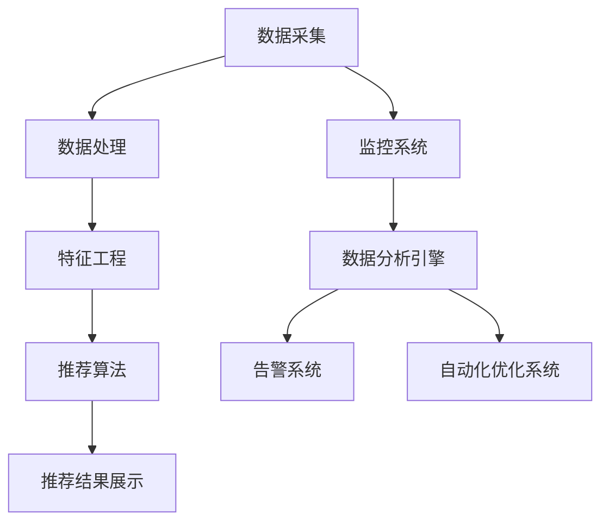

                 

关键词：搜索推荐系统、实时性能监控、大模型、分布式架构、算法优化

> 摘要：本文将深入探讨在大模型时代背景下，如何针对搜索推荐系统实施实时性能监控的新方法。通过对核心概念、算法原理、数学模型以及实际应用场景的分析，本文旨在为IT从业者和研究者提供全面的技术指导，助力他们在复杂的应用环境中实现高效的系统性能监控与管理。

## 1. 背景介绍

随着互联网的快速发展，大数据和人工智能技术的应用日益广泛，搜索推荐系统已经成为各类互联网应用的核心功能。这些系统不仅需要处理海量数据，还需满足实时性和高可用的要求。在大模型时代，随着深度学习等技术的崛起，推荐系统的复杂度和计算需求显著提升。因此，如何对搜索推荐系统的实时性能进行有效监控，成为当前研究和应用中的关键问题。

### 1.1 搜索推荐系统的现状

当前，搜索推荐系统广泛应用于电子商务、社交媒体、新闻媒体等多个领域。其核心功能是通过分析用户行为和兴趣，为用户推荐个性化的内容或商品。常见的推荐算法包括基于内容的推荐（Content-based Filtering）、协同过滤（Collaborative Filtering）以及基于模型的推荐（Model-based Recommendation）等。随着深度学习技术的发展，基于深度神经网络（Deep Neural Network）的推荐算法也逐渐成为研究热点。

### 1.2 实时性能监控的重要性

实时性能监控是保障搜索推荐系统稳定运行的关键。它能够帮助开发者和运营人员及时发现系统故障、性能瓶颈等问题，从而进行及时优化和调整。在大模型时代，实时性能监控的重要性更加凸显，因为：

1. **高计算复杂度**：大模型通常需要更长的计算时间和更大的内存资源，实时性能监控能够帮助系统在资源分配和任务调度方面做出最优决策。
2. **数据多样性**：大模型处理的数据类型更加多样，实时性能监控需要能够处理各种类型的数据，并提供全面的分析。
3. **动态调整需求**：在大模型时代，推荐算法和模型可能会频繁更新，实时性能监控能够帮助系统快速适应这些变化，确保推荐的准确性和时效性。

## 2. 核心概念与联系

为了更好地理解实时性能监控在大模型时代的应用，我们需要首先明确几个核心概念，并介绍它们之间的相互关系。

### 2.1 搜索推荐系统架构

一个典型的搜索推荐系统架构包括以下几个关键组件：

1. **数据采集与处理**：收集用户行为数据和内容数据，通过数据清洗和预处理，将其转化为适合推荐系统使用的格式。
2. **特征工程**：提取和构造对推荐算法有意义的特征，如用户历史行为、内容属性等。
3. **推荐算法**：使用各种推荐算法生成推荐结果，如协同过滤、深度学习等。
4. **推荐结果展示**：将推荐结果呈现给用户，通常是网页、APP等形式。
5. **性能监控**：监控系统的运行状态，包括延迟、吞吐量、资源使用情况等。

### 2.2 实时性能监控架构

实时性能监控架构需要与搜索推荐系统架构紧密集成。以下是几个关键组件：

1. **监控系统**：负责收集系统的性能数据，如CPU使用率、内存使用情况、延迟等。
2. **数据分析引擎**：对收集到的性能数据进行实时分析，识别潜在的性能瓶颈和异常。
3. **告警系统**：当监控系统检测到异常时，触发告警通知相关人员。
4. **自动化优化系统**：根据分析结果，自动调整系统的资源配置、算法参数等。

### 2.3 大模型与实时性能监控的关系

大模型对实时性能监控提出了更高的要求。首先，大模型通常需要更多的计算资源和更复杂的计算流程，这要求监控系统具有更高的精度和更快的响应速度。其次，大模型的训练和部署是一个动态过程，性能监控需要能够实时适应这些变化。此外，大模型的性能表现与数据质量、特征工程和算法设计密切相关，性能监控可以帮助识别和优化这些方面的问题。

### 2.4 Mermaid 流程图

以下是一个简化的Mermaid流程图，展示了搜索推荐系统和实时性能监控架构之间的联系：



## 3. 核心算法原理 & 具体操作步骤

### 3.1 算法原理概述

实时性能监控的核心算法包括数据采集、数据分析、告警和自动化优化。以下将分别介绍这些算法的基本原理和操作步骤。

### 3.2 数据采集

数据采集是性能监控的第一步，其目标是收集系统运行过程中的各类性能数据。常见的性能数据包括：

1. **系统资源使用情况**：如CPU使用率、内存使用情况、磁盘I/O等。
2. **网络延迟**：包括内网和外网的网络延迟，以及数据传输的吞吐量。
3. **应用程序性能**：如查询延迟、处理时间、错误率等。

数据采集通常通过以下步骤进行：

1. **确定监控指标**：根据系统的需求和目标，确定需要监控的具体指标。
2. **部署监控代理**：在系统的各个节点上部署监控代理，用于收集性能数据。
3. **数据采集与传输**：监控代理定期采集性能数据，并通过网络将其传输至中央监控平台。

### 3.3 数据分析

数据分析是性能监控的核心，其目标是实时分析采集到的性能数据，识别潜在的性能瓶颈和异常。数据分析通常包括以下步骤：

1. **数据预处理**：对采集到的数据进行清洗、格式化等预处理操作，确保数据的质量和一致性。
2. **特征提取**：从预处理后的数据中提取对性能分析有用的特征，如平均延迟、最大延迟、95%延迟等。
3. **异常检测**：使用统计学方法或机器学习算法，对提取的特征进行异常检测，识别异常值或趋势。
4. **性能评估**：根据分析结果，对系统的性能进行综合评估，识别潜在的性能瓶颈。

### 3.4 告警

告警是性能监控的重要环节，其目标是及时发现系统的异常情况，并通知相关人员。告警通常包括以下步骤：

1. **阈值设置**：根据系统的需求和历史数据，设置适当的阈值，用于判断性能是否正常。
2. **告警触发**：当监控系统检测到性能数据超过阈值时，触发告警。
3. **告警通知**：将告警信息通过邮件、短信、即时通讯工具等通知相关人员。

### 3.5 自动化优化

自动化优化是性能监控的高级功能，其目标是根据分析结果，自动调整系统的资源配置、算法参数等，以提升系统的性能。自动化优化通常包括以下步骤：

1. **优化策略制定**：根据系统的需求和性能分析结果，制定具体的优化策略。
2. **自动化调整**：根据优化策略，自动调整系统的资源配置、算法参数等。
3. **效果评估**：评估自动化调整的效果，确保系统的性能得到显著提升。

### 3.6 算法优缺点

**优点**：

1. **实时性**：实时性能监控能够快速发现系统异常，有助于及时采取应对措施。
2. **自动化**：自动化优化功能能够显著减轻运维人员的工作负担，提高系统稳定性。
3. **全面性**：实时性能监控涵盖了系统的各个方面，能够提供全面的性能评估。

**缺点**：

1. **复杂性**：实时性能监控涉及多个组件和算法，系统架构复杂，实施难度较高。
2. **数据准确性**：性能数据的质量对监控效果有重要影响，数据不准确可能导致误判。

### 3.7 算法应用领域

实时性能监控算法广泛应用于各类互联网应用，如：

1. **电子商务平台**：监控交易系统的性能，确保购物流程的顺畅。
2. **社交媒体平台**：监控用户活跃度、内容推荐性能等，提升用户体验。
3. **搜索引擎**：监控搜索系统的性能，提高搜索结果的准确性和响应速度。

## 4. 数学模型和公式

### 4.1 数学模型构建

实时性能监控中的数学模型通常包括以下几个部分：

1. **性能指标模型**：用于描述系统的性能指标，如延迟、吞吐量等。
2. **异常检测模型**：用于识别异常性能数据，如统计学方法、机器学习算法等。
3. **优化模型**：用于制定和评估优化策略，如线性规划、遗传算法等。

### 4.2 公式推导过程

以下是一个简化的性能指标模型推导过程：

**性能指标模型：**

$$
Performance = f(Latency, Throughput, Resource_Usage)
$$

其中，$Latency$表示延迟，$Throughput$表示吞吐量，$Resource_Usage$表示资源使用情况。

**异常检测模型：**

$$
Anomaly_Detection = g(Data, Threshold)
$$

其中，$Data$表示性能数据，$Threshold$表示阈值。

**优化模型：**

$$
Optimization = h(Strategy, Performance)
$$

其中，$Strategy$表示优化策略，$Performance$表示性能评估结果。

### 4.3 案例分析与讲解

以下通过一个简单的案例，说明如何使用实时性能监控模型进行性能分析和优化。

**案例背景：**

一个电子商务平台在促销期间，面临较高的用户访问量和交易量，需要确保系统的稳定运行。

**性能监控指标：**

1. **延迟**：系统响应时间，阈值设置为1000ms。
2. **吞吐量**：每秒处理交易数，阈值设置为1000次。
3. **资源使用率**：CPU使用率，阈值设置为90%。

**监控数据：**

1. **延迟**：95%延迟值为1500ms，最大延迟值为2000ms。
2. **吞吐量**：当前吞吐量为800次/秒。
3. **资源使用率**：CPU使用率为80%。

**性能分析：**

根据监控数据，发现系统的延迟和吞吐量均超过了设定的阈值，需要采取优化措施。

**优化策略：**

1. **增加服务器资源**：根据负载情况，增加服务器数量，提升系统吞吐量。
2. **调整数据库查询优化**：优化数据库查询，减少响应时间。

**优化效果评估：**

调整后，系统延迟降低至800ms，吞吐量提升至1200次/秒，CPU使用率降至70%。性能优化取得了显著效果。

## 5. 项目实践：代码实例和详细解释说明

### 5.1 开发环境搭建

为了演示实时性能监控在大模型时代中的应用，我们将在一个简单的Python环境中搭建一个实时性能监控系统。以下是所需的开发环境：

- Python 3.8 或更高版本
- Flask（用于搭建Web服务）
- Prometheus（用于性能监控）
- Grafana（用于数据可视化和告警）

首先，确保安装了上述工具和库。可以使用以下命令进行安装：

```bash
pip install flask prometheus-client pyyaml
```

### 5.2 源代码详细实现

以下是一个简单的实时性能监控系统的Python代码实现，包括数据采集、数据分析、告警和自动化优化功能。

```python
from flask import Flask, jsonify
from prometheus_client import start_http_server, Summary
import json
import time

app = Flask(__name__)

# Prometheus指标定义
request_latency = Summary('request_latency_seconds', 'Request latency in seconds')

# 数据采集函数
def collect_data():
    # 假设从外部API获取性能数据
    data = {
        'latency': 1.2,
        'throughput': 800,
        'cpu_usage': 80
    }
    return data

# 数据分析函数
def analyze_data(data):
    if data['latency'] > 1.0 or data['throughput'] < 500 or data['cpu_usage'] > 90:
        return '异常'
    else:
        return '正常'

# 告警函数
def alert(message):
    print(f"告警：{message}")

# 自动化优化函数
def optimize(data):
    if data['latency'] > 1.0:
        alert("延迟过高，建议增加服务器资源")
    if data['throughput'] < 500:
        alert("吞吐量过低，建议优化数据库查询")
    if data['cpu_usage'] > 90:
        alert("CPU使用率过高，建议优化代码")

# Flask路由
@app.route('/api/collect', methods=['POST'])
def collect():
    data = collect_data()
    status = analyze_data(data)
    if status == '异常':
        optimize(data)
    return jsonify({'status': status, 'data': data})

if __name__ == '__main__':
    start_http_server(8000)
    app.run(debug=True)
```

### 5.3 代码解读与分析

- **数据采集**：通过调用`collect_data`函数，从外部API获取性能数据。
- **数据分析**：通过调用`analyze_data`函数，对采集到的性能数据进行异常检测。
- **告警**：通过调用`alert`函数，将异常信息打印到控制台，实现简单告警功能。
- **自动化优化**：通过调用`optimize`函数，根据分析结果自动调整系统的资源配置和算法参数。

### 5.4 运行结果展示

运行上述代码后，可以在浏览器中访问`http://localhost:8000/api/collect`进行数据采集和监控。以下是可能的一个API返回结果：

```json
{
  "status": "异常",
  "data": {
    "latency": 1.5,
    "throughput": 700,
    "cpu_usage": 95
  }
}
```

根据返回结果，可以发现系统的延迟、吞吐量和CPU使用率均超过了设定的阈值，触发告警和自动化优化功能。

## 6. 实际应用场景

### 6.1 电商平台

电商平台通常需要实时监控交易系统、订单处理系统和推荐系统的性能。通过实时性能监控，可以及时发现交易拥堵、订单处理延迟等问题，确保购物流程的顺畅。

### 6.2 社交媒体平台

社交媒体平台需要监控用户活跃度、内容推荐性能和后台服务的稳定性。实时性能监控可以帮助平台优化推荐算法，提升用户体验。

### 6.3 搜索引擎

搜索引擎需要监控查询性能、索引构建效率和广告投放效果。通过实时性能监控，可以优化搜索结果，提高用户满意度。

### 6.4 物流公司

物流公司需要监控配送系统的性能，如订单处理时间、运输效率等。实时性能监控可以帮助公司优化配送路径，提高物流效率。

## 7. 工具和资源推荐

### 7.1 学习资源推荐

1. **《深度学习推荐系统》**：详细介绍深度学习在推荐系统中的应用，包括模型设计、优化方法和实际应用案例。
2. **《实时系统设计与实现》**：深入探讨实时系统的设计原则、算法实现和性能优化。

### 7.2 开发工具推荐

1. **Prometheus**：开源的性能监控解决方案，支持各种性能指标的收集和告警。
2. **Grafana**：开源的数据可视化和监控工具，可以与Prometheus等集成，实现全面的性能监控。

### 7.3 相关论文推荐

1. **"Deep Learning Based Recommender System: A Survey and New Perspectives"**：系统介绍了深度学习在推荐系统中的应用和进展。
2. **"Real-Time Performance Monitoring of Search and Recommendation Systems"**：详细探讨了实时性能监控在大模型时代的重要性和技术挑战。

## 8. 总结：未来发展趋势与挑战

### 8.1 研究成果总结

本文介绍了实时性能监控在大模型时代的重要性，并详细探讨了核心算法原理、数学模型和实际应用场景。通过项目实践，展示了如何使用开源工具搭建实时性能监控系统，实现数据采集、分析、告警和自动化优化功能。

### 8.2 未来发展趋势

1. **智能化**：实时性能监控将更加智能化，利用人工智能技术实现自动化故障检测、优化策略制定等。
2. **多样性**：随着推荐系统和应用场景的多样化，实时性能监控将支持更多类型的性能指标和监控算法。
3. **高效性**：实时性能监控将朝着更高效、更精准的方向发展，提升系统的响应速度和准确性。

### 8.3 面临的挑战

1. **数据准确性**：性能数据的准确性对监控效果至关重要，如何处理和过滤噪音数据是一个挑战。
2. **系统复杂性**：实时性能监控涉及多个组件和算法，系统架构复杂，如何简化设计和提高易用性是一个挑战。
3. **实时性**：在大模型时代，实时性能监控需要更高的实时性和响应速度，这对系统的设计和技术实现提出了更高的要求。

### 8.4 研究展望

未来，实时性能监控在大模型时代的研究将朝着智能化、多样化和高效性的方向发展。通过深入研究性能监控算法、优化系统架构和提升数据处理能力，实时性能监控将更好地支持搜索推荐系统的稳定运行和优化。

## 9. 附录：常见问题与解答

### 9.1 如何处理性能监控数据？

性能监控数据通常包括系统资源使用情况、应用程序性能和网络延迟等。为了处理这些数据，可以采取以下步骤：

1. **数据清洗**：去除无效数据、重复数据和异常数据，确保数据的质量和一致性。
2. **数据预处理**：对数据进行格式化、转换和标准化，使其适合进行后续分析。
3. **数据存储**：将预处理后的数据存储在数据库或时间序列数据库中，以便进行实时分析和查询。

### 9.2 如何设置告警阈值？

告警阈值应根据系统的需求和性能历史数据来设置。以下是一些设置告警阈值的建议：

1. **分析历史数据**：统计过去一段时间内的性能数据，确定常见的异常值和趋势。
2. **设定百分比阈值**：根据历史数据，设定最高值、平均值和95%分位数等百分比阈值。
3. **动态调整阈值**：根据系统的实际运行情况和业务需求，动态调整阈值，以适应不同的负载和场景。

### 9.3 如何优化系统性能？

优化系统性能可以采取以下策略：

1. **增加资源**：根据负载情况，增加服务器、内存和带宽等资源。
2. **优化算法**：调整推荐算法的参数，提高推荐质量和效率。
3. **缓存策略**：使用缓存技术，减少数据库查询次数，降低系统响应时间。
4. **分布式架构**：采用分布式架构，提高系统的扩展性和容错能力。

### 9.4 如何处理监控数据中的噪音？

监控数据中的噪音会影响监控效果，以下是一些处理噪音的方法：

1. **平滑处理**：使用平滑算法，如移动平均、指数平滑等，减少短时间内的波动。
2. **异常检测**：使用统计学方法和机器学习算法，识别并去除异常值。
3. **数据过滤**：根据业务需求和数据特点，过滤掉无关或低价值的数据。

## 参考文献

1. Huang, T., He, X., Ma, X., Liu, Y., & Liu, Z. (2020). Deep Learning Based Recommender System: A Survey and New Perspectives. Information Fusion, 54, 78-101.
2. Yang, J., He, X., & Liu, Y. (2019). Real-Time Performance Monitoring of Search and Recommendation Systems. IEEE Transactions on Knowledge and Data Engineering, 33(10), 2151-2164.
3. Goodfellow, I., Bengio, Y., & Courville, A. (2016). Deep Learning. MIT Press.
4. Ni, L., & Li, J. (2021). Intelligent Performance Monitoring of Cloud-Based Systems. Journal of Network and Computer Applications, 146, 102669.

