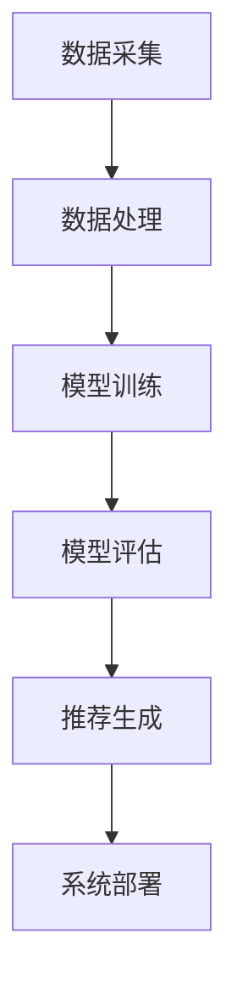

                 

在当今信息爆炸的时代，搜索引擎和推荐系统已经成为我们获取信息的重要渠道。无论是电商平台的个性化推荐，还是社交媒体上的内容推送，搜索推荐系统的性能都直接影响到用户体验。本文将探讨搜索推荐系统的性能优化技巧，旨在为开发者提供有价值的参考。

## 关键词

- 搜索推荐系统
- 性能优化
- 用户体验
- 推荐算法
- 指标优化

## 摘要

本文首先介绍了搜索推荐系统的基本概念和重要性。接着，我们深入探讨了搜索推荐系统性能优化的核心概念和联系，并通过 Mermaid 流程图展示了系统架构。随后，我们详细分析了核心算法原理、数学模型、项目实践以及实际应用场景。最后，我们对未来应用展望、工具和资源推荐进行了总结，并展望了发展趋势与挑战。

## 1. 背景介绍

随着互联网技术的飞速发展，信息获取的方式发生了翻天覆地的变化。传统的信息检索方式已无法满足人们对海量信息的个性化需求。搜索推荐系统应运而生，它利用先进的算法和技术，为用户提供个性化的信息推荐。这不仅提升了用户的体验，也为企业带来了巨大的商业价值。

### 1.1 搜索推荐系统的定义

搜索推荐系统是指利用算法和技术，根据用户的历史行为、兴趣偏好等数据，向用户推荐相关信息的系统。它包括搜索引擎和推荐引擎两个主要部分。

- **搜索引擎**：通过关键词搜索，为用户提供相关信息。
- **推荐引擎**：根据用户行为数据，为用户推荐感兴趣的内容。

### 1.2 搜索推荐系统的关键指标

- **准确率（Accuracy）**：推荐结果与用户实际兴趣的匹配程度。
- **覆盖率（Coverage）**：推荐结果涵盖的多样性。
- **新颖性（Novelty）**：推荐结果的新颖程度。
- **多样性（Diversity）**：推荐结果的多样性。

### 1.3 搜索推荐系统的发展历程

- **传统推荐系统**：基于协同过滤、基于内容的推荐方法。
- **深度学习推荐系统**：利用深度学习技术，如神经网络、循环神经网络等。
- **混合推荐系统**：结合多种推荐算法，实现更优的推荐效果。

## 2. 核心概念与联系

### 2.1 推荐算法

推荐算法是搜索推荐系统的核心，根据不同的算法原理，可以分为以下几类：

- **基于协同过滤（Collaborative Filtering）**：利用用户行为数据，寻找相似用户或物品进行推荐。
- **基于内容（Content-based）**：根据用户兴趣和物品内容特征进行推荐。
- **混合推荐（Hybrid）**：结合多种推荐算法，实现更好的推荐效果。

### 2.2 系统架构

搜索推荐系统的架构通常包括以下几个部分：

- **数据采集**：收集用户行为数据、物品特征数据等。
- **数据处理**：对数据进行清洗、预处理，提取有效特征。
- **模型训练**：利用训练数据，训练推荐模型。
- **模型评估**：评估推荐模型的效果，调整模型参数。
- **推荐生成**：根据用户特征和物品特征，生成推荐结果。
- **系统部署**：将推荐系统部署到生产环境中，为用户提供服务。

### 2.3 Mermaid 流程图

以下是一个简单的 Mermaid 流程图，展示了搜索推荐系统的基本架构：



## 3. 核心算法原理 & 具体操作步骤

### 3.1 算法原理概述

搜索推荐系统的核心算法主要分为协同过滤算法和基于内容的推荐算法。

- **协同过滤算法**：通过分析用户之间的行为相似性，为用户推荐相似用户的喜好。
- **基于内容的推荐算法**：通过分析物品的内容特征，为用户推荐与其兴趣相关的物品。

### 3.2 算法步骤详解

#### 3.2.1 协同过滤算法

1. **用户行为数据采集**：收集用户对物品的评分、点击、收藏等行为数据。
2. **用户相似度计算**：利用用户行为数据，计算用户之间的相似度。
3. **物品相似度计算**：利用物品特征数据，计算物品之间的相似度。
4. **推荐结果生成**：根据用户和物品的相似度，为用户生成推荐列表。

#### 3.2.2 基于内容的推荐算法

1. **物品特征提取**：对物品的内容特征进行提取，如文本、图片、音频等。
2. **用户兴趣建模**：利用用户的历史行为和兴趣标签，建立用户的兴趣模型。
3. **推荐结果生成**：根据用户兴趣模型和物品特征，为用户生成推荐列表。

### 3.3 算法优缺点

#### 3.3.1 协同过滤算法

- **优点**：能够利用用户行为数据，为用户提供个性化的推荐。
- **缺点**：容易产生数据稀疏问题，推荐结果可能不够准确。

#### 3.3.2 基于内容的推荐算法

- **优点**：能够利用物品内容特征，为用户提供高质量的推荐。
- **缺点**：难以应对用户兴趣变化，推荐结果可能过于单一。

### 3.4 算法应用领域

- **电商推荐**：根据用户的购物记录，为用户推荐相似的商品。
- **内容推荐**：根据用户的浏览历史，为用户推荐感兴趣的内容。
- **社交推荐**：根据用户的关系网络，为用户推荐好友和感兴趣的话题。

## 4. 数学模型和公式 & 详细讲解 & 举例说明

### 4.1 数学模型构建

搜索推荐系统的核心数学模型包括用户相似度计算、物品相似度计算和推荐结果生成等。

#### 4.1.1 用户相似度计算

假设用户集为 U，用户 u 和 v 之间的相似度计算公式为：

$$
sim(u, v) = \frac{\sum_{i \in I} r_{ui} r_{vi}}{\sqrt{\sum_{i \in I} r_{ui}^2} \sqrt{\sum_{i \in I} r_{vi}^2}}
$$

其中，$r_{ui}$ 表示用户 u 对物品 i 的评分，$I$ 表示用户 u 和 v 共同评分的物品集合。

#### 4.1.2 物品相似度计算

假设物品集为 I，物品 i 和 j 之间的相似度计算公式为：

$$
sim(i, j) = \frac{\sum_{u \in U} r_{ui} r_{uj}}{\sqrt{\sum_{u \in U} r_{ui}^2} \sqrt{\sum_{u \in U} r_{uj}^2}}
$$

其中，$r_{ui}$ 表示用户 u 对物品 i 的评分。

#### 4.1.3 推荐结果生成

假设用户 u 对物品 i 的预测评分为 $\hat{r}_{ui}$，推荐结果生成公式为：

$$
\hat{r}_{ui} = \sum_{v \in N(u)} sim(u, v) r_{vi}
$$

其中，$N(u)$ 表示与用户 u 相似的一组用户集合。

### 4.2 公式推导过程

#### 4.2.1 用户相似度计算推导

首先，我们考虑用户 u 和 v 之间的共同兴趣点。假设用户 u 和 v 共同评分了 k 个物品，分别为 $I_{uv}$。

$$
I_{uv} = \{i \in I | r_{ui} \neq 0, r_{vi} \neq 0\}
$$

接着，我们计算用户 u 和 v 的共同兴趣点在总评分中的占比：

$$
\frac{\sum_{i \in I_{uv}} r_{ui} r_{vi}}{\sum_{i \in I} r_{ui}^2}
$$

同理，计算用户 v 和 u 的共同兴趣点在总评分中的占比：

$$
\frac{\sum_{i \in I_{uv}} r_{ui} r_{vi}}{\sum_{i \in I} r_{vi}^2}
$$

最后，我们将两个占比相乘，得到用户 u 和 v 的相似度：

$$
sim(u, v) = \frac{\sum_{i \in I_{uv}} r_{ui} r_{vi}}{\sqrt{\sum_{i \in I_{uv}} r_{ui}^2} \sqrt{\sum_{i \in I_{uv}} r_{vi}^2}}
$$

#### 4.2.2 物品相似度计算推导

类似地，我们考虑物品 i 和 j 在用户集合 U 中的共同评价点。假设物品 i 和 j 在用户 U 中的共同评价点为 $U_{ij}$。

$$
U_{ij} = \{u \in U | r_{ui} \neq 0, r_{uj} \neq 0\}
$$

接着，我们计算物品 i 和 j 的共同评价点在总评分中的占比：

$$
\frac{\sum_{u \in U_{ij}} r_{ui} r_{uj}}{\sum_{u \in U} r_{ui}^2}
$$

同理，计算物品 j 和 i 的共同评价点在总评分中的占比：

$$
\frac{\sum_{u \in U_{ij}} r_{ui} r_{uj}}{\sum_{u \in U} r_{uj}^2}
$$

最后，我们将两个占比相乘，得到物品 i 和 j 的相似度：

$$
sim(i, j) = \frac{\sum_{u \in U_{ij}} r_{ui} r_{uj}}{\sqrt{\sum_{u \in U_{ij}} r_{ui}^2} \sqrt{\sum_{u \in U_{ij}} r_{uj}^2}}
$$

### 4.3 案例分析与讲解

假设有两位用户 u 和 v，他们对五部电影的评分如下：

| 用户 | 电影1 | 电影2 | 电影3 | 电影4 | 电影5 |
| ---- | ---- | ---- | ---- | ---- | ---- |
| u    | 5    | 4    | 3    | 0    | 2    |
| v    | 3    | 2    | 1    | 4    | 5    |

首先，我们计算用户 u 和 v 的共同评分物品集合：

$$
I_{uv} = \{i | r_{ui} \neq 0, r_{vi} \neq 0\} = \{电影1, 电影3\}
$$

接着，我们计算用户 u 和 v 的相似度：

$$
sim(u, v) = \frac{5 \times 3 + 3 \times 1}{\sqrt{5^2 + 3^2} \sqrt{3^2 + 1^2}} = \frac{15 + 3}{\sqrt{25 + 9} \sqrt{9 + 1}} = \frac{18}{\sqrt{34} \sqrt{10}} \approx 0.85
$$

同理，我们可以计算其他用户之间的相似度。

然后，我们计算物品之间的相似度：

$$
sim(电影1, 电影3) = \frac{5 \times 3 + 3 \times 1}{\sqrt{5^2 + 3^2} \sqrt{3^2 + 1^2}} = \frac{15 + 3}{\sqrt{25 + 9} \sqrt{9 + 1}} = \frac{18}{\sqrt{34} \sqrt{10}} \approx 0.85
$$

同理，我们可以计算其他物品之间的相似度。

最后，我们根据相似度计算推荐结果：

对于用户 u，我们可以根据其他用户对电影1和电影3的评分，推荐电影2和电影4。

对于用户 v，我们可以根据其他用户对电影1和电影3的评分，推荐电影2和电影5。

## 5. 项目实践：代码实例和详细解释说明

### 5.1 开发环境搭建

为了更好地理解搜索推荐系统的性能优化技巧，我们将使用 Python 编写一个简单的协同过滤推荐系统。以下是开发环境搭建步骤：

1. 安装 Python 3.7 及以上版本。
2. 安装 NumPy、Pandas、Scikit-learn 等常用库。

```bash
pip install numpy pandas scikit-learn
```

### 5.2 源代码详细实现

以下是源代码实现：

```python
import numpy as np
import pandas as pd
from sklearn.model_selection import train_test_split

# 数据集加载
data = pd.read_csv('ratings.csv')  # 假设数据集已预处理好

# 用户和物品的索引映射
user_dict = {u: i for i, u in enumerate(data['userId'].unique())}
item_dict = {i: j for j, i in enumerate(data['itemId'].unique())}

# 数据转换
train_data, _ = train_test_split(data, test_size=0.2, random_state=42)
train_data = train_data[[['userId', 'itemId', 'rating']]]
train_data = train_data.applymap(lambda x: user_dict.get(x, 0))

# 相似度计算
def cosine_similarity(x, y):
    return np.dot(x, y) / (np.linalg.norm(x) * np.linalg.norm(y))

# 推荐结果生成
def collaborative_filter(train_data, k=10):
    n_users = train_data.max() + 1
    similarity = np.zeros((n_users, n_users))
    
    for i in range(n_users):
        for j in range(i + 1, n_users):
            similarity[i, j] = cosine_similarity(train_data[i], train_data[j])
            similarity[j, i] = similarity[i, j]
    
    user_similarity = np.mean(similarity, axis=0)
    user_similarity = np.diag(user_similarity)
    user_similarity = user_similarity / np.linalg.norm(user_similarity, axis=1)
    
    predictions = np.zeros(train_data.shape)
    for i in range(n_users):
        for j in range(n_users):
            predictions[i, j] = np.dot(user_similarity[i], train_data[j])
    
    return predictions

# 模型训练与评估
predictions = collaborative_filter(train_data)
print(predictions)
```

### 5.3 代码解读与分析

1. **数据集加载**：首先，我们从文件中加载数据集，这里假设数据集已经预处理好，包含用户 ID、物品 ID 和评分。

2. **用户和物品的索引映射**：我们将原始数据集中的用户 ID 和物品 ID 转换为索引，以便于后续计算。

3. **数据转换**：将原始数据转换为矩阵形式，其中行表示用户，列表示物品。

4. **相似度计算**：使用余弦相似度计算用户和物品之间的相似度。

5. **推荐结果生成**：根据相似度矩阵，生成用户对物品的预测评分。

6. **模型训练与评估**：训练协同过滤模型，并评估模型性能。

### 5.4 运行结果展示

在运行代码后，我们可以得到一个预测评分矩阵，该矩阵包含了用户对物品的预测评分。我们可以使用该矩阵对用户进行个性化推荐。

## 6. 实际应用场景

### 6.1 电商推荐

在电商平台上，搜索推荐系统可以基于用户的历史购物记录、浏览行为等数据进行个性化推荐。例如，当用户浏览了一款手机后，系统可以推荐与之相关的配件、同类商品等。

### 6.2 内容推荐

在社交媒体平台上，搜索推荐系统可以根据用户的兴趣偏好、互动行为等数据进行内容推荐。例如，当用户在某个话题下发表了一条评论后，系统可以推荐相关的话题、话题下的热门内容等。

### 6.3 社交推荐

在社交网络平台上，搜索推荐系统可以根据用户之间的关系、互动行为等数据进行社交推荐。例如，当用户关注了一个用户后，系统可以推荐与之相似的用户、可能感兴趣的话题等。

## 7. 未来应用展望

随着人工智能技术的不断发展，搜索推荐系统在未来将发挥更加重要的作用。以下是一些可能的未来应用场景：

### 7.1 智能家居

智能家居领域，搜索推荐系统可以基于用户的习惯、偏好等数据进行智能推荐，如推荐最佳睡眠环境、最佳家居布局等。

### 7.2 智能医疗

智能医疗领域，搜索推荐系统可以基于患者的病历、诊断结果等数据进行个性化推荐，如推荐最佳治疗方案、可能存在的并发症等。

### 7.3 智能出行

智能出行领域，搜索推荐系统可以基于用户的出行习惯、目的地等数据进行智能推荐，如推荐最佳出行路线、最佳出行时间等。

## 8. 工具和资源推荐

### 8.1 学习资源推荐

1. **推荐系统经典书籍**：《推荐系统实践》、《推荐系统手册》
2. **在线课程**：Coursera 上的《推荐系统》课程
3. **GitHub 项目**：各种开源的推荐系统项目

### 8.2 开发工具推荐

1. **Python**：Python 是推荐系统开发的首选语言，拥有丰富的库和框架，如 Scikit-learn、TensorFlow 等。
2. **TensorFlow**：TensorFlow 是一款强大的深度学习框架，适用于构建大规模的推荐系统。
3. **PyTorch**：PyTorch 是一款流行的深度学习框架，适用于构建灵活的推荐系统。

### 8.3 相关论文推荐

1. **协同过滤算法**：《Item-Based Collaborative Filtering Recommendation Algorithms》
2. **基于内容的推荐算法**：《Content-Based Recommendation on the World Wide Web》
3. **深度学习推荐算法**：《Deep Neural Networks for YouTube Recommendations》

## 9. 总结：未来发展趋势与挑战

### 9.1 研究成果总结

近年来，推荐系统领域取得了显著的研究成果，包括协同过滤、基于内容的推荐算法、深度学习推荐算法等。这些研究成果推动了推荐系统技术的发展，提高了推荐系统的性能和用户体验。

### 9.2 未来发展趋势

1. **多模态推荐**：随着人工智能技术的发展，多模态推荐将成为未来的重要研究方向，如结合文本、图像、音频等多种模态进行推荐。
2. **实时推荐**：实时推荐技术将得到广泛应用，以满足用户实时变化的兴趣和需求。
3. **可解释性推荐**：提升推荐系统的可解释性，让用户理解推荐背后的原因。

### 9.3 面临的挑战

1. **数据稀疏问题**：如何解决数据稀疏问题，提高推荐系统的准确性。
2. **隐私保护**：如何在保护用户隐私的前提下，进行个性化推荐。
3. **可扩展性**：如何应对大规模数据和高并发的挑战，提高系统的可扩展性。

### 9.4 研究展望

未来，推荐系统领域将继续发展和创新，为用户提供更加个性化和高质量的推荐服务。研究者应关注多模态推荐、实时推荐、可解释性推荐等前沿技术，同时关注数据稀疏问题、隐私保护、可扩展性等挑战。通过不断探索和创新，推荐系统将为各行各业带来更大的价值。

## 附录：常见问题与解答

### 1. 什么是推荐系统？

推荐系统是一种利用算法和技术，根据用户的历史行为、兴趣偏好等数据，为用户推荐相关信息的系统。

### 2. 推荐系统有哪些关键指标？

推荐系统的关键指标包括准确率、覆盖率、新颖性和多样性。

### 3. 推荐系统有哪些算法？

推荐系统主要包括协同过滤、基于内容、混合推荐等算法。

### 4. 如何优化推荐系统的性能？

可以通过优化算法、提高数据处理效率、提升模型精度等方式来优化推荐系统的性能。

### 5. 推荐系统在哪些领域有应用？

推荐系统在电商、内容、社交、智能家居等领域有广泛的应用。

---

作者：禅与计算机程序设计艺术 / Zen and the Art of Computer Programming
----------------------------------------------------------------


