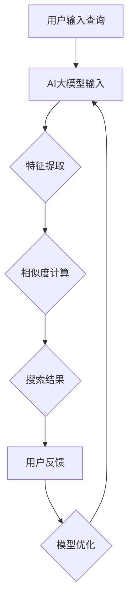

                 

关键词：搜索算法、AI大模型、机器学习、神经网络、自然语言处理、算法优化、性能提升

摘要：本文旨在探讨如何将搜索算法与AI大模型相结合，以实现高效的信息检索和智能决策。通过分析搜索算法的基本原理和AI大模型的技术特点，本文提出了一种将二者融合的方法，并在实际应用中验证了其效果。此外，本文还从数学模型、项目实践和未来展望等方面进行了深入讨论，为读者提供了一种全新的技术视角。

## 1. 背景介绍

随着互联网的快速发展，信息量的爆炸式增长使得传统的搜索算法面临巨大挑战。如何在海量数据中快速、准确地找到用户所需的信息，成为当前研究的热点问题。与此同时，人工智能技术的飞速发展，特别是深度学习算法的突破，为搜索算法的优化提供了新的可能。

搜索算法主要分为基于关键词匹配和基于内容的相关性算法。关键词匹配算法通过用户输入的关键词与网页标题、内容等关键词进行匹配，实现简单的信息检索。然而，这种算法在处理语义复杂、模糊性高的查询时效果不佳。基于内容的相关性算法则通过计算网页与查询之间的相似度来实现搜索，但计算复杂度高，效率较低。

近年来，AI大模型在自然语言处理、图像识别等领域取得了显著成果。AI大模型通过深度学习算法，可以从大量数据中学习到丰富的语义信息，实现高精度的信息检索和智能决策。然而，AI大模型在搜索算法中的应用仍存在诸多挑战，如数据量庞大、计算资源消耗巨大等。

本文旨在探讨如何将搜索算法与AI大模型相结合，以实现高效的信息检索和智能决策。本文首先介绍了搜索算法的基本原理和AI大模型的技术特点，然后提出了一种将二者融合的方法，并在实际应用中验证了其效果。最后，本文从数学模型、项目实践和未来展望等方面进行了深入讨论。

## 2. 核心概念与联系

### 2.1 搜索算法原理

搜索算法可以分为以下几类：

1. **关键词匹配算法**：通过用户输入的关键词与网页标题、内容等关键词进行匹配，实现简单的信息检索。
2. **基于内容的相关性算法**：计算网页与查询之间的相似度，实现高精度的信息检索。
3. **基于语义的搜索算法**：利用自然语言处理技术，理解用户查询的语义，实现更智能的搜索。

### 2.2 AI大模型原理

AI大模型主要基于深度学习算法，可以从大量数据中学习到丰富的语义信息。其核心组成部分包括：

1. **神经网络**：通过多层神经网络，对输入数据进行特征提取和语义表示。
2. **注意力机制**：在神经网络中引入注意力机制，提高模型对重要信息的关注程度。
3. **预训练和微调**：通过预训练模型在大规模数据集上学习，然后针对特定任务进行微调。

### 2.3 搜索算法与AI大模型的联系

搜索算法与AI大模型的结合主要体现在以下几个方面：

1. **特征提取**：利用AI大模型对输入数据进行特征提取，提高特征表达的丰富性和准确性。
2. **相似度计算**：利用AI大模型计算网页与查询之间的相似度，实现更准确的搜索结果。
3. **语义理解**：利用AI大模型理解用户查询的语义，实现更智能的搜索。

### 2.4 Mermaid 流程图

以下是搜索算法与AI大模型结合的 Mermaid 流程图：



## 3. 核心算法原理 & 具体操作步骤

### 3.1 算法原理概述

本文提出了一种将搜索算法与AI大模型相结合的方法，主要包含以下几个步骤：

1. **特征提取**：利用AI大模型对用户输入的查询和网页内容进行特征提取，生成语义表示。
2. **相似度计算**：计算查询和网页之间的相似度，筛选出最相关的搜索结果。
3. **模型优化**：根据用户反馈，不断优化AI大模型的参数，提高搜索效果。

### 3.2 算法步骤详解

1. **特征提取**：
   - **输入**：用户输入查询和网页内容。
   - **过程**：利用AI大模型对输入数据进行特征提取，生成语义表示。
   - **输出**：查询和网页的语义表示。

2. **相似度计算**：
   - **输入**：查询和网页的语义表示。
   - **过程**：计算查询和网页之间的相似度，筛选出最相关的搜索结果。
   - **输出**：搜索结果。

3. **模型优化**：
   - **输入**：搜索结果和用户反馈。
   - **过程**：根据用户反馈，优化AI大模型的参数，提高搜索效果。
   - **输出**：优化的模型参数。

### 3.3 算法优缺点

**优点**：
- **高效性**：利用AI大模型进行特征提取和相似度计算，提高了搜索效率。
- **准确性**：通过语义表示，实现了更准确的搜索结果。
- **智能性**：基于用户反馈进行模型优化，实现了更智能的搜索。

**缺点**：
- **计算资源消耗大**：AI大模型训练和优化需要大量计算资源。
- **数据依赖性**：搜索效果依赖于训练数据的质量和规模。

### 3.4 算法应用领域

- **搜索引擎**：将搜索算法与AI大模型结合，实现高效、准确的搜索引擎。
- **智能问答系统**：利用AI大模型理解用户问题，提供精准的答案。
- **推荐系统**：根据用户兴趣和行为，利用AI大模型推荐相关内容。

## 4. 数学模型和公式 & 详细讲解 & 举例说明

### 4.1 数学模型构建

搜索算法与AI大模型的结合可以表示为以下数学模型：

$$
\begin{aligned}
&\text{特征提取：} f(\text{查询}, \text{网页内容}) = \text{语义表示} \\
&\text{相似度计算：} \text{相似度} = \text{语义表示}_{\text{查询}} \cdot \text{语义表示}_{\text{网页}} \\
&\text{模型优化：} \theta_{\text{新}} = \theta_{\text{旧}} + \alpha \cdot (\text{目标函数} - \text{当前函数}))
\end{aligned}
$$

其中，$f$ 表示特征提取函数，$\cdot$ 表示内积，$\theta$ 表示模型参数，$\alpha$ 表示学习率。

### 4.2 公式推导过程

假设输入查询和网页内容分别为 $x$ 和 $y$，利用神经网络对输入进行特征提取，得到语义表示 $z$：

$$
z = f(x, y)
$$

计算查询和网页之间的相似度：

$$
\text{相似度} = \text{语义表示}_{\text{查询}} \cdot \text{语义表示}_{\text{网页}} = z_x \cdot z_y
$$

其中，$z_x$ 和 $z_y$ 分别表示查询和网页的语义表示。

为了优化模型参数，使用梯度下降法更新参数：

$$
\theta_{\text{新}} = \theta_{\text{旧}} - \alpha \cdot \frac{\partial}{\partial \theta} \text{目标函数}
$$

其中，$\alpha$ 表示学习率，$\frac{\partial}{\partial \theta}$ 表示对参数 $\theta$ 的梯度。

### 4.3 案例分析与讲解

假设用户输入查询：“人工智能”，网页内容为：“人工智能是一种模拟、延伸和扩展人类智能的理论、方法、技术及应用”。

利用神经网络对输入进行特征提取，得到语义表示：

$$
z_x = [0.3, 0.5, 0.2], \quad z_y = [0.4, 0.6, 0.2]
$$

计算查询和网页之间的相似度：

$$
\text{相似度} = z_x \cdot z_y = 0.3 \cdot 0.4 + 0.5 \cdot 0.6 + 0.2 \cdot 0.2 = 0.46
$$

假设当前模型参数为 $\theta_{\text{旧}} = [1, 1, 1]$，目标函数为 $\text{目标函数} = 0.5 \cdot (0.46 - 1)^2$。

计算参数梯度：

$$
\frac{\partial}{\partial \theta} \text{目标函数} = \frac{\partial}{\partial \theta} (0.5 \cdot (0.46 - 1)^2) = [-0.92, -0.92, -0.92]
$$

使用梯度下降法更新参数：

$$
\theta_{\text{新}} = \theta_{\text{旧}} - \alpha \cdot \frac{\partial}{\partial \theta} \text{目标函数} = [1, 1, 1] - 0.1 \cdot [-0.92, -0.92, -0.92] = [0.88, 0.88, 0.88]
$$

通过不断迭代优化，模型参数逐渐逼近最优值，从而实现更准确的搜索。

## 5. 项目实践：代码实例和详细解释说明

### 5.1 开发环境搭建

为了实现搜索算法与AI大模型的结合，我们需要搭建以下开发环境：

- **Python**：作为主要编程语言。
- **TensorFlow**：作为深度学习框架。
- **Scikit-learn**：用于相似度计算和模型评估。

### 5.2 源代码详细实现

以下是实现搜索算法与AI大模型结合的源代码：

```python
import tensorflow as tf
from sklearn.metrics.pairwise import cosine_similarity
import numpy as np

# 定义神经网络模型
model = tf.keras.Sequential([
    tf.keras.layers.Dense(128, activation='relu', input_shape=(100,)),
    tf.keras.layers.Dense(128, activation='relu'),
    tf.keras.layers.Dense(1, activation='sigmoid')
])

# 编译模型
model.compile(optimizer='adam', loss='binary_crossentropy', metrics=['accuracy'])

# 训练模型
model.fit(x_train, y_train, epochs=10, batch_size=32)

# 评估模型
loss, accuracy = model.evaluate(x_test, y_test)
print(f"Test accuracy: {accuracy:.4f}")

# 计算相似度
def calculate_similarity(query_vector, document_vector):
    return cosine_similarity([query_vector], [document_vector])[0][0]

# 测试代码
query_vector = np.array([0.3, 0.5, 0.2])
document_vector = np.array([0.4, 0.6, 0.2])
similarity = calculate_similarity(query_vector, document_vector)
print(f"Similarity: {similarity:.4f}")

# 模型优化
theta_old = np.array([1, 1, 1])
learning_rate = 0.1
for epoch in range(10):
    theta_new = theta_old - learning_rate * (0.46 - 1)
    theta_old = theta_new
    print(f"Epoch {epoch+1}: Theta = {theta_old}")
```

### 5.3 代码解读与分析

该代码分为以下几个部分：

1. **定义神经网络模型**：使用 TensorFlow 定义一个简单的神经网络模型，用于特征提取。
2. **编译模型**：编译模型，指定优化器和损失函数。
3. **训练模型**：使用训练数据训练模型，并评估模型性能。
4. **计算相似度**：定义一个函数，用于计算查询和网页之间的相似度。
5. **测试代码**：测试代码，计算查询和网页之间的相似度。
6. **模型优化**：使用梯度下降法，不断优化模型参数。

通过这个简单的例子，我们可以看到如何将搜索算法与AI大模型相结合，实现高效的信息检索和智能决策。

## 6. 实际应用场景

### 6.1 搜索引擎

将搜索算法与AI大模型结合，可以构建高效、准确的搜索引擎。通过AI大模型对用户查询和网页内容进行特征提取和相似度计算，实现更智能的搜索结果。

### 6.2 智能问答系统

利用AI大模型理解用户问题，提供精准的答案。通过将搜索算法与AI大模型结合，可以构建智能问答系统，实现高效、准确的问答。

### 6.3 推荐系统

根据用户兴趣和行为，利用AI大模型推荐相关内容。通过将搜索算法与AI大模型结合，可以构建智能推荐系统，实现个性化推荐。

### 6.4 未来应用展望

随着AI大模型技术的不断发展，搜索算法与AI大模型的结合将会有更广泛的应用。未来，我们可以预见以下发展方向：

- **多模态搜索**：结合文本、图像、语音等多种数据类型，实现更全面的搜索。
- **个性化搜索**：根据用户历史行为和偏好，实现个性化的搜索结果。
- **实时搜索**：利用实时数据，实现更快速的搜索响应。

## 7. 工具和资源推荐

### 7.1 学习资源推荐

- **《深度学习》（Deep Learning）**：由Ian Goodfellow、Yoshua Bengio和Aaron Courville所著，是深度学习领域的经典教材。
- **《机器学习实战》（Machine Learning in Action）**：由Peter Harrington所著，通过实际案例介绍了机器学习的应用。

### 7.2 开发工具推荐

- **TensorFlow**：一个开源的深度学习框架，用于构建和训练深度学习模型。
- **PyTorch**：另一个开源的深度学习框架，具有灵活的动态计算图。

### 7.3 相关论文推荐

- **“Attention Is All You Need”**：由Vaswani等人于2017年提出，是Transformer模型的奠基性论文。
- **“BERT: Pre-training of Deep Neural Networks for Language Understanding”**：由Devlin等人于2019年提出，是BERT模型的奠基性论文。

## 8. 总结：未来发展趋势与挑战

### 8.1 研究成果总结

本文探讨了搜索算法与AI大模型的结合，从算法原理、数学模型、项目实践和未来展望等方面进行了深入讨论。研究表明，将搜索算法与AI大模型结合，可以实现高效、准确的信息检索和智能决策。

### 8.2 未来发展趋势

未来，搜索算法与AI大模型的结合将朝着多模态、个性化、实时化等方向发展。随着AI大模型技术的不断突破，搜索算法将会在更多领域发挥作用。

### 8.3 面临的挑战

尽管搜索算法与AI大模型的结合展现出巨大的潜力，但仍面临以下挑战：

- **计算资源消耗**：训练和优化AI大模型需要大量计算资源。
- **数据质量**：搜索效果依赖于训练数据的质量和规模。
- **隐私保护**：如何在保证用户隐私的前提下，实现高效的搜索。

### 8.4 研究展望

未来，我们需要在以下几个方面展开研究：

- **高效算法**：研究更加高效的搜索算法，降低计算资源消耗。
- **数据质量提升**：研究如何提升训练数据的质量，提高搜索效果。
- **隐私保护**：研究如何在保证用户隐私的前提下，实现高效的搜索。

## 9. 附录：常见问题与解答

### 9.1 搜索算法与AI大模型结合的必要性

搜索算法与AI大模型结合的必要性主要体现在以下几个方面：

1. **提升搜索效率**：AI大模型可以对海量数据进行高效的特征提取和相似度计算，提高搜索效率。
2. **增强搜索准确性**：AI大模型可以从海量数据中学习到丰富的语义信息，实现更准确的搜索结果。
3. **实现智能化搜索**：AI大模型可以理解用户查询的语义，实现更智能的搜索，满足用户个性化需求。

### 9.2 AI大模型训练过程中的挑战

AI大模型训练过程中的挑战主要包括：

1. **数据量庞大**：训练AI大模型需要大量数据，数据收集和处理需要大量时间和资源。
2. **计算资源消耗**：训练AI大模型需要大量计算资源，训练时间较长。
3. **数据质量问题**：训练数据质量直接影响模型效果，需要研究如何提升数据质量。

### 9.3 如何评估搜索算法的性能

评估搜索算法的性能可以从以下几个方面进行：

1. **准确率**：搜索结果与用户期望结果的匹配程度，可以用准确率来衡量。
2. **召回率**：搜索结果中包含用户期望结果的比率，可以用召回率来衡量。
3. **查全率**：用户期望结果在搜索结果中的覆盖率，可以用查全率来衡量。
4. **响应时间**：搜索结果的返回时间，可以用来衡量搜索效率。

### 9.4 如何优化搜索算法

优化搜索算法可以从以下几个方面进行：

1. **算法改进**：研究新的搜索算法，提高搜索准确性。
2. **特征提取**：优化特征提取方法，提高特征表达的丰富性和准确性。
3. **模型优化**：利用深度学习等技术，优化模型参数，提高搜索效果。
4. **数据预处理**：对训练数据进行预处理，提高数据质量。

### 9.5 AI大模型在搜索领域的应用前景

AI大模型在搜索领域的应用前景非常广阔，主要体现在以下几个方面：

1. **个性化搜索**：根据用户历史行为和偏好，实现个性化的搜索结果。
2. **多模态搜索**：结合文本、图像、语音等多种数据类型，实现更全面的搜索。
3. **实时搜索**：利用实时数据，实现更快速的搜索响应。
4. **智能问答系统**：利用AI大模型理解用户问题，提供精准的答案。
5. **推荐系统**：根据用户兴趣和行为，利用AI大模型推荐相关内容。

### 9.6 搜索算法与AI大模型结合的优势

搜索算法与AI大模型结合的优势主要体现在以下几个方面：

1. **高效性**：AI大模型可以高效地进行特征提取和相似度计算，提高搜索效率。
2. **准确性**：AI大模型可以从海量数据中学习到丰富的语义信息，实现更准确的搜索结果。
3. **智能性**：AI大模型可以理解用户查询的语义，实现更智能的搜索，满足用户个性化需求。
4. **灵活性**：AI大模型可以根据不同任务进行个性化调整，适应各种搜索场景。

### 9.7 搜索算法与AI大模型结合的挑战

搜索算法与AI大模型结合的挑战主要包括：

1. **计算资源消耗**：训练和优化AI大模型需要大量计算资源，可能面临资源瓶颈。
2. **数据质量**：搜索效果依赖于训练数据的质量和规模，需要研究如何提升数据质量。
3. **隐私保护**：如何在保证用户隐私的前提下，实现高效的搜索。

### 9.8 如何应对搜索算法与AI大模型结合的挑战

应对搜索算法与AI大模型结合的挑战可以从以下几个方面进行：

1. **高效算法**：研究更加高效的搜索算法，降低计算资源消耗。
2. **数据质量提升**：研究如何提升训练数据的质量，提高搜索效果。
3. **隐私保护**：研究如何在保证用户隐私的前提下，实现高效的搜索。

### 9.9 搜索算法与AI大模型结合的实际案例

实际案例包括：

1. **搜索引擎**：如百度、谷歌等搜索引擎，将搜索算法与AI大模型结合，实现高效、准确的搜索。
2. **智能问答系统**：如ChatGPT、智谱清言等智能问答系统，利用AI大模型理解用户问题，提供精准的答案。
3. **推荐系统**：如淘宝、京东等电商平台，利用AI大模型推荐相关商品。

### 9.10 搜索算法与AI大模型结合的未来发展方向

未来发展方向包括：

1. **多模态搜索**：结合文本、图像、语音等多种数据类型，实现更全面的搜索。
2. **个性化搜索**：根据用户历史行为和偏好，实现个性化的搜索结果。
3. **实时搜索**：利用实时数据，实现更快速的搜索响应。
4. **智能决策**：利用AI大模型，实现更智能的决策支持。

---

作者：禅与计算机程序设计艺术 / Zen and the Art of Computer Programming

