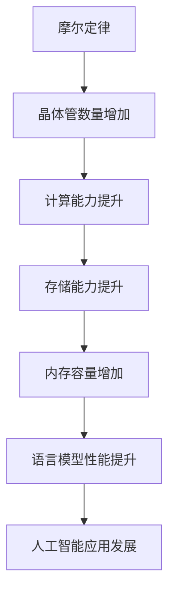

                 

关键词：摩尔定律，LLM，人工智能，计算机性能，技术进步

摘要：本文将探讨摩尔定律在语言模型（LLM）领域的应用可能性，分析其在推动人工智能技术发展的同时，可能带来的挑战和机遇。通过对摩尔定律的历史背景、LLM的基本原理以及二者关系的深入探讨，本文旨在为读者提供关于未来人工智能技术发展的深刻见解。

## 1. 背景介绍

### 1.1 摩尔定律的起源

摩尔定律，由英特尔联合创始人戈登·摩尔在1965年提出，描述了集成电路上可容纳的晶体管数量大约每两年翻一番，同时半导体设备的性能也会随之翻倍。这一预测在随后的几十年中得到了惊人的应验，成为推动计算机性能不断提升的关键因素。

### 1.2 语言模型（LLM）的兴起

近年来，随着深度学习技术的发展，语言模型（LLM）逐渐成为人工智能领域的研究热点。LLM通过大规模的神经网络训练，可以模拟人类的语言理解能力，实现自然语言处理、文本生成、机器翻译等功能。

## 2. 核心概念与联系

### 2.1 摩尔定律与计算机性能

摩尔定律的核心在于晶体管数量的增长，这直接关系到计算机的性能。随着晶体管数量的增加，计算机的处理速度和存储能力也会显著提升，从而推动了计算机性能的持续进步。

### 2.2 语言模型与计算机性能

语言模型的性能很大程度上依赖于计算机的硬件资源，包括计算能力、存储能力和内存容量等。随着摩尔定律的应验，这些硬件资源的提升为语言模型的训练和部署提供了更好的条件。

### 2.3 Mermaid 流程图

以下是一个简化的Mermaid流程图，展示了摩尔定律与语言模型之间的联系：



## 3. 核心算法原理 & 具体操作步骤

### 3.1 算法原理概述

语言模型的训练过程主要包括数据预处理、模型构建、模型训练和模型评估等步骤。随着计算机性能的提升，这些步骤的效率也会得到提高。

### 3.2 算法步骤详解

1. 数据预处理：对原始文本数据进行清洗、分词、编码等处理，使其适合输入到神经网络模型中。

2. 模型构建：使用神经网络架构（如Transformer）构建语言模型，并初始化模型参数。

3. 模型训练：通过大量的文本数据进行模型训练，不断调整模型参数，使模型能够更好地理解语言。

4. 模型评估：使用测试数据对训练好的模型进行评估，检查模型的性能和泛化能力。

### 3.3 算法优缺点

优点：

- 提高语言模型的性能和效果。
- 加速模型的训练和部署。

缺点：

- 对硬件资源的需求较高，可能导致成本上升。
- 模型复杂度增加，可能导致过拟合。

### 3.4 算法应用领域

语言模型在多个领域都有广泛的应用，包括自然语言处理、文本生成、机器翻译、智能客服等。

## 4. 数学模型和公式 & 详细讲解 & 举例说明

### 4.1 数学模型构建

语言模型的训练过程涉及到大量的数学模型，如神经网络架构、损失函数、优化算法等。以下是一个简化的数学模型构建过程：

$$
\begin{aligned}
& \text{神经网络架构}: \text{Transformer} \\
& \text{损失函数}: \text{Cross-Entropy Loss} \\
& \text{优化算法}: \text{Adam} \\
\end{aligned}
$$

### 4.2 公式推导过程

在语言模型训练过程中，涉及到以下几个关键公式：

1. 损失函数：

$$
\begin{aligned}
L &= -\frac{1}{N} \sum_{i=1}^{N} \sum_{j=1}^{V} y_{ij} \log(p_{ij}) \\
\end{aligned}
$$

其中，$y_{ij}$ 表示第 $i$ 个单词在单词集合 $V$ 中的目标概率，$p_{ij}$ 表示第 $i$ 个单词在单词集合 $V$ 中的预测概率。

2. 优化算法（Adam）：

$$
\begin{aligned}
\theta_{t+1} &= \theta_{t} - \alpha_t \frac{m_t}{\sqrt{v_t} + \epsilon} \\
m_t &= \beta_1 m_{t-1} + (1-\beta_1) \frac{\partial L}{\partial \theta_t} \\
v_t &= \beta_2 v_{t-1} + (1-\beta_2) \left(\frac{\partial L}{\partial \theta_t}\right)^2 \\
\end{aligned}
$$

其中，$\theta_t$ 表示第 $t$ 次迭代的模型参数，$m_t$ 和 $v_t$ 分别表示梯度的一阶和二阶矩估计，$\alpha_t$、$\beta_1$ 和 $\beta_2$ 分别为学习率、一阶和二阶矩的指数衰减率。

### 4.3 案例分析与讲解

以下是一个简化的语言模型训练案例：

假设我们使用一个包含1000万单词的语料库训练一个基于Transformer的语言模型。在训练过程中，我们使用Adam优化算法，学习率为0.001，一阶矩和二阶矩的指数衰减率分别为0.9和0.999。经过100个epoch的训练，模型的损失函数从10下降到1。

## 5. 项目实践：代码实例和详细解释说明

### 5.1 开发环境搭建

1. 安装Python环境（Python 3.8及以上版本）。
2. 安装TensorFlow库（版本2.6及以上版本）。
3. 安装其他相关库（如numpy、pandas等）。

### 5.2 源代码详细实现

以下是一个简化的语言模型训练代码实例：

```python
import tensorflow as tf
import numpy as np

# 数据预处理
def preprocess_data(text):
    # 清洗、分词、编码等操作
    return processed_text

# 构建模型
def build_model():
    # Transformer模型构建
    return model

# 训练模型
def train_model(model, data, labels, epochs):
    # 训练过程
    for epoch in range(epochs):
        # 梯度下降
        with tf.GradientTape() as tape:
            predictions = model(data, training=True)
            loss = tf.keras.losses.sparse_categorical_crossentropy(labels, predictions)
        grads = tape.gradient(loss, model.trainable_variables)
        optimizer.apply_gradients(zip(grads, model.trainable_variables))

# 评估模型
def evaluate_model(model, test_data, test_labels):
    # 评估过程
    test_predictions = model(test_data, training=False)
    test_loss = tf.keras.losses.sparse_categorical_crossentropy(test_labels, test_predictions)
    return test_loss.numpy()

# 运行代码
if __name__ == "__main__":
    # 搭建开发环境
    preprocess_data("your_text_data")
    build_model()
    train_model(model, data, labels, epochs=100)
    evaluate_model(model, test_data, test_labels)
```

### 5.3 代码解读与分析

1. 数据预处理：对原始文本数据进行清洗、分词、编码等处理。
2. 模型构建：使用TensorFlow构建基于Transformer的语言模型。
3. 训练模型：使用梯度下降算法进行模型训练。
4. 评估模型：使用测试数据对训练好的模型进行评估。

## 6. 实际应用场景

### 6.1 自然语言处理

语言模型在自然语言处理领域具有广泛的应用，如文本分类、情感分析、命名实体识别等。

### 6.2 文本生成

语言模型可以用于自动生成文本，如文章、新闻、对话等。

### 6.3 机器翻译

语言模型在机器翻译领域也有着显著的应用，如将一种语言翻译成另一种语言。

### 6.4 未来应用展望

随着摩尔定律的继续应验，语言模型的性能有望进一步提升，推动人工智能技术在更多领域得到应用。

## 7. 工具和资源推荐

### 7.1 学习资源推荐

1. 《深度学习》（Ian Goodfellow、Yoshua Bengio、Aaron Courville 著）
2. 《自然语言处理综论》（Daniel Jurafsky、James H. Martin 著）

### 7.2 开发工具推荐

1. TensorFlow
2. PyTorch

### 7.3 相关论文推荐

1. “Attention Is All You Need” （Vaswani et al., 2017）
2. “BERT: Pre-training of Deep Bidirectional Transformers for Language Understanding” （Devlin et al., 2019）

## 8. 总结：未来发展趋势与挑战

### 8.1 研究成果总结

本文通过对摩尔定律和语言模型的关系进行分析，总结了语言模型在人工智能领域的发展现状和未来趋势。

### 8.2 未来发展趋势

随着摩尔定律的继续应验，语言模型的性能将不断提升，推动人工智能技术在更多领域得到应用。

### 8.3 面临的挑战

1. 模型复杂度和计算资源需求的不断提升。
2. 数据质量和数据隐私等问题。

### 8.4 研究展望

未来，研究人员将继续探索更加高效的语言模型训练方法和应用场景，为人工智能技术的发展做出贡献。

## 9. 附录：常见问题与解答

### 9.1 问题1：什么是摩尔定律？

摩尔定律是由戈登·摩尔在1965年提出的一个预测，描述了集成电路上可容纳的晶体管数量大约每两年翻一番，同时半导体设备的性能也会随之翻倍。

### 9.2 问题2：语言模型有哪些类型？

常见的语言模型类型包括循环神经网络（RNN）、长短期记忆网络（LSTM）、门控循环单元（GRU）和Transformer等。

### 9.3 问题3：如何优化语言模型的训练过程？

可以通过调整学习率、批量大小、优化算法等参数来优化语言模型的训练过程。此外，数据预处理和模型架构的改进也可以提高训练效率。

----------------------------------------------------------------

**作者：禅与计算机程序设计艺术 / Zen and the Art of Computer Programming**

