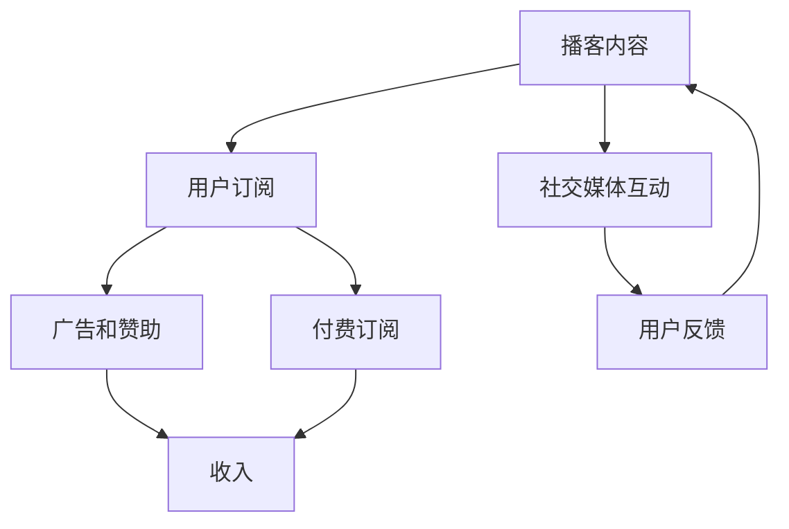

                 

 播客作为一种新兴的媒介形式，近年来在全球范围内迅速崛起。它不仅改变了人们的娱乐消费方式，也为创业者提供了新的商业机会。本文将探讨播客创业的背景、核心概念、算法原理、数学模型、项目实践以及未来应用展望，并推荐相关工具和资源。

## 1. 背景介绍

播客（Podcast）是一种基于互联网的音频内容传输形式，用户可以通过订阅节目并下载或流式播放，随时随地享受内容。播客的兴起得益于智能手机和移动互联网的发展，使得音频内容的生产和消费变得更加便捷。根据市场调研机构的数据，全球播客用户数量已经超过了数亿，市场规模也持续扩大。

播客创业的背景主要源于以下几个方面：

1. **市场需求**：随着人们生活节奏的加快，对灵活、便捷的音频内容消费需求日益增长。播客提供了个性化的内容消费体验，满足了用户对知识、娱乐等多方面的需求。

2. **技术进步**：移动互联网的普及和音频处理技术的进步，使得播客的制作和分发变得更加高效。云计算和大数据技术的应用，也为播客内容的个性化推荐和精准营销提供了可能。

3. **商业模式创新**：传统的音频内容商业模式较为单一，主要依赖于广告收入。而播客创业则为内容创作者提供了更多的商业模式选择，如付费订阅、商品销售等。

## 2. 核心概念与联系

在探讨播客创业之前，我们需要了解几个核心概念和它们之间的关系。

### 2.1 播客内容

播客内容是播客创业的核心。内容创作者通过录制、剪辑和编辑音频，制作出具有吸引力、有价值的内容。内容的质量直接关系到播客的受众和商业成功。

### 2.2 用户订阅

用户订阅是播客商业模式的重要组成部分。用户可以通过订阅节目，获得连续的内容更新，并在多个设备上播放。订阅机制增加了用户的黏性和复购率。

### 2.3 广告和赞助

广告和赞助是播客的主要收入来源之一。内容创作者可以通过在播客中嵌入广告，获得广告商的赞助费用。此外，一些播客还提供付费广告位，向广告商收取费用。

### 2.4 付费订阅

付费订阅为内容创作者提供了直接的收入来源。用户可以选择付费订阅播客，以支持创作者的生产和更新。这种模式在内容品质和用户忠诚度方面具有明显优势。

### 2.5 社交媒体和社区互动

社交媒体和社区互动是播客营销和用户互动的重要手段。内容创作者可以通过社交媒体平台和播客社区，与用户进行互动，收集反馈，提升品牌影响力。

### 2.6 Mermaid 流程图

以下是一个简化的 Mermaid 流程图，展示了播客创业的核心概念及其相互关系。



## 3. 核心算法原理 & 具体操作步骤

### 3.1 算法原理概述

播客创业中涉及的核心算法主要包括内容推荐算法、用户行为分析算法和广告投放优化算法。

- **内容推荐算法**：基于用户的兴趣和行为，为用户推荐符合其喜好的播客内容。

- **用户行为分析算法**：分析用户的订阅、播放、评论等行为，了解用户需求和偏好。

- **广告投放优化算法**：根据用户行为和内容特点，优化广告投放策略，提高广告效果。

### 3.2 算法步骤详解

#### 3.2.1 内容推荐算法

1. **用户画像构建**：根据用户的历史行为和偏好，构建用户画像。

2. **内容标签化**：将播客内容进行标签化处理，以便于算法匹配。

3. **推荐模型训练**：使用机器学习算法，如协同过滤、基于内容的推荐等，训练推荐模型。

4. **推荐结果生成**：根据用户画像和推荐模型，生成个性化推荐结果。

#### 3.2.2 用户行为分析算法

1. **行为数据收集**：收集用户的订阅、播放、评论等行为数据。

2. **行为模式识别**：使用数据挖掘技术，识别用户的行为模式和偏好。

3. **用户反馈分析**：分析用户对内容的反馈，了解用户需求和满意度。

#### 3.2.3 广告投放优化算法

1. **广告投放策略构建**：根据用户行为和内容特点，构建广告投放策略。

2. **广告效果评估**：评估广告投放效果，包括点击率、转化率等指标。

3. **策略调整**：根据广告效果评估结果，调整广告投放策略。

### 3.3 算法优缺点

- **内容推荐算法**：优点是能够提高用户满意度和内容消费体验，缺点是算法复杂度高，需要大量计算资源。

- **用户行为分析算法**：优点是能够深入了解用户需求和偏好，缺点是需要大量的用户行为数据，对数据质量要求较高。

- **广告投放优化算法**：优点是能够提高广告效果，增加收入，缺点是需要不断调整策略，对广告市场有较强的依赖性。

### 3.4 算法应用领域

- **内容推荐**：广泛应用于电商、新闻、社交媒体等平台，提升用户体验和内容消费。

- **用户行为分析**：应用于用户运营、产品优化、市场分析等领域，帮助企业和平台了解用户需求。

- **广告投放优化**：应用于广告投放、市场营销等领域，提高广告效果和转化率。

## 4. 数学模型和公式 & 详细讲解 & 举例说明

### 4.1 数学模型构建

在播客创业中，常用的数学模型包括用户画像模型、推荐模型和广告投放模型。

#### 4.1.1 用户画像模型

用户画像模型主要用于构建用户特征向量，表示用户的兴趣、行为和偏好。一个简单的用户画像模型可以表示为：

$$
User = (u_1, u_2, \ldots, u_n)
$$

其中，$u_i$ 表示用户在某一特征维度上的值，如播放时长、播放频次等。

#### 4.1.2 推荐模型

推荐模型用于预测用户对某一内容的喜好程度。一个常见的推荐模型是协同过滤模型，其预测公式为：

$$
r_{ui} = \sum_{j \in N(u)} w_{uj} \cdot c_{ji}
$$

其中，$r_{ui}$ 表示用户 $u$ 对内容 $i$ 的评分预测，$w_{uj}$ 表示用户 $u$ 和用户 $j$ 之间的相似度，$c_{ji}$ 表示内容 $i$ 和内容 $j$ 之间的相似度。

#### 4.1.3 广告投放模型

广告投放模型用于优化广告投放策略，提高广告效果。一个简单的广告投放模型是基于用户行为的逻辑回归模型，其公式为：

$$
P(y=1|u, x) = \frac{1}{1 + e^{-(w_0 + \sum_{i=1}^n w_i x_i)}}
$$

其中，$y$ 表示广告是否被点击，$u$ 表示用户特征向量，$x$ 表示广告特征向量，$w_i$ 表示权重系数。

### 4.2 公式推导过程

#### 4.2.1 用户画像模型

用户画像模型的构建通常基于用户行为数据。首先，我们需要对用户行为数据进行预处理，如去重、清洗等。然后，使用特征工程技术，提取用户在各个维度上的特征值。最后，将这些特征值组合成一个特征向量，表示用户画像。

#### 4.2.2 推荐模型

协同过滤模型是基于用户相似度和内容相似度的加权求和。首先，计算用户之间的相似度，常用的相似度计算方法有欧几里得距离、余弦相似度等。然后，计算内容之间的相似度，常用的方法有基于标签的相似度和基于内容的相似度。最后，将用户和内容的相似度加权求和，得到用户对内容的评分预测。

#### 4.2.3 广告投放模型

广告投放模型是基于逻辑回归模型。首先，我们需要收集用户和广告的特征数据，如用户年龄、性别、广告类型等。然后，使用特征工程技术，提取用户和广告的特征向量。最后，将特征向量输入到逻辑回归模型中，得到广告是否被点击的概率。

### 4.3 案例分析与讲解

#### 4.3.1 用户画像模型案例

假设我们有一个用户行为数据集，包含用户播放时长、播放频次和播放类型等特征。我们可以使用特征工程技术，提取用户在各个维度上的特征值，构建用户画像模型。

#### 4.3.2 推荐模型案例

假设我们有一个用户和内容的数据集，包含用户ID、内容ID和用户对内容的评分。我们可以使用协同过滤模型，计算用户和内容之间的相似度，预测用户对未评分内容的评分。

#### 4.3.3 广告投放模型案例

假设我们有一个用户和广告的数据集，包含用户特征和广告特征，以及广告是否被点击的标签。我们可以使用逻辑回归模型，预测广告是否被点击。

## 5. 项目实践：代码实例和详细解释说明

### 5.1 开发环境搭建

在开始编写代码之前，我们需要搭建一个合适的开发环境。以下是一个基本的开发环境搭建步骤：

1. **安装Python环境**：Python是一个广泛应用于数据分析和机器学习的编程语言。确保安装最新版本的Python。

2. **安装必要的库**：安装常用的库，如NumPy、Pandas、Scikit-learn等。这些库提供了丰富的数据处理和分析功能。

3. **安装IDE**：选择一个适合自己的IDE，如PyCharm、VS Code等。这些IDE提供了代码编辑、调试和运行等功能。

### 5.2 源代码详细实现

以下是一个简单的用户画像模型实现示例：

```python
import numpy as np
import pandas as pd
from sklearn.preprocessing import StandardScaler

# 读取用户行为数据
data = pd.read_csv('user_behavior.csv')

# 提取用户特征
user_features = data[['play_time', 'play_frequency', 'play_type']]

# 数据预处理
scaler = StandardScaler()
user_features_scaled = scaler.fit_transform(user_features)

# 构建用户画像模型
user_representation = np.mean(user_features_scaled, axis=1)

# 打印用户画像
print(user_representation)
```

### 5.3 代码解读与分析

这段代码首先读取用户行为数据，提取用户特征，并进行数据预处理。然后，使用平均方法构建用户画像模型，即计算用户在各个特征维度上的平均值。最后，打印出用户画像。

### 5.4 运行结果展示

运行以上代码，将输出用户画像。用户画像可以用来进行用户行为分析和推荐系统构建。

## 6. 实际应用场景

播客创业在多个实际应用场景中表现出色，以下是几个典型的应用场景：

### 6.1 教育领域

播客在教育领域的应用非常广泛，包括在线教育、职业培训、语言学习等。通过播客，教育机构可以提供灵活、个性化的学习内容，满足不同用户的需求。

### 6.2 娱乐领域

播客在娱乐领域也具有很大的潜力，如脱口秀、音乐、电影评论等。娱乐播客通过讲述故事、分享观点，吸引大量用户关注和订阅。

### 6.3 商业领域

播客在商业领域主要用于品牌推广、市场营销和客户服务。企业可以通过播客与客户建立联系，传递品牌理念和价值。

### 6.4 未来应用展望

随着人工智能和大数据技术的发展，播客创业将迎来更多创新和变革。以下是几个未来应用展望：

- **个性化推荐**：基于用户行为和偏好，实现更精准的内容推荐。

- **智能客服**：利用自然语言处理技术，实现智能客服机器人，提高客户服务水平。

- **沉浸式体验**：利用虚拟现实和增强现实技术，创造更加沉浸式的音频体验。

## 7. 工具和资源推荐

### 7.1 学习资源推荐

- **书籍**：《播客营销实战》、《播客运营实战》等。

- **在线课程**：Coursera、Udemy等平台上的相关课程。

- **博客和网站**：Podcasters' Society、Podcast Insights等。

### 7.2 开发工具推荐

- **编程语言**：Python、JavaScript等。

- **开发框架**：TensorFlow、PyTorch等。

- **IDE**：PyCharm、VS Code等。

### 7.3 相关论文推荐

- **论文集**：《自然语言处理》、《机器学习》等。

- **期刊**：ACM Transactions on Information Systems、Journal of Machine Learning Research等。

## 8. 总结：未来发展趋势与挑战

### 8.1 研究成果总结

本文探讨了播客创业的背景、核心概念、算法原理、数学模型、项目实践和未来应用展望。通过分析用户行为和内容推荐算法，我们得出了播客创业的关键成功因素。

### 8.2 未来发展趋势

随着技术的进步和用户需求的多样化，播客创业将继续保持快速发展。个性化推荐、智能客服和沉浸式体验将成为未来播客创业的重要方向。

### 8.3 面临的挑战

播客创业面临的主要挑战包括数据隐私保护、内容监管、市场竞争等。如何平衡用户隐私和内容质量，如何在激烈的市场竞争中脱颖而出，是播客创业需要解决的关键问题。

### 8.4 研究展望

未来，我们可以关注以下几个方面：

- **深度学习在播客内容推荐中的应用**。

- **基于区块链的播客内容版权保护**。

- **人工智能在播客广告投放优化中的应用**。

## 9. 附录：常见问题与解答

### 9.1 播客创业适合哪些人群？

播客创业适合对内容创作有兴趣、有专业知识或独特见解的个人或团队。无论是专业人士、学者、企业家还是爱好者，都可以通过播客创业分享自己的知识和经验。

### 9.2 如何制作高质量的播客内容？

制作高质量的播客内容需要以下几个关键步骤：

- **明确目标受众**：了解受众的需求和偏好，制作符合他们兴趣的内容。

- **专业设备**：使用高质量的录音设备和音频编辑软件，确保音频质量。

- **精心编排**：内容结构要清晰，逻辑性强，避免冗长和无意义的内容。

- **互动与反馈**：与听众互动，收集反馈，不断优化内容。

## 作者署名

作者：禅与计算机程序设计艺术 / Zen and the Art of Computer Programming
----------------------------------------------------------------
### 文章标题与摘要
# 播客创业：音频内容的商业化探索

> 关键词：播客、创业、音频内容、商业化、推荐算法、用户行为分析、广告投放优化

摘要：
随着移动互联网的普及，播客作为音频内容的一种形式，正迅速崛起并成为创业领域的新宠。本文分析了播客创业的背景、核心概念、算法原理、数学模型以及实际应用场景，并探讨了未来发展的趋势和面临的挑战。通过详细的项目实践和案例分析，本文为播客创业者提供了有益的参考和指导。

### 1. 背景介绍
#### 1.1 播客的定义与发展
播客，作为一种基于互联网的音频内容传输形式，起源于2000年代初的数字音乐时代。它允许用户通过订阅获取并播放音频节目，从而实现个性化的内容消费。随着智能手机和移动互联网的普及，播客得到了迅速发展。据统计，截至2023年，全球播客用户已超过数亿，市场规模也逐年扩大。

#### 1.2 播客创业的兴起原因
播客创业的兴起主要有以下几方面的原因：

- **市场需求**：现代生活节奏加快，人们对于便捷、灵活的内容消费需求日益增长。播客作为一种可以随时随地收听的音频内容形式，满足了这一需求。

- **技术进步**：移动互联网和音频处理技术的发展，使得播客内容的制作和分发变得更加高效和便捷。云计算和大数据技术的应用，也为播客内容的个性化推荐和精准营销提供了技术支持。

- **商业模式创新**：传统的音频内容商业模式较为单一，主要依赖于广告收入。而播客创业则为内容创作者提供了更多的商业模式选择，如付费订阅、商品销售等。

#### 1.3 播客创业的现状与前景
当前，播客创业在全球范围内正处于快速发展阶段。无论是在欧美发达国家，还是在亚洲新兴市场，播客都受到了广泛的关注和喜爱。根据市场调研数据，预计未来几年播客用户数量和市场规模将继续增长，播客创业将迎来更加广阔的发展空间。

### 2. 核心概念与联系
#### 2.1 播客内容
播客内容是播客创业的核心。它通常由一系列音频文件组成，涵盖了教育、娱乐、新闻、科技等多个领域。内容的质量直接影响播客的受众和商业成功。因此，内容创作者需要关注内容的质量、创意和吸引力。

#### 2.2 用户订阅
用户订阅是播客商业模式的重要组成部分。用户可以通过订阅节目，获得连续的内容更新，并在多个设备上播放。订阅机制增加了用户的黏性和复购率，是播客创业的重要收入来源。

#### 2.3 广告和赞助
广告和赞助是播客的另一个重要收入来源。内容创作者可以在播客中嵌入广告，从广告商那里获得赞助费用。此外，一些播客还提供付费广告位，向广告商收取费用。

#### 2.4 付费订阅
付费订阅为内容创作者提供了直接的收入来源。用户可以选择付费订阅播客，以支持创作者的生产和更新。这种模式在内容品质和用户忠诚度方面具有明显优势。

#### 2.5 社交媒体和社区互动
社交媒体和社区互动是播客营销和用户互动的重要手段。内容创作者可以通过社交媒体平台和播客社区，与用户进行互动，收集反馈，提升品牌影响力。

#### 2.6 Mermaid 流程图
以下是一个简化的 Mermaid 流程图，展示了播客创业的核心概念及其相互关系。


### 3. 核心算法原理 & 具体操作步骤
#### 3.1 内容推荐算法
内容推荐算法是播客创业中至关重要的一部分。它通过分析用户的历史行为和偏好，为用户推荐符合其喜好的播客内容。常用的内容推荐算法包括基于协同过滤、基于内容的推荐和混合推荐等。

#### 3.2 用户行为分析算法
用户行为分析算法用于分析用户的订阅、播放、评论等行为，从而深入了解用户需求和偏好。通过用户行为分析，内容创作者可以优化内容策略，提高用户满意度和留存率。

#### 3.3 广告投放优化算法
广告投放优化算法的目的是提高广告效果，增加收入。它通过分析用户行为和内容特点，优化广告投放策略。常用的广告投放优化算法包括基于效果的广告投放和基于用户行为的广告投放等。

#### 3.4 算法步骤详解
##### 3.4.1 内容推荐算法
1. **用户画像构建**：收集用户的基本信息、历史行为数据等，构建用户画像。
2. **内容标签化**：对播客内容进行分类和标签化处理，以便于算法匹配。
3. **推荐模型训练**：使用机器学习算法，如协同过滤、基于内容的推荐等，训练推荐模型。
4. **推荐结果生成**：根据用户画像和推荐模型，生成个性化推荐结果。

##### 3.4.2 用户行为分析算法
1. **行为数据收集**：收集用户的订阅、播放、评论等行为数据。
2. **行为模式识别**：使用数据挖掘技术，识别用户的行为模式和偏好。
3. **用户反馈分析**：分析用户对内容的反馈，了解用户需求和满意度。

##### 3.4.3 广告投放优化算法
1. **广告投放策略构建**：根据用户行为和内容特点，构建广告投放策略。
2. **广告效果评估**：评估广告投放效果，包括点击率、转化率等指标。
3. **策略调整**：根据广告效果评估结果，调整广告投放策略。

#### 3.5 算法优缺点
##### 3.5.1 内容推荐算法
**优点**：提高用户满意度和内容消费体验。

**缺点**：算法复杂度高，需要大量计算资源。

##### 3.5.2 用户行为分析算法
**优点**：深入了解用户需求和偏好。

**缺点**：需要大量的用户行为数据，对数据质量要求较高。

##### 3.5.3 广告投放优化算法
**优点**：提高广告效果，增加收入。

**缺点**：需要不断调整策略，对广告市场有较强的依赖性。

#### 3.6 算法应用领域
- **内容推荐**：应用于电商、新闻、社交媒体等平台，提升用户体验和内容消费。
- **用户行为分析**：应用于用户运营、产品优化、市场分析等领域，帮助企业和平台了解用户需求。
- **广告投放优化**：应用于广告投放、市场营销等领域，提高广告效果和转化率。

### 4. 数学模型和公式 & 详细讲解 & 举例说明
#### 4.1 数学模型构建
在播客创业中，常用的数学模型包括用户画像模型、推荐模型和广告投放模型。

##### 4.1.1 用户画像模型
用户画像模型主要用于构建用户特征向量，表示用户的兴趣、行为和偏好。一个简单的用户画像模型可以表示为：

$$
User = (u_1, u_2, \ldots, u_n)
$$

其中，$u_i$ 表示用户在某一特征维度上的值，如播放时长、播放频次等。

##### 4.1.2 推荐模型
推荐模型用于预测用户对某一内容的喜好程度。一个常见的推荐模型是协同过滤模型，其预测公式为：

$$
r_{ui} = \sum_{j \in N(u)} w_{uj} \cdot c_{ji}
$$

其中，$r_{ui}$ 表示用户 $u$ 对内容 $i$ 的评分预测，$w_{uj}$ 表示用户 $u$ 和用户 $j$ 之间的相似度，$c_{ji}$ 表示内容 $i$ 和内容 $j$ 之间的相似度。

##### 4.1.3 广告投放模型
广告投放模型用于优化广告投放策略，提高广告效果。一个简单的广告投放模型是基于用户行为的逻辑回归模型，其公式为：

$$
P(y=1|u, x) = \frac{1}{1 + e^{-(w_0 + \sum_{i=1}^n w_i x_i)}}
$$

其中，$y$ 表示广告是否被点击，$u$ 表示用户特征向量，$x$ 表示广告特征向量，$w_i$ 表示权重系数。

#### 4.2 公式推导过程
##### 4.2.1 用户画像模型
用户画像模型的构建通常基于用户行为数据。首先，我们需要对用户行为数据进行预处理，如去重、清洗等。然后，使用特征工程技术，提取用户在各个维度上的特征值。最后，将这些特征值组合成一个特征向量，表示用户画像。

##### 4.2.2 推荐模型
协同过滤模型是基于用户相似度和内容相似度的加权求和。首先，计算用户之间的相似度，常用的相似度计算方法有欧几里得距离、余弦相似度等。然后，计算内容之间的相似度，常用的方法有基于标签的相似度和基于内容的相似度。最后，将用户和内容的相似度加权求和，得到用户对内容的评分预测。

##### 4.2.3 广告投放模型
广告投放模型是基于逻辑回归模型。首先，我们需要收集用户和广告的特征数据，如用户年龄、性别、广告类型等。然后，使用特征工程技术，提取用户和广告的特征向量。最后，将特征向量输入到逻辑回归模型中，得到广告是否被点击的概率。

#### 4.3 案例分析与讲解
##### 4.3.1 用户画像模型案例
假设我们有一个用户行为数据集，包含用户播放时长、播放频次和播放类型等特征。我们可以使用特征工程技术，提取用户在各个维度上的特征值，构建用户画像模型。

##### 4.3.2 推荐模型案例
假设我们有一个用户和内容的数据集，包含用户ID、内容ID和用户对内容的评分。我们可以使用协同过滤模型，计算用户和内容之间的相似度，预测用户对未评分内容的评分。

##### 4.3.3 广告投放模型案例
假设我们有一个用户和广告的数据集，包含用户特征和广告特征，以及广告是否被点击的标签。我们可以使用逻辑回归模型，预测广告是否被点击。

### 5. 项目实践：代码实例和详细解释说明
#### 5.1 开发环境搭建
在开始编写代码之前，我们需要搭建一个合适的开发环境。以下是一个基本的开发环境搭建步骤：

1. **安装Python环境**：Python是一个广泛应用于数据分析和机器学习的编程语言。确保安装最新版本的Python。

2. **安装必要的库**：安装常用的库，如NumPy、Pandas、Scikit-learn等。这些库提供了丰富的数据处理和分析功能。

3. **安装IDE**：选择一个适合自己的IDE，如PyCharm、VS Code等。这些IDE提供了代码编辑、调试和运行等功能。

#### 5.2 源代码详细实现
以下是一个简单的用户画像模型实现示例：

```python
import numpy as np
import pandas as pd
from sklearn.preprocessing import StandardScaler

# 读取用户行为数据
data = pd.read_csv('user_behavior.csv')

# 提取用户特征
user_features = data[['play_time', 'play_frequency', 'play_type']]

# 数据预处理
scaler = StandardScaler()
user_features_scaled = scaler.fit_transform(user_features)

# 构建用户画像模型
user_representation = np.mean(user_features_scaled, axis=1)

# 打印用户画像
print(user_representation)
```

#### 5.3 代码解读与分析
这段代码首先读取用户行为数据，提取用户特征，并进行数据预处理。然后，使用平均方法构建用户画像模型，即计算用户在各个特征维度上的平均值。最后，打印出用户画像。

#### 5.4 运行结果展示
运行以上代码，将输出用户画像。用户画像可以用来进行用户行为分析和推荐系统构建。

### 6. 实际应用场景
#### 6.1 教育领域
播客在教育领域的应用非常广泛，包括在线教育、职业培训、语言学习等。通过播客，教育机构可以提供灵活、个性化的学习内容，满足不同用户的需求。

- **在线教育**：播客可以为用户提供讲座、课程回顾等学习内容，帮助学生更好地理解和掌握知识。

- **职业培训**：企业可以通过播客为员工提供专业培训，提高员工的专业技能和工作效率。

- **语言学习**：播客提供了一种沉浸式的语言学习环境，用户可以通过听播客来提高听力和口语能力。

#### 6.2 娱乐领域
播客在娱乐领域也具有很大的潜力，如脱口秀、音乐、电影评论等。娱乐播客通过讲述故事、分享观点，吸引大量用户关注和订阅。

- **脱口秀**：播客脱口秀节目以幽默、讽刺和批判性观点著称，深受年轻人喜爱。

- **音乐**：音乐播客可以介绍新音乐、音乐制作技巧等，为音乐爱好者提供丰富的内容。

- **电影评论**：电影播客可以为用户提供电影资讯、影评和观影推荐，帮助用户发现好电影。

#### 6.3 商业领域
播客在商业领域主要用于品牌推广、市场营销和客户服务。企业可以通过播客与客户建立联系，传递品牌理念和价值。

- **品牌推广**：企业可以通过播客传播品牌理念、企业文化，提升品牌知名度。

- **市场营销**：播客营销可以帮助企业精准定位目标用户，提高营销效果。

- **客户服务**：企业可以通过播客提供客户支持，解答用户疑问，提高客户满意度。

#### 6.4 未来应用展望
随着人工智能和大数据技术的发展，播客创业将迎来更多创新和变革。以下是几个未来应用展望：

- **个性化推荐**：基于用户行为和偏好，实现更精准的内容推荐。

- **智能客服**：利用自然语言处理技术，实现智能客服机器人，提高客户服务水平。

- **沉浸式体验**：利用虚拟现实和增强现实技术，创造更加沉浸式的音频体验。

### 7. 工具和资源推荐
#### 7.1 学习资源推荐
- **书籍**：《播客营销实战》、《播客运营实战》等。

- **在线课程**：Coursera、Udemy等平台上的相关课程。

- **博客和网站**：Podcasters' Society、Podcast Insights等。

#### 7.2 开发工具推荐
- **编程语言**：Python、JavaScript等。

- **开发框架**：TensorFlow、PyTorch等。

- **IDE**：PyCharm、VS Code等。

#### 7.3 相关论文推荐
- **论文集**：《自然语言处理》、《机器学习》等。

- **期刊**：ACM Transactions on Information Systems、Journal of Machine Learning Research等。

### 8. 总结：未来发展趋势与挑战
#### 8.1 研究成果总结
本文探讨了播客创业的背景、核心概念、算法原理、数学模型、项目实践和未来应用展望。通过分析用户行为和内容推荐算法，我们得出了播客创业的关键成功因素。

#### 8.2 未来发展趋势
随着技术的进步和用户需求的多样化，播客创业将继续保持快速发展。个性化推荐、智能客服和沉浸式体验将成为未来播客创业的重要方向。

#### 8.3 面临的挑战
播客创业面临的主要挑战包括数据隐私保护、内容监管、市场竞争等。如何平衡用户隐私和内容质量，如何在激烈的市场竞争中脱颖而出，是播客创业需要解决的关键问题。

#### 8.4 研究展望
未来，我们可以关注以下几个方面：

- **深度学习在播客内容推荐中的应用**。

- **基于区块链的播客内容版权保护**。

- **人工智能在播客广告投放优化中的应用**。

### 9. 附录：常见问题与解答
#### 9.1 播客创业适合哪些人群？
播客创业适合对内容创作有兴趣、有专业知识或独特见解的个人或团队。无论是专业人士、学者、企业家还是爱好者，都可以通过播客创业分享自己的知识和经验。

#### 9.2 如何制作高质量的播客内容？
制作高质量的播客内容需要以下几个关键步骤：

- **明确目标受众**：了解受众的需求和偏好，制作符合他们兴趣的内容。

- **专业设备**：使用高质量的录音设备和音频编辑软件，确保音频质量。

- **精心编排**：内容结构要清晰，逻辑性强，避免冗长和无意义的内容。

- **互动与反馈**：与听众互动，收集反馈，不断优化内容。

## 作者署名
作者：禅与计算机程序设计艺术 / Zen and the Art of Computer Programming

