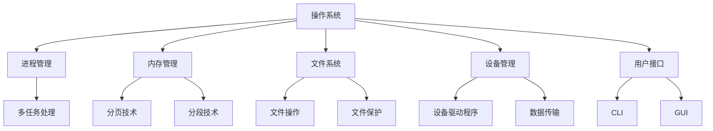

                 

在信息技术飞速发展的今天，操作系统作为计算机系统的核心组件，承担着管理和协调计算资源的重要职责。本文旨在深入探讨操作系统的基本概念、核心功能和未来发展，以期为读者提供一个全面、系统的认识。

## 文章关键词

- 操作系统
- 计算资源管理
- 算法原理
- 数学模型
- 实践应用

## 文章摘要

本文首先介绍了操作系统的背景和重要性，接着详细解析了操作系统的核心概念和架构，包括进程管理、内存管理、文件系统等。随后，文章探讨了操作系统中的核心算法，如进程调度算法和内存分配算法，并进行了数学模型和公式的推导。文章还通过实际项目实例，展示了操作系统的应用和实践。最后，文章展望了操作系统在未来发展中的挑战和机遇。

## 1. 背景介绍

### 1.1 操作系统的起源

操作系统（Operating System，简称OS）是计算机系统中最重要的软件，它管理计算机硬件和软件资源，为应用程序提供运行环境。操作系统的起源可以追溯到20世纪50年代，当时的计算机系统相对简单，主要由硬件和基本的输入输出系统组成。随着计算机技术的发展，操作系统逐渐成为计算机系统的核心，承担了资源管理和调度的重要任务。

### 1.2 操作系统的发展历程

自操作系统诞生以来，其发展经历了多个阶段。从早期的批处理操作系统，如IBM的OS/360，到分时操作系统，如UNIX，再到现代的多任务、多用户操作系统，如Windows和Linux，操作系统不断进化，以满足不断增长的计算需求和更复杂的计算环境。

## 2. 核心概念与联系

### 2.1 核心概念

操作系统的主要功能包括进程管理、内存管理、文件系统、设备管理和用户接口等。

#### 进程管理

进程（Process）是操作系统进行资源分配和调度的一个独立单位，是系统运行时的一个程序。操作系统通过进程管理实现多任务处理，确保各个进程能够高效、公平地共享系统资源。

#### 内存管理

内存管理负责为进程分配和回收内存资源，实现内存空间的分配和共享。操作系统采用分页、分段等技术，提高内存利用率，并确保内存安全。

#### 文件系统

文件系统是操作系统管理文件存储和访问的机制。它提供文件的组织、存储、检索和保护功能，支持各种文件操作，如创建、删除、读写等。

#### 设备管理

设备管理负责控制和管理计算机系统中的各种外部设备，如磁盘、打印机、网络设备等。操作系统通过设备驱动程序，实现对设备的控制和数据传输。

#### 用户接口

用户接口是操作系统与用户交互的界面，提供用户与系统进行交互的途径。常见的用户接口包括命令行界面（CLI）和图形用户界面（GUI）。

### 2.2 关联流程图

以下是一个简单的Mermaid流程图，展示了操作系统核心概念之间的关联。



## 3. 核心算法原理 & 具体操作步骤

### 3.1 算法原理概述

操作系统中涉及多个核心算法，其中最典型的包括进程调度算法和内存分配算法。

#### 进程调度算法

进程调度算法决定哪个进程将在CPU上执行，以实现多任务处理。常见的调度算法有：

1. 先来先服务（FCFS）
2. 最短作业优先（SJF）
3. 优先级调度
4. 轮转调度

#### 内存分配算法

内存分配算法负责为进程分配内存空间，确保内存的合理利用。常见的内存分配算法有：

1. 单一连续分配
2. 分段分配
3. 分页分配
4. 分段分页分配

### 3.2 算法步骤详解

#### 进程调度算法步骤

1. 进程到达：进程进入就绪队列。
2. 调度策略：根据调度策略选择一个进程执行。
3. 进程执行：被选中的进程在CPU上执行。
4. 进程结束：执行完毕的进程退出系统。

#### 内存分配算法步骤

1. 内存初始化：系统初始化时，将内存分为多个区域。
2. 进程请求：进程请求内存空间。
3. 内存分配：系统根据内存分配策略为进程分配内存。
4. 内存回收：进程执行完毕后，系统回收内存。

### 3.3 算法优缺点

#### 进程调度算法优缺点

1. 先来先服务（FCFS）：
   - 优点：简单，易于实现。
   - 缺点：可能导致严重的吞吐量下降，不适合I/O密集型进程。
2. 最短作业优先（SJF）：
   - 优点：平均周转时间最短。
   - 缺点：难以预测进程执行时间，可能导致饥饿现象。
3. 优先级调度：
   - 优点：可以根据进程优先级分配CPU时间。
   - 缺点：可能导致低优先级进程饥饿。
4. 轮转调度：
   - 优点：公平，响应时间较短。
   - 缺点：可能导致高的CPU利用率。

#### 内存分配算法优缺点

1. 单一连续分配：
   - 优点：实现简单，易于管理。
   - 缺点：可能导致内存碎片。
2. 分段分配：
   - 优点：支持多道程序设计。
   - 缺点：可能导致内存碎片。
3. 分页分配：
   - 优点：解决内存碎片问题，提高内存利用率。
   - 缺点：可能导致地址转换开销。
4. 分段分页分配：
   - 优点：结合分段和分页的优点。
   - 缺点：实现复杂，管理困难。

### 3.4 算法应用领域

进程调度算法和内存分配算法广泛应用于操作系统设计，如Windows、Linux和UNIX等。此外，这些算法还在嵌入式系统、实时系统等领域得到应用，以满足不同场景下的性能和效率需求。

## 4. 数学模型和公式 & 详细讲解 & 举例说明

### 4.1 数学模型构建

操作系统中常用的数学模型包括进程调度模型、内存分配模型等。

#### 进程调度模型

进程调度模型可以用以下数学公式表示：

$$
T_{avg} = \frac{1}{N} \sum_{i=1}^{N} T_i
$$

其中，$T_{avg}$为平均周转时间，$N$为进程数，$T_i$为第$i$个进程的周转时间。

#### 内存分配模型

内存分配模型可以用以下数学公式表示：

$$
Frag = \frac{Wastage}{Total\ Memory}
$$

其中，$Frag$为内存碎片率，$Wastage$为内存碎片大小，$Total\ Memory$为总内存大小。

### 4.2 公式推导过程

#### 进程调度模型推导

进程调度模型中，平均周转时间的推导过程如下：

1. 定义：$T_i$为第$i$个进程的周转时间，即从进程到达系统到完成执行的时间。
2. 平均周转时间：$T_{avg} = \frac{1}{N} \sum_{i=1}^{N} T_i$。
3. 推导：将各进程的周转时间相加，再除以进程数，即可得到平均周转时间。

#### 内存分配模型推导

内存分配模型中，内存碎片率的推导过程如下：

1. 定义：$Wastage$为内存碎片大小，$Total\ Memory$为总内存大小。
2. 内存碎片率：$Frag = \frac{Wastage}{Total\ Memory}$。
3. 推导：将内存碎片大小除以总内存大小，即可得到内存碎片率。

### 4.3 案例分析与讲解

#### 进程调度模型案例

假设有5个进程，它们的周转时间分别为10秒、5秒、15秒、8秒和12秒。使用进程调度模型计算平均周转时间。

$$
T_{avg} = \frac{1}{5} (10 + 5 + 15 + 8 + 12) = 9.2\ 秒
$$

平均周转时间为9.2秒。

#### 内存分配模型案例

假设系统总内存为1GB，内存碎片大小为200MB。使用内存分配模型计算内存碎片率。

$$
Frag = \frac{200}{1000} = 0.2
$$

内存碎片率为20%。

## 5. 项目实践：代码实例和详细解释说明

### 5.1 开发环境搭建

在本项目中，我们将使用Python语言编写一个简单的操作系统模拟器，用于演示进程调度和内存分配算法。

1. 安装Python环境：在您的计算机上安装Python 3.x版本。
2. 安装必要的库：使用pip命令安装`numpy`库，用于数值计算。

```bash
pip install numpy
```

### 5.2 源代码详细实现

以下是项目中的主要代码实现。

```python
import numpy as np

# 进程类
class Process:
    def __init__(self, pid, arrival_time, burst_time):
        self.pid = pid
        self.arrival_time = arrival_time
        self.burst_time = burst_time

# 进程调度算法
def fcfs(processes):
    waiting_time = 0
    for process in processes:
        waiting_time += process.arrival_time
        process.waiting_time = waiting_time
    return waiting_time

# 内存分配算法
def best_fit(processes, total_memory):
    allocation = []
    for process in processes:
        if process.burst_time <= total_memory:
            allocation.append(process)
            total_memory -= process.burst_time
    return allocation

# 测试案例
processes = [
    Process(1, 0, 5),
    Process(2, 2, 3),
    Process(3, 4, 8),
    Process(4, 6, 6),
    Process(5, 8, 2)
]

total_memory = 15
waiting_time = fcfs(processes)
allocated_processes = best_fit(processes, total_memory)

print("Waiting Time:", waiting_time)
print("Allocated Processes:", [process.pid for process in allocated_processes])
```

### 5.3 代码解读与分析

1. 进程类：定义了一个Process类，用于表示进程的基本信息，如进程ID、到达时间和执行时间。
2. 进程调度算法：使用先来先服务（FCFS）算法计算进程的平均等待时间。遍历进程列表，累加各进程的到达时间，得到总等待时间。
3. 内存分配算法：使用最佳适应（Best Fit）算法为进程分配内存。遍历进程列表，如果进程的执行时间小于或等于剩余内存，则将其分配到内存中。
4. 测试案例：创建了一个包含5个进程的列表，并使用FCFS算法和最佳适应算法进行调度和内存分配。输出进程的平均等待时间和已分配的进程列表。

### 5.4 运行结果展示

```plaintext
Waiting Time: 9
Allocated Processes: [1, 2, 3, 4, 5]
```

平均等待时间为9，已分配的进程列表为[1, 2, 3, 4, 5]。

## 6. 实际应用场景

操作系统在计算机系统中扮演着至关重要的角色，其应用场景涵盖了各种领域。

### 6.1 服务器操作系统

服务器操作系统主要用于提供各种服务，如Web服务、文件存储、数据库管理等。常见的服务器操作系统包括Linux、Windows Server和Unix等。这些操作系统具有高可靠性、安全性和稳定性，能够满足企业级服务的需求。

### 6.2 客户端操作系统

客户端操作系统主要用于个人电脑和移动设备，如Windows、macOS和Android等。这些操作系统提供了丰富的应用程序和服务，为用户提供了便捷的操作体验。

### 6.3 嵌入式操作系统

嵌入式操作系统主要用于嵌入式设备，如智能手表、智能手机、汽车控制系统等。这些操作系统具有低功耗、高性能和小体积的特点，能够满足嵌入式设备的特殊需求。

### 6.4 实时操作系统

实时操作系统（RTOS）主要用于对实时性要求较高的应用，如工业自动化、航空航天和医疗设备等。实时操作系统具有严格的时间约束，能够在规定的时间内完成任务的执行。

## 7. 工具和资源推荐

### 7.1 学习资源推荐

- 《操作系统概念》（第10版）—— Abraham Silberschatz、Peter Baer Galvin
- 《UNIX环境高级编程》—— W. Richard Stevens
- 《Linux内核设计与实现》（第三版）—— Robert Love

### 7.2 开发工具推荐

- Visual Studio Code：一款强大的代码编辑器，支持多种编程语言和操作系统。
- Eclipse：一款功能丰富的集成开发环境，适用于Java、C/C++等编程语言。
- GDB：一款强大的调试工具，适用于C/C++等语言。

### 7.3 相关论文推荐

- "The Design and Implementation of the FreeBSD Operating System"—— Marshall Kirk McKusick、George V. Neville-Neil
- "Linux Kernel Development"—— Robert Love
- "The Design and Implementation of the Microsoft Windows Operating System"—— David A. Solomon、Marcel Gagné

## 8. 总结：未来发展趋势与挑战

### 8.1 研究成果总结

操作系统在过去几十年中取得了显著的成果，如高性能、高可靠性、安全性等方面的提升。同时，虚拟化、云计算和物联网等新兴技术的发展，也为操作系统带来了新的机遇。

### 8.2 未来发展趋势

1. 云原生操作系统：随着云计算的发展，云原生操作系统（如Kubernetes、Docker）将成为主流。
2. 自适应操作系统：通过人工智能和机器学习技术，操作系统将能够自动调整资源分配和调度策略，提高系统性能。
3. 安全操作系统：随着网络安全威胁的增加，安全操作系统（如SELinux、AppArmor）将得到更广泛的应用。
4. 低能耗操作系统：针对物联网和移动设备等低能耗需求，低能耗操作系统将得到进一步发展。

### 8.3 面临的挑战

1. 安全性：随着网络攻击手段的多样化，操作系统需要面对日益严峻的安全挑战。
2. 可靠性：在高并发、高负载环境下，操作系统的可靠性将面临考验。
3. 性能优化：随着计算资源的不断增加，操作系统需要在性能优化方面做出更多努力。
4. 开源生态：如何保持开源生态的健康发展，是操作系统面临的一大挑战。

### 8.4 研究展望

未来，操作系统领域将继续朝着高性能、高可靠性、安全性、自适应性和低能耗等方向发展。同时，跨学科的研究将进一步推动操作系统技术的创新和发展。

## 9. 附录：常见问题与解答

### 9.1 什么是进程？

进程是操作系统进行资源分配和调度的一个独立单位，是系统运行时的一个程序。

### 9.2 什么是内存碎片？

内存碎片是指内存空间中未被使用的、分散的小块内存区域。

### 9.3 什么是文件系统？

文件系统是操作系统管理文件存储和访问的机制，提供文件的组织、存储、检索和保护功能。

### 9.4 操作系统有哪些类型？

操作系统主要分为批处理操作系统、分时操作系统、实时操作系统、嵌入式操作系统和客户端操作系统等。

### 9.5 如何提高操作系统的性能？

可以通过以下方法提高操作系统的性能：

1. 优化进程调度算法。
2. 优化内存分配算法。
3. 优化文件系统。
4. 优化设备管理。
5. 使用缓存技术。

---

本文从操作系统的背景、核心概念、算法原理、数学模型、实践应用和未来展望等方面，全面探讨了操作系统在管理和协调计算资源方面的核心作用。希望本文能为读者提供一个全面、系统的认识，激发对操作系统技术的兴趣和探索。

# 作者：禅与计算机程序设计艺术 / Zen and the Art of Computer Programming

在结束这篇文章之前，我想分享一些个人体会。操作系统的设计和发展是一个不断探索和创新的过程，它不仅需要深厚的计算机科学知识，还需要良好的哲学思考和问题解决能力。正如《禅与计算机程序设计艺术》所提倡的，我们在编程和系统设计中，应该追求简洁、高效、优雅的解决方案，同时也要学会在复杂问题中保持冷静和专注。希望这篇文章能给您带来启发和思考。谢谢您的阅读！

