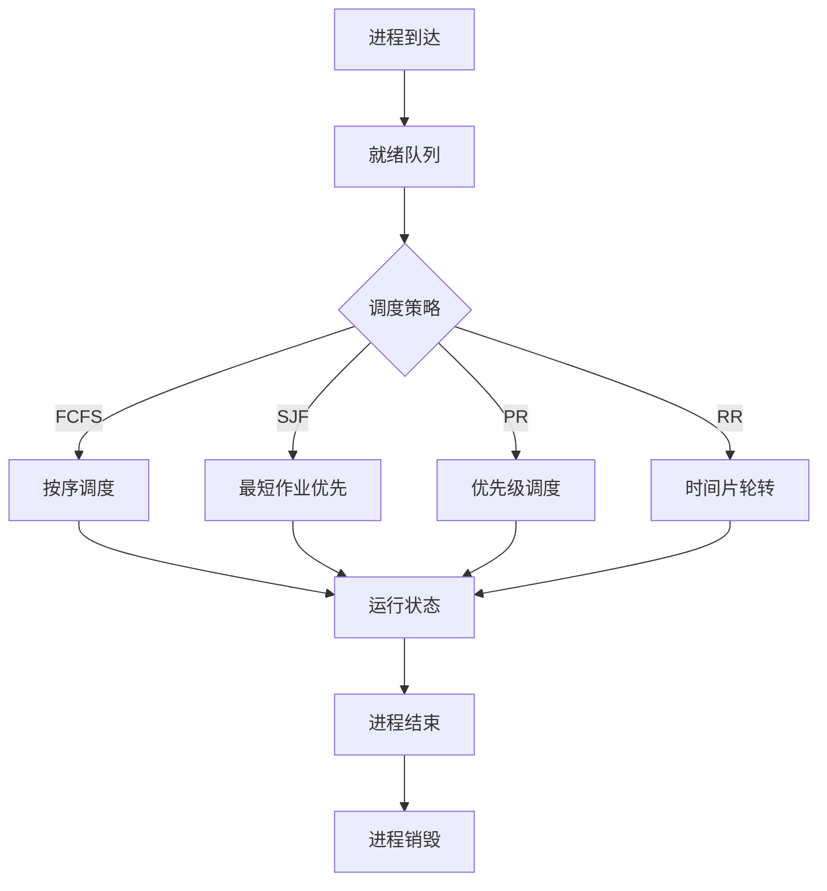

                 

操作系统作为计算机系统的基础设施，负责管理和调度进程，确保计算机资源的有效利用和系统稳定运行。进程管理是操作系统的核心功能之一，包括进程的创建、销毁、挂起、恢复、同步与通信等多个方面。本文将比较几种常见的进程管理策略，分析各自的优缺点和应用场景。

## 1. 背景介绍

在现代计算机系统中，进程是资源分配和执行的基本单位。操作系统通过进程管理策略来优化资源利用率和系统性能。进程管理策略涉及多个层面，包括进程调度、内存管理、同步与互斥等。

### 1.1 进程定义

进程（Process）是程序在执行过程中所对应的一个实体，它包括程序代码、数据、堆栈等资源。进程是操作系统中进行资源分配和调度的基本单位。

### 1.2 进程状态

进程在执行过程中可能处于以下状态：

- **运行状态**：进程正在使用CPU执行指令。
- **就绪状态**：进程已经准备好执行，等待操作系统调度。
- **阻塞状态**：进程由于某些原因（如等待I/O操作完成）而无法执行。

### 1.3 进程管理策略

进程管理策略主要包括进程调度策略、进程同步与互斥策略等。

## 2. 核心概念与联系

### 2.1 进程调度策略

进程调度策略是操作系统核心功能之一，负责决定哪个进程将获得CPU时间。常见的调度策略有：

- **先来先服务（FCFS）**：按照进程到达的顺序进行调度。
- **最短作业优先（SJF）**：选择执行时间最短的进程。
- **优先级调度**：根据进程的优先级进行调度，优先级高的进程先执行。
- **时间片轮转（RR）**：每个进程分配一个固定的时间片，轮流执行。

### 2.2 进程同步与互斥策略

进程同步与互斥策略用于解决多个进程之间的竞争条件。常见的策略有：

- **互斥锁（Mutex）**：防止多个进程同时访问共享资源。
- **信号量（Semaphore）**：用于进程间的同步与互斥，实现资源的分配与释放。
- **条件变量**：用于进程间的条件同步。

### 2.3 Mermaid 流程图

下面是一个Mermaid流程图，展示了进程调度和同步的基本流程：



## 3. 核心算法原理 & 具体操作步骤

### 3.1 算法原理概述

进程管理算法主要包括进程调度算法和同步与互斥算法。进程调度算法主要目的是优化系统性能和资源利用率，常见的调度算法有FCFS、SJF、优先级调度和RR。同步与互斥算法主要用于解决多个进程之间的资源竞争和同步问题，常见的算法有互斥锁、信号量和条件变量。

### 3.2 算法步骤详解

#### 3.2.1 进程调度算法

1. **FCFS调度**：操作系统根据进程到达时间顺序进行调度。
2. **SJF调度**：操作系统选择执行时间最短的进程。
3. **优先级调度**：操作系统根据进程的优先级进行调度，优先级高的进程先执行。
4. **时间片轮转调度**：操作系统将CPU时间分成多个时间片，依次分配给各个进程。

#### 3.2.2 同步与互斥算法

1. **互斥锁**：进程在访问共享资源前需要获取互斥锁，如果锁已被占用，进程等待。
2. **信号量**：信号量用于进程间的同步与互斥，主要有两种操作：P操作（减少信号量值）和V操作（增加信号量值）。
3. **条件变量**：进程在满足特定条件时，才能执行。

### 3.3 算法优缺点

#### 3.3.1 进程调度算法

- **FCFS**：简单易懂，但可能导致进程的等待时间较长。
- **SJF**：能缩短平均等待时间，但可能导致进程的执行时间不均。
- **优先级调度**：能保证高优先级进程得到及时处理，但可能导致低优先级进程长时间得不到执行。
- **时间片轮转**：公平地分配CPU时间，但可能导致进程的响应时间较长。

#### 3.3.2 同步与互斥算法

- **互斥锁**：简单易用，但可能导致进程的饥饿问题。
- **信号量**：功能强大，但可能引入死锁问题。
- **条件变量**：适用于复杂的同步场景，但实现较为复杂。

### 3.4 算法应用领域

#### 3.4.1 进程调度算法

- **FCFS**：适用于对响应时间要求不高的场景，如文件服务器。
- **SJF**：适用于作业调度，如批处理系统。
- **优先级调度**：适用于实时系统，如操作系统内核。
- **时间片轮转**：适用于交互式系统，如Windows、Linux等。

#### 3.4.2 同步与互斥算法

- **互斥锁**：适用于简单的并发场景，如线程同步。
- **信号量**：适用于复杂的并发场景，如生产者-消费者问题。
- **条件变量**：适用于复杂的同步场景，如多线程通信。

## 4. 数学模型和公式 & 详细讲解 & 举例说明

### 4.1 数学模型构建

进程调度和同步与互斥的算法可以抽象为图论模型。例如，可以将进程调度问题建模为一个加权图，其中节点表示进程，边表示进程之间的依赖关系。

### 4.2 公式推导过程

假设有n个进程，进程i的执行时间为ti，我们需要选择一个调度策略，使得平均等待时间最小。

### 4.3 案例分析与讲解

假设有3个进程，执行时间分别为2、3、5，采用FCFS调度策略，计算平均等待时间。

$$
平均等待时间 = \frac{1}{n} \sum_{i=1}^{n} (t_i - \sum_{j=1}^{i-1} t_j)
$$

计算结果为：

$$
平均等待时间 = \frac{1}{3} \times (2 - 0 + 3 - 2 + 5 - 5) = 2
$$

## 5. 项目实践：代码实例和详细解释说明

### 5.1 开发环境搭建

本文使用Python编程语言进行进程管理策略的实现。在开发环境中安装Python和对应的库。

```bash
pip install matplotlib
```

### 5.2 源代码详细实现

下面是一个简单的Python代码实例，实现FCFS和SJF调度策略。

```python
import matplotlib.pyplot as plt
import numpy as np

def fcfs(processes):
    wait_times = [0] * len(processes)
    for i in range(1, len(processes)):
        wait_times[i] = wait_times[i - 1] + processes[i - 1]
    return wait_times

def sjf(processes):
    processes.sort(key=lambda x: x[1])
    wait_times = [0] * len(processes)
    for i in range(1, len(processes)):
        wait_times[i] = wait_times[i - 1] + processes[i - 1][1]
    return wait_times

processes = [(0, 2), (1, 3), (2, 5)]
fcfs_wait_times = fcfs(processes)
sjf_wait_times = sjf(processes)

plt.plot(processes, fcfs_wait_times, label='FCFS')
plt.plot(processes, sjf_wait_times, label='SJF')
plt.xlabel('Process Index')
plt.ylabel('Waiting Time')
plt.legend()
plt.show()
```

### 5.3 代码解读与分析

该代码实例中，我们首先定义了两个函数：`fcfs` 和 `sjf`，分别实现FCFS和SJF调度策略。函数`fcfs`计算进程的等待时间，采用累加的方式计算每个进程的等待时间。函数`sjf`首先对进程进行排序，然后计算每个进程的等待时间。

### 5.4 运行结果展示

运行代码后，我们得到FCFS和SJF调度策略的平均等待时间可视化图。从图中可以看出，SJF调度策略的平均等待时间较短。

## 6. 实际应用场景

进程管理策略在各类操作系统和应用程序中都有广泛的应用。以下是一些实际应用场景：

- **操作系统内核**：操作系统内核采用优先级调度策略，保证关键任务的及时处理。
- **服务器**：服务器采用时间片轮转调度策略，实现多任务处理，提高资源利用率。
- **实时系统**：实时系统采用固定优先级调度策略，确保关键任务的响应时间。

## 7. 工具和资源推荐

### 7.1 学习资源推荐

- 《操作系统概念》（作者：Abraham Silberschatz、Peter Baer Galvin、Gagne）
- 《现代操作系统》（作者：Andrew S. Tanenbaum）

### 7.2 开发工具推荐

- Python
- Eclipse
- IntelliJ IDEA

### 7.3 相关论文推荐

- "Scheduling Algorithms for Real-Time Systems"（作者：Maurice Quek、Michael J. Young）
- "Time-Shared System Implementations"（作者：Douglas M. Ritchie）

## 8. 总结：未来发展趋势与挑战

### 8.1 研究成果总结

本文对进程管理策略进行了比较分析，总结了各种调度算法和同步与互斥算法的优缺点和应用场景。

### 8.2 未来发展趋势

随着计算机技术的发展，进程管理策略将朝着更智能化、更高效、更安全的方向发展。例如，基于机器学习的调度算法、分布式进程管理策略等。

### 8.3 面临的挑战

进程管理策略面临着性能优化、安全性、实时性等方面的挑战。如何提高调度算法的效率和鲁棒性，同时确保系统的稳定性和安全性，是未来研究的重点。

### 8.4 研究展望

未来的研究可以从以下几个方面展开：改进现有的调度算法，设计新的调度算法；研究分布式进程管理策略，提高系统性能和可靠性；探讨进程管理策略在实时系统和物联网中的应用。

## 9. 附录：常见问题与解答

### 9.1 什么是进程？

进程是程序在执行过程中所对应的一个实体，包括程序代码、数据、堆栈等资源。

### 9.2 进程调度策略有哪些？

常见的进程调度策略包括先来先服务（FCFS）、最短作业优先（SJF）、优先级调度和轮转调度等。

### 9.3 进程同步与互斥策略有哪些？

常见的进程同步与互斥策略包括互斥锁、信号量、条件变量等。

### 9.4 如何选择合适的进程调度策略？

选择合适的进程调度策略需要考虑系统的具体需求和性能指标，如响应时间、吞吐量、资源利用率等。

## 参考文献

- Abraham Silberschatz、Peter Baer Galvin、Gagne. 《操作系统概念》.
- Andrew S. Tanenbaum. 《现代操作系统》.
- Maurice Quek、Michael J. Young. "Scheduling Algorithms for Real-Time Systems".
- Douglas M. Ritchie. "Time-Shared System Implementations".
```

