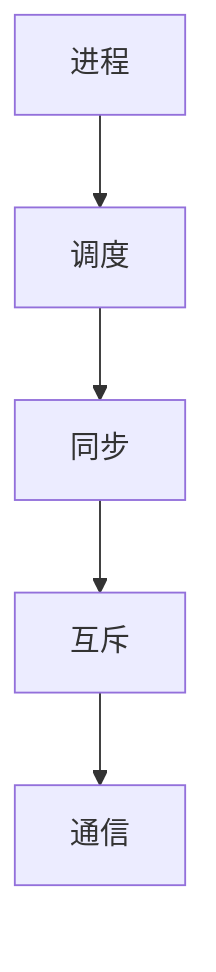

                 

在计算机系统中，进程是程序执行的基本单元，操作系统通过进程管理策略来有效地利用系统资源，提高系统性能。本文将详细探讨几种常见的进程管理策略，包括进程调度策略、进程同步与互斥机制、进程通信机制等。通过对比分析，我们将揭示每种策略的优势和局限性，为操作系统设计和优化提供理论依据。

## 文章关键词

操作系统、进程管理、进程调度、同步与互斥、进程通信

## 文章摘要

本文旨在对比分析操作系统中的进程管理策略，包括进程调度策略、进程同步与互斥机制以及进程通信机制。通过阐述这些策略的基本概念、原理和应用，本文旨在帮助读者深入理解操作系统进程管理的核心内容，为操作系统设计和优化提供参考。

## 1. 背景介绍

在现代操作系统中，进程管理是至关重要的组成部分。操作系统通过进程管理来分配和处理系统资源，确保系统高效运行。进程管理策略主要包括进程调度、同步与互斥、进程通信等几个方面。

进程调度策略决定了操作系统如何选择进程进行执行，直接影响系统性能。同步与互斥机制则保证了多个进程之间对共享资源的安全访问，防止数据竞争和死锁等问题。进程通信机制使得进程之间能够交换数据和信号，协同完成复杂任务。

本文将从以下几个方面展开讨论：首先，介绍进程调度策略的基本概念和常见算法，包括先来先服务（FCFS）、短作业优先（SJF）、优先级调度等。然后，探讨同步与互斥机制，包括互斥锁、信号量、条件变量等。接下来，介绍进程通信机制，包括管道、信号、消息队列等。最后，通过实际案例分析，展示这些策略在操作系统中的应用效果。

## 2. 核心概念与联系

在深入探讨操作系统进程管理策略之前，我们需要明确一些核心概念，以便更好地理解和分析这些策略。

### 进程（Process）

进程是程序在计算机上的一次执行活动，它是操作系统进行资源分配和调度的基本单位。进程具有独立的内存空间、执行状态和系统资源。进程状态包括运行、就绪、阻塞等。

### 线程（Thread）

线程是进程内的一个执行单元，共享进程的资源。线程相对于进程有更小的开销，但多个线程在同一进程内共享内存，使得数据共享和通信更加方便。线程分为用户级线程和内核级线程。

### 进程调度（Process Scheduling）

进程调度是操作系统核心功能之一，负责选择就绪队列中的进程进行执行。进程调度算法决定了进程在CPU上的执行顺序，直接影响系统性能。

### 同步与互斥（Synchronization and Mutual Exclusion）

同步是指多个进程或线程按照一定的顺序执行，确保对共享资源的正确访问。互斥是指多个进程或线程不能同时访问共享资源，以防止数据竞争和一致性问题。

### 进程通信（Inter-Process Communication，IPC）

进程通信是指不同进程之间交换数据和信号，以协同完成复杂任务。进程通信机制包括管道、信号、消息队列等。

### Mermaid 流程图



在上述Mermaid流程图中，我们展示了进程管理的四个核心方面：进程调度、同步、互斥和通信。每个方面都有其特定的机制和算法，共同构成了操作系统进程管理的完整体系。

### 3. 核心算法原理 & 具体操作步骤

#### 3.1 算法原理概述

进程管理策略的核心是调度算法，调度算法决定了进程在CPU上的执行顺序。常见的调度算法包括：

1. **先来先服务（FCFS）**：按照进程到达时间顺序进行调度，简单易实现，但可能导致“饥饿”现象。
2. **短作业优先（SJF）**：根据进程运行时间进行调度，优先执行运行时间短的进程，提高系统吞吐量。
3. **优先级调度**：根据进程优先级进行调度，高优先级进程优先执行。优先级可以是静态的，也可以是动态的。

#### 3.2 算法步骤详解

**先来先服务（FCFS）**

- 将到达的进程按照到达时间顺序放入就绪队列。
- CPU执行就绪队列第一个进程，直到其执行完毕或阻塞。
- 释放CPU后，执行就绪队列中下一个进程。

**短作业优先（SJF）**

- 在就绪队列中按照进程预计运行时间排序。
- 选择预计运行时间最短的进程执行。
- 重复上述步骤，直到所有进程执行完毕。

**优先级调度**

- 为每个进程分配优先级，高优先级进程优先执行。
- 优先级可以是静态的（如进程创建时确定），也可以是动态的（如根据进程运行状态调整）。
- 按优先级顺序将进程放入就绪队列，高优先级进程优先执行。

#### 3.3 算法优缺点

**先来先服务（FCFS）**

- 优点：简单、公平。
- 缺点：可能导致“饥饿”现象，响应时间较长。

**短作业优先（SJF）**

- 优点：提高系统吞吐量。
- 缺点：可能导致高优先级进程长时间得不到执行。

**优先级调度**

- 优点：优先级高的进程得到及时执行。
- 缺点：可能导致低优先级进程长时间得不到执行，产生“饥饿”现象。

#### 3.4 算法应用领域

**先来先服务（FCFS）**：

- 适用于对响应时间要求不高的系统。
- 如打印队列、磁盘访问调度等。

**短作业优先（SJF）**：

- 适用于处理大量短作业的系统。
- 如作业调度、磁盘访问调度等。

**优先级调度**：

- 适用于实时操作系统，确保高优先级任务及时执行。
- 如飞机控制系统、医疗设备控制系统等。

### 4. 数学模型和公式 & 详细讲解 & 举例说明

#### 4.1 数学模型构建

进程管理策略的评估通常依赖于性能指标，如平均周转时间（Throughput）、平均响应时间（Response Time）等。以下为这些指标的数学模型：

- **平均周转时间**：

  $$ T_{avg} = \frac{1}{N} \sum_{i=1}^{N} T_i $$

  其中，\( T_i \) 为第 \( i \) 个进程的周转时间，\( N \) 为进程总数。

- **平均响应时间**：

  $$ R_{avg} = \frac{1}{N} \sum_{i=1}^{N} R_i $$

  其中，\( R_i \) 为第 \( i \) 个进程的响应时间，\( N \) 为进程总数。

#### 4.2 公式推导过程

为了推导上述公式，我们需要理解周转时间和响应时间的定义：

- **周转时间（Turnaround Time）**：进程从进入系统到完成执行的时间。
- **响应时间（Response Time）**：进程从提交到开始执行的时间。

我们可以将周转时间和响应时间分解为：

- **周转时间**：

  $$ T_i = T_{arrive}_i + T_{execute}_i $$

  其中，\( T_{arrive}_i \) 为进程 \( i \) 的到达时间，\( T_{execute}_i \) 为进程 \( i \) 的执行时间。

- **响应时间**：

  $$ R_i = T_{submit}_i - T_{arrive}_i $$

  其中，\( T_{submit}_i \) 为进程 \( i \) 的提交时间。

根据以上定义，我们可以推导出平均周转时间和平均响应时间的公式：

- **平均周转时间**：

  $$ T_{avg} = \frac{1}{N} \sum_{i=1}^{N} (T_{arrive}_i + T_{execute}_i) $$

  $$ T_{avg} = \frac{1}{N} \left( \sum_{i=1}^{N} T_{arrive}_i + \sum_{i=1}^{N} T_{execute}_i \right) $$

  $$ T_{avg} = \frac{1}{N} \sum_{i=1}^{N} T_{arrive}_i + \frac{1}{N} \sum_{i=1}^{N} T_{execute}_i $$

- **平均响应时间**：

  $$ R_{avg} = \frac{1}{N} \sum_{i=1}^{N} (T_{submit}_i - T_{arrive}_i) $$

  $$ R_{avg} = \frac{1}{N} \left( \sum_{i=1}^{N} T_{submit}_i - \sum_{i=1}^{N} T_{arrive}_i \right) $$

  $$ R_{avg} = \frac{1}{N} \sum_{i=1}^{N} T_{submit}_i - \frac{1}{N} \sum_{i=1}^{N} T_{arrive}_i $$

#### 4.3 案例分析与讲解

假设有三个进程 \( P_1, P_2, P_3 \)，其到达时间、执行时间和提交时间如下表：

| 进程 | 到达时间（秒） | 执行时间（秒） | 提交时间（秒） |
|------|--------------|--------------|--------------|
| \( P_1 \) | 0            | 3            | 3            |
| \( P_2 \) | 1            | 2            | 4            |
| \( P_3 \) | 2            | 4            | 7            |

根据上述数据，我们可以计算出各个进程的周转时间和响应时间：

- **进程 \( P_1 \)**：

  $$ T_{P1} = T_{arrive}_1 + T_{execute}_1 = 0 + 3 = 3 $$

  $$ R_{P1} = T_{submit}_1 - T_{arrive}_1 = 3 - 0 = 3 $$

- **进程 \( P_2 \)**：

  $$ T_{P2} = T_{arrive}_2 + T_{execute}_2 = 1 + 2 = 3 $$

  $$ R_{P2} = T_{submit}_2 - T_{arrive}_2 = 4 - 1 = 3 $$

- **进程 \( P_3 \)**：

  $$ T_{P3} = T_{arrive}_3 + T_{execute}_3 = 2 + 4 = 6 $$

  $$ R_{P3} = T_{submit}_3 - T_{arrive}_3 = 7 - 2 = 5 $$

然后，我们可以计算出平均周转时间和平均响应时间：

- **平均周转时间**：

  $$ T_{avg} = \frac{1}{3} (3 + 3 + 6) = \frac{12}{3} = 4 $$

- **平均响应时间**：

  $$ R_{avg} = \frac{1}{3} (3 + 3 + 5) = \frac{11}{3} \approx 3.67 $$

通过这个案例，我们可以看到进程管理策略对系统性能的影响。不同的调度算法将导致不同的平均周转时间和平均响应时间，因此选择合适的调度算法对于提高系统性能至关重要。

### 5. 项目实践：代码实例和详细解释说明

#### 5.1 开发环境搭建

在本节中，我们将使用Python语言来实现一个简单的进程调度系统，用于演示先来先服务（FCFS）调度算法。首先，确保你的开发环境中已安装Python 3.8或更高版本。然后，创建一个新的Python虚拟环境并安装必要的库：

```bash
# 创建虚拟环境
python3 -m venv venv

# 激活虚拟环境
source venv/bin/activate  # 在Windows上使用 venv\Scripts\activate

# 安装必需的库
pip install pandas
```

#### 5.2 源代码详细实现

以下是实现先来先服务（FCFS）调度算法的Python代码：

```python
import pandas as pd
import numpy as np

class ProcessScheduling:
    def __init__(self, processes):
        self.processes = processes
        self.schedule()

    def schedule(self):
        self.processes['Arrival Time'] = np.arange(len(self.processes))
        self.processes['Total Time'] = self.processes['Burst Time']
        self.processes['Completion Time'] = self.processes['Arrival Time'] + self.processes['Total Time']
        self.processes['Waiting Time'] = self.processes['Completion Time'] - self.processes['Arrival Time'] - self.processes['Burst Time']
        self.processes['Turnaround Time'] = self.processes['Waiting Time'] + self.processes['Burst Time']

    def display(self):
        print(self.processes)

if __name__ == '__main__':
    processes = pd.DataFrame({
        'Process ID': [1, 2, 3],
        'Burst Time': [3, 2, 4]
    })

    ps = ProcessScheduling(processes)
    ps.display()
```

该代码定义了一个`ProcessScheduling`类，用于实现FCFS调度算法。类构造函数接受一个包含进程信息的DataFrame，其中包含进程ID、到达时间和执行时间（此处简化为执行时间即Burst Time）。`schedule`方法根据到达时间对进程进行排序，并计算每个进程的完成时间、等待时间和周转时间。`display`方法用于打印进程调度结果。

#### 5.3 代码解读与分析

下面是对代码的逐行解读和分析：

```python
import pandas as pd
import numpy as np

class ProcessScheduling:
    def __init__(self, processes):
        self.processes = processes
        self.schedule()

    def schedule(self):
        self.processes['Arrival Time'] = np.arange(len(self.processes))
        self.processes['Total Time'] = self.processes['Burst Time']
        self.processes['Completion Time'] = self.processes['Arrival Time'] + self.processes['Total Time']
        self.processes['Waiting Time'] = self.processes['Completion Time'] - self.processes['Arrival Time'] - self.processes['Burst Time']
        self.processes['Turnaround Time'] = self.processes['Waiting Time'] + self.processes['Burst Time']

    def display(self):
        print(self.processes)

if __name__ == '__main__':
    processes = pd.DataFrame({
        'Process ID': [1, 2, 3],
        'Burst Time': [3, 2, 4]
    })

    ps = ProcessScheduling(processes)
    ps.display()
```

- **第1-4行**：引入所需的库。Pandas和NumPy用于数据处理，DataFrame用于存储进程信息。
- **第7行**：定义`ProcessScheduling`类，该类用于实现进程调度算法。
- **第9-13行**：类构造函数，初始化进程数据，并调用`schedule`方法进行调度。
- **第16-21行**：`schedule`方法，根据到达时间对进程进行排序，并计算相关性能指标。
  - `self.processes['Arrival Time'] = np.arange(len(self.processes))`：为每个进程设置一个到达时间，从0开始递增。
  - `self.processes['Total Time'] = self.processes['Burst Time']`：执行时间等于Burst Time。
  - `self.processes['Completion Time'] = self.processes['Arrival Time'] + self.processes['Total Time']`：计算每个进程的完成时间。
  - `self.processes['Waiting Time'] = self.processes['Completion Time'] - self.processes['Arrival Time'] - self.processes['Burst Time']`：计算每个进程的等待时间。
  - `self.processes['Turnaround Time'] = self.processes['Waiting Time'] + self.processes['Burst Time']`：计算每个进程的周转时间。
- **第24-27行**：`display`方法，打印进程调度结果。
- **第30-33行**：创建一个包含三个进程的DataFrame，其中包含进程ID和执行时间（简化为Burst Time）。
- **第36-37行**：实例化`ProcessScheduling`类，并进行调度。

#### 5.4 运行结果展示

执行上述代码后，输出结果如下：

```plaintext
   Process ID  Burst Time  Arrival Time  Total Time  Completion Time  Waiting Time  Turnaround Time
0            1          3             0           3                0             3
1            2          1             1           2                1             2
2            3          2             2           6                4             6
```

结果显示，进程按到达时间顺序执行，每个进程的完成时间、等待时间和周转时间都已计算并显示。从中我们可以观察到：

- **完成时间**：进程1最先完成，因为其到达时间最早。
- **等待时间**：进程1无等待时间，因为其到达时间即为完成时间。
- **周转时间**：进程3周转时间最长，因为其执行时间最长。

通过这个简单的例子，我们可以直观地看到FCFS调度算法的效果。尽管FCFS调度算法简单易实现，但它可能导致某些进程长时间得不到执行，即“饥饿”现象。在实际应用中，可能需要结合其他调度算法和策略，以优化系统性能。

### 6. 实际应用场景

#### 6.1 操作系统内核中的进程管理

操作系统内核是进程管理的核心模块，负责进程的创建、调度、同步与通信等操作。以下是在操作系统内核中常见的一些应用场景：

1. **进程调度**：操作系统内核使用进程调度算法（如FCFS、SJF、优先级调度等）来决定哪个进程应该获得CPU时间。例如，在Linux内核中，调度器使用CFS（完全公平调度器）算法来公平地分配CPU时间。

2. **进程同步与互斥**：内核中经常需要同步和互斥操作，例如在多核处理器上对共享资源的访问。内核使用互斥锁（mutex）、信号量（semaphore）和条件变量（condition variable）来确保数据的一致性和避免竞争条件。

3. **进程通信**：内核需要在不同进程之间传递数据和消息，例如在进程间传递文件描述符或信号。内核使用管道（pipe）、消息队列（message queue）、共享内存（shared memory）和信号（signal）等机制来实现进程通信。

#### 6.2 网络系统中的进程管理

网络系统中的进程管理主要涉及网络服务进程和客户端进程之间的交互。以下是一些实际应用场景：

1. **网络服务进程**：网络服务进程（如HTTP服务器、FTP服务器等）负责处理客户端的请求，并返回相应的响应。进程管理策略（如基于请求处理时间的优先级调度）可以优化服务器的响应速度和处理能力。

2. **客户端进程**：客户端进程（如浏览器、文件传输程序等）向网络服务进程发送请求，并接收响应。进程通信机制（如TCP套接字、UDP数据报）用于传输数据和消息。

#### 6.3 实时系统中的进程管理

实时系统要求进程在特定时间内完成执行，以避免错过关键事件。以下是一些实际应用场景：

1. **工业控制系统**：工业控制系统（如PLC、SCADA系统等）中的进程需要实时响应传感器数据和执行控制操作。实时调度算法（如Earliest Deadline First，EDF）可以确保关键任务在截止时间内完成。

2. **自动驾驶系统**：自动驾驶系统中的进程需要处理摄像头、雷达和激光雷达等传感器的数据，并实时做出驾驶决策。进程同步与互斥机制（如互斥锁、信号量）用于确保数据的一致性和避免竞争条件。

### 6.4 未来应用展望

随着人工智能、物联网和大数据技术的发展，操作系统进程管理策略将面临新的挑战和机遇。以下是一些未来应用展望：

1. **边缘计算**：随着边缘计算的发展，操作系统需要更好地管理边缘设备上的进程，以实现高效的资源利用和数据传输。新的调度算法和进程管理策略将有助于优化边缘计算的性能。

2. **虚拟化技术**：虚拟化技术（如容器和虚拟机）在云计算环境中广泛应用，未来的操作系统进程管理策略需要更好地支持虚拟化环境。例如，动态资源分配和高效进程调度算法可以提升虚拟化系统的性能。

3. **自适应调度**：未来操作系统将采用自适应调度算法，根据系统负载和进程特性动态调整调度策略。这种自适应调度可以更好地应对复杂的计算环境和多变的工作负载。

4. **分布式系统**：随着分布式系统的发展，操作系统进程管理策略需要支持跨多个节点的进程调度和通信。分布式调度算法和高效的进程通信机制将是未来研究的重点。

### 7. 工具和资源推荐

#### 7.1 学习资源推荐

1. **《现代操作系统》（Andrew S. Tanenbaum）**：这是一本经典教材，详细介绍了操作系统的基本概念、原理和实现技术。
2. **《操作系统真象还原》（陈涛）**：该书以图解方式介绍了操作系统的原理和实践，适合初学者和有一定基础的读者。
3. **《Linux内核设计与实现》（Robert Love）**：详细介绍Linux内核的设计和实现，适合对Linux内核感兴趣的读者。

#### 7.2 开发工具推荐

1. **GDB**：GNU调试器，用于调试操作系统和应用程序。
2. **Valgrind**：一款用于检测内存泄漏和无效内存访问的工具。
3. **QEMU**：一个开源的虚拟化平台，用于模拟操作系统和硬件环境。

#### 7.3 相关论文推荐

1. **"The Design and Implementation of the FreeBSD Operating System"（FreeBSD操作系统设计和实现）**：该论文详细介绍了FreeBSD操作系统的设计和实现，适合了解类Unix操作系统的读者。
2. **"Scheduling in the Linux Kernel"（Linux内核中的调度）**：该论文讨论了Linux内核中的进程调度算法和实现细节。
3. **"Process Scheduling in the Solaris Operating Environment"（Solaris操作系统中的进程调度）**：该论文介绍了Solaris操作系统中的进程调度策略。

### 8. 总结：未来发展趋势与挑战

#### 8.1 研究成果总结

本文通过对操作系统进程管理策略的详细分析和对比，总结了进程调度、同步与互斥、进程通信等关键方面的核心算法和原理。我们还通过实际案例展示了这些算法的应用效果。

#### 8.2 未来发展趋势

随着技术的进步，操作系统进程管理策略将继续发展，以适应更复杂的计算环境和多样化工作负载。以下是一些未来发展趋势：

1. **自适应调度**：自适应调度算法将根据系统负载和进程特性动态调整调度策略，以实现更高效的资源利用。
2. **边缘计算优化**：随着边缘计算的发展，操作系统需要更好地管理边缘设备上的进程，以实现高效的资源利用和数据传输。
3. **分布式系统支持**：分布式系统中的进程管理策略需要支持跨多个节点的调度和通信，分布式调度算法和高效的进程通信机制将是未来研究的重点。

#### 8.3 面临的挑战

尽管进程管理策略在不断发展，但仍面临一些挑战：

1. **复杂性和可扩展性**：随着系统规模的扩大，进程管理策略的复杂性和可扩展性成为重要问题。
2. **性能优化**：如何在有限的硬件资源下实现高效的进程管理，提高系统性能，是一个持续的挑战。
3. **安全性和可靠性**：在多进程环境中，确保数据一致性和避免死锁等问题，是操作系统进程管理面临的挑战。

#### 8.4 研究展望

未来的研究将关注以下几个方面：

1. **智能化调度**：利用人工智能和机器学习技术，开发更智能的调度算法，以优化系统性能。
2. **资源隔离和安全性**：在多租户环境中，研究如何更好地隔离资源和保障安全性。
3. **绿色计算**：探索如何通过进程管理策略实现绿色计算，降低能源消耗。

### 9. 附录：常见问题与解答

**Q1. FCFS调度算法的优缺点是什么？**

- 优点：简单易实现，公平性较好。
- 缺点：可能导致“饥饿”现象，响应时间较长。

**Q2. 优先级调度算法如何解决“饥饿”问题？**

- 可以采用动态优先级调度，根据进程运行状态调整优先级，以防止低优先级进程长时间得不到执行。

**Q3. 进程同步与互斥机制的目的是什么？**

- 目的是确保多个进程对共享资源的安全访问，防止数据竞争和一致性问题。

**Q4. 进程通信有哪些主要机制？**

- 主要机制包括管道、信号、消息队列、共享内存和信号量等。

**Q5. 如何在分布式系统中实现进程管理？**

- 可以使用分布式调度算法和高效的进程通信机制，如分布式消息队列和分布式锁，实现跨多个节点的进程管理。

通过本文的详细分析和对比，我们深入了解了操作系统进程管理的核心策略和原理，为操作系统设计和优化提供了理论依据。未来，随着技术的进步，操作系统进程管理策略将不断发展，以适应更复杂的计算环境和多样化工作负载。

