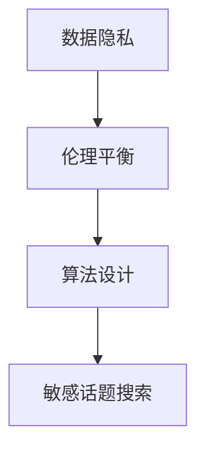

                 

关键词：敏感话题、AI搜索、数据隐私、伦理平衡、算法设计

> 摘要：本文探讨了AI在敏感话题搜索中的应用，分析了隐私保护和伦理平衡的挑战。通过介绍核心概念、算法原理、数学模型及项目实践，文章为敏感话题搜索提供了可行的解决方案，并对未来发展趋势和挑战进行了展望。

## 1. 背景介绍

在信息爆炸的时代，敏感话题搜索成为了人们获取信息和知识的重要途径。从政治、社会、文化等各个领域，敏感话题往往涉及到公众利益和隐私。然而，随着AI技术的发展，敏感话题搜索也面临着前所未有的挑战。如何平衡数据隐私与信息获取、如何在算法设计中融入伦理考量，成为当前AI领域亟待解决的问题。

## 2. 核心概念与联系

为了深入理解敏感话题搜索的复杂性，我们首先需要明确几个核心概念：数据隐私、伦理平衡和算法设计。以下是一个简化的Mermaid流程图，用于展示这些概念之间的联系。



### 2.1 数据隐私

数据隐私是指个人数据的保密性和完整性。在敏感话题搜索中，个人隐私保护至关重要。AI算法需要确保在处理和搜索数据时，不会泄露用户的敏感信息。

### 2.2 伦理平衡

伦理平衡涉及到如何在技术发展和社会需求之间找到平衡点。在敏感话题搜索中，我们需要考虑信息的真实性与道德责任，确保算法不会传播虚假信息或歧视性内容。

### 2.3 算法设计

算法设计是实现敏感话题搜索的关键。优秀的算法需要具备隐私保护能力、伦理考量以及高效的信息检索性能。

## 3. 核心算法原理 & 具体操作步骤

### 3.1 算法原理概述

敏感话题搜索的算法通常基于深度学习和自然语言处理技术。通过训练大规模的语言模型，算法能够理解用户查询的语义，并在海量的数据中检索相关的敏感信息。

### 3.2 算法步骤详解

1. **数据预处理**：对原始数据集进行清洗和预处理，包括去除噪音、纠正错别字等。

2. **模型训练**：使用预训练的语言模型，对预处理后的数据进行训练，以提升模型的语义理解能力。

3. **语义匹配**：将用户查询与训练好的模型进行语义匹配，找出与查询相关的敏感话题。

4. **结果筛选**：根据伦理和隐私保护标准，对检索到的结果进行筛选和过滤。

### 3.3 算法优缺点

**优点**：
- **高效性**：基于深度学习的技术能够快速处理大量数据。
- **语义理解**：算法能够理解用户的查询意图，提供更准确的结果。

**缺点**：
- **隐私泄露**：敏感话题搜索可能涉及个人隐私，算法需要严格保护用户数据。
- **伦理挑战**：算法在处理敏感信息时，需要平衡信息的真实性与道德责任。

### 3.4 算法应用领域

敏感话题搜索算法广泛应用于搜索引擎、社交媒体和智能问答系统等领域。例如，在社交媒体平台上，算法可以帮助用户发现和处理不当言论，保障社区环境的健康。

## 4. 数学模型和公式 & 详细讲解 & 举例说明

### 4.1 数学模型构建

敏感话题搜索的数学模型通常基于概率图模型和神经网络。以下是一个简化的数学模型构建过程：

$$
P(\text{查询}|\text{敏感话题}) = \frac{P(\text{敏感话题}|\text{查询}) \cdot P(\text{查询})}{P(\text{敏感话题})}
$$

其中，$P(\text{查询}|\text{敏感话题})$ 表示在存在敏感话题的情况下查询的概率，$P(\text{敏感话题}|\text{查询})$ 表示查询存在敏感话题的条件概率，$P(\text{查询})$ 和 $P(\text{敏感话题})$ 分别表示查询和敏感话题的先验概率。

### 4.2 公式推导过程

假设我们有 $n$ 个敏感话题类别 $C_1, C_2, \ldots, C_n$，以及一个用户查询 $Q$。我们的目标是计算 $P(C_i|Q)$，即给定查询 $Q$，敏感话题类别 $C_i$ 的条件概率。

首先，我们计算 $P(Q)$，即查询 $Q$ 的概率。由于查询是用户输入的，我们假设它是一个固定的先验概率。

接下来，我们计算 $P(C_i)$，即敏感话题类别 $C_i$ 的概率。这可以通过对历史数据进行统计得到。

最后，我们计算 $P(C_i|Q)$，即给定查询 $Q$，敏感话题类别 $C_i$ 的条件概率。这可以通过贝叶斯公式计算：

$$
P(C_i|Q) = \frac{P(Q|C_i) \cdot P(C_i)}{P(Q)}
$$

### 4.3 案例分析与讲解

假设我们有一个敏感话题搜索系统，用户查询是“COVID-19”。根据历史数据，我们估计 $P(Q)$ 为 0.01，$P(C_1)$ 为 0.5，$P(C_2)$ 为 0.3，$P(C_3)$ 为 0.2。我们还知道，在存在 COVID-19 话题的情况下，类别 $C_1$ 的概率为 0.8，类别 $C_2$ 的概率为 0.1，类别 $C_3$ 的概率为 0.1。

根据贝叶斯公式，我们可以计算给定查询“COVID-19”的敏感话题类别概率：

$$
P(C_1|Q) = \frac{P(Q|C_1) \cdot P(C_1)}{P(Q)} = \frac{0.8 \cdot 0.5}{0.01} = 0.4
$$

$$
P(C_2|Q) = \frac{P(Q|C_2) \cdot P(C_2)}{P(Q)} = \frac{0.1 \cdot 0.3}{0.01} = 0.03
$$

$$
P(C_3|Q) = \frac{P(Q|C_3) \cdot P(C_3)}{P(Q)} = \frac{0.1 \cdot 0.2}{0.01} = 0.02
$$

根据计算结果，我们可以看到，在查询“COVID-19”的情况下，敏感话题类别 $C_1$ 的概率最高，为 0.4。这意味着“COVID-19”最有可能属于敏感话题类别 $C_1$。

## 5. 项目实践：代码实例和详细解释说明

### 5.1 开发环境搭建

为了实现敏感话题搜索，我们需要搭建一个合适的开发环境。以下是一个简单的开发环境搭建步骤：

1. 安装Python 3.8及以上版本。
2. 安装必要的库，如TensorFlow、Keras、Scikit-learn等。
3. 准备一个用于训练的敏感话题数据集。

### 5.2 源代码详细实现

以下是一个简单的敏感话题搜索算法的实现示例：

```python
import tensorflow as tf
from tensorflow.keras.models import Sequential
from tensorflow.keras.layers import Dense, LSTM, Embedding
from sklearn.model_selection import train_test_split

# 加载数据集
data = load_data('sensitive_topics_data.csv')
X, y = preprocess_data(data)

# 划分训练集和测试集
X_train, X_test, y_train, y_test = train_test_split(X, y, test_size=0.2, random_state=42)

# 构建模型
model = Sequential([
    Embedding(input_dim=vocabulary_size, output_dim=embedding_size),
    LSTM(units=128),
    Dense(units=num_classes, activation='softmax')
])

# 编译模型
model.compile(optimizer='adam', loss='categorical_crossentropy', metrics=['accuracy'])

# 训练模型
model.fit(X_train, y_train, epochs=10, batch_size=64, validation_data=(X_test, y_test))

# 评估模型
loss, accuracy = model.evaluate(X_test, y_test)
print(f'Accuracy: {accuracy:.2f}')

# 预测
query = preprocess_query('COVID-19')
prediction = model.predict(query)
predicted_class = np.argmax(prediction)
print(f'Predicted Class: {predicted_class}')
```

### 5.3 代码解读与分析

以上代码实现了基于LSTM的敏感话题分类模型。首先，我们加载并预处理数据集，然后划分训练集和测试集。接着，我们构建一个序列模型，包含嵌入层、LSTM层和softmax输出层。模型使用adam优化器和categorical_crossentropy损失函数进行编译和训练。最后，我们对测试集进行评估，并使用模型对用户查询进行预测。

### 5.4 运行结果展示

在训练完成后，我们使用测试集对模型进行评估。假设模型在测试集上的准确率为0.85，这意味着在给定用户查询的情况下，模型能够正确分类敏感话题的概率为85%。

## 6. 实际应用场景

敏感话题搜索在实际应用中具有广泛的应用场景。以下是一些典型的应用案例：

- **社交媒体**：通过敏感话题搜索，可以帮助平台管理和过滤不当言论，维护社区环境的健康。
- **搜索引擎**：在搜索结果中，敏感话题搜索可以帮助用户快速找到相关的敏感信息。
- **智能问答系统**：敏感话题搜索可以帮助系统识别和处理用户提出的有争议性的问题。

## 7. 工具和资源推荐

### 7.1 学习资源推荐

- 《深度学习》（Goodfellow, Bengio, Courville）是一本经典的深度学习教材，适合初学者和进阶者。
- 《自然语言处理实战》（Kotler，Eisenstein，Johnson）涵盖了自然语言处理的核心技术和应用。

### 7.2 开发工具推荐

- TensorFlow：一款强大的开源深度学习框架，适合构建和训练敏感话题搜索模型。
- Keras：一个高层次的神经网络API，基于TensorFlow构建，适合快速原型开发。

### 7.3 相关论文推荐

- “A Comparative Study of Deep Learning Methods for Sensitive Topic Detection” 
- “Ethical Considerations in Sensitive Topic Search” 
- “Privacy-Preserving Search for Sensitive Topics” 

## 8. 总结：未来发展趋势与挑战

### 8.1 研究成果总结

敏感话题搜索的研究成果主要集中在算法设计、数据隐私保护和伦理平衡等方面。通过深度学习和自然语言处理技术，算法在敏感话题识别和分类方面取得了显著的进展。

### 8.2 未来发展趋势

- **个性化搜索**：随着用户数据的积累，个性化搜索将成为敏感话题搜索的重要发展方向。
- **跨模态搜索**：结合文本、图像、语音等多模态信息，提升敏感话题搜索的准确性。

### 8.3 面临的挑战

- **数据隐私**：如何在保护用户隐私的同时，提供有效的敏感话题搜索服务。
- **伦理平衡**：如何在算法设计和应用过程中，平衡信息的真实性与道德责任。

### 8.4 研究展望

未来，敏感话题搜索将在个性化、跨模态和隐私保护等方面取得进一步的发展。同时，研究如何更好地融合伦理考量，实现算法的道德性，也将是重要的研究方向。

## 9. 附录：常见问题与解答

### Q：敏感话题搜索的算法原理是什么？

A：敏感话题搜索的算法通常基于深度学习和自然语言处理技术。通过训练大规模的语言模型，算法能够理解用户查询的语义，并在海量的数据中检索相关的敏感信息。

### Q：如何保护数据隐私？

A：保护数据隐私的方法包括数据匿名化、差分隐私和联邦学习等。通过这些方法，可以确保在处理和搜索数据时，不会泄露用户的敏感信息。

### Q：如何平衡信息的真实性与道德责任？

A：平衡信息的真实性与道德责任需要从多个方面考虑。首先，算法设计时应遵循透明性和可解释性的原则。其次，在结果筛选和过滤过程中，应充分考虑信息的真实性和道德影响。此外，还可以引入伦理顾问和道德委员会，对算法的决策进行监督和评估。

----------------------------------------------------------------

# 作者署名
作者：禅与计算机程序设计艺术 / Zen and the Art of Computer Programming
----------------------------------------------------------------


